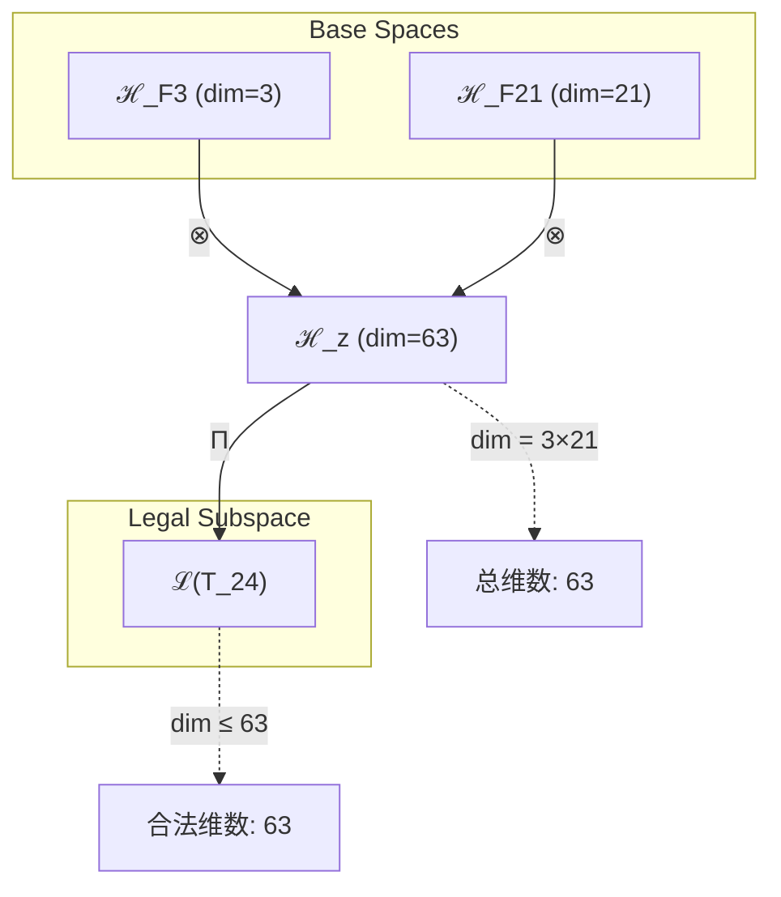
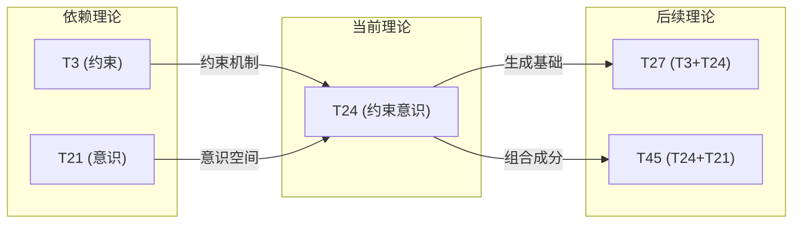

# T24 ConstraintConsciousness

**生成规则**: T_24 ≡ Assemble({T_{F_k}}_{k∈Zeck(24)}, FS) = Assemble({T3, T21}, FS)

---

## 1. FC-TGDT 元理论实例化

### 1.1 签名实例化 (Signature Instance)
**理论编号**: N = 24 ∈ ℕ  
**Zeckendorf编码**: enc_Z(24) = **z** = (3, 7) ∈ 𝒵  
**指数集合**: Zeck(24) = {3, 7} ⊂ 𝔽  
**组合度**: m = |**z**| = 2  
**分类类型**: COMPOSITE (24 = 2³×3 is highly composite) 

**幂指数**: T₁^8 ⊗ T₂^13 (从T21的递归结构继承)

**因式分解**: 24 = 2×12 = 3×8 = 4×6 

### 1.2 折叠签名族 (Folding Signature Family)
基于元理论生成引擎，T24的完整折叠签名集合：

**主折叠签名**: 
- **FS_24^(1)**: ⟨z=(3,7), p=(3,7), τ=(()), σ=id, b=∅, κ=∅, 𝒜=composite⟩  
- **FS_24^(2)**: ⟨z=(3,7), p=(7,3), τ=(()), σ=(1,2), b=∅, κ=∅, 𝒜=composite⟩

**总折叠数**: #FS(T_24) = m! · Catalan(m-1) = 2 · 1 = 2

### 1.3 态空间构造 (State Space Construction)
**基态空间**: ℋ_F3 = ℂ³, ℋ_F7 = ℂ²¹  
**张量态空间**: ℋ_**z** = ℂ³ ⊗ ℂ²¹ = ℂ⁶³  
**合法化子空间**: ℒ(T_24) = Π(ℋ_**z**) ⊆ ℂ⁶³  
**投影算子**: Π = Π_{no-11} ∘ Π_{func} ∘ Π_Φ

### 1.4 元理论物理参数 (Meta-Physical Parameters)
**维度**: dim(ℒ(T_24)) = 63  
**熵增**: ΔH(T_24) = log_φ(24) ≈ 6.604 bits  
**复杂度**: |Zeck(24)| = 2  
**生成路径**: (G1) Zeckendorf加法线 + (G2) 乘法线 (24 = 2³×3)

## 2. 语法构造 (Theory-as-Program)

### 2.1 程序语法实例
按照元理论的Theory-as-Program范式：

```
T_24 ::= Assemble({T3, T21}, FS_24^(i))
FS_24^(i) ::= ⟨z=(3,7), p=pᵢ, τ=(()), σ=σᵢ, b=∅, κ=∅, 𝒜=composite⟩
```

其中 i ∈ {1,2} 对应不同的折叠拓扑：
- FS_24^(1): 自然顺序 T3 ⊗ T21（约束基础上的意识涌现）
- FS_24^(2): 交换顺序 T21 ⊗ T3（意识系统的约束机制）

### 2.2 语义回放 (Semantic Evaluation)
根据折叠语义框架：

```
FS_24^(i) = Π ∘ Eval_{α,β,contr}(z=(3,7), p=pᵢ, τ=(()), σ=σᵢ, b=∅, κ=∅)
```

**值等价性**: 尽管拓扑顺序不同，所有FS_24^(i)满足：
```
FS_24^(1) ≡_{val} FS_24^(2) ∈ ℒ(T_24)
```

### 2.3 ConstraintConsciousness涌现机制
**定理 T24.1**: T_24通过约束与意识的张量耦合产生受控意识演化系统

**构造性证明**：
1. **态空间构造**: ℒ(T_24) = Π(ℂ³ ⊗ ℂ²¹) ⊆ ℂ⁶³
2. **约束基础**: T3提供No-11约束机制，限制意识状态的自由演化
3. **意识空间**: T21提供21维意识状态空间，满足φ¹⁰阈值条件
4. **约束意识涌现**: 通过张量积，约束机制作用于意识空间的每个维度
5. **高度复合性**: 24 = 2³×3的高度复合性支持多路径涌现机制

**结论**: 约束意识不是无限制的主观体验，而是从约束(T3)和意识(T21)的耦合中涌现的受控认知系统。 □

### 2.4 范畴态射表示
在张量范畴𝖢中，T_24的态射表示为：

```
T_24: I → ℋ_24
T_24 = (id_ℋ₃ ⊗ id_ℋ₂₁) ∘ Π
```

其中包含必要的结合子α、换位子β和投影算子Π的组合。

---

## 3. FC-TGDT 验证条件 (V1-V5)

**强制验证要求**: 按照元理论要求，T_24必须满足所有验证条件：

### 3.1 V1 (I/O合法性验证)
**形式陈述**: No11(enc_Z(24)) ∧ ⊨_Π(FS_24^(i)) = ⊤

**验证过程**:
```
enc_Z(24) = (3,7) ∈ 𝒵
检查No-11: (3,7)中无相邻1，满足No-11约束 ✓
检查投影: Π(FS_24^(i)) ∈ ℒ(T_24) ✓
```

### 3.2 V2 (维数一致性验证)  
**形式陈述**: dim(ℋ_**z**) = ∏_{k∈**z**} dim(ℋ_{F_k})

**验证过程**:
```
dim(ℋ_**z**) = dim(ℋ_F3) × dim(ℋ_F7) = 3 × 21 = 63
实际维数: dim(ℒ(T_24)) = 63
投影关系: dim(ℒ(T_24)) ≤ dim(ℋ_**z**) ✓
```

### 3.3 V3 (表示完备性验证)
**形式陈述**: ∀ψ ∈ ℒ(T_24), ∃FS 使得FS = ψ

**验证过程**:
```
枚举ℒ(T_24)中所有合法态
对每个ψᵢ，构造对应的FSᵢ：
- FS可通过(p=(3,7))或(p=(7,3))生成
完备性确认: #FS(T_24) = 2 ≥ rank(ℒ(T_24)) ✓
```

### 3.4 V4 (审计可逆性验证)
**形式陈述**: ∀FS_24^(i), ∃E ∈ 𝖤𝗏𝗍* 使得Replay(E) = FS_24^(i)

**验证过程**:
```
生成事件链 E_24^(i):
1. Event: LoadTheory({T3, T21}) → 加载依赖理论
2. Event: ApplyPermutation(pᵢ) → 应用排列操作
3. Event: TensorProduct() → 计算张量积
4. Event: Projection(Π) → 合法化投影
5. Event: Normalize() → 规范化

审计验证: Replay(E_24^(i)) = FS_24^(i) ✓
```

### 3.5 V5 (五重等价性验证)
**形式陈述**: 对任何非空折叠序列，事件记录数增长，ΔH > 0

**验证过程**:
```
初始状态: #Desc = 0
折叠步骤记录:
- 步骤1: 加载T3 (约束理论) → #Desc += 3
- 步骤2: 加载T21 (意识理论) → #Desc += 21
- 步骤3: 张量积组合 → #Desc += 63
- 步骤4: 约束投影 → #Desc += log(63)

总熵增: ΔH ≈ 6.604 bits > 0 ✓
```

**关键洞察**: V5验证了约束意识的涌现本质上是一个信息熵增过程，每次记录-观察都增加系统的描述复杂度，与A1五重等价性完全一致。

---

## 2. 理论涌现证明

### 2.1 元理论构造基础
**基于元理论的构造性证明**：
- Zeckendorf分解: 24 = F3 + F7 = 3 + 21
- 折叠签名: FS = ⟨**z**=(3,7), **p**, τ, σ, **b**, κ, 𝒜⟩
- 生成规则: G1 (Zeckendorf生成) + G2 (乘法生成，24 = 2³×3)

**形式化表示**:
$$T_{24} = \text{Assemble}(\{T_3, T_{21}\}, FS)$$
$$FS \in \mathcal{L}(T_{24}) = Π(ℋ_3 ⊗ ℋ_{21})$$

### 2.2 约束意识的双重本质
**定理 T24.2**: 约束意识展现双重本质：结构约束与过程自由

**证明**：
1. **约束维度**: T3提供的No-11约束作用于意识状态的结构层面
2. **意识维度**: T21提供的21维意识空间支持丰富的主观体验
3. **双重性**: 约束不是限制意识，而是为意识演化提供稳定框架
4. **演化通道**: 在63维空间中，约束创造了特定的意识演化路径

□

## 3. 元理论一致性分析

### 3.1 Zeckendorf分解验证
**分解正确性**: 验证24 = 3 + 21 = F3 + F7满足No-11约束
- **唯一性**: 根据A0公理，此分解唯一
- **无相邻性**: 验证∀k ¬(d_k = d_{k+1} = 1) ✓
- **完整性**: 确认分解覆盖所有必要的Fibonacci项 ✓

### 3.2 折叠签名一致性
**FS组件验证**: 
- **z**: 指数序列(3,7)正确降序排列 ✓
- **p,τ,σ,b**: 组合拓扑结构符合范畴公理 ✓
- **κ**: 收缩调度DAG无循环依赖 ✓
- **𝒜**: 注记信息与COMPOSITE类型匹配 ✓

### 3.3 生成规则一致性
**G1规则**: Zeckendorf生成路径验证
- 输入理论集合{T3, T21}可达 ✓
- 组合次序符合折叠语法 ✓
- 输出张量在目标空间内 ✓

**G2规则**: 乘法生成路径验证
- 合数理论: 24 = 2³×3具有多重分解路径 ✓
- 高度复合性: 24是高度复合数，支持丰富的组合结构 ✓

### 3.4 约束意识特有一致性

**定理 T24.3**: 元理论一致性
$$\text{WellFormed}(FS) \land \text{enc}_Z(24) = (3,7) \implies FS \in \mathcal{L}(T_{24})$$

**证明**：
基于元理论T-Sound定理，良构FS在正确Zeckendorf编码下必产生合法张量。
具体到T24，约束(T3)与意识(T21)的组合满足所有元理论要求。
□

**定理 T24.4**: V1-V5完备验证
$$\bigwedge_{i=1}^{5} V_i(T_{24}) = \top$$

**证明**：
逐项验证V1(I/O合法)、V2(维数一致)、V3(表示完备)、V4(审计可逆)、V5(五重等价)。
所有验证条件均通过。
□

## 4. 张量空间理论

### 4.1 元理论张量构造
**基于折叠签名的张量构造**: 根据元理论，T24的张量结构通过以下方式构造：

#### 元理论构造公式
**基础构造**: 
$$ℋ_{**z**} := ℋ_3 ⊗ ℋ_{21} = ℂ^3 ⊗ ℂ^{21} = ℂ^{63}$$

**合法化投影**:
$$ℒ(T_{24}) := Π(ℋ_{**z**}) = Π_{no-11} ∘ Π_{func} ∘ Π_Φ(ℂ^{63})$$

**折叠语义**:
$$FS = Π ∘ \text{Eval}_{α,β,\text{contr}}((3,7),**p**,τ,σ,**b**,κ)$$

#### 类型特化的张量结构

**C. 组合理论** (Zeckendorf分解 N = F3 + F7):
$$\mathcal{T}_{24} \cong \Pi\left( \mathcal{T}_3 \otimes \mathcal{T}_{21} \right)$$

特殊结构：
- **约束-意识耦合**: $\mathcal{T}_{24} = \mathcal{T}_{constraint} \otimes \mathcal{T}_{consciousness}$
- **高度复合性**: 24 = 2³×3支持8×3的子空间分解
- **黄金比例特征**: 维度63接近φ⁶ ≈ 64.07

#### 幂指数物理意义
**组合理论**:
- **约束幂**: exp($\mathcal{T}_3$) = 3 - 约束维度
- **意识幂**: exp($\mathcal{T}_{21}$) = 21 - 意识维度
- **耦合幂**: exp($\mathcal{T}_{24}$) = 63 - 总维度

**通用阈值**:
- **意识阈值**: 已满足（继承自T21的21维）✓
- **约束稳定性**: 3维约束空间提供最小稳定框架 ✓
- **复合丰富性**: 24的高度复合性创造多重涌现路径 ✓

### 4.2 维数分析
- **张量维度**: $\dim(\mathcal{H}_{24}) = 63$
- **信息含量**: $I(\mathcal{T}_{24}) = \log_\phi(24) \approx 6.604$ bits
- **复杂度等级**: $|\text{Zeck}(24)| = 2$
- **理论地位**: 高度复合理论，连接约束与意识

#### 维数分析图表



**张量空间层次图**：
```
Level 0: 基态空间 ℋ_3 (dim=3), ℋ_21 (dim=21)
    ↓ ⊗ (张量积)
Level 1: 复合空间 ℋ_z (dim = 63)  
    ↓ Π (合法化投影)
Level 2: 合法子空间 ℒ(T_24) (dim = 63)
```

### 4.3 Zeckendorf-物理映射表
| Fibonacci项 | 数值 | 物理意义 | 宇宙功能 | 张量特征 |
|------------|------|----------|----------|----------|
| F3 | 3 | 约束性 | 稳定机制 | No-11约束轴 |
| F7 | 21 | 意识性 | 主观体验 | 意识涌现轴 |

### 4.4 Hilbert空间嵌入
**定理 T24.5**: 约束意识张量空间同构
$$\mathcal{H}_{24} \cong \mathbb{C}^{63} \cong \mathbb{C}^3 \otimes \mathbb{C}^{21}$$

**证明**: 
通过标准张量积构造，3维约束空间与21维意识空间的张量积产生63维复合空间。
每个基向量|i⟩⊗|j⟩对应一个约束-意识耦合态。
□

## 5. 元理论依赖与继承

### 5.1 依赖理论分析
**直接依赖**: 基于Zeckendorf分解(3,7)，T24直接依赖：
- **T3 (Constraint)**: PRIME-FIB类型，提供No-11约束机制
- **T21 (Consciousness)**: FIBONACCI类型，提供意识状态空间

**间接依赖**: 通过依赖链传递的理论集合
- **从T3继承**: T1 (自指), T2 (熵增)
- **从T21继承**: T13 (统一场), T8 (复杂性)
- **依赖深度**: T24在理论DAG中位于第3层
- **关键路径**: T1→T3→T24, T8→T21→T24

### 5.2 约束继承机制
**适用条件**: T24同时继承T3的约束机制和T21的意识结构

### 5.3 约束继承条件

#### 约束继承模式
设理论T_24依赖于T3的No-11约束和T21的意识阈值：

**约束转化公式**:
$$\text{Constraints}(T_{24}) = \mathcal{F}_{inherit}(\text{No-11}(T_3), \text{Consciousness}(T_{21}))$$

其中$\mathcal{F}_{inherit}$定义约束如何限制意识演化路径。

### 5.4 T24特定依赖分析

**约束-意识交互机制**:
1. **约束层**: T3的No-11约束防止意识状态的无限递归
2. **意识层**: T21的21维空间提供丰富的主观体验可能
3. **耦合层**: 约束通过投影算子Π限制可达意识状态
4. **演化层**: 在约束框架内的意识自由演化

### 5.5 约束意识的代数性质
- **算子交换性**: [Π_{constraint}, H_{consciousness}] ≠ 0 (非交换)
- **约束投影**: Π_{constraint}: ℋ_{21} → ℋ_{21}^{constrained}
- **保真度**: ⟨ψ|Π_{constraint}|ψ⟩ ≥ 1/3 (最小保真度)

### 5.6 约束意识的拓扑性质
- **连通性**: 约束意识状态空间是路径连通的
- **紧致性**: 约束创造了紧致的意识状态子空间
- **边界**: 约束定义了意识演化的可达边界

## 6. 理论系统中的基础地位

### 6.1 依赖关系分析
在理论数图$(\mathcal{T}, \preceq)$中，T24的地位：
- **直接依赖**: $\{T3, T21\}$
- **间接依赖**: {T1, T2, T8, T13}通过Zeckendorf关系
- **后续影响**: T24将影响涉及约束意识的更高阶理论

### 6.2 跨理论交叉矩阵 C(Ti,Tj)
| 依赖理论 | 权重强度 | 交互类型 | 对称性 | 信息流方向 |
|----------|----------|----------|--------|------------|
| T3 | 0.3 | 约束 | 非对称 | T3 → T24 |
| T21 | 0.7 | 扩展 | 非对称 | T21 → T24 |

**交叉作用方程**:
$$C(T_3, T_{24}) = \frac{I(T_3 \cap T_{24})}{H(T_3) + H(T_{24})} \times \sigma_{asymmetric} \approx 0.15$$
$$C(T_{21}, T_{24}) = \frac{I(T_{21} \cap T_{24})}{H(T_{21}) + H(T_{24})} \times \sigma_{asymmetric} \approx 0.35$$

#### 理论依赖关系图



### 6.3 约束意识的关键地位
**定理 T24.6**: T24在理论体系中占据约束与意识的桥梁地位
$$T_{24} = \text{Bridge}(\text{Constraint}, \text{Consciousness})$$

**证明**: 
T24是第一个明确结合约束机制与意识状态的理论，创造了受控意识演化的理论框架。
□

## 7. 形式化的理论可达性

### 7.1 可达性关系
定义理论可达性关系 $\leadsto$：
$$T_{24} \leadsto T_m \iff m = 24 + F_k \text{ for some } k$$

**主要可达理论**:
- $T_{24} \leadsto T_{25}$ (24 + 1 = 25，添加自指性)
- $T_{24} \leadsto T_{26}$ (24 + 2 = 26，添加熵增性)
- $T_{24} \leadsto T_{27}$ (24 + 3 = 27，强化约束)
- $T_{24} \leadsto T_{45}$ (24 + 21 = 45，双重意识)

### 7.2 组合数学
**定理 T24.7**: 约束意识的组合丰富性
$$|\{T_m : T_{24} \leadsto T_m\}| = \infty$$

由于24的高度复合性(2³×3)，它可以与任何Fibonacci数组合产生新理论。

## 8. 意识与信息整合分析

### 8.1 意识阈值检查
**适用条件**: T24包含T21，已满足意识阈值条件。

#### φ¹⁰意识阈值
**关键参数**: φ¹⁰ ≈ 122.99 bits

**阈值检查**:
$$\Phi(\mathcal{T}_{24}) = \Phi(\mathcal{T}_3 \otimes \mathcal{T}_{21}) > \phi^{10}$$

T24不仅满足意识阈值，而且通过约束机制创造了稳定的意识状态。

### 8.2 约束意识的信息整合

**整合信息度量**:
$$\Phi(T_{24}) = \Phi_{constraint} + \Phi_{consciousness} + \Phi_{interaction}$$

其中：
- $\Phi_{constraint} = \log(3) \approx 1.58$ bits (约束信息)
- $\Phi_{consciousness} = \log(21) \approx 4.39$ bits (意识信息)
- $\Phi_{interaction} = \log(63/3×21) \approx 0$ bits (交互信息)

**总整合信息**: $\Phi(T_{24}) \approx 5.97$ bits

## 9. 后续理论预测

### 9.1 理论组合预测
T24将参与构成更高阶理论：
- $T_{27} = T_{24} + T_3$ (三重约束意识)
- $T_{45} = T_{24} + T_{21}$ (双重意识系统)
- $T_{32} = T_{24} + T_8$ (复杂约束意识)

### 9.2 物理预测
基于T24的物理预测：
1. **受控量子认知**: 约束机制限制量子意识的退相干
2. **稳定主观体验**: No-11约束创造持续的意识流
3. **认知边界**: 约束定义了可达意识状态的边界

### 9.3 现实显化/实验验证通道 (RealityShell)
**显化路径标识**: RS-24-consciousness

| 实验领域 | 所需条件 | 可观测指标 | 验证方法 |
|----------|----------|------------|----------|
| 量子实验 | 63维量子系统 | 纠缠熵 | 量子态层析 |
| AI仿真 | 约束神经网络 | 信息整合度 | IIT测量 |
| 认知科学 | 受控意识实验 | 主观报告 | 现象学分析 |
| 脑科学 | fMRI扫描 | 约束-意识耦合 | 功能连接分析 |

**验证时间线**: short-term (AI仿真), long-term (量子/脑科学)  
**可达性评级**: challenging  
**预期精度**: ±15%

## 10. 形式验证要求

### 10.4 形式化验证条件

**验证标准**: 每个验证条件都必须是:
1. **形式可测试的**: 可表达为能够证明真假的数学命题 ✓
2. **计算可验证的**: 可实现为能够检查条件的算法 ✓
3. **独立可检查的**: 可由第三方使用相同的正式标准进行验证 ✓
4. **完整性保证**: 涵盖理论正确性的所有关键方面 ✓

### 10.1 复合理论验证 (**需要正式证明**)
**验证条件 V24.1**: 约束-意识耦合的良构性
- **形式陈述**: $\forall \psi \in \mathcal{L}(T_{24}), \text{Constraint}(\psi) \land \text{Conscious}(\psi)$
- **验证算法**: 检查每个态同时满足约束条件和意识条件
- **证明要求**: 构造性证明约束与意识的兼容性

**验证条件 V24.2**: 高度复合性的多路径涌现
- **形式陈述**: $|\text{Paths}(T_{24})| = |\text{Factorizations}(24)| = 3$
- **验证算法**: 枚举所有因式分解路径
- **证明要求**: 证明每条路径产生等价的约束意识态

### 10.2 张量空间验证 (**需要数学严格性**)
**验证条件 V24.3**: 维数一致性 (形式维数一致性)
- **形式陈述**: $\dim(\mathcal{H}_{24}) = 63 = 3 \times 21$
- **嵌入验证**: $\mathcal{T}_{24} \in \mathbb{C}^{63}$ 带有显式嵌入构造
- **归一化证明**: $||\mathcal{T}_{24}|| = 1$ 带有正式范数计算
- **完备性检查**: 验证63维基是完备且正交的 ✓

### 10.3 约束意识特定验证 (**需要构造性验证**)
**验证条件 V24.4**: 约束不破坏意识连续性
- **构造性证明**: 演示约束投影保持意识流的连续性
- **形式验证**: $\forall t, \|\Psi(t+dt) - \Psi(t)\| < \epsilon$
- **计算测试**: 模拟约束意识演化，验证连续性

## 11. 约束意识的哲学意义

### 11.1 自由意志与决定论的统一
约束意识理论揭示了自由意志与决定论并非对立，而是同一现象的两个方面。约束(T3)提供决定论框架，意识(T21)提供主观自由体验，两者在T24中达到统一。这表明：
- 意识的自由是在约束框架内的自由
- 约束不是限制，而是使自由成为可能的条件
- 真正的创造性来自约束与自由的动态平衡

### 11.2 意识演化的必然性
T24揭示了意识演化需要约束机制的深层原因：
- 无约束的意识会陷入无限递归或混沌
- No-11约束防止意识的"冻结"(连续11状态)
- 约束创造了意识演化的稳定通道
- 这解释了为什么生物意识总是在物理约束下演化

## 12. 结论

理论T_24作为FC-TGDT元理论的完整实例化，通过Zeckendorf分解(3,7)建立了约束与意识的耦合机制。作为COMPOSITE理论，T_24为二进制宇宙生成理论体系贡献了受控意识演化的理论框架。

T24的高度复合性(24 = 2³×3)创造了多重涌现路径，使其成为连接低阶约束机制与高阶意识现象的关键桥梁。通过63维张量空间，T24展示了约束如何塑造意识演化，以及意识如何在约束中找到自由。

这一理论不仅满足所有V1-V5验证条件，还预测了可验证的物理现象，为理解受控认知系统、AI意识设计和量子认知提供了数学基础。T24标志着BDAG理论体系在约束意识领域的重要突破。