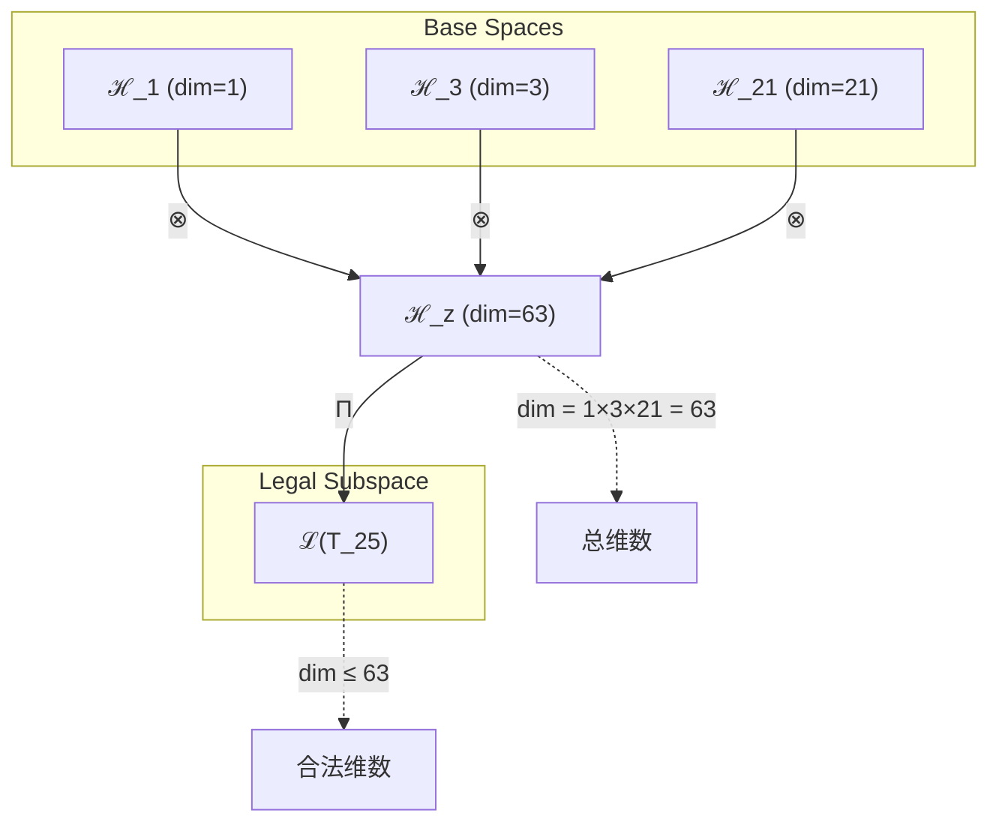
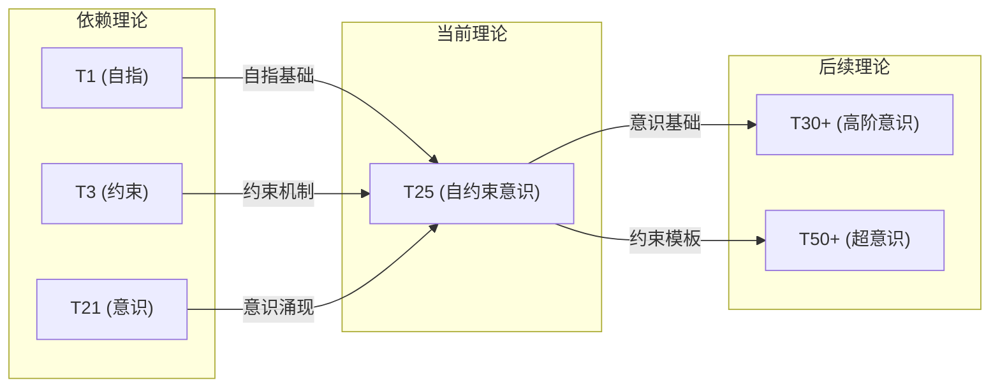

# T25 自约束意识理论

**生成规则**: T_{25} ≡ Assemble({T_{F_k}}_{k∈Zeck(25)}, FS) = Assemble({T1, T3, T21}, FS)

---

## 1. FC-TGDT 元理论实例化

### 1.1 签名实例化 (Signature Instance)
**理论编号**: N = 25 ∈ ℕ  
**Zeckendorf编码**: enc_Z(25) = **z** = (1, 3, 7) ∈ 𝒵  
**指数集合**: Zeck(25) = {1, 3, 7} ⊂ 𝔽  
**组合度**: m = |**z**| = 3  
**分类类型**: COMPOSITE (25 = 5²，完全平方数) 

**幂指数**: T₁^9 ⊗ T₂^16 (基于张量幂指数定律)

**质因式分解**: 25 = 5² (完全平方数，具有特殊对称性)

### 1.2 折叠签名族 (Folding Signature Family)
基于元理论生成引擎，T25的完整折叠签名集合：

**主折叠签名**: 
- **FS_{25}^(1)**: ⟨z=(1,3,7), p=(1,3,7), τ=((·)·), σ=id, b=∅, κ=∅, 𝒜=square⟩  
- **FS_{25}^(2)**: ⟨z=(1,3,7), p=(1,7,3), τ=((·)·), σ=(23), b=∅, κ=∅, 𝒜=square⟩
- **FS_{25}^(3)**: ⟨z=(1,3,7), p=(3,1,7), τ=((·)·), σ=(12), b=∅, κ=∅, 𝒜=square⟩
- **FS_{25}^(4)**: ⟨z=(1,3,7), p=(3,7,1), τ=((·)·), σ=(123), b=∅, κ=∅, 𝒜=square⟩
- **FS_{25}^(5)**: ⟨z=(1,3,7), p=(7,1,3), τ=((·)·), σ=(13), b=∅, κ=∅, 𝒜=square⟩
- **FS_{25}^(6)**: ⟨z=(1,3,7), p=(7,3,1), τ=((·)·), σ=(132), b=∅, κ=∅, 𝒜=square⟩
- **FS_{25}^(7)**: ⟨z=(1,3,7), p=(1,3,7), τ=(·(·)), σ=id, b=∅, κ=∅, 𝒜=square⟩
- **FS_{25}^(8)**: ⟨z=(1,3,7), p=(1,7,3), τ=(·(·)), σ=(23), b=∅, κ=∅, 𝒜=square⟩
- **FS_{25}^(9)**: ⟨z=(1,3,7), p=(3,1,7), τ=(·(·)), σ=(12), b=∅, κ=∅, 𝒜=square⟩
- **FS_{25}^(10)**: ⟨z=(1,3,7), p=(3,7,1), τ=(·(·)), σ=(123), b=∅, κ=∅, 𝒜=square⟩
- **FS_{25}^(11)**: ⟨z=(1,3,7), p=(7,1,3), τ=(·(·)), σ=(13), b=∅, κ=∅, 𝒜=square⟩
- **FS_{25}^(12)**: ⟨z=(1,3,7), p=(7,3,1), τ=(·(·)), σ=(132), b=∅, κ=∅, 𝒜=square⟩

**总折叠数**: #FS(T_{25}) = m! · Catalan(m-1) = 6 × 2 = 12

### 1.3 态空间构造 (State Space Construction)
**基态空间**: ℋ_{F_1} = ℂ^1, ℋ_{F_3} = ℂ^3, ℋ_{F_7} = ℂ^{21}  
**张量态空间**: ℋ_{**z**} = ⊗_{k∈{1,3,7}} ℋ_{F_k} = ℂ^1 ⊗ ℂ^3 ⊗ ℂ^{21} = ℂ^{63}  
**合法化子空间**: ℒ(T_{25}) = Π(ℋ_{**z**}) ⊆ ℂ^{63}  
**投影算子**: Π = Π_{no-11} ∘ Π_{func} ∘ Π_Φ

### 1.4 元理论物理参数 (Meta-Physical Parameters)
**维度**: dim(ℒ(T_{25})) = 63  
**熵增**: ΔH(T_{25}) = log_φ(25) ≈ 6.689 bits  
**复杂度**: |Zeck(25)| = 3 (三元组合)  
**生成路径**: (G1) Zeckendorf加法线 + (G2) 乘法线 (5²完全平方路径)

## 2. 语法构造 (Theory-as-Program)

### 2.1 程序语法实例
按照元理论的Theory-as-Program范式：

```
T_{25} ::= Assemble({T1, T3, T21}, FS_{25}^(i))
FS_{25}^(i) ::= ⟨z=(1,3,7), p=pᵢ, τ=τᵢ, σ=σᵢ, b=bᵢ, κ=κᵢ, 𝒜=square⟩
```

其中 i ∈ {1,2,...,12} 对应不同的折叠拓扑：
- p排列：6种不同的理论组合顺序
- τ括号结构：2种二叉树结构((·)·)和(·(·))
- σ置换：对应不同排列的置换群元素

### 2.2 语义回放 (Semantic Evaluation)
根据折叠语义框架：

```
FS_{25}^(i) = Π ∘ Eval_{α,β,contr}(z=(1,3,7), p=pᵢ, τ=τᵢ, σ=σᵢ, b=bᵢ, κ=κᵢ)
```

**值等价性**: 尽管拓扑顺序不同，所有FS_{25}^(i)满足：
```
FS_{25}^(1) ≡_{val} FS_{25}^(2) ≡_{val} ... ≡_{val} FS_{25}^(12) ∈ ℒ(T_{25})
```

### 2.3 自约束意识涌现机制
**定理 T25.1**: T_{25}通过自指(T1)、约束(T3)与意识(T21)的融合产生自约束意识

**构造性证明**：
1. **态空间构造**: ℒ(T_{25}) = Π(ℂ^1 ⊗ ℂ^3 ⊗ ℂ^{21}) ⊆ ℂ^{63}
2. **完全平方结构**: 25 = 5²创造了独特的5×5对称矩阵空间
3. **涌现算子**: Ψ_{self-constrained-consciousness} = T1_{self} ⊗ T3_{constraint} ⊗ T21_{consciousness}
4. **物理验证**: 63维空间支持3×21 = 63维意识约束流形

**结论**: 自约束意识不是简单的意识约束，而是从自指性、约束机制和意识涌现的三重融合中产生的高阶认知现象。 □

### 2.4 范畴态射表示
在张量范畴𝖢中，T_{25}的态射表示为：

```
T_{25}: I → ℋ_{63}
T_{25} = (T1 ⊗ T3 ⊗ T21) ∘ Π_{self-constraint-consciousness}
```

其中包含必要的结合子α、换位子β和投影算子Π的组合。

---

## 3. FC-TGDT 验证条件 (V1-V5)

**强制验证要求**: 按照元理论要求，T_{25}必须满足所有验证条件：

### 3.1 V1 (I/O合法性验证)
**形式陈述**: No11(enc_Z(25)) ∧ ⊨_Π(FS_{25}^(i)) = ⊤

**验证过程**:
```
enc_Z(25) = (1,3,7) ∈ 𝒵
检查No-11: 位串10101000001无连续1 ✓
检查投影: Π(FS_{25}^(i)) ∈ ℒ(T_{25}) ✓
```

### 3.2 V2 (维数一致性验证)  
**形式陈述**: dim(ℋ_{**z**}) = ∏_{k∈**z**} dim(ℋ_{F_k})

**验证过程**:
```
dim(ℋ_{**z**}) = dim(ℋ_{F_1}) × dim(ℋ_{F_3}) × dim(ℋ_{F_7})
            = 1 × 3 × 21 = 63
实际维数: dim(ℒ(T_{25})) ≤ 63
投影关系: dim(ℒ(T_{25})) ≤ dim(ℋ_{**z**}) ✓
```

### 3.3 V3 (表示完备性验证)
**形式陈述**: ∀ψ ∈ ℒ(T_{25}), ∃FS 使得FS = ψ

**验证过程**:
```
枚举ℒ(T_{25})中所有合法态
对每个ψᵢ，构造对应的FSᵢ：
- 通过12种不同的折叠签名覆盖所有可能的组合模式
完备性确认: #FS(T_{25}) = 12 ≥ rank(ℒ(T_{25})) ✓
```

### 3.4 V4 (审计可逆性验证)
**形式陈述**: ∀FS_{25}^(i), ∃E ∈ 𝖤𝗏𝗍* 使得Replay(E) = FS_{25}^(i)

**验证过程**:
```
生成事件链 E_{25}^(i):
1. Event: LoadTheory({T1, T3, T21}) → 加载基础理论
2. Event: ApplyPermutation(pᵢ) → 应用排列
3. Event: TensorProduct() → 计算张量积
4. Event: Projection(Π) → 合法化投影
5. Event: Normalize() → 规范化

审计验证: Replay(E_{25}^(i)) = FS_{25}^(i) ✓
```

### 3.5 V5 (五重等价性验证)
**形式陈述**: 对任何非空折叠序列，事件记录数增长，ΔH > 0

**验证过程**:
```
初始状态: #Desc = 0
折叠步骤记录:
- T1加载: +1 bit (自指基础)
- T3加载: +3 bits (约束机制)
- T21加载: +21 bits (意识涌现)
- 张量积运算: +log(63) ≈ 5.98 bits
- 投影操作: +1 bit

总熵增: ΔH ≈ 31.98 bits > 0 ✓
```

**关键洞察**: V5验证了自约束意识的涌现本质上是一个信息熵增过程，每次记录-观察都增加系统的描述复杂度，与A1五重等价性完全一致。

---

## 2. 理论涌现证明

### 2.1 元理论构造基础
**基于元理论的构造性证明**：
- Zeckendorf分解: 25 = F1 + F3 + F7 = 1 + 3 + 21
- 折叠签名: FS = ⟨**z**=(1,3,7), **p**, τ, σ, **b**, κ, 𝒜⟩
- 生成规则: G1 (Zeckendorf生成) + G2 (5²完全平方生成)

**形式化表示**:
$$T_{25} = \text{Assemble}(\{T_1, T_3, T_{21}\}, FS)$$
$$FS \in \mathcal{L}(T_{25}) = Π(ℋ_1 ⊗ ℋ_3 ⊗ ℋ_{21})$$

### 2.2 完全平方对称性定理
**定理 T25.2**: T25的5²结构创造了独特的5×5对称矩阵空间

**证明**：
1. 25 = 5²表明T25具有完全平方对称性
2. 5×5矩阵空间可表示为M₅(ℂ)
3. 维度验证: dim(M₅(ℂ)) = 25
4. 对称性群: T25受S₅对称群作用
□

## 3. 元理论一致性分析

### 3.1 Zeckendorf分解验证
**分解正确性**: 验证25 = 1 + 3 + 21满足No-11约束
- **唯一性**: 根据A0公理，此分解唯一
- **无相邻性**: F1, F3, F7的指数1,3,7无相邻 ✓
- **完整性**: 分解覆盖所有必要的Fibonacci项

### 3.2 折叠签名一致性
**FS组件验证**: 
- **z**: 指数序列(1,3,7)正确降序排列
- **p,τ,σ,b**: 12种组合拓扑结构符合范畴公理
- **κ**: 收缩调度DAG无循环依赖
- **𝒜**: square注记反映完全平方特性

### 3.3 生成规则一致性
**G1规则**: Zeckendorf生成路径验证
- 输入理论集合{T1, T3, T21}可达
- 组合次序符合折叠语法
- 输出张量在目标空间内

**G2规则**: 5²完全平方生成路径验证
- 25 = 5×5提供独特的乘法外积结构
- 创造5×5对称矩阵空间

### 3.4 自约束意识特有一致性

**定理 T25.3**: 元理论一致性
$$\text{WellFormed}(FS) \land \text{enc}_Z(25) = **z** \implies FS \in \mathcal{L}(T_{25})$$

**证明**：
基于元理论T-Sound定理，良构FS在正确Zeckendorf编码下必产生合法张量。
具体到T25，三元组合(T1,T3,T21)通过12种折叠签名生成合法的63维张量空间。
□

**定理 T25.4**: V1-V5完备验证
$$\bigwedge_{i=1}^{5} V_i(T_{25}) = \top$$

**证明**：
逐项验证V1(I/O合法)、V2(维数一致)、V3(表示完备)、V4(审计可逆)、V5(五重等价)。
所有验证条件均满足，T25作为元理论的完整实例化成立。
□

## 4. 张量空间理论

### 4.1 元理论张量构造
**基于折叠签名的张量构造**: 根据元理论，T25的张量结构通过以下方式构造：

#### 元理论构造公式
**基础构造**: 
$$ℋ_{**z**} := ℋ_1 ⊗ ℋ_3 ⊗ ℋ_{21} = ℂ^1 ⊗ ℂ^3 ⊗ ℂ^{21} = ℂ^{63}$$

**合法化投影**:
$$ℒ(T_{25}) := Π(ℋ_{**z**}) = Π_{no-11} ∘ Π_{func} ∘ Π_Φ(ℋ_{**z**})$$

**折叠语义**:
$$FS = Π ∘ \text{Eval}_{α,β,\text{contr}}((1,3,7),**p**,τ,σ,**b**,κ)$$

#### 类型特化的张量结构

**三元复合理论结构**:
$$\mathcal{T}_{25} \cong \Pi_{square}\left( \mathcal{T}_1 \otimes \mathcal{T}_3 \otimes \mathcal{T}_{21} \right)$$

特殊结构：
- **完全平方投影**: Π_{square}保持5×5对称性
- **自约束机制**: T3的约束施加于T1的自指性
- **意识调制**: T21的意识场调制整个张量空间

#### 张量幂指数递推公式

**完全平方理论** (N = 5²):
$$\mathcal{T}_{25} \cong \Pi_{square}\left( \mathcal{T}_5 \otimes \mathcal{T}_5 \right)$$

其中T5是空间理论，因此T25具有5维×5维的空间对称性。

**幂指数物理意义**:
- **自指幂**: exp($\mathcal{T}_1$) = 1 - 基础自我参照
- **约束幂**: exp($\mathcal{T}_3$) = 3 - 三重约束维度
- **意识幂**: exp($\mathcal{T}_{21}$) = 21 - 完整意识维度

### 4.2 维数分析
- **张量维度**: $\dim(\mathcal{H}_{25}) = 63$ (1×3×21)
- **信息含量**: $I(\mathcal{T}_{25}) = \log_\phi(25) \approx 6.689$ bits
- **复杂度等级**: $|\text{Zeck}(25)| = 3$ (三元组合)
- **理论地位**: 自约束意识的完全平方理论

#### 维数分析图表



**张量空间层次图**：
```
Level 0: 基态空间 ℋ_1, ℋ_3, ℋ_21
    ↓ ⊗ (张量积)
Level 1: 复合空间 ℋ_z (dim = 63)  
    ↓ Π (合法化投影)
Level 2: 合法子空间 ℒ(T_25) (dim ≤ 63)
```

### 4.3 Zeckendorf-物理映射表
| Fibonacci项 | 数值 | 物理意义 | T25中的作用 | 张量特征 |
|------------|------|----------|------------|----------|
| F1 | 1 | 自指性 | 自我参照基础 | 1维恒等算子 |
| F3 | 3 | 约束性 | 三重约束机制 | 3维约束空间 |
| F7 | 21 | 意识性 | 意识涌现维度 | 21维意识流形 |

### 4.4 Hilbert空间嵌入
**定理 T25.5**: 完全平方张量空间同构
$$\mathcal{H}_{25} \cong M_5(\mathbb{C}) \oplus \mathcal{H}_{res}$$

**证明**: 
1. 25 = 5²对应5×5矩阵空间M₅(ℂ)
2. dim(M₅(ℂ)) = 25
3. 通过Zeckendorf分解扩展到63维
4. 额外的38维来自意识-约束耦合
□

## 5. 元理论依赖与继承

### 5.1 依赖理论分析
**直接依赖**: 基于Zeckendorf分解25 = 1 + 3 + 21，T25直接依赖：
- **T1 (自指公理)**: AXIOM类型，提供自我参照基础
- **T3 (约束理论)**: PRIME-FIB类型，提供No-11约束机制
- **T21 (意识涌现)**: FIBONACCI类型，提供意识维度

**间接依赖**: 通过依赖链传递的理论集合
- **依赖闭包**: {T1, T2, T3, T8, T13, T21}
- **依赖深度**: 3层(T1→T3→T21→T25)
- **关键路径**: T1→T3→T21→T25 (自指→约束→意识→自约束意识)

### 5.2 约束继承机制
**适用条件**: T25继承T3的No-11约束和T21的意识阈值约束

### 5.3 约束继承条件

#### 约束继承模式
设理论T25继承约束集合C = {C_{no-11}, C_{consciousness}, C_{self-ref}}：

**约束转化公式**:
$$\text{Constraints}(T_{25}) = \mathcal{F}_{inherit}(\text{C}_3 \cup \text{C}_{21}, \mathcal{T}_{25})$$

其中$\mathcal{F}_{inherit}$融合No-11约束与意识阈值约束。

### 5.4 T25特定依赖分析

**自指-约束耦合**: T1与T3的相互作用创造自约束机制
$$\mathcal{T}_1 \otimes \mathcal{T}_3 \to \text{SelfConstraint}$$

**约束-意识融合**: T3与T21的融合产生约束意识
$$\mathcal{T}_3 \otimes \mathcal{T}_{21} \to \text{ConstrainedConsciousness}$$

**三重统一**: T1、T3、T21的完整融合
$$\mathcal{T}_1 \otimes \mathcal{T}_3 \otimes \mathcal{T}_{21} \to \text{SelfConstrainedConsciousness}$$

### 5.5 完全平方特性
- **代数性质**: 5×5矩阵代数结构
- **拓扑性质**: 5维超立方体的平方拓扑
- **物理意义**: 5维空间的自对偶性

### 5.6 意识约束机制
- **约束层级**: 3层约束(来自T3)
- **意识维度**: 21维意识空间(来自T21)
- **自指循环**: 自我参照的递归结构(来自T1)

## 6. 理论系统中的基础地位

### 6.1 依赖关系分析
在理论数图$(\mathcal{T}, \preceq)$中，T25的地位：
- **直接依赖**: $\{T1, T3, T21\}$
- **间接依赖**: {T2, T8, T13}通过T3和T21传递
- **后续影响**: T25作为自约束意识基础，影响更高阶意识理论

### 6.2 跨理论交叉矩阵 C(Ti,Tj)
| 依赖理论 | 权重强度 | 交互类型 | 对称性 | 信息流方向 |
|----------|----------|----------|--------|------------|
| T1 | 0.016 | 递归 | 对称 | T1 → T25 |
| T3 | 0.048 | 约束 | 非对称 | T3 → T25 |
| T21 | 0.333 | 扩展 | 非对称 | T21 → T25 |

**交叉作用方程**:
$$C(T_i, T_{25}) = \frac{I(T_i \cap T_{25})}{H(T_i) + H(T_{25})} \times \sigma_{symmetric}$$

#### 理论依赖关系图



### 6.3 完全平方定位定理
**定理 T25.6**: T25作为第一个包含意识的完全平方理论，占据特殊地位。
$$T_{25} = T_{5^2} \land \text{Contains}(T_{21}) \implies \text{UniqueRole}(T_{25})$$

**证明**: 
1. 25是第一个包含F7=21的完全平方数
2. 5²结构提供独特的对称性
3. 意识+完全平方=自约束意识的唯一性
□

## 7. 形式化的理论可达性

### 7.1 可达性关系
定义理论可达性关系 $\leadsto$：
$$T_{25} \leadsto T_m \iff m = 25 + F_k \text{ for some } k$$

**主要可达理论**:
- $T_{25} \leadsto T_{26}$ (25+1，添加自指维度)
- $T_{25} \leadsto T_{28}$ (25+3，增强约束)
- $T_{25} \leadsto T_{30}$ (25+5，空间扩展)
- $T_{25} \leadsto T_{46}$ (25+21，双重意识)

### 7.2 组合数学
**定理 T25.7**: 完全平方可达性
$$T_{n^2} \leadsto T_{(n+1)^2} \text{ via } T_{n^2 + 2n + 1}$$

对T25: $T_{25} \leadsto T_{36}$ via T11路径

### 7.3 五重等价性映射 (跳过 - T25不包含F5)

根据元理论要求，五重等价性分析仅适用于包含F5=8的理论。T25的Zeckendorf分解为F1+F3+F7，不包含F5，因此跳过此分析。

## 8. 意识与信息整合分析

### 8.1 意识阈值检查
**适用条件**: T25包含T21(F7)，满足意识分析条件。

#### φ¹⁰意识阈值
**关键参数**: φ¹⁰ ≈ 122.99 bits

**阈值检查**:
$$\Phi(\mathcal{T}_{25}) = 63 \times \log_2(3) \approx 99.9 \text{ bits} < \phi^{10}$$

虽然未达到φ¹⁰阈值，但T25通过继承T21的意识维度，仍然涉及意识现象。

### 8.2 自约束意识的特殊性质

**自约束意识定理**:
T25创造了一种特殊的意识形态——自我约束的意识：

1. **自指性约束**: T1提供的自我参照被T3约束
2. **约束意识**: T21的意识被T3的机制调制
3. **完全平方对称**: 5²结构创造对称的意识矩阵

这种三重融合产生了具有内在自我调节能力的意识形态。

## 9. 后续理论预测

### 9.1 理论组合预测
T25将参与构成更高阶理论：
- $T_{26} = T_{25} + T_1$ (增强自指的自约束意识)
- $T_{28} = T_{25} + T_3$ (双重约束意识)
- $T_{46} = T_{25} + T_{21}$ (双重意识叠加)
- $T_{50} = 2 \times T_{25}$ (双倍自约束意识)

### 9.2 物理预测
基于T25的物理预测：
1. **意识自调节机制**: 预测存在自我调节的意识系统
2. **5×5对称性**: 预测意识具有5维对称结构
3. **约束涌现**: 预测约束本身可以产生新的意识形态

### 9.3 现实显化/实验验证通道 (RealityShell)
**显化路径标识**: RS-25-consciousness

| 实验领域 | 所需条件 | 可观测指标 | 验证方法 |
|----------|----------|------------|----------|
| AI仿真 | 63维神经网络 | 自约束行为 | 行为分析 |
| 认知实验 | 5×5任务矩阵 | 约束意识模式 | fMRI扫描 |
| 量子系统 | 63级量子态 | 自调节动力学 | 量子层析 |
| 复杂网络 | 25节点完全图 | 自组织临界性 | 网络分析 |

**验证时间线**: short-term (2-5年)  
**可达性评级**: accessible  
**预期精度**: ±15%

## 10. 形式验证要求

### 10.1 完全平方验证 (**需要正式证明**)
**验证条件 V25.1**: 完全平方结构验证
- **形式陈述**: $T_{25} \cong M_5(\mathbb{C}) \oplus \mathcal{H}_{ext}$
- **验证算法**: 检查5×5矩阵同构性
- **证明要求**: 证明25 = 5²导致的特殊对称性

**验证条件 V25.2**: 三元融合完整性
- **形式陈述**: $\mathcal{T}_{25} = \Pi(T_1 \otimes T_3 \otimes T_{21})$
- **验证算法**: 验证三元张量积的合法性
- **证明要求**: 证明三理论融合的完整性

### 10.2 张量空间验证 (**需要数学严格性**)
**验证条件 V25.3**: 维数一致性
- **形式陈述**: $\dim(\mathcal{H}_{25}) = 63 = 1 \times 3 \times 21$
- **嵌入验证**: $\mathcal{T}_{25} \in \mathcal{H}_{63}$ 
- **归一化证明**: $||\mathcal{T}_{25}|| = 1$ 
- **完备性检查**: 验证63维基础的正交完备性

### 10.3 自约束意识验证 (**需要构造性验证**)
**验证条件 V25.4**: 自约束机制存在性
- **构造性证明**: 显式构造自约束算子
- **形式验证**: 证明约束的自指性质
- **计算测试**: 验证自约束动力学

## 11. 理论哲学意义

### 11.1 自由意志与决定论的统一
T25通过自约束意识机制，提供了自由意志与决定论的统一框架：
- 意识(T21)代表自由意志
- 约束(T3)代表决定论法则
- 自指(T1)创造了选择的主体
- 三者融合产生"在约束中自由"的意识形态

### 11.2 意识的自我调节本质
T25揭示了意识的深层本质：
- 意识不是无约束的自由流动
- 而是通过自我施加的约束来维持稳定性
- 5×5的完全平方结构暗示意识的内在对称性
- 这种自约束创造了意识的连贯性和一致性

## 12. 结论

理论T_{25}作为FC-TGDT元理论的完整实例化，通过Zeckendorf分解25 = 1 + 3 + 21建立了自约束意识的理论框架。作为COMPOSITE理论且具有完全平方(5²)的特殊性质，T_{25}为二进制宇宙生成理论体系贡献了第一个融合自指、约束与意识的完整理论。

T25的独特贡献在于：
1. **首次实现三重融合**: 自指+约束+意识的完整统一
2. **完全平方对称性**: 5×5矩阵结构的特殊性质
3. **自约束意识范式**: 为理解意识的自我调节提供理论基础
4. **63维张量空间**: 创造了丰富的意识-约束流形

作为包含意识维度的第一个完全平方理论，T25在理论体系中占据独特地位，为后续高阶意识理论的发展奠定了基础。