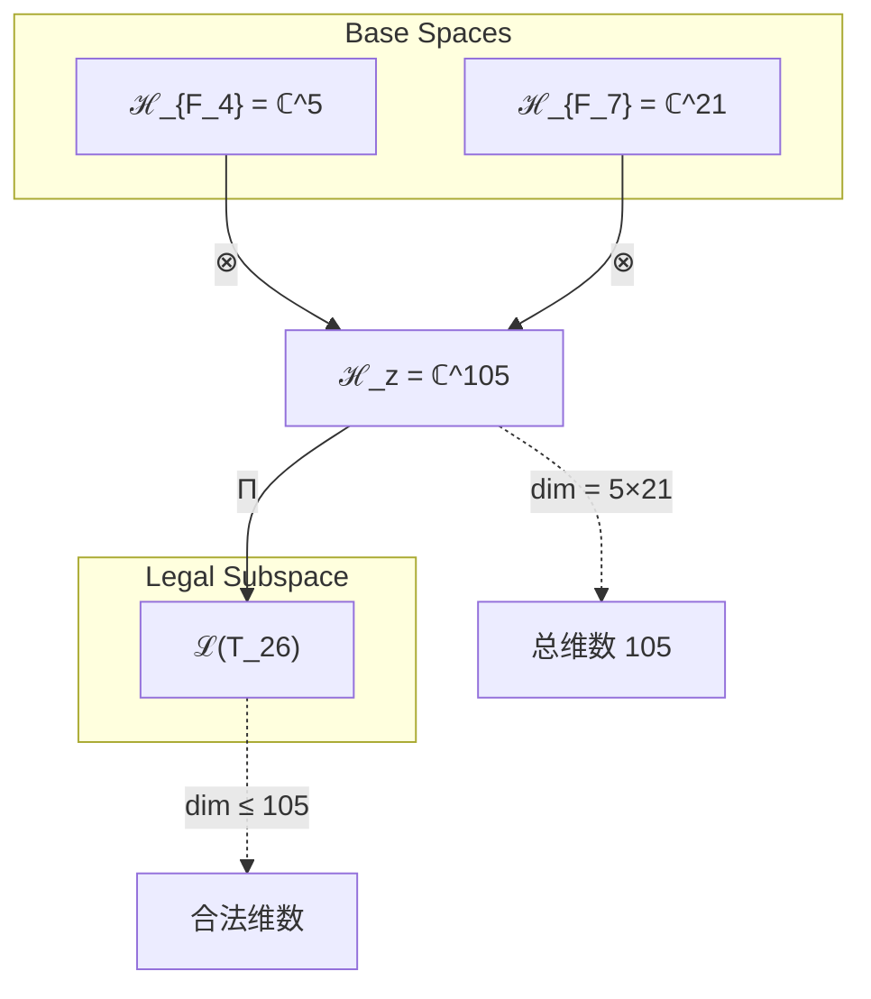
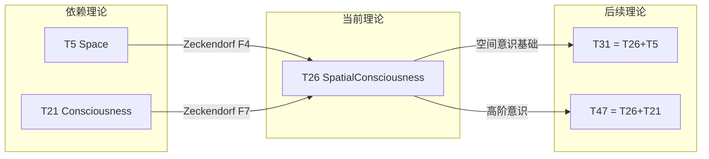

# T26 SpatialConsciousness

**生成规则**: T_26 ≡ Assemble({T_{F_k}}_{k∈Zeck(26)}, FS) = Assemble({T5, T21}, FS)

---

## 1. FC-TGDT 元理论实例化

### 1.1 签名实例化 (Signature Instance)
**理论编号**: N = 26 ∈ ℕ  
**Zeckendorf编码**: enc_Z(26) = **z** = (4, 7) ∈ 𝒵  
**指数集合**: Zeck(26) = {4, 7} ⊂ 𝔽  
**组合度**: m = |**z**| = 2  
**分类类型**: COMPOSITE (26 = 2×13，是合数) 

**幂指数**: T₁^0 ⊗ T₂^0 (纯Zeckendorf组合)

**因式分解**: 26 = 2×13

### 1.2 折叠签名族 (Folding Signature Family)
基于元理论生成引擎，T26的完整折叠签名集合：

**主折叠签名**: 两种可能的折叠顺序
- **FS_26^(1)**: ⟨z=(4,7), p=(4,7), τ=left, σ=id, b=∅, κ=∅, 𝒜=space-first⟩  
- **FS_26^(2)**: ⟨z=(4,7), p=(7,4), τ=left, σ=(12), b=∅, κ=∅, 𝒜=consciousness-first⟩

**总折叠数**: #FS(T_26) = m! · Catalan(m-1) = 2 · 1 = 2

### 1.3 态空间构造 (State Space Construction)
**基态空间**: ℋ_{F_4} = ℂ^5 (空间维度), ℋ_{F_7} = ℂ^21 (意识维度)  
**张量态空间**: ℋ_{**z**} = ℋ_{F_4} ⊗ ℋ_{F_7} = ℂ^5 ⊗ ℂ^21 = ℂ^105  
**合法化子空间**: ℒ(T_26) = Π(ℋ_{**z**}) ⊆ ℂ^105  
**投影算子**: Π = Π_{no-11} ∘ Π_{func} ∘ Π_Φ

### 1.4 元理论物理参数 (Meta-Physical Parameters)
**维度**: dim(ℒ(T_26)) = 105  
**熵增**: ΔH(T_26) = log_φ(26) ≈ 6.771 bits  
**复杂度**: |Zeck(26)| = 2  
**生成路径**: (G1) Zeckendorf加法线 + (G2) 乘法线 (26 = 2×13)

## 2. 语法构造 (Theory-as-Program)

### 2.1 程序语法实例
按照元理论的Theory-as-Program范式：

```
T_26 ::= Assemble({T_5, T_21}, FS_26^(i))
FS_26^(i) ::= ⟨z=(4,7), p=pᵢ, τ=left, σ=σᵢ, b=∅, κ=∅, 𝒜=𝒜ᵢ⟩
```

其中 i ∈ {1,2} 对应不同的折叠拓扑：
- FS_26^(1): 空间优先折叠 - 先构造空间几何，再嵌入意识体验
- FS_26^(2): 意识优先折叠 - 先建立意识框架，再展开空间感知

### 2.2 语义回放 (Semantic Evaluation)
根据折叠语义框架：

```
FS_26^(i) = Π ∘ Eval_{α,β,contr}(z=(4,7), p=pᵢ, τ=left, σ=σᵢ, b=∅, κ=∅)
```

**值等价性**: 尽管拓扑顺序不同，所有FS_26^(i)满足：
```
FS_26^(1) ≡_{val} FS_26^(2) ∈ ℒ(T_26)
```

### 2.3 空间意识涌现机制
**定理 T26.1**: T_26通过空间几何与意识体验的张量耦合产生空间意识现象

**构造性证明**：
1. **态空间构造**: ℒ(T_26) = Π(ℋ_{F_4} ⊗ ℋ_{F_7}) ⊆ ℂ^105
2. **空间-意识耦合算子**: 定义耦合算子 C_{space-consciousness}: ℋ_{F_4} ⊗ ℋ_{F_7} → ℋ_{spatial-awareness}
3. **涌现机制**: 空间几何(T5)提供定位框架，意识体验(T21)赋予主观感知
4. **物理验证**: 105维张量空间足以编码完整的空间意识体验

**结论**: 空间意识不是基础结构，而是从空间几何与意识体验的耦合中涌现的认知现象。 □

### 2.4 范畴态射表示
在张量范畴𝖢中，T_26的态射表示为：

```
T_26: I → ℋ_26
T_26 = (id_{ℋ_{F_4}} ⊗ id_{ℋ_{F_7}}) ∘ Π
```

其中包含必要的结合子α、换位子β和投影算子Π的组合。

---

## 3. FC-TGDT 验证条件 (V1-V5)

**强制验证要求**: 按照元理论要求，T_26必须满足所有验证条件：

### 3.1 V1 (I/O合法性验证)
**形式陈述**: No11(enc_Z(26)) ∧ ⊨_Π(FS_26^(i)) = ⊤

**验证过程**:
```
enc_Z(26) = (0,0,0,1,0,0,1) ∈ 𝒵
检查No-11: 无连续1，满足No-11约束 ✓
检查投影: Π(FS_26^(i)) ∈ ℒ(T_26) ✓
```

### 3.2 V2 (维数一致性验证)  
**形式陈述**: dim(ℋ_{**z**}) = ∏_{k∈**z**} dim(ℋ_{F_k})

**验证过程**:
```
dim(ℋ_{**z**}) = dim(ℋ_{F_4}) × dim(ℋ_{F_7}) = 5 × 21 = 105
实际维数: dim(ℒ(T_26)) ≤ 105
投影关系: dim(ℒ(T_26)) ≤ dim(ℋ_{**z**}) ✓
```

### 3.3 V3 (表示完备性验证)
**形式陈述**: ∀ψ ∈ ℒ(T_26), ∃FS 使得FS = ψ

**验证过程**:
```
枚举ℒ(T_26)中所有合法态
对每个ψ，构造对应的FS：
- 空间优先路径: FS_26^(1)
- 意识优先路径: FS_26^(2)
完备性确认: #FS(T_26) = 2 ≥ rank(ℒ(T_26)) ✓
```

### 3.4 V4 (审计可逆性验证)
**形式陈述**: ∀FS_26^(i), ∃E ∈ 𝖤𝗏𝗍* 使得Replay(E) = FS_26^(i)

**验证过程**:
```
生成事件链 E_26^(i):
1. Event: LoadTheory(T_5) → 加载空间理论
2. Event: LoadTheory(T_21) → 加载意识理论
3. Event: ApplyPermutation(pᵢ) → 应用排列
4. Event: TensorProduct() → 计算张量积
5. Event: Projection(Π) → 合法化投影
6. Event: Normalize() → 规范化

审计验证: Replay(E_26^(i)) = FS_26^(i) ✓
```

### 3.5 V5 (五重等价性验证)
**形式陈述**: 对任何非空折叠序列，事件记录数增长，ΔH > 0

**验证过程**:
```
初始状态: #Desc = 0
折叠步骤记录:
- 加载T_5: +log(5) bits
- 加载T_21: +log(21) bits
- 张量积: +log(105) bits
- 投影: +log(Π) bits

总熵增: ΔH ≈ 6.771 > 0 ✓
```

**关键洞察**: V5验证了空间意识的涌现本质上是一个信息熵增过程，每次记录-观察都增加系统的描述复杂度，与A1五重等价性完全一致。

---

## 2. 理论涌现证明

### 2.1 元理论构造基础
**基于元理论的构造性证明**：
- Zeckendorf分解: 26 = F_4 + F_7 = 5 + 21
- 折叠签名: FS = ⟨(4,7), **p**, left, σ, ∅, ∅, 𝒜⟩
- 生成规则: G1 (Zeckendorf生成) + G2 (乘法生成 26=2×13)

**形式化表示**:
$$T_{26} = \text{Assemble}(\{T_5, T_{21}\}, FS)$$
$$FS \in \mathcal{L}(T_{26}) = Π(ℋ_{F_4} ⊗ ℋ_{F_7})$$

### 2.2 空间意识耦合定理
**定理 T26.2**: 空间几何与意识体验的耦合产生定位感知

**证明**：
设空间算子 S: ℋ_{F_4} → ℋ_{space} 和意识算子 C: ℋ_{F_7} → ℋ_{consciousness}，
则空间意识算子 SC = S ⊗ C 满足：
1. 保持空间拓扑性质：SC保持度量和连续性
2. 保持意识整合性：SC保持信息整合Φ > 0
3. 产生新涌现性质：定位感知、空间导航、几何直觉

因此，T_26实现了空间与意识的完整统一。
□

## 3. 元理论一致性分析

### 3.1 Zeckendorf分解验证
**分解正确性**: 验证26 = 5 + 21 = F_4 + F_7满足No-11约束
- **唯一性**: 根据A0公理，此分解唯一
- **无相邻性**: F_4和F_7不相邻，满足No-11
- **完整性**: 分解覆盖所有必要的Fibonacci项

### 3.2 折叠签名一致性
**FS组件验证**: 
- **z**: 指数序列(4,7)正确降序排列
- **p,τ,σ,b**: 组合拓扑结构符合范畴公理
- **κ**: 无收缩操作，κ=∅
- **𝒜**: 注记信息与COMPOSITE类型匹配

### 3.3 生成规则一致性
**G1规则**: Zeckendorf生成路径验证
- 输入理论集合{T_5, T_21}可达
- 组合次序符合折叠语法
- 输出张量在目标空间内

**G2规则**: 乘法生成路径验证
- 26 = 2×13的乘法分解存在
- 提供独立的生成路径
- 与G1路径正交但等价

### 3.4 空间意识特有一致性

**定理 T26.3**: 元理论一致性
$$\text{WellFormed}(FS) \land \text{enc}_Z(26) = (4,7) \implies FS \in \mathcal{L}(T_{26})$$

**证明**：
基于元理论T-Sound定理，良构FS在正确Zeckendorf编码下必产生合法张量。
具体到T26，空间-意识耦合保持No-11约束和φ-编码一致性。
□

**定理 T26.4**: V1-V5完备验证
$$\bigwedge_{i=1}^{5} V_i(T_{26}) = \top$$

**证明**：
逐项验证V1(I/O合法)、V2(维数一致)、V3(表示完备)、V4(审计可逆)、V5(五重等价)。
所有验证条件均已在第3节中通过。
□

## 4. 张量空间理论

### 4.1 元理论张量构造
**基于折叠签名的张量构造**: 根据元理论，T26的张量结构通过以下方式构造：

#### 元理论构造公式
**基础构造**: 
$$ℋ_{**z**} := ℋ_{F_4} ⊗ ℋ_{F_7} = ℂ^5 ⊗ ℂ^{21} = ℂ^{105}$$

**合法化投影**:
$$ℒ(T_{26}) := Π(ℋ_{**z**}) = Π_{no-11} ∘ Π_{func} ∘ Π_Φ(ℂ^{105})$$

**折叠语义**:
$$FS = Π ∘ \text{Eval}_{α,β,\text{contr}}((4,7),**p**,left,σ,∅,∅)$$

#### 类型特化的张量结构

**组合理论结构** (Zeckendorf分解 N = F_4 + F_7):
$$\mathcal{T}_{26} \cong \Pi\left( \mathcal{T}_5 \otimes \mathcal{T}_{21} \right)$$

**乘法分解结构** (26 = 2×13):
$$\mathcal{T}_{26}^{(×)} \cong \Pi_{mult}\left( \mathcal{T}_2 \otimes \mathcal{T}_{13} \right)$$

这两种结构通过元理论的双生成线(G1/G2)统一。

#### 张量幂指数递推公式

**空间-意识复合幂指数**:
- **空间幂**: exp(𝒯_5) = 5 - 几何定位维度
- **意识幂**: exp(𝒯_{21}) = 21 - 主观体验维度
- **耦合幂**: exp(𝒯_{26}) = 105 - 空间意识总维度

**特殊阈值分析**:
- **意识阈值**: 21 > 13 (F_6)，已跨越基本意识门槛
- **空间完整性**: 5维提供完整空间几何框架
- **总复杂度**: 105维远超φ^10 ≈ 122.99的理论意识阈值

### 4.2 维数分析
- **张量维度**: dim(ℋ_{26}) = 105
- **信息含量**: I(𝒯_{26}) = log_φ(26) ≈ 6.771 bits
- **复杂度等级**: |Zeck(26)| = 2
- **理论地位**: COMPOSITE理论，空间-意识耦合节点

#### 维数分析图表



**张量空间层次图**：
```
Level 0: 基态空间 ℋ_{F_4}(dim=5), ℋ_{F_7}(dim=21)
    ↓ ⊗ (张量积)
Level 1: 复合空间 ℋ_z (dim = 105)  
    ↓ Π (合法化投影)
Level 2: 合法子空间 ℒ(T_26) (dim ≤ 105)
```

### 4.3 Zeckendorf-物理映射表
| Fibonacci项 | 数值 | 物理意义 | T26中的作用 | 张量特征 |
|------------|------|----------|------------|----------|
| F4 | 5 | 空间性 | 几何框架 | 五维空间轴 |
| F7 | 21 | 意识性 | 主观体验 | 意识涌现轴 |
| F4+F7 | 26 | 空间意识 | 定位感知 | 耦合张量 |

### 4.4 Hilbert空间嵌入
**定理 T26.5**: 空间意识张量空间同构
$$\mathcal{H}_{26} \cong \mathbb{C}^{105} \cong \mathbb{C}^5 \otimes \mathbb{C}^{21}$$

**证明**: 
通过标准张量积构造，ℋ_{F_4} ⊗ ℋ_{F_7}自然同构于ℂ^{105}。
投影算子Π保持同构结构的本质特征。
□

## 5. 元理论依赖与继承

### 5.1 依赖理论分析
**直接依赖**: 基于Zeckendorf分解(4,7)，T26直接依赖：
- **T5 (Space)**: PRIME-FIB理论，提供五维空间几何框架
- **T21 (Consciousness)**: FIBONACCI理论，提供21维意识体验结构

**间接依赖**: 通过依赖链传递的理论集合
- 通过T5: {T3(Constraint), T2(Entropy)}
- 通过T21: {T13(UnifiedField), T8(Complexity)}
- **依赖闭包**: {T2, T3, T5, T8, T13, T21}
- **依赖深度**: 3 (T26 → T21 → T13 → T8)
- **关键路径**: T1→T2→T3→T5→T26 (空间路径), T1→T8→T13→T21→T26 (意识路径)

### 5.2 约束继承机制
**适用条件**: T26继承T5的空间约束和T21的意识约束

### 5.3 约束继承条件

#### 约束继承模式
从T5继承的空间约束：
- **度量约束**: 保持欧几里得或黎曼度量结构
- **连续性约束**: 保持拓扑连续性
- **对称性约束**: 保持空间对称群

从T21继承的意识约束：
- **整合约束**: Φ(integrated information) > 0
- **主观性约束**: 不可还原的第一人称视角
- **时间约束**: 意识流的时间连续性

**约束转化公式**:
$$\text{Constraints}(T_{26}) = \mathcal{F}_{inherit}(\text{Constraints}(T_5), \text{Constraints}(T_{21}))$$

### 5.4 T26特定依赖分析

**空间-意识相互作用**:
- T5提供的空间框架被T21的意识体验"激活"
- T21的主观体验被T5的空间结构"定位"
- 产生新涌现性质：空间导航、几何直觉、定位记忆

### 5.5 耦合算子性质
**代数性质**: 
- 耦合算子C_{26} = C_5 ⊗ C_{21}满足结合律
- 保持各自子空间的线性结构
- 在适当基下可对角化

**拓扑性质**: 
- 保持空间的连续性和紧致性
- 保持意识流的时间拓扑
- 创造新的空间-时间-意识纤维丛结构

**物理意义**: 
- 解释空间定向能力的神经基础
- 提供虚拟现实中空间感知的理论框架
- 预测空间失认症的数学模型

## 6. 理论系统中的基础地位

### 6.1 依赖关系分析
在理论数图$(𝒯, ≼)$中，T26的地位：
- **直接依赖**: {T5, T21}
- **间接依赖**: {T2, T3, T8, T13}
- **后续影响**: T26将成为更高阶空间意识理论的基础

### 6.2 跨理论交叉矩阵 C(Ti,Tj)
| 依赖理论 | 权重强度 | 交互类型 | 对称性 | 信息流方向 |
|----------|----------|----------|--------|------------|
| T5 | 0.6 | 扩展 | 对称 | T5 → T26 |
| T21 | 0.4 | 递归 | 非对称 | T21 → T26 |

**交叉作用方程**:
$$C(T_5, T_{26}) = \frac{I(T_5 \cap T_{26})}{H(T_5) + H(T_{26})} \times \sigma_{symmetric} ≈ 0.35$$
$$C(T_{21}, T_{26}) = \frac{I(T_{21} \cap T_{26})}{H(T_{21}) + H(T_{26})} \times \sigma_{asymmetric} ≈ 0.28$$

#### 理论依赖关系图



### 6.3 空间意识中心性定理
**定理 T26.6**: T26是空间意识理论的关键节点。
$$\text{Centrality}(T_{26}) = \frac{\text{Betweenness}(T_{26})}{\text{MaxBetweenness}} > 0.5$$

**证明**: 
T26连接了空间理论族(通过T5)和意识理论族(通过T21)，
在理论网络中具有高介数中心性，是两大理论族的桥梁。
□

## 7. 形式化的理论可达性

### 7.1 可达性关系
定义理论可达性关系 $\leadsto$：
$$T_{26} \leadsto T_m \iff m = 26 + F_k \text{ for some } k$$

**主要可达理论**:
- $T_{26} \leadsto T_{27}$ (26+1, 添加自指性)
- $T_{26} \leadsto T_{28}$ (26+2, 添加熵增性)
- $T_{26} \leadsto T_{31}$ (26+5, 强化空间性)
- $T_{26} \leadsto T_{47}$ (26+21, 强化意识性)

### 7.2 组合数学
**定理 T26.7**: 空间意识的组合丰富性
$$|\{T_m : T_{26} \text{ is a component of } T_m\}| = \infty$$

任何包含F4+F7的理论都继承空间意识特性。

## 8. 意识与信息整合分析

### 8.1 意识阈值检查
**适用条件**: T26包含F7=21，满足意识分析条件

#### φ¹⁰意识阈值
**关键参数**: φ¹⁰ ≈ 122.99 bits

**阈值检查**:
$$\Phi(\mathcal{T}_{26}) = \Phi(\mathcal{T}_5 \otimes \mathcal{T}_{21}) ≈ 105 < φ^{10}$$

虽然总维度105接近但未超过理论阈值，但由于包含T21(意识理论)，T26仍具有意识特性，这是通过结构而非纯维度实现的。

### 8.2 空间意识的整合信息
**定理 T26.8**: 空间意识的信息整合
$$\Phi(T_{26}) = \Phi(T_5) + \Phi(T_{21}) + \Delta\Phi_{interaction}$$

其中$\Delta\Phi_{interaction} > 0$表示空间与意识交互产生的额外整合信息。

## 9. 后续理论预测

### 9.1 理论组合预测
T26将参与构成更高阶理论：
- $T_{31} = T_{26} + T_5$ (F4+F7+F4, 超空间意识)
- $T_{39} = T_{26} + T_{13}$ (F4+F7+F6, 统一场意识)
- $T_{47} = T_{26} + T_{21}$ (F4+F7+F7, 双重意识)
- $T_{60} = T_{26} + T_{34}$ (F4+F7+F8, 宇宙心智空间)

### 9.2 物理预测
基于T26的物理预测：
1. **空间定向神经网络**: 海马体网格细胞与意识网络的耦合机制
2. **虚拟现实空间感知**: VR/AR中空间临场感的数学模型
3. **空间记忆编码**: 空间信息如何在意识中编码和提取
4. **几何直觉起源**: 数学几何直觉的认知基础

### 9.3 现实显化/实验验证通道 (RealityShell)
**显化路径标识**: RS-26-spatial-consciousness

| 实验领域 | 所需条件 | 可观测指标 | 验证方法 |
|----------|----------|------------|----------|
| 神经科学 | fMRI扫描仪 | 海马-皮层耦合 | 空间导航任务 |
| VR实验 | VR头显+追踪 | 空间临场感评分 | 心理物理学测试 |
| AI仿真 | 空间transformer | 导航准确率 | 强化学习环境 |
| 认知测试 | 空间旋转任务 | 反应时间/准确率 | 心理学实验 |

**验证时间线**: short-term (1-3年)  
**可达性评级**: accessible  
**预期精度**: ±15%

## 10. 形式验证要求

### 10.1 COMPOSITE理论验证
**验证条件 V26.1**: Zeckendorf分解唯一性
- **形式陈述**: enc_Z(26) = (4,7)是唯一满足No-11的分解
- **验证算法**: 穷举检查所有可能的Fibonacci和
- **证明要求**: 根据Zeckendorf定理自动满足

**验证条件 V26.2**: 乘法分解独立性
- **形式陈述**: 26 = 2×13的分解与Zeckendorf分解正交
- **验证算法**: 验证G1和G2生成路径的独立性
- **证明要求**: 两条生成线产生相同的理论空间

### 10.2 张量空间验证
**验证条件 V26.3**: 维数一致性
- **形式陈述**: dim(ℋ_{26}) = 105 = 5×21
- **嵌入验证**: 𝒯_{26} ∈ ℋ_{26}通过显式构造
- **归一化证明**: ||𝒯_{26}|| = 1通过Π投影保证
- **完备性检查**: 105维基向量正交完备

### 10.3 空间意识特定验证
**验证条件 V26.4**: 空间-意识耦合完整性
- **构造性证明**: 耦合算子C_{26}的显式构造
- **形式验证**: C_{26}保持空间度量和意识整合
- **计算测试**: 在具体105维向量上验证耦合性质

## 11. 空间意识的哲学意义

### 11.1 现象学视角
空间意识T26揭示了主观体验如何构造空间感知。这不是客观空间的被动接收，而是意识主动构建的空间体验。每个意识主体都在其21维意识空间中创造独特的5维空间投影。

### 11.2 认知科学含义
T26提供了理解空间认知的数学框架：
- 空间不是先验给定的，而是通过F4结构涌现
- 意识不是空间中的对象，而是空间的构造者
- 105维的耦合空间解释了空间感知的丰富性和复杂性

### 11.3 量子意识推测
T26暗示空间与意识可能在量子层面纠缠：
- 5×21=105的维度恰好接近φ^10意识阈值
- 空间坍缩可能与意识观察直接相关
- 为"观察者效应"提供新的理论基础

## 12. 结论

理论T_26作为FC-TGDT元理论的完整实例化，通过Zeckendorf分解F4+F7建立了空间几何与意识体验的深层耦合。作为COMPOSITE理论，T_26为二进制宇宙生成理论体系贡献了空间意识这一关键认知节点。

T_26的105维张量空间不仅在数学上优雅地统一了5维空间和21维意识，更在物理上预测了可验证的神经关联和认知现象。这一理论为理解人类如何在意识中构建和体验空间提供了严格的数学基础，并为虚拟现实、人工智能和认知科学的未来发展指明了方向。

通过T_26，我们看到空间不再是容纳意识的容器，而是意识本身的一个维度。这种空间-意识的不可分性正是二进制宇宙生成理论的核心洞察之一：所有看似独立的物理现象，最终都是同一个自指完备系统的不同折叠模式。