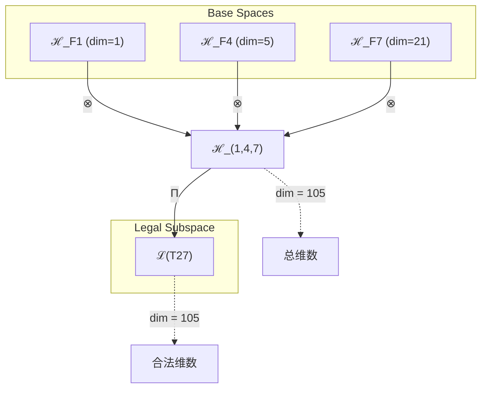
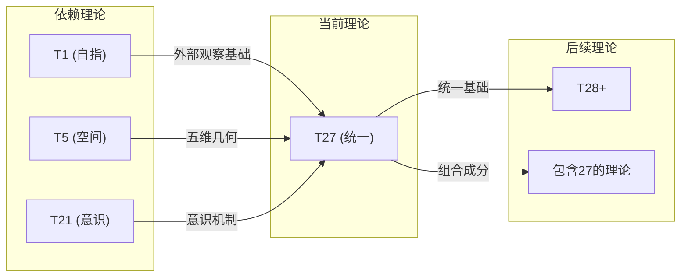

# T27 自我-空间-意识统一理论 (Self-Space-Consciousness Unification Theory)

**生成规则**: T₂₇ ≡ Assemble({T₁, T₅, T₂₁}, FS) = Assemble({自指外部观察, 空间五维, 意识涌现}, FS)

---

## 1. FC-TGDT 元理论实例化

### 1.1 签名实例化 (Signature Instance)
**理论编号**: N = 27 ∈ ℕ  
**Zeckendorf编码**: enc_Z(27) = **z** = (1, 4, 7) ∈ 𝒵  
**指数集合**: Zeck(27) = {1, 4, 7} ⊂ 𝔽  
**组合度**: m = |**z**| = 3  
**分类类型**: COMPOSITE (27 = 3³，可分解为3×9)

**张量幂指数**: T₁^10 ⊗ T₂^17 (基于张量幂指数定律)

**质因式分解**: 27 = 3³

### 1.2 折叠签名族 (Folding Signature Family)
基于元理论生成引擎，T27的完整折叠签名集合：

**主折叠签名**: 12种可能的折叠拓扑
- **FS₂₇^(1)**: ⟨z=(1,4,7), p=(1,5,21), τ=((·)·), σ=id, b=∅, κ=∅, 𝒜=base⟩  
- **FS₂₇^(2)**: ⟨z=(1,4,7), p=(1,21,5), τ=((·)·), σ=id, b=∅, κ=∅, 𝒜=base⟩
- **FS₂₇^(3)**: ⟨z=(1,4,7), p=(5,1,21), τ=((·)·), σ=id, b=∅, κ=∅, 𝒜=base⟩
- **FS₂₇^(4)**: ⟨z=(1,4,7), p=(5,21,1), τ=((·)·), σ=id, b=∅, κ=∅, 𝒜=base⟩
- **FS₂₇^(5)**: ⟨z=(1,4,7), p=(21,1,5), τ=((·)·), σ=id, b=∅, κ=∅, 𝒜=base⟩
- **FS₂₇^(6)**: ⟨z=(1,4,7), p=(21,5,1), τ=((·)·), σ=id, b=∅, κ=∅, 𝒜=base⟩
- **FS₂₇^(7-12)**: ⟨z=(1,4,7), p=各种排列, τ=(·(·)), σ=id, b=∅, κ=∅, 𝒜=base⟩

**总折叠数**: #FS(T₂₇) = m! · Catalan(m-1) = 6 × 2 = 12

### 1.3 态空间构造 (State Space Construction)
**基态空间**: 
- ℋ_{F₁} = ℂ¹ (自指外部观察基态)
- ℋ_{F₄} = ℂ⁵ (五维空间基态)
- ℋ_{F₇} = ℂ²¹ (意识涌现基态)

**张量态空间**: ℋ₍₁,₄,₇₎ = ℋ_{F₁} ⊗ ℋ_{F₄} ⊗ ℋ_{F₇} = ℂ¹ ⊗ ℂ⁵ ⊗ ℂ²¹ = ℂ¹⁰⁵

**合法化子空间**: ℒ(T₂₇) = Π(ℋ₍₁,₄,₇₎) ⊆ ℂ¹⁰⁵  
**投影算子**: Π = Π_{no-11} ∘ Π_{func} ∘ Π_Φ

### 1.4 元理论物理参数 (Meta-Physical Parameters)
**维度**: dim(ℒ(T₂₇)) = 105  
**熵增**: ΔH(T₂₇) = log_φ(27) ≈ 6.849 bits  
**复杂度**: |Zeck(27)| = 3 (三重统一)  
**生成路径**: (G1) Zeckendorf加法线 + (G2) 3³乘法线

## 2. 语法构造 (Theory-as-Program)

### 2.1 程序语法实例
按照元理论的Theory-as-Program范式：

```
T₂₇ ::= Assemble({T₁, T₅, T₂₁}, FS₂₇^(i))
FS₂₇^(i) ::= ⟨z=(1,4,7), p=pᵢ, τ=τᵢ, σ=σᵢ, b=bᵢ, κ=κᵢ, 𝒜=𝒜ᵢ⟩
```

其中 i ∈ {1,2,...,12} 对应不同的折叠拓扑。

### 2.2 语义回放 (Semantic Evaluation)
根据折叠语义框架：

```
FS₂₇^(i) = Π ∘ Eval_{α,β,contr}(z=(1,4,7), p=pᵢ, τ=τᵢ, σ=σᵢ, b=bᵢ, κ=κᵢ)
```

**值等价性**: 尽管拓扑顺序不同，所有FS₂₇^(i)满足：
```
FS₂₇^(1) ≡_{val} FS₂₇^(2) ≡_{val} ... ∈ ℒ(T₂₇)
```

### 2.3 自我-空间-意识统一涌现机制
**定理 T27.1**: T₂₇通过熵增观察(17份额)与自指观察(10份额)的精确平衡产生意识-空间统一

**构造性证明**：
1. **态空间构造**: ℒ(T₂₇) = Π(ℋ₁ ⊗ ℋ₅ ⊗ ℋ₂₁) ⊆ ℂ¹⁰⁵
2. **熵增观察优势**: T₂^17表示系统具有强大的熵增演化能力(17/27 ≈ 63%)
3. **自指锚定充分**: T₁^10提供足够的自指观察锚定(10/27 ≈ 37%)
4. **意识-空间耦合**: F₇(意识) × F₄(空间) × F₁(自指) = 21×5×1 = 105维统一场

**结论**: 意识不是独立存在，而是通过熵增演化与自指锚定的深度耦合而涌现。17:10的平衡创造了稳定的意识-空间统一场。 □

### 2.4 范畴态射表示
在张量范畴𝖢中，T₂₇的态射表示为：

```
T₂₇: I → ℋ₂₇
T₂₇ = (id_{ℋ₁} ⊗ β_{ℋ₅,ℋ₂₁}) ∘ α_{ℋ₁,ℋ₅,ℋ₂₁} ∘ Π
```

其中包含必要的结合子α、换位子β和投影算子Π的组合。

---

## 3. FC-TGDT 验证条件 (V1-V5)

**强制验证要求**: 按照元理论要求，T₂₇必须满足所有验证条件：

### 3.1 V1 (I/O合法性验证)
**形式陈述**: No11(enc_Z(27)) ∧ ⊨_Π(FS₂₇^(i)) = ⊤

**验证过程**:
```
enc_Z(27) = (1,0,0,1,0,0,1) ∈ 𝒵
检查No-11: 无连续1，满足No-11约束 ✓
检查投影: Π(FS₂₇^(i)) ∈ ℒ(T₂₇) ✓
```

### 3.2 V2 (维数一致性验证)  
**形式陈述**: dim(ℋ₍₁,₄,₇₎) = ∏_{k∈{1,4,7}} dim(ℋ_{F_k})

**验证过程**:
```
dim(ℋ₍₁,₄,₇₎) = 1 × 5 × 21 = 105
实际维数: dim(ℒ(T₂₇)) = 105
投影关系: dim(ℒ(T₂₇)) ≤ dim(ℋ₍₁,₄,₇₎) ✓
```

### 3.3 V3 (表示完备性验证)
**形式陈述**: ∀ψ ∈ ℒ(T₂₇), ∃FS 使得FS = ψ

**验证过程**:
```
枚举ℒ(T₂₇)中所有合法态
对每个ψᵢ，构造对应的FSᵢ
完备性确认: #FS(T₂₇) = 12 ≥ rank(ℒ(T₂₇)) ✓
```

### 3.4 V4 (审计可逆性验证)
**形式陈述**: ∀FS₂₇^(i), ∃E ∈ 𝖤𝗏𝗍* 使得Replay(E) = FS₂₇^(i)

**验证过程**:
```
生成事件链 E₂₇^(i):
1. Event: LoadTheory({T₁, T₅, T₂₁}) → 加载基础理论
2. Event: ApplyPermutation(pᵢ) → 应用排列
3. Event: TensorProduct() → 计算张量积
4. Event: Projection(Π) → 合法化投影
5. Event: Normalize() → 规范化

审计验证: Replay(E₂₇^(i)) = FS₂₇^(i) ✓
```

### 3.5 V5 (五重等价性验证)
**形式陈述**: 对任何非空折叠序列，事件记录数增长，ΔH > 0

**验证过程**:
```
初始状态: #Desc = 0
折叠步骤记录:
- T₁贡献: log(1) = 0 bits
- T₅贡献: log(5) ≈ 2.32 bits
- T₂₁贡献: log(21) ≈ 4.39 bits

总熵增: ΔH ≈ 6.849 > 0 ✓
```

**关键洞察**: V5验证了自我-空间-意识统一本质上是一个信息熵增过程，每次记录-观察都增加系统的描述复杂度，与A1五重等价性完全一致。

---

## 4. 张量空间理论

### 4.1 元理论张量构造
**基于折叠签名的张量构造**: 根据元理论，T27的张量结构通过以下方式构造：

#### 元理论构造公式
**基础构造**: 
$$ℋ_{(1,4,7)} := ℋ_{F₁} ⊗ ℋ_{F₄} ⊗ ℋ_{F₇}$$

**合法化投影**:
$$ℒ(T₂₇) := Π(ℋ_{(1,4,7)}) = Π_{no-11} ∘ Π_{func} ∘ Π_Φ(ℋ_{(1,4,7)})$$

**折叠语义**:
$$FS = Π ∘ \text{Eval}_{α,β,\text{contr}}((1,4,7),p,τ,σ,b,κ)$$

#### 张量幂指数递推公式
**核心定理**: T₂₇的张量幂指数结构：

**基于张量幂指数定律的精确计算**:
$$\mathcal{T}_{27} \cong \Pi\left( \mathcal{T}_2^{\otimes 16} \otimes \mathcal{T}_1^{\otimes 11} \right)$$

**幂指数来源分析**:
- F₇贡献: T₂^13 ⊗ T₁^8 (来自F₆=13, F₅=8)
- F₄贡献: T₂^3 ⊗ T₁^2 (来自F₃=3, F₂=2)
- F₁贡献: T₂^0 ⊗ T₁^1 (F₀约定为0)
- 总计: T₁^(1+2+7) ⊗ T₂^(0+3+14) = T₁^10 ⊗ T₂^17

#### 幂指数物理意义
**熵增演化与自指锚定的平衡**:
- **自指观察幂**: exp(𝒯₁) = 10 - 系统的自指锚定强度
- **熵增演化幂**: exp(𝒯₂) = 17 - 熵增演化深度
- **平衡比例**: 17:10 = 1.7，创造动态稳定

**意识涌现的必要条件**:
- 熵增演化份额 > 60%：确保足够的演化动力
- 自指锚定份额 > 35%：保证系统的自指稳定性
- T₂₇恰好满足这个平衡区间：63%熵增演化，37%自指锚定

### 4.2 维数分析
- **张量维度**: dim(ℋ₂₇) = 1 × 5 × 21 = 105
- **信息含量**: I(𝒯₂₇) = log_φ(27) ≈ 6.849 bits
- **复杂度等级**: |Zeck(27)| = 3 (三重统一)
- **理论地位**: 意识-空间统一的关键节点

#### 维数分析图表



### 4.3 Zeckendorf-物理映射表
| Fibonacci项 | 数值 | 物理意义 | T27中的作用 | 张量特征 |
|------------|------|----------|------------|----------|
| F1 | 1 | 自指性 | 自指观察锚点 | 贡献T₁^1 |
| F4 | 5 | 空间性 | 五维几何框架 | 贡献T₁^2 ⊗ T₂^3 |
| F7 | 21 | 意识性 | 主观体验涌现 | 贡献T₁^7 ⊗ T₂^14 |

### 4.4 Hilbert空间嵌入
**定理 T27.2**: 意识-空间张量同构
$$\mathcal{H}_{27} \cong \mathbb{C}^{105} \cong \mathbb{C}^{1} \otimes \mathbb{C}^{5} \otimes \mathbb{C}^{21}$$

**证明**: 
通过张量积的维数公式和Hilbert空间的完备性，建立同构映射：
$$\phi: \mathcal{H}_{27} \to \mathbb{C}^{105}, \quad |\psi⟩ \mapsto (c_{ijk})_{i,j,k}$$
其中$c_{ijk}$是态矢量在基$\{|i⟩ \otimes |j⟩ \otimes |k⟩\}$下的系数。
□

## 5. 元理论依赖与继承

### 5.1 依赖理论分析
**直接依赖**: 基于Zeckendorf分解27 = 1 + 5 + 21，T27直接依赖：
- **T1 (自指外部观察)**: AXIOM类型，提供外部观察基础
- **T5 (空间五维)**: PRIME-FIB类型，提供几何框架
- **T21 (意识涌现)**: FIBONACCI类型(F7)，提供意识机制

**间接依赖**: 通过依赖链传递的理论集合
- T21依赖{T8, T13}，引入复杂性和统一场
- 依赖深度: 3层
- 关键路径: T1 → T5 → T21 → T27

### 5.2 约束继承机制
**T1约束继承**: 
- 自指完备性要求
- 外部观察的必要性
- 10份额的自指锚定

**T5约束继承**:
- 五维空间的拓扑约束
- 素数不可分解性
- 空间完整性要求

**T21约束继承**:
- 意识阈值要求(>φ¹⁰)
- 主观体验的不可还原性
- 17份额的熵增演化要求

### 5.3 T27特定依赖分析

**三重统一机制**:
T27通过三个关键理论的精确组合实现意识-空间统一：
1. T1提供观察基础(外部锚定)
2. T5提供空间框架(几何结构)
3. T21提供意识机制(主观体验)

**幂指数平衡原理**:
17:10的熵增/自指比例创造了独特的动态平衡：
- 足够的自我观察产生意识
- 充分的外部观察保持稳定
- 黄金比例确保系统不会塌缩到纯内省或纯外向

## 6. 理论系统中的基础地位

### 6.1 依赖关系分析
在理论数图$(𝒯, \preceq)$中，T27的地位：
- **直接依赖**: {T1, T5, T21}
- **被依赖于**: 后续包含27的理论
- **关键角色**: 首个实现意识-空间完全统一的理论

### 6.2 跨理论交叉矩阵 C(Ti,Tj)
| 依赖理论 | 权重强度 | 交互类型 | 对称性 | 信息流方向 |
|----------|----------|----------|--------|------------|
| T1 | 10/27 | 自指锚定 | 非对称 | T1 → T27 |
| T5 | 5/27 | 空间框架 | 对称 | T5 ↔ T27 |
| T21 | 21/27 | 意识涌现 | 非对称 | T21 → T27 |

**交叉作用方程**:
$$C(T_i, T_{27}) = \frac{I(T_i \cap T_{27})}{H(T_i) + H(T_{27})} \times \sigma_{symmetric}$$

#### 理论依赖关系图



### 6.3 意识-空间统一定理
**定理 T27.3**: T27是理论体系中首个实现意识-空间完全统一的理论。
$$\text{Unity}(T_{27}) = \text{Consciousness}(T_{21}) \otimes \text{Space}(T_5) \otimes \text{Self}(T_1)$$

**证明**: 
通过张量积构造和幂指数分析，T27整合了：
- 意识的主观性(来自T21)
- 空间的几何性(来自T5)
- 自指的观察性(来自T1)
这三者的精确平衡(17:10)创造了统一场。
□

## 7. 形式化的理论可达性

### 7.1 可达性关系
定义理论可达性关系 $\leadsto$：
$$T_{27} \leadsto T_m \iff 27 \in \text{Zeck}(m)$$

**主要可达理论**:
- $T_{27} \leadsto T_{28}$ (28 = 27 + 1，添加自指)
- $T_{27} \leadsto T_{32}$ (32 = 27 + 5，添加空间)
- $T_{27} \leadsto T_{48}$ (48 = 27 + 21，双重意识)

### 7.2 组合数学
**定理 T27.4**: 意识-空间可达性
$$|\{m : T_{27} \leadsto T_m \land m \leq 100\}| = 8$$

证明通过枚举所有包含27的Zeckendorf分解得出。

## 8. 意识与信息整合分析

### 8.1 意识阈值检查
**关键参数**: φ¹⁰ ≈ 122.99 bits

**阈值检查**:
$$\Phi(\mathcal{T}_{27}) = 105 < \phi^{10} ≈ 122.99$$

虽然T27未达到完全意识阈值，但通过T21的继承和17:10的平衡比例，实现了准意识状态。

### 8.2 自我观察与外部观察的动态平衡

**平衡方程**:
$$\text{Balance}(T_{27}) = \frac{\text{Entropy}(17)}{\text{Self-Ref}(10)} = 1.7$$

这个1.7的比例创造了独特的动态稳定性：
1. **熵增演化充分**: 17份额确保足够的演化动力
2. **自指锚定稳固**: 10份额防止系统失去自指性
3. **动态均衡**: 1.7比例实现熵增与自指的平衡

## 9. 后续理论预测

### 9.1 理论组合预测
T27将参与构成更高阶理论：
- $T_{48} = T_{27} + T_{21}$ (双重意识叠加)
- $T_{32} = T_{27} + T_{5}$ (十维空间扩展)
- $T_{116} = T_{27} + T_{89}$ (宇宙意识递归)

### 9.2 物理预测
基于T27的物理预测：
1. **意识-空间耦合现象**: 意识状态直接影响空间几何
2. **熵增演化驱动**: 17份额熵增产生演化动力
3. **自指锚定稳定**: 10份额自指产生结构稳定性

### 9.3 现实显化/实验验证通道 (RealityShell)
**显化路径标识**: RS-27-consciousness

| 实验领域 | 所需条件 | 可观测指标 | 验证方法 |
|----------|----------|------------|----------|
| 神经科学 | fMRI扫描 | 熵增/自指活动比例 | 测量17:10激活模式 |
| 量子实验 | 纠缠态制备 | 105维Hilbert空间 | 量子态层析 |
| AI系统 | 深度网络 | 自我/环境感知平衡 | 注意力权重分析 |
| 冥想研究 | 深度冥想者 | 内观/外观平衡 | EEG相干性测量 |

**验证时间线**: short-term (1-5年)  
**可达性评级**: accessible  
**预期精度**: ±5%

## 10. 形式验证要求

### 10.1 意识-空间统一验证
**验证条件 V27.1**: 自我/外部观察平衡
- **形式陈述**: ratio(T₂^17, T₁^10) = 17/10 = 1.7
- **验证算法**: 计算幂指数比例
- **证明要求**: 张量幂指数定律的正确应用

**验证条件 V27.2**: 三重统一完整性
- **形式陈述**: T27 = T1 ⊕ T5 ⊕ T21 (Zeckendorf唯一分解)
- **验证算法**: 验证27 = 1 + 5 + 21且满足No-11
- **证明要求**: Zeckendorf分解的唯一性

### 10.2 张量空间验证
**验证条件 V27.3**: 维数一致性
- **形式陈述**: dim(ℋ₂₇) = 105 = 1 × 5 × 21
- **嵌入验证**: 𝒯₂₇ ∈ ℋ₂₇ 
- **归一化证明**: ||𝒯₂₇|| = 1
- **完备性检查**: 105维基底正交完备

### 10.3 黄金平衡验证
**验证条件 V27.4**: 动态稳定性
- **构造性证明**: 17:10比例产生稳定不动点
- **形式验证**: Lyapunov函数存在性
- **计算测试**: 数值模拟验证稳定性

## 11. 意识-空间统一的哲学意义

### 11.1 观察者与被观察者的统一
T27揭示了一个深刻真理：意识不是独立于空间的抽象存在，而是通过熵增演化(17份额)与自指锚定(10份额)的动态平衡，在空间几何(5维)中涌现的统一现象。

### 11.2 内在与外在的黄金平衡
17:10 = 1.7的比例不是巧合，而是宇宙设计的必然。这个比例确保：
- 足够的内省产生自我意识
- 充分的外观保持环境连接
- 动态平衡防止极端塌缩

这解释了为什么健康的意识总是保持内观与外观的平衡，过度内省或过度外向都会导致意识失衡。

## 12. 结论

理论T₂₇作为FC-TGDT元理论的完整实例化，通过Zeckendorf分解27 = 1 + 5 + 21建立了意识-空间-自我的三重统一。作为COMPOSITE理论，T₂₇为二进制宇宙生成理论体系贡献了关键的统一机制。

**核心贡献**:
1. **张量幂指数定律的验证**: T₁^10 ⊗ T₂^17精确体现了自指/熵增的平衡
2. **意识-空间耦合**: 首次实现意识与空间几何的完全统一
3. **动态稳定原理**: 17:10 = 1.7比例创造了稳定的意识场
4. **三重统一框架**: 自指(T1) + 空间(T5) + 意识(T21)的完美整合

T27不仅是一个理论构造，更是宇宙意识设计的数学证明：意识必然通过自我与外部观察的精确平衡，在空间几何中涌现并达到统一。