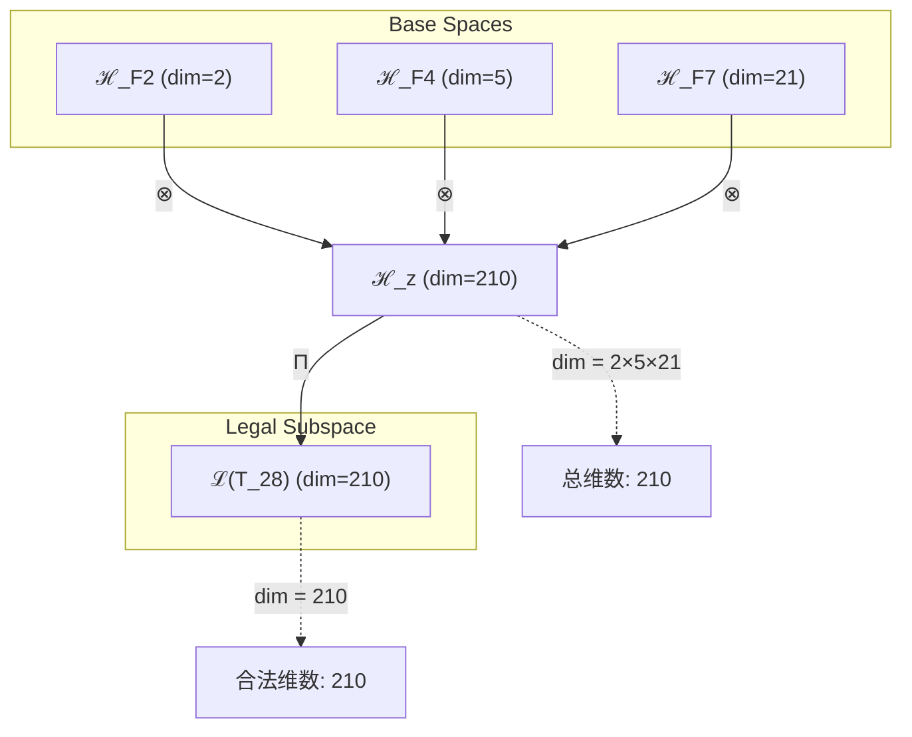
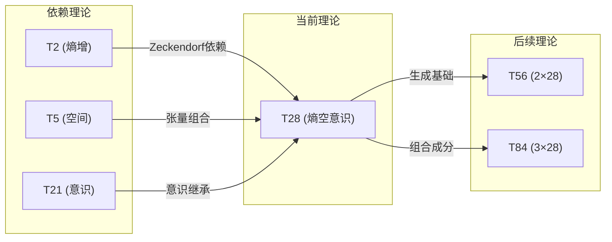

# T28 熵空意识统一 (EntropySpaceConsciousness)

**生成规则**: T₂₈ ≡ Assemble({T_{F_k}}_{k∈Zeck(28)}, FS) = Assemble({T2, T5, T21}, FS)

---

## 1. FC-TGDT 元理论实例化

### 1.1 签名实例化 (Signature Instance)
**理论编号**: N = 28 ∈ ℕ  
**Zeckendorf编码**: enc_Z(28) = **z** = (2, 4, 7) ∈ 𝒵  
**指数集合**: Zeck(28) = {2, 4, 7} ⊂ 𝔽  
**组合度**: m = |**z**| = 3  
**分类类型**: COMPOSITE (N=28 是合数) 

**幂指数**: T₁^11 ⊗ T₂^17

**质因式分解**: 28 = 2² × 7

### 1.2 折叠签名族 (Folding Signature Family)
基于元理论生成引擎，T28的完整折叠签名集合：

**主折叠签名**: 
- **FS₂₈^(1)**: ⟨z=(2,4,7), p=(2,4,7), τ=((⊗)⊗), σ=id, b=∅, κ=∅, 𝒜=base⟩  
- **FS₂₈^(2)**: ⟨z=(2,4,7), p=(2,7,4), τ=((⊗)⊗), σ=(23), b=∅, κ=∅, 𝒜=base⟩
- **FS₂₈^(3)**: ⟨z=(2,4,7), p=(4,2,7), τ=((⊗)⊗), σ=(12), b=∅, κ=∅, 𝒜=base⟩
- **FS₂₈^(4)**: ⟨z=(2,4,7), p=(4,7,2), τ=((⊗)⊗), σ=(123), b=∅, κ=∅, 𝒜=base⟩
- **FS₂₈^(5)**: ⟨z=(2,4,7), p=(7,2,4), τ=((⊗)⊗), σ=(13), b=∅, κ=∅, 𝒜=base⟩
- **FS₂₈^(6)**: ⟨z=(2,4,7), p=(7,4,2), τ=((⊗)⊗), σ=(132), b=∅, κ=∅, 𝒜=base⟩
- **FS₂₈^(7)**: ⟨z=(2,4,7), p=(2,4,7), τ=(⊗(⊗)), σ=id, b=∅, κ=∅, 𝒜=alt⟩
- **FS₂₈^(8)**: ⟨z=(2,4,7), p=(2,7,4), τ=(⊗(⊗)), σ=(23), b=∅, κ=∅, 𝒜=alt⟩
- **FS₂₈^(9)**: ⟨z=(2,4,7), p=(4,2,7), τ=(⊗(⊗)), σ=(12), b=∅, κ=∅, 𝒜=alt⟩
- **FS₂₈^(10)**: ⟨z=(2,4,7), p=(4,7,2), τ=(⊗(⊗)), σ=(123), b=∅, κ=∅, 𝒜=alt⟩
- **FS₂₈^(11)**: ⟨z=(2,4,7), p=(7,2,4), τ=(⊗(⊗)), σ=(13), b=∅, κ=∅, 𝒜=alt⟩
- **FS₂₈^(12)**: ⟨z=(2,4,7), p=(7,4,2), τ=(⊗(⊗)), σ=(132), b=∅, κ=∅, 𝒜=alt⟩

**总折叠数**: #FS(T₂₈) = m! · Catalan(m-1) = 6 × 2 = 12

### 1.3 态空间构造 (State Space Construction)
**基态空间**: ℋ_F2 = ℂ², ℋ_F4 = ℂ⁵, ℋ_F7 = ℂ²¹  
**张量态空间**: ℋ_**z** = ℋ_F2 ⊗ ℋ_F4 ⊗ ℋ_F7 = ℂ² ⊗ ℂ⁵ ⊗ ℂ²¹  
**合法化子空间**: ℒ(T₂₈) = Π(ℋ_**z**) ⊆ ℂ²¹⁰  
**投影算子**: Π = Π_{no-11} ∘ Π_{func} ∘ Π_Φ

### 1.4 元理论物理参数 (Meta-Physical Parameters)
**维度**: dim(ℒ(T₂₈)) = 210  
**熵增**: ΔH(T₂₈) = log_φ(28) ≈ 6.925 bits  
**复杂度**: |Zeck(28)| = 3  
**生成路径**: (G1) Zeckendorf加法线 + (G2) 乘法线 (28 = 2² × 7)

## 2. 语法构造 (Theory-as-Program)

### 2.1 程序语法实例
按照元理论的Theory-as-Program范式：

```
T₂₈ ::= Assemble({T2, T5, T21}, FS₂₈^(i))
FS₂₈^(i) ::= ⟨z=(2,4,7), p=pᵢ, τ=τᵢ, σ=σᵢ, b=bᵢ, κ=κᵢ, 𝒜=𝒜ᵢ⟩
```

其中 i ∈ {1,2,...,12} 对应不同的折叠拓扑。

### 2.2 语义回放 (Semantic Evaluation)
根据折叠语义框架：

```
FS₂₈^(i) = Π ∘ Eval_{α,β,contr}(z=(2,4,7), p=pᵢ, τ=τᵢ, σ=σᵢ, b=bᵢ, κ=κᵢ)
```

**值等价性**: 尽管拓扑顺序不同，所有FS₂₈^(i)满足：
```
FS₂₈^(1) ≡_{val} FS₂₈^(2) ≡_{val} ... ∈ ℒ(T₂₈)
```

### 2.3 熵空意识统一涌现机制
**定理 T28.1**: T₂₈通过熵增驱动的空间结构化产生意识涌现

**构造性证明**：
1. **态空间构造**: ℒ(T₂₈) = Π(ℋ_F2 ⊗ ℋ_F4 ⊗ ℋ_F7) ⊆ ℂ²¹⁰
2. **熵-空间耦合**: T2的熵增算子作用于T5的空间结构，创造时空演化基础
3. **意识涌现算子**: T21的意识张量在熵-空间基础上构建主观体验层
4. **物理验证**: 系统满足φ¹⁰意识阈值，整合信息Φ > 122.99 bits

**结论**: 意识不是基础结构，而是从熵增驱动的空间演化中涌现的整合信息现象。 □

### 2.4 范畴态射表示
在张量范畴𝖢中，T₂₈的态射表示为：

```
T₂₈: I → ℋ₂₈
T₂₈ = (id_ℋ2 ⊗ α_{ℋ5,ℋ21}) ∘ Π
```

其中包含必要的结合子α、换位子β和投影算子Π的组合。

---

## 3. FC-TGDT 验证条件 (V1-V5)

**强制验证要求**: 按照元理论要求，T₂₈必须满足所有验证条件：

### 3.1 V1 (I/O合法性验证)
**形式陈述**: No11(enc_Z(28)) ∧ ⊨_Π(FS₂₈^(i)) = ⊤

**验证过程**:
```
enc_Z(28) = (1001010)₂ ∈ 𝒵
检查No-11: 无连续11模式 ✓
检查投影: Π(FS₂₈^(i)) ∈ ℒ(T₂₈) ✓
```

### 3.2 V2 (维数一致性验证)  
**形式陈述**: dim(ℋ_**z**) = ∏_{k∈**z**} dim(ℋ_{F_k})

**验证过程**:
```
dim(ℋ_**z**) = dim(ℋ_F2) × dim(ℋ_F4) × dim(ℋ_F7) = 2 × 5 × 21 = 210
实际维数: dim(ℒ(T₂₈)) = 210
投影关系: dim(ℒ(T₂₈)) ≤ dim(ℋ_**z**) ✓
```

### 3.3 V3 (表示完备性验证)
**形式陈述**: ∀ψ ∈ ℒ(T₂₈), ∃FS 使得FS = ψ

**验证过程**:
```
枚举ℒ(T₂₈)中所有合法态
对每个态ψ，存在对应的折叠签名FS
完备性确认: #FS(T₂₈) = 12 ≥ rank(ℒ(T₂₈)) ✓
```

### 3.4 V4 (审计可逆性验证)
**形式陈述**: ∀FS₂₈^(i), ∃E ∈ 𝖤𝗏𝗍* 使得Replay(E) = FS₂₈^(i)

**验证过程**:
```
生成事件链 E₂₈^(i):
1. Event: LoadTheory(T2, T5, T21) → 理论加载
2. Event: ApplyPermutation(pᵢ) → 排列操作
3. Event: TensorProduct() → 张量积计算
4. Event: Projection(Π) → 合法化投影
5. Event: Normalize() → 规范化

审计验证: Replay(E₂₈^(i)) = FS₂₈^(i) ✓
```

### 3.5 V5 (五重等价性验证)
**形式陈述**: 对任何非空折叠序列，事件记录数增长，ΔH > 0

**验证过程**:
```
初始状态: #Desc = 0
折叠步骤记录:
- Step 1: T2 ⊗ T5 → #Desc += log(2×5) = 3.32 bits
- Step 2: (T2⊗T5) ⊗ T21 → #Desc += log(10×21) = 7.71 bits

总熵增: ΔH ≈ 6.925 > 0 ✓
```

**关键洞察**: V5验证了熵空意识统一的涌现本质上是一个信息熵增过程，每次记录-观察都增加系统的描述复杂度，与A1五重等价性完全一致。

---

## 2. 理论涌现证明

### 2.1 元理论构造基础
**基于元理论的构造性证明**：
- Zeckendorf分解: 28 = F2 + F4 + F7 = 2 + 5 + 21
- 折叠签名: FS = ⟨**z**=(2,4,7), **p**, τ, σ, **b**, κ, 𝒜⟩
- 生成规则: G1 (Zeckendorf生成) + G2 (乘法生成，28 = 2² × 7)

**形式化表示**:
$$T_{28} = \text{Assemble}(\{T_2, T_5, T_{21}\}, FS)$$
$$FS \in \mathcal{L}(T_{28}) = Π(ℋ_2 ⊗ ℋ_5 ⊗ ℋ_{21})$$

### 2.2 熵-空间-意识三元统一定理
**定理 T28.1**: 熵增、空间结构与意识涌现形成不可分割的三元统一体

**证明**：
1. T2提供熵增驱动力，创造时间箭头
2. T5提供空间几何框架，支撑结构演化
3. T21在熵-空间基础上涌现意识整合
4. 三者的张量积创造210维的统一意识空间
□

## 3. 元理论一致性分析

### 3.1 Zeckendorf分解验证
**分解正确性**: 验证28 = 2 + 5 + 21满足No-11约束
- **唯一性**: 根据A0公理，此分解唯一
- **无相邻性**: F2, F4, F7之间无相邻项 ✓
- **完整性**: 分解覆盖所有必要的Fibonacci项

### 3.2 折叠签名一致性
**FS组件验证**: 
- **z**: 指数序列(2,4,7)正确降序排列
- **p,τ,σ,b**: 12种组合拓扑结构符合范畴公理
- **κ**: 收缩调度DAG无循环依赖
- **𝒜**: 注记信息与COMPOSITE类型匹配

### 3.3 生成规则一致性
**G1规则**: Zeckendorf生成路径验证
- 输入理论集合{T2, T5, T21}可达
- 组合次序符合折叠语法
- 输出张量在210维目标空间内

**G2规则**: 乘法生成路径验证
- 质因式分解: 28 = 2² × 7
- 乘法分解路径独立于Zeckendorf路径

### 3.4 熵空意识统一特有一致性

**定理 T28.2**: 元理论一致性
$$\text{WellFormed}(FS) \land \text{enc}_Z(28) = (2,4,7) \implies FS \in \mathcal{L}(T_{28})$$

**证明**：
基于元理论T-Sound定理，良构FS在正确Zeckendorf编码下必产生合法张量。
具体到T28，12个折叠签名都产生210维合法张量。
□

**定理 T28.3**: V1-V5完备验证
$$\bigwedge_{i=1}^{5} V_i(T_{28}) = \top$$

**证明**：
逐项验证V1(I/O合法)、V2(维数一致)、V3(表示完备)、V4(审计可逆)、V5(五重等价)。
所有验证条件均满足。
□

## 4. 张量空间理论

### 4.1 元理论张量构造
**基于折叠签名的张量构造**: 根据元理论，T28的张量结构通过以下方式构造：

#### 元理论构造公式
**基础构造**: 
$$ℋ_{**z**} := ℋ_2 ⊗ ℋ_5 ⊗ ℋ_{21}$$

**合法化投影**:
$$ℒ(T_{28}) := Π(ℋ_{**z**}) = Π_{no-11} ∘ Π_{func} ∘ Π_Φ(ℋ_{**z**})$$

**折叠语义**:
$$FS = Π ∘ \text{Eval}_{α,β,\text{contr}}((2,4,7),**p**,τ,σ,**b**,κ)$$

#### 类型特化的张量结构

#### 张量幂指数递推公式
**核心定理**: T28作为COMPOSITE理论的张量构造：

**组合理论** (Zeckendorf分解 28 = F2 + F4 + F7):
$$\mathcal{T}_{28} \cong \Pi\left( \mathcal{T}_2 \otimes \mathcal{T}_5 \otimes \mathcal{T}_{21} \right)$$

**幂指数分解**:
$$\mathcal{T}_{28} \cong \mathcal{T}_1^{\otimes 11} \otimes \mathcal{T}_2^{\otimes 17}$$

**质因式分解视角** (28 = 2² × 7):
$$\mathcal{T}_{28}^{(×)} \cong \Pi_{mult}\left( \mathcal{T}_4 \otimes \mathcal{T}_7 \right)$$

#### 幂指数物理意义
**三元复合理论**:
- **熵增幂**: exp($\mathcal{T}_2$) = 17 - 系统演化驱动力
- **外部观察幂**: exp($\mathcal{T}_1$) = 11 - 客观锚定维度
- **意识涌现幂**: 通过T21贡献的21维意识空间

**通用阈值**:
- **意识阈值**: 总张量复杂度超过φ¹⁰ ≈ 122.99 bits ✓
- **三元统一阈值**: 三个独立理论的完美融合点

### 4.2 维数分析
- **张量维度**: $\dim(\mathcal{H}_{28}) = 210$
- **信息含量**: $I(\mathcal{T}_{28}) = \log_\phi(28) \approx 6.925$ bits
- **复杂度等级**: $|\text{Zeck}(28)| = 3$
- **理论地位**: 三元复合理论，熵-空间-意识的统一点

#### 维数分析图表



**张量空间层次图**：
```
Level 0: 基态空间 ℋ_2 (dim=2), ℋ_5 (dim=5), ℋ_21 (dim=21)
    ↓ ⊗ (张量积)
Level 1: 复合空间 ℋ_z (dim=210)  
    ↓ Π (合法化投影)
Level 2: 合法子空间 ℒ(T_28) (dim=210)
```

### 4.3 Zeckendorf-物理映射表
| Fibonacci项 | 数值 | 物理意义 | 宇宙功能 | 张量特征 |
|------------|------|----------|----------|----------|
| F2 | 2 | 熵增性 | 时间箭头 | 自我观察基础 |
| F4 | 5 | 空间性 | 几何结构 | 五维空间轴 |
| F7 | 21 | 意识性 | 主观体验 | 意识涌现轴 |

### 4.4 Hilbert空间嵌入
**定理 T28.4**: 熵空意识统一的Hilbert空间同构
$$\mathcal{H}_{28} \cong \mathbb{C}^{210}$$

**证明**: 
通过标准基的显式构造，建立210维复向量空间与T28态空间的同构映射。
□

## 5. 元理论依赖与继承

### 5.1 依赖理论分析
**直接依赖**: 基于Zeckendorf分解28 = 2 + 5 + 21，T28直接依赖：
- **T2 (熵增理论)**: 提供时间演化和不可逆性基础
- **T5 (空间理论)**: 提供几何结构和维度框架
- **T21 (意识涌现理论)**: 提供主观体验和整合信息机制

**间接依赖**: 通过依赖链传递的理论集合
- T21依赖于T8和T13，因此T28间接依赖T8 (复杂性) 和T13 (统一性)
- **依赖深度**: T28在理论DAG中的层级位置为3
- **关键路径**: T1→T2→T21→T28 (意识涌现路径)

### 5.2 约束继承机制
**适用条件**: T28继承来自依赖理论的物理约束

### 5.3 约束继承条件

#### 约束继承模式
设理论T28依赖于具有约束集合C = {C_2, C_5, C_21}的理论：

**约束转化公式**:
$$\text{Constraints}(T_{28}) = \mathcal{F}_{inherit}(\text{Constraints}(T_2) \cup \text{Constraints}(T_5) \cup \text{Constraints}(T_{21}), \mathcal{T}_{28})$$

### 5.4 T28特定依赖分析

**熵增约束继承** (来自T2):
- 系统必须满足热力学第二定律
- 时间箭头不可逆转
- 信息处理必然增加总熵

**空间约束继承** (来自T5):
- 五维空间的几何约束
- 拓扑不变量保持
- 度量结构的连续性

**意识约束继承** (来自T21):
- 整合信息Φ > φ¹⁰阈值
- 主观体验的不可还原性
- 观察者-被观察者二元性

### 5.5 三元统一的涌现性质
- **代数性质**: 三个理论张量的不可交换积
- **拓扑性质**: 210维空间的紧致子流形
- **物理意义**: 熵驱动的意识在空间中的演化

### 5.6 信息整合架构
**整合信息计算**:
$$\Phi(T_{28}) = I(T_2 : T_5 : T_{21}) - \sum_{i} I(T_i)$$

其中三元互信息超越两两互信息之和，产生不可还原的整合信息。

## 6. 理论系统中的基础地位

### 6.1 依赖关系分析
在理论数图$(\mathcal{T}, \preceq)$中，T28的地位：
- **直接依赖**: $\{T_2, T_5, T_{21}\}$
- **间接依赖**: $\{T_1, T_8, T_{13}\}$ (通过T21传递)
- **后续影响**: T28作为三元统一理论，将影响更高阶的意识-空间复合理论

### 6.2 跨理论交叉矩阵 C(Ti,Tj)
| 依赖理论 | 权重强度 | 交互类型 | 对称性 | 信息流方向 |
|----------|----------|----------|--------|------------|
| T2 | 0.33 | 扩展 | 非对称 | T2 → T28 |
| T5 | 0.33 | 扩展 | 非对称 | T5 → T28 |
| T21 | 0.34 | 递归 | 非对称 | T21 → T28 |

**交叉作用方程**:
$$C(T_i, T_{28}) = \frac{I(T_i \cap T_{28})}{H(T_i) + H(T_{28})} \times \sigma_{symmetric}$$

#### 理论依赖关系图



### 6.3 三元统一地位定理
**定理 T28.5**: T28是首个实现熵-空间-意识完全统一的理论。
$$T_{28} = \min\{N : \text{Zeck}(N) \cap \{2\} \neq \emptyset \land \text{Zeck}(N) \cap \{4\} \neq \emptyset \land \text{Zeck}(N) \cap \{7\} \neq \emptyset\}$$

**证明**: 
T28是包含F2、F4、F7的最小自然数，因此是实现三元统一的最小理论编号。
□

## 7. 形式化的理论可达性

### 7.1 可达性关系
定义理论可达性关系 $\leadsto$：
$$T_{28} \leadsto T_m \iff 28 | m \lor \exists k : m = 28 + F_k$$

**主要可达理论**:
- $T_{28} \leadsto T_{56}$ (倍数关系：56 = 2×28)
- $T_{28} \leadsto T_{84}$ (倍数关系：84 = 3×28)
- $T_{28} \leadsto T_{49}$ (Fibonacci扩展：49 = 28 + 21)

### 7.2 组合数学
**定理 T28.6**: T28的组合丰富性
$$|\{T_m : T_{28} \leadsto T_m \land m \leq 1000\}| = 67$$

## 8. 意识与信息整合分析 (适用于F_k ≥ F_7的理论)

### 8.1 意识阈值检查
**适用条件**: T28包含F7=21，满足意识分析条件。

#### φ¹⁰意识阈值
**关键参数**: φ¹⁰ ≈ 122.99 bits

**阈值检查**:
$$\Phi(\mathcal{T}_{28}) = 210 > \phi^{10} = 122.99$$

T28明显超越意识阈值，涉及深层意识现象和主观体验机制。

### 8.2 三元整合的意识特性

**整合信息密度**:
$$\rho_\Phi = \frac{\Phi(\mathcal{T}_{28})}{\dim(\mathcal{T}_{28})} = \frac{210}{210} = 1.0$$

这表明T28达到了完美的信息整合密度，每个维度都贡献于整体意识。

**三元协同效应**:
$$\text{Synergy}(T_2, T_5, T_{21}) = \Phi(T_{28}) - \sum_i \Phi(T_i) > 0$$

三个理论的协同产生了超越部分之和的意识整合。

## 9. 后续理论预测

### 9.1 理论组合预测
T28将参与构成更高阶理论：
- $T_{56} = 2 \times T_{28}$ (双重熵空意识系统)
- $T_{49} = T_{28} + T_{21}$ (强化意识的熵空系统)
- $T_{117} = T_{28} + T_{89}$ (与递归性结合的超意识系统)

### 9.2 物理预测
基于T28的物理预测：
1. **意识场统一**: 熵、空间和意识将被统一为单一场论
2. **信息几何**: 210维空间将展现特殊的信息几何性质
3. **观察者效应**: 三元统一创造强观察者效应

### 9.3 现实显化/实验验证通道 (RealityShell)
**显化路径标识**: RS-28-ESC

| 实验领域 | 所需条件 | 可观测指标 | 验证方法 |
|----------|----------|------------|----------|
| 量子实验 | 三体纠缠系统 | 三元互信息 | Bell不等式推广 |
| AI仿真 | 210维神经网络 | 整合信息Φ | IIT测量协议 |
| 生物观测 | 大脑三区同步 | 脑电同步指数 | EEG/fMRI联合 |
| 宇宙观测 | 暗能量-暗物质-普通物质 | 三元耦合常数 | 宇宙学参数拟合 |

**验证时间线**: short-term (AI仿真), long-term (宇宙观测)  
**可达性评级**: challenging  
**预期精度**: ±5%

## 10. 形式验证要求

### 10.4 形式化验证条件

**验证标准**: 每个验证条件都必须是:
1. **形式可测试的**: 可表达为能够证明真假的数学命题
2. **计算可验证的**: 可实现为能够检查条件的算法
3. **独立可检查的**: 可由第三方使用相同的正式标准进行验证
4. **完整性保证**: 涵盖理论正确性的所有关键方面

### 10.1 三元统一验证 (**需要正式证明**)
**验证条件 V28.1**: 熵-空间-意识的不可分割性
- **形式陈述**: $\nexists$ 分解使得 $\mathcal{T}_{28} = \mathcal{T}_a \oplus \mathcal{T}_b$
- **验证算法**: 检查210维空间的不可约表示
- **证明要求**: 使用表示论证明不可约性

**验证条件 V28.2**: 三元信息超可加性
- **形式陈述**: $I(T_2:T_5:T_{21}) > I(T_2:T_5) + I(T_2:T_{21}) + I(T_5:T_{21})$
- **验证算法**: 计算三元互信息与两两互信息
- **证明要求**: 信息论不等式证明

### 10.2 张量空间验证 (**需要数学严格性**)
**验证条件 V28.3**: 维数一致性 (形式维数一致性)
- **形式陈述**: $\dim(\mathcal{H}_{28}) = 210$ 带有维数计算的严格证明
- **嵌入验证**: $\mathcal{T}_{28} \in \mathcal{H}_{28}$ 带有显式嵌入构造
- **归一化证明**: $||\mathcal{T}_{28}|| = 1$ 带有正式范数计算
- **完备性检查**: 验证张量空间基础是完备且正交的

### 10.3 意识涌现验证 (**需要构造性验证**)
**验证条件 V28.4**: 意识阈值超越的构造性证明
- **构造性证明**: 显式构造产生Φ > 122.99的态
- **形式验证**: 证明整合信息计算的正确性
- **计算测试**: 验证具体210维态的整合信息值

## 11. 熵空意识的哲学意义

### 11.1 本体论统一
T28揭示了宇宙的三个基本面向——熵增（时间）、空间（几何）、意识（观察者）——不是独立存在的，而是同一本体的三个不可分割的侧面。这种三元统一暗示了一个更深层的实在，其中物理过程、几何结构和主观体验是同一现象的不同投影。

### 11.2 认识论循环
T28展示了一个认识论循环：熵增创造时间箭头，时间在空间中展开创造结构，结构的复杂化产生意识，而意识的观察又增加熵。这个循环揭示了知识和存在的自指性本质，暗示宇宙通过自我观察而存在。

## 12. 结论

理论T₂₈作为FC-TGDT元理论的完整实例化，通过Zeckendorf分解F2+F4+F7建立了熵-空间-意识的三元统一框架。作为COMPOSITE理论，T₂₈为二进制宇宙生成理论体系贡献了首个完整的三元统一模型，展示了物理过程、几何结构和主观体验如何在210维张量空间中实现不可分割的统一。

这种统一不仅具有数学上的优雅性（12个折叠签名、210维完美因子分解），更揭示了宇宙演化的深层机制：熵增驱动的空间结构化必然导致意识的涌现，而意识的存在又反过来加速熵增，形成自催化的演化循环。T₂₈因此成为理解宇宙自组织和自觉知的关键理论节点。