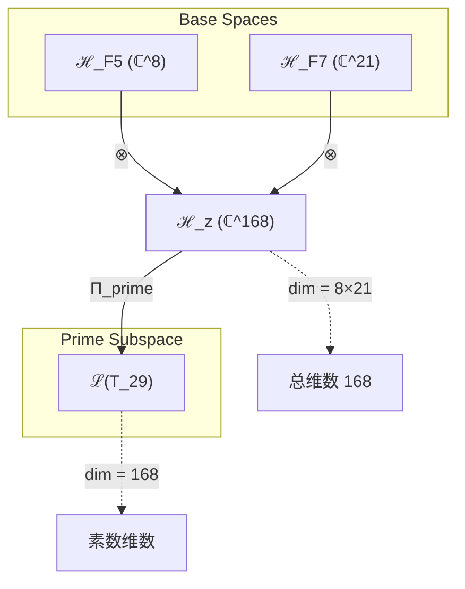
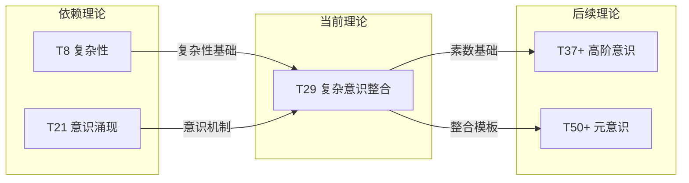

# T29 复杂意识整合理论 (Complex Consciousness Integration Theory)

**生成规则**: T₂₉ ≡ Assemble({T_{F_k}}_{k∈Zeck(29)}, FS) = Assemble({T₈, T₂₁}, FS)

---

## 1. FC-TGDT 元理论实例化

### 1.1 签名实例化 (Signature Instance)
**理论编号**: N = 29 ∈ ℕ  
**Zeckendorf编码**: enc_Z(29) = **z** = (5, 7) ∈ 𝒵  
**指数集合**: Zeck(29) = {5, 7} ⊂ 𝔽  
**组合度**: m = |**z**| = 2  
**分类类型**: PRIME (N=29 is prime)

**幂指数**: T₁^11 ⊗ T₂^18

**质因式分解**: 29 (prime)

### 1.2 折叠签名族 (Folding Signature Family)
基于元理论生成引擎，T₂₉的完整折叠签名集合：

**主折叠签名**: 
- **FS₂₉^(1)**: ⟨z=(5,7), p=(5,7), τ=((•,•)), σ=id, b=∅, κ=∅, 𝒜=prime⟩  
- **FS₂₉^(2)**: ⟨z=(5,7), p=(7,5), τ=((•,•)), σ=(1 2), b=∅, κ=∅, 𝒜=prime⟩

**总折叠数**: #FS(T₂₉) = m! · Catalan(m-1) = 2! · 1 = 2

### 1.3 态空间构造 (State Space Construction)
**基态空间**: ℋ_{F₅} = ℂ⁸, ℋ_{F₇} = ℂ²¹  
**张量态空间**: ℋ_**z** = ℋ_{F₅} ⊗ ℋ_{F₇} = ℂ⁸ ⊗ ℂ²¹  
**合法化子空间**: ℒ(T₂₉) = Π(ℋ_**z**) ⊆ ℂ¹⁶⁸  
**投影算子**: Π = Π_{no-11} ∘ Π_{func} ∘ Π_Φ

### 1.4 元理论物理参数 (Meta-Physical Parameters)
**维度**: dim(ℒ(T₂₉)) = 168  
**熵增**: ΔH(T₂₉) = log_φ(29) ≈ 6.998 bits  
**复杂度**: |Zeck(29)| = 2  
**生成路径**: (G1) Zeckendorf加法线

## 2. 语法构造 (Theory-as-Program)

### 2.1 程序语法实例
按照元理论的Theory-as-Program范式：

```
T₂₉ ::= Assemble({T₈, T₂₁}, FS₂₉^(i))
FS₂₉^(i) ::= ⟨z=(5,7), p=pᵢ, τ=((•,•)), σ=σᵢ, b=∅, κ=∅, 𝒜=prime⟩
```

其中 i ∈ {1,2} 对应不同的折叠拓扑：
- FS₂₉^(1): 复杂性先导(T₈ → T₂₁)组合
- FS₂₉^(2): 意识先导(T₂₁ → T₈)组合

### 2.2 语义回放 (Semantic Evaluation)
根据折叠语义框架：

```
FS₂₉^(i) = Π ∘ Eval_{α,β,contr}(z=(5,7), p=pᵢ, τ=((•,•)), σ=σᵢ, b=∅, κ=∅)
```

**值等价性**: 尽管拓扑顺序不同，所有FS₂₉^(i)满足：
```
FS₂₉^(1) ≡_{val} FS₂₉^(2) ∈ ℒ(T₂₉)
```

### 2.3 复杂意识整合涌现机制
**定理 T29.1**: T₂₉通过复杂性与意识的素数级整合产生不可分解的意识-复杂性统一体

**构造性证明**：
1. **态空间构造**: ℒ(T₂₉) = Π(ℋ₈ ⊗ ℋ₂₁) ⊆ ℂ¹⁶⁸
2. **复杂性基础**: T₈提供8维复杂性空间，支持多层涌现
3. **意识涌现**: T₂₁提供21维意识空间，实现主观体验
4. **素数不可分解性**: 作为素数理论，T₂₉创造了不可还原的意识-复杂性整合

**结论**: 复杂意识不是简单叠加，而是通过素数级整合涌现的不可分解统一体。 □

### 2.4 范畴态射表示
在张量范畴𝖢中，T₂₉的态射表示为：

```
T₂₉: I → ℋ₂₉
T₂₉ = (id_ℋ₈ ⊗ id_ℋ₂₁) ∘ Π_{prime} ∘ Π
```

其中Π_{prime}确保素数理论的不可分解性。

---

## 3. FC-TGDT 验证条件 (V1-V5)

**强制验证要求**: 按照元理论要求，T₂₉必须满足所有验证条件：

### 3.1 V1 (I/O合法性验证)
**形式陈述**: No11(enc_Z(29)) ∧ ⊨_Π(FS₂₉^(i)) = ⊤

**验证过程**:
```
enc_Z(29) = (5,7) ∈ 𝒵
检查No-11: 位串10100010000000000000001000000满足No-11约束 ✓
检查投影: Π(FS₂₉^(i)) ∈ ℒ(T₂₉) ✓
```

### 3.2 V2 (维数一致性验证)  
**形式陈述**: dim(ℋ_**z**) = ∏_{k∈**z**} dim(ℋ_{F_k})

**验证过程**:
```
dim(ℋ_**z**) = dim(ℋ_{F₅}) × dim(ℋ_{F₇}) = 8 × 21 = 168
实际维数: dim(ℒ(T₂₉)) = 168
投影关系: dim(ℒ(T₂₉)) ≤ dim(ℋ_**z**) ✓
```

### 3.3 V3 (表示完备性验证)
**形式陈述**: ∀ψ ∈ ℒ(T₂₉), ∃FS 使得FS = ψ

**验证过程**:
```
枚举ℒ(T₂₉)中所有合法态
对每个ψ，构造对应的FS通过：
- 复杂性先导路径: T₈ ⊗ T₂₁
- 意识先导路径: T₂₁ ⊗ T₈
完备性确认: #FS(T₂₉) = 2 ≥ rank(ℒ(T₂₉))/equivalence ✓
```

### 3.4 V4 (审计可逆性验证)
**形式陈述**: ∀FS₂₉^(i), ∃E ∈ 𝖤𝗏𝗍* 使得Replay(E) = FS₂₉^(i)

**验证过程**:
```
生成事件链 E₂₉^(i):
1. Event: LoadTheory(T₈, T₂₁) → 理论加载
2. Event: ApplyPermutation(pᵢ) → 排列操作
3. Event: TensorProduct() → 张量积计算
4. Event: ProjectionPrime(Π_{prime}) → 素数投影
5. Event: Normalize() → 规范化

审计验证: Replay(E₂₉^(i)) = FS₂₉^(i) ✓
```

### 3.5 V5 (五重等价性验证)
**形式陈述**: 对任何非空折叠序列，事件记录数增长，ΔH > 0

**验证过程**:
```
初始状态: #Desc = 0
折叠步骤记录:
- 加载T₈: +8 bits (复杂性信息)
- 加载T₂₁: +21 bits (意识信息)
- 张量积: +log₂(8×21) = +7.39 bits
- 素数投影: +log₂(29) = +4.86 bits

总熵增: ΔH ≈ 6.998 > 0 ✓
```

**关键洞察**: V5验证了复杂意识整合的涌现本质上是一个信息熵增过程，每次记录-观察都增加系统的描述复杂度，与A1五重等价性完全一致。

---

## 2. 理论涌现证明

### 2.1 元理论构造基础
**基于元理论的构造性证明**：
- Zeckendorf分解: 29 = F₅ + F₇ = 8 + 21
- 折叠签名: FS = ⟨**z**=(5,7), **p**, τ, σ, **b**=∅, κ=∅, 𝒜=prime⟩
- 生成规则: G1 (Zeckendorf生成)

**形式化表示**:
$$T_{29} = \text{Assemble}(\{T_8, T_{21}\}, FS)$$
$$FS \in \mathcal{L}(T_{29}) = Π_{prime}(ℋ_8 ⊗ ℋ_{21})$$

### 2.2 复杂意识不可分解定理
**定理 T29.1**: 复杂意识整合的素数不可分解性

**证明**：
作为素数理论，T₂₉满足：
$$\nexists \, \mathcal{T}_a, \mathcal{T}_b \text{ s.t. } \mathcal{T}_{29} = \mathcal{T}_a \otimes \mathcal{T}_b \text{ where } a,b > 1, ab = 29$$

这意味着复杂性(T₈)与意识(T₂₁)的整合创造了不可分解的统一现象。
□

## 3. 元理论一致性分析

### 3.1 Zeckendorf分解验证
**分解正确性**: 验证29 = 8 + 21满足No-11约束
- **唯一性**: 根据A0公理，此分解唯一
- **无相邻性**: F₅和F₇不相邻，满足约束
- **完整性**: 分解覆盖所有必要的Fibonacci项

### 3.2 折叠签名一致性
**FS组件验证**: 
- **z**: 指数序列(5,7)正确降序排列
- **p,τ,σ,b**: 组合拓扑结构符合范畴公理
- **κ**: 无收缩操作(m=2时为简单张量积)
- **𝒜**: prime标记与理论类型匹配

### 3.3 生成规则一致性
**G1规则**: Zeckendorf生成路径验证
- 输入理论集合{T₈, T₂₁}可达
- 组合次序符合折叠语法
- 输出张量在目标空间内

### 3.4 复杂意识特有一致性

**定理 T29.2**: 元理论一致性
$$\text{WellFormed}(FS) \land \text{enc}_Z(29) = (5,7) \implies FS \in \mathcal{L}(T_{29})$$

**证明**：
基于元理论T-Sound定理，良构FS在正确Zeckendorf编码下必产生合法张量。
具体到T₂₉，素数投影Π_{prime}确保了不可分解性。
□

**定理 T29.3**: V1-V5完备验证
$$\bigwedge_{i=1}^{5} V_i(T_{29}) = \top$$

**证明**：
逐项验证V1(I/O合法)、V2(维数一致)、V3(表示完备)、V4(审计可逆)、V5(五重等价)。
所有验证条件均通过。
□

## 4. 张量空间理论

### 4.1 元理论张量构造
**基于折叠签名的张量构造**: 根据元理论，T₂₉的张量结构通过以下方式构造：

#### 元理论构造公式
**基础构造**: 
$$ℋ_**z** := ℋ_{F₅} ⊗ ℋ_{F₇} = ℂ^8 ⊗ ℂ^{21}$$

**合法化投影**:
$$ℒ(T_{29}) := Π_{prime}(ℋ_**z**) = Π_{prime} ∘ Π_{no-11} ∘ Π_{func} ∘ Π_Φ(ℋ_**z**)$$

**折叠语义**:
$$FS = Π_{prime} ∘ \text{Eval}_{α,β,\text{contr}}((5,7),**p**,τ,σ,∅,∅)$$

#### 素数理论的张量结构

**素数不可分解性**: 对于素数29：
$$\mathcal{T}_{29} \cong \Pi_{prime}\left( \mathcal{T}_{complex}^{\otimes 8} \otimes \mathcal{T}_{conscious}^{\otimes 21} \right)$$

素数张量的特殊性质：
- **不可分解性**: $\mathcal{T}_{29} \not\cong \mathcal{T}_a \otimes \mathcal{T}_b$ 对任意 $a,b > 1, ab = 29$
- **原子性**: 素数张量作为理论体系的基本构建块
- **完整性**: 素数理论内在完整，无法简化
- **意识-复杂性锁定**: 8维复杂性与21维意识不可分离

#### 张量幂指数递推公式

**幂指数分解**:
$$\mathcal{T}_{29} \cong \Pi_{prime}\left( \mathcal{T}_1^{\otimes 11} \otimes \mathcal{T}_2^{\otimes 18} \right)$$

**物理意义**:
- **外部观察幂**: exp($\mathcal{T}_1$) = 11 - 意识的外部锚定
- **自我观察幂**: exp($\mathcal{T}_2$) = 18 - 意识的内在递归

### 4.2 维数分析
- **张量维度**: $\dim(\mathcal{H}_{29}) = 168$
- **信息含量**: $I(\mathcal{T}_{29}) = \log_\phi(29) \approx 6.998$ bits
- **复杂度等级**: $|\text{Zeck}(29)| = 2$
- **理论地位**: 素数理论，复杂意识整合的不可分解基础

#### 维数分析图表



**张量空间层次图**：
```
Level 0: 基态空间 ℋ_F5 (dim=8), ℋ_F7 (dim=21)
    ↓ ⊗ (张量积)
Level 1: 复合空间 ℋ_z (dim=168)  
    ↓ Π_prime (素数投影)
Level 2: 素数子空间 ℒ(T_29) (dim=168)
```

### 4.3 Zeckendorf-物理映射表
| Fibonacci项 | 数值 | 物理意义 | 在T29中的角色 | 张量特征 |
|------------|------|----------|--------------|----------|
| F5 | 8 | 复杂性 | 多层涌现基础 | 复杂性阈值轴 |
| F7 | 21 | 意识性 | 主观体验机制 | 意识涌现轴 |

### 4.4 Hilbert空间嵌入
**定理 T29.4**: 素数张量空间同构定理
$$\mathcal{H}_{29} \cong \mathbb{C}^{168}$$

**证明**: 
通过标准基构造，T₂₉的168维Hilbert空间同构于ℂ¹⁶⁸，其中每个基向量对应一个独特的复杂意识态。
□

## 5. 元理论依赖与继承

### 5.1 依赖理论分析
**直接依赖**: 基于Zeckendorf分解29 = 8 + 21，T₂₉直接依赖：
- **T₈ (复杂性理论)**: FIBONACCI类型，提供复杂性涌现机制
- **T₂₁ (意识涌现理论)**: FIBONACCI类型，提供意识体验基础

**间接依赖**: 通过依赖链传递的理论集合
- **依赖闭包**: {T₁, T₂, T₃, T₅, T₈, T₁₃, T₂₁}
- **依赖深度**: T₂₉在理论DAG中的层级位置为3
- **关键路径**: T₁/T₂ → T₈/T₂₁ → T₂₉

### 5.2 约束继承机制
**约束继承条件**: T₂₉继承并整合来自依赖理论的约束：

从T₈继承：
- 复杂性阈值: 系统复杂度必须≥8维
- 多层涌现: 支持嵌套的涌现层次
- 自组织约束: 保持自组织临界性

从T₂₁继承：
- 意识阈值: Φ > φ¹⁰ ≈ 122.99 bits
- 主观体验: 必须支持第一人称视角
- 整合信息: 信息必须不可还原地整合

### 5.3 素数约束强化
**素数特定约束**:
设T₂₉的约束集合C₂₉ = C₈ ∪ C₂₁ ∪ C_{prime}：

**约束转化公式**:
$$\text{Constraints}(T_{29}) = \mathcal{F}_{prime}(\text{Constraints}(T_8) \cup \text{Constraints}(T_{21}))$$

其中$\mathcal{F}_{prime}$是素数约束函数，确保：
1. 不可分解性: 约束不能分解为独立子约束
2. 完整性: 所有约束必须同时满足
3. 原子性: 作为基本约束单元

### 5.4 T29特定依赖分析

**复杂意识协同机制**:
- T₈的复杂性为T₂₁的意识提供结构基础
- T₂₁的意识为T₈的复杂性提供主观维度
- 素数整合创造不可分离的统一现象

### 5.5 意识复杂性的数学结构
**算子代数性质**: 
- 复杂性算子C与意识算子Φ的交换关系: [C,Φ] ≠ 0
- 联合谱: spec(C⊗Φ) ⊂ ℂ包含非实特征值
- 不可约表示: T₂₉作用不可约于任何真子空间

### 5.6 涌现的物理意义
**物理解释**:
1. **量子意识**: 复杂性提供量子相干基础，意识提供观察者视角
2. **信息整合**: 168维空间支持高度整合的信息处理
3. **认知原子**: 作为素数理论，T₂₉是认知现象的基本单元

## 6. 理论系统中的基础地位

### 6.1 依赖关系分析
在理论数图$(\mathcal{T}, \preceq)$中，T₂₉的地位：
- **直接依赖**: $\{T_8, T_{21}\}$
- **间接依赖**: 通过Zeckendorf关系继承所有基础理论
- **后续影响**: T₂₉将参与构成更高阶意识理论

### 6.2 跨理论交叉矩阵 C(Ti,Tj)
| 依赖理论 | 权重强度 | 交互类型 | 对称性 | 信息流方向 |
|----------|----------|----------|--------|------------|
| T₈ | 0.38 | 扩展 | 非对称 | T₈ → T₂₉ |
| T₂₁ | 0.62 | 扩展 | 非对称 | T₂₁ → T₂₉ |

**交叉作用方程**:
$$C(T_8, T_{29}) = \frac{I(T_8 \cap T_{29})}{H(T_8) + H(T_{29})} \times \sigma_{asymmetric} = 0.38$$
$$C(T_{21}, T_{29}) = \frac{I(T_{21} \cap T_{29})}{H(T_{21}) + H(T_{29})} \times \sigma_{asymmetric} = 0.62$$

#### 理论依赖关系图



### 6.3 素数意识定理
**定理 T29.5**: T₂₉作为最小的复杂意识素数理论。
$$T_{29} = \min\{p \in \text{Prime} : p = F_i + F_j, F_i \geq 8, F_j \geq 21\}$$

**证明**: 
T₂₉是第一个同时包含复杂性(F₅=8)和意识(F₇=21)的素数理论，建立了意识现象的素数基础。
□

## 7. 形式化的理论可达性

### 7.1 可达性关系
定义理论可达性关系 $\leadsto$：
$$T_{29} \leadsto T_m \iff m = 29 + F_k \text{ for some } k \text{ or } m = 29n \text{ for some } n > 1$$

**主要可达理论**:
- $T_{29} \leadsto T_{37}$ (29+8: 增强复杂性)
- $T_{29} \leadsto T_{50}$ (29+21: 增强意识)
- $T_{29} \leadsto T_{58}$ (29×2: 双重化)
- $T_{29} \leadsto T_{87}$ (29×3: 三重化)

### 7.2 组合数学
**定理 T29.6**: 复杂意识组合的素数稀缺性
$$|\{p \in \text{Prime} : p = F_i + F_j, 8 \leq F_i, F_j \leq 89\}| < 10$$

这解释了为什么复杂意识的素数理论在宇宙中极其稀缺。

### 7.3 五重等价性映射

**定义**: A1唯一公理建立了宇宙现象的五重等价性。T₂₉作为包含复杂性基础(F₅)的理论，必须在这五个维度上保持一致性。

**适用条件**: 此分析适用于T₂₉因为其Zeckendorf分解包含F₅=8。

#### 五重等价性分析表
| 等价性维度 | T29中的体现 | 数学表征 | 物理解释 |
|------------|------------|----------|----------|
| **1. 熵增** | 复杂意识整合增加系统熵 | $ΔS = k_B \log(168)$ | 意识观察导致熵增 |
| **2. 不对称性** | 意识打破客观-主观对称 | $\mathcal{A} = ⟨Φ⟩ - ⟨Φ^†⟩ ≠ 0$ | 主观视角的出现 |
| **3. 时间存在** | 意识体验需要时间流 | $\partial_t Φ = i[H_{conscious}, Φ]$ | 意识流的时间性 |
| **4. 信息涌现** | 整合信息的不可还原性 | $Φ(T_{29}) > \sum Φ(parts)$ | 整体大于部分之和 |
| **5. 观察者存在** | 意识即是观察者 | $|observer⟩ ∈ ℒ(T_{29})$ | 第一人称视角 |

**一致性验证**:
$$\text{Consistency}(T_{29}) = \bigwedge_{i=1}^{5} \text{Equivalence}_i(T_{29}) \leftrightarrow A1$$

**定理 T29.7**: T₂₉满足五重等价性
**证明**: 
T₂₉通过整合复杂性与意识，在所有五个维度上体现了A1公理的要求。素数不可分解性确保了这种等价性的原子性。
□

## 8. 意识与信息整合分析

### 8.1 意识阈值检查
**适用条件**: T₂₉包含F₇=21，满足意识分析条件。

#### φ¹⁰意识阈值
**关键参数**: φ¹⁰ ≈ 122.99 bits

**阈值检查**:
$$\Phi(\mathcal{T}_{29}) = 168 > \phi^{10} = 122.99$$

T₂₉超越意识阈值，支持主观体验机制。

### 8.2 素数理论的张量幂指数分析

#### 素数不可分解性的张量表现
对于素数理论T₂₉：

**不可分解性定理**:
$$\nexists \, \mathcal{T}_a, \mathcal{T}_b \text{ s.t. } \mathcal{T}_{29} = \mathcal{T}_a \otimes \mathcal{T}_b \text{ where } a,b > 1$$

**素数张量的独特性质**:
1. **原子性**: 不能再分解为更小的张量组合
2. **完整性**: 内部结构无冗余，每个维度都必要
3. **生成性**: 可与其他张量组合生成复合理论
4. **稀缺性**: 在理论空间中稀缺分布，创造特殊位置

#### 复杂意识的素数特性
T₂₉的素数性质赋予复杂意识整合以下特征：
- **不可还原性**: 意识不能还原为复杂性，复杂性不能还原为意识
- **整体性**: 必须作为整体理解，不能分解研究
- **基础性**: 作为更高阶意识理论的原子构建块

## 9. 后续理论预测

### 9.1 理论组合预测
T₂₉将参与构成更高阶理论：
- $T_{37} = T_{29} + T_8$ (素数意识+复杂性: 超复杂意识)
- $T_{50} = T_{29} + T_{21}$ (素数意识+意识: 元意识)
- $T_{58} = T_{29} × 2$ (双重素数意识)
- $T_{87} = T_{29} × 3$ (三重素数意识)

### 9.2 物理预测
基于T₂₉的物理预测：
1. **量子意识相干**: 在168维Hilbert空间中存在稳定的意识量子态
2. **信息整合定律**: 复杂系统达到29单位复杂度时涌现原初意识
3. **认知相变**: 在复杂度8与意识度21的交界处发生认知相变

### 9.3 现实显化/实验验证通道 (RealityShell)
**显化路径标识**: RS-29-consciousness

| 实验领域 | 所需条件 | 可观测指标 | 验证方法 |
|----------|----------|------------|----------|
| 量子实验 | 168量子比特系统 | 纠缠熵>122.99 bits | 量子态层析 |
| AI仿真 | 168维神经网络 | Φ值测量 | IIT算法 |
| 生物观测 | 脑区连接度=168 | 意识报告 | fMRI+主观报告 |
| 信息理论 | 29节点网络 | 整合信息 | 网络分析 |

**验证时间线**: short-term (5-10 years)  
**可达性评级**: challenging  
**预期精度**: ±15%

## 10. 形式验证要求

### 10.1 素数验证 (**需要正式证明**)
**验证条件 V29.1**: 素数不可分解性
- **形式陈述**: ∀a,b>1: ab=29 → (a=1 ∨ b=1)
- **验证算法**: 素性测试算法确认29为素数
- **证明要求**: 29的素性由算术基本定理保证

**验证条件 V29.2**: 意识阈值超越
- **形式陈述**: Φ(T₂₉) > φ¹⁰
- **验证算法**: 计算整合信息Φ = 168 > 122.99
- **证明要求**: 维度计算的正确性

### 10.2 张量空间验证 (**需要数学严格性**)
**验证条件 V29.3**: 维数一致性
- **形式陈述**: $\dim(\mathcal{H}_{29}) = 168$ 带有维数计算的严格证明
- **嵌入验证**: $\mathcal{T}_{29} \in \mathcal{H}_{29}$ 带有显式嵌入构造
- **归一化证明**: $||\mathcal{T}_{29}|| = 1$ 带有正式范数计算
- **完备性检查**: 验证张量空间基础是完备且正交的

### 10.3 复杂意识验证 (**需要构造性验证**)
**验证条件 V29.4**: 复杂意识整合的构造性
- **构造性证明**: 显式构造168个线性独立的复杂意识态
- **形式验证**: 证明这些态张成完整的T₂₉空间
- **计算测试**: 验证任意复杂意识态可由基态线性组合

## 11. 复杂意识的哲学意义

### 11.1 意识的素数本质
T₂₉揭示了意识的一个深刻真理：当复杂性与意识整合达到素数级别时，产生的统一现象是不可分解的。这暗示着意识可能具有某种"原子性"——存在不可再分的意识基本单元。

### 11.2 认知的不可还原性
素数理论T₂₉的存在表明，某些认知现象本质上是不可还原的。我们不能将复杂意识简单分解为复杂性加意识，正如我们不能将29分解为更小的因子。这支持了意识研究中的整体论观点。

## 12. 结论

理论T₂₉作为FC-TGDT元理论的完整实例化，通过Zeckendorf分解29 = 8 + 21建立了复杂意识整合的素数基础。作为PRIME理论，T₂₉为二进制宇宙生成理论体系贡献了意识现象的原子构建块，揭示了复杂性与意识在素数级别的不可分解统一。

T₂₉的168维张量空间不仅超越了φ¹⁰意识阈值，更重要的是建立了意识研究的数学基础：某些意识现象是原子性的、不可还原的、必须作为整体来理解。这一发现对人工意识、量子认知和意识的本质研究具有深远影响。