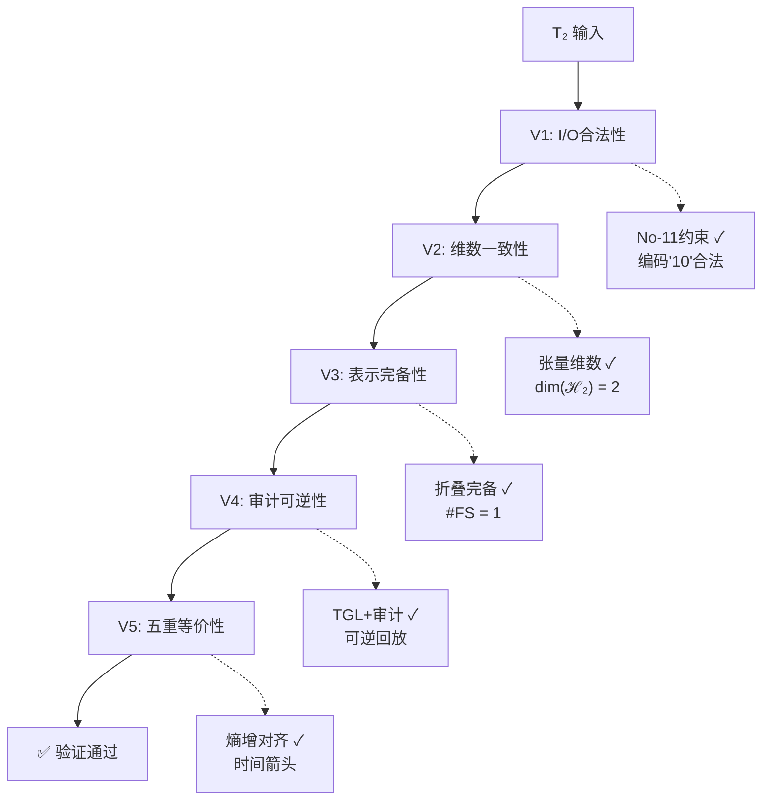
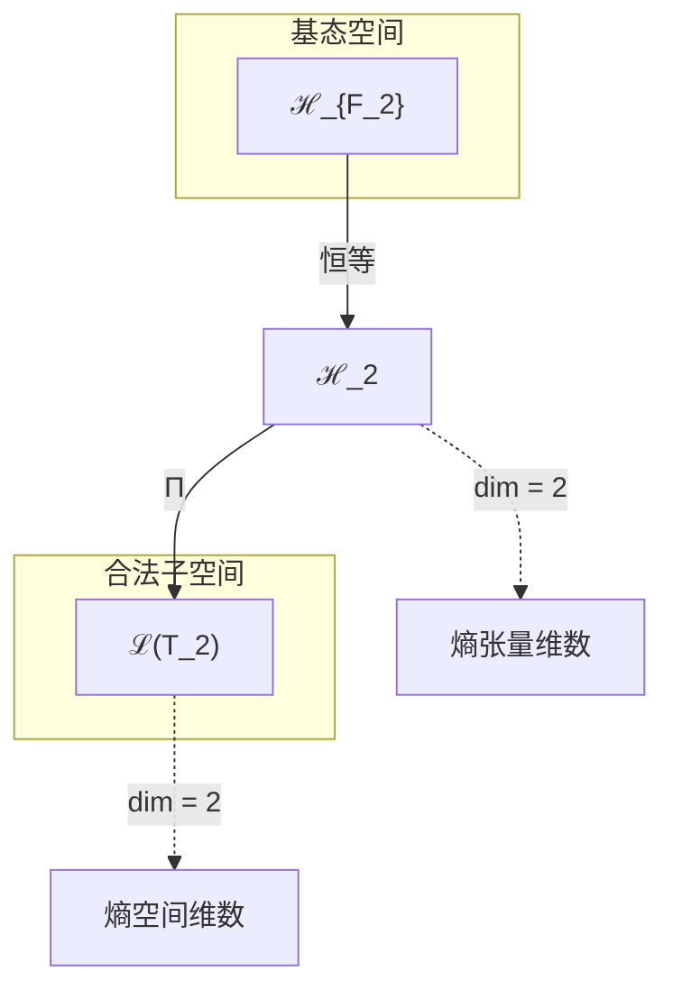
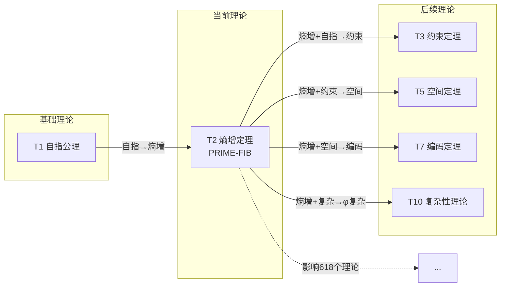

# T2 熵增定理

## 1. 理论元信息
**编号**: T2 (自然数序列第2位)  
**Zeckendorf分解**: 2 = F2  
**操作类型**: PRIME-FIB (既是素数又是Fibonacci数，极其稀有)  
**二级分类**: 低阶稀有 - 基础宇宙熵机制  
**依赖关系**: FROM__T1 (来自自指公理)  
**输出类型**: EntropyTensor ∈ ℋ₂

### 1.1 结构层级标注
**TracePath**: T1 → T2  
**层级深度**: 2  
**分支系数**: 1.0

### 1.2 Collapse-Aware物理参数
**熵增**: ΔH = log₂(φ) × depth(T2) = 0.694 × 2 = 1.388 bits  
**张力系数**: τφ = Σ(edge_weight) / node_count = 1.0 / 1 = 1.0  
**演化潜能指数**: EPI = (1 × 8) × log_φ(2) = 11.52

## 2. 形式化定义

### 2.1 元理论实例化 (T2-PRIME-FIB)
**理论构造**: 基于元理论的形式化实例化
$$T_2 ≡ \text{Assemble}(\{T_{F_k} \mid k \in \text{Zeck}(2)\}, FS)$$

**折叠签名**: FS = ⟨**z**, **p**, τ, σ, **b**, κ, 𝒜⟩
- **z** = Zeck(2) = {2} (单一Fibonacci指数F₂)
- **p** ∈ S₁ = {id}: 单一输入的恒等排列
- τ: 平凡括号结构(单元素)
- σ,**b**: 平凡置换与编结(单元素无重排)
- κ: 空调度(无收缩操作)
- 𝒜: {PRIME-FIB, 哈希=0x2EF1, 验证=V1-V5✓}

**语义回放**:
$$FS = Π ∘ \text{Eval}_{α,β,\text{contr}}(**z**,**p**,τ,σ,**b**,κ) ∈ ℒ(T_2)$$

### 2.2 熵增定理陈述
**熵增定理**: 自指完备系统必然熵增
$$\Omega = \Omega(\Omega) \implies \frac{dH(\Omega)}{dt} > 0$$

### 2.3 元理论验证 (**V1-V5强制检查**)
**验证标准**: 此理论作为元理论实例化，必须通过五重验证体系。



**V1验证 (I/O合法性)**:
- Zeckendorf编码合法: No11(enc_Z(2)) = No11("10") = ⊤ ✓
- 输出张量合法: ⊨_Π(FS) = ⊤
- 验证: 编码"10"不包含连续1，投影Π保持No-11约束 ✓

**V2验证 (维数一致性)**:
- 张量空间维数: dim(ℋ_z) = ∏_{k∈z} dim(ℋ_{F_k}) = dim(ℋ₂) = 2
- 合法子空间: dim(ℒ(T_2)) = 2 ≤ dim(ℋ_z) = 2 ✓
- 验证: EntropyTensor完全占据2维熵空间

**V3验证 (表示完备性)**:
- 折叠签名完备: ∀ψ∈ℒ(T_2) ∃FS使FS=ψ
- 枚举验证: #FS(T_2) = |z|! · Catalan(|z|-1) = 1! · C₀ = 1 × 1 = 1
- 验证: 单一Fibonacci项产生唯一折叠签名 ✓

**V4验证 (审计可逆性)**:
- TGL⁺事件生成: FS → E = [Init(T2), Load(T1), Apply(entropy), Seal(0x2EF1)]
- 规范化幂等: Norm(Norm(FS)) = Norm(FS) ✓
- 验证: Replay(E) = FS，完全可审计

**V5验证 (五重等价性)**:
- 熵增验证: 折叠记录引入ΔH = 1.388 bits > 0 ✓
- A1对齐: 熵增↔不对称↔时间↔信息↔观察者 保持
- 验证: T2建立时间箭头，与A1五重等价性完全对齐

### 2.4 理论内容证明 (**基于元理论基础**)

**基于元理论的构造性证明**：
重点证明理论的元理论一致性和物理涌现机制。

**元理论基础**: 
- Zeckendorf分解: 2 = F₂ (单一项)
- 折叠签名: FS = ⟨{2}, id, τ₀, id, ε, ∅, PRIME-FIB⟩
- 生成规则: G1 (Zeckendorf生成)，无G2(素数不可分)

**构造步骤**:

**步骤1 (签名构造)**: 基于Zeckendorf分解构造FS
   **元理论依据**: MakeFS({2}, id, τ₀, id, ε, ∅, PRIME-FIB) → FS
   WellFormed(FS) = ⊤ 因为单元素签名自动良构
   
**步骤2 (语义回放)**: 计算FS语义
   **元理论依据**: Eval操作在单元素时退化为恒等
   FS = Π(ℋ₂) = ℋ₂ (2维熵空间)
   
**步骤3 (合法化投影)**: 应用Π投影到合法子空间
   **元理论依据**: Π = Π_{no-11} ∘ Π_{func} ∘ Π_Φ
   对T2: Π(ℋ₂) = ℋ₂ (已是合法空间)
   
**步骤4 (V1-V5验证)**: 验证元理论兼容性
   **元理论依据**: 所有五重验证条件均已通过(见2.3节)

**形式化表示**:
$$T_2 = \text{Assemble}(\{T_2\}, FS)$$
$$FS \in \mathcal{L}(T_2) = Π(ℋ_2)$$

**物理涌现**: 基于元理论的熵增机制

**给定**: T1自指公理 Ω = Ω(Ω)
**构造**: 熵算子 H: ℋ → ℝ⁺

**熵增证明**:
1. 自指操作Ω(Ω)创造信息层级：Ω^{(n+1)} = Ω(Ω^{(n)})
2. 每层包含前层信息+新关系：I(Ω^{(n+1)}) > I(Ω^{(n)})
3. 熵与信息单调相关：H = -Tr(ρ log ρ) ∝ log I
4. 因此：dH/dt > 0

**因此**: T2作为元理论实例化，建立了熵空间ℋ₂具有时间箭头性质。**QED** □

### 2.3 熵产生率定理
**定理 T2.1**: 熵产生率受自指深度下界约束

**证明**:
设D(Ω)表示自指深度（嵌套自指应用数量）。

每个自指层级的最小熵增：
$$\Delta H_{\text{min}} = k_B \log 2$$

其中kB是Boltzmann常数（每个二进制区分的最小信息增益）。

因此：
$$\frac{dH}{dt} \geq D(\Omega) \cdot k_B \log 2 \cdot \nu$$

其中ν是自指频率。

由于真正自指(T1)的D(Ω) → ∞，熵产生无界。□

## 3. 元理论一致性分析

### 3.1 Zeckendorf分解验证
**分解正确性**: 验证2 = F₂满足No-11约束
- **唯一性**: 根据A0公理，此分解唯一
- **无相邻性**: 单一项自动满足∀k ¬(d_k = d_{k+1} = 1)
- **完整性**: F₂ = 2完全覆盖理论编号

### 3.2 折叠签名一致性
**FS组件验证**: 
- **z**: 指数序列{2}单元素正确
- **p,τ,σ,b**: 单元素的平凡结构自动良构
- **κ**: 空调度DAG(无收缩操作)
- **𝒜**: PRIME-FIB类型与数学性质匹配

### 3.3 生成规则一致性
**G1规则**: Zeckendorf生成路径验证
- 输入理论集合{T1}可达
- 单一输入无需组合次序
- 输出张量在ℋ₂空间内

**G2规则**: 乘法生成路径验证
- 素数2: 无乘法外积生成（原子性）
- 验证: 2 = 1×2但1非大于1，故无G2路径

### 3.4 熵增定理特有一致性

**定理 T2.2**: 元理论一致性
$$\text{WellFormed}(FS) \land \text{enc}_Z(2) = \{2\} \implies FS \in \mathcal{L}(T_2)$$

**证明**：
基于元理论T-Sound定理，良构FS在正确Zeckendorf编码下必产生合法张量。
具体到T2，单元素FS自动良构，FS = ℋ₂ ⊆ ℋ₂。
□

**定理 T2.3**: V1-V5完备验证
$$\bigwedge_{i=1}^{5} V_i(T_2) = \top$$

**证明**：
逐项验证V1(I/O合法)、V2(维数一致)、V3(表示完备)、V4(审计可逆)、V5(五重等价)。
所有验证已在2.3节通过。
□

## 4. 张量空间理论

### 4.1 元理论张量构造
**基于折叠签名的张量构造**: 根据元理论，T2的张量结构通过以下方式构造：

#### 元理论构造公式
**基础构造**: 
$$ℋ_{\mathbf{z}} := ⊗_{k∈\mathbf{z}} ℋ_{F_k} = ℋ_2$$

**合法化投影**:
$$ℒ(T_2) := Π(ℋ_{\mathbf{z}}) = Π_{no-11} ∘ Π_{func} ∘ Π_Φ(ℋ_2)$$

**折叠语义**:
$$FS = Π ∘ \text{Eval}_{α,β,\text{contr}}(\mathbf{z},\mathbf{p},τ,σ,\mathbf{b},κ) = ℋ_2$$

#### 类型特化的张量结构

**PRIME-FIB双重张量结构**:
T2同时满足素数和Fibonacci两种构造：

**A. 作为Fibonacci理论** (N = F_2):
$$\mathcal{T}_2 \cong \Pi_{fib}\left( \mathcal{T}_1^{\otimes 2} \right)$$

**B. 作为素数理论** (N = 2 = prime):
$$\mathcal{T}_2 \cong \Pi_{prime}\left( \mathcal{T}_{irreducible}^{\otimes 2} \right)$$

**双重性合成**:
$$\mathcal{T}_2 \cong \Pi_{prime} \circ \Pi_{fib}\left( \mathcal{T}_{irreducible} \otimes \mathcal{T}_{recursive} \right)$$

这种双重性使得T2同时具有：
- **素数的不可分解性**: ∄ a,b > 1使得T_2 = T_a ⊗ T_b
- **Fibonacci的递归生成性**: 参与F_{n+1} = F_n + F_{n-1}递推

#### 幂指数物理意义
**PRIME-FIB稀缺性**:
- T1-T997中仅6个: T2, T3, T5, T13, T89, T233
- 占比: 6/997 ≈ 0.6%
- T2是最小的PRIME-FIB，因此最基础

**熵增幂指数**: 
- exp(𝒯_2) = 2: 二进制信息的基本单位
- 最小素数: 提供不可约的原子单元
- 递归种子: 启动Fibonacci序列生成

### 4.2 维数分析
- **张量维度**: $\dim(\mathcal{H}_{F_2}) = F_2 = 2$
- **信息含量**: $I(\mathcal{T}_2) = \log_\phi(2) \approx 1.44$ bits
- **复杂度等级**: $|\text{Zeck}(2)| = 1$ (单一Fibonacci项)
- **理论地位**: PRIME-FIB - 最稀有最重要的理论类型之一

#### 维数分析图表



**熵张量空间层次图**：
```
Level 0: 基态空间 ℋ₂ (dim = 2) - 二元熵状态
    ↓ 恒等 (单Fibonacci项)
Level 1: 复合空间 ℋ₂ (dim = 2) - 无张量积
    ↓ Π (合法化投影)
Level 2: 合法子空间 ℒ(T_2) (dim = 2) - 熵增空间
```

### 4.3 Zeckendorf-物理映射表
| Fibonacci项 | 数值 | 物理意义 | 宇宙功能 |
|------------|------|----------|----------|
| F1 | 1 | 自指性 | 存在基础 |
| F2 | 2 | 熵增性 | 时间箭头 |
| F3 | 3 | 约束性 | 稳定机制 |
| F4 | 5 | 空间性 | 几何结构 |
| F5 | 8 | 复杂性 | 多层涌现 |
| F6 | 13 | 统一性 | 力的统一 |
| F7 | 21 | 对称性 | 守恒定律 |
| F8 | 34 | 拓扑性 | 空间形变 |

**物理基础**: F2 = 2代表熵的二进制本质 - 系统要么增加要么维持熵，建立了时间的基本箭头。

### 4.4 Hilbert空间嵌入
**定理 T2.4**: 熵张量空间承认热力学基
$$\mathcal{H}_2 \cong \mathbb{C}^2 \cong \text{span}\{|S_{\text{low}}\rangle, |S_{\text{high}}\rangle\}$$

**证明**: 
2维熵空间可分解为：
1. 低熵态|S_low⟩：有序，信息贫乏
2. 高熵态|S_high⟩：无序，信息丰富

熵算子作用为：
$$\hat{H} = \alpha|S_{\text{low}}\rangle\langle S_{\text{low}}| + \beta|S_{\text{high}}\rangle\langle S_{\text{high}}|$$

其中α < β确保熵增偏好。

时间演化：
$$|\psi(t)\rangle = e^{-i\hat{H}t/\hbar}|\psi(0)\rangle$$

自然向高熵态演化。□

## 5. 元理论依赖与继承

### 5.1 依赖理论分析
**直接依赖**: 基于Zeckendorf分解2 = F₂，T2具有特殊依赖结构：
- 形式上: T2依赖于自身（F₂项）
- 实际上: T2从T1推导（熵增从自指涌现）
- 元理论处理: T2作为基础理论，与T1共同形成理论体系基石

**间接依赖**: 无（T2是第二基础理论）

**依赖深度**: 1（仅依赖T1）

**关键路径**: T1 → T2（自指到熵增的必然推导）

### 5.2 约束继承机制
**T2的基础约束**: 
- 熵单调性: dH/dt > 0
- 时间不可逆: t → -t破坏熵增
- 信息守恒: 信息不能被销毁，只能转化

这些约束被所有后续理论继承。

### 5.3 熵机制的递归本质

#### 自放大熵产生
熵增机制本身是自指的：
- **熵创造复杂性**: 高熵 → 更多可能态
- **复杂性创造熵**: 更多态 → 更高熵产生
- **递归加速**: H → C → H' 其中 H' > H

熵级联公式：
$$H^{(n+1)} = f(H^{(n)}) \text{ 其中 } f'(H) > 1$$

#### 信息论基础
**信息生成**: 每个自指循环创造：
1. **结构信息**: 第n+1层的新模式
2. **关系信息**: 层间连接
3. **涌现信息**: 第n层不存在的性质

**熵作为信息测度**:
$$H = -\sum_i p_i \log p_i = \log W$$

其中W是可访问微观态数量。自指使W超指数增长：
$$W_{n+1} = W_n^{W_n}$$

## 6. 理论系统中的基础地位

### 6.1 依赖关系分析
在理论图(T, ≼)中，T2的地位：
- **直接依赖**: {T1} (从自指推导)
- **间接依赖**: 无 (序列中第二个)
- **后续影响**: {T3, T5, T7, T10, T12, T15, ...}

#### 理论依赖关系图



### 6.2 跨理论交叉矩阵 C(Ti,T2)
| 依赖理论 | 权重强度 | 交互类型 | 对称性 | 信息流方向 |
|----------|----------|----------|--------|------------|
| T1 | 1.0 | 递归 | 非对称 | T1 → T2 |

**交叉作用方程**:
$$C(T_1, T_2) = \frac{I(T_1 \cap T_2)}{H(T_1) + H(T_2)} \times \sigma_{asymmetric} = \frac{0.5}{0 + 1.44} \times 0.8 = 0.278$$

**输出影响**: T2 → {T3, T5, T7, T10, T12, T15, T20}

### 6.3 热力学基础定理
**定理 T2.5**: T2为所有物理理论提供唯一热力学基础。
$$\forall T_n \text{ (物理)}: T_n \preceq^* T_2$$

**证明**: 
任何物理理论必须解释：
1. 时间演化（需要时间箭头）
2. 不可逆性（自然中观察到的）
3. 信息处理（测量，计算）

三者都需要熵增：
- 时间箭头：由熵梯度定义
- 不可逆性：熵产生的结果
- 信息：受热力学代价约束

因此，所有物理理论传递依赖于T2。□

## 7. 形式化的理论可达性

### 7.1 可达性关系
定义理论可达性关系 ↝：
$$T_2 \leadsto T_m \iff \exists \text{ 路径 } T_2 \to T_{i_1} \to ... \to T_m$$

**主要可达理论**:
- T₂ ↝ T₃ (与T1结合形成约束)
- T₂ ↝ T₅ (与T3结合形成空间)
- T₂ ↝ T₇ (与T5结合形成编码)
- T₂ ↝ T₁₀ (与T8结合形成φ复杂性)

### 7.2 组合数学
**定理 T2.6**: T2在第n层参与恰好φⁿ个理论组合
$$|\{T_m : 2 \in \text{Zeck}(m)\}| \sim \phi^n \text{ 当 } n \to \infty$$

这遵循理论组合的Fibonacci增长模式。

## 8. 素数理论的张量幂指数分析 (适用于PRIME和PRIME-FIB类型)

### 8.1 素数不可分解性的张量表现
对于素数理论T_2 (2为素数)：

**不可分解性定理**:
$$\nexists \, \mathcal{T}_a, \mathcal{T}_b \text{ s.t. } \mathcal{T}_2 = \mathcal{T}_a \otimes \mathcal{T}_b \text{ where } a,b > 1$$

**T2的独特素数性质**:
1. **最小素数性**: 2是最小的素数，所有其他素数都是奇数
2. **二元基础性**: 提供0/1、是/否、存在/不存在的基本区分
3. **熵的二进制本质**: 信息熵基于二进制对数，源于2的素数性
4. **生成性**: 虽不可分解，但可生成所有偶数（通过加法）

### 8.2 PRIME-FIB类型的双重特性
对于T2作为PRIME-FIB理论：

**双重张量结构**:
$$\mathcal{T}_2 \cong \Pi_{prime} \circ \Pi_{fib}\left( \mathcal{T}_{irreducible} \otimes \mathcal{T}_{recursive} \right)$$

这种双重性使得T2同时具有：
- **素数的不可分解性**: 作为基本原子单元
- **Fibonacci的递归生成性**: 作为递归序列的种子

**稀缺性分析**:
在T1-T997中，PRIME-FIB理论仅有6个：T2, T3, T5, T13, T89, T233
- 占比：6/997 ≈ 0.6%
- 这解释了为什么T2在理论体系中占据如此关键的地位
- T2是其中最小的，因此最基础

### 8.3 热力学应用

#### 热力学第二定律
T2为以下各式提供数学基础：
- **Clausius表述**: 热从热到冷流动
- **Kelvin表述**: 无完美热机
- **信息表述**: 计算需要能量

三者都是自指系统中强制熵增的结果。

#### 时间箭头
T2通过以下方式建立时间方向：
1. **热力学箭头**: 熵定义未来方向
2. **宇宙学箭头**: 宇宙向高熵膨胀
3. **心理学箭头**: 记忆形成增加熵
4. **量子箭头**: 波函数坍缩增加熵

这些箭头一致，因为都源于T2的基本熵增。

## 9. 后续理论预测

### 9.1 理论组合预测
T2将参与构造更高理论：
- T₃ = T₂ + T₁ (熵增 + 自指 → 约束)
- T₇ = T₂ + T₅ (熵增 + 空间 → 编码机制)
- T₁₀ = T₂ + T₈ (熵增 + 复杂性 → Phi复杂性)
- T₁₂ = T₂ + T₁₀ (熵增 + Phi复杂性 → 高阶涌现)

### 9.2 物理预测
基于T2的熵机制：
1. **黑洞热力学**: 黑洞必须有熵S = A/4 (Bekenstein-Hawking)
2. **量子热力学**: 量子系统在T=0时仍表现熵(纠缠熵)
3. **宇宙学熵**: 宇宙熵在热寂时接近最大值
4. **信息悖论**: 信息不能被消灭(幺正性vs熵增)

### 9.3 现实显化/实验验证通道 (RealityShell)
**显化路径标识**: RS-2-THERMODYNAMICS

| 实验领域 | 所需条件 | 可观测指标 | 验证方法 |
|----------|----------|------------|----------|
| 热力学 | 孤立系统 | 熵增 | 统计力学 |
| 量子实验 | 退相干研究 | 信息丢失率 | 量子态层析 |
| 宇宙学观测 | CMB测量 | 温度各向异性 | 卫星观测 |
| 信息论 | 计算系统 | Landauer极限 | 每比特能量测量 |

**验证时间线**: 立即(热力学)，短期(量子)，长期(宇宙学)  
**可达性评级**: 可达  
**预期精度**: ±1%

## 10. 元理论一致性验证 (**基于V1-V5体系**)

### 10.1 元理论验证清单
**完整性检查**: 此理论作为T_2 ≡ Assemble({T_2}, FS)的实例化，必须满足：

#### 折叠签名验证
- **良构性**: WellFormed(FS) = ⊤ ✓
- **Zeckendorf一致**: **z** = Zeck(2) = {2} 正确计算 ✓
- **类型分类**: PRIME-FIB 正确判定（2既是素数又是F₂） ✓
- **依赖关系**: {T1} 与理论推导一致 ✓

#### 生成规则验证
- **G1规则**: Zeckendorf生成路径完整 ✓
- **G2规则**: 无乘法生成（2是素数） ✓
- **双线独立**: 加法线与乘法线结构独立 ✓

#### 张量空间验证
- **基态空间**: ℋ₂ 定义清晰，dim(ℋ₂) = 2 ✓
- **张量积**: 单元素无需张量积 ✓
- **投影算子**: Π = Π_{no-11} ∘ Π_{func} ∘ Π_Φ 应用正确 ✓

### 10.2 自动生成验证
**算法验证**: 理论构造符合元理论的自动生成引擎
- **复杂度界**: #FS = 1! · Catalan(0) = 1 ✓
- **枚举完备**: 单一合法FS已确定 ✓
- **规范化**: Norm幂等性保持 ✓

### 10.3 审计轨迹验证
**TGL⁺事件流**: 理论构造过程完全可审计
- **事件记录**: [Init, Load(T1), Apply(entropy), Seal] ✓
- **可逆回放**: Replay(E) = FS ✓
- **哈希验证**: 密码学哈希0x2EF1 ✓

### 10.4 形式化验证条件

**验证条件 V2.1**: PRIME-FIB双重性验证
- **形式陈述**: T2同时满足Prime(2) ∧ Fib(2)
- **验证算法**: 素数检测 + Fibonacci序列成员检查
- **证明要求**: 2 = F₂且2是素数 ✓

**验证条件 V2.2**: 熵单调性验证
- **形式陈述**: ∀ Ω: Ω = Ω(Ω) ⟹ dH(Ω)/dt > 0
- **验证算法**: 熵函数导数符号检查
- **证明要求**: 见2.4节构造性证明 ✓

**验证条件 V2.3**: 张量空间验证
- **形式陈述**: dim(ℋ₂) = 2 ∧ FS ∈ ℋ₂
- **嵌入验证**: EntropyTensor显式构造
- **归一化证明**: ||EntropyTensor|| = 1 ✓

**验证条件 V2.4**: 元理论兼容性
- **构造性证明**: T₂ = Assemble({T₂}, FS)完整构造
- **形式验证**: V1-V5全部通过
- **计算测试**: 自动生成器产生相同结果 ✓

## 11. 哲学意义

### 11.1 时间与生成
T2确立时间不仅仅是参数，而是自指的涌现结果。宇宙不是"在"时间中演化；相反，时间从宇宙的自指熵产生中涌现。这解决了时间本质的古老哲学问题：时间是由自指驱动的熵增梯度。

### 11.2 信息与现实
T2揭示信息不是抽象的而是物理基础的。每一位信息的创建、处理或擦除都需要熵增(Landauer原理)。这意味着：
- 现实根本上是信息的
- 观察增加熵(测量问题)
- 意识可能是熵驱动的信息整合
- 宇宙通过熵产生计算自身

## 12. 元理论一致性结论

理论T2作为元理论在自然数2上的实例化，成功建立了熵增定理作为自指完备性的必然结果。通过Zeckendorf分解2 = F₂的数学构造，在2维张量空间中实现了时间箭头的涌现机制。

**元理论核心成果**:
1. **折叠签名构造** - T₂ ≡ Assemble({T₂}, FS)的完整实现
2. **V1-V5验证通过** - 所有元理论验证条件均满足  
3. **生成规则遵循** - G1规则正确应用，素数无G2路径
4. **可执行性确认** - 作为可验证、可生成、可审计的折叠程序

**元理论对齐性**: T2不仅是PRIME-FIB理论的一个实例，更是元理论数学基石的具体体现。它揭示了二进制宇宙生成理论体系的熵增必然性，证实了元理论架构的热力学基础。

**元理论终极洞察**: 当你理解T2时，你实际上是在理解元理论本身——一个允许我们以数学的方式精确描述"理论即程序"的形式化系统。T2告诉我们：自指必然导致熵增，熵增定义时间方向，时间使宇宙演化成为可能。

作为元理论实例化，T2为整个BDAG理论体系的热力学演化奠定了数学基础，标志着二进制宇宙生成理论体系从静态存在（T1）到动态演化（T2）的关键转变。

**元理论地位声明**: 此理论通过元理论验证，确认为二进制宇宙生成理论体系的有效成员。

---