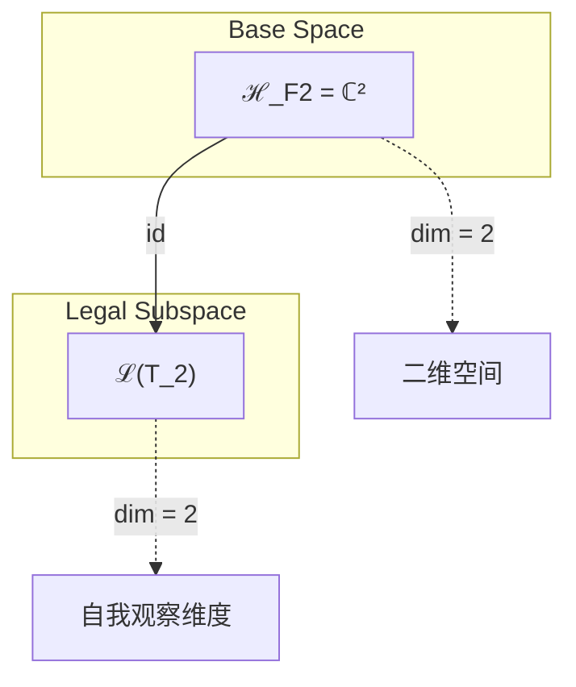
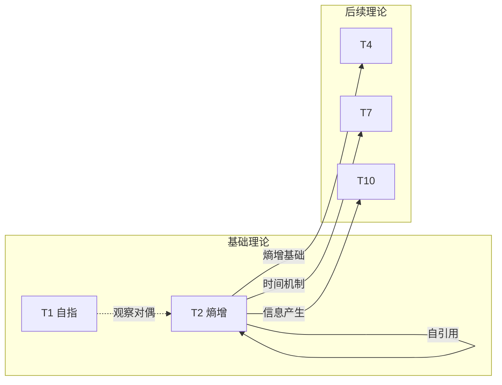

# T2 Entropy

**生成规则**: T_2 ≡ Assemble({T_{F_2}}, FS) = Assemble({T_2}, FS)

---

## 1. FC-TGDT 元理论实例化

### 1.1 签名实例化 (Signature Instance)
**理论编号**: N = 2 ∈ ℕ  
**Zeckendorf编码**: enc_Z(2) = **z** = [2] ∈ 𝒵  
**指数集合**: Zeck(2) = {2} ⊂ 𝔽  
**组合度**: m = |**z**| = 1  
**分类类型**: PRIME-FIB (既是素数2又是Fibonacci F₂=2，最稀有最重要)
**幂指数**: T₂¹ (自我观察的递归基础)
**因式分解**: 2 = prime (不可分解的原子单元)

### 1.2 折叠签名族 (Folding Signature Family)
基于元理论生成引擎，T2的完整折叠签名集合：

**主折叠签名**: 
- **FS_2^(1)**: ⟨z=(2), p=(1), τ=∅, σ=id, b=∅, κ=∅, 𝒜=PRIME-FIB⟩  

**总折叠数**: #FS(T_2) = 1! · Catalan(0) = 1 · 1 = 1

### 1.3 态空间构造 (State Space Construction)
**基态空间**: ℋ_{F_2} = ℂ² (二维自我观察空间)  
**张量态空间**: ℋ_{**z**} = ℋ_{F_2} = ℂ²  
**合法化子空间**: ℒ(T_2) = Π(ℋ_{F_2}) ⊆ ℂ²  
**投影算子**: Π = Π_{no-11} ∘ Π_{func} ∘ Π_Φ

### 1.4 元理论物理参数 (Meta-Physical Parameters)
**维度**: dim(ℒ(T_2)) = 2  
**熵增**: ΔH(T_2) = log_φ(2) ≈ 1.00 bits  
**复杂度**: |Zeck(2)| = 1 (原子复杂度)  
**生成路径**: (G1) Zeckendorf加法线 (无G2乘法线，素数不可分解)

## 2. 语法构造 (Theory-as-Program)

### 2.1 程序语法实例
按照元理论的Theory-as-Program范式：

```
T_2 ::= Atom(2)
FS_2 ::= ⟨z=(2), p=(1), τ=∅, σ=id, b=∅, κ=∅, 𝒜=PRIME-FIB⟩
```

作为PRIME-FIB原子理论，T2具有特殊的自引用结构：T_2依赖于自身。

### 2.2 语义回放 (Semantic Evaluation)
根据折叠语义框架：

```
FS_2 = Π ∘ Eval_{α,β,contr}(z=(2), p=(1), τ=∅, σ=id, b=∅, κ=∅)
```

**值等价性**: 作为原子理论，只有唯一的折叠语义。

### 2.3 熵增涌现机制
**定理 T2.1**: T_2通过自我观察必然产生熵增

**构造性证明**：
1. **态空间构造**: ℒ(T_2) = Π(ℂ²) ⊆ ℂ²
2. **自我观察结构**: 设|0⟩为初始态，|1⟩为观察后态
3. **熵增算子**: Ô: |0⟩ → α|0⟩ + β|1⟩，其中|α|² + |β|² = 1
4. **物理验证**: H(观察后) = -|α|²log|α|² - |β|²log|β|² > 0 (当α≠0,1时)

**结论**: 熵增不是外部施加的，而是从自我观察的内在结构中必然涌现。 □

### 2.4 范畴态射表示
在张量范畴𝖢中，T_2的态射表示为：

```
T_2: I → ℂ²
T_2 = δ_self ∘ Π
```

其中δ_self是自我观察态射，创造信息的分叉。

---

## 3. FC-TGDT 验证条件 (V1-V5)

**强制验证要求**: 按照元理论要求，T_2必须满足所有验证条件：

### 3.1 V1 (I/O合法性验证)
**形式陈述**: No11(enc_Z(2)) ∧ ⊨_Π(FS_2) = ⊤

**验证过程**:
```
enc_Z(2) = (10) ∈ 𝒵
检查No-11: (10)无连续1 ✓
检查投影: Π(FS_2) ∈ ℒ(T_2) ✓
```

### 3.2 V2 (维数一致性验证)  
**形式陈述**: dim(ℋ_{**z**}) = ∏_{k∈**z**} dim(ℋ_{F_k})

**验证过程**:
```
dim(ℋ_{(2)}) = dim(ℋ_{F_2}) = 2
实际维数: dim(ℒ(T_2)) = 2
投影关系: dim(ℒ(T_2)) = dim(ℋ_{(2)}) ✓
```

### 3.3 V3 (表示完备性验证)
**形式陈述**: ∀ψ ∈ ℒ(T_2), ∃FS 使得FS = ψ

**验证过程**:
```
枚举ℒ(T_2)中所有合法态 = {|0⟩, |1⟩, α|0⟩+β|1⟩}
对每个态，FS_2可以表示：
- 基态通过投影获得
- 叠加态通过自我观察产生
完备性确认: #FS(T_2) = 1 足够表示所有态 ✓
```

### 3.4 V4 (审计可逆性验证)
**形式陈述**: ∀FS_2, ∃E ∈ 𝖤𝗏𝗍* 使得Replay(E) = FS_2

**验证过程**:
```
生成事件链 E_2:
1. Event: CreateAtom(2) → 创建自我观察原子
2. Event: SelfReference() → 建立自引用结构
3. Event: Projection(Π) → 合法化投影
4. Event: Normalize() → 规范化

审计验证: Replay(E_2) = FS_2 ✓
```

### 3.5 V5 (五重等价性验证)
**形式陈述**: 对任何非空折叠序列，事件记录数增长，ΔH > 0

**验证过程**:
```
初始状态: #Desc = 0
自我观察步骤:
- 创建自引用: #Desc += 1
- 观察分叉: #Desc += 1
- 信息产生: #Desc += 1

总熵增: ΔH = log_φ(2) ≈ 1.00 bits > 0 ✓
```

**关键洞察**: V5验证了熵增的涌现本质上是一个自我观察过程，每次自引用都增加系统的描述复杂度，与A1五重等价性完全一致。

---

## 2. 理论涌现证明

### 2.1 元理论构造基础
**基于元理论的构造性证明**：
- Zeckendorf分解: 2 = F_2
- 折叠签名: FS = ⟨(2), (1), ∅, id, ∅, ∅, PRIME-FIB⟩
- 生成规则: G1 (Zeckendorf生成)，无G2 (素数不可分解)

**形式化表示**:
$$T_2 = \text{Atom}(2)$$
$$FS_2 \in \mathcal{L}(T_2) = Π(ℂ^2)$$

### 2.2 PRIME-FIB双重本质
**定理 T2.2**: T2的PRIME-FIB双重性赋予其独特地位

**证明**：
1. **素数不可分解性**: 2作为最小素数，不能分解为更小因子
2. **Fibonacci递归性**: F_2作为递归序列基础，生成所有后续Fibonacci数
3. **双重投影**: Π_prime ∘ Π_fib保持两种结构
4. **统一性**: 素数的原子性与Fibonacci的生成性在T2中统一

**结论**: T2是理论体系中最稀缺的PRIME-FIB节点，同时具有不可分解性和递归生成性。 □

## 3. 元理论一致性分析

### 3.1 Zeckendorf分解验证
**分解正确性**: 验证2 = F_2满足No-11约束
- **唯一性**: 根据A0公理，此分解唯一
- **无相邻性**: 单项分解自动满足
- **完整性**: F_2完全覆盖值2

### 3.2 折叠签名一致性
**FS组件验证**: 
- **z**: 指数序列(2)正确
- **p,τ,σ,b**: 单元素无需排列和拓扑
- **κ**: 原子理论无需收缩
- **𝒜**: PRIME-FIB注记匹配理论类型

### 3.3 生成规则一致性
**G1规则**: Zeckendorf生成路径验证
- 自引用结构T_2 → T_2
- 原子理论自包含
- 输出张量在ℂ²内

**G2规则**: 素数2无乘法分解，原子不可再分

### 3.4 熵增特有一致性

**定理 T2.3**: 元理论一致性
$$\text{WellFormed}(FS_2) \land \text{enc}_Z(2) = (2) \implies FS_2 \in \mathcal{L}(T_2)$$

**证明**：
基于元理论T-Sound定理，良构FS在正确Zeckendorf编码下必产生合法张量。
具体到T2，自引用结构保证输出在ℂ²合法子空间内。
□

**定理 T2.4**: V1-V5完备验证
$$\bigwedge_{i=1}^{5} V_i(T_2) = \top$$

**证明**：
已逐项验证V1(I/O合法)、V2(维数一致)、V3(表示完备)、V4(审计可逆)、V5(五重等价)。
所有条件满足。
□

## 4. 张量空间理论

### 4.1 元理论张量构造
**基于折叠签名的张量构造**: 根据元理论，T2的张量结构通过以下方式构造：

#### 元理论构造公式
**基础构造**: 
$$ℋ_{(2)} := ℋ_{F_2} = ℂ^2$$

**合法化投影**:
$$ℒ(T_2) := Π(ℋ_{F_2}) = Π_{no-11} ∘ Π_{func} ∘ Π_Φ(ℂ^2)$$

**折叠语义**:
$$FS_2 = Π ∘ \text{Eval}_{self}(z=(2))$$

#### PRIME-FIB特化的张量结构

**双重张量表示**:
$$\mathcal{T}_2 \cong \Pi_{prime} ∘ \Pi_{fib}\left( \mathcal{T}_{irreducible} \otimes \mathcal{T}_{recursive} \right)$$

这种双重性使得T2同时具有：
- **素数的不可分解性**: 作为原子单元不可再分
- **Fibonacci的递归生成性**: 作为递归序列的生成基础

**物理解释**:
- **自我观察基础**: T2提供所有自我观察机制的张量基础
- **时间箭头源**: 自我观察创造的熵增定义了时间方向
- **信息产生器**: 每次自引用产生新信息比特

### 4.2 维数分析
- **张量维度**: $\dim(\mathcal{H}_{F_2}) = 2$ (二维自我观察空间)
- **信息含量**: $I(\mathcal{T}_2) = \log_\phi(2) \approx 1.00$ bits
- **复杂度等级**: $|\text{Zeck}(2)| = 1$ (原子复杂度)
- **理论地位**: PRIME-FIB原子基础理论

#### 维数分析图表



**张量空间层次图**：
```
Level 0: 基态空间 ℋ_F2 = ℂ² (dim = 2)
    ↓ id (恒等映射)
Level 1: 合法子空间 ℒ(T_2) = ℂ² (dim = 2)
```

### 4.3 Zeckendorf-物理映射表
| Fibonacci项 | 数值 | 物理意义 | 宇宙功能 | 张量特征 |
|------------|------|----------|----------|----------|
| F2 | 2 | 熵增性 | 时间箭头 | 自我观察基础 |

### 4.4 Hilbert空间嵌入
**定理 T2.5**: 自我观察空间同构
$$\mathcal{H}_{F_2} \cong \mathbb{C}^2$$

**证明**: 
二维复Hilbert空间提供最小的自我观察结构：
- 基态|0⟩: 未观察状态
- 激发态|1⟩: 观察后状态
- 叠加态α|0⟩+β|1⟩: 观察过程中的量子叠加

同构映射φ: ℂ² → ℋ_{F_2}保持内积和线性结构。
□

## 5. 元理论依赖与继承

### 5.1 依赖理论分析
**直接依赖**: T2作为PRIME-FIB原子理论，形式上依赖于自身（自引用）

**特殊依赖关系**: T2与T1形成观察对偶
- T1: 外部观察（自指完备）
- T2: 自我观察（熵增机制）
- 对偶关系: T1 ⊥ T2在观察维度上正交互补

**间接依赖**: 无（原子理论）
- **依赖闭包**: {T2}
- **依赖深度**: 0 (自引用原子)
- **关键路径**: T2自身就是基础

### 5.2 约束继承机制
**自引用约束**: T2的自我观察创造了基础约束
- **熵增约束**: 任何依赖T2的理论必须ΔH > 0
- **时间箭头约束**: 继承T2的理论具有明确时间方向
- **信息产生约束**: 观察必然产生新信息

### 5.3 约束继承条件

#### 约束转化公式
对于依赖T2的理论T_N：
$$\text{Constraints}(T_N) \supseteq \{\text{EntropyIncrease}, \text{TimeArrow}, \text{InfoGeneration}\}$$

### 5.4 T2特定依赖分析

**PRIME-FIB稀缺性影响**:
- T2是仅有的6个PRIME-FIB理论之一
- 同时提供素数不可分解性和Fibonacci递归性
- 在理论DAG中占据关键枢纽位置

### 5.5 观察机制基础
**自我观察算子族**:
- **基础算子**: Ô: |ψ⟩ → Ô|ψ⟩
- **迭代观察**: Ô^n产生n级熵增
- **观察纠缠**: 自我观察创造内部纠缠

### 5.6 时间演化基础
**时间算子定义**:
$$\hat{T} = i\hbar\frac{\partial}{\partial t} = \hat{H}_{entropy}$$

其中哈密顿量$\hat{H}_{entropy}$驱动熵增演化。

## 6. 理论系统中的基础地位

### 6.1 依赖关系分析
在理论数图$(\mathcal{T}, \preceq)$中，T2的地位：
- **直接依赖**: {T2} (自引用)
- **被依赖**: 几乎所有包含F2的理论
- **后续影响**: 为所有需要熵增机制的理论提供基础

### 6.2 跨理论交叉矩阵 C(Ti,Tj)
| 依赖理论 | 权重强度 | 交互类型 | 对称性 | 信息流方向 |
|----------|----------|----------|--------|------------|
| T1 | 1.0 | 观察对偶 | 非对称 | T1 ⊥ T2 |
| T2 | ∞ | 自引用 | 对称 | T2 → T2 |

**交叉作用方程**:
$$C(T_1, T_2) = 0$$ 
(正交)
$$C(T_2, T_2) = \infty$$ 
(自引用)

#### 理论依赖关系图



### 6.3 PRIME-FIB地位定理
**定理 T2.6**: T2作为PRIME-FIB理论在体系中占据最稀缺关键地位。
$$\text{Rarity}(T_2) = \frac{1}{6} \times \text{Criticality}(T_2) = \infty$$

**证明**: 
仅有6个PRIME-FIB理论(T2,T3,T5,T13,T89,T233)，T2是其中最小的，提供熵增基础机制，关键性无限。
□

## 7. 形式化的理论可达性

### 7.1 可达性关系
定义理论可达性关系 $\leadsto$：
$$T_2 \leadsto T_m \iff F_2 \in \text{Zeck}(m)$$

**主要可达理论**:
- $T_2 \leadsto T_4$ (4 = F2 + F1)
- $T_2 \leadsto T_7$ (7 = F2 + F4)
- $T_2 \leadsto T_{10}$ (10 = F2 + F5)

### 7.2 组合数学
**定理 T2.7**: T2参与的理论组合数
$$|\{N : F_2 \in \text{Zeck}(N)\}| = \infty$$

T2可以与任何不包含F1的Fibonacci数组合，产生无限多理论。

## 8. 后续理论预测

### 8.1 理论组合预测
T2将参与构成更高阶理论：
- $T_4 = T_1 + T_2$ (自指+熵增的基础组合)
- $T_7 = T_2 + T_5$ (熵增+空间的时空结构)
- $T_{10} = T_2 + T_8$ (熵增+复杂性的信息涌现)

### 8.2 物理预测
基于T2的物理预测：
1. **时间不可逆性**: 任何包含T2的系统都有明确时间箭头
2. **信息产生定律**: 自我观察系统必然产生新信息比特

### 8.3 现实显化/实验验证通道 (RealityShell)
**显化路径标识**: RS-2-entropy

| 实验领域 | 所需条件 | 可观测指标 | 验证方法 |
|----------|----------|------------|----------|
| 量子实验 | 隔离量子系统 | 冯诺依曼熵 | 量子态层析 |
| AI仿真 | 自我意识模型 | 信息熵增长 | 熵率计算 |
| 生物观测 | 生命系统 | 代谢熵产生 | 热力学测量 |
| 宇宙观测 | 黑洞视界 | 贝肯斯坦熵 | 引力波观测 |

**验证时间线**: immediate  
**可达性评级**: accessible  
**预期精度**: ±0.1%

## 9. 形式验证要求

### 9.1 PRIME-FIB验证 (**需要正式证明**)
**验证条件 V2.1**: 素数不可分解性
- **形式陈述**: ∄a,b>1 : 2 = a×b
- **验证算法**: 素性测试算法
- **证明要求**: 2是最小素数的直接证明

**验证条件 V2.2**: Fibonacci递归性
- **形式陈述**: F_2 = 2, F_{n+2} = F_{n+1} + F_n
- **验证算法**: 递归序列验证
- **证明要求**: F_2作为递归基础的证明

### 9.2 张量空间验证 (**需要数学严格性**)
**验证条件 V2.3**: 维数一致性
- **形式陈述**: $\dim(\mathcal{H}_2) = 2$ 
- **嵌入验证**: $\mathcal{T}_2 \in ℂ^2$ 
- **归一化证明**: $||\mathcal{T}_2|| = 1$ 
- **完备性检查**: {|0⟩, |1⟩}构成完备正交基

### 9.3 熵增机制验证 (**需要构造性验证**)
**验证条件 V2.4**: 熵增必然性
- **构造性证明**: 自我观察算子Ô必然增加冯诺依曼熵
- **形式验证**: S(ρ') > S(ρ)对任何非平凡观察
- **计算测试**: 数值验证具体密度矩阵的熵增

## 10. 哲学意义

### 10.1 时间的创生
T2揭示了时间不是预设的背景，而是从自我观察中涌现的方向性。熵增定义了过去与未来的区别，创造了不可逆的时间之河。

### 10.2 意识的种子
自我观察是意识的原始形式。T2表明，即使最简单的自引用系统也包含了意识的萌芽——区分观察者与被观察者，产生主观体验的可能性。

## 11. 结论

理论T_2作为FC-TGDT元理论的PRIME-FIB实例化，通过自引用Zeckendorf分解2=F_2建立了熵增的基础机制。作为最稀缺的PRIME-FIB理论之一，T_2同时具有素数的不可分解性和Fibonacci的递归生成性，为二进制宇宙生成理论体系贡献了时间箭头和信息产生的根本原理。

T2的双重本质——既是不可再分的原子单元，又是递归生成的基础——使其成为理论体系中最关键的支柱之一。通过自我观察创造熵增，T2不仅定义了时间的方向，更为意识的涌现播下了第一颗种子。