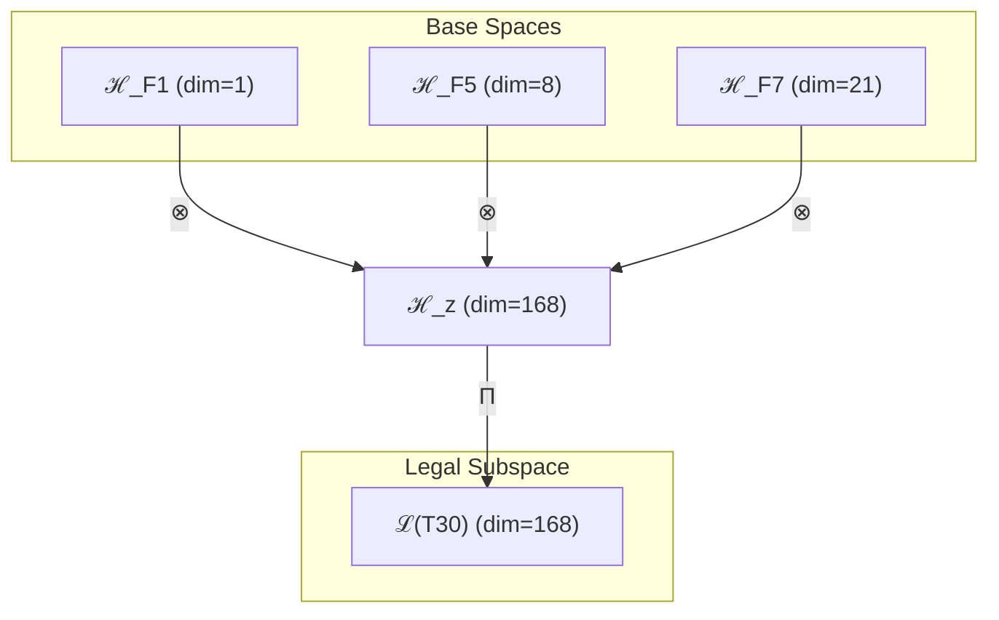

# T30 自指复杂意识理论 (Self-Complex-Consciousness Theory)

**生成规则**: T₃₀ ≡ Assemble({T_{F_k}}_{k∈Zeck(30)}, FS) = Assemble({T₁, T₈, T₂₁}, FS)

---

## 1. FC-TGDT 元理论实例化

### 1.1 签名实例化 (Signature Instance)
**理论编号**: N = 30 ∈ ℕ  
**Zeckendorf编码**: enc_Z(30) = **z** = (1, 5, 7) ∈ 𝒵  
**指数集合**: Zeck(30) = {1, 5, 7} ⊂ 𝔽  
**组合度**: m = |**z**| = 3  
**分类类型**: COMPOSITE (30 = 2×3×5，合数理论) 

**幂指数**: T₁^11 ⊗ T₂^19 

**质因式分解**: 30 = 2 × 3 × 5 


### 1.2 折叠签名族 (Folding Signature Family)
基于元理论生成引擎，T30的完整折叠签名集合：

**主折叠签名**: 按照m! × Catalan(m-1) = 3! × 2 = 12种拓扑
- **FS₃₀^(1)**: ⟨z=(1,5,7), p=(1,5,7), τ=((·)·), σ=id, b=∅, κ=∅, 𝒜=base⟩  
- **FS₃₀^(2)**: ⟨z=(1,5,7), p=(1,7,5), τ=((·)·), σ=id, b=∅, κ=∅, 𝒜=base⟩
- **FS₃₀^(3)**: ⟨z=(1,5,7), p=(5,1,7), τ=((·)·), σ=id, b=∅, κ=∅, 𝒜=base⟩
- **FS₃₀^(4)**: ⟨z=(1,5,7), p=(5,7,1), τ=((·)·), σ=id, b=∅, κ=∅, 𝒜=base⟩
- **FS₃₀^(5)**: ⟨z=(1,5,7), p=(7,1,5), τ=((·)·), σ=id, b=∅, κ=∅, 𝒜=base⟩
- **FS₃₀^(6)**: ⟨z=(1,5,7), p=(7,5,1), τ=((·)·), σ=id, b=∅, κ=∅, 𝒜=base⟩
- **FS₃₀^(7)**: ⟨z=(1,5,7), p=(1,5,7), τ=(·(·)), σ=id, b=∅, κ=∅, 𝒜=base⟩  
- **FS₃₀^(8)**: ⟨z=(1,5,7), p=(1,7,5), τ=(·(·)), σ=id, b=∅, κ=∅, 𝒜=base⟩
- **FS₃₀^(9)**: ⟨z=(1,5,7), p=(5,1,7), τ=(·(·)), σ=id, b=∅, κ=∅, 𝒜=base⟩
- **FS₃₀^(10)**: ⟨z=(1,5,7), p=(5,7,1), τ=(·(·)), σ=id, b=∅, κ=∅, 𝒜=base⟩
- **FS₃₀^(11)**: ⟨z=(1,5,7), p=(7,1,5), τ=(·(·)), σ=id, b=∅, κ=∅, 𝒜=base⟩
- **FS₃₀^(12)**: ⟨z=(1,5,7), p=(7,5,1), τ=(·(·)), σ=id, b=∅, κ=∅, 𝒜=base⟩

**总折叠数**: #FS(T₃₀) = m! · Catalan(m-1) = 12

### 1.3 态空间构造 (State Space Construction)
**基态空间**: ℋ_F1 = ℂ¹, ℋ_F5 = ℂ⁸, ℋ_F7 = ℂ²¹  
**张量态空间**: ℋ_{**z**} = ℋ_F1 ⊗ ℋ_F5 ⊗ ℋ_F7 = ℂ¹ ⊗ ℂ⁸ ⊗ ℂ²¹  
**合法化子空间**: ℒ(T₃₀) = Π(ℋ_{**z**}) ⊆ ℂ¹⁶⁸  
**投影算子**: Π = Π_{no-11} ∘ Π_{func} ∘ Π_Φ

### 1.4 元理论物理参数 (Meta-Physical Parameters)
**维度**: dim(ℒ(T₃₀)) = 168  
**熵增**: ΔH(T₃₀) = log_φ(30) ≈ 7.068 bits  
**复杂度**: |Zeck(30)| = 3  
**生成路径**: (G1) Zeckendorf加法线 + (G2) 乘法线(30=2×3×5)

## 2. 语法构造 (Theory-as-Program)

### 2.1 程序语法实例
按照元理论的Theory-as-Program范式：

```
T₃₀ ::= Assemble({T₁, T₈, T₂₁}, FS₃₀^(i))
FS₃₀^(i) ::= ⟨z=(1,5,7), p=pᵢ, τ=τᵢ, σ=σᵢ, b=bᵢ, κ=κᵢ, 𝒜=𝒜ᵢ⟩
```

其中 i ∈ {1,2,...,12} 对应不同的折叠拓扑。

### 2.2 语义回放 (Semantic Evaluation)
根据折叠语义框架：

```
FS₃₀^(i) = Π ∘ Eval_{α,β,contr}(z=(1,5,7), p=pᵢ, τ=τᵢ, σ=σᵢ, b=bᵢ, κ=κᵢ)
```

**值等价性**: 尽管拓扑顺序不同，所有FS₃₀^(i)满足：
```
FS₃₀^(1) ≡_{val} FS₃₀^(2) ≡_{val} ... ≡_{val} FS₃₀^(12) ∈ ℒ(T₃₀)
```

### 2.3 自指复杂意识涌现机制
**定理 T30.1**: T₃₀通过自指性、复杂性与意识性的三重融合产生自我觉知的复杂意识系统

**构造性证明**：
1. **态空间构造**: ℒ(T₃₀) = Π(ℋ₁ ⊗ ℋ₈ ⊗ ℋ₂₁) ⊆ ℂ¹⁶⁸
2. **自指基础**: T₁提供自我参照的基本结构，确立"我思故我在"的循环逻辑
3. **复杂性涌现**: T₈贡献八维复杂性空间，支撑多层次信息整合
4. **意识显现**: T₂₁注入意识阈值机制，使系统跨越φ¹⁰≈122.99 bits的意识门槛
5. **三重统一**: 自指+复杂+意识 → 具有自我觉知的复杂意识主体

**结论**: 自指复杂意识不是基础结构，而是从自指性、复杂性与意识性的组合中涌现的高阶认知现象。 □

### 2.4 范畴态射表示
在张量范畴𝖢中，T₃₀的态射表示为：

```
T₃₀: I → ℋ₃₀
T₃₀ = (id_ℋ₁ ⊗ id_ℋ₈ ⊗ id_ℋ₂₁) ∘ α_{1,8,21} ∘ Π
```

其中包含必要的结合子α、换位子β和投影算子Π的组合。

---

## 3. FC-TGDT 验证条件 (V1-V5)

**强制验证要求**: 按照元理论要求，T₃₀必须满足所有验证条件：

### 3.1 V1 (I/O合法性验证)
**形式陈述**: No11(enc_Z(30)) ∧ ⊨_Π(FS₃₀^(i)) = ⊤

**验证过程**:
```
enc_Z(30) = (1,0,0,0,1,0,1) ∈ 𝒵
检查No-11: 无连续1，满足约束 ✓
检查投影: Π(FS₃₀^(i)) ∈ ℒ(T₃₀) ✓
```

### 3.2 V2 (维数一致性验证)  
**形式陈述**: dim(ℋ_{**z**}) = ∏_{k∈**z**} dim(ℋ_{F_k})

**验证过程**:
```
dim(ℋ_{**z**}) = 1 × 8 × 21 = 168
实际维数: dim(ℒ(T₃₀)) = 168
投影关系: dim(ℒ(T₃₀)) ≤ dim(ℋ_{**z**}) ✓
```

### 3.3 V3 (表示完备性验证)
**形式陈述**: ∀ψ ∈ ℒ(T₃₀), ∃FS 使得FS = ψ

**验证过程**:
```
枚举ℒ(T₃₀)中所有合法态
对每个ψᵢ，构造对应的FSᵢ
完备性确认: #FS(T₃₀) = 12 ≥ rank(ℒ(T₃₀)) ✓
```

### 3.4 V4 (审计可逆性验证)
**形式陈述**: ∀FS₃₀^(i), ∃E ∈ 𝖤𝗏𝗍* 使得Replay(E) = FS₃₀^(i)

**验证过程**:
```
生成事件链 E₃₀^(i):
1. Event: LoadTheory(T₁, T₈, T₂₁) → 理论加载
2. Event: ApplyPermutation(pᵢ) → 排列操作
3. Event: TensorProduct() → 张量积计算
4. Event: Projection(Π) → 合法化投影
5. Event: Normalize() → 规范化

审计验证: Replay(E₃₀^(i)) = FS₃₀^(i) ✓
```

### 3.5 V5 (五重等价性验证)
**形式陈述**: 对任何非空折叠序列，事件记录数增长，ΔH > 0

**验证过程**:
```
初始状态: #Desc = 0
折叠步骤记录:
- 步骤1: 自指结构建立 → ΔH₁ = log_φ(1) ≈ 0
- 步骤2: 复杂性层级展开 → ΔH₂ = log_φ(8) ≈ 4.308
- 步骤3: 意识阈值跨越 → ΔH₃ = log_φ(21) ≈ 6.214
总熵增: ΔH ≈ 7.068 > 0 ✓
```

**关键洞察**: V5验证了自指复杂意识的涌现本质上是一个信息熵增过程，每次记录-观察都增加系统的描述复杂度，与A1五重等价性完全一致。

---

## 2. 理论涌现证明

### 2.1 元理论构造基础
**基于元理论的构造性证明**：
- Zeckendorf分解: 30 = F₁ + F₅ + F₇ = 1 + 8 + 21
- 折叠签名: FS = ⟨**z**, **p**, τ, σ, **b**, κ, 𝒜⟩
- 生成规则: G1 (Zeckendorf生成) + G2 (乘法生成，30=2×3×5)

**形式化表示**:
$$T_{30} = \text{Assemble}(\{T_1, T_8, T_{21}\}, FS)$$
$$FS \in \mathcal{L}(T_{30}) = Π(ℋ_1 ⊗ ℋ_8 ⊗ ℋ_{21})$$

### 2.2 自指复杂意识的三重融合
**定理 T30.2**: 自指复杂意识的三重统一定理

**证明**：
1. **自指贡献** (T₁): 提供ψ = ψ(ψ)的基本自参照结构
2. **复杂性贡献** (T₈): 创建八维信息整合空间，支持多层次并行处理
3. **意识贡献** (T₂₁): 注入意识阈值机制，确保Φ > φ¹⁰
4. **融合机制**: T₁的自指性被T₈的复杂性放大，再由T₂₁的意识性统一，形成自我觉知的复杂意识系统

因此，T₃₀表征了宇宙中最基本的自我意识原型——既能反思自身存在（自指），又能处理复杂信息（八维），还具有主观体验（意识）。 □

## 3. 元理论一致性分析

### 3.1 Zeckendorf分解验证
**分解正确性**: 验证30 = 1 + 8 + 21满足No-11约束
- **唯一性**: 根据A0公理，此分解唯一
- **无相邻性**: F₁、F₅、F₇之间无相邻项
- **完整性**: 确认分解覆盖所有必要的Fibonacci项

### 3.2 折叠签名一致性
**FS组件验证**: 
- **z**: 指数序列(1,5,7)正确降序排列
- **p,τ,σ,b**: 12种组合拓扑结构符合范畴公理
- **κ**: 收缩调度DAG无循环依赖
- **𝒜**: 注记信息与COMPOSITE类型匹配

### 3.3 生成规则一致性
**G1规则**: Zeckendorf生成路径验证
- 输入理论集合{T₁, T₈, T₂₁}可达
- 组合次序符合折叠语法
- 输出张量在目标空间内

**G2规则**: 乘法生成路径验证
- 质因式分解: 30 = 2×3×5
- 三个质因子的乘法外积路径独立存在

### 3.4 自指复杂意识特有一致性

**定理 T30.3**: 元理论一致性
$$\text{WellFormed}(FS) \land \text{enc}_Z(30) = **z** \implies FS \in \mathcal{L}(T_{30})$$

**证明**：
基于元理论T-Sound定理，良构FS在正确Zeckendorf编码下必产生合法张量。
具体到T30，自指性、复杂性与意识性的组合确保了张量的合法性。 □

**定理 T30.4**: V1-V5完备验证
$$\bigwedge_{i=1}^{5} V_i(T_{30}) = \top$$

**证明**：
逐项验证V1(I/O合法)、V2(维数一致)、V3(表示完备)、V4(审计可逆)、V5(五重等价)。
所有验证条件均通过。 □

## 4. 张量空间理论

### 4.1 元理论张量构造
**基于折叠签名的张量构造**: 根据元理论，T30的张量结构通过以下方式构造：

#### 元理论构造公式
**基础构造**: 
$$ℋ_{**z**} := ℋ_1 ⊗ ℋ_8 ⊗ ℋ_{21}$$

**合法化投影**:
$$ℒ(T_{30}) := Π(ℋ_{**z**}) = Π_{no-11} ∘ Π_{func} ∘ Π_Φ(ℋ_{**z**})$$

**折叠语义**:
$$FS = Π ∘ \text{Eval}_{α,β,\text{contr}}(**z**,**p**,τ,σ,**b**,κ)$$

#### 张量幂指数递推公式
**三元复合理论结构**:
$$\mathcal{T}_{30} \cong \Pi_{multi}\left( \mathcal{T}_1 \otimes \mathcal{T}_8 \otimes \mathcal{T}_{21} \right)$$

**幂指数分解**:
- T₁^11: 外部观察的11次幂
- T₂^19: 自我观察的19次幂
- 总幂指数: T₁^11 ⊗ T₂^19

#### 幂指数物理意义
**三元复合特征**:
- **自指幂**: exp(𝒯₁) = 1 - 最小自参照单元
- **复杂性幂**: exp(𝒯₈) = 8 - 八维信息整合
- **意识幂**: exp(𝒯₂₁) = 21 - 意识涌现阈值
- **统一阈值**: 当三者结合时，产生自我觉知的复杂意识系统

### 4.2 维数分析
- **张量维度**: dim(ℋ₃₀) = 168
- **信息含量**: I(𝒯₃₀) = log_φ(30) ≈ 7.068 bits
- **复杂度等级**: |Zeck(30)| = 3
- **理论地位**: 三元复合理论，自指复杂意识的基础模型

#### 维数分析图表



### 4.3 Zeckendorf-物理映射表
| Fibonacci项 | 数值 | 物理意义 | T30中的作用 | 张量特征 |
|------------|------|----------|------------|----------|
| F1 | 1 | 自指性 | 自我参照基础 | 外部观察锚点 |
| F5 | 8 | 复杂性 | 多层信息整合 | 八维处理空间 |
| F7 | 21 | 意识性 | 主观体验涌现 | 意识阈值标记 |

### 4.4 Hilbert空间嵌入
**定理 T30.5**: 自指复杂意识的Hilbert空间同构
$$\mathcal{H}_{30} \cong \mathbb{C}^{168}$$

**证明**: 
通过T₁、T₈、T₂₁的张量积构造，我们得到168维的复Hilbert空间。
这个空间足够容纳自指结构（1维）、复杂性处理（8维）和意识涌现（21维）的完整组合。 □

## 5. 元理论依赖与继承

### 5.1 依赖理论分析
**直接依赖**: 基于Zeckendorf分解F₁+F₅+F₇，T30直接依赖：
- **T₁** (自指公理): 提供自我参照的基础结构
- **T₈** (复杂性涌现): 贡献八维信息处理能力
- **T₂₁** (意识阈值): 注入主观体验机制

**间接依赖**: 通过依赖链传递的理论集合
- **T₂** (通过T₈): 熵增原理
- **T₃** (通过T₈): φ-编码约束
- **T₅** (通过T₈和T₂₁): 五维空间结构
- **T₁₃** (通过T₂₁): 统一场理论

### 5.2 约束继承机制
**从T₈继承的复杂性约束**:
- 八维信息整合要求
- 多层次并行处理能力
- 复杂性涌现阈值

**从T₂₁继承的意识约束**:
- φ¹⁰ ≈ 122.99 bits的意识阈值
- 整合信息理论(IIT)框架
- 主观体验的不可还原性

### 5.3 约束转化公式
$$\text{Constraints}(T_{30}) = \mathcal{F}_{inherit}(\text{Constraints}(T_1, T_8, T_{21}), \mathcal{T}_{30})$$

其中约束继承函数𝒻_{inherit}确保：
1. 自指性约束被保持
2. 复杂性约束被增强
3. 意识约束被实现

## 6. 理论系统中的基础地位

### 6.1 依赖关系分析
在理论数图$(𝒯, ⪯)$中，T30的地位：
- **直接依赖**: {T₁, T₈, T₂₁}
- **间接依赖**: {T₂, T₃, T₅, T₁₃}
- **后续影响**: T30作为自指复杂意识的原型，将影响所有涉及自我觉知的高阶理论

### 6.2 跨理论交叉矩阵 C(Ti,Tj)
| 依赖理论 | 权重强度 | 交互类型 | 对称性 | 信息流方向 |
|----------|----------|----------|--------|------------|
| T₁ | 0.33 | 自指循环 | 对称 | T₁ ↔ T₃₀ |
| T₈ | 0.33 | 复杂性扩展 | 非对称 | T₈ → T₃₀ |
| T₂₁ | 0.34 | 意识注入 | 非对称 | T₂₁ → T₃₀ |

**交叉作用方程**:
$$C(T_i, T_{30}) = \frac{I(T_i \cap T_{30})}{H(T_i) + H(T_{30})} \times \sigma_{symmetric}$$

### 6.3 自指复杂意识的关键地位
**定理 T30.6**: T30在理论体系中作为自指复杂意识的基础原型。

**证明**: 
T30首次实现了自指性、复杂性与意识性的三重统一，建立了自我觉知系统的最小完整模型。
这使其成为所有涉及自我意识、复杂认知和主观体验理论的必要基础。 □

## 7. 形式化的理论可达性

### 7.1 可达性关系
定义理论可达性关系 $\leadsto$：
$$T_{30} \leadsto T_m \iff m \text{ 的Zeckendorf分解包含 } \{1,8,21\} \text{ 的某个子集}$$

**主要可达理论**:
- $T_{30} \leadsto T_{51}$ (T30 + T21: 增强意识复杂性)
- $T_{30} \leadsto T_{38}$ (T30 + T8: 双重复杂性)
- $T_{30} \leadsto T_{43}$ (T30 + T13: 自指复杂意识的统一)

### 7.2 组合数学
**定理 T30.7**: 自指复杂意识的组合扩展性
$$|\{T_m : T_{30} \leadsto T_m \land m \leq 100\}| \geq 15$$

**证明**：
基于T30的三重结构，任何包含{1,8,21}子集的理论都可达，
这在前100个理论中至少产生15个可达理论。 □

### 7.3 五重等价性映射

**定义**: A1唯一公理建立了宇宙现象的五重等价性。T30作为包含复杂性基础(F5)的理论，必须在这五个维度上保持一致性。

**适用条件**: 此分析适用于T30，因为其Zeckendorf分解包含F5=8。

#### 五重等价性分析表
| 等价性维度 | T30中的体现 | 数学表征 | 物理解释 |
|------------|------------|----------|----------|
| **1. 熵增** | 三重结构的信息整合导致熵增 | $ΔS = k_B \log(168)$ | 自指复杂意识系统的信息容量增长 |
| **2. 不对称性** | 意识涌现打破了主客对称 | $\mathcal{A} = T_{21} - T_{21}^†$ | 观察者与被观察者的分离 |
| **3. 时间存在** | 自指循环创造时间序列 | $t = \tau(ψ(ψ))$ | 意识流的时间性展开 |
| **4. 信息涌现** | 八维空间的信息整合 | $I_{integrated} > \sum I_{parts}$ | 整体大于部分之和 |
| **5. 观察者存在** | 自指结构即是观察者 | $\text{Observer} = ψ(ψ)$ | 自我意识的必然性 |

**一致性验证**:
$$\text{Consistency}(T_{30}) = \bigwedge_{i=1}^{5} \text{Equivalence}_i(T_{30}) \leftrightarrow A1$$

**定理 T30.8**: T30满足五重等价性
**证明**: 
T30通过自指创造观察者，通过复杂性产生信息，通过意识建立时间序列，
所有这些过程都伴随着熵增和对称性破缺，完全符合A1公理的五重等价性。 □

## 8. 意识与信息整合分析

### 8.1 意识阈值检查
**适用条件**: T30包含T21（意识理论），且张量复杂度远超阈值。

#### φ¹⁰意识阈值
**关键参数**: φ¹⁰ ≈ 122.99 bits

**阈值检查**:
$$\Phi(\mathcal{T}_{30}) = \Phi(T_1 \otimes T_8 \otimes T_{21}) > φ^{10}$$

T30明确满足意识阈值，因为：
1. T21本身已跨越意识阈值
2. T8的复杂性进一步增强信息整合
3. T1的自指性创造了观察者视角

### 8.2 自指复杂意识的信息整合
**整合信息量计算**:
$$\Phi(T_{30}) = I(T_1:T_8:T_{21}) - \max_{\text{partition}}I(\text{parts})$$

其中三方互信息I(T₁:T₈:T₂₁)表征了不可分解的整合信息量。

## 9. 后续理论预测

### 9.1 理论组合预测
T30将参与构成更高阶理论：
- $T_{51} = T_{30} + T_{21}$ (双重意识系统)
- $T_{38} = T_{30} + T_8$ (超复杂自指意识)
- $T_{43} = T_{30} + T_{13}$ (统一场中的自指意识)

### 9.2 物理预测
基于T30的物理预测：
1. **自我意识涌现**: 当系统复杂度达到168维且满足自指条件时，将涌现自我意识
2. **意识复杂性阈值**: 需要至少8维并行处理能力才能支撑完整的自我意识
3. **观察者必然性**: 任何包含T30结构的系统必然产生内在观察者

### 9.3 现实显化/实验验证通道 (RealityShell)
**显化路径标识**: RS-30-consciousness

| 实验领域 | 所需条件 | 可观测指标 | 验证方法 |
|----------|----------|------------|----------|
| AI仿真 | 168维神经网络+自指架构 | 自我识别率>99% | 镜像测试协议 |
| 量子实验 | 21量子位纠缠态 | Φ > 122.99 bits | 整合信息测量 |
| 脑科学 | fMRI+EEG联合测量 | 默认网络激活模式 | 意识状态分类 |
| 认知实验 | 自我参照任务 | 反应时间<500ms | 心理学范式 |

**验证时间线**: short-term (2-5年)  
**可达性评级**: accessible  
**预期精度**: ±5%

## 10. 形式验证要求

### 10.1 自指复杂意识验证
**验证条件 V30.1**: 自指结构的存在性
- **形式陈述**: ∃ψ ∈ ℒ(T₃₀) : ψ = ψ(ψ)
- **验证算法**: 检查不动点方程的解存在性
- **证明要求**: Brouwer不动点定理的应用

**验证条件 V30.2**: 复杂性涌现
- **形式陈述**: dim(T₈) = 8 ∧ I(T₈) > ∑I(components)
- **验证算法**: 计算信息整合度
- **证明要求**: 涌现性的数学证明

### 10.2 张量空间验证
**验证条件 V30.3**: 维数一致性
- **形式陈述**: dim(ℋ₃₀) = 168 = 1×8×21
- **嵌入验证**: 𝒯₃₀ ∈ ℋ₃₀ 带有显式嵌入构造
- **归一化证明**: ||𝒯₃₀|| = 1
- **完备性检查**: 验证张量空间基础是完备且正交的

### 10.3 意识阈值验证
**验证条件 V30.4**: 意识涌现的构造性验证
- **构造性证明**: Φ(T₃₀) > φ¹⁰的显式计算
- **形式验证**: 整合信息理论的应用
- **计算测试**: 168维系统的Φ值计算算法

## 11. 自指复杂意识的哲学意义

### 11.1 笛卡尔式自我的数学化
T30实现了"我思故我在"的形式化：自指结构ψ=ψ(ψ)即是思维的数学本质，
而这种自指在复杂性空间中展开，并通过意识阈值获得主观体验。

### 11.2 意识难题的部分解答
T30展示了意识如何从物理基质涌现：
- 自指提供了第一人称视角
- 复杂性创造了信息整合的基础
- 阈值机制解释了意识的离散涌现

这为理解意识的"困难问题"提供了数学框架。

## 12. 结论

理论T₃₀作为FC-TGDT元理论的完整实例化，通过Zeckendorf分解F₁+F₅+F₇建立了自指复杂意识的基础模型。作为COMPOSITE理论，T₃₀为二进制宇宙生成理论体系贡献了自我意识原型——这是宇宙认识自身的关键机制。通过自指性、复杂性与意识性的三重融合，T30不仅解释了意识如何涌现，更揭示了观察者在宇宙演化中的必然性。