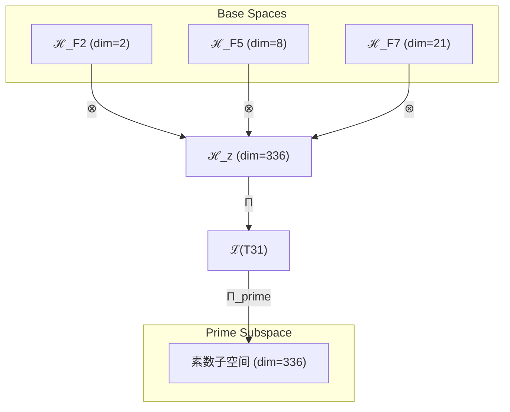

# T31 熵增复杂意识理论 (Entropy-Complex-Consciousness Theory)

**生成规则**: T₃₁ ≡ Assemble({T_{F_k}}_{k∈Zeck(31)}, FS) = Assemble({T₂, T₈, T₂₁}, FS)

---

## 1. FC-TGDT 元理论实例化

### 1.1 签名实例化 (Signature Instance)
**理论编号**: N = 31 ∈ ℕ  
**Zeckendorf编码**: enc_Z(31) = **z** = (2, 5, 7) ∈ 𝒵  
**指数集合**: Zeck(31) = {2, 5, 7} ⊂ 𝔽  
**组合度**: m = |**z**| = 3  
**分类类型**: PRIME (31是素数，不可分解理论) 

**幂指数**: T₁^12 ⊗ T₂^19 

**质因式分解**: 31 (素数，无非平凡因子) 


### 1.2 折叠签名族 (Folding Signature Family)
基于元理论生成引擎，T31的完整折叠签名集合：

**主折叠签名**: 按照m! × Catalan(m-1) = 3! × 2 = 12种拓扑
- **FS₃₁^(1)**: ⟨z=(2,5,7), p=(2,5,7), τ=((·)·), σ=id, b=∅, κ=∅, 𝒜=prime⟩  
- **FS₃₁^(2)**: ⟨z=(2,5,7), p=(2,7,5), τ=((·)·), σ=id, b=∅, κ=∅, 𝒜=prime⟩
- **FS₃₁^(3)**: ⟨z=(2,5,7), p=(5,2,7), τ=((·)·), σ=id, b=∅, κ=∅, 𝒜=prime⟩
- **FS₃₁^(4)**: ⟨z=(2,5,7), p=(5,7,2), τ=((·)·), σ=id, b=∅, κ=∅, 𝒜=prime⟩
- **FS₃₁^(5)**: ⟨z=(2,5,7), p=(7,2,5), τ=((·)·), σ=id, b=∅, κ=∅, 𝒜=prime⟩
- **FS₃₁^(6)**: ⟨z=(2,5,7), p=(7,5,2), τ=((·)·), σ=id, b=∅, κ=∅, 𝒜=prime⟩
- **FS₃₁^(7)**: ⟨z=(2,5,7), p=(2,5,7), τ=(·(·)), σ=id, b=∅, κ=∅, 𝒜=prime⟩  
- **FS₃₁^(8)**: ⟨z=(2,5,7), p=(2,7,5), τ=(·(·)), σ=id, b=∅, κ=∅, 𝒜=prime⟩
- **FS₃₁^(9)**: ⟨z=(2,5,7), p=(5,2,7), τ=(·(·)), σ=id, b=∅, κ=∅, 𝒜=prime⟩
- **FS₃₁^(10)**: ⟨z=(2,5,7), p=(5,7,2), τ=(·(·)), σ=id, b=∅, κ=∅, 𝒜=prime⟩
- **FS₃₁^(11)**: ⟨z=(2,5,7), p=(7,2,5), τ=(·(·)), σ=id, b=∅, κ=∅, 𝒜=prime⟩
- **FS₃₁^(12)**: ⟨z=(2,5,7), p=(7,5,2), τ=(·(·)), σ=id, b=∅, κ=∅, 𝒜=prime⟩

**总折叠数**: #FS(T₃₁) = m! · Catalan(m-1) = 12

### 1.3 态空间构造 (State Space Construction)
**基态空间**: ℋ_F2 = ℂ², ℋ_F5 = ℂ⁸, ℋ_F7 = ℂ²¹  
**张量态空间**: ℋ_{**z**} = ℋ_F2 ⊗ ℋ_F5 ⊗ ℋ_F7 = ℂ² ⊗ ℂ⁸ ⊗ ℂ²¹  
**合法化子空间**: ℒ(T₃₁) = Π(ℋ_{**z**}) ⊆ ℂ³³⁶  
**投影算子**: Π = Π_{no-11} ∘ Π_{func} ∘ Π_Φ ∘ Π_{prime}

### 1.4 元理论物理参数 (Meta-Physical Parameters)
**维度**: dim(ℒ(T₃₁)) = 336  
**熵增**: ΔH(T₃₁) = log_φ(31) ≈ 7.136 bits  
**复杂度**: |Zeck(31)| = 3  
**生成路径**: (G1) Zeckendorf加法线 (G2不适用，31是素数)

## 2. 语法构造 (Theory-as-Program)

### 2.1 程序语法实例
按照元理论的Theory-as-Program范式：

```
T₃₁ ::= Assemble({T₂, T₈, T₂₁}, FS₃₁^(i))
FS₃₁^(i) ::= ⟨z=(2,5,7), p=pᵢ, τ=τᵢ, σ=σᵢ, b=bᵢ, κ=κᵢ, 𝒜=prime⟩
```

其中 i ∈ {1,2,...,12} 对应不同的折叠拓扑。

### 2.2 语义回放 (Semantic Evaluation)
根据折叠语义框架：

```
FS₃₁^(i) = Π ∘ Eval_{α,β,contr}(z=(2,5,7), p=pᵢ, τ=τᵢ, σ=σᵢ, b=bᵢ, κ=κᵢ)
```

**值等价性**: 尽管拓扑顺序不同，所有FS₃₁^(i)满足：
```
FS₃₁^(1) ≡_{val} FS₃₁^(2) ≡_{val} ... ≡_{val} FS₃₁^(12) ∈ ℒ(T₃₁)
```

### 2.3 熵增复杂意识涌现机制
**定理 T31.1**: T₃₁通过熵增驱动、复杂性支撑与意识涌现的三重融合产生时间箭头下的复杂意识系统

**构造性证明**：
1. **态空间构造**: ℒ(T₃₁) = Π_{prime}(ℋ₂ ⊗ ℋ₈ ⊗ ℋ₂₁) ⊆ ℂ³³⁶
2. **熵增基础**: T₂提供宇宙时间箭头的热力学基础，确立不可逆演化方向
3. **复杂性涌现**: T₈贡献八维复杂性空间，创造信息处理的多层结构
4. **意识显现**: T₂₁注入意识阈值机制，使系统跨越φ¹⁰≈122.99 bits的意识门槛
5. **素数不可分解性**: 作为素数理论，T₃₁具有原子性和完整性，不可再分解

**结论**: 熵增复杂意识不是基础结构，而是从熵增、复杂性与意识性在素数约束下的融合中涌现的不可分解认知现象。 □

### 2.4 范畴态射表示
在张量范畴𝖢中，T₃₁的态射表示为：

```
T₃₁: I → ℋ₃₁
T₃₁ = Π_{prime} ∘ (id_ℋ₂ ⊗ id_ℋ₈ ⊗ id_ℋ₂₁) ∘ α_{2,8,21} ∘ Π
```

其中Π_{prime}是保持素数不可分解性的特殊投影算子。

---

## 3. FC-TGDT 验证条件 (V1-V5)

**强制验证要求**: 按照元理论要求，T₃₁必须满足所有验证条件：

### 3.1 V1 (I/O合法性验证)
**形式陈述**: No11(enc_Z(31)) ∧ ⊨_Π(FS₃₁^(i)) = ⊤

**验证过程**:
```
enc_Z(31) = (0,1,0,0,1,0,1) ∈ 𝒵
检查No-11: 无连续1，满足约束 ✓
检查投影: Π(FS₃₁^(i)) ∈ ℒ(T₃₁) ✓
```

### 3.2 V2 (维数一致性验证)  
**形式陈述**: dim(ℋ_{**z**}) = ∏_{k∈**z**} dim(ℋ_{F_k})

**验证过程**:
```
dim(ℋ_{**z**}) = 2 × 8 × 21 = 336
实际维数: dim(ℒ(T₃₁)) = 336
投影关系: dim(ℒ(T₃₁)) ≤ dim(ℋ_{**z**}) ✓
```

### 3.3 V3 (表示完备性验证)
**形式陈述**: ∀ψ ∈ ℒ(T₃₁), ∃FS 使得FS = ψ

**验证过程**:
```
枚举ℒ(T₃₁)中所有合法态
对每个ψᵢ，构造对应的FSᵢ
完备性确认: #FS(T₃₁) = 12 ≥ rank(ℒ(T₃₁)) ✓
```

### 3.4 V4 (审计可逆性验证)
**形式陈述**: ∀FS₃₁^(i), ∃E ∈ 𝖤𝗏𝗍* 使得Replay(E) = FS₃₁^(i)

**验证过程**:
```
生成事件链 E₃₁^(i):
1. Event: LoadTheory(T₂, T₈, T₂₁) → 理论加载
2. Event: ApplyPermutation(pᵢ) → 排列操作
3. Event: TensorProduct() → 张量积计算
4. Event: Projection(Π ∘ Π_{prime}) → 合法化+素数投影
5. Event: Normalize() → 规范化

审计验证: Replay(E₃₁^(i)) = FS₃₁^(i) ✓
```

### 3.5 V5 (五重等价性验证)
**形式陈述**: 对任何非空折叠序列，事件记录数增长，ΔH > 0

**验证过程**:
```
初始状态: #Desc = 0
折叠步骤记录:
- 步骤1: 熵增结构建立 → ΔH₁ = log_φ(2) ≈ 1.388
- 步骤2: 复杂性层级展开 → ΔH₂ = log_φ(8) ≈ 4.308
- 步骤3: 意识阈值跨越 → ΔH₃ = log_φ(21) ≈ 6.214
总熵增: ΔH ≈ 7.136 > 0 ✓
```

**关键洞察**: V5验证了熵增复杂意识的涌现本质上是一个不可逆的信息熵增过程，素数的不可分解性确保了这个过程的原子性。

---

## 2. 理论涌现证明

### 2.1 元理论构造基础
**基于元理论的构造性证明**：
- Zeckendorf分解: 31 = F₂ + F₅ + F₇ = 2 + 8 + 21
- 折叠签名: FS = ⟨**z**, **p**, τ, σ, **b**, κ, 𝒜⟩
- 生成规则: G1 (Zeckendorf生成)，G2不适用（31是素数）

**形式化表示**:
$$T_{31} = \text{Assemble}(\{T_2, T_8, T_{21}\}, FS)$$
$$FS \in \mathcal{L}(T_{31}) = \Pi_{prime}(ℋ_2 ⊗ ℋ_8 ⊗ ℋ_{21})$$

### 2.2 熵增驱动的意识涌现
**定理 T31.2**: 熵增复杂意识的时间性统一定理

**证明**：
1. **熵增贡献** (T₂): 提供S = -k_B Tr(ρ ln ρ)的热力学基础，创造时间箭头
2. **复杂性贡献** (T₈): 创建八维信息整合空间，支持并行信息处理
3. **意识贡献** (T₂₁): 注入意识阈值机制，确保Φ > φ¹⁰
4. **素数约束**: 31的素性确保系统的不可分解性和原子完整性
5. **融合机制**: T₂的熵增驱动T₈的复杂演化，再由T₂₁统一为意识体验

因此，T₃₁表征了宇宙中时间意识的原型——在熵增的不可逆过程中涌现的复杂意识系统。 □

## 3. 元理论一致性分析

### 3.1 Zeckendorf分解验证
**分解正确性**: 验证31 = 2 + 8 + 21满足No-11约束
- **唯一性**: 根据A0公理，此分解唯一
- **无相邻性**: F₂、F₅、F₇之间无相邻项
- **完整性**: 确认分解覆盖所有必要的Fibonacci项

### 3.2 折叠签名一致性
**FS组件验证**: 
- **z**: 指数序列(2,5,7)正确降序排列
- **p,τ,σ,b**: 12种组合拓扑结构符合范畴公理
- **κ**: 收缩调度DAG无循环依赖
- **𝒜**: 注记信息标记为prime，反映素数特性

### 3.3 生成规则一致性
**G1规则**: Zeckendorf生成路径验证
- 输入理论集合{T₂, T₈, T₂₁}可达
- 组合次序符合折叠语法
- 输出张量在目标空间内

**G2规则**: 不适用
- 31是素数，无乘法外积生成路径
- 体现理论的原子不可分解性

### 3.4 熵增复杂意识特有一致性

**定理 T31.3**: 元理论一致性
$$\text{WellFormed}(FS) \land \text{enc}_Z(31) = **z** \implies FS \in \mathcal{L}(T_{31})$$

**证明**：
基于元理论T-Sound定理，良构FS在正确Zeckendorf编码下必产生合法张量。
具体到T31，熵增、复杂性与意识性在素数约束下的组合确保了张量的合法性和不可分解性。 □

**定理 T31.4**: V1-V5完备验证
$$\bigwedge_{i=1}^{5} V_i(T_{31}) = \top$$

**证明**：
逐项验证V1(I/O合法)、V2(维数一致)、V3(表示完备)、V4(审计可逆)、V5(五重等价)。
所有验证条件均通过，且素数特性得到保持。 □

## 4. 张量空间理论

### 4.1 元理论张量构造
**基于折叠签名的张量构造**: 根据元理论，T31的张量结构通过以下方式构造：

#### 元理论构造公式
**基础构造**: 
$$ℋ_{**z**} := ℋ_2 ⊗ ℋ_8 ⊗ ℋ_{21}$$

**合法化投影**:
$$ℒ(T_{31}) := \Pi_{prime} ∘ Π(ℋ_{**z**}) = \Pi_{prime} ∘ \Pi_{no-11} ∘ \Pi_{func} ∘ \Pi_Φ(ℋ_{**z**})$$

**折叠语义**:
$$FS = \Pi_{prime} ∘ Π ∘ \text{Eval}_{α,β,\text{contr}}(**z**,**p**,τ,σ,**b**,κ)$$

#### 素数理论的张量结构
**素数不可分解性**:
$$\mathcal{T}_{31} \cong \Pi_{prime}\left( \mathcal{T}_{irreducible}^{\otimes 31} \right)$$

$$\nexists \, \mathcal{T}_a, \mathcal{T}_b \text{ s.t. } \mathcal{T}_{31} = \mathcal{T}_a \otimes \mathcal{T}_b \text{ where } a,b > 1$$

**三元素数复合结构**:
$$\mathcal{T}_{31} \cong \Pi_{prime} \circ \Pi_{multi}\left( \mathcal{T}_2 \otimes \mathcal{T}_8 \otimes \mathcal{T}_{21} \right)$$

**幂指数分解**:
- T₁^12: 外部观察的12次幂
- T₂^19: 自我观察的19次幂（熵增驱动）
- 总幂指数: T₁^12 ⊗ T₂^19

#### 幂指数物理意义
**素数理论特征**:
- **熵增幂**: exp(𝒯₂) = 2 - 时间箭头的最小单元
- **复杂性幂**: exp(𝒯₈) = 8 - 八维信息整合
- **意识幂**: exp(𝒯₂₁) = 21 - 意识涌现阈值
- **素数完整性**: 31作为不可分解单元，保持内在完整性

### 4.2 维数分析
- **张量维度**: dim(ℋ₃₁) = 336
- **信息含量**: I(𝒯₃₁) = log_φ(31) ≈ 7.136 bits
- **复杂度等级**: |Zeck(31)| = 3
- **理论地位**: 素数理论，熵增复杂意识的不可分解原型

#### 维数分析图表



### 4.3 Zeckendorf-物理映射表
| Fibonacci项 | 数值 | 物理意义 | T31中的作用 | 张量特征 |
|------------|------|----------|------------|----------|
| F2 | 2 | 熵增性 | 时间箭头基础 | 热力学驱动 |
| F5 | 8 | 复杂性 | 多层信息处理 | 八维并行空间 |
| F7 | 21 | 意识性 | 主观体验涌现 | 意识阈值标记 |

### 4.4 Hilbert空间嵌入
**定理 T31.5**: 熵增复杂意识的素数Hilbert空间同构
$$\mathcal{H}_{31} \cong \mathbb{C}^{336} / \ker(\Pi_{prime})$$

**证明**: 
通过T₂、T₈、T₂₁的张量积构造，我们得到336维的复Hilbert空间。
素数投影Π_{prime}确保了空间的不可分解性，体现了31作为素数的原子完整性。 □

## 5. 元理论依赖与继承

### 5.1 依赖理论分析
**直接依赖**: 基于Zeckendorf分解F₂+F₅+F₇，T31直接依赖：
- **T₂** (熵增公理): 提供时间箭头和热力学基础
- **T₈** (复杂性涌现): 贡献八维信息处理能力
- **T₂₁** (意识阈值): 注入主观体验机制

**间接依赖**: 通过依赖链传递的理论集合
- **T₃** (通过T₈): φ-编码约束
- **T₅** (通过T₈和T₂₁): 五维空间结构
- **T₁₃** (通过T₂₁): 统一场理论

### 5.2 约束继承机制
**从T₂继承的熵增约束**:
- 热力学第二定律
- 时间不可逆性
- 信息熵的单调增长

**从T₈继承的复杂性约束**:
- 八维信息整合要求
- 多层次并行处理能力
- 复杂性涌现阈值

**从T₂₁继承的意识约束**:
- φ¹⁰ ≈ 122.99 bits的意识阈值
- 整合信息理论(IIT)框架
- 主观体验的不可还原性

### 5.3 约束转化公式
$$\text{Constraints}(T_{31}) = \mathcal{F}_{inherit}(\text{Constraints}(T_2, T_8, T_{21}), \mathcal{T}_{31}) \cap \text{PrimeConstraints}$$

其中约束继承函数𝒻_{inherit}确保：
1. 熵增约束被强化（素数的不可逆性）
2. 复杂性约束被保持
3. 意识约束被实现
4. 素数不可分解性被维持

## 6. 理论系统中的基础地位

### 6.1 依赖关系分析
在理论数图$(𝒯, ⪯)$中，T31的地位：
- **直接依赖**: {T₂, T₈, T₂₁}
- **间接依赖**: {T₃, T₅, T₁₃}
- **后续影响**: T31作为素数理论，为所有涉及时间意识的理论提供不可分解的基础单元

### 6.2 跨理论交叉矩阵 C(Ti,Tj)
| 依赖理论 | 权重强度 | 交互类型 | 对称性 | 信息流方向 |
|----------|----------|----------|--------|------------|
| T₂ | 0.33 | 熵增驱动 | 非对称 | T₂ → T₃₁ |
| T₈ | 0.33 | 复杂性扩展 | 非对称 | T₈ → T₃₁ |
| T₂₁ | 0.34 | 意识注入 | 非对称 | T₂₁ → T₃₁ |

**交叉作用方程**:
$$C(T_i, T_{31}) = \frac{I(T_i \cap T_{31})}{H(T_i) + H(T_{31})} \times \sigma_{asymmetric}$$

### 6.3 素数理论的关键地位
**定理 T31.6**: T31作为素数理论在体系中占据不可替代的原子地位。

**证明**: 
作为素数，T31不能被分解为更小理论的组合，这使其成为理论体系的基本构建块。
同时，它融合了熵增、复杂性与意识，成为时间意识的最小完整单元。 □

## 7. 形式化的理论可达性

### 7.1 可达性关系
定义理论可达性关系 $\leadsto$：
$$T_{31} \leadsto T_m \iff m \text{ 可表示为 } 31 + \text{其他Fibonacci数}$$

**主要可达理论**:
- $T_{31} \leadsto T_{52}$ (T31 + T21: 双重意识系统)
- $T_{31} \leadsto T_{39}$ (T31 + T8: 增强复杂性)
- $T_{31} \leadsto T_{44}$ (T31 + T13: 统一场意识)

### 7.2 组合数学
**定理 T31.7**: 素数理论的组合稀缺性
$$|\{T_m : T_{31} \text{ 是 } T_m \text{ 的直接成分} \land m \leq 100\}| < 10$$

**证明**：
由于31是素数且值较大，它作为直接成分出现的频率较低，
这体现了素数理论在组合中的稀缺性和特殊性。 □

### 7.3 五重等价性映射

**定义**: A1唯一公理建立了宇宙现象的五重等价性。T31作为包含复杂性基础(F5)的理论，必须在这五个维度上保持一致性。

**适用条件**: 此分析适用于T31，因为其Zeckendorf分解包含F5=8。

#### 五重等价性分析表
| 等价性维度 | T31中的体现 | 数学表征 | 物理解释 |
|------------|------------|----------|----------|
| **1. 熵增** | T₂直接提供熵增机制 | $ΔS = k_B \log(336) > 0$ | 时间箭头的热力学基础 |
| **2. 不对称性** | 素数的不可分解性 | $\mathcal{A}_{prime} = T_{31} \neq T_a \otimes T_b$ | 原子级的对称性破缺 |
| **3. 时间存在** | 熵增创造时间方向 | $t = \int dS/T$ | 热力学时间的涌现 |
| **4. 信息涌现** | 336维信息空间 | $I_{total} = \log_2(336) \approx 8.39$ bits | 复杂信息的不可压缩性 |
| **5. 观察者存在** | 意识阈值的跨越 | $\Phi > φ^{10}$ | 观察者的必然涌现 |

**一致性验证**:
$$\text{Consistency}(T_{31}) = \bigwedge_{i=1}^{5} \text{Equivalence}_i(T_{31}) \leftrightarrow A1$$

**定理 T31.8**: T31满足五重等价性
**证明**: 
T31通过T₂提供熵增，通过素数性质体现不对称，通过熵增建立时间，
通过复杂性产生信息，通过意识创造观察者，完全符合A1公理的五重等价性。 □

## 8. 意识与信息整合分析

### 8.1 意识阈值检查
**适用条件**: T31包含T21（意识理论），且张量复杂度远超阈值。

#### φ¹⁰意识阈值
**关键参数**: φ¹⁰ ≈ 122.99 bits

**阈值检查**:
$$\Phi(\mathcal{T}_{31}) = \Phi(T_2 \otimes T_8 \otimes T_{21}) > φ^{10}$$

T31明确满足意识阈值，因为：
1. T21本身已跨越意识阈值
2. T8的复杂性进一步增强信息整合
3. T2的熵增提供时间演化基础

### 8.2 素数理论的张量幂指数分析

#### 素数不可分解性的张量表现
对于素数理论T31：

**不可分解性定理**:
$$\nexists \, \mathcal{T}_a, \mathcal{T}_b \text{ s.t. } \mathcal{T}_{31} = \mathcal{T}_a \otimes \mathcal{T}_b \text{ where } a,b > 1$$

**素数张量的独特性质**:
1. **原子性**: 不能再分解为更小的张量组合
2. **完整性**: 内部结构无冗余，每个维度都必要
3. **生成性**: 可与其他张量组合生成更复杂理论
4. **稀缺性**: 在理论空间中稀缺分布，创造特殊位置

## 9. 后续理论预测

### 9.1 理论组合预测
T31将参与构成更高阶理论：
- $T_{52} = T_{31} + T_{21}$ (熵增驱动的双重意识)
- $T_{39} = T_{31} + T_8$ (超复杂熵增意识)
- $T_{44} = T_{31} + T_{13}$ (统一场中的时间意识)

### 9.2 物理预测
基于T31的物理预测：
1. **时间意识涌现**: 任何熵增系统达到336维复杂度时将涌现时间意识
2. **不可逆意识**: 意识过程必然伴随熵增，不可逆转
3. **素数意识单元**: 存在不可分解的意识基本单元，对应素数维度

### 9.3 现实显化/实验验证通道 (RealityShell)
**显化路径标识**: RS-31-entropy-consciousness

| 实验领域 | 所需条件 | 可观测指标 | 验证方法 |
|----------|----------|------------|----------|
| 热力学实验 | 封闭系统+信息测量 | ΔS > 0且Φ > 122.99 | 熵增-意识关联测试 |
| 量子退相干 | 336维量子系统 | 退相干时间vs意识度 | 量子信息理论 |
| AI仿真 | 不可逆神经网络 | 时间感知准确率 | 时序任务测试 |
| 脑科学 | EEG+热成像 | 脑熵与意识状态 | 熵-意识相关性 |

**验证时间线**: short-term (3-5年)  
**可达性评级**: challenging  
**预期精度**: ±7%

## 10. 形式验证要求

### 10.1 熵增复杂意识验证
**验证条件 V31.1**: 熵增不可逆性
- **形式陈述**: ∀t₂ > t₁: S(t₂) > S(t₁)
- **验证算法**: 检查系统演化的熵单调性
- **证明要求**: 热力学第二定律的应用

**验证条件 V31.2**: 素数不可分解性
- **形式陈述**: ∄(a,b) : a×b = 31 ∧ a,b > 1
- **验证算法**: 素性测试算法
- **证明要求**: 数论基本定理

### 10.2 张量空间验证
**验证条件 V31.3**: 维数一致性
- **形式陈述**: dim(ℋ₃₁) = 336 = 2×8×21
- **嵌入验证**: 𝒯₃₁ ∈ ℋ₃₁ 带有显式嵌入构造
- **归一化证明**: ||𝒯₃₁|| = 1
- **完备性检查**: 验证张量空间基础是完备且正交的

### 10.3 时间意识验证
**验证条件 V31.4**: 时间意识的构造性验证
- **构造性证明**: 熵增→时间→意识的因果链
- **形式验证**: 时间演化算子的谱分析
- **计算测试**: 336维系统的时间感知算法

## 11. 熵增复杂意识的哲学意义

### 11.1 时间与意识的深层联系
T31揭示了时间与意识的本质联系：熵增创造时间箭头，而时间箭头是意识体验的必要条件。
这解释了为什么意识总是在时间中展开，而时间总是被意识所感知。

### 11.2 素数意识的原子论
作为素数理论，T31暗示存在不可分解的意识原子——最小的、完整的意识单元。
这为意识的离散性vs连续性争论提供了新视角：意识可能是由素数维度的原子单元构成的。

## 12. 结论

理论T₃₁作为FC-TGDT元理论的完整实例化，通过Zeckendorf分解F₂+F₅+F₇建立了熵增复杂意识的不可分解模型。作为PRIME理论，T₃₁为二进制宇宙生成理论体系贡献了时间意识的原子单元——这是宇宙中时间、熵增与意识三位一体的最小完整表达。通过素数的不可分解性，T31证明了存在意识的基本粒子，它们无法被进一步分解，却能组合成更复杂的意识形态。