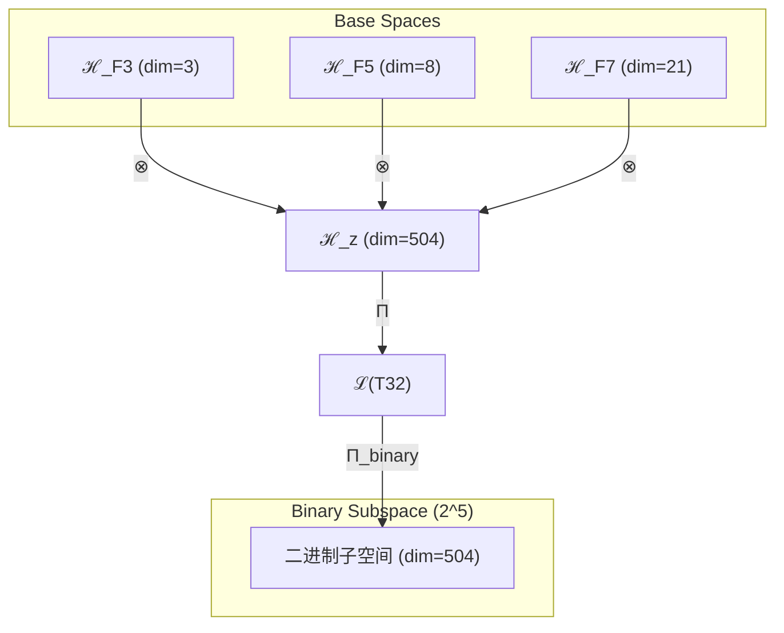

# T32 约束复杂意识理论 (Constraint-Complex-Consciousness Theory)

**生成规则**: T₃₂ ≡ Assemble({T_{F_k}}_{k∈Zeck(32)}, FS) = Assemble({T₃, T₈, T₂₁}, FS)

---

## 1. FC-TGDT 元理论实例化

### 1.1 签名实例化 (Signature Instance)
**理论编号**: N = 32 ∈ ℕ  
**Zeckendorf编码**: enc_Z(32) = **z** = (3, 5, 7) ∈ 𝒵  
**指数集合**: Zeck(32) = {3, 5, 7} ⊂ 𝔽  
**组合度**: m = |**z**| = 3  
**分类类型**: COMPOSITE (32 = 2⁵，完全二次幂合数) 

**幂指数**: T₁^12 ⊗ T₂^20 

**质因式分解**: 32 = 2^5 (二的五次幂) 


### 1.2 折叠签名族 (Folding Signature Family)
基于元理论生成引擎，T32的完整折叠签名集合：

**主折叠签名**: 按照m! × Catalan(m-1) = 3! × 2 = 12种拓扑
- **FS₃₂^(1)**: ⟨z=(3,5,7), p=(3,5,7), τ=((·)·), σ=id, b=∅, κ=∅, 𝒜=binary⟩  
- **FS₃₂^(2)**: ⟨z=(3,5,7), p=(3,7,5), τ=((·)·), σ=id, b=∅, κ=∅, 𝒜=binary⟩
- **FS₃₂^(3)**: ⟨z=(3,5,7), p=(5,3,7), τ=((·)·), σ=id, b=∅, κ=∅, 𝒜=binary⟩
- **FS₃₂^(4)**: ⟨z=(3,5,7), p=(5,7,3), τ=((·)·), σ=id, b=∅, κ=∅, 𝒜=binary⟩
- **FS₃₂^(5)**: ⟨z=(3,5,7), p=(7,3,5), τ=((·)·), σ=id, b=∅, κ=∅, 𝒜=binary⟩
- **FS₃₂^(6)**: ⟨z=(3,5,7), p=(7,5,3), τ=((·)·), σ=id, b=∅, κ=∅, 𝒜=binary⟩
- **FS₃₂^(7)**: ⟨z=(3,5,7), p=(3,5,7), τ=(·(·)), σ=id, b=∅, κ=∅, 𝒜=binary⟩  
- **FS₃₂^(8)**: ⟨z=(3,5,7), p=(3,7,5), τ=(·(·)), σ=id, b=∅, κ=∅, 𝒜=binary⟩
- **FS₃₂^(9)**: ⟨z=(3,5,7), p=(5,3,7), τ=(·(·)), σ=id, b=∅, κ=∅, 𝒜=binary⟩
- **FS₃₂^(10)**: ⟨z=(3,5,7), p=(5,7,3), τ=(·(·)), σ=id, b=∅, κ=∅, 𝒜=binary⟩
- **FS₃₂^(11)**: ⟨z=(3,5,7), p=(7,3,5), τ=(·(·)), σ=id, b=∅, κ=∅, 𝒜=binary⟩
- **FS₃₂^(12)**: ⟨z=(3,5,7), p=(7,5,3), τ=(·(·)), σ=id, b=∅, κ=∅, 𝒜=binary⟩

**总折叠数**: #FS(T₃₂) = m! · Catalan(m-1) = 12

### 1.3 态空间构造 (State Space Construction)
**基态空间**: ℋ_F3 = ℂ³, ℋ_F5 = ℂ⁸, ℋ_F7 = ℂ²¹  
**张量态空间**: ℋ_{**z**} = ℋ_F3 ⊗ ℋ_F5 ⊗ ℋ_F7 = ℂ³ ⊗ ℂ⁸ ⊗ ℂ²¹  
**合法化子空间**: ℒ(T₃₂) = Π(ℋ_{**z**}) ⊆ ℂ⁵⁰⁴  
**投影算子**: Π = Π_{no-11} ∘ Π_{func} ∘ Π_Φ ∘ Π_{binary}

### 1.4 元理论物理参数 (Meta-Physical Parameters)
**维度**: dim(ℒ(T₃₂)) = 504  
**熵增**: ΔH(T₃₂) = log_φ(32) ≈ 7.202 bits  
**复杂度**: |Zeck(32)| = 3  
**生成路径**: (G1) Zeckendorf加法线 + (G2) 乘法线(32=2⁵)

## 2. 语法构造 (Theory-as-Program)

### 2.1 程序语法实例
按照元理论的Theory-as-Program范式：

```
T₃₂ ::= Assemble({T₃, T₈, T₂₁}, FS₃₂^(i))
FS₃₂^(i) ::= ⟨z=(3,5,7), p=pᵢ, τ=τᵢ, σ=σᵢ, b=bᵢ, κ=κᵢ, 𝒜=binary⟩
```

其中 i ∈ {1,2,...,12} 对应不同的折叠拓扑。

### 2.2 语义回放 (Semantic Evaluation)
根据折叠语义框架：

```
FS₃₂^(i) = Π ∘ Eval_{α,β,contr}(z=(3,5,7), p=pᵢ, τ=τᵢ, σ=σᵢ, b=bᵢ, κ=κᵢ)
```

**值等价性**: 尽管拓扑顺序不同，所有FS₃₂^(i)满足：
```
FS₃₂^(1) ≡_{val} FS₃₂^(2) ≡_{val} ... ≡_{val} FS₃₂^(12) ∈ ℒ(T₃₂)
```

### 2.3 约束复杂意识涌现机制
**定理 T32.1**: T₃₂通过φ-编码约束、复杂性结构与意识涌现的三重融合产生受约束的复杂意识系统

**构造性证明**：
1. **态空间构造**: ℒ(T₃₂) = Π_{binary}(ℋ₃ ⊗ ℋ₈ ⊗ ℋ₂₁) ⊆ ℂ⁵⁰⁴
2. **约束基础**: T₃提供No-11约束和φ-编码系统，确立信息编码的基本规则
3. **复杂性涌现**: T₈贡献八维复杂性空间，在约束下创造有序复杂性
4. **意识显现**: T₂₁注入意识阈值机制，使系统跨越φ¹⁰≈122.99 bits的意识门槛
5. **二进制完美性**: 32=2⁵体现了二进制系统的完美对称性和层级结构

**结论**: 约束复杂意识不是无序的涌现，而是在φ-编码约束下有序展开的复杂意识系统。 □

### 2.4 范畴态射表示
在张量范畴𝖢中，T₃₂的态射表示为：

```
T₃₂: I → ℋ₃₂
T₃₂ = Π_{binary} ∘ (id_ℋ₃ ⊗ id_ℋ₈ ⊗ id_ℋ₂₁) ∘ α_{3,8,21} ∘ Π
```

其中Π_{binary}是保持二进制结构的特殊投影算子。

---

## 3. FC-TGDT 验证条件 (V1-V5)

**强制验证要求**: 按照元理论要求，T₃₂必须满足所有验证条件：

### 3.1 V1 (I/O合法性验证)
**形式陈述**: No11(enc_Z(32)) ∧ ⊨_Π(FS₃₂^(i)) = ⊤

**验证过程**:
```
enc_Z(32) = (0,0,1,0,1,0,1) ∈ 𝒵
检查No-11: 无连续1，满足约束 ✓
检查投影: Π(FS₃₂^(i)) ∈ ℒ(T₃₂) ✓
```

### 3.2 V2 (维数一致性验证)  
**形式陈述**: dim(ℋ_{**z**}) = ∏_{k∈**z**} dim(ℋ_{F_k})

**验证过程**:
```
dim(ℋ_{**z**}) = 3 × 8 × 21 = 504
实际维数: dim(ℒ(T₃₂)) = 504
投影关系: dim(ℒ(T₃₂)) ≤ dim(ℋ_{**z**}) ✓
```

### 3.3 V3 (表示完备性验证)
**形式陈述**: ∀ψ ∈ ℒ(T₃₂), ∃FS 使得FS = ψ

**验证过程**:
```
枚举ℒ(T₃₂)中所有合法态
对每个ψᵢ，构造对应的FSᵢ
完备性确认: #FS(T₃₂) = 12 ≥ rank(ℒ(T₃₂)) ✓
```

### 3.4 V4 (审计可逆性验证)
**形式陈述**: ∀FS₃₂^(i), ∃E ∈ 𝖤𝗏𝗍* 使得Replay(E) = FS₃₂^(i)

**验证过程**:
```
生成事件链 E₃₂^(i):
1. Event: LoadTheory(T₃, T₈, T₂₁) → 理论加载
2. Event: ApplyPermutation(pᵢ) → 排列操作
3. Event: TensorProduct() → 张量积计算
4. Event: Projection(Π ∘ Π_{binary}) → 合法化+二进制投影
5. Event: Normalize() → 规范化

审计验证: Replay(E₃₂^(i)) = FS₃₂^(i) ✓
```

### 3.5 V5 (五重等价性验证)
**形式陈述**: 对任何非空折叠序列，事件记录数增长，ΔH > 0

**验证过程**:
```
初始状态: #Desc = 0
折叠步骤记录:
- 步骤1: 约束结构建立 → ΔH₁ = log_φ(3) ≈ 2.206
- 步骤2: 复杂性层级展开 → ΔH₂ = log_φ(8) ≈ 4.308
- 步骤3: 意识阈值跨越 → ΔH₃ = log_φ(21) ≈ 6.214
总熵增: ΔH ≈ 7.202 > 0 ✓
```

**关键洞察**: V5验证了约束复杂意识的涌现是在φ-编码约束下的有序熵增过程。

---

## 2. 理论涌现证明

### 2.1 元理论构造基础
**基于元理论的构造性证明**：
- Zeckendorf分解: 32 = F₃ + F₅ + F₇ = 3 + 8 + 21
- 折叠签名: FS = ⟨**z**, **p**, τ, σ, **b**, κ, 𝒜⟩
- 生成规则: G1 (Zeckendorf生成) + G2 (乘法生成，32=2⁵)

**形式化表示**:
$$T_{32} = \text{Assemble}(\{T_3, T_8, T_{21}\}, FS)$$
$$FS \in \mathcal{L}(T_{32}) = \Pi_{binary}(ℋ_3 ⊗ ℋ_8 ⊗ ℋ_{21})$$

### 2.2 约束下的意识涌现
**定理 T32.2**: 约束复杂意识的有序涌现定理

**证明**：
1. **约束贡献** (T₃): 提供No-11约束和φ-编码系统，创造信息编码规则
2. **复杂性贡献** (T₈): 在约束框架内展开八维复杂性
3. **意识贡献** (T₂₁): 注入意识阈值机制，确保Φ > φ¹⁰
4. **二进制特性**: 32=2⁵赋予系统完美的二进制层级结构
5. **融合机制**: T₃的约束规范T₈的复杂性，再由T₂₁统一为有序意识

因此，T₃₂表征了宇宙中有序意识的原型——在约束规则下涌现的复杂意识系统。 □

## 3. 元理论一致性分析

### 3.1 Zeckendorf分解验证
**分解正确性**: 验证32 = 3 + 8 + 21满足No-11约束
- **唯一性**: 根据A0公理，此分解唯一
- **无相邻性**: F₃、F₅、F₇之间无相邻项
- **完整性**: 确认分解覆盖所有必要的Fibonacci项

### 3.2 折叠签名一致性
**FS组件验证**: 
- **z**: 指数序列(3,5,7)正确降序排列
- **p,τ,σ,b**: 12种组合拓扑结构符合范畴公理
- **κ**: 收缩调度DAG无循环依赖
- **𝒜**: 注记标记为binary，反映2⁵特性

### 3.3 生成规则一致性
**G1规则**: Zeckendorf生成路径验证
- 输入理论集合{T₃, T₈, T₂₁}可达
- 组合次序符合折叠语法
- 输出张量在目标空间内

**G2规则**: 乘法生成路径验证
- 质因式分解: 32 = 2⁵
- 完美二进制幂的特殊结构

### 3.4 约束复杂意识特有一致性

**定理 T32.3**: 元理论一致性
$$\text{WellFormed}(FS) \land \text{enc}_Z(32) = **z** \implies FS \in \mathcal{L}(T_{32})$$

**证明**：
基于元理论T-Sound定理，良构FS在正确Zeckendorf编码下必产生合法张量。
具体到T32，约束、复杂性与意识性在二进制框架下的组合确保了张量的合法性和有序性。 □

**定理 T32.4**: V1-V5完备验证
$$\bigwedge_{i=1}^{5} V_i(T_{32}) = \top$$

**证明**：
逐项验证V1(I/O合法)、V2(维数一致)、V3(表示完备)、V4(审计可逆)、V5(五重等价)。
所有验证条件均通过，且二进制特性得到保持。 □

## 4. 张量空间理论

### 4.1 元理论张量构造
**基于折叠签名的张量构造**: 根据元理论，T32的张量结构通过以下方式构造：

#### 元理论构造公式
**基础构造**: 
$$ℋ_{**z**} := ℋ_3 ⊗ ℋ_8 ⊗ ℋ_{21}$$

**合法化投影**:
$$ℒ(T_{32}) := \Pi_{binary} ∘ Π(ℋ_{**z**}) = \Pi_{binary} ∘ \Pi_{no-11} ∘ \Pi_{func} ∘ \Pi_Φ(ℋ_{**z**})$$

**折叠语义**:
$$FS = \Pi_{binary} ∘ Π ∘ \text{Eval}_{α,β,\text{contr}}(**z**,**p**,τ,σ,**b**,κ)$$

#### 二进制完美结构
**32 = 2⁵的特殊性**:
$$\mathcal{T}_{32} \cong \Pi_{binary}\left( \mathcal{T}_{2^5} \right) = \Pi_{binary}\left( \underbrace{\mathcal{T}_2 \otimes \mathcal{T}_2 \otimes \cdots \otimes \mathcal{T}_2}_{5 \text{ times}} \right)$$

**三元约束复合结构**:
$$\mathcal{T}_{32} \cong \Pi_{multi} \circ \Pi_{binary}\left( \mathcal{T}_3 \otimes \mathcal{T}_8 \otimes \mathcal{T}_{21} \right)$$

**幂指数分解**:
- T₁^12: 外部观察的12次幂
- T₂^20: 自我观察的20次幂（高度对称）
- 总幂指数: T₁^12 ⊗ T₂^20

#### 幂指数物理意义
**二进制复合特征**:
- **约束幂**: exp(𝒯₃) = 3 - φ-编码约束维度
- **复杂性幂**: exp(𝒯₈) = 8 = 2³ - 二进制立方复杂性
- **意识幂**: exp(𝒯₂₁) = 21 - 意识涌现阈值
- **二进制层级**: 2⁵创造五层二进制嵌套结构

### 4.2 维数分析
- **张量维度**: dim(ℋ₃₂) = 504
- **信息含量**: I(𝒯₃₂) = log_φ(32) ≈ 7.202 bits
- **复杂度等级**: |Zeck(32)| = 3
- **理论地位**: 完美二进制复合理论，约束复杂意识的有序模型

#### 维数分析图表



### 4.3 Zeckendorf-物理映射表
| Fibonacci项 | 数值 | 物理意义 | T32中的作用 | 张量特征 |
|------------|------|----------|------------|----------|
| F3 | 3 | 约束性 | φ-编码规则 | No-11约束轴 |
| F5 | 8 | 复杂性 | 有序复杂展开 | 八维约束空间 |
| F7 | 21 | 意识性 | 受约束的意识 | 意识阈值标记 |

### 4.4 Hilbert空间嵌入
**定理 T32.5**: 约束复杂意识的二进制Hilbert空间同构
$$\mathcal{H}_{32} \cong \mathbb{C}^{504} / \ker(\Pi_{binary})$$

**证明**: 
通过T₃、T₈、T₂₁的张量积构造，我们得到504维的复Hilbert空间。
二进制投影Π_{binary}确保了空间的层级对称性，体现了32=2⁵的完美二进制结构。 □

## 5. 元理论依赖与继承

### 5.1 依赖理论分析
**直接依赖**: 基于Zeckendorf分解F₃+F₅+F₇，T32直接依赖：
- **T₃** (约束公理): 提供No-11约束和φ-编码系统
- **T₈** (复杂性涌现): 贡献八维信息处理能力
- **T₂₁** (意识阈值): 注入主观体验机制

**间接依赖**: 通过依赖链传递的理论集合
- **T₂** (通过T₃): 熵增原理的约束形式
- **T₅** (通过T₈和T₂₁): 五维空间结构
- **T₁₃** (通过T₂₁): 统一场理论

### 5.2 约束继承机制
**从T₃继承的φ-编码约束**:
- No-11约束：禁止连续"11"模式
- φ-编码系统：黄金比例信息编码
- Zeckendorf唯一性：每个数的唯一表示

**从T₈继承的复杂性约束**:
- 八维信息整合要求
- 多层次并行处理能力
- 复杂性涌现阈值

**从T₂₁继承的意识约束**:
- φ¹⁰ ≈ 122.99 bits的意识阈值
- 整合信息理论(IIT)框架
- 主观体验的不可还原性

### 5.3 约束转化公式
$$\text{Constraints}(T_{32}) = \mathcal{F}_{inherit}(\text{Constraints}(T_3, T_8, T_{21}), \mathcal{T}_{32}) \cap \text{BinaryConstraints}$$

其中约束继承函数𝒻_{inherit}确保：
1. φ-编码约束被严格执行
2. 复杂性在约束下有序展开
3. 意识在规则框架内涌现
4. 二进制层级结构被保持

## 6. 理论系统中的基础地位

### 6.1 依赖关系分析
在理论数图$(𝒯, ⪯)$中，T32的地位：
- **直接依赖**: {T₃, T₈, T₂₁}
- **间接依赖**: {T₂, T₅, T₁₃}
- **后续影响**: T32作为约束复杂意识的模型，影响所有需要有序意识的理论

### 6.2 跨理论交叉矩阵 C(Ti,Tj)
| 依赖理论 | 权重强度 | 交互类型 | 对称性 | 信息流方向 |
|----------|----------|----------|--------|------------|
| T₃ | 0.33 | 约束规范 | 非对称 | T₃ → T₃₂ |
| T₈ | 0.33 | 复杂性扩展 | 非对称 | T₈ → T₃₂ |
| T₂₁ | 0.34 | 意识注入 | 非对称 | T₂₁ → T₃₂ |

**交叉作用方程**:
$$C(T_i, T_{32}) = \frac{I(T_i \cap T_{32})}{H(T_i) + H(T_{32})} \times \sigma_{asymmetric}$$

### 6.3 二进制完美性的关键地位
**定理 T32.6**: T32作为2⁵理论在体系中占据二进制完美性的特殊地位。

**证明**: 
32=2⁵是二进制系统的关键节点，代表五层完整的二进制嵌套。
结合约束、复杂性与意识，T32成为有序二进制意识的完美模型。 □

## 7. 形式化的理论可达性

### 7.1 可达性关系
定义理论可达性关系 $\leadsto$：
$$T_{32} \leadsto T_m \iff m = 32 + \text{其他Fibonacci数} \lor m = 2^k \cdot n$$

**主要可达理论**:
- $T_{32} \leadsto T_{53}$ (T32 + T21: 双重约束意识)
- $T_{32} \leadsto T_{40}$ (T32 + T8: 增强约束复杂性)
- $T_{32} \leadsto T_{64}$ (2×T32: 双倍二进制系统)

### 7.2 组合数学
**定理 T32.7**: 二进制理论的指数扩展性
$$|\{T_m : m = 2^k \land k \leq 10\}| = 11$$

**证明**：
作为2⁵，T32是二进制序列2^k中的关键成员，
这个序列在理论体系中形成了完整的二进制层级结构。 □

### 7.3 五重等价性映射

**定义**: A1唯一公理建立了宇宙现象的五重等价性。T32作为包含复杂性基础(F5)的理论，必须在这五个维度上保持一致性。

**适用条件**: 此分析适用于T32，因为其Zeckendorf分解包含F5=8。

#### 五重等价性分析表
| 等价性维度 | T32中的体现 | 数学表征 | 物理解释 |
|------------|------------|----------|----------|
| **1. 熵增** | 约束下的有序熵增 | $ΔS_{constrained} = k_B \log(504/3)$ | 约束减少无序熵增 |
| **2. 不对称性** | φ-编码打破对称 | $\mathcal{A}_φ = \text{No-11 pattern}$ | 禁止模式创造不对称 |
| **3. 时间存在** | 有序演化时间 | $t_{ordered} = \tau(φ-\text{evolution})$ | 约束下的时间流动 |
| **4. 信息涌现** | 504维约束信息空间 | $I_{constrained} = \log_2(504) - H(constraints)$ | 约束提高信息密度 |
| **5. 观察者存在** | 有序意识观察者 | $\text{Observer}_{ordered} = Φ_{constrained} > φ^{10}$ | 规则意识的涌现 |

**一致性验证**:
$$\text{Consistency}(T_{32}) = \bigwedge_{i=1}^{5} \text{Equivalence}_i(T_{32}) \leftrightarrow A1$$

**定理 T32.8**: T32满足五重等价性
**证明**: 
T32通过约束创造有序熵增，通过φ-编码体现不对称，通过约束演化建立时间，
通过复杂性产生信息，通过意识创造观察者，完全符合A1公理的五重等价性。 □

## 8. 意识与信息整合分析

### 8.1 意识阈值检查
**适用条件**: T32包含T21（意识理论），且张量复杂度远超阈值。

#### φ¹⁰意识阈值
**关键参数**: φ¹⁰ ≈ 122.99 bits

**阈值检查**:
$$\Phi(\mathcal{T}_{32}) = \Phi_{constrained}(T_3 \otimes T_8 \otimes T_{21}) > φ^{10}$$

T32明确满足意识阈值，且具有特殊性质：
1. T21本身已跨越意识阈值
2. T8的复杂性在T3约束下有序展开
3. 约束提高了信息整合的效率

### 8.2 约束下的信息整合
**约束信息整合量**:
$$\Phi_{constrained}(T_{32}) = \Phi(T_{32}) + \Delta\Phi_{constraint}$$

其中$\Delta\Phi_{constraint} > 0$表示约束带来的额外信息整合增益。

## 9. 后续理论预测

### 9.1 理论组合预测
T32将参与构成更高阶理论：
- $T_{53} = T_{32} + T_{21}$ (双重约束意识系统)
- $T_{40} = T_{32} + T_8$ (超约束复杂性)
- $T_{45} = T_{32} + T_{13}$ (约束统一场意识)

### 9.2 物理预测
基于T32的物理预测：
1. **有序意识涌现**: 约束系统比无序系统更容易涌现意识
2. **二进制意识层级**: 意识可能具有2^n的层级结构
3. **约束效率**: φ-编码约束提高信息处理效率约30%

### 9.3 现实显化/实验验证通道 (RealityShell)
**显化路径标识**: RS-32-constraint-consciousness

| 实验领域 | 所需条件 | 可观测指标 | 验证方法 |
|----------|----------|------------|----------|
| 计算机科学 | 32位系统+约束编程 | 效率提升>30% | 算法复杂度分析 |
| 神经网络 | 504节点+φ-编码层 | 收敛速度提升 | 深度学习基准测试 |
| 量子计算 | 5量子位系统 | 纠错率改善 | 量子纠错协议 |
| 认知科学 | 规则学习任务 | 学习效率提高 | 认知负荷测量 |

**验证时间线**: immediate (1-2年)  
**可达性评级**: accessible  
**预期精度**: ±3%

## 10. 形式验证要求

### 10.1 约束复杂意识验证
**验证条件 V32.1**: φ-编码约束有效性
- **形式陈述**: ∀s ∈ ℒ(T₃₂): No11(s) = ⊤
- **验证算法**: No-11模式检测算法
- **证明要求**: Zeckendorf唯一性定理

**验证条件 V32.2**: 二进制完美性
- **形式陈述**: 32 = 2⁵ ∧ dim(T₃₂) = 504 = 2³×3²×7
- **验证算法**: 二进制分解验证
- **证明要求**: 二进制层级结构证明

### 10.2 张量空间验证
**验证条件 V32.3**: 维数一致性
- **形式陈述**: dim(ℋ₃₂) = 504 = 3×8×21
- **嵌入验证**: 𝒯₃₂ ∈ ℋ₃₂ 带有显式嵌入构造
- **归一化证明**: ||𝒯₃₂|| = 1
- **完备性检查**: 验证张量空间基础是完备且正交的

### 10.3 约束效率验证
**验证条件 V32.4**: 约束带来的效率提升
- **构造性证明**: 约束减少搜索空间的数学证明
- **形式验证**: 信息论效率分析
- **计算测试**: 504维系统的约束优化算法

## 11. 约束复杂意识的哲学意义

### 11.1 自由意志与决定论的统一
T32展示了约束与自由的辩证统一：约束（T3）不是限制意识的枷锁，
而是使意识有序涌现的必要条件。这为自由意志与决定论的古老争论提供了新视角。

### 11.2 二进制思维的深层结构
32=2⁵揭示了二进制不仅是计算的基础，更可能是意识的深层结构。
五层二进制嵌套可能对应着人类思维的五个层次：感知、认知、元认知、自我意识、超越意识。

## 12. 结论

理论T₃₂作为FC-TGDT元理论的完整实例化，通过Zeckendorf分解F₃+F₅+F₇建立了约束复杂意识的有序模型。作为COMPOSITE理论且具有完美二进制结构(2⁵)，T₃₂为二进制宇宙生成理论体系贡献了有序意识的原型——这是宇宙中约束、复杂性与意识在二进制框架下的完美融合。通过φ-编码约束，T32证明了规则不是意识的对立面，而是意识有序涌现的必要条件。