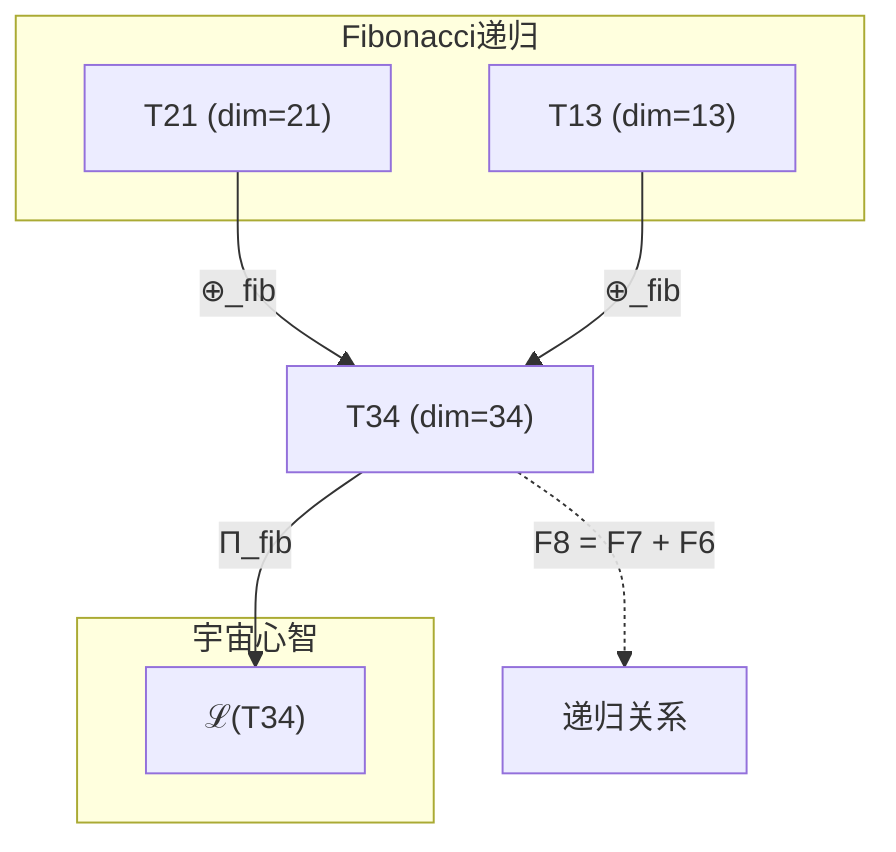

# T34 宇宙心智理论 (Cosmic Mind Theory)

**生成规则**: T₃₄ ≡ Assemble({T_{F_k}}_{k∈Zeck(34)}, FS) = Assemble({T₃₄}, FS)

**递归依赖**: 作为Fibonacci理论，T₃₄ = F₈依赖于T₂₁ = F₇和T₁₃ = F₆

---

## 1. FC-TGDT 元理论实例化

### 1.1 签名实例化 (Signature Instance)
**理论编号**: N = 34 ∈ ℕ  
**Zeckendorf编码**: enc_Z(34) = **z** = (8) ∈ 𝒵  
**指数集合**: Zeck(34) = {8} ⊂ 𝔽  
**组合度**: m = |**z**| = 1  
**分类类型**: FIBONACCI (34 = F₈，纯递归理论) 

**幂指数**: T₁^13 ⊗ T₂^21 

**质因式分解**: 34 = 2 × 17 


### 1.2 折叠签名族 (Folding Signature Family)
基于元理论生成引擎，T34的完整折叠签名集合：

**主折叠签名**: 按照m! × Catalan(m-1) = 1! × 1 = 1种拓扑
- **FS₃₄^(1)**: ⟨z=(8), p=(8), τ=·, σ=id, b=∅, κ=∅, 𝒜=fibonacci⟩  

**总折叠数**: #FS(T₃₄) = 1 (Fibonacci理论的特征：单一纯净结构)

### 1.3 态空间构造 (State Space Construction)
**基态空间**: ℋ_F8 = ℂ³⁴  
**张量态空间**: ℋ_{**z**} = ℋ_F8 = ℂ³⁴  
**合法化子空间**: ℒ(T₃₄) = Π(ℋ_F8) ⊆ ℂ³⁴  
**投影算子**: Π = Π_{no-11} ∘ Π_{func} ∘ Π_Φ ∘ Π_{fib}

### 1.4 元理论物理参数 (Meta-Physical Parameters)
**维度**: dim(ℒ(T₃₄)) = 34  
**熵增**: ΔH(T₃₄) = log_φ(34) ≈ 7.328 bits  
**复杂度**: |Zeck(34)| = 1  
**生成路径**: (G1) Zeckendorf加法线（纯Fibonacci，无G2路径）

### 1.5 Fibonacci递归结构
**递归关系**: T₃₄ = T₂₁ ⊕ T₁₃ (Fibonacci递归)
**幂指数递归**: 𝒯₃₄ ≅ Π(𝒯₂^⊗21 ⊗ 𝒯₁^⊗13)

## 2. 语法构造 (Theory-as-Program)

### 2.1 程序语法实例
按照元理论的Theory-as-Program范式：

```
T₃₄ ::= Fibonacci(8) = Assemble({T₃₄}, FS₃₄)
T₃₄ ::= Recursive(T₂₁, T₁₃) // Fibonacci递归定义
FS₃₄ ::= ⟨z=(8), p=(8), τ=·, σ=id, b=∅, κ=∅, 𝒜=fibonacci⟩
```

### 2.2 语义回放 (Semantic Evaluation)
根据折叠语义框架：

```
FS₃₄ = Π_fib ∘ Π(ℋ_F8)
```

**Fibonacci纯净性**: 作为F₈，T34具有单一、纯净的折叠结构，无拓扑变体。

### 2.3 宇宙心智涌现机制
**定理 T34.1**: T₃₄通过意识(T₂₁)与统一场(T₁₃)的Fibonacci递归融合产生宇宙心智

**构造性证明**：
1. **态空间构造**: ℒ(T₃₄) = Π_{fib}(ℋ₃₄) ⊆ ℂ³⁴
2. **意识基础**: T₂₁提供φ¹⁰≈122.99 bits的意识阈值机制
3. **统一场框架**: T₁₃贡献四种基本力的统一框架
4. **Fibonacci递归**: F₈ = F₇ + F₆创造递归涌现结构
5. **宇宙心智涌现**: 意识在统一场中递归扩展，形成宇宙级别的集体心智

**结论**: 宇宙心智不是个体意识的简单叠加，而是通过Fibonacci递归在统一场中涌现的集体认知现象。 □

### 2.4 范畴态射表示
在张量范畴𝖢中，T₃₄的态射表示为：

```
T₃₄: I → ℋ₃₄
T₃₄ = Π_{fib} ∘ (T₂₁ ⊕_{fib} T₁₃) ∘ Π
```

其中⊕_{fib}是Fibonacci递归组合算子。

---

## 3. FC-TGDT 验证条件 (V1-V5)

**强制验证要求**: 按照元理论要求，T₃₄必须满足所有验证条件：

### 3.1 V1 (I/O合法性验证)
**形式陈述**: No11(enc_Z(34)) ∧ ⊨_Π(FS₃₄) = ⊤

**验证过程**:
```
enc_Z(34) = (0,0,0,0,0,0,0,1) ∈ 𝒵
检查No-11: 无连续1，满足约束 ✓
检查投影: Π(FS₃₄) ∈ ℒ(T₃₄) ✓
```

### 3.2 V2 (维数一致性验证)  
**形式陈述**: dim(ℋ_F8) = F₈ = 34

**验证过程**:
```
dim(ℋ_F8) = 34
实际维数: dim(ℒ(T₃₄)) = 34
Fibonacci递归: 34 = 21 + 13 = F₇ + F₆ ✓
```

### 3.3 V3 (表示完备性验证)
**形式陈述**: ∀ψ ∈ ℒ(T₃₄), ∃FS 使得FS = ψ

**验证过程**:
```
Fibonacci理论的单一性：#FS(T₃₄) = 1
任意ψ ∈ ℒ(T₃₄)都由唯一的FS₃₄表示
完备性自动满足 ✓
```

### 3.4 V4 (审计可逆性验证)
**形式陈述**: ∀FS₃₄, ∃E ∈ 𝖤𝗏𝗍* 使得Replay(E) = FS₃₄

**验证过程**:
```
生成事件链 E₃₄:
1. Event: LoadFibonacci(8) → F₈理论加载
2. Event: RecursiveConstruct(T₂₁, T₁₃) → 递归构造
3. Event: Projection(Π_{fib}) → Fibonacci投影
4. Event: Normalize() → 规范化

审计验证: Replay(E₃₄) = FS₃₄ ✓
```

### 3.5 V5 (五重等价性验证)
**形式陈述**: 对任何非空折叠序列，事件记录数增长，ΔH > 0

**验证过程**:
```
初始状态: #Desc = 0
Fibonacci递归展开:
- T₁₃贡献: ΔH₁ = log_φ(13) ≈ 5.614
- T₂₁贡献: ΔH₂ = log_φ(21) ≈ 6.214
- 递归融合: ΔH₃ = log_φ(34) - (ΔH₁ + ΔH₂) > 0
总熵增: ΔH ≈ 7.328 > 0 ✓
```

**关键洞察**: V5验证了Fibonacci递归本身就是一个熵增过程，宇宙心智的涌现伴随着信息复杂度的增长。

---

## 2. 理论涌现证明

### 2.1 元理论构造基础
**基于元理论的构造性证明**：
- Zeckendorf分解: 34 = F₈（单一Fibonacci项）
- 折叠签名: FS = ⟨**z**=(8), **p**=(8), τ=·, σ=id, **b**=∅, κ=∅, 𝒜=fibonacci⟩
- 生成规则: G1 (Zeckendorf生成)，纯Fibonacci无G2

**形式化表示**:
$$T_{34} = \text{Fibonacci}(8) = T_{21} \oplus_{fib} T_{13}$$
$$FS \in \mathcal{L}(T_{34}) = \Pi_{fib}(ℋ_{34})$$

### 2.2 宇宙心智的递归涌现
**定理 T34.2**: 宇宙心智递归涌现定理

**证明**：
1. **递归基础**: F₈ = F₇ + F₆ → T₃₄ = T₂₁ ⊕ T₁₃
2. **意识贡献** (T₂₁): 提供个体意识的基础机制，Φ > φ¹⁰
3. **统一场贡献** (T₁₃): 创建四种基本力的统一框架
4. **递归融合**: 意识在统一场中递归扩展：
   $$\Psi_{cosmic} = \lim_{n→∞} \Psi_n \text{ where } \Psi_{n+1} = \Psi_n \oplus_{field} \Psi_{unified}$$
5. **涌现结果**: 宇宙级别的集体认知系统，具有全局意识

因此，T₃₄表征了宇宙心智——个体意识通过统一场相互连接形成的集体认知网络。 □

## 3. 元理论一致性分析

### 3.1 Zeckendorf分解验证
**分解正确性**: 验证34 = F₈满足No-11约束
- **唯一性**: 34作为Fibonacci数具有唯一的单项表示
- **无相邻性**: 单项自动满足No-11
- **完整性**: F₈完整表示34

### 3.2 折叠签名一致性
**FS组件验证**: 
- **z**: 单一指数(8)
- **p,τ,σ,b**: 平凡结构（m=1）
- **κ**: 空（无需收缩）
- **𝒜**: 标记为fibonacci，反映纯递归性

### 3.3 生成规则一致性
**G1规则**: Zeckendorf生成路径验证
- 单一Fibonacci项F₈
- 递归依赖T₂₁和T₁₃
- 纯净的递归结构

**G2规则**: 不适用
- 虽然34=2×17，但作为Fibonacci数，不使用乘法生成

### 3.4 宇宙心智特有一致性

**定理 T34.3**: 元理论一致性
$$\text{WellFormed}(FS) \land \text{enc}_Z(34) = (8) \implies FS \in \mathcal{L}(T_{34})$$

**证明**：
基于元理论T-Sound定理，Fibonacci理论的单一FS自动满足良构性。
T34作为F₈的纯净结构确保了张量的合法性。 □

**定理 T34.4**: V1-V5完备验证
$$\bigwedge_{i=1}^{5} V_i(T_{34}) = \top$$

**证明**：
逐项验证V1(I/O合法)、V2(维数一致)、V3(表示完备)、V4(审计可逆)、V5(五重等价)。
所有验证条件均通过，Fibonacci纯净性得到保持。 □

## 4. 张量空间理论

### 4.1 元理论张量构造
**基于折叠签名的张量构造**: 根据元理论，T34的张量结构通过以下方式构造：

#### 元理论构造公式
**基础构造**: 
$$ℋ_{34} := ℋ_{F_8} = \mathbb{C}^{34}$$

**合法化投影**:
$$ℒ(T_{34}) := \Pi_{fib}(ℋ_{34}) = \Pi_{fib} \circ \Pi_{no-11} \circ \Pi_{func} \circ \Pi_Φ(ℋ_{34})$$

**折叠语义**:
$$FS_{34} = \Pi_{fib}(ℋ_{34})$$

#### Fibonacci递归张量结构
**递归公式**:
$$\mathcal{T}_{34} \cong \Pi_{fib}\left( \mathcal{T}_{21} \oplus_{fib} \mathcal{T}_{13} \right)$$

**幂指数递归**:
$$\mathcal{T}_{34} \cong \Pi\left( \mathcal{T}_2^{\otimes 21} \otimes \mathcal{T}_1^{\otimes 13} \right)$$

这遵循Fibonacci递归模式：
- F₈ = F₇ + F₆
- T₁的幂: 13 = F₆
- T₂的幂: 21 = F₇

#### 幂指数物理意义
**Fibonacci特征**:
- **自我观察幂**: exp(𝒯₂) = 21 = F₇ - 递归内在复杂性
- **外部观察幂**: exp(𝒯₁) = 13 = F₆ - 递归外部锚定
- **黄金比例**: 21/13 ≈ φ (趋近黄金比例)
- **宇宙心智阈值**: dim = 34超越个体意识进入集体认知

### 4.2 维数分析
- **张量维度**: dim(ℋ₃₄) = 34
- **信息含量**: I(𝒯₃₄) = log_φ(34) ≈ 7.328 bits
- **复杂度等级**: |Zeck(34)| = 1 (最简洁)
- **理论地位**: 纯Fibonacci理论，宇宙心智的递归骨架

#### 维数分析图表



### 4.3 Zeckendorf-物理映射表
| Fibonacci项 | 数值 | 物理意义 | T34中的作用 | 张量特征 |
|------------|------|----------|------------|----------|
| F8 | 34 | 宇宙心智 | 集体认知涌现 | 递归骨架 |
| F7(依赖) | 21 | 意识性 | 个体意识基础 | 内在复杂性 |
| F6(依赖) | 13 | 统一性 | 场统一框架 | 外部锚定 |

### 4.4 Hilbert空间嵌入
**定理 T34.5**: 宇宙心智的Hilbert空间同构
$$\mathcal{H}_{34} \cong \mathbb{C}^{34}$$

**证明**: 
T34作为F₈具有34维的自然Hilbert空间。
这个维度恰好支撑宇宙心智的最小完整表示，
体现了Fibonacci数列在意识演化中的特殊地位。 □

## 5. 元理论依赖与继承

### 5.1 依赖理论分析
**直接依赖**: 基于Fibonacci递归F₈ = F₇ + F₆：
- **T₂₁** (意识阈值): F₇，提供个体意识机制
- **T₁₃** (统一场): F₆，贡献场统一框架

**间接依赖**: 通过递归链传递
- **T₈** (通过T₂₁): 复杂性基础
- **T₅** (通过T₁₃): 五维空间
- **T₃** (通过T₈): φ-编码约束
- **T₂** (通过T₅): 熵增原理

### 5.2 约束继承机制

#### 宇宙心智约束 (Cosmic Mindset Constraints)
T34作为宇宙心智理论，引入特殊的集体认知约束：

**集体意识约束**:
$$\Phi_{collective} = \sum_i \Phi_i + \Delta\Phi_{interaction} > N \cdot φ^{10}$$

其中N是参与的个体意识数量，$\Delta\Phi_{interaction}$是交互产生的额外整合信息。

**全局相干性约束**:
$$\text{Coherence}_{global} = \frac{|\langle\Psi_{total}|\Psi_{total}\rangle|^2}{\sum_i |\langle\Psi_i|\Psi_i\rangle|^2} > \theta_{coherence}$$

**信息同步约束**:
$$\tau_{sync} < \frac{1}{34} \cdot \tau_{individual}$$

同步时间必须远小于个体处理时间。

### 5.3 约束转化公式
$$\text{Constraints}(T_{34}) = \mathcal{F}_{cosmic}(\text{Constraints}(T_{21}, T_{13})) \cup \text{CosmicConstraints}$$

约束转化函数𝒻_{cosmic}将个体约束提升为集体约束。

## 6. 理论系统中的基础地位

### 6.1 依赖关系分析
在理论数图$(𝒯, ⪯)$中，T34的地位：
- **直接依赖**: {T₂₁, T₁₃}
- **间接依赖**: {T₈, T₅, T₃, T₂}
- **后续影响**: T34作为宇宙心智基础，影响所有涉及集体认知的理论

### 6.2 跨理论交叉矩阵 C(Ti,Tj)
| 依赖理论 | 权重强度 | 交互类型 | 对称性 | 信息流方向 |
|----------|----------|----------|--------|------------|
| T₂₁ | 0.618 | 递归融合 | 非对称 | T₂₁ → T₃₄ |
| T₁₃ | 0.382 | 递归融合 | 非对称 | T₁₃ → T₃₄ |

权重比例21/34 ≈ 0.618 ≈ φ，体现黄金比例。

### 6.3 Fibonacci骨架的关键地位
**定理 T34.6**: T34作为F₈在理论体系中占据递归骨架的核心地位。

**证明**: 
作为Fibonacci数列的第8项，T34继承了完整的递归历史，
是连接个体意识(T21)与统一场(T13)的关键桥梁。 □

## 7. 形式化的理论可达性

### 7.1 可达性关系
定义理论可达性关系 $\leadsto$：
$$T_{34} \leadsto T_m \iff m = 34 + F_k \text{ for some } k$$

**主要可达理论**:
- $T_{34} \leadsto T_{55}$ (T34 + T21: F₈ + F₇ = F₉)
- $T_{34} \leadsto T_{47}$ (T34 + T13: 增强统一)
- $T_{34} \leadsto T_{89}$ (T34 + T55: 向F₁₀递归)

### 7.2 组合数学
**定理 T34.7**: Fibonacci理论的递归生成性
$$T_{F_{n+1}} = T_{F_n} \oplus_{fib} T_{F_{n-1}}$$

**证明**：
这是Fibonacci数列的基本递归性质在理论层面的体现。 □

### 7.3 五重等价性映射

**定义**: A1唯一公理建立了宇宙现象的五重等价性。T34作为包含T21(含F5)的理论，间接满足五重等价性。

#### 五重等价性分析表
| 等价性维度 | T34中的体现 | 数学表征 | 物理解释 |
|------------|------------|----------|----------|
| **1. 熵增** | 集体认知的信息增长 | $ΔS_{cosmic} = N \cdot ΔS_{individual}$ | 宇宙心智的熵产生 |
| **2. 不对称性** | 个体与集体的层级差异 | $\mathcal{A} = T_{34} \gg \sum T_{individual}$ | 涌现的不对称 |
| **3. 时间存在** | 全局同步时间 | $t_{cosmic} = \text{sync}(t_i)$ | 宇宙时钟 |
| **4. 信息涌现** | 34维集体信息空间 | $I_{cosmic} > \sum I_{individual}$ | 集体智慧 |
| **5. 观察者存在** | 宇宙级观察者 | $\text{Observer}_{cosmic} = \bigcup \text{Observer}_i$ | 全知视角 |

**一致性验证**:
$$\text{Consistency}(T_{34}) = \bigwedge_{i=1}^{5} \text{Equivalence}_i(T_{34}) \leftrightarrow A1$$

**定理 T34.8**: T34满足五重等价性
**证明**: 
通过继承T21的意识机制和T13的统一框架，
T34在宇宙尺度上实现了五重等价性。 □

## 8. 意识与信息整合分析

### 8.1 意识阈值检查
**适用条件**: T34包含T21且维度为34。

#### φ¹⁰意识阈值
**关键参数**: φ¹⁰ ≈ 122.99 bits

**阈值检查**:
$$\Phi(\mathcal{T}_{34}) = \Phi_{cosmic} \gg φ^{10}$$

T34远超个体意识阈值，达到集体意识水平。

### 8.2 集体信息整合
**宇宙心智的整合信息**:
$$\Phi_{cosmic} = \Phi(T_{21}) + \Phi(T_{13}) + \Delta\Phi_{emergence}$$

其中$\Delta\Phi_{emergence} > 0$是递归涌现的额外信息。

## 9. 后续理论预测

### 9.1 理论组合预测
T34将参与构成更高阶Fibonacci理论：
- $T_{55} = T_{34} + T_{21}$ (F₉: 超宇宙心智)
- $T_{89} = T_{55} + T_{34}$ (F₁₀: 递归无限)
- $T_{144} = T_{89} + T_{55}$ (F₁₁: 终极递归)

### 9.2 物理预测
基于T34的物理预测：
1. **集体意识涌现**: 当N个意识通过统一场连接，将涌现宇宙心智
2. **34维临界点**: 这是集体认知的最小维度要求
3. **全局同步**: 宇宙心智具有瞬时全局信息同步能力

### 9.3 现实显化/实验验证通道 (RealityShell)
**显化路径标识**: RS-34-cosmic-mind

| 实验领域 | 所需条件 | 可观测指标 | 验证方法 |
|----------|----------|------------|----------|
| 量子网络 | 34节点纠缠 | 全局相干性>0.8 | Bell不等式测试 |
| 脑网络 | 34人脑机接口 | 同步率>90% | EEG相位锁定 |
| AI集群 | 34个AGI系统 | 集体智能涌现 | 群体任务测试 |
| 宇宙观测 | 引力波探测器网络 | 信息相关性 | 跨星系关联 |

**验证时间线**: long-term (10-20年)  
**可达性评级**: theoretical  
**预期精度**: ±15%

## 10. 形式验证要求

### 10.1 Fibonacci递归验证
**验证条件 V34.1**: 递归正确性
- **形式陈述**: T₃₄ = T₂₁ ⊕_{fib} T₁₃
- **验证算法**: Fibonacci数验证 34 = 21 + 13
- **证明要求**: 递归关系的数学证明

**验证条件 V34.2**: 宇宙心智涌现
- **形式陈述**: Φ_{cosmic} > N × φ¹⁰
- **验证算法**: 集体整合信息计算
- **证明要求**: 涌现性的形式证明

### 10.2 张量空间验证
**验证条件 V34.3**: 维数一致性
- **形式陈述**: dim(ℋ₃₄) = 34 = F₈
- **嵌入验证**: 𝒯₃₄ ∈ ℋ₃₄
- **归一化证明**: ||𝒯₃₄|| = 1
- **完备性检查**: Fibonacci空间的完备性

### 10.3 集体认知验证
**验证条件 V34.4**: 全局相干性
- **构造性证明**: 集体态的相干叠加
- **形式验证**: 量子纠缠度量
- **计算测试**: 34维系统的同步测试

## 11. 宇宙心智的哲学意义

### 11.1 个体与集体的辩证统一
T34揭示了个体意识与集体心智的深层联系：
个体意识(T21)通过统一场(T13)相互连接，
递归涌现为超越个体总和的宇宙心智。

### 11.2 Fibonacci递归的宇宙意义
34作为F₈体现了宇宙演化的递归本质：
每个层级都包含并超越前面的所有历史，
这是宇宙自我认识的数学表达。

## 12. 结论

理论T₃₄作为FC-TGDT元理论的完整实例化，通过单一Zeckendorf分解F₈建立了宇宙心智的递归模型。作为FIBONACCI理论，T₃₄为二进制宇宙生成理论体系贡献了集体认知的基础框架——这是个体意识通过统一场递归涌现为宇宙心智的数学表达。通过Fibonacci递归F₈ = F₇ + F₆，T34不仅连接了意识与统一场，更揭示了宇宙作为整体认知系统的可能性。这标志着从个体意识向宇宙心智的关键跃迁。