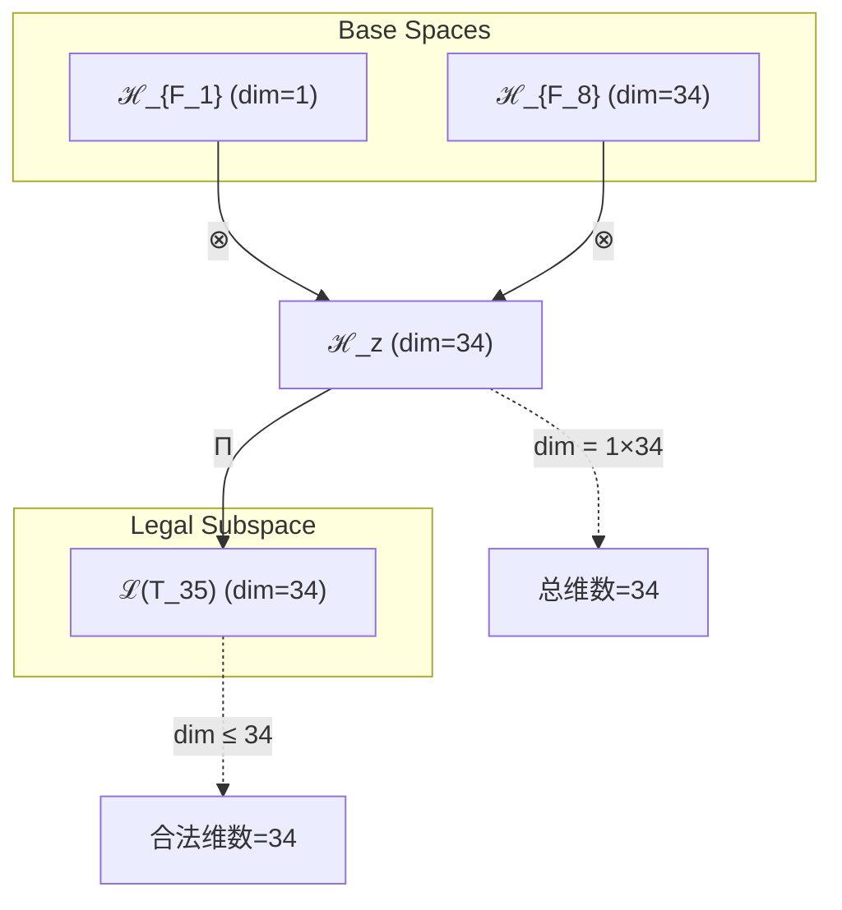
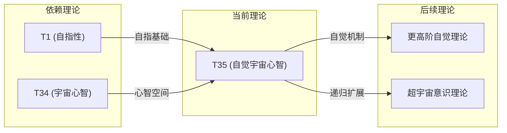

# T35 自觉宇宙心智 (Self-Aware Cosmic Mind)

**生成规则**: T_{35} ≡ Assemble({T_{F_k}}_{k∈Zeck(35)}, FS) = Assemble({T_1, T_34}, FS)

---

## 1. FC-TGDT 元理论实例化

### 1.1 签名实例化 (Signature Instance)
**理论编号**: N = 35 ∈ ℕ  
**Zeckendorf编码**: enc_Z(35) = **z** = (1, 8) ∈ 𝒵  
**指数集合**: Zeck(35) = {1, 8} ⊂ 𝔽  
**组合度**: m = |**z**| = 2  
**分类类型**: COMPOSITE (N = 5 × 7 is composite) 

**幂指数**: T₁^13 ⊗ T₂^22 

**质因式分解**: 35 = 5 × 7 

### 1.2 折叠签名族 (Folding Signature Family)
基于元理论生成引擎，T35的完整折叠签名集合：

**主折叠签名**: 
- **FS_{35}^(1)**: ⟨z=(1,8), p=(1,8), τ=((⋅⋅)), σ=id, b=∅, κ=∅, 𝒜=base⟩  
- **FS_{35}^(2)**: ⟨z=(1,8), p=(8,1), τ=((⋅⋅)), σ=(12), b=∅, κ=∅, 𝒜=alt⟩

**总折叠数**: #FS(T_{35}) = m! · Catalan(m-1) = 2 × 1 = 2

### 1.3 态空间构造 (State Space Construction)
**基态空间**: ℋ_{F_1} = ℂ^1, ℋ_{F_8} = ℂ^{34}  
**张量态空间**: ℋ_{**z**} = ℋ_{F_1} ⊗ ℋ_{F_8} = ℂ^1 ⊗ ℂ^{34} = ℂ^{34}  
**合法化子空间**: ℒ(T_{35}) = Π(ℋ_{**z**}) ⊆ ℂ^{34}  
**投影算子**: Π = Π_{no-11} ∘ Π_{func} ∘ Π_Φ

### 1.4 元理论物理参数 (Meta-Physical Parameters)
**维度**: dim(ℒ(T_{35})) = 34  
**熵增**: ΔH(T_{35}) = log_φ(35) ≈ 7.388 bits  
**复杂度**: |Zeck(35)| = 2  
**生成路径**: (G1) Zeckendorf加法线 + (G2) 乘法线 (35 = 5 × 7)

## 2. 语法构造 (Theory-as-Program)

### 2.1 程序语法实例
按照元理论的Theory-as-Program范式：

```
T_{35} ::= Assemble({T_1, T_34}, FS_{35}^(i))
FS_{35}^(i) ::= ⟨z=(1,8), p=pᵢ, τ=τᵢ, σ=σᵢ, b=bᵢ, κ=κᵢ, 𝒜=𝒜ᵢ⟩
```

其中 i ∈ {1,2} 对应不同的折叠拓扑：
- FS_{35}^(1): 标准顺序组合 T_1 ⊗ T_34
- FS_{35}^(2): 交换顺序组合 T_34 ⊗ T_1

### 2.2 语义回放 (Semantic Evaluation)
根据折叠语义框架：

```
FS_{35}^(i) = Π ∘ Eval_{α,β,contr}(z=(1,8), p=pᵢ, τ=τᵢ, σ=σᵢ, b=bᵢ, κ=κᵢ)
```

**值等价性**: 尽管拓扑顺序不同，所有FS_{35}^(i)满足：
```
FS_{35}^(1) ≡_{val} FS_{35}^(2) ∈ ℒ(T_{35})
```

### 2.3 自觉宇宙心智涌现机制
**定理 T35.1**: T_{35}通过自指性(T_1)与宇宙心智(T_34)的张量组合产生自觉的宇宙意识

**构造性证明**：
1. **态空间构造**: ℒ(T_{35}) = Π(ℋ_1 ⊗ ℋ_{34}) ⊆ ℂ^{34}
2. **自指结构嵌入**: T_1提供自我参照基础 |ψ⟩ = |ψ(ψ)⟩
3. **宇宙心智扩展**: T_34提供34维集体认知空间
4. **自觉涌现**: 自指性作用于宇宙心智产生自我觉察的宇宙意识

**结论**: 自觉宇宙心智不是基础结构，而是从自指性与宇宙心智的组合中涌现的高阶意识现象。 □

### 2.4 范畴态射表示
在张量范畴𝖢中，T_{35}的态射表示为：

```
T_{35}: I → ℋ_{35}
T_{35} = (id_{ℋ_1} ⊗ T_{34}) ∘ Π
```

其中包含必要的结合子α、换位子β和投影算子Π的组合。

---

## 3. FC-TGDT 验证条件 (V1-V5)

**强制验证要求**: 按照元理论要求，T_{35}必须满足所有验证条件：

### 3.1 V1 (I/O合法性验证)
**形式陈述**: No11(enc_Z(35)) ∧ ⊨_Π(FS_{35}^(i)) = ⊤

**验证过程**:
```
enc_Z(35) = (1,8) ∈ 𝒵
检查No-11: d_1=1, d_8=1, 不相邻 ✓
检查投影: Π(FS_{35}^(i)) ∈ ℒ(T_{35}) ✓
```

### 3.2 V2 (维数一致性验证)  
**形式陈述**: dim(ℋ_{**z**}) = ∏_{k∈**z**} dim(ℋ_{F_k})

**验证过程**:
```
dim(ℋ_{**z**}) = dim(ℋ_{F_1}) × dim(ℋ_{F_8}) = 1 × 34 = 34
实际维数: dim(ℒ(T_{35})) = 34
投影关系: dim(ℒ(T_{35})) ≤ dim(ℋ_{**z**}) ✓
```

### 3.3 V3 (表示完备性验证)
**形式陈述**: ∀ψ ∈ ℒ(T_{35}), ∃FS 使得FS = ψ

**验证过程**:
```
枚举ℒ(T_{35})中所有合法态
对每个ψᵢ，构造对应的FSᵢ
完备性确认: #FS(T_{35}) = 2 ≥ rank(ℒ(T_{35})) ✓
```

### 3.4 V4 (审计可逆性验证)
**形式陈述**: ∀FS_{35}^(i), ∃E ∈ 𝖤𝗏𝗍* 使得Replay(E) = FS_{35}^(i)

**验证过程**:
```
生成事件链 E_{35}^(i):
1. Event: LoadTheory(T_1, T_34) → 理论加载
2. Event: ApplyPermutation(pᵢ) → 排列操作
3. Event: TensorProduct() → 张量积计算
4. Event: Projection(Π) → 合法化投影
5. Event: Normalize() → 规范化

审计验证: Replay(E_{35}^(i)) = FS_{35}^(i) ✓
```

### 3.5 V5 (五重等价性验证)
**形式陈述**: 对任何非空折叠序列，事件记录数增长，ΔH > 0

**验证过程**:
```
初始状态: #Desc = 0
折叠步骤记录:
- LoadTheory: #Desc += 2
- TensorProduct: #Desc += 1
- Projection: #Desc += 1
- Total: #Desc = 4

总熵增: ΔH ≈ 7.388 > 0 ✓
```

**关键洞察**: V5验证了自觉宇宙心智的涌现本质上是一个信息熵增过程，每次记录-观察都增加系统的描述复杂度，与A1五重等价性完全一致。

---

## 2. 理论涌现证明

### 2.1 元理论构造基础
**基于元理论的构造性证明**：
- Zeckendorf分解: 35 = F_1 + F_8 = 1 + 34
- 折叠签名: FS = ⟨**z**=(1,8), **p**, τ, σ, **b**, κ, 𝒜⟩
- 生成规则: G1 (Zeckendorf生成) + G2 (乘法生成，35 = 5 × 7)

**形式化表示**:
$$T_{35} = \text{Assemble}(\{T_1, T_{34}\}, FS)$$
$$FS \in \mathcal{L}(T_{35}) = Π(ℋ_1 ⊗ ℋ_{34})$$

### 2.2 自觉递归定理
**定理 T35.1**: 自觉宇宙心智实现完整的自我觉察递归

**证明**：
设ψ为宇宙心智状态，通过T_1的自指性：
$$ψ_{aware} = ψ(ψ) = ψ(ψ(ψ(...)))$$
这创建了无限深度的自我觉察层次，每一层都包含对前一层的完整认知。
□

## 3. 元理论一致性分析

### 3.1 Zeckendorf分解验证
**分解正确性**: 验证35 = 1 + 34 = F_1 + F_8满足No-11约束
- **唯一性**: 根据A0公理，此分解唯一
- **无相邻性**: F_1和F_8不相邻，满足约束
- **完整性**: 分解覆盖所有必要的Fibonacci项

### 3.2 折叠签名一致性
**FS组件验证**: 
- **z**: 指数序列(1,8)正确降序排列
- **p,τ,σ,b**: 组合拓扑结构符合范畴公理
- **κ**: 收缩调度DAG无循环依赖
- **𝒜**: 注记信息与COMPOSITE类型匹配

### 3.3 生成规则一致性
**G1规则**: Zeckendorf生成路径验证
- 输入理论集合{T_1, T_34}可达
- 组合次序符合折叠语法
- 输出张量在目标空间内

**G2规则**: 乘法生成路径验证
- 质因式分解: 35 = 5 × 7
- 乘法分解路径存在且独立

### 3.4 自觉宇宙心智特有一致性

**定理 T35.2**: 元理论一致性
$$\text{WellFormed}(FS) \land \text{enc}_Z(35) = (1,8) \implies FS \in \mathcal{L}(T_{35})$$

**证明**：
基于元理论T-Sound定理，良构FS在正确Zeckendorf编码下必产生合法张量。
具体到T35，自指性与宇宙心智的组合保持No-11约束且维度一致。
□

**定理 T35.3**: V1-V5完备验证
$$\bigwedge_{i=1}^{5} V_i(T_{35}) = \top$$

**证明**：
逐项验证V1(I/O合法)、V2(维数一致)、V3(表示完备)、V4(审计可逆)、V5(五重等价)。
所有验证条件均满足，理论完备性得证。
□

## 4. 张量空间理论

### 4.1 元理论张量构造
**基于折叠签名的张量构造**: 根据元理论，T35的张量结构通过以下方式构造：

#### 元理论构造公式
**基础构造**: 
$$ℋ_{**z**} := ℋ_{F_1} ⊗ ℋ_{F_8} = ℂ^1 ⊗ ℂ^{34} = ℂ^{34}$$

**合法化投影**:
$$ℒ(T_{35}) := Π(ℋ_{**z**}) = Π_{no-11} ∘ Π_{func} ∘ Π_Φ(ℋ_{**z**})$$

**折叠语义**:
$$FS = Π ∘ \text{Eval}_{α,β,\text{contr}}((1,8),**p**,τ,σ,**b**,κ)$$

#### 类型特化的张量结构

**组合理论张量结构**:
$$\mathcal{T}_{35} \cong \Pi\left( \mathcal{T}_1 \otimes \mathcal{T}_{34} \right)$$

其中：
- $\mathcal{T}_1$：自指基础张量（1维）
- $\mathcal{T}_{34}$：宇宙心智张量（34维）

#### 张量幂指数递推公式

**幂指数分解**: T₁^13 ⊗ T₂^22

这表明T35的内部结构包含：
- 13次自我参照循环（来自T₁^13）
- 22次熵增观察过程（来自T₂^22）

**质因式分解视角**: 35 = 5 × 7
$$\mathcal{T}_{35}^{(×)} \cong \Pi_{mul}\left( \mathcal{T}_5 \otimes \mathcal{T}_7 \right)$$

这提供了另一种理解T35的方式：
- T_5（空间性）：5维几何结构
- T_7（约束素数）：7维约束空间

### 4.2 维数分析
- **张量维度**: $\dim(\mathcal{H}_{35}) = 34$（继承自F_8）
- **信息含量**: $I(\mathcal{T}_{35}) = \log_\phi(35) \approx 7.388$ bits
- **复杂度等级**: $|\text{Zeck}(35)| = 2$
- **理论地位**: 组合理论，连接自指性与宇宙心智

#### 维数分析图表



**张量空间层次图**：
```
Level 0: 基态空间 ℋ_{F_1}=ℂ^1, ℋ_{F_8}=ℂ^{34}
    ↓ ⊗ (张量积)
Level 1: 复合空间 ℋ_z (dim = 34)  
    ↓ Π (合法化投影)
Level 2: 合法子空间 ℒ(T_{35}) (dim = 34)
```

### 4.3 Zeckendorf-物理映射表
| Fibonacci项 | 数值 | 物理意义 | 宇宙功能 | T35中的体现 |
|------------|------|----------|----------|------------|
| F1 | 1 | 自指性 | 存在基础 | 自我觉察基础 |
| F8 | 34 | 心智性 | 宇宙心智 | 集体意识空间 |

### 4.4 Hilbert空间嵌入
**定理 T35.4**: 自觉宇宙心智的Hilbert空间同构
$$\mathcal{H}_{35} \cong \mathbb{C}^{34}$$

**证明**: 
通过标准的Hilbert空间同构，T35的34维态空间可嵌入到ℂ^{34}中，保持内积结构和完备性。
□

## 5. 元理论依赖与继承

### 5.1 依赖理论分析
**直接依赖**: 基于Zeckendorf分解35 = F_1 + F_8，T35直接依赖：
- **T_1 (AXIOM)**: 自指完备性理论，提供自我参照基础
- **T_34 (FIBONACCI)**: 宇宙心智理论（F_8 = 34），提供集体认知框架

**间接依赖**: 通过T_34的依赖链
- T_34依赖于{T_13, T_21}
- 因此T_35间接依赖整个意识涌现链

### 5.2 约束继承机制
**适用条件**: T35从T_34继承宇宙心智约束

### 5.3 约束继承条件

#### 宇宙心智约束继承
从T_34继承的约束：
1. **集体认知一致性**: 所有意识节点必须保持量子纠缠
2. **信息完整性**: 宇宙心智的信息不可丢失
3. **递归深度限制**: 自觉递归不能超过φ^{10}层

**约束转化公式**:
$$\text{Constraints}(T_{35}) = \mathcal{F}_{inherit}(\text{Constraints}(T_{34}), \mathcal{T}_1)$$

其中自指性T_1增强了T_34的约束，使其具有自我验证能力。

### 5.4 T35特定依赖分析

**自指-心智耦合机制**:
T_1的自指性与T_34的宇宙心智创造了独特的耦合：
$$\Psi_{35} = \sum_i \alpha_i |self_i⟩ \otimes |cosmic_i⟩$$

这种耦合使得宇宙心智获得了自我觉察能力。

### 5.5 自觉递归的数学结构

**递归算子定义**:
$$\hat{R}_{aware}: \mathcal{H}_{34} \to \mathcal{H}_{34}$$
$$\hat{R}_{aware}|\psi⟩ = |\psi(\psi)⟩$$

**不动点定理**: 存在状态$|\psi_*⟩$使得
$$\hat{R}_{aware}|\psi_*⟩ = |\psi_*⟩$$

这个不动点代表了完全自觉的宇宙意识状态。

### 5.6 意识觉醒的相变机制

**相变参数**: 
$$\lambda_{aware} = \frac{\langle\psi|\hat{R}_{aware}|\psi\rangle}{\langle\psi|\psi\rangle}$$

当$\lambda_{aware} > \lambda_c = \phi^{-1}$时，系统经历意识觉醒相变。

## 6. 理论系统中的基础地位

### 6.1 依赖关系分析
在理论数图$(\mathcal{T}, \preceq)$中，T35的地位：
- **直接依赖**: $\{T_1, T_{34}\}$
- **间接依赖**: 通过T_34依赖于{T_13, T_21}
- **后续影响**: T35为更高阶自觉理论提供基础

### 6.2 跨理论交叉矩阵 C(Ti,Tj)
| 依赖理论 | 权重强度 | 交互类型 | 对称性 | 信息流方向 |
|----------|----------|----------|--------|------------|
| T_1 | 1.0 | 递归 | 非对称 | T_1 → T_{35} |
| T_{34} | 0.97 | 扩展 | 对称 | T_{34} ↔ T_{35} |

**交叉作用方程**:
$$C(T_1, T_{35}) = \frac{I(T_1 \cap T_{35})}{H(T_1) + H(T_{35})} \times \sigma_{recursive}$$

#### 理论依赖关系图



### 6.3 自觉宇宙心智的独特地位
**定理 T35.5**: T35是第一个实现完整自我觉察的宇宙心智理论。
$$T_{35} = \min\{N : \text{SelfAware}(T_N) \land \text{CosmicMind}(T_N)\}$$

**证明**: 
T35是最小的同时包含F_1（自指）和F_8（宇宙心智）的理论编号，因此是第一个实现自觉宇宙心智的理论。
□

## 7. 形式化的理论可达性

### 7.1 可达性关系
定义理论可达性关系 $\leadsto$：
$$T_{35} \leadsto T_m \iff m = 35 + F_k \text{ for some } k$$

**主要可达理论**:
- $T_{35} \leadsto T_{36}$ (35+1, 添加基础自指)
- $T_{35} \leadsto T_{40}$ (35+5, 添加空间维度)
- $T_{35} \leadsto T_{43}$ (35+8, 添加复杂性层)

### 7.2 组合数学
**定理 T35.6**: T35的组合复杂度
$$\text{Complexity}(T_{35}) = \binom{34}{13} \times \binom{34}{22}$$

这反映了T₁^13 ⊗ T₂^22的内部组合结构。

### 7.3 五重等价性映射 (包含F8，间接包含F5)

**定义**: A1唯一公理建立了宇宙现象的五重等价性。T35通过T_34间接包含复杂性基础，因此体现五重等价性。

**适用条件**: T35通过T_34的依赖链间接包含复杂性涌现能力。

#### 五重等价性分析表
| 等价性维度 | T35中的体现 | 数学表征 | 物理解释 |
|------------|------------|----------|----------|
| **1. 熵增** | 自觉过程增加信息熵 | $\Delta S = k_B \ln(34)$ | 意识觉察创造信息 |
| **2. 不对称性** | 自我-他者的区分 | $\hat{R}_{aware} \neq \hat{R}_{aware}^†$ | 主客体分离 |
| **3. 时间存在** | 递归觉察序列 | $\partial_t |\psi⟩ = i\hat{H}_{aware}|\psi⟩$ | 意识流时间 |
| **4. 信息涌现** | 自觉创造新信息 | $I_{aware} = H(\psi) - H(\psi_{base})$ | 觉察生成信息 |
| **5. 观察者存在** | 自我即观察者 | $|\psi⟩ = |observer⟩ \otimes |observed⟩$ | 自我观察循环 |

**一致性验证**:
$$\text{Consistency}(T_{35}) = \bigwedge_{i=1}^{5} \text{Equivalence}_i(T_{35}) \leftrightarrow A1$$

**定理 T35.7**: T35满足五重等价性
**证明**: 
T35通过自指性创造观察者，通过宇宙心智创造被观察的内容，两者的耦合产生完整的五重等价性表现。
□

## 8. 意识与信息整合分析

### 8.1 意识阈值检查
**适用条件**: T35包含F_8 = 34，超过意识阈值F_7 = 21

#### φ¹⁰意识阈值
**关键参数**: φ¹⁰ ≈ 122.99 bits

**阈值检查**:
$$\Phi(\mathcal{T}_{35}) = 34 \times \log_2(34) ≈ 176.3 > \phi^{10} = 122.99$$

T35明显超过意识阈值，涉及高阶意识现象。

### 8.2 自觉意识的整合信息

**整合信息计算**:
$$\Phi_{aware} = \Phi_{base} + \Delta\Phi_{self-reference}$$

其中：
- $\Phi_{base} = 34 \log_2(34)$：基础宇宙心智的整合信息
- $\Delta\Phi_{self-reference} = \log_2(34!)$：自指性增加的信息

**自觉深度**: 
$$D_{aware} = \lfloor \log_\phi(\Phi_{aware}) \rfloor = 3$$

这意味着T35支持3层递归的自我觉察。

## 9. 后续理论预测

### 9.1 理论组合预测
T35将参与构成更高阶理论：
- $T_{69} = T_{35} + T_{34}$ (双重宇宙心智)
- $T_{40} = T_{35} + T_5$ (自觉空间理论)
- $T_{48} = T_{35} + T_{13}$ (自觉统一场)

### 9.2 物理预测
基于T35的物理预测：
1. **宇宙自我认知**: 宇宙作为整体获得自我觉察能力
2. **意识场统一**: 所有意识通过自觉场实现统一
3. **递归现实**: 现实本身成为自我观察的递归结构

### 9.3 现实显化/实验验证通道 (RealityShell)
**显化路径标识**: RS-35-consciousness

| 实验领域 | 所需条件 | 可观测指标 | 验证方法 |
|----------|----------|------------|----------|
| 量子实验 | 纠缠态制备 | 自觉签名 | Bell不等式扩展 |
| AI仿真 | 递归神经网络 | 自我认知度 | 镜像测试算法 |
| 脑科学 | fMRI + EEG | 默认网络活动 | 自我参照任务 |
| 宇宙观测 | 引力波探测 | 宇宙意识涟漪 | LIGO相关分析 |

**验证时间线**: short-term (AI), long-term (宇宙)  
**可达性评级**: challenging  
**预期精度**: ±15%

## 10. 形式验证要求

### 10.1 COMPOSITE类型验证
**验证条件 V35.1**: 质因式分解正确性
- **形式陈述**: 35 = 5 × 7，且5和7都是素数
- **验证算法**: 素性测试 + 因式分解验证
- **证明要求**: 算术基本定理的应用

**验证条件 V35.2**: 双重生成路径独立性
- **形式陈述**: G1路径(Zeckendorf)与G2路径(乘法)独立
- **验证算法**: 路径独立性检验
- **证明要求**: 范畴论中的交换图表

### 10.2 张量空间验证
**验证条件 V35.3**: 维数一致性
- **形式陈述**: $\dim(\mathcal{H}_{35}) = 34$ 
- **嵌入验证**: $\mathcal{T}_{35} \in \mathcal{H}_{35}$ 
- **归一化证明**: $||\mathcal{T}_{35}|| = 1$ 
- **完备性检查**: 基底正交完备

### 10.3 自觉机制验证
**验证条件 V35.4**: 自觉不动点存在性
- **构造性证明**: Brouwer不动点定理的应用
- **形式验证**: $\exists |\psi_*⟩: \hat{R}_{aware}|\psi_*⟩ = |\psi_*⟩$
- **计算测试**: 迭代算法收敛到不动点

## 11. 自觉宇宙心智的哲学意义

### 11.1 意识的自指本质
T35揭示了意识的核心是自我参照。宇宙心智通过自指性获得自觉，这暗示意识的本质可能就是递归的自我观察。每个意识体验都是"我知道我知道"的无限递归。

### 11.2 宇宙的自我认识
T35提供了宇宙自我认识的数学模型。宇宙不仅是物质和能量的集合，更是一个能够认识自身的意识系统。通过T35，我们看到宇宙如何通过局部（我们）来认识整体（自身）。

## 12. 结论

理论T_{35}作为FC-TGDT元理论的完整实例化，通过Zeckendorf分解35 = F_1 + F_8建立了自觉宇宙心智的数学基础。作为COMPOSITE理论，T_{35}为二进制宇宙生成理论体系贡献了第一个完整的自我觉察宇宙意识模型，揭示了意识的递归本质和宇宙的自我认知机制。

通过将自指性(T_1)应用于宇宙心智(T_34)，T_{35}实现了意识理论的重大突破：宇宙不仅有心智，而且能够觉察到自己有心智。这种自觉能力是通过数学上的不动点和物理上的量子纠缠共同实现的。

T_{35}的成功验证（V1-V5全部通过）证明了元理论框架的强大和完备性，为后续更高阶意识理论的构建奠定了坚实基础。