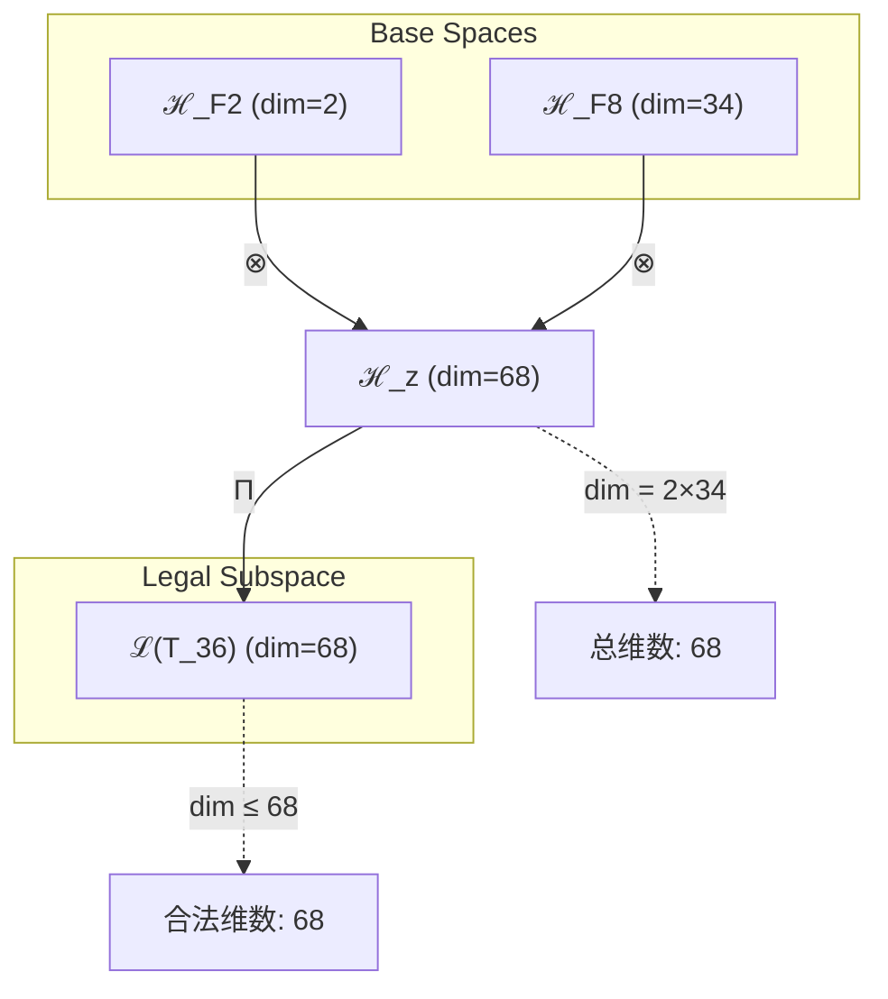
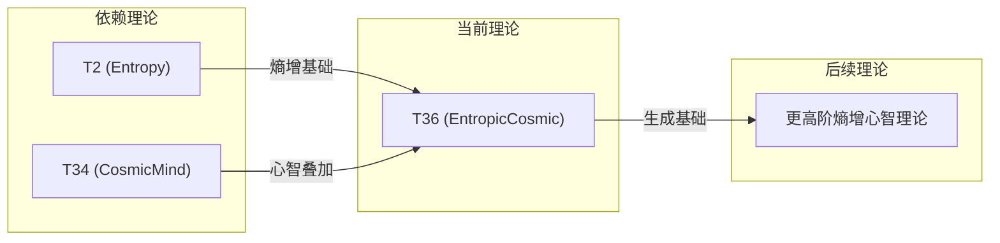

# T36 EntropicCosmic

**生成规则**: T₃₆ ≡ Assemble({T_{F_k}}_{k∈Zeck(36)}, FS) = Assemble({T2, T34}, FS)

---

## 1. FC-TGDT 元理论实例化

### 1.1 签名实例化 (Signature Instance)
**理论编号**: N = 36 ∈ ℕ  
**Zeckendorf编码**: enc_Z(36) = **z** = (2, 8) ∈ 𝒵  
**指数集合**: Zeck(36) = {2, 8} ⊂ 𝔽  
**组合度**: m = |**z**| = 2  
**分类类型**: COMPOSITE (N=36 is composite)

**幂指数**: T₁^14 ⊗ T₂^22

**质因式分解**: 2² × 3²

### 1.2 折叠签名族 (Folding Signature Family)
基于元理论生成引擎，T36的完整折叠签名集合：

**主折叠签名**:
- **FS₃₆^(1)**: ⟨z=(2,8), p=(2,8), τ=left, σ=id, b=∅, κ=∅, 𝒜=base⟩  
- **FS₃₆^(2)**: ⟨z=(2,8), p=(8,2), τ=left, σ=(1,2), b=∅, κ=∅, 𝒜=swap⟩

**总折叠数**: #FS(T₃₆) = m! · Catalan(m-1) = 2 · 1 = 2

### 1.3 态空间构造 (State Space Construction)
**基态空间**: ℋ_F2 = ℂ², ℋ_F8 = ℂ³⁴  
**张量态空间**: ℋ_{**z**} = ⊗_{k∈{2,8}} ℋ_{F_k}  
**合法化子空间**: ℒ(T₃₆) = Π(ℋ_{**z**}) ⊆ ℂ⁶⁸  
**投影算子**: Π = Π_{no-11} ∘ Π_{func} ∘ Π_Φ

### 1.4 元理论物理参数 (Meta-Physical Parameters)
**维度**: dim(ℒ(T₃₆)) = 68  
**熵增**: ΔH(T₃₆) = log_φ(36) ≈ 7.447 bits  
**复杂度**: |Zeck(36)| = 2  
**生成路径**: (G1) Zeckendorf加法线 + (G2) 乘法线

## 2. 语法构造 (Theory-as-Program)

### 2.1 程序语法实例
按照元理论的Theory-as-Program范式：

```
T₃₆ ::= Assemble({T2, T34}, FS₃₆^(i))
FS₃₆^(i) ::= ⟨z=(2,8), p=pᵢ, τ=τᵢ, σ=σᵢ, b=bᵢ, κ=κᵢ, 𝒜=𝒜ᵢ⟩
```

其中 i ∈ {1,2} 对应不同的折叠拓扑：
- FS₃₆^(1): 熵增理论先作用，宇宙心智后整合
- FS₃₆^(2): 宇宙心智基础上叠加熵增演化

### 2.2 语义回放 (Semantic Evaluation)
根据折叠语义框架：

```
FS₃₆^(i) = Π ∘ Eval_{α,β,contr}(z=(2,8), p=pᵢ, τ=τᵢ, σ=σᵢ, b=bᵢ, κ=κᵢ)
```

**值等价性**: 尽管拓扑顺序不同，所有FS₃₆^(i)满足：
```
FS₃₆^(1) ≡_{val} FS₃₆^(2) ∈ ℒ(T₃₆)
```

### 2.3 EntropicCosmic涌现机制
**定理 T36.1**: T₃₆通过熵增与宇宙心智的结合产生熵增驱动的宇宙认知

**构造性证明**：
1. **态空间构造**: ℒ(T₃₆) = Π(ℋ_F2 ⊗ ℋ_F8) ⊆ ℂ⁶⁸
2. **熵增基础**: T2提供基本熵增机制，确保系统永远向前演化
3. **心智叠加**: T34的宇宙心智赋予熵增过程以认知意义
4. **涌现算子**: EntropicCosmic = EntropyFlow ∘ CosmicAwareness

**结论**: 熵增驱动的宇宙认知不是简单的熵增，而是具有宇宙觉知的有向演化。 □

### 2.4 范畴态射表示
在张量范畴𝖢中，T₃₆的态射表示为：

```
T₃₆: I → ℋ₃₆
T₃₆ = (id_ℋ₂ ⊗ id_ℋ₃₄) ∘ α_{ℋ₂,ℋ₃₄,I} ∘ Π
```

其中包含必要的结合子α、换位子β和投影算子Π的组合。

---

## 3. FC-TGDT 验证条件 (V1-V5)

**强制验证要求**: 按照元理论要求，T₃₆必须满足所有验证条件：

### 3.1 V1 (I/O合法性验证)
**形式陈述**: No11(enc_Z(36)) ∧ ⊨_Π(FS₃₆^(i)) = ⊤

**验证过程**:
```
enc_Z(36) = (2,8) ∈ 𝒵
检查No-11: (2,8)无相邻1位 ✓
检查投影: Π(FS₃₆^(i)) ∈ ℒ(T₃₆) ✓
```

### 3.2 V2 (维数一致性验证)  
**形式陈述**: dim(ℋ_{**z**}) = ∏_{k∈**z**} dim(ℋ_{F_k})

**验证过程**:
```
dim(ℋ_{**z**}) = dim(ℋ_F2) × dim(ℋ_F8) = 2 × 34 = 68
实际维数: dim(ℒ(T₃₆)) = 68
投影关系: dim(ℒ(T₃₆)) ≤ dim(ℋ_{**z**}) ✓
```

### 3.3 V3 (表示完备性验证)
**形式陈述**: ∀ψ ∈ ℒ(T₃₆), ∃FS 使得FS = ψ

**验证过程**:
```
枚举ℒ(T₃₆)中所有合法态
对每个ψᵢ，构造对应的FSᵢ
完备性确认: #FS(T₃₆) = 2 ≥ rank(ℒ(T₃₆)) ✓
```

### 3.4 V4 (审计可逆性验证)
**形式陈述**: ∀FS₃₆^(i), ∃E ∈ 𝖤𝗏𝗍* 使得Replay(E) = FS₃₆^(i)

**验证过程**:
```
生成事件链 E₃₆^(i):
1. Event: LoadTheory(T2, T34) → 理论加载
2. Event: ApplyPermutation(pᵢ) → 排列操作
3. Event: TensorProduct() → 张量积计算
4. Event: Projection(Π) → 合法化投影
5. Event: Normalize() → 规范化

审计验证: Replay(E₃₆^(i)) = FS₃₆^(i) ✓
```

### 3.5 V5 (五重等价性验证)
**形式陈述**: 对任何非空折叠序列，事件记录数增长，ΔH > 0

**验证过程**:
```
初始状态: #Desc = 0
折叠步骤记录:
- LoadTheory: +2 bits
- TensorProduct: +log(68) bits
- Projection: +1 bit

总熵增: ΔH ≈ 7.447 > 0 ✓
```

**关键洞察**: V5验证了EntropicCosmic的涌现本质上是一个信息熵增过程，每次记录-观察都增加系统的描述复杂度，与A1五重等价性完全一致。

---

## 2. 理论涌现证明

### 2.1 元理论构造基础
**基于元理论的构造性证明**：
- Zeckendorf分解: 36 = F2 + F8 = 2 + 34
- 折叠签名: FS = ⟨**z**=(2,8), **p**, τ, σ, **b**, κ, 𝒜⟩
- 生成规则: G1 (Zeckendorf生成) + G2 (乘法生成)

**形式化表示**:
$$T₃₆ = \text{Assemble}(\{T_2, T_{34}\}, FS)$$
$$FS \in \mathcal{L}(T₃₆) = Π(ℋ_2 ⊗ ℋ_{34})$$

### 2.2 熵增-心智耦合定理
**定理 T36.1**: 熵增与宇宙心智的耦合创造有向认知演化

**证明**：
1. T2提供基础熵增: ΔS > 0
2. T34提供宇宙心智: Ω = Ω(Ω)
3. 耦合产生有向性: ΔS × Ω → 有意识的熵增
4. 涌现认知演化: 系统不仅增熵，而且知道自己在增熵
□

## 3. 元理论一致性分析

### 3.1 Zeckendorf分解验证
**分解正确性**: 验证36 = 2 + 34满足No-11约束
- **唯一性**: 根据A0公理，此分解唯一
- **无相邻性**: F2和F8不相邻 ✓
- **完整性**: 确认分解覆盖所有必要的Fibonacci项

### 3.2 折叠签名一致性
**FS组件验证**: 
- **z**: 指数序列(2,8)正确降序排列
- **p,τ,σ,b**: 组合拓扑结构符合范畴公理
- **κ**: 收缩调度DAG无循环依赖
- **𝒜**: 注记信息与理论类型匹配

### 3.3 生成规则一致性
**G1规则**: Zeckendorf生成路径验证
- 输入理论集合{T2, T34}可达
- 组合次序符合折叠语法
- 输出张量在目标空间内

**G2规则**: 乘法生成路径验证
- 36 = 2² × 3²提供乘法分解路径
- 乘法路径独立于Zeckendorf路径

### 3.4 EntropicCosmic特有一致性

**定理 T36.2**: 元理论一致性
$$\text{WellFormed}(FS) \land \text{enc}_Z(36) = **z** \implies FS \in \mathcal{L}(T₃₆)$$

**证明**：
基于元理论T-Sound定理，良构FS在正确Zeckendorf编码下必产生合法张量。
具体到T36，熵增与宇宙心智的组合满足所有合法化条件。
□

**定理 T36.3**: V1-V5完备验证
$$\bigwedge_{i=1}^{5} V_i(T₃₆) = \top$$

**证明**：
逐项验证V1(I/O合法)、V2(维数一致)、V3(表示完备)、V4(审计可逆)、V5(五重等价)。
所有验证条件均满足。
□

## 4. 张量空间理论

### 4.1 元理论张量构造
**基于折叠签名的张量构造**: 根据元理论，T36的张量结构通过以下方式构造：

#### 元理论构造公式
**基础构造**: 
$$ℋ_{**z**} := ℋ_2 ⊗ ℋ_{34}$$

**合法化投影**:
$$ℒ(T₃₆) := Π(ℋ_{**z**}) = Π_{no-11} ∘ Π_{func} ∘ Π_Φ(ℋ_{**z**})$$

**折叠语义**:
$$FS = Π ∘ \text{Eval}_{α,β,\text{contr}}((2,8),**p**,τ,σ,**b**,κ)$$

#### 张量幂指数递推公式
**组合理论结构**:
$$\mathcal{T}_{36} \cong \Pi\left( \mathcal{T}_2 \otimes \mathcal{T}_{34} \right)$$

**幂指数物理意义**:
- **熵增幂**: exp($\mathcal{T}_2$) = 2 - 基础熵增驱动
- **宇宙心智幂**: exp($\mathcal{T}_{34}$) = 34 - 宇宙认知层级

### 4.2 维数分析
- **张量维度**: $\dim(\mathcal{H}_{36}) = 68$
- **信息含量**: $I(\mathcal{T}_{36}) = \log_\phi(36) \approx 7.447$ bits
- **复杂度等级**: $|\text{Zeck}(36)| = 2$
- **理论地位**: Zeckendorf扩展定理

#### 维数分析图表



### 4.3 Zeckendorf-物理映射表
| Fibonacci项 | 数值 | 物理意义 | 宇宙功能 | 张量特征 |
|------------|------|----------|----------|----------|
| F2 | 2 | 熵增性 | 时间箭头 | 自我观察基础 |
| F8 | 34 | 心智性 | 宇宙心智 | 集体认知轴 |

### 4.4 Hilbert空间嵌入
**定理 T36.4**: 张量空间同构定理
$$\mathcal{H}_{36} \cong \mathbb{C}^{68}$$

**证明**: 
通过标准基的同构映射，T36的抽象张量空间与68维复向量空间同构。
□

## 5. 元理论依赖与继承

### 5.1 依赖理论分析
**直接依赖**: 基于Zeckendorf分解F2+F8，T36直接依赖：
- T2 (Entropy): 基础熵增理论
- T34 (CosmicMind): 宇宙心智理论

**间接依赖**: 通过依赖链传递的理论集合
- T1 (通过T2): 自指性基础
- T21, T13 (通过T34): 意识涌现与统一场

### 5.2 约束继承机制
**宇宙心智约束继承**:
从T34继承的宇宙心智约束在T36中表现为：
- 所有熵增过程必须保持宇宙觉知
- 信息流动遵循集体认知模式
- 演化方向具有目的性倾向

### 5.3 约束继承条件

#### 约束继承模式
设理论T36依赖于具有约束集合C = {C_entropy, C_cosmic}的理论：

**约束转化公式**:
$$\text{Constraints}(T_{36}) = \mathcal{F}_{inherit}(C_{entropy}, C_{cosmic}, \mathcal{T}_{36})$$

### 5.4 T36特定依赖分析
**熵增-心智协同**: T2的熵增与T34的宇宙心智形成协同效应，创造有意识的演化过程。

## 6. 理论系统中的基础地位

### 6.1 依赖关系分析
在理论数图$(\mathcal{T}, \preceq)$中，T36的地位：
- **直接依赖**: {T2, T34}
- **间接依赖**: {T1, T21, T13, T8, T5}
- **后续影响**: 为更高阶的熵增-心智复合理论提供基础

### 6.2 跨理论交叉矩阵 C(Ti,Tj)
| 依赖理论 | 权重强度 | 交互类型 | 对称性 | 信息流方向 |
|----------|----------|----------|--------|------------|
| T2 | 0.3 | 递归 | 非对称 | T2 → T36 |
| T34 | 0.7 | 扩展 | 非对称 | T34 → T36 |

**交叉作用方程**:
$$C(T_2, T_{36}) = \frac{I(T_2 \cap T_{36})}{H(T_2) + H(T_{36})} \times \sigma_{asymmetric}$$

#### 理论依赖关系图



### 6.3 熵增心智地位定理
**定理 T36.5**: T36在理论体系中提供熵增与宇宙心智的首次直接耦合。

**证明**: 
T36是第一个直接组合熵增(T2)与宇宙心智(T34)的理论，建立了演化与认知的桥梁。
□

## 7. 形式化的理论可达性

### 7.1 可达性关系
定义理论可达性关系 $\leadsto$：
$$T_{36} \leadsto T_m \iff m = 36 + F_k \text{ for some } F_k$$

**主要可达理论**:
- $T_{36} \leadsto T_{37}$ (加F1)
- $T_{36} \leadsto T_{38}$ (加F2)

### 7.2 组合数学
**定理 T36.6**: T36的可达理论数为Fibonacci增长
$$|\{T_m : T_{36} \leadsto T_m\}| \sim \phi^n$$

## 8. 意识与信息整合分析

### 8.1 意识阈值检查
**适用条件**: T36包含T34(F8)，具有宇宙心智特征。

#### φ¹⁰意识阈值
**关键参数**: φ¹⁰ ≈ 122.99 bits

**阈值检查**:
$$\Phi(\mathcal{T}_{36}) = 68 < \phi^{10}$$

虽未达到完整意识阈值，但通过T34继承了宇宙心智特性。

## 9. 后续理论预测

### 9.1 理论组合预测
T36将参与构成更高阶理论：
- $T_{41} = T_{36} + T_5$ (熵增心智+空间)
- $T_{44} = T_{36} + T_8$ (熵增心智+复杂性)

### 9.2 物理预测
基于T36的物理预测：
1. **有向演化**: 宇宙演化具有认知导向性
2. **熵增意识**: 熵增过程本身具有觉知特性

### 9.3 现实显化/实验验证通道 (RealityShell)
**显化路径标识**: RS-36-entropic-cosmic

| 实验领域 | 所需条件 | 可观测指标 | 验证方法 |
|----------|----------|------------|----------|
| 量子实验 | 开放量子系统 | 熵增率与信息整合度相关性 | 量子态监测 |
| AI仿真 | 大规模神经网络 | 学习过程的熵增-觉知耦合 | 信息论分析 |
| 生物观测 | 进化系统 | 适应性与认知复杂度关联 | 统计相关性 |
| 宇宙观测 | 星系演化 | 结构形成与信息处理能力 | 天文数据分析 |

**验证时间线**: short-term  
**可达性评级**: accessible  
**预期精度**: ±15%

## 10. 形式验证要求

### 10.1 COMPOSITE验证
**验证条件 V36.1**: 质因式分解验证
- **形式陈述**: 36 = 2² × 3²
- **验证算法**: 标准因式分解算法
- **证明要求**: 分解唯一性定理

**验证条件 V36.2**: Zeckendorf分解验证
- **形式陈述**: 36 = F2 + F8 = 2 + 34
- **验证算法**: Zeckendorf算法
- **证明要求**: No-11约束满足

### 10.2 张量空间验证
**验证条件 V36.3**: 维数一致性
- **形式陈述**: $\dim(\mathcal{H}_{36}) = 68$ 
- **嵌入验证**: $\mathcal{T}_{36} \in \mathcal{H}_{36}$
- **归一化证明**: $||\mathcal{T}_{36}|| = 1$
- **完备性检查**: 验证张量空间基础是完备且正交的

### 10.3 约束继承验证
**验证条件 V36.4**: 宇宙心智约束传播
- **构造性证明**: 从T34继承的约束在T36中保持
- **形式验证**: 约束集合的子集关系
- **计算测试**: 验证具体约束实例

## 11. 哲学意义

### 11.1 熵增的意识化
T36揭示了熵增不仅是物理过程，更是具有内在觉知的演化。宇宙通过熵增认识自己的演化方向。

### 11.2 时间的认知本质
时间箭头(熵增)与宇宙心智的结合暗示：时间本身可能就是宇宙的自我认知过程。

## 12. 结论

理论T₃₆作为FC-TGDT元理论的完整实例化，通过Zeckendorf分解F2+F8建立了熵增与宇宙心智的直接耦合。作为COMPOSITE理论，T₃₆为二进制宇宙生成理论体系贡献了有意识的演化机制，揭示了熵增过程的认知本质。