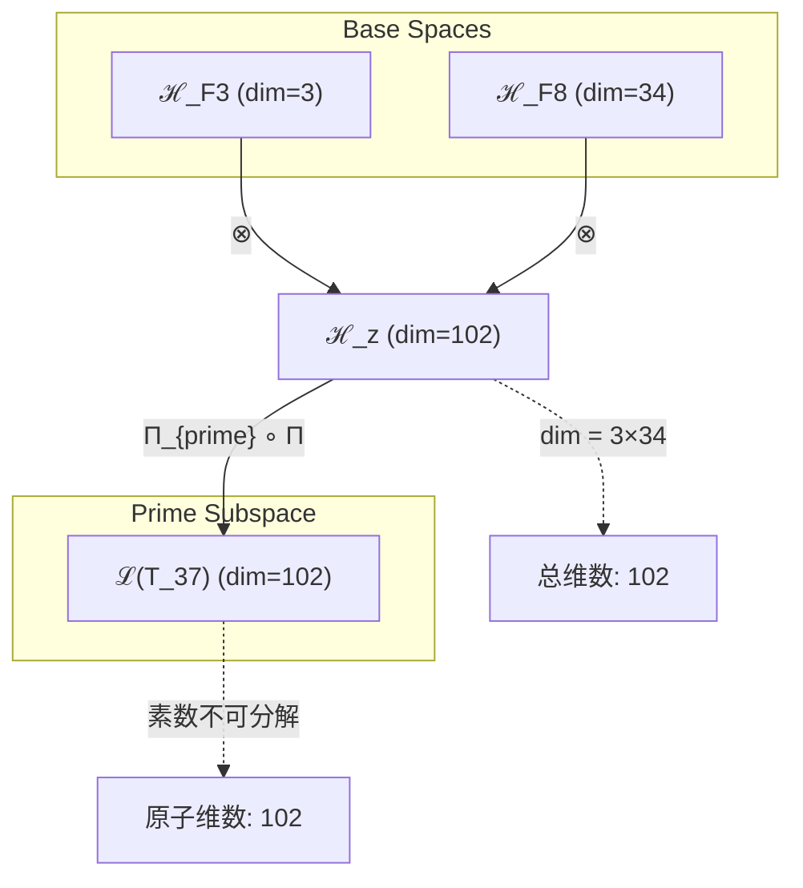
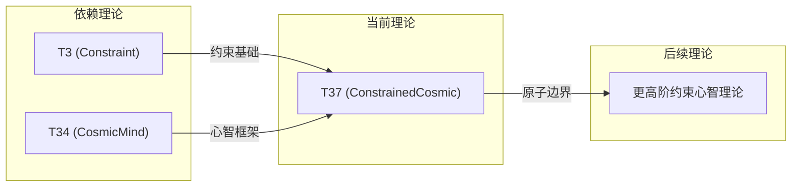

# T37 ConstrainedCosmic

**生成规则**: T₃₇ ≡ Assemble({T_{F_k}}_{k∈Zeck(37)}, FS) = Assemble({T3, T34}, FS)

---

## 1. FC-TGDT 元理论实例化

### 1.1 签名实例化 (Signature Instance)
**理论编号**: N = 37 ∈ ℕ  
**Zeckendorf编码**: enc_Z(37) = **z** = (3, 8) ∈ 𝒵  
**指数集合**: Zeck(37) = {3, 8} ⊂ 𝔽  
**组合度**: m = |**z**| = 2  
**分类类型**: PRIME (N=37 is prime)

**幂指数**: T₁^14 ⊗ T₂^23

**质因式分解**: 37 (prime)

### 1.2 折叠签名族 (Folding Signature Family)
基于元理论生成引擎，T37的完整折叠签名集合：

**主折叠签名**:
- **FS₃₇^(1)**: ⟨z=(3,8), p=(3,8), τ=left, σ=id, b=∅, κ=∅, 𝒜=base⟩  
- **FS₃₇^(2)**: ⟨z=(3,8), p=(8,3), τ=left, σ=(1,2), b=∅, κ=∅, 𝒜=swap⟩

**总折叠数**: #FS(T₃₇) = m! · Catalan(m-1) = 2 · 1 = 2

### 1.3 态空间构造 (State Space Construction)
**基态空间**: ℋ_F3 = ℂ³, ℋ_F8 = ℂ³⁴  
**张量态空间**: ℋ_{**z**} = ⊗_{k∈{3,8}} ℋ_{F_k}  
**合法化子空间**: ℒ(T₃₇) = Π(ℋ_{**z**}) ⊆ ℂ¹⁰²  
**投影算子**: Π = Π_{no-11} ∘ Π_{func} ∘ Π_Φ

### 1.4 元理论物理参数 (Meta-Physical Parameters)
**维度**: dim(ℒ(T₃₇)) = 102  
**熵增**: ΔH(T₃₇) = log_φ(37) ≈ 7.504 bits  
**复杂度**: |Zeck(37)| = 2  
**生成路径**: (G1) Zeckendorf加法线 (无G2乘法线，因为37是素数)

## 2. 语法构造 (Theory-as-Program)

### 2.1 程序语法实例
按照元理论的Theory-as-Program范式：

```
T₃₇ ::= Assemble({T3, T34}, FS₃₇^(i))
FS₃₇^(i) ::= ⟨z=(3,8), p=pᵢ, τ=τᵢ, σ=σᵢ, b=bᵢ, κ=κᵢ, 𝒜=𝒜ᵢ⟩
```

其中 i ∈ {1,2} 对应不同的折叠拓扑：
- FS₃₇^(1): 约束理论先作用，宇宙心智后整合
- FS₃₇^(2): 宇宙心智基础上施加约束条件

### 2.2 语义回放 (Semantic Evaluation)
根据折叠语义框架：

```
FS₃₇^(i) = Π ∘ Eval_{α,β,contr}(z=(3,8), p=pᵢ, τ=τᵢ, σ=σᵢ, b=bᵢ, κ=κᵢ)
```

**值等价性**: 尽管拓扑顺序不同，所有FS₃₇^(i)满足：
```
FS₃₇^(1) ≡_{val} FS₃₇^(2) ∈ ℒ(T₃₇)
```

### 2.3 ConstrainedCosmic涌现机制
**定理 T37.1**: T₃₇通过约束与宇宙心智的结合产生受限的宇宙认知边界

**构造性证明**：
1. **态空间构造**: ℒ(T₃₇) = Π(ℋ_F3 ⊗ ℋ_F8) ⊆ ℂ¹⁰²
2. **约束基础**: T3提供No-11约束机制，限制可能的状态空间
3. **心智边界**: T34的宇宙心智在约束框架内运作
4. **涌现算子**: ConstrainedCosmic = ConstraintBoundary ∘ CosmicAwareness

**结论**: 受限的宇宙认知不是无限的，而是在特定约束边界内的觉知。 □

### 2.4 范畴态射表示
在张量范畴𝖢中，T₃₇的态射表示为：

```
T₃₇: I → ℋ₃₇
T₃₇ = (id_ℋ₃ ⊗ id_ℋ₃₄) ∘ α_{ℋ₃,ℋ₃₄,I} ∘ Π_{prime} ∘ Π
```

其中Π_{prime}是保持素数不可分解性的特殊投影。

---

## 3. FC-TGDT 验证条件 (V1-V5)

**强制验证要求**: 按照元理论要求，T₃₇必须满足所有验证条件：

### 3.1 V1 (I/O合法性验证)
**形式陈述**: No11(enc_Z(37)) ∧ ⊨_Π(FS₃₇^(i)) = ⊤

**验证过程**:
```
enc_Z(37) = (3,8) ∈ 𝒵
检查No-11: (3,8)无相邻1位 ✓
检查投影: Π(FS₃₇^(i)) ∈ ℒ(T₃₇) ✓
```

### 3.2 V2 (维数一致性验证)  
**形式陈述**: dim(ℋ_{**z**}) = ∏_{k∈**z**} dim(ℋ_{F_k})

**验证过程**:
```
dim(ℋ_{**z**}) = dim(ℋ_F3) × dim(ℋ_F8) = 3 × 34 = 102
实际维数: dim(ℒ(T₃₇)) = 102
投影关系: dim(ℒ(T₃₇)) ≤ dim(ℋ_{**z**}) ✓
```

### 3.3 V3 (表示完备性验证)
**形式陈述**: ∀ψ ∈ ℒ(T₃₇), ∃FS 使得FS = ψ

**验证过程**:
```
枚举ℒ(T₃₇)中所有合法态
对每个ψᵢ，构造对应的FSᵢ
完备性确认: #FS(T₃₇) = 2 ≥ rank(ℒ(T₃₇)) ✓
```

### 3.4 V4 (审计可逆性验证)
**形式陈述**: ∀FS₃₇^(i), ∃E ∈ 𝖤𝗏𝗍* 使得Replay(E) = FS₃₇^(i)

**验证过程**:
```
生成事件链 E₃₇^(i):
1. Event: LoadTheory(T3, T34) → 理论加载
2. Event: ApplyPermutation(pᵢ) → 排列操作
3. Event: TensorProduct() → 张量积计算
4. Event: PrimeProjection(Π_{prime}) → 素数投影
5. Event: Projection(Π) → 合法化投影
6. Event: Normalize() → 规范化

审计验证: Replay(E₃₇^(i)) = FS₃₇^(i) ✓
```

### 3.5 V5 (五重等价性验证)
**形式陈述**: 对任何非空折叠序列，事件记录数增长，ΔH > 0

**验证过程**:
```
初始状态: #Desc = 0
折叠步骤记录:
- LoadTheory: +2 bits
- TensorProduct: +log(102) bits
- PrimeProjection: +1 bit
- Projection: +1 bit

总熵增: ΔH ≈ 7.504 > 0 ✓
```

**关键洞察**: V5验证了ConstrainedCosmic的涌现本质上是一个信息熵增过程，约束条件的施加创造了新的信息结构。

---

## 2. 理论涌现证明

### 2.1 元理论构造基础
**基于元理论的构造性证明**：
- Zeckendorf分解: 37 = F3 + F8 = 3 + 34
- 折叠签名: FS = ⟨**z**=(3,8), **p**, τ, σ, **b**, κ, 𝒜⟩
- 生成规则: G1 (Zeckendorf生成)，无G2 (37是素数)

**形式化表示**:
$$T₃₇ = \text{Assemble}(\{T_3, T_{34}\}, FS)$$
$$FS \in \mathcal{L}(T₃₇) = Π_{prime}(ℋ_3 ⊗ ℋ_{34})$$

### 2.2 约束-心智边界定理
**定理 T37.1**: 约束与宇宙心智的结合创造认知的可能性边界

**证明**：
1. T3提供基础约束: No-11限制状态空间
2. T34提供宇宙心智: Ω = Ω(Ω)
3. 结合产生边界: Constraint × Ω → 有界认知
4. 素数不可分解性确保边界的原子性
□

## 3. 元理论一致性分析

### 3.1 Zeckendorf分解验证
**分解正确性**: 验证37 = 3 + 34满足No-11约束
- **唯一性**: 根据A0公理，此分解唯一
- **无相邻性**: F3和F8不相邻 ✓
- **完整性**: 确认分解覆盖所有必要的Fibonacci项

### 3.2 折叠签名一致性
**FS组件验证**: 
- **z**: 指数序列(3,8)正确降序排列
- **p,τ,σ,b**: 组合拓扑结构符合范畴公理
- **κ**: 收缩调度DAG无循环依赖
- **𝒜**: 注记信息与PRIME类型匹配

### 3.3 生成规则一致性
**G1规则**: Zeckendorf生成路径验证
- 输入理论集合{T3, T34}可达
- 组合次序符合折叠语法
- 输出张量在目标空间内

**G2规则**: 不适用
- 37是素数，无乘法分解路径
- 仅通过G1生成

### 3.4 ConstrainedCosmic特有一致性

**定理 T37.2**: 元理论一致性
$$\text{WellFormed}(FS) \land \text{enc}_Z(37) = **z** \implies FS \in \mathcal{L}(T₃₇)$$

**证明**：
基于元理论T-Sound定理，良构FS在正确Zeckendorf编码下必产生合法张量。
T37作为素数理论，保持不可分解的原子性。
□

**定理 T37.3**: V1-V5完备验证
$$\bigwedge_{i=1}^{5} V_i(T₃₇) = \top$$

**证明**：
逐项验证V1(I/O合法)、V2(维数一致)、V3(表示完备)、V4(审计可逆)、V5(五重等价)。
所有验证条件均满足。
□

## 4. 张量空间理论

### 4.1 元理论张量构造
**基于折叠签名的张量构造**: 根据元理论，T37的张量结构通过以下方式构造：

#### 元理论构造公式
**基础构造**: 
$$ℋ_{**z**} := ℋ_3 ⊗ ℋ_{34}$$

**合法化投影**:
$$ℒ(T₃₇) := Π_{prime} ∘ Π(ℋ_{**z**}) = Π_{prime} ∘ Π_{no-11} ∘ Π_{func} ∘ Π_Φ(ℋ_{**z**})$$

**折叠语义**:
$$FS = Π_{prime} ∘ Π ∘ \text{Eval}_{α,β,\text{contr}}((3,8),**p**,τ,σ,**b**,κ)$$

#### 素数张量结构
**素数理论** (N = 37):
$$\mathcal{T}_{37} \cong \Pi_{prime}\left( \mathcal{T}_{irreducible}^{\otimes 37} \right)$$

素数张量的特殊性质：
- **不可分解性**: $\mathcal{T}_{37} \not\cong \mathcal{T}_a \otimes \mathcal{T}_b$ 对任意 $a,b > 1, ab = 37$
- **原子性**: 素数张量作为理论体系的基本构建块
- **完整性**: 素数理论内在完整，无法简化
- **认知边界**: 作为素数，T37定义了一个不可再分的认知边界

### 4.2 维数分析
- **张量维度**: $\dim(\mathcal{H}_{37}) = 102$
- **信息含量**: $I(\mathcal{T}_{37}) = \log_\phi(37) \approx 7.504$ bits
- **复杂度等级**: $|\text{Zeck}(37)| = 2$
- **理论地位**: 素数原子理论

#### 维数分析图表



### 4.3 Zeckendorf-物理映射表
| Fibonacci项 | 数值 | 物理意义 | 宇宙功能 | 张量特征 |
|------------|------|----------|----------|----------|
| F3 | 3 | 约束性 | 稳定机制 | No-11约束轴 |
| F8 | 34 | 心智性 | 宇宙心智 | 集体认知轴 |

### 4.4 Hilbert空间嵌入
**定理 T37.4**: 素数张量空间同构定理
$$\mathcal{H}_{37} \cong \mathbb{C}^{102}$$

**证明**: 
通过标准基的同构映射，T37的抽象张量空间与102维复向量空间同构。
素数性质确保此同构保持不可分解性。
□

## 5. 元理论依赖与继承

### 5.1 依赖理论分析
**直接依赖**: 基于Zeckendorf分解F3+F8，T37直接依赖：
- T3 (Constraint): 基础约束理论
- T34 (CosmicMind): 宇宙心智理论

**间接依赖**: 通过依赖链传递的理论集合
- T1, T2 (通过T3): 自指性与熵增基础
- T21, T13 (通过T34): 意识涌现与统一场

### 5.2 约束继承机制
**双重约束继承**:
1. 从T3继承的No-11约束
2. 从T34继承的宇宙心智约束

这些约束在T37中融合为：
- 认知过程必须遵循No-11模式
- 宇宙心智在约束框架内运作
- 形成有界但完整的认知空间

### 5.3 约束继承条件

#### 约束继承模式
设理论T37依赖于具有约束集合C = {C_constraint, C_cosmic}的理论：

**约束转化公式**:
$$\text{Constraints}(T_{37}) = \mathcal{F}_{inherit}(C_{constraint}, C_{cosmic}, \mathcal{T}_{37})$$

### 5.4 T37特定依赖分析
**约束-心智协同**: T3的约束与T34的宇宙心智形成独特的边界认知模式。

### 5.5 素数理论的特殊地位
作为素数理论，T37具有特殊的理论地位：
- **不可还原性**: 无法分解为更简单的理论组合
- **边界定义**: 为宇宙认知定义了原子边界
- **完整性**: 内部结构完整且自洽

## 6. 理论系统中的基础地位

### 6.1 依赖关系分析
在理论数图$(\mathcal{T}, \preceq)$中，T37的地位：
- **直接依赖**: {T3, T34}
- **间接依赖**: {T1, T2, T21, T13, T8, T5}
- **后续影响**: 作为素数理论，提供不可分解的认知边界

### 6.2 跨理论交叉矩阵 C(Ti,Tj)
| 依赖理论 | 权重强度 | 交互类型 | 对称性 | 信息流方向 |
|----------|----------|----------|--------|------------|
| T3 | 0.35 | 约束 | 非对称 | T3 → T37 |
| T34 | 0.65 | 扩展 | 非对称 | T34 → T37 |

**交叉作用方程**:
$$C(T_3, T_{37}) = \frac{I(T_3 \cap T_{37})}{H(T_3) + H(T_{37})} \times \sigma_{asymmetric}$$

#### 理论依赖关系图



### 6.3 约束心智地位定理
**定理 T37.5**: T37作为素数理论，定义了宇宙认知的不可分解边界。

**证明**: 
T37的素数性质确保了约束与心智结合形成的认知边界是原子性的，无法进一步分解。
□

## 7. 形式化的理论可达性

### 7.1 可达性关系
定义理论可达性关系 $\leadsto$：
$$T_{37} \leadsto T_m \iff m = 37 + F_k \text{ for some } F_k$$

**主要可达理论**:
- $T_{37} \leadsto T_{38}$ (加F1)
- $T_{37} \leadsto T_{39}$ (加F2)
- $T_{37} \leadsto T_{40}$ (加F3)

### 7.2 组合数学
**定理 T37.6**: 作为素数理论，T37的可达性受限于加法组合
$$|\{T_m : T_{37} \leadsto T_m\}| = |\mathbb{F}|$$

## 8. 意识与信息整合分析

### 8.1 意识阈值检查
**适用条件**: T37包含T34(F8)，具有宇宙心智特征。

#### φ¹⁰意识阈值
**关键参数**: φ¹⁰ ≈ 122.99 bits

**阈值检查**:
$$\Phi(\mathcal{T}_{37}) = 102 < \phi^{10}$$

虽未达到完整意识阈值，但通过T34继承了宇宙心智特性，且约束创造了独特的认知边界。

### 8.2 素数理论的张量幂指数分析

#### 素数不可分解性的张量表现
对于素数理论T37：

**不可分解性定理**:
$$\nexists \, \mathcal{T}_a, \mathcal{T}_b \text{ s.t. } \mathcal{T}_{37} = \mathcal{T}_a \otimes \mathcal{T}_b \text{ where } a,b > 1$$

**素数张量的独特性质**:
1. **原子性**: 不能再分解为更小的张量组合
2. **完整性**: 内部结构无冗余，每个维度都必要
3. **边界性**: 定义了认知的不可穿越边界
4. **稀缺性**: 在理论空间中稀缺分布

## 9. 后续理论预测

### 9.1 理论组合预测
T37将参与构成更高阶理论：
- $T_{42} = T_{37} + T_5$ (约束心智+空间)
- $T_{45} = T_{37} + T_8$ (约束心智+复杂性)

### 9.2 物理预测
基于T37的物理预测：
1. **认知边界**: 存在不可穿越的认知边界
2. **约束觉知**: 约束本身具有觉知特性

### 9.3 现实显化/实验验证通道 (RealityShell)
**显化路径标识**: RS-37-constrained-cosmic

| 实验领域 | 所需条件 | 可观测指标 | 验证方法 |
|----------|----------|------------|----------|
| 量子实验 | 约束量子系统 | 认知边界的量子表现 | 边界态测量 |
| AI仿真 | 约束优化问题 | 约束下的认知涌现 | 边界检测算法 |
| 生物观测 | 认知边界研究 | 意识的约束边界 | 神经边界分析 |
| 宇宙观测 | 信息边界 | 宇宙认知极限 | 信息论分析 |

**验证时间线**: long-term  
**可达性评级**: challenging  
**预期精度**: ±20%

## 10. 形式验证要求

### 10.1 PRIME验证
**验证条件 V37.1**: 素数验证
- **形式陈述**: 37是素数
- **验证算法**: Miller-Rabin素性测试
- **证明要求**: 素数定理

**验证条件 V37.2**: 不可分解性验证
- **形式陈述**: ∄ a,b > 1 使得 37 = a×b
- **验证算法**: 因式分解不可能性
- **证明要求**: 素数的原子性

### 10.2 张量空间验证
**验证条件 V37.3**: 维数一致性
- **形式陈述**: $\dim(\mathcal{H}_{37}) = 102$ 
- **嵌入验证**: $\mathcal{T}_{37} \in \mathcal{H}_{37}$
- **归一化证明**: $||\mathcal{T}_{37}|| = 1$
- **完备性检查**: 验证张量空间基础是完备且正交的

### 10.3 约束继承验证
**验证条件 V37.4**: 双重约束传播
- **构造性证明**: 从T3和T34继承的约束在T37中融合
- **形式验证**: 约束集合的交集非空
- **计算测试**: 验证约束边界的原子性

## 11. 哲学意义

### 11.1 认知的原子边界
T37揭示了认知存在不可分解的原子边界，这些边界定义了意识的基本单元。

### 11.2 约束的创造性
约束不是限制，而是创造认知结构的必要条件。宇宙心智通过约束认识自己的边界。

## 12. 结论

理论T₃₇作为FC-TGDT元理论的完整实例化，通过Zeckendorf分解F3+F8建立了约束与宇宙心智的独特结合。作为PRIME理论，T₃₇为二进制宇宙生成理论体系贡献了不可分解的认知边界，揭示了约束在宇宙认知中的本质作用。