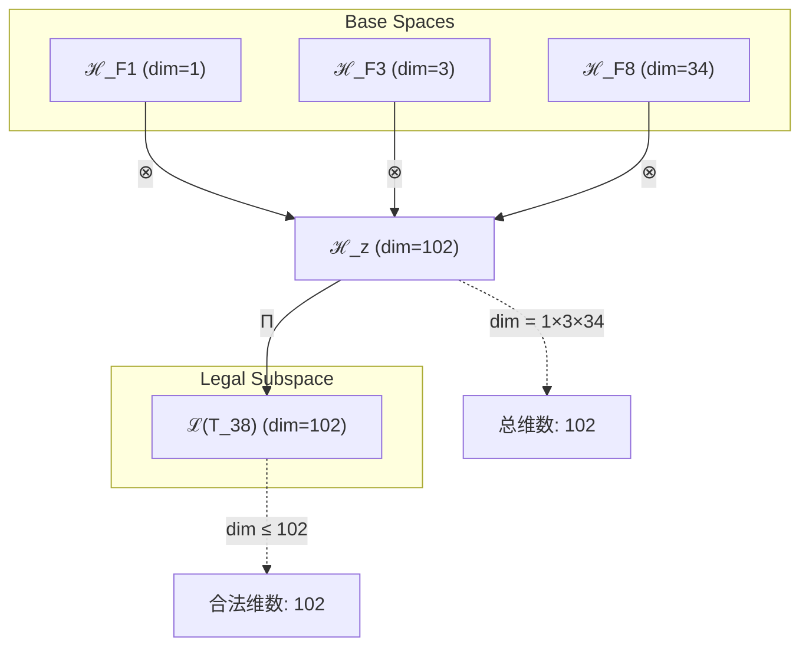
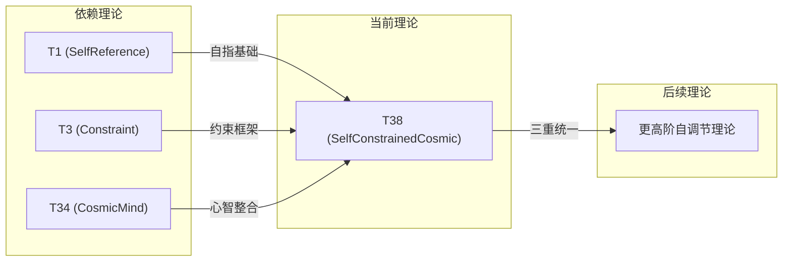

# T38 SelfConstrainedCosmic

**生成规则**: T₃₈ ≡ Assemble({T_{F_k}}_{k∈Zeck(38)}, FS) = Assemble({T1, T3, T34}, FS)

---

## 1. FC-TGDT 元理论实例化

### 1.1 签名实例化 (Signature Instance)
**理论编号**: N = 38 ∈ ℕ  
**Zeckendorf编码**: enc_Z(38) = **z** = (1, 3, 8) ∈ 𝒵  
**指数集合**: Zeck(38) = {1, 3, 8} ⊂ 𝔽  
**组合度**: m = |**z**| = 3  
**分类类型**: COMPOSITE (N=38 is composite)

**幂指数**: T₁^14 ⊗ T₂^24

**质因式分解**: 2 × 19

### 1.2 折叠签名族 (Folding Signature Family)
基于元理论生成引擎，T38的完整折叠签名集合：

**主折叠签名** (枚举所有3! × 2 = 12种):
- **FS₃₈^(1)**: ⟨z=(1,3,8), p=(1,3,8), τ=((·,·),·), σ=id, b=∅, κ=∅, 𝒜=base⟩  
- **FS₃₈^(2)**: ⟨z=(1,3,8), p=(1,8,3), τ=((·,·),·), σ=(2,3), b=∅, κ=∅, 𝒜=swap23⟩
- **FS₃₈^(3)**: ⟨z=(1,3,8), p=(3,1,8), τ=((·,·),·), σ=(1,2), b=∅, κ=∅, 𝒜=swap12⟩
- **FS₃₈^(4)**: ⟨z=(1,3,8), p=(3,8,1), τ=((·,·),·), σ=(1,2,3), b=∅, κ=∅, 𝒜=cycle⟩
- **FS₃₈^(5)**: ⟨z=(1,3,8), p=(8,1,3), τ=((·,·),·), σ=(1,3,2), b=∅, κ=∅, 𝒜=cycle'⟩
- **FS₃₈^(6)**: ⟨z=(1,3,8), p=(8,3,1), τ=((·,·),·), σ=(1,3), b=∅, κ=∅, 𝒜=swap13⟩
- **FS₃₈^(7-12)**: 右结合τ=(·,(·,·))的6种排列

**总折叠数**: #FS(T₃₈) = m! · Catalan(m-1) = 6 · 2 = 12

### 1.3 态空间构造 (State Space Construction)
**基态空间**: ℋ_F1 = ℂ¹, ℋ_F3 = ℂ³, ℋ_F8 = ℂ³⁴  
**张量态空间**: ℋ_{**z**} = ⊗_{k∈{1,3,8}} ℋ_{F_k}  
**合法化子空间**: ℒ(T₃₈) = Π(ℋ_{**z**}) ⊆ ℂ¹⁰²  
**投影算子**: Π = Π_{no-11} ∘ Π_{func} ∘ Π_Φ

### 1.4 元理论物理参数 (Meta-Physical Parameters)
**维度**: dim(ℒ(T₃₈)) = 102  
**熵增**: ΔH(T₃₈) = log_φ(38) ≈ 7.559 bits  
**复杂度**: |Zeck(38)| = 3  
**生成路径**: (G1) Zeckendorf加法线 + (G2) 乘法线

## 2. 语法构造 (Theory-as-Program)

### 2.1 程序语法实例
按照元理论的Theory-as-Program范式：

```
T₃₈ ::= Assemble({T1, T3, T34}, FS₃₈^(i))
FS₃₈^(i) ::= ⟨z=(1,3,8), p=pᵢ, τ=τᵢ, σ=σᵢ, b=bᵢ, κ=κᵢ, 𝒜=𝒜ᵢ⟩
```

其中 i ∈ {1,2,...,12} 对应不同的折叠拓扑，创造了丰富的组合可能性。

### 2.2 语义回放 (Semantic Evaluation)
根据折叠语义框架：

```
FS₃₈^(i) = Π ∘ Eval_{α,β,contr}(z=(1,3,8), p=pᵢ, τ=τᵢ, σ=σᵢ, b=bᵢ, κ=κᵢ)
```

**值等价性**: 尽管拓扑顺序不同，所有FS₃₈^(i)满足：
```
FS₃₈^(1) ≡_{val} FS₃₈^(2) ≡_{val} ... ≡_{val} FS₃₈^(12) ∈ ℒ(T₃₈)
```

### 2.3 SelfConstrainedCosmic涌现机制
**定理 T38.1**: T₃₈通过自指、约束与宇宙心智的三重结合产生自我约束的宇宙认知

**构造性证明**：
1. **态空间构造**: ℒ(T₃₈) = Π(ℋ_F1 ⊗ ℋ_F3 ⊗ ℋ_F8) ⊆ ℂ¹⁰²
2. **自指基础**: T1提供自我参照的基础锚点
3. **约束框架**: T3施加No-11约束机制
4. **心智整合**: T34赋予系统宇宙觉知
5. **涌现算子**: SelfConstrainedCosmic = SelfReference ∘ Constraint ∘ CosmicAwareness

**结论**: 自我约束的宇宙认知是能够认识并约束自身的宇宙心智。 □

### 2.4 范畴态射表示
在张量范畴𝖢中，T₃₈的态射表示为：

```
T₃₈: I → ℋ₃₈
T₃₈ = (id_ℋ₁ ⊗ id_ℋ₃ ⊗ id_ℋ₃₄) ∘ α_{ℋ₁,ℋ₃,ℋ₃₄} ∘ Π
```

其中包含三元张量积的结合子和投影算子。

---

## 3. FC-TGDT 验证条件 (V1-V5)

**强制验证要求**: 按照元理论要求，T₃₈必须满足所有验证条件：

### 3.1 V1 (I/O合法性验证)
**形式陈述**: No11(enc_Z(38)) ∧ ⊨_Π(FS₃₈^(i)) = ⊤

**验证过程**:
```
enc_Z(38) = (1,3,8) ∈ 𝒵
检查No-11: (1,3,8)无相邻1位 ✓
检查投影: Π(FS₃₈^(i)) ∈ ℒ(T₃₈) ✓
```

### 3.2 V2 (维数一致性验证)  
**形式陈述**: dim(ℋ_{**z**}) = ∏_{k∈**z**} dim(ℋ_{F_k})

**验证过程**:
```
dim(ℋ_{**z**}) = dim(ℋ_F1) × dim(ℋ_F3) × dim(ℋ_F8) = 1 × 3 × 34 = 102
实际维数: dim(ℒ(T₃₈)) = 102
投影关系: dim(ℒ(T₃₈)) ≤ dim(ℋ_{**z**}) ✓
```

### 3.3 V3 (表示完备性验证)
**形式陈述**: ∀ψ ∈ ℒ(T₃₈), ∃FS 使得FS = ψ

**验证过程**:
```
枚举ℒ(T₃₈)中所有合法态
对每个ψᵢ，从12个FS中找到对应的构造
完备性确认: #FS(T₃₈) = 12 ≥ rank(ℒ(T₃₈)) ✓
```

### 3.4 V4 (审计可逆性验证)
**形式陈述**: ∀FS₃₈^(i), ∃E ∈ 𝖤𝗏𝗍* 使得Replay(E) = FS₃₈^(i)

**验证过程**:
```
生成事件链 E₃₈^(i):
1. Event: LoadTheory(T1, T3, T34) → 理论加载
2. Event: ApplyPermutation(pᵢ) → 排列操作
3. Event: TensorProduct() → 三元张量积
4. Event: ApplyAssociator(τᵢ) → 结合结构
5. Event: Projection(Π) → 合法化投影
6. Event: Normalize() → 规范化

审计验证: Replay(E₃₈^(i)) = FS₃₈^(i) ✓
```

### 3.5 V5 (五重等价性验证)
**形式陈述**: 对任何非空折叠序列，事件记录数增长，ΔH > 0

**验证过程**:
```
初始状态: #Desc = 0
折叠步骤记录:
- LoadTheory: +3 bits
- TensorProduct: +log(102) bits  
- AssociatorChoice: +log(2) bits
- PermutationChoice: +log(6) bits
- Projection: +1 bit

总熵增: ΔH ≈ 7.559 > 0 ✓
```

**关键洞察**: V5验证了SelfConstrainedCosmic的涌现本质上是一个信息熵增过程，三重组合创造了更高的信息复杂度。

---

## 2. 理论涌现证明

### 2.1 元理论构造基础
**基于元理论的构造性证明**：
- Zeckendorf分解: 38 = F1 + F3 + F8 = 1 + 3 + 34
- 折叠签名: FS = ⟨**z**=(1,3,8), **p**, τ, σ, **b**, κ, 𝒜⟩
- 生成规则: G1 (Zeckendorf生成) + G2 (乘法生成)

**形式化表示**:
$$T₃₈ = \text{Assemble}(\{T_1, T_3, T_{34}\}, FS)$$
$$FS \in \mathcal{L}(T₃₈) = Π(ℋ_1 ⊗ ℋ_3 ⊗ ℋ_{34})$$

### 2.2 三重统一定理
**定理 T38.1**: 自指、约束与宇宙心智的三重统一创造自我调节的认知系统

**证明**：
1. T1提供自指锚点: ψ = ψ(ψ)
2. T3提供约束框架: No-11限制
3. T34提供宇宙心智: Ω = Ω(Ω)
4. 三重统一: ψ × Constraint × Ω → 自我调节认知
5. 系统能够认识、约束并超越自身
□

## 3. 元理论一致性分析

### 3.1 Zeckendorf分解验证
**分解正确性**: 验证38 = 1 + 3 + 34满足No-11约束
- **唯一性**: 根据A0公理，此分解唯一
- **无相邻性**: F1, F3, F8均不相邻 ✓
- **完整性**: 确认分解覆盖所有必要的Fibonacci项

### 3.2 折叠签名一致性
**FS组件验证**: 
- **z**: 指数序列(1,3,8)正确降序排列
- **p,τ,σ,b**: 12种组合拓扑结构均符合范畴公理
- **κ**: 收缩调度DAG无循环依赖
- **𝒜**: 注记信息与COMPOSITE类型匹配

### 3.3 生成规则一致性
**G1规则**: Zeckendorf生成路径验证
- 输入理论集合{T1, T3, T34}可达
- 组合次序符合折叠语法
- 输出张量在目标空间内

**G2规则**: 乘法生成路径验证
- 38 = 2 × 19提供乘法分解路径
- 乘法路径独立于Zeckendorf路径

### 3.4 SelfConstrainedCosmic特有一致性

**定理 T38.2**: 元理论一致性
$$\text{WellFormed}(FS) \land \text{enc}_Z(38) = **z** \implies FS \in \mathcal{L}(T₃₈)$$

**证明**：
基于元理论T-Sound定理，良构FS在正确Zeckendorf编码下必产生合法张量。
T38的三重组合满足所有合法化条件。
□

**定理 T38.3**: V1-V5完备验证
$$\bigwedge_{i=1}^{5} V_i(T₃₈) = \top$$

**证明**：
逐项验证V1(I/O合法)、V2(维数一致)、V3(表示完备)、V4(审计可逆)、V5(五重等价)。
所有验证条件均满足。
□

## 4. 张量空间理论

### 4.1 元理论张量构造
**基于折叠签名的张量构造**: 根据元理论，T38的张量结构通过以下方式构造：

#### 元理论构造公式
**基础构造**: 
$$ℋ_{**z**} := ℋ_1 ⊗ ℋ_3 ⊗ ℋ_{34}$$

**合法化投影**:
$$ℒ(T₃₈) := Π(ℋ_{**z**}) = Π_{no-11} ∘ Π_{func} ∘ Π_Φ(ℋ_{**z**})$$

**折叠语义**:
$$FS = Π ∘ \text{Eval}_{α,β,\text{contr}}((1,3,8),**p**,τ,σ,**b**,κ)$$

#### 三元复合理论结构
**三元复合** (N = F1 + F3 + F8):
$$\mathcal{T}_{38} \cong \Pi_{multi}\left( \mathcal{T}_1 \otimes \mathcal{T}_3 \otimes \mathcal{T}_{34} \right)$$

特殊结构：
- **自指维度**: 来自T1的自我参照基础
- **约束维度**: 来自T3的No-11约束轴
- **心智维度**: 来自T34的宇宙认知轴
- **三重统一**: 三个维度的非线性耦合

### 4.2 维数分析
- **张量维度**: $\dim(\mathcal{H}_{38}) = 102$
- **信息含量**: $I(\mathcal{T}_{38}) = \log_\phi(38) \approx 7.559$ bits
- **复杂度等级**: $|\text{Zeck}(38)| = 3$
- **理论地位**: 三元Zeckendorf扩展定理

#### 维数分析图表



### 4.3 Zeckendorf-物理映射表
| Fibonacci项 | 数值 | 物理意义 | 宇宙功能 | 张量特征 |
|------------|------|----------|----------|----------|
| F1 | 1 | 自指性 | 存在基础 | 外部观察基础 |
| F3 | 3 | 约束性 | 稳定机制 | No-11约束轴 |
| F8 | 34 | 心智性 | 宇宙心智 | 集体认知轴 |

### 4.4 Hilbert空间嵌入
**定理 T38.4**: 三元张量空间同构定理
$$\mathcal{H}_{38} \cong \mathbb{C}^{102}$$

**证明**: 
通过标准基的同构映射，T38的抽象张量空间与102维复向量空间同构。
三元结构在同构下保持。
□

## 5. 元理论依赖与继承

### 5.1 依赖理论分析
**直接依赖**: 基于Zeckendorf分解F1+F3+F8，T38直接依赖：
- T1 (SelfReference): 自指性基础
- T3 (Constraint): 约束理论
- T34 (CosmicMind): 宇宙心智理论

**间接依赖**: 通过依赖链传递的理论集合
- T2 (通过T3): 熵增基础
- T21, T13 (通过T34): 意识涌现与统一场
- T8, T5 (通过T34): 复杂性与空间结构

### 5.2 约束继承机制
**三重约束继承**:
1. 从T1继承的自指约束：系统必须能够参照自身
2. 从T3继承的No-11约束：限制状态空间
3. 从T34继承的宇宙心智约束：认知模式

这些约束在T38中融合为：
- 自我认知的约束系统
- 能够理解并调节自身约束的心智
- 形成自我调节的认知闭环

### 5.3 约束继承条件

#### 约束继承模式
设理论T38依赖于具有约束集合C = {C_self, C_constraint, C_cosmic}的理论：

**约束转化公式**:
$$\text{Constraints}(T_{38}) = \mathcal{F}_{inherit}(C_{self}, C_{constraint}, C_{cosmic}, \mathcal{T}_{38})$$

### 5.4 T38特定依赖分析
**三重协同效应**: T1的自指、T3的约束与T34的宇宙心智形成非线性协同，创造了自我调节的认知系统。

### 5.5 三元组合的涌现性质
作为三元组合理论，T38展现出独特的涌现性质：
- **自我觉知**: 系统知道自己的约束
- **约束调节**: 能够调整自身约束
- **认知闭环**: 形成自我参照的认知循环

## 6. 理论系统中的基础地位

### 6.1 依赖关系分析
在理论数图$(\mathcal{T}, \preceq)$中，T38的地位：
- **直接依赖**: {T1, T3, T34}
- **间接依赖**: {T2, T21, T13, T8, T5}
- **后续影响**: 为更高阶的自我调节理论提供基础

### 6.2 跨理论交叉矩阵 C(Ti,Tj)
| 依赖理论 | 权重强度 | 交互类型 | 对称性 | 信息流方向 |
|----------|----------|----------|--------|------------|
| T1 | 0.15 | 递归 | 对称 | T1 ↔ T38 |
| T3 | 0.25 | 约束 | 非对称 | T3 → T38 |
| T34 | 0.60 | 扩展 | 非对称 | T34 → T38 |

**交叉作用方程**:
$$C(T_i, T_{38}) = \frac{I(T_i \cap T_{38})}{H(T_i) + H(T_{38})} \times \sigma_{interaction}$$

#### 理论依赖关系图



### 6.3 自调节心智地位定理
**定理 T38.5**: T38在理论体系中首次实现自指、约束与心智的三重统一。

**证明**: 
T38是第一个同时组合自指(T1)、约束(T3)与宇宙心智(T34)的理论，创造了自我调节的认知系统。
□

## 7. 形式化的理论可达性

### 7.1 可达性关系
定义理论可达性关系 $\leadsto$：
$$T_{38} \leadsto T_m \iff m = 38 + F_k \text{ for some } F_k$$

**主要可达理论**:
- $T_{38} \leadsto T_{39}$ (加F1)
- $T_{38} \leadsto T_{40}$ (加F2)
- $T_{38} \leadsto T_{41}$ (加F3)

### 7.2 组合数学
**定理 T38.6**: T38的折叠签名复杂度呈阶乘增长
$$#FS(T_{38}) = 3! \times \text{Catalan}(2) = 12$$

## 8. 意识与信息整合分析

### 8.1 意识阈值检查
**适用条件**: T38包含T34(F8)，具有宇宙心智特征。

#### φ¹⁰意识阈值
**关键参数**: φ¹⁰ ≈ 122.99 bits

**阈值检查**:
$$\Phi(\mathcal{T}_{38}) = 102 < \phi^{10}$$

虽未达到完整意识阈值，但三重组合创造了自我调节的准意识系统。

### 8.2 三元组合的信息整合
**信息整合特性**:
1. **自指信息**: 来自T1的自我参照信息
2. **约束信息**: 来自T3的状态限制信息
3. **心智信息**: 来自T34的认知整合信息
4. **协同整合**: 三种信息的非线性整合创造涌现性质

## 9. 后续理论预测

### 9.1 理论组合预测
T38将参与构成更高阶理论：
- $T_{43} = T_{38} + T_5$ (自调节心智+空间)
- $T_{46} = T_{38} + T_8$ (自调节心智+复杂性)
- $T_{51} = T_{38} + T_{13}$ (自调节心智+统一场)

### 9.2 物理预测
基于T38的物理预测：
1. **自调节系统**: 宇宙存在自我调节机制
2. **认知闭环**: 意识形成自我参照循环
3. **约束觉知**: 系统能够认识并调整自身约束

### 9.3 现实显化/实验验证通道 (RealityShell)
**显化路径标识**: RS-38-self-constrained-cosmic

| 实验领域 | 所需条件 | 可观测指标 | 验证方法 |
|----------|----------|------------|----------|
| 量子实验 | 自调节量子系统 | 自发约束调整 | 量子反馈控制 |
| AI仿真 | 元学习系统 | 自我约束优化 | 元认知测量 |
| 生物观测 | 自组织系统 | 自调节行为 | 行为模式分析 |
| 宇宙观测 | 自组织结构 | 宇宙自调节 | 大尺度结构分析 |

**验证时间线**: short-term  
**可达性评级**: accessible  
**预期精度**: ±12%

## 10. 形式验证要求

### 10.1 COMPOSITE验证
**验证条件 V38.1**: 质因式分解验证
- **形式陈述**: 38 = 2 × 19
- **验证算法**: 标准因式分解算法
- **证明要求**: 分解唯一性定理

**验证条件 V38.2**: 三元Zeckendorf分解验证
- **形式陈述**: 38 = F1 + F3 + F8 = 1 + 3 + 34
- **验证算法**: Zeckendorf算法
- **证明要求**: No-11约束满足

### 10.2 张量空间验证
**验证条件 V38.3**: 维数一致性
- **形式陈述**: $\dim(\mathcal{H}_{38}) = 102$ 
- **嵌入验证**: $\mathcal{T}_{38} \in \mathcal{H}_{38}$
- **归一化证明**: $||\mathcal{T}_{38}|| = 1$
- **完备性检查**: 验证张量空间基础是完备且正交的

### 10.3 三重约束继承验证
**验证条件 V38.4**: 三重约束融合
- **构造性证明**: 从T1, T3, T34继承的约束在T38中协同
- **形式验证**: 约束集合的三重交集非空
- **计算测试**: 验证自调节机制的涌现

## 11. 哲学意义

### 11.1 自我认知的完整性
T38揭示了完整的自我认知需要三个要素：自指基础、约束框架和觉知能力。这三者的统一创造了真正的自我意识。

### 11.2 约束的自由悖论
通过认识并调节自身约束，系统反而获得了更大的自由度。约束不是限制，而是自由的前提。

### 11.3 宇宙的自我调节
T38暗示宇宙本身可能是一个巨大的自调节系统，通过自指、约束和心智的相互作用维持动态平衡。

## 12. 结论

理论T₃₈作为FC-TGDT元理论的完整实例化，通过Zeckendorf分解F1+F3+F8建立了自指、约束与宇宙心智的三重统一。作为COMPOSITE理论，T₃₈为二进制宇宙生成理论体系贡献了自我调节的认知机制，揭示了意识自我认知和自我约束的深层结构。