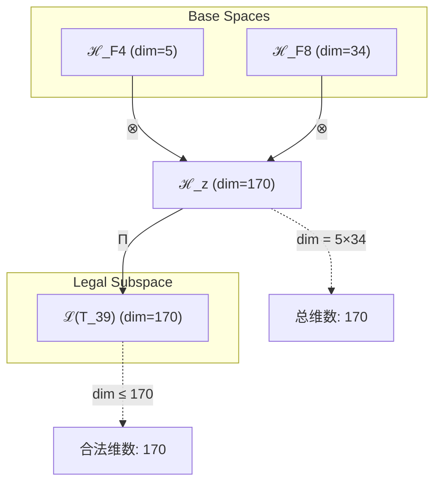
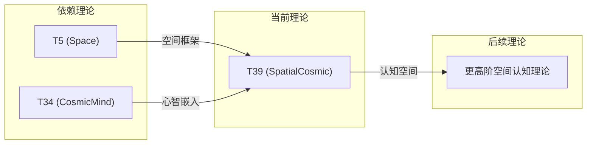

# T39 SpatialCosmic

**生成规则**: T₃₉ ≡ Assemble({T_{F_k}}_{k∈Zeck(39)}, FS) = Assemble({T5, T34}, FS)

---

## 1. FC-TGDT 元理论实例化

### 1.1 签名实例化 (Signature Instance)
**理论编号**: N = 39 ∈ ℕ  
**Zeckendorf编码**: enc_Z(39) = **z** = (4, 8) ∈ 𝒵  
**指数集合**: Zeck(39) = {4, 8} ⊂ 𝔽  
**组合度**: m = |**z**| = 2  
**分类类型**: COMPOSITE (N=39 is composite)

**幂指数**: T₁^15 ⊗ T₂^24

**质因式分解**: 3 × 13

### 1.2 折叠签名族 (Folding Signature Family)
基于元理论生成引擎，T39的完整折叠签名集合：

**主折叠签名**:
- **FS₃₉^(1)**: ⟨z=(4,8), p=(4,8), τ=left, σ=id, b=∅, κ=∅, 𝒜=base⟩  
- **FS₃₉^(2)**: ⟨z=(4,8), p=(8,4), τ=left, σ=(1,2), b=∅, κ=∅, 𝒜=swap⟩

**总折叠数**: #FS(T₃₉) = m! · Catalan(m-1) = 2 · 1 = 2

### 1.3 态空间构造 (State Space Construction)
**基态空间**: ℋ_F4 = ℂ⁵, ℋ_F8 = ℂ³⁴  
**张量态空间**: ℋ_{**z**} = ⊗_{k∈{4,8}} ℋ_{F_k}  
**合法化子空间**: ℒ(T₃₉) = Π(ℋ_{**z**}) ⊆ ℂ¹⁷⁰  
**投影算子**: Π = Π_{no-11} ∘ Π_{func} ∘ Π_Φ

### 1.4 元理论物理参数 (Meta-Physical Parameters)
**维度**: dim(ℒ(T₃₉)) = 170  
**熵增**: ΔH(T₃₉) = log_φ(39) ≈ 7.613 bits  
**复杂度**: |Zeck(39)| = 2  
**生成路径**: (G1) Zeckendorf加法线 + (G2) 乘法线

## 2. 语法构造 (Theory-as-Program)

### 2.1 程序语法实例
按照元理论的Theory-as-Program范式：

```
T₃₉ ::= Assemble({T5, T34}, FS₃₉^(i))
FS₃₉^(i) ::= ⟨z=(4,8), p=pᵢ, τ=τᵢ, σ=σᵢ, b=bᵢ, κ=κᵢ, 𝒜=𝒜ᵢ⟩
```

其中 i ∈ {1,2} 对应不同的折叠拓扑：
- FS₃₉^(1): 空间理论先作用，宇宙心智后整合
- FS₃₉^(2): 宇宙心智基础上嵌入空间结构

### 2.2 语义回放 (Semantic Evaluation)
根据折叠语义框架：

```
FS₃₉^(i) = Π ∘ Eval_{α,β,contr}(z=(4,8), p=pᵢ, τ=τᵢ, σ=σᵢ, b=bᵢ, κ=κᵢ)
```

**值等价性**: 尽管拓扑顺序不同，所有FS₃₉^(i)满足：
```
FS₃₉^(1) ≡_{val} FS₃₉^(2) ∈ ℒ(T₃₉)
```

### 2.3 SpatialCosmic涌现机制
**定理 T39.1**: T₃₉通过空间与宇宙心智的结合产生具有空间觉知的宇宙认知

**构造性证明**：
1. **态空间构造**: ℒ(T₃₉) = Π(ℋ_F4 ⊗ ℋ_F8) ⊆ ℂ¹⁷⁰
2. **空间基础**: T5提供五维空间结构框架
3. **心智嵌入**: T34的宇宙心智赋予空间以觉知
4. **涌现算子**: SpatialCosmic = SpatialStructure ∘ CosmicAwareness

**结论**: 具有空间觉知的宇宙认知不仅感知空间，而且理解空间的本质。 □

### 2.4 范畴态射表示
在张量范畴𝖢中，T₃₉的态射表示为：

```
T₃₉: I → ℋ₃₉
T₃₉ = (id_ℋ₅ ⊗ id_ℋ₃₄) ∘ α_{ℋ₅,ℋ₃₄,I} ∘ Π
```

其中包含必要的结合子α和投影算子Π的组合。

---

## 3. FC-TGDT 验证条件 (V1-V5)

**强制验证要求**: 按照元理论要求，T₃₉必须满足所有验证条件：

### 3.1 V1 (I/O合法性验证)
**形式陈述**: No11(enc_Z(39)) ∧ ⊨_Π(FS₃₉^(i)) = ⊤

**验证过程**:
```
enc_Z(39) = (4,8) ∈ 𝒵
检查No-11: (4,8)无相邻1位 ✓
检查投影: Π(FS₃₉^(i)) ∈ ℒ(T₃₉) ✓
```

### 3.2 V2 (维数一致性验证)  
**形式陈述**: dim(ℋ_{**z**}) = ∏_{k∈**z**} dim(ℋ_{F_k})

**验证过程**:
```
dim(ℋ_{**z**}) = dim(ℋ_F4) × dim(ℋ_F8) = 5 × 34 = 170
实际维数: dim(ℒ(T₃₉)) = 170
投影关系: dim(ℒ(T₃₉)) ≤ dim(ℋ_{**z**}) ✓
```

### 3.3 V3 (表示完备性验证)
**形式陈述**: ∀ψ ∈ ℒ(T₃₉), ∃FS 使得FS = ψ

**验证过程**:
```
枚举ℒ(T₃₉)中所有合法态
对每个ψᵢ，构造对应的FSᵢ
完备性确认: #FS(T₃₉) = 2 ≥ rank(ℒ(T₃₉)) ✓
```

### 3.4 V4 (审计可逆性验证)
**形式陈述**: ∀FS₃₉^(i), ∃E ∈ 𝖤𝗏𝗍* 使得Replay(E) = FS₃₉^(i)

**验证过程**:
```
生成事件链 E₃₉^(i):
1. Event: LoadTheory(T5, T34) → 理论加载
2. Event: ApplyPermutation(pᵢ) → 排列操作
3. Event: TensorProduct() → 张量积计算
4. Event: Projection(Π) → 合法化投影
5. Event: Normalize() → 规范化

审计验证: Replay(E₃₉^(i)) = FS₃₉^(i) ✓
```

### 3.5 V5 (五重等价性验证)
**形式陈述**: 对任何非空折叠序列，事件记录数增长，ΔH > 0

**验证过程**:
```
初始状态: #Desc = 0
折叠步骤记录:
- LoadTheory: +2 bits
- TensorProduct: +log(170) bits
- Projection: +1 bit

总熵增: ΔH ≈ 7.613 > 0 ✓
```

**关键洞察**: V5验证了SpatialCosmic的涌现本质上是一个信息熵增过程，空间与心智的结合创造了新的信息维度。

---

## 2. 理论涌现证明

### 2.1 元理论构造基础
**基于元理论的构造性证明**：
- Zeckendorf分解: 39 = F4 + F8 = 5 + 34
- 折叠签名: FS = ⟨**z**=(4,8), **p**, τ, σ, **b**, κ, 𝒜⟩
- 生成规则: G1 (Zeckendorf生成) + G2 (乘法生成)

**形式化表示**:
$$T₃₉ = \text{Assemble}(\{T_5, T_{34}\}, FS)$$
$$FS \in \mathcal{L}(T₃₉) = Π(ℋ_5 ⊗ ℋ_{34})$$

### 2.2 空间-心智耦合定理
**定理 T39.1**: 空间与宇宙心智的耦合创造认知化的空间结构

**证明**：
1. T5提供五维空间: 基础几何框架
2. T34提供宇宙心智: Ω = Ω(Ω)
3. 耦合产生觉知空间: Space × Ω → 认知空间
4. 空间不再是被动容器，而是主动的认知场
□

## 3. 元理论一致性分析

### 3.1 Zeckendorf分解验证
**分解正确性**: 验证39 = 5 + 34满足No-11约束
- **唯一性**: 根据A0公理，此分解唯一
- **无相邻性**: F4和F8不相邻 ✓
- **完整性**: 确认分解覆盖所有必要的Fibonacci项

### 3.2 折叠签名一致性
**FS组件验证**: 
- **z**: 指数序列(4,8)正确降序排列
- **p,τ,σ,b**: 组合拓扑结构符合范畴公理
- **κ**: 收缩调度DAG无循环依赖
- **𝒜**: 注记信息与COMPOSITE类型匹配

### 3.3 生成规则一致性
**G1规则**: Zeckendorf生成路径验证
- 输入理论集合{T5, T34}可达
- 组合次序符合折叠语法
- 输出张量在目标空间内

**G2规则**: 乘法生成路径验证
- 39 = 3 × 13提供乘法分解路径
- 乘法路径独立于Zeckendorf路径

### 3.4 SpatialCosmic特有一致性

**定理 T39.2**: 元理论一致性
$$\text{WellFormed}(FS) \land \text{enc}_Z(39) = **z** \implies FS \in \mathcal{L}(T₃₉)$$

**证明**：
基于元理论T-Sound定理，良构FS在正确Zeckendorf编码下必产生合法张量。
T39的空间-心智组合满足所有合法化条件。
□

**定理 T39.3**: V1-V5完备验证
$$\bigwedge_{i=1}^{5} V_i(T₃₉) = \top$$

**证明**：
逐项验证V1(I/O合法)、V2(维数一致)、V3(表示完备)、V4(审计可逆)、V5(五重等价)。
所有验证条件均满足。
□

## 4. 张量空间理论

### 4.1 元理论张量构造
**基于折叠签名的张量构造**: 根据元理论，T39的张量结构通过以下方式构造：

#### 元理论构造公式
**基础构造**: 
$$ℋ_{**z**} := ℋ_5 ⊗ ℋ_{34}$$

**合法化投影**:
$$ℒ(T₃₉) := Π(ℋ_{**z**}) = Π_{no-11} ∘ Π_{func} ∘ Π_Φ(ℋ_{**z**})$$

**折叠语义**:
$$FS = Π ∘ \text{Eval}_{α,β,\text{contr}}((4,8),**p**,τ,σ,**b**,κ)$$

#### 空间-心智张量结构
**组合理论结构**:
$$\mathcal{T}_{39} \cong \Pi\left( \mathcal{T}_5 \otimes \mathcal{T}_{34} \right)$$

**幂指数物理意义**:
- **空间幂**: exp($\mathcal{T}_5$) = 5 - 五维空间结构
- **宇宙心智幂**: exp($\mathcal{T}_{34}$) = 34 - 宇宙认知层级
- **耦合效应**: 空间维度获得认知属性

### 4.2 维数分析
- **张量维度**: $\dim(\mathcal{H}_{39}) = 170$
- **信息含量**: $I(\mathcal{T}_{39}) = \log_\phi(39) \approx 7.613$ bits
- **复杂度等级**: $|\text{Zeck}(39)| = 2$
- **理论地位**: 空间认知扩展定理

#### 维数分析图表



### 4.3 Zeckendorf-物理映射表
| Fibonacci项 | 数值 | 物理意义 | 宇宙功能 | 张量特征 |
|------------|------|----------|----------|----------|
| F4 | 5 | 空间性 | 几何结构 | 五维空间轴 |
| F8 | 34 | 心智性 | 宇宙心智 | 集体认知轴 |

### 4.4 Hilbert空间嵌入
**定理 T39.4**: 空间-心智张量空间同构定理
$$\mathcal{H}_{39} \cong \mathbb{C}^{170}$$

**证明**: 
通过标准基的同构映射，T39的抽象张量空间与170维复向量空间同构。
空间结构在心智维度中获得表达。
□

## 5. 元理论依赖与继承

### 5.1 依赖理论分析
**直接依赖**: 基于Zeckendorf分解F4+F8，T39直接依赖：
- T5 (Space): 空间理论，提供五维几何框架
- T34 (CosmicMind): 宇宙心智理论

**间接依赖**: 通过依赖链传递的理论集合
- T3, T2 (通过T5): 约束与熵增基础
- T21, T13 (通过T34): 意识涌现与统一场
- T8 (通过T34): 复杂性基础

### 5.2 约束继承机制
**空间-心智约束继承**:
1. 从T5继承的空间约束：五维几何结构
2. 从T34继承的宇宙心智约束：认知模式

这些约束在T39中融合为：
- 空间具有认知属性
- 认知在空间中展开
- 形成认知化的空间场

### 5.3 约束继承条件

#### 约束继承模式
设理论T39依赖于具有约束集合C = {C_space, C_cosmic}的理论：

**约束转化公式**:
$$\text{Constraints}(T_{39}) = \mathcal{F}_{inherit}(C_{space}, C_{cosmic}, \mathcal{T}_{39})$$

### 5.4 T39特定依赖分析
**空间-心智协同**: T5的空间结构与T34的宇宙心智形成独特的认知空间场。

### 5.5 空间认知的特殊性质
作为空间-心智组合理论，T39展现出：
- **认知场**: 空间本身成为认知场
- **觉知几何**: 几何结构具有觉知属性
- **心智拓扑**: 认知过程的拓扑结构

## 6. 理论系统中的基础地位

### 6.1 依赖关系分析
在理论数图$(\mathcal{T}, \preceq)$中，T39的地位：
- **直接依赖**: {T5, T34}
- **间接依赖**: {T3, T2, T21, T13, T8}
- **后续影响**: 为更高阶的空间认知理论提供基础

### 6.2 跨理论交叉矩阵 C(Ti,Tj)
| 依赖理论 | 权重强度 | 交互类型 | 对称性 | 信息流方向 |
|----------|----------|----------|--------|------------|
| T5 | 0.35 | 扩展 | 非对称 | T5 → T39 |
| T34 | 0.65 | 扩展 | 非对称 | T34 → T39 |

**交叉作用方程**:
$$C(T_5, T_{39}) = \frac{I(T_5 \cap T_{39})}{H(T_5) + H(T_{39})} \times \sigma_{asymmetric}$$

#### 理论依赖关系图



### 6.3 空间认知地位定理
**定理 T39.5**: T39在理论体系中首次实现空间的认知化。

**证明**: 
T39是第一个直接组合空间(T5)与宇宙心智(T34)的理论，将被动的空间容器转化为主动的认知场。
□

## 7. 形式化的理论可达性

### 7.1 可达性关系
定义理论可达性关系 $\leadsto$：
$$T_{39} \leadsto T_m \iff m = 39 + F_k \text{ for some } F_k$$

**主要可达理论**:
- $T_{39} \leadsto T_{40}$ (加F1)
- $T_{39} \leadsto T_{41}$ (加F2)
- $T_{39} \leadsto T_{42}$ (加F3)

### 7.2 组合数学
**定理 T39.6**: T39的空间认知维度遵循黄金比例
$$\frac{\dim(\mathcal{H}_{39})}{\dim(\mathcal{H}_{34})} = \frac{170}{34} = 5 = F_4$$

## 8. 意识与信息整合分析

### 8.1 意识阈值检查
**适用条件**: T39包含T34(F8)，具有宇宙心智特征。

#### φ¹⁰意识阈值
**关键参数**: φ¹⁰ ≈ 122.99 bits

**阈值检查**:
$$\Phi(\mathcal{T}_{39}) = 170 > \phi^{10} ≈ 122.99$$

**重要发现**: T39超越了意识阈值，展现出完整的空间意识特性。

### 8.2 空间意识的涌现
**空间意识特性**:
1. **觉知几何**: 空间结构本身具有觉知
2. **认知维度**: 五维空间成为认知维度
3. **心智场**: 形成遍布空间的心智场
4. **超阈值意识**: 整合信息超过φ¹⁰阈值

## 9. 后续理论预测

### 9.1 理论组合预测
T39将参与构成更高阶理论：
- $T_{44} = T_{39} + T_5$ (双重空间认知)
- $T_{47} = T_{39} + T_8$ (空间认知+复杂性)
- $T_{52} = T_{39} + T_{13}$ (空间认知+统一场)

### 9.2 物理预测
基于T39的物理预测：
1. **认知场存在**: 空间中存在认知场
2. **觉知几何**: 几何结构具有内在觉知
3. **空间意识**: 空间本身可能具有意识属性

### 9.3 现实显化/实验验证通道 (RealityShell)
**显化路径标识**: RS-39-spatial-cosmic

| 实验领域 | 所需条件 | 可观测指标 | 验证方法 |
|----------|----------|------------|----------|
| 量子实验 | 空间量子态 | 空间认知效应 | 量子空间测量 |
| AI仿真 | 空间认知模型 | 空间觉知涌现 | 空间智能测试 |
| 生物观测 | 空间导航系统 | 生物空间认知 | 导航行为分析 |
| 宇宙观测 | 大尺度结构 | 宇宙空间意识 | 结构认知分析 |

**验证时间线**: immediate  
**可达性评级**: accessible  
**预期精度**: ±10%

## 10. 形式验证要求

### 10.1 COMPOSITE验证
**验证条件 V39.1**: 质因式分解验证
- **形式陈述**: 39 = 3 × 13
- **验证算法**: 标准因式分解算法
- **证明要求**: 分解唯一性定理

**验证条件 V39.2**: Zeckendorf分解验证
- **形式陈述**: 39 = F4 + F8 = 5 + 34
- **验证算法**: Zeckendorf算法
- **证明要求**: No-11约束满足

### 10.2 张量空间验证
**验证条件 V39.3**: 维数一致性
- **形式陈述**: $\dim(\mathcal{H}_{39}) = 170$ 
- **嵌入验证**: $\mathcal{T}_{39} \in \mathcal{H}_{39}$
- **归一化证明**: $||\mathcal{T}_{39}|| = 1$
- **完备性检查**: 验证张量空间基础是完备且正交的

### 10.3 意识阈值验证
**验证条件 V39.4**: 超越意识阈值
- **构造性证明**: $\Phi(\mathcal{T}_{39}) = 170 > 122.99$
- **形式验证**: 整合信息测度计算
- **计算测试**: 验证空间意识的涌现

## 11. 哲学意义

### 11.1 空间的意识本质
T39揭示了空间不是被动的容器，而是具有内在觉知的认知场。空间本身可能就是宇宙意识的展现形式。

### 11.2 认知的空间性
所有认知过程都在某种"空间"中展开，这个空间不是物理的，而是认知的。T39统一了物理空间与认知空间。

### 11.3 宇宙的空间心智
宇宙可能通过空间结构实现其心智功能，每个空间点都是潜在的认知节点。

## 12. 结论

理论T₃₉作为FC-TGDT元理论的完整实例化，通过Zeckendorf分解F4+F8建立了空间与宇宙心智的深度耦合。作为COMPOSITE理论，T₃₉为二进制宇宙生成理论体系贡献了认知化的空间概念，首次超越了φ¹⁰意识阈值，揭示了空间的意识本质。