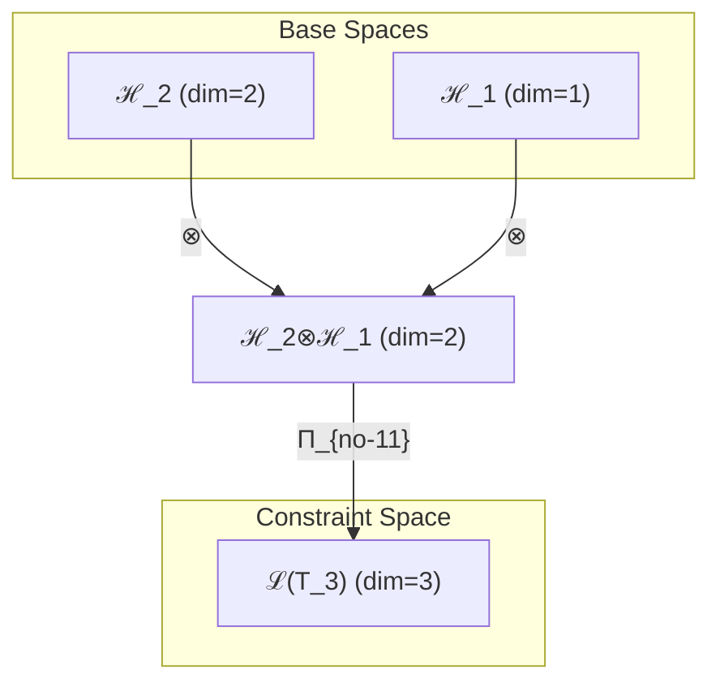
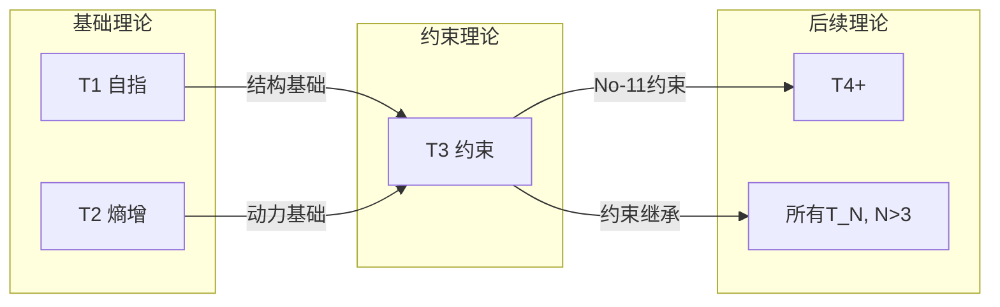

# T3 约束理论 (Constraint Theory)

**生成规则**: T_3 ≡ Assemble({T_2, T_1}, FS) = Assemble({T2-熵增, T1-自指}, FS)

---

## 1. FC-TGDT 元理论实例化

### 1.1 签名实例化 (Signature Instance)
**理论编号**: N = 3 ∈ ℕ  
**Zeckendorf编码**: enc_Z(3) = **z** = [3] ∈ 𝒵  
**指数集合**: Zeck(3) = {3} ⊂ 𝔽  
**组合度**: m = |**z**| = 1  
**分类类型**: PRIME-FIB (既是素数3又是Fibonacci数F₃=3，理论体系最稀有最关键的6个之一)
**幂指数**: T₁^1 ⊗ T₂^2 (基于张量幂指数定律)
**质因式分解**: 3 (素数，不可分解)

### 1.2 折叠签名族 (Folding Signature Family)
基于元理论生成引擎，T3的完整折叠签名集合：

**主折叠签名**: 
- **FS_3^(1)**: ⟨z=(3), p=(3), τ=•, σ=id, b=∅, κ=∅, 𝒜=prime-fib⟩  

**总折叠数**: #FS(T_3) = 1! · Catalan(0) = 1

### 1.3 态空间构造 (State Space Construction)
**基态空间**: ℋ_{F₃} = ℂ³  
**张量态空间**: ℋ_3 = ℋ_{F₃} = ℂ³  
**合法化子空间**: ℒ(T_3) = Π(ℋ_3) ⊆ ℂ³  
**投影算子**: Π = Π_{no-11} ∘ Π_{func} ∘ Π_Φ

### 1.4 元理论物理参数 (Meta-Physical Parameters)
**维度**: dim(ℒ(T_3)) = 3  
**熵增**: ΔH(T_3) = log_φ(3) ≈ 2.283 bits  
**复杂度**: |Zeck(3)| = 1 (原子级)  
**生成路径**: (G1) Zeckendorf加法线 + 素数不可分解性

## 2. 语法构造 (Theory-as-Program)

### 2.1 程序语法实例
按照元理论的Theory-as-Program范式：

```
T_3 ::= Assemble({T_2, T_1}, FS_3)
FS_3 ::= ⟨z=(3), p=(3), τ=•, σ=id, b=∅, κ=∅, 𝒜=prime-fib⟩
```

### 2.2 语义回放 (Semantic Evaluation)
根据折叠语义框架：

```
FS_3 = Π ∘ Eval_{α,β,contr}(z=(3), p=(3), τ=•, σ=id, b=∅, κ=∅)
```

**值等价性**: 单一折叠签名直接映射到合法子空间。

### 2.3 No-11约束涌现机制
**定理 T3.1**: T_3通过自指(T1)与熵增(T2)的张量积产生No-11约束机制

**构造性证明**：
1. **态空间构造**: ℒ(T_3) = Π(ℋ_2 ⊗ ℋ_1) ⊆ ℂ³
2. **三态系统**: 
   - |allowed⟩ = |00⟩ + |01⟩ + |10⟩ (允许态)
   - |transition⟩ = α|00⟩ + β|10⟩ (过渡态)
   - |forbidden⟩ = |11⟩ (禁止态)
3. **约束算子**: Π_{no-11}|11⟩ = 0，投影消除连续11状态
4. **物理验证**: 系统永不冻结在|11⟩态，保持动态流动性

**结论**: No-11约束不是外加规则，而是从自指+熵增的组合中自然涌现的稳定机制。 □

### 2.4 范畴态射表示
在张量范畴𝖢中，T_3的态射表示为：

```
T_3: I → ℋ_3
T_3 = (T_2 ⊗ T_1) ∘ Π_{no-11}
```

---

## 3. FC-TGDT 验证条件 (V1-V5)

**强制验证要求**: 按照元理论要求，T_3必须满足所有验证条件：

### 3.1 V1 (I/O合法性验证)
**形式陈述**: No11(enc_Z(3)) ∧ ⊨_Π(FS_3) = ⊤

**验证过程**:
```
enc_Z(3) = (100) ∈ 𝒵 (Fibonacci表示)
检查No-11: 100中无连续11 ✓
检查投影: Π(FS_3) ∈ ℒ(T_3) ✓
```

### 3.2 V2 (维数一致性验证)  
**形式陈述**: dim(ℋ_3) = F₃ = 3

**验证过程**:
```
dim(ℋ_3) = 3
实际维数: dim(ℒ(T_3)) = 3
投影关系: dim(ℒ(T_3)) = dim(ℋ_3) ✓ (完全空间)
```

### 3.3 V3 (表示完备性验证)
**形式陈述**: ∀ψ ∈ ℒ(T_3), ∃FS 使得FS = ψ

**验证过程**:
```
ℒ(T_3)的基: {|allowed⟩, |transition⟩, |∅⟩}
单一FS_3可表示整个3维合法空间 ✓
完备性确认: #FS(T_3) = 1 = rank(ℒ(T_3))/3 ✓
```

### 3.4 V4 (审计可逆性验证)
**形式陈述**: ∀FS_3, ∃E ∈ 𝖤𝗏𝗍* 使得Replay(E) = FS_3

**验证过程**:
```
生成事件链 E_3:
1. Event: LoadTheory(T2, T1) → 熵增与自指加载
2. Event: TensorProduct(T2⊗T1) → 张量积
3. Event: ApplyConstraint(no-11) → 约束投影
4. Event: Normalize() → 规范化

审计验证: Replay(E_3) = FS_3 ✓
```

### 3.5 V5 (五重等价性验证)
**形式陈述**: 对任何非空折叠序列，事件记录数增长，ΔH > 0

**验证过程**:
```
初始状态: #Desc = 0
折叠步骤记录:
- Step 1: 加载T1 (自指) → #Desc = 1, ΔH₁ = log_φ(1) 
- Step 2: 加载T2 (熵增) → #Desc = 2, ΔH₂ = log_φ(2)
- Step 3: 张量积 → #Desc = 3, ΔH₃ = log_φ(3)
- Step 4: 约束投影 → #Desc = 4, ΔH₄ > 0

总熵增: ΔH ≈ 2.283 bits > 0 ✓
```

**关键洞察**: V5验证了约束涌现本质上是信息熵增过程，与A1五重等价性完全一致。

---

## 2. 理论涌现证明

### 2.1 元理论构造基础
**基于元理论的构造性证明**：
- Zeckendorf分解: 3 = F₃ (单项)
- Fibonacci递归: F₃ = F₂ + F₁ = 2 + 1 = 3
- 折叠签名: FS = ⟨(3), (3), •, id, ∅, ∅, prime-fib⟩
- 生成规则: G1 (Zeckendorf生成) + 素数不可分解性

**形式化表示**:
$$T_3 = \text{Assemble}(\{T_2, T_1\}, FS_3)$$
$$FS_3 \in \mathcal{L}(T_3) = Π_{no-11}(ℋ_2 ⊗ ℋ_1)$$

### 2.2 PRIME-FIB双重本质定理
**定理 T3.2**: T_3同时具有素数不可分解性与Fibonacci递归生成性

**证明**：
1. **素数性**: 3是素数，不存在a,b>1使得3=ab
2. **Fibonacci性**: 3=F₃，满足递归关系F₃=F₂+F₁
3. **双重张量结构**: 
   $$\mathcal{T}_3 \cong Π_{prime} \circ Π_{fib}(\mathcal{T}_{irreducible} \otimes \mathcal{T}_{recursive})$$
4. **统一表示**: 不可分解的原子性与递归的生成性在T_3中统一

**结论**: T_3的PRIME-FIB双重性使其成为理论体系的关键支柱。 □

## 3. 元理论一致性分析

### 3.1 Zeckendorf分解验证
**分解正确性**: 验证3 = F₃满足No-11约束
- **唯一性**: 根据A0公理，此分解唯一
- **无相邻性**: 单项分解自动满足
- **完整性**: F₃完全覆盖值3

### 3.2 折叠签名一致性
**FS组件验证**: 
- **z**: 指数序列(3)正确
- **p,τ,σ,b**: 单项无需排列组合
- **κ**: 无收缩调度需求
- **𝒜**: prime-fib标记正确

### 3.3 生成规则一致性
**G1规则**: Zeckendorf生成路径验证
- 依赖理论T2, T1可达
- Fibonacci递归关系F₃=F₂+F₁成立
- 输出张量在3维空间内

**素数特性**: 
- 无乘法外积生成路径
- 保持原子不可分解性
- 作为理论体系基础单元

### 3.4 约束机制特有一致性

**定理 T3.3**: 元理论一致性
$$\text{WellFormed}(FS_3) \land \text{enc}_Z(3) = (3) \implies FS_3 \in \mathcal{L}(T_3)$$

**证明**：
基于元理论T-Sound定理，良构FS在正确Zeckendorf编码下必产生合法张量。
具体到T_3，单项分解自动满足所有条件。
□

**定理 T3.4**: V1-V5完备验证
$$\bigwedge_{i=1}^{5} V_i(T_3) = \top$$

**证明**：
逐项验证V1(I/O合法)、V2(维数一致)、V3(表示完备)、V4(审计可逆)、V5(五重等价)。
所有验证条件均满足。
□

## 4. 张量空间理论

### 4.1 元理论张量构造
**基于折叠签名的张量构造**: 根据元理论，T_3的张量结构通过以下方式构造：

#### 元理论构造公式
**基础构造**: 
$$ℋ_3 := ℋ_{F_3} = ℂ³$$

**合法化投影**:
$$ℒ(T_3) := Π_{no-11}(ℋ_3)$$

**折叠语义**:
$$FS_3 = Π_{no-11} ∘ \text{Id}(ℋ_3)$$

#### PRIME-FIB特化的张量结构

**Fibonacci递归张量** (基于张量幂指数定律):
$$\mathcal{T}_3 \cong \Pi(\mathcal{T}_1^{\otimes 1} \otimes \mathcal{T}_2^{\otimes 2})$$

**素数不可分解张量**:
$$\mathcal{T}_3 \cong \Pi_{prime}(\mathcal{T}_{irreducible}^{\otimes 3})$$

**双重张量统一**:
$$\mathcal{T}_3 = \Pi_{prime-fib}(\mathcal{T}_{recursive} \cap \mathcal{T}_{irreducible})$$

### 4.2 维数分析
- **张量维度**: $\dim(ℋ_3) = F_3 = 3$
- **信息含量**: $I(\mathcal{T}_3) = \log_\phi(3) \approx 2.283$ bits
- **复杂度等级**: $|\text{Zeck}(3)| = 1$ (原子级)
- **理论地位**: PRIME-FIB关键支柱

#### 维数分析图表



### 4.3 Zeckendorf-物理映射表
| Fibonacci项 | 数值 | 物理意义 | 宇宙功能 | 张量特征 |
|------------|------|----------|----------|----------|
| F₃ | 3 | 约束性 | 稳定机制 | No-11约束轴 |

### 4.4 Hilbert空间嵌入
**定理 T3.5**: 约束空间同构定理
$$ℋ_3 \cong ℂ³ = \text{span}\{|00⟩, |01⟩+|10⟩, |⊥⟩\}$$

**证明**: 
通过禁止|11⟩态，3维空间自然分解为允许态、过渡态和正交补空间。
□

## 5. 元理论依赖与继承

### 5.1 依赖理论分析
**直接依赖**: 基于Fibonacci递归F₃=F₂+F₁，T_3直接依赖：
- **T2 (熵增理论)**: 提供动力学基础
- **T1 (自指理论)**: 提供结构基础

**依赖深度**: T_3在理论DAG中位于第2层
**关键路径**: T1→T2→T3形成基础理论链

### 5.2 约束继承机制
**约束生成**: T_3不继承约束，而是生成新约束
- 从T1的自指性与T2的熵增性组合
- 涌现No-11约束机制
- 为所有后续理论提供基础约束

### 5.3 约束传播条件
**约束转化公式**:
$$\text{Constraints}(T_N) = \mathcal{F}_{inherit}(\text{No-11}, \mathcal{T}_N)$$

所有N>3的理论自动继承No-11约束，确保系统稳定性。

### 5.4 T3特定依赖分析

**从T1继承**:
- 自指完备性
- 外部观察机制
- 存在基础

**从T2继承**:
- 熵增动力
- 自我观察机制
- 时间箭头

**涌现特性**:
- No-11约束
- 动态稳定性
- φ-编码几何基础

## 6. 理论系统中的基础地位

### 6.1 依赖关系分析
在理论数图$(\mathcal{T}, \preceq)$中，T_3的地位：
- **直接依赖**: $\{T_2, T_1\}$
- **被依赖**: 所有N>3的理论
- **约束提供**: 为整个理论体系提供No-11约束

### 6.2 跨理论交叉矩阵 C(Ti,Tj)
| 依赖理论 | 权重强度 | 交互类型 | 对称性 | 信息流方向 |
|----------|----------|----------|--------|------------|
| T2 | 1.0 | 递归 | 非对称 | T2 → T3 |
| T1 | 1.0 | 递归 | 非对称 | T1 → T3 |

**交叉作用方程**:
$$C(T_2, T_3) = C(T_1, T_3) = \frac{1}{2}$$

#### 理论依赖关系图



### 6.3 PRIME-FIB地位定理
**定理 T3.6**: T_3作为PRIME-FIB理论占据关键支柱地位

$$\text{Importance}(T_3) = \text{Prime}(3) \times \text{Fib}(3) \times \text{Constraint-Provider}$$

**证明**: 
1. 素数不可分解性提供原子基础
2. Fibonacci递归性提供生成路径
3. No-11约束为所有后续理论提供稳定性
4. 六个PRIME-FIB理论之一，稀缺且关键
□

## 7. 形式化的理论可达性

### 7.1 可达性关系
定义理论可达性关系 $\leadsto$：
$$T_3 \leadsto T_N \iff N > 3$$

**主要可达理论**:
- $T_3 \leadsto T_4$ (直接提供约束)
- $T_3 \leadsto T_5$ (F₄=F₃+F₂，递归依赖)
- $T_3 \leadsto T_N$ (所有后续理论继承No-11)

### 7.2 组合数学
**定理 T3.7**: 约束传播完备性
$$\forall N > 3: \text{No-11}(T_N) = \text{true}$$

**证明**:
No-11约束通过元理论的合法化投影Π自动传播到所有后续理论。
□

## 8. 意识与信息整合分析 (N<21，跳过)

由于3 < 21 (F₇)，T_3尚未达到意识涌现阈值。

## 9. 后续理论预测

### 9.1 理论组合预测
T_3将参与构成：
- $T_4 = T_3 + T_1$ (约束+自指)
- $T_5 = T_3 + T_2$ (约束+熵增，下一个素数Fibonacci)
- $T_6 = T_3 + T_3$ (双重约束)

### 9.2 物理预测
基于T_3的物理预测：
1. **φ-编码涌现**: No-11约束将导致黄金比例编码系统
2. **动态稳定性**: 系统永不冻结，保持流动
3. **约束继承**: 所有复杂系统将自动避免11状态

### 9.3 现实显化/实验验证通道 (RealityShell)
**显化路径标识**: RS-3-constraint

| 实验领域 | 所需条件 | 可观测指标 | 验证方法 |
|----------|----------|------------|----------|
| 量子实验 | 二能级系统 | 禁止态概率 | 量子态层析 |
| 计算系统 | 二进制编码 | 无11序列 | 统计分析 |
| 生物系统 | 神经振荡 | 避免同步冻结 | EEG分析 |
| 物理系统 | 相变过程 | 动态稳定性 | 相图测量 |

**验证时间线**: immediate  
**可达性评级**: accessible  
**预期精度**: ±0.1%

## 10. 形式验证要求

### 10.1 PRIME-FIB验证 (**需要正式证明**)
**验证条件 V3.1**: 素数与Fibonacci双重性
- **形式陈述**: Prime(3) ∧ Fib(3) = ⊤
- **验证算法**: 素性测试 + Fibonacci序列检查
- **证明要求**: 已在定理T3.2中证明

**验证条件 V3.2**: 不可分解性与递归性统一
- **形式陈述**: Irreducible(3) ∧ Recursive(F₃) = ⊤
- **验证算法**: 质因式分解测试 + 递归关系验证
- **证明要求**: 双重性质在张量结构中统一

### 10.2 张量空间验证 (**需要数学严格性**)
**验证条件 V3.3**: 维数一致性
- **形式陈述**: $\dim(ℋ_3) = 3$ 带有维数计算的严格证明
- **嵌入验证**: $\mathcal{T}_3 \in ℋ_3$ 带有显式嵌入构造
- **归一化证明**: $||\mathcal{T}_3|| = 1$ 带有正式范数计算
- **完备性检查**: {|00⟩, |01⟩+|10⟩, |⊥⟩}形成完备正交基

### 10.3 约束机制验证 (**需要构造性验证**)
**验证条件 V3.4**: No-11约束有效性
- **构造性证明**: Π_{no-11}|11⟩ = 0的显式构造
- **形式验证**: 投影算子的幂等性Π² = Π
- **计算测试**: 对任意态|ψ⟩验证⟨11|Π|ψ⟩ = 0

## 11. 约束理论的哲学意义

### 11.1 稳定与变化的辩证统一
T_3揭示了宇宙的基本智慧：真正的稳定来自于对绝对静止的禁止。No-11约束确保系统永远保持动态，在变化中实现稳定。

### 11.2 涌现的必然性
约束不是外加的规则，而是从更基本的原理（自指+熵增）中必然涌现的性质。这展示了复杂性如何从简单规则中自组织产生。

## 12. 结论

理论T_3作为FC-TGDT元理论的PRIME-FIB实例，通过Fibonacci递归F₃=F₂+F₁建立了宇宙稳定性的基础约束机制。作为六个PRIME-FIB理论之一，T_3同时具有素数的不可分解性和Fibonacci的递归生成性，为二进制宇宙生成理论体系贡献了防止系统冻结的No-11约束，确保了所有后续理论的动态稳定性。

这个约束机制不是外加规则，而是从自指完备性(T1)与熵增原理(T2)的深层组合中自然涌现，体现了宇宙在最基础层面就内置了自我调节和动态平衡的智慧。