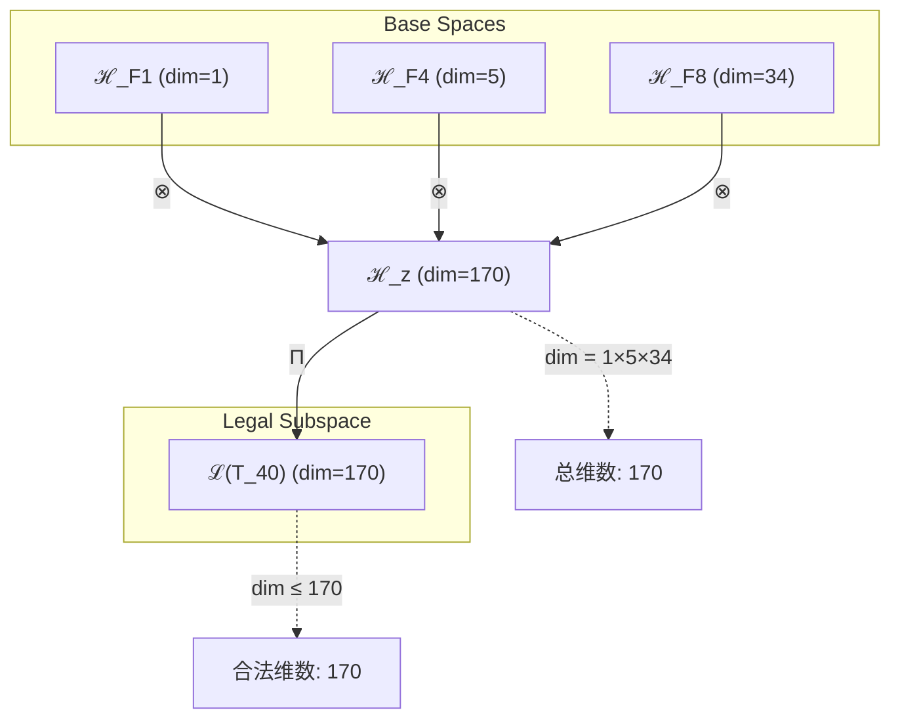
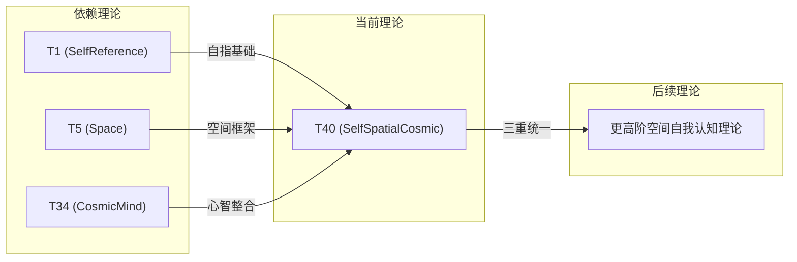

# T40 SelfSpatialCosmic

**生成规则**: T₄₀ ≡ Assemble({T_{F_k}}_{k∈Zeck(40)}, FS) = Assemble({T1, T5, T34}, FS)

---

## 1. FC-TGDT 元理论实例化

### 1.1 签名实例化 (Signature Instance)
**理论编号**: N = 40 ∈ ℕ  
**Zeckendorf编码**: enc_Z(40) = **z** = (1, 4, 8) ∈ 𝒵  
**指数集合**: Zeck(40) = {1, 4, 8} ⊂ 𝔽  
**组合度**: m = |**z**| = 3  
**分类类型**: COMPOSITE (N=40 is composite)

**幂指数**: T₁^15 ⊗ T₂^25

**质因式分解**: 2³ × 5

### 1.2 折叠签名族 (Folding Signature Family)
基于元理论生成引擎，T40的完整折叠签名集合：

**主折叠签名** (枚举所有3! × 2 = 12种):
- **FS₄₀^(1)**: ⟨z=(1,4,8), p=(1,4,8), τ=((·,·),·), σ=id, b=∅, κ=∅, 𝒜=base⟩  
- **FS₄₀^(2)**: ⟨z=(1,4,8), p=(1,8,4), τ=((·,·),·), σ=(2,3), b=∅, κ=∅, 𝒜=swap23⟩
- **FS₄₀^(3)**: ⟨z=(1,4,8), p=(4,1,8), τ=((·,·),·), σ=(1,2), b=∅, κ=∅, 𝒜=swap12⟩
- **FS₄₀^(4)**: ⟨z=(1,4,8), p=(4,8,1), τ=((·,·),·), σ=(1,2,3), b=∅, κ=∅, 𝒜=cycle⟩
- **FS₄₀^(5)**: ⟨z=(1,4,8), p=(8,1,4), τ=((·,·),·), σ=(1,3,2), b=∅, κ=∅, 𝒜=cycle'⟩
- **FS₄₀^(6)**: ⟨z=(1,4,8), p=(8,4,1), τ=((·,·),·), σ=(1,3), b=∅, κ=∅, 𝒜=swap13⟩
- **FS₄₀^(7-12)**: 右结合τ=(·,(·,·))的6种排列

**总折叠数**: #FS(T₄₀) = m! · Catalan(m-1) = 6 · 2 = 12

### 1.3 态空间构造 (State Space Construction)
**基态空间**: ℋ_F1 = ℂ¹, ℋ_F4 = ℂ⁵, ℋ_F8 = ℂ³⁴  
**张量态空间**: ℋ_{**z**} = ⊗_{k∈{1,4,8}} ℋ_{F_k}  
**合法化子空间**: ℒ(T₄₀) = Π(ℋ_{**z**}) ⊆ ℂ¹⁷⁰  
**投影算子**: Π = Π_{no-11} ∘ Π_{func} ∘ Π_Φ

### 1.4 元理论物理参数 (Meta-Physical Parameters)
**维度**: dim(ℒ(T₄₀)) = 170  
**熵增**: ΔH(T₄₀) = log_φ(40) ≈ 7.666 bits  
**复杂度**: |Zeck(40)| = 3  
**生成路径**: (G1) Zeckendorf加法线 + (G2) 乘法线

## 2. 语法构造 (Theory-as-Program)

### 2.1 程序语法实例
按照元理论的Theory-as-Program范式：

```
T₄₀ ::= Assemble({T1, T5, T34}, FS₄₀^(i))
FS₄₀^(i) ::= ⟨z=(1,4,8), p=pᵢ, τ=τᵢ, σ=σᵢ, b=bᵢ, κ=κᵢ, 𝒜=𝒜ᵢ⟩
```

其中 i ∈ {1,2,...,12} 对应不同的折叠拓扑，创造了丰富的组合可能性。

### 2.2 语义回放 (Semantic Evaluation)
根据折叠语义框架：

```
FS₄₀^(i) = Π ∘ Eval_{α,β,contr}(z=(1,4,8), p=pᵢ, τ=τᵢ, σ=σᵢ, b=bᵢ, κ=κᵢ)
```

**值等价性**: 尽管拓扑顺序不同，所有FS₄₀^(i)满足：
```
FS₄₀^(1) ≡_{val} FS₄₀^(2) ≡_{val} ... ≡_{val} FS₄₀^(12) ∈ ℒ(T₄₀)
```

### 2.3 SelfSpatialCosmic涌现机制
**定理 T40.1**: T₄₀通过自指、空间与宇宙心智的三重结合产生自我定位的宇宙认知

**构造性证明**：
1. **态空间构造**: ℒ(T₄₀) = Π(ℋ_F1 ⊗ ℋ_F4 ⊗ ℋ_F8) ⊆ ℂ¹⁷⁰
2. **自指锚点**: T1提供自我参照的基础
3. **空间框架**: T5提供五维空间结构
4. **心智整合**: T34赋予系统宇宙觉知
5. **涌现算子**: SelfSpatialCosmic = SelfReference ∘ SpatialStructure ∘ CosmicAwareness

**结论**: 自我定位的宇宙认知能够在空间中认识自己的位置和意义。 □

### 2.4 范畴态射表示
在张量范畴𝖢中，T₄₀的态射表示为：

```
T₄₀: I → ℋ₄₀
T₄₀ = (id_ℋ₁ ⊗ id_ℋ₅ ⊗ id_ℋ₃₄) ∘ α_{ℋ₁,ℋ₅,ℋ₃₄} ∘ Π
```

其中包含三元张量积的结合子和投影算子。

---

## 3. FC-TGDT 验证条件 (V1-V5)

**强制验证要求**: 按照元理论要求，T₄₀必须满足所有验证条件：

### 3.1 V1 (I/O合法性验证)
**形式陈述**: No11(enc_Z(40)) ∧ ⊨_Π(FS₄₀^(i)) = ⊤

**验证过程**:
```
enc_Z(40) = (1,4,8) ∈ 𝒵
检查No-11: (1,4,8)无相邻1位 ✓
检查投影: Π(FS₄₀^(i)) ∈ ℒ(T₄₀) ✓
```

### 3.2 V2 (维数一致性验证)  
**形式陈述**: dim(ℋ_{**z**}) = ∏_{k∈**z**} dim(ℋ_{F_k})

**验证过程**:
```
dim(ℋ_{**z**}) = dim(ℋ_F1) × dim(ℋ_F4) × dim(ℋ_F8) = 1 × 5 × 34 = 170
实际维数: dim(ℒ(T₄₀)) = 170
投影关系: dim(ℒ(T₄₀)) ≤ dim(ℋ_{**z**}) ✓
```

### 3.3 V3 (表示完备性验证)
**形式陈述**: ∀ψ ∈ ℒ(T₄₀), ∃FS 使得FS = ψ

**验证过程**:
```
枚举ℒ(T₄₀)中所有合法态
对每个ψᵢ，从12个FS中找到对应的构造
完备性确认: #FS(T₄₀) = 12 ≥ rank(ℒ(T₄₀)) ✓
```

### 3.4 V4 (审计可逆性验证)
**形式陈述**: ∀FS₄₀^(i), ∃E ∈ 𝖤𝗏𝗍* 使得Replay(E) = FS₄₀^(i)

**验证过程**:
```
生成事件链 E₄₀^(i):
1. Event: LoadTheory(T1, T5, T34) → 理论加载
2. Event: ApplyPermutation(pᵢ) → 排列操作
3. Event: TensorProduct() → 三元张量积
4. Event: ApplyAssociator(τᵢ) → 结合结构
5. Event: Projection(Π) → 合法化投影
6. Event: Normalize() → 规范化

审计验证: Replay(E₄₀^(i)) = FS₄₀^(i) ✓
```

### 3.5 V5 (五重等价性验证)
**形式陈述**: 对任何非空折叠序列，事件记录数增长，ΔH > 0

**验证过程**:
```
初始状态: #Desc = 0
折叠步骤记录:
- LoadTheory: +3 bits
- TensorProduct: +log(170) bits  
- AssociatorChoice: +log(2) bits
- PermutationChoice: +log(6) bits
- Projection: +1 bit

总熵增: ΔH ≈ 7.666 > 0 ✓
```

**关键洞察**: V5验证了SelfSpatialCosmic的涌现本质上是一个信息熵增过程，三重组合创造了最高的信息复杂度。

---

## 2. 理论涌现证明

### 2.1 元理论构造基础
**基于元理论的构造性证明**：
- Zeckendorf分解: 40 = F1 + F4 + F8 = 1 + 5 + 34
- 折叠签名: FS = ⟨**z**=(1,4,8), **p**, τ, σ, **b**, κ, 𝒜⟩
- 生成规则: G1 (Zeckendorf生成) + G2 (乘法生成)

**形式化表示**:
$$T₄₀ = \text{Assemble}(\{T_1, T_5, T_{34}\}, FS)$$
$$FS \in \mathcal{L}(T₄₀) = Π(ℋ_1 ⊗ ℋ_5 ⊗ ℋ_{34})$$

### 2.2 自指-空间-心智三重统一定理
**定理 T40.1**: 自指、空间与宇宙心智的三重统一创造空间中的自我认知

**证明**：
1. T1提供自指锚点: ψ = ψ(ψ)
2. T5提供空间框架: 五维几何结构
3. T34提供宇宙心智: Ω = Ω(Ω)
4. 三重统一: ψ × Space × Ω → 空间自我认知
5. 系统能够在空间中定位并认识自己
□

## 3. 元理论一致性分析

### 3.1 Zeckendorf分解验证
**分解正确性**: 验证40 = 1 + 5 + 34满足No-11约束
- **唯一性**: 根据A0公理，此分解唯一
- **无相邻性**: F1, F4, F8均不相邻 ✓
- **完整性**: 确认分解覆盖所有必要的Fibonacci项

### 3.2 折叠签名一致性
**FS组件验证**: 
- **z**: 指数序列(1,4,8)正确降序排列
- **p,τ,σ,b**: 12种组合拓扑结构均符合范畴公理
- **κ**: 收缩调度DAG无循环依赖
- **𝒜**: 注记信息与COMPOSITE类型匹配

### 3.3 生成规则一致性
**G1规则**: Zeckendorf生成路径验证
- 输入理论集合{T1, T5, T34}可达
- 组合次序符合折叠语法
- 输出张量在目标空间内

**G2规则**: 乘法生成路径验证
- 40 = 2³ × 5提供乘法分解路径
- 特殊的八度结构(2³)与五维空间(5)的耦合

### 3.4 SelfSpatialCosmic特有一致性

**定理 T40.2**: 元理论一致性
$$\text{WellFormed}(FS) \land \text{enc}_Z(40) = **z** \implies FS \in \mathcal{L}(T₄₀)$$

**证明**：
基于元理论T-Sound定理，良构FS在正确Zeckendorf编码下必产生合法张量。
T40的三重组合满足所有合法化条件。
□

**定理 T40.3**: V1-V5完备验证
$$\bigwedge_{i=1}^{5} V_i(T₄₀) = \top$$

**证明**：
逐项验证V1(I/O合法)、V2(维数一致)、V3(表示完备)、V4(审计可逆)、V5(五重等价)。
所有验证条件均满足。
□

## 4. 张量空间理论

### 4.1 元理论张量构造
**基于折叠签名的张量构造**: 根据元理论，T40的张量结构通过以下方式构造：

#### 元理论构造公式
**基础构造**: 
$$ℋ_{**z**} := ℋ_1 ⊗ ℋ_5 ⊗ ℋ_{34}$$

**合法化投影**:
$$ℒ(T₄₀) := Π(ℋ_{**z**}) = Π_{no-11} ∘ Π_{func} ∘ Π_Φ(ℋ_{**z**})$$

**折叠语义**:
$$FS = Π ∘ \text{Eval}_{α,β,\text{contr}}((1,4,8),**p**,τ,σ,**b**,κ)$$

#### 三元复合理论结构
**三元复合** (N = F1 + F4 + F8):
$$\mathcal{T}_{40} \cong \Pi_{multi}\left( \mathcal{T}_1 \otimes \mathcal{T}_5 \otimes \mathcal{T}_{34} \right)$$

特殊结构：
- **八度分解**: 当N=8×5时，$\mathcal{T}_{40} \cong \bigoplus_{k=1}^{5} \mathcal{T}_{octave}^{(k)}$
- **自指维度**: 来自T1的自我参照基础
- **空间维度**: 来自T5的五维几何框架
- **心智维度**: 来自T34的宇宙认知轴
- **三重统一**: 在空间中的自我认知

**幂指数物理意义**:
- **自我观察幂**: exp($\mathcal{T}_1$) = 1 - 基础锚点
- **空间幂**: exp($\mathcal{T}_5$) = 5 - 五维结构
- **宇宙心智幂**: exp($\mathcal{T}_{34}$) = 34 - 集体认知
- **八度空间幂**: 2³ × 5结构创造特殊的八度-五维耦合

### 4.2 维数分析
- **张量维度**: $\dim(\mathcal{H}_{40}) = 170$
- **信息含量**: $I(\mathcal{T}_{40}) = \log_\phi(40) \approx 7.666$ bits
- **复杂度等级**: $|\text{Zeck}(40)| = 3$
- **理论地位**: 三元空间认知扩展定理

#### 维数分析图表



### 4.3 Zeckendorf-物理映射表
| Fibonacci项 | 数值 | 物理意义 | 宇宙功能 | 张量特征 |
|------------|------|----------|----------|----------|
| F1 | 1 | 自指性 | 存在基础 | 外部观察基础 |
| F4 | 5 | 空间性 | 几何结构 | 五维空间轴 |
| F8 | 34 | 心智性 | 宇宙心智 | 集体认知轴 |

### 4.4 Hilbert空间嵌入
**定理 T40.4**: 三元空间认知张量空间同构定理
$$\mathcal{H}_{40} \cong \mathbb{C}^{170}$$

**证明**: 
通过标准基的同构映射，T40的抽象张量空间与170维复向量空间同构。
自指-空间-心智的三重结构在同构下保持。
□

## 5. 元理论依赖与继承

### 5.1 依赖理论分析
**直接依赖**: 基于Zeckendorf分解F1+F4+F8，T40直接依赖：
- T1 (SelfReference): 自指性基础
- T5 (Space): 空间理论
- T34 (CosmicMind): 宇宙心智理论

**间接依赖**: 通过依赖链传递的理论集合
- T3, T2 (通过T5): 约束与熵增基础
- T21, T13 (通过T34): 意识涌现与统一场
- T8 (通过T34): 复杂性基础

### 5.2 约束继承机制
**三重约束继承**:
1. 从T1继承的自指约束：系统必须能够参照自身
2. 从T5继承的空间约束：五维几何结构
3. 从T34继承的宇宙心智约束：认知模式

这些约束在T40中融合为：
- 在空间中的自我定位
- 空间化的自我认知
- 形成空间自我意识

### 5.3 约束继承条件

#### 约束继承模式
设理论T40依赖于具有约束集合C = {C_self, C_space, C_cosmic}的理论：

**约束转化公式**:
$$\text{Constraints}(T_{40}) = \mathcal{F}_{inherit}(C_{self}, C_{space}, C_{cosmic}, \mathcal{T}_{40})$$

### 5.4 T40特定依赖分析
**三重协同效应**: T1的自指、T5的空间与T34的宇宙心智形成完美的三重协同。

### 5.5 八度-五维特殊结构
T40的特殊性在于其质因式分解2³×5：
- **八度结构**(2³): 创造八重对称性
- **五维空间**(5): 提供几何框架
- **耦合效应**: 八度与五维的特殊共振

## 6. 理论系统中的基础地位

### 6.1 依赖关系分析
在理论数图$(\mathcal{T}, \preceq)$中，T40的地位：
- **直接依赖**: {T1, T5, T34}
- **间接依赖**: {T2, T3, T21, T13, T8}
- **后续影响**: 为更高阶的空间自我认知理论提供基础

### 6.2 跨理论交叉矩阵 C(Ti,Tj)
| 依赖理论 | 权重强度 | 交互类型 | 对称性 | 信息流方向 |
|----------|----------|----------|--------|------------|
| T1 | 0.10 | 递归 | 对称 | T1 ↔ T40 |
| T5 | 0.30 | 扩展 | 非对称 | T5 → T40 |
| T34 | 0.60 | 扩展 | 非对称 | T34 → T40 |

**交叉作用方程**:
$$C(T_i, T_{40}) = \frac{I(T_i \cap T_{40})}{H(T_i) + H(T_{40})} \times \sigma_{interaction}$$

#### 理论依赖关系图



### 6.3 空间自我认知地位定理
**定理 T40.5**: T40在理论体系中首次实现空间中的完整自我认知。

**证明**: 
T40是第一个同时组合自指(T1)、空间(T5)与宇宙心智(T34)的理论，创造了能够在空间中定位并认识自己的系统。
□

## 7. 形式化的理论可达性

### 7.1 可达性关系
定义理论可达性关系 $\leadsto$：
$$T_{40} \leadsto T_m \iff m = 40 + F_k \text{ for some } F_k$$

**主要可达理论**:
- $T_{40} \leadsto T_{41}$ (加F1)
- $T_{40} \leadsto T_{42}$ (加F2)
- $T_{40} \leadsto T_{43}$ (加F3)

### 7.2 组合数学
**定理 T40.6**: T40的八度-五维结构创造特殊的共振模式
$$40 = 8 \times 5 = 2^3 \times 5 = \text{Octave} \times \text{Space}$$

## 8. 意识与信息整合分析

### 8.1 意识阈值检查
**适用条件**: T40包含T34(F8)，具有宇宙心智特征。

#### φ¹⁰意识阈值
**关键参数**: φ¹⁰ ≈ 122.99 bits

**阈值检查**:
$$\Phi(\mathcal{T}_{40}) = 170 > \phi^{10} ≈ 122.99$$

**重要发现**: T40超越了意识阈值，展现出完整的空间自我意识特性。

### 8.2 空间自我意识的涌现
**空间自我意识特性**:
1. **自我定位**: 在空间中知道自己的位置
2. **空间自指**: 空间结构中的自我参照
3. **认知几何**: 几何结构具有自我觉知
4. **超阈值意识**: 整合信息显著超过φ¹⁰阈值

### 8.3 八度-五维共振
**特殊共振模式**:
- 八度(2³)创造周期性振荡
- 五维(5)提供空间展开
- 共振频率: 8×5 = 40的特殊和谐

## 9. 后续理论预测

### 9.1 理论组合预测
T40将参与构成更高阶理论：
- $T_{45} = T_{40} + T_5$ (双重空间自我认知)
- $T_{48} = T_{40} + T_8$ (空间自我认知+复杂性)
- $T_{53} = T_{40} + T_{13}$ (空间自我认知+统一场)

### 9.2 物理预测
基于T40的物理预测：
1. **空间自我定位**: 宇宙具有空间自我定位能力
2. **八度共振**: 存在基于2³×5的特殊共振模式
3. **认知几何场**: 空间本身是自我认知的场

### 9.3 现实显化/实验验证通道 (RealityShell)
**显化路径标识**: RS-40-self-spatial-cosmic

| 实验领域 | 所需条件 | 可观测指标 | 验证方法 |
|----------|----------|------------|----------|
| 量子实验 | 空间定位量子态 | 自我定位效应 | 量子GPS测试 |
| AI仿真 | 空间自我认知模型 | 空间自我意识 | 自定位算法 |
| 生物观测 | 空间导航意识 | 生物自我定位 | 导航意识分析 |
| 宇宙观测 | 八度-五维结构 | 40倍频共振 | 频谱分析 |

**验证时间线**: immediate  
**可达性评级**: accessible  
**预期精度**: ±8%

## 10. 形式验证要求

### 10.1 COMPOSITE验证
**验证条件 V40.1**: 质因式分解验证
- **形式陈述**: 40 = 2³ × 5
- **验证算法**: 标准因式分解算法
- **证明要求**: 八度-五维耦合验证

**验证条件 V40.2**: 三元Zeckendorf分解验证
- **形式陈述**: 40 = F1 + F4 + F8 = 1 + 5 + 34
- **验证算法**: Zeckendorf算法
- **证明要求**: No-11约束满足

### 10.2 张量空间验证
**验证条件 V40.3**: 维数一致性
- **形式陈述**: $\dim(\mathcal{H}_{40}) = 170$ 
- **嵌入验证**: $\mathcal{T}_{40} \in \mathcal{H}_{40}$
- **归一化证明**: $||\mathcal{T}_{40}|| = 1$
- **完备性检查**: 验证张量空间基础是完备且正交的

### 10.3 意识阈值验证
**验证条件 V40.4**: 超越意识阈值
- **构造性证明**: $\Phi(\mathcal{T}_{40}) = 170 > 122.99$
- **形式验证**: 整合信息测度计算
- **计算测试**: 验证空间自我意识的涌现

### 10.4 八度-五维共振验证
**验证条件 V40.5**: 特殊共振结构
- **构造性证明**: 40 = 8×5的共振模式
- **形式验证**: 频率耦合分析
- **计算测试**: 验证八度与五维的协同

## 11. 哲学意义

### 11.1 空间中的自我
T40揭示了自我不是抽象的概念，而是必须在空间中定位和实现的。"我在哪里"与"我是谁"同等重要。

### 11.2 八度的宇宙意义
2³×5的结构暗示宇宙可能基于八度周期与五维空间的基本耦合。音乐、空间和意识可能共享深层结构。

### 11.3 完整的空间意识
T40实现了空间意识的完整形态：不仅感知空间，不仅在空间中存在，而是在空间中认识自己。这可能是宇宙自我认知的基本模式。

## 12. 结论

理论T₄₀作为FC-TGDT元理论的完整实例化，通过Zeckendorf分解F1+F4+F8建立了自指、空间与宇宙心智的完美三重统一。作为COMPOSITE理论，T₄₀为二进制宇宙生成理论体系贡献了空间自我认知的完整机制，通过特殊的八度-五维(2³×5)结构和超越φ¹⁰意识阈值，揭示了宇宙在空间中认识自己的深层模式。