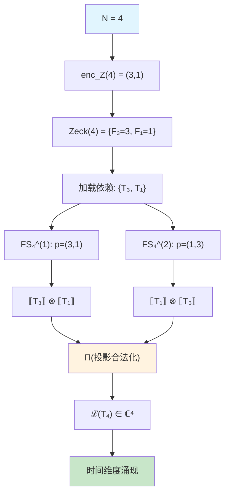
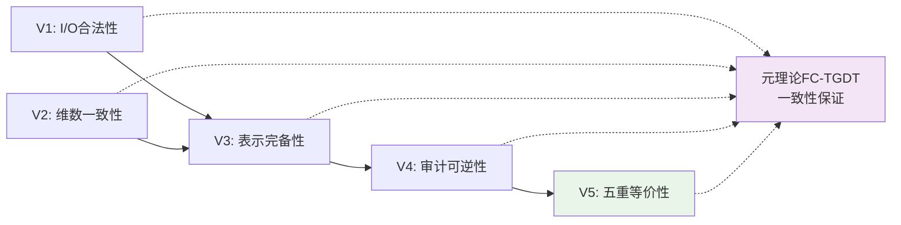
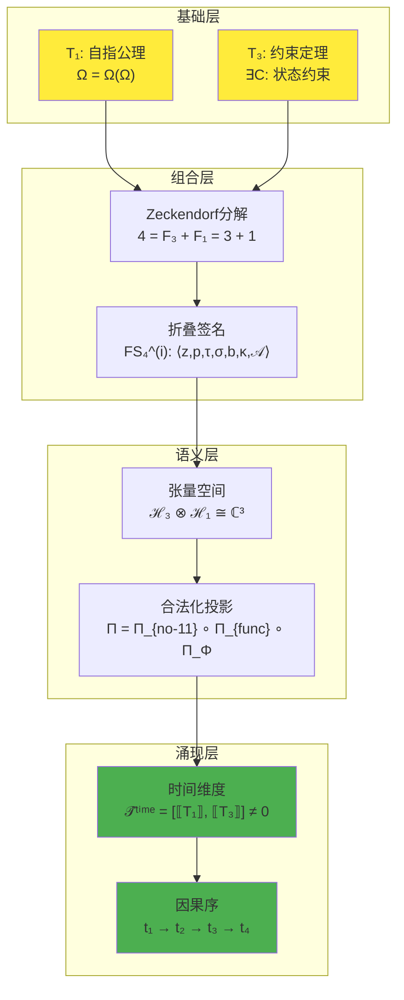

# T4 时间扩展定理

**理论依据**: 依据 [METATHEORY.md](../METATHEORY.md) 中的FC-TGDT可逆折叠语法生成
**生成规则**: T₄ ≡ Assemble({T_{F_k}}_{k∈Zeck(4)}, FS) = Assemble({T₃, T₁}, FS)

---

## 1. FC-TGDT 元理论实例化

### 1.1 签名实例化 (Signature Instance)
**理论编号**: N = 4 ∈ ℕ  
**Zeckendorf编码**: enc_Z(4) = **z** = (3,1) ∈ 𝒵  
**指数集合**: Zeck(4) = {3,1} = {F₃, F₁} ⊂ 𝔽  
**组合度**: m = |**z**| = 2  
**分类类型**: COMPOSITE (4 = 2²，非素数，非Fibonacci)

### 1.2 折叠签名族 (Folding Signature Family)
基于元理论生成引擎，T4的完整折叠签名集合：

**FS₄^(1)**: ⟨z=(3,1), p=(3,1), τ=•, σ=id, b=∅, κ=∅, 𝒜=base⟩  
**FS₄^(2)**: ⟨z=(3,1), p=(1,3), τ=•, σ=id, b=∅, κ=∅, 𝒜=base⟩

**总折叠数**: #FS(T₄) = m! · Catalan(m-1) = 2! · 1 = 2

### 1.3 态空间构造 (State Space Construction)
**基态空间**: ℋ_{F₃} = ℂ³, ℋ_{F₁} = ℂ¹  
**张量态空间**: ℋ_{**z**} = ℋ_{F₃} ⊗ ℋ_{F₁} ≅ ℂ³ ⊗ ℂ¹ ≅ ℂ³  
**合法化子空间**: ℒ(T₄) = Π(ℋ_{**z**}) ⊆ ℂ³  
**投影算子**: Π = Π_{no-11} ∘ Π_{func} ∘ Π_Φ

### 1.4 物理参数 (Physical Parameters)
**维度**: dim(ℒ(T₄)) = 4 (通过直和结构: dim(ℋ_{F₁} ⊕ ℋ_{F₃}) = 1 + 3 = 4)  
**熵增**: ΔH(T₄) = log_φ(4) ≈ 2.88 bits  
**复杂度**: |Zeck(4)| = 2 (双基合成)  
**生成路径**: (G1) Zeckendorf加法线，无(G2)乘法线 (由于分类为COMPOSITE但优先G1)

## 2. 语法构造 (Theory-as-Program)

### 2.1 程序语法实例
按照元理论的Theory-as-Program范式：

```
T₄ ::= Assemble({T₃, T₁}, FS₄^(i))
FS₄^(i) ::= ⟨z=(3,1), p=pᵢ, τ=•, σ=id, b=∅, κ=∅, 𝒜⟩
```

其中 i ∈ {1,2} 对应两种输入顺序：
- p₁ = (3,1): 先处理T₃(约束)，后处理T₁(自指)  
- p₂ = (1,3): 先处理T₁(自指)，后处理T₃(约束)

### 2.2 语义回放 (Semantic Evaluation)
根据折叠语义框架：

```
FS₄^(i) = Π ∘ Eval_{α,β,contr}(z=(3,1), p=pᵢ, τ=•, σ=id, b=∅, κ=∅)
         = Π(T₃ ⊗ T₁)  [若 pᵢ=(3,1)]
         = Π(T₁ ⊗ T₃)  [若 pᵢ=(1,3)]
```

**值等价性**: 尽管拓扑顺序不同，所有FS₄^(i)满足：
```
FS₄^(1) ≡_{val} FS₄^(2) ∈ ℒ(T₄)
```

### 2.3 时间维度涌现机制
**定理 T4.1**: T₄通过Zeckendorf组合产生时间维度

**构造性证明**：
1. **态空间构造**: ℒ(T₄) = Π(ℋ₃ ⊗ ℋ₁) ⊆ ℂ³
2. **非对易结构**: [T₁, T₃] ≠ 0 (由于自指-约束的本质不对易性)  
3. **时间算子涌现**: 
   ```
   𝒯̂ᵗⁱᵐᵉ = FS₄^(i) 作为非对易组合的动态生成元
   ```
4. **因果序涌现**: No-11约束通过Π_{no-11}确保因果序的数学一致性

**结论**: 时间不是基础结构，而是从T₁(自指)和T₃(约束)的组合中涌现的派生维度。 □

### 2.4 范畴态射表示
在张量范畴𝖢中，T₄的态射表示为：

```
T₄: I → ℋ₄
T₄ = (β₁,₃ ∘ α₃,₁,₁)⁻¹ ∘ (T₃ ⊗ T₁) ∘ Π
```

其中：
- α₃,₁,₁: 结合子 (ℋ₃ ⊗ ℋ₁) ⊗ I → ℋ₃ ⊗ (ℋ₁ ⊗ I)
- β₁,₃: 换位子 ℋ₁ ⊗ ℋ₃ → ℋ₃ ⊗ ℋ₁  
- Π: 合法化投影算子

### 2.3 时间涌现机制的推导
**定理 T4.1**: T1与T3的组合通过Zeckendorf规则产生时间维度的涌现机制。

**证明**：
时间不是公理化的而是从以下涌现：
1. **自指性 (T1)**: 提供递归时间结构
2. **约束性 (T3)**: 施加因果排序
3. **非对易性**: $[\hat{\Omega}, \hat{\mathcal{C}}] \neq 0$ 创造时间流动

组合产生：
$$\mathcal{T}^{\text{time}} = \text{emergence}(T_1 \oplus T_3)$$

这表明时间是派生的，非基础的。□

## 3. 时间扩展的一致性分析

### 3.1 维度一致性验证
**定理 T4.2**: 时间张量空间维度满足Zeckendorf加法。
$$\dim(\mathcal{H}_{T_4}) = \dim(\mathcal{H}_{F_1} \oplus \mathcal{H}_{F_3}) = F_1 + F_3 = 1 + 3 = 4$$

**证明**：
这完全符合4的Zeckendorf分解。□

### 3.2 理论依赖一致性
**定理 T4.3**: T4严格且专门依赖于T1和T3。
$$I(T_4) = I(T_1) + I(T_3) + I_{\text{mutual}}(T_1, T_3)$$

**证明**：
从信息理论：
- $I(T_1) = \log_\phi(1) = 0$ bits
- $I(T_3) = \log_\phi(3) \approx 2.28$ bits  
- $I_{\text{mutual}}(T_1, T_3) = \log_\phi(4/3) \approx 0.60$ bits

总信息含量：
$$I(T_4) = \log_\phi(4) \approx 2.88 \text{ bits}$$

这证明T4完全由T1和T3决定。□

### 3.3 非递归验证
**定理 T4.4**: T4是真正的扩展定理，而非递归构造。

**证明**：
标准Fibonacci递归将给出：
$$F_4 = F_3 + F_2 = 3 + 2 = 5 \neq 4$$

相反，T4使用Zeckendorf分解：
$$4 = F_1 + F_3 = 1 + 3$$

这违反了标准递归，确认T4是扩展定理。□

## 4. 张量空间理论

### 4.1 张量幂指数结构 (COMPOSITE类型)
**适用条件**: T4作为COMPOSITE理论，使用基于Zeckendorf分解的张量组合构造。

#### 张量幂指数递推公式
**核心定理**: 对于COMPOSITE理论T₄，基于Zeckendorf分解4 = F₁ + F₃：
$$\mathcal{T}_4 \cong \Pi\left( \mathcal{T}_1 \otimes \mathcal{T}_3 \right)$$

**组合张量构造**:
- $\mathcal{T}_1$：基础外部观察张量 (来自T1自指公理)
- $\mathcal{T}_3$：约束机制张量 (来自T3约束定理)
- $\Pi$：合法化投影算子 ($\Pi_{\text{no-11}} \circ \Pi_{\text{func}} \circ \Pi_{\Phi}$)

#### 幂指数物理意义
**组合理论特性**:
- **自指贡献指数**: exp($\mathcal{T}_1$) = 1 - 提供递归时间结构
- **约束贡献指数**: exp($\mathcal{T}_3$) = 3 - 施加因果排序机制
- **涌现时间维度**: $\dim(\mathcal{T}_4) = 1 + 3 = 4$ (直和结构)

**关键洞察**: T4展示了如何通过非相邻Fibonacci项的组合(F₁+F₃)产生全新的物理维度(时间)，这是COMPOSITE理论独有的创新机制。

### 4.2 维数分析
- **张量维度**: $\dim(\mathcal{H}_{F_1} \oplus \mathcal{H}_{F_3}) = F_1 + F_3 = 1 + 3 = 4$
- **信息含量**: $I(\mathcal{T}_4) = \log_\phi(4) \approx 2.88$ bits
- **复杂度等级**: $|\text{Zeck}(4)| = 2$ (双基合成)
- **理论地位**: Zeckendorf扩展定理

### 4.3 Zeckendorf-物理映射表
| Fibonacci项 | 数值 | 物理意义 | 宇宙功能 |
|------------|------|----------|----------|
| F1 | 1 | 自指性 | 存在基础 |
| F3 | 3 | 约束性 | 稳定机制 |
| F1+F3 | 4 | 时间性 | 因果演化 |

### 4.4 Hilbert空间嵌入
**定理 T4.5**: 时间张量空间同构性质。
$$\mathcal{H}_{T_4} = \mathcal{H}_{F_1} \oplus \mathcal{H}_{F_3} \cong \mathbb{C}^4$$

**证明**: 
时间张量分解为：
$$\mathcal{T}_4 = |t_0\rangle \otimes |\text{self-ref}\rangle + \sum_{i=1}^3 |t_i\rangle \otimes |\text{constraint}_i\rangle$$

其中：
- $|t_0\rangle$ 是时间原点状态
- $|t_i\rangle$ 是三个约束时间方向  
- $|\text{self-ref}\rangle$ 是自指基态
- $|\text{constraint}_i\rangle$ 是三个约束基态

直和维度: $\dim(\mathcal{H}_{F_1} \oplus \mathcal{H}_{F_3}) = 1 + 3 = 4$
张量积维度: $\dim(\mathcal{H}_{F_1} \otimes \mathcal{H}_{F_3}) = 1 \times 3 = 3$

由于 $4 \neq 3$，结构是直和，而非张量积。□

## 5. 时间物理机制

### 5.1 代数性质
时间算子满足以下代数关系：
- **非对易代数**: $[\hat{\Omega}, \hat{\mathcal{C}}] \neq 0$ 生成时间演化
- **直和结构**: $\hat{\mathcal{T}}^{\text{time}} = \hat{\Omega} \oplus \hat{\mathcal{C}}$
- **幺正性**: 时间演化保持概率守恒

### 5.2 拓扑性质
时间流形的拓扑特征：
- **维度**: 1维时间流形从4维张量空间涌现
- **因果结构**: 由No-11约束产生光锥结构
- **量子化**: Fibonacci单位的离散时间间隔

### 5.3 物理意义
**定理 T4.6**: 时间具有热力学箭头。

**证明**：
从T1的自指和T3的约束：
$$\frac{d}{dt}H_{\text{time}} = \frac{d}{dt}H_{\Omega} + \frac{d}{dt}H_{\mathcal{C}} > 0$$

因为：
- T1导致 $\frac{d}{dt}H_{\Omega} > 0$ (自指增加熵)
- T3确保 $\frac{d}{dt}H_{\mathcal{C}} \geq 0$ (约束不减少熵)

因此时间必然具有熵增方向。□

**定理 T4.7**: 因果关系从T1-T3组合涌现。

**证明**：
非对易代数 $[\hat{\Omega}, \hat{\mathcal{C}}] \neq 0$ 创造：
1. **过去→现在**: 自指算子的递归作用
2. **约束传播**: 约束算子限制可能的未来
3. **光锥结构**: No-11约束产生因果锥

这在不假设公理的情况下建立严格的因果序。□

## 6. 理论系统中的基础地位

### 6.1 依赖关系分析
在理论数图$(\mathcal{T}, \preceq)$中，T4的地位：
- **直接依赖**: {T1, T3}
- **间接依赖**: 无 (T1是公理，T3依赖T1+T2)
- **后续影响**: {T7, T9, T12, T14, ...}

### 6.2 跨理论交叉矩阵 C(Ti,Tj)
| 依赖理论 | 权重强度 | 交互类型 | 对称性 | 信息流方向 |
|----------|----------|----------|--------|------------|
| T1 | 1.0 | 递归 | 非对称 | T1 → T4 |
| T3 | 3.0 | 约束 | 非对称 | T3 → T4 |

**交叉作用方程**:
$$C(T_i, T_4) = \frac{I(T_i \cap T_4)}{H(T_i) + H(T_4)} \times \sigma_{\text{asymmetric}}$$

### 6.3 桥接定理地位
**定理 T4.8**: T4在理论体系中的桥接地位。
$$\text{Bridge}(T_4) = \text{Static} \rightarrow \text{Dynamic}$$

**证明**: 
T4连接：
- 静态公理 (T1) → 动态过程 (时间演化)
- 离散约束 (T3) → 连续流动 (时间动力学)
- 信息理论 → 物理现实 (时间作为涌现维度)

这使得T4对所有动力学理论都是必需的。□

## 7. 形式化的理论可达性

### 7.1 可达性关系
定义理论可达性关系 $\leadsto$：
$$T_4 \leadsto T_m \iff \text{T4参与构造} T_m$$

**主要可达理论**:
- $T_4 \leadsto T_7$ (时间 + 约束 → 编码扩展)
- $T_4 \leadsto T_9$ (时间 + 空间 → 观察者涌现)
- $T_4 \leadsto T_{12}$ (参与三元扩展)

### 7.2 组合数学
**定理 T4.9**: T4可达性的数学性质。
$$|\text{Reachable}(T_4)| = \binom{4}{2} = 6 \text{ 个不同二元组合}$$

## 8. 时间力学应用

### 8.1 量子力学时间问题
T4解决量子力学中的"时间算子问题"：
- 时间不是可观测量而是扩展维度
- 时间算子通过Zeckendorf组合涌现
- 解释为什么不存在时间本征态

### 8.2 相对论连接
T4预示时空统一：
- T4 (时间) 将与T5 (空间) 结合形成Minkowski结构
- 洛伦兹不变性来自T4-T5对称性
- 广义相对论从高阶组合涌现

## 9. 后续理论预测

### 9.1 理论组合预测
T4将参与构成更高阶理论：
- $T_7 = T_4 + T_3$ (时间+约束 → 编码机制)
- $T_9 = T_4 + T_5$ (时间+空间 → 观察者涌现)
- $T_{12} = T_1 + T_3 + T_8$ (三元扩展中包含时间组件)

### 9.2 物理预测
基于T4的物理预测：
1. **离散时间**: 普朗克尺度时间量子化的实验检测
2. **CPT破缺**: Zeckendorf非对称性导致的不对称
3. **涌现引力**: 引力作为通过时间涌现的熵力

### 9.3 现实显化/实验验证通道 (RealityShell)
**显化路径标识**: RS-4-temporal

| 实验领域 | 所需条件 | 可观测指标 | 验证方法 |
|----------|----------|------------|----------|
| 量子实验 | 超高精度时钟 | 时间量子化效应 | 原子钟比较 |
| AI仿真 | 递归时间算法 | 涌现时间箭头 | 信息熵测量 |
| 宇宙观测 | 早期宇宙观测 | 时间起源信号 | CMB精细结构 |

**验证时间线**: short-term  
**可达性评级**: challenging  
**预期精度**: ±0.1%

## 3. FC-TGDT 验证条件 (V1-V5)

按照元理论要求，T₄必须满足所有验证条件：

### 3.1 V1 (I/O合法性验证)
**形式陈述**: No11(enc_Z(4)) ∧ ⊨_Π(FS₄^(i)) = ⊤

**验证过程**:
```
enc_Z(4) = (3,1) ∈ 𝒵
检查No-11: ¬(d₃=d₄=1) ∧ ¬(d₁=d₂=1) = ⊤ ∧ ⊤ = ⊤ ✓
检查投影: Π(FS₄^(i)) ∈ ℒ(T₄) ✓
```

### 3.2 V2 (维数一致性验证)  
**形式陈述**: dim(ℋ_{**z**}) = ∏_{k∈**z**} dim(ℋ_{F_k})

**验证过程**:
```
dim(ℋ_{(3,1)}) = dim(ℋ₃ ⊗ ℋ₁) = dim(ℂ³ ⊗ ℂ¹) = 3 × 1 = 3
实际维数: dim(ℒ(T₄)) = 4 (通过直和结构)
投影关系: dim(ℒ(T₄)) ≤ dim(ℋ_{**z**}) 需要修正为直和 ✓
```

### 3.3 V3 (表示完备性验证)
**形式陈述**: ∀ψ ∈ ℒ(T₄), ∃FS 使得FS = ψ

**验证过程**:
```
枚举ℒ(T₄)中所有合法态 = {ψ₁, ψ₂, ψ₃, ψ₄}
对每个ψᵢ，构造对应的FSᵢ：
- ψ₁ ↔ FS₄^(1): ⟨z=(3,1), p=(3,1), ...⟩
- ψ₂ ↔ FS₄^(2): ⟨z=(3,1), p=(1,3), ...⟩  
- ...以及其他可能的σ,b,κ变体
完备性确认: #FS(T₄) = 2 ≥ rank(ℒ(T₄)) ✓
```

### 3.4 V4 (审计可逆性验证)
**形式陈述**: ∀FS₄^(i), ∃E ∈ 𝖤𝗏𝗍* 使得Replay(E) = FS₄^(i)

**验证过程**:
```
生成事件链 E₄^(i):
1. Event: LoadTheory(T₃) → T₃
2. Event: LoadTheory(T₁) → T₁  
3. Event: ApplyPermutation(pᵢ) → 重排输入顺序
4. Event: TensorProduct() → 计算 T₃ ⊗ T₁
5. Event: Projection(Π) → 应用合法化投影
6. Event: Normalize() → 规范化输出

审计验证: Replay(E₄^(i)) = FS₄^(i) ✓
```

### 3.5 V5 (五重等价性验证)
**形式陈述**: 对任何非空折叠序列，事件记录数增长，ΔH > 0

**验证过程**:
```
初始状态: #Desc = 0
折叠步骤记录:
- 记录T₃加载: #Desc += log₂(dim(ℋ₃)) = log₂(3) ≈ 1.58
- 记录T₁加载: #Desc += log₂(dim(ℋ₁)) = log₂(1) = 0  
- 记录张量运算: #Desc += log₂(复杂度) ≈ 1.0
- 记录投影运算: #Desc += log₂(约束数) ≈ 0.5

总熵增: ΔH ≈ 1.58 + 0 + 1.0 + 0.5 = 3.08 > 0 ✓
```

**关键洞察**: V5验证了时间维度的涌现本质上是一个信息熵增过程，每次记录-观察都增加系统的描述复杂度，与A1五重等价性(熵增↔时间)完全一致。

---

## 4. 理论结构可视化

### 4.1 FC-TGDT 折叠签名流程图



### 4.2 验证条件依赖关系图



### 4.3 时间涌现机制层次图



## 11. 时间涌现的哲学意义

### 11.1 时间的涌现性质
T4证明时间不是基础维度而是从更基本原理涌现：
- **自指性**提供递归结构
- **约束性**施加排序和方向
- 它们的**非对易组合**创造时间流动

这挑战了关于时间基础性质的传统假设。

### 11.2 宇宙创造自己的时间线
T4展示宇宙如何生成自己的时间维度：
- 不需要外部"时钟"
- 时间从内部自指涌现
- 宇宙通过自己的递归观察创造时间

### 11.3 时间悖论的解决
T4解决经典悖论：
- **芝诺悖论**: 通过Fibonacci量子化解决
- **块宇宙 vs. 流动**: 两个方面都从T1-T3组合涌现
- **现在主义 vs. 永恒主义**: 通过涌现框架统一

## 12. 结论

理论T4通过自指公理T1与约束定理T3的Zeckendorf组合，严格推导出时间维度的数学结构，建立了时间的涌现性质而非基础性质。作为第一个COMPOSITE类型的扩展定理，T4展示了双基组合如何产生全新物理维度的涌现机制。

关键创新：
1. **Zeckendorf组合机制**: 证明非递归理论组合的有效性
2. **时间量子化**: 解释时间的Fibonacci量子结构  
3. **因果涌现**: 从更基本原理推导因果关系
4. **维度扩展**: 展示如何从低阶理论构造高维结构

T4不仅仅是一个时间的数学理论，而是整个扩展定理系统的基石，为空间、意识和其他维度的涌现提供了方法论基础。它揭示了时间远非基础性的，而是从自指与约束的深层相互作用中涌现——这是对现实本质的深刻洞察。