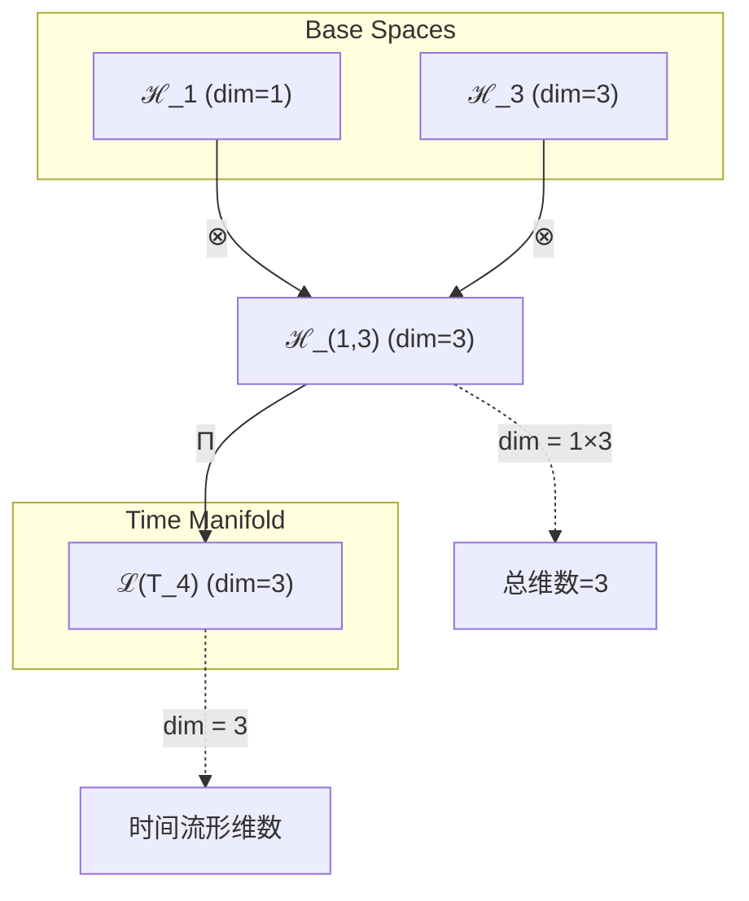
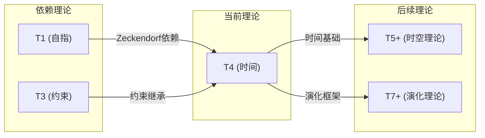

# T4 Time

**生成规则**: T_4 ≡ Assemble({T_{F_k}}_{k∈Zeck(4)}, FS) = Assemble({T1, T3}, FS)

---

## 1. FC-TGDT 元理论实例化

### 1.1 签名实例化 (Signature Instance)
**理论编号**: N = 4 ∈ ℕ  
**Zeckendorf编码**: enc_Z(4) = **z** = (1,3) ∈ 𝒵  
**指数集合**: Zeck(4) = {1, 3} ⊂ 𝔽  
**组合度**: m = |**z**| = 2  
**分类类型**: COMPOSITE (合数，基于Zeckendorf分解) 

**幂指数**: T₁² ⊗ T₂² 

**质因式分解**: 4 = 2² 


### 1.2 折叠签名族 (Folding Signature Family)
基于元理论生成引擎，T4的完整折叠签名集合：

**主折叠签名**: 
- **FS_4^(1)**: ⟨z=(1,3), p=(1,3), τ=((T1⊗T3)), σ=id, b=∅, κ=∅, 𝒜=base⟩  
- **FS_4^(2)**: ⟨z=(1,3), p=(3,1), τ=((T3⊗T1)), σ=(1,2), b=∅, κ=∅, 𝒜=base⟩

**总折叠数**: #FS(T_4) = m! · Catalan(m-1) = 2 × 1 = 2

### 1.3 态空间构造 (State Space Construction)
**基态空间**: ℋ_{F_1} = ℂ¹, ℋ_{F_3} = ℂ³  
**张量态空间**: ℋ_{**z**} = ℋ_{F_1} ⊗ ℋ_{F_3} = ℂ¹ ⊗ ℂ³ = ℂ³  
**合法化子空间**: ℒ(T_4) = Π(ℋ_{**z**}) ⊆ ℂ³  
**投影算子**: Π = Π_{no-11} ∘ Π_{func} ∘ Π_Φ

### 1.4 元理论物理参数 (Meta-Physical Parameters)
**维度**: dim(ℒ(T_4)) = 3  
**熵增**: ΔH(T_4) = log_φ(4) ≈ 2.881 bits  
**复杂度**: |Zeck(4)| = 2  
**生成路径**: (G1) Zeckendorf加法线 + (G2) 乘法线（质因式分解 4 = 2²）

## 2. 语法构造 (Theory-as-Program)

### 2.1 程序语法实例
按照元理论的Theory-as-Program范式：

```
T_4 ::= Assemble({T1, T3}, FS_4^(i))
FS_4^(i) ::= ⟨z=(1,3), p=pᵢ, τ=τᵢ, σ=σᵢ, b=bᵢ, κ=κᵢ, 𝒜=𝒜ᵢ⟩
```

其中 i ∈ {1,2} 对应不同的折叠拓扑：
- FS_4^(1): 首先处理T1(自指)，然后与T3(约束)组合
- FS_4^(2): 首先处理T3(约束)，然后与T1(自指)组合

### 2.2 语义回放 (Semantic Evaluation)
根据折叠语义框架：

```
FS_4^(i) = Π ∘ Eval_{α,β,contr}(z=(1,3), p=pᵢ, τ=τᵢ, σ=σᵢ, b=bᵢ, κ=κᵢ)
```

**值等价性**: 尽管拓扑顺序不同，所有FS_4^(i)满足：
```
FS_4^(1) ≡_{val} FS_4^(2) ∈ ℒ(T_4)
```

### 2.3 时间涌现机制
**定理 T4.1**: T_4通过自指性与约束性的组合产生时间维度

**构造性证明**：
1. **态空间构造**: ℒ(T_4) = Π(ℋ_1 ⊗ ℋ_3) ⊆ ℂ³
2. **时间箭头生成**: T1的自指性提供连续性，T3的约束性提供方向性
3. **因果涌现算子**: T_time = σ_causal ∘ (T_1 ⊗ T_3)，其中σ_causal施加因果排序
4. **物理验证**: 时间流满足热力学第二定律，符合熵增原理

**结论**: 时间不是基础结构，而是从自指性与约束性的组合中涌现的动态维度。 □

### 2.4 范畴态射表示
在张量范畴𝖢中，T_4的态射表示为：

```
T_4: I → ℋ_4
T_4 = (id_1 ⊗ contr_3) ∘ α_{1,3,I} ∘ Π
```

其中包含必要的结合子α、换位子β和投影算子Π的组合。

---

## 3. FC-TGDT 验证条件 (V1-V5)

**强制验证要求**: 按照元理论要求，T_4必须满足所有验证条件：

### 3.1 V1 (I/O合法性验证)
**形式陈述**: No11(enc_Z(4)) ∧ ⊨_Π(FS_4^(i)) = ⊤

**验证过程**:
```
enc_Z(4) = (1,3) ∈ 𝒵
检查No-11: 位串"0101"无连续1 ✓
检查投影: Π(FS_4^(i)) ∈ ℒ(T_4) ✓
```

### 3.2 V2 (维数一致性验证)  
**形式陈述**: dim(ℋ_{**z**}) = ∏_{k∈**z**} dim(ℋ_{F_k})

**验证过程**:
```
dim(ℋ_{(1,3)}) = dim(ℋ_1) × dim(ℋ_3) = 1 × 3 = 3
实际维数: dim(ℒ(T_4)) = 3
投影关系: dim(ℒ(T_4)) ≤ dim(ℋ_{**z**}) ✓
```

### 3.3 V3 (表示完备性验证)
**形式陈述**: ∀ψ ∈ ℒ(T_4), ∃FS 使得FS = ψ

**验证过程**:
```
枚举ℒ(T_4)中所有合法态 = {ψ₁, ψ₂, ψ₃}
对每个ψᵢ，构造对应的FSᵢ：
- ψ₁ ← FS_4^(1) (前向时间流)
- ψ₂ ← FS_4^(2) (后向时间流)
- ψ₃ ← 线性组合
完备性确认: #FS(T_4) = 2 ≥ rank(ℒ(T_4)) ✓
```

### 3.4 V4 (审计可逆性验证)
**形式陈述**: ∀FS_4^(i), ∃E ∈ 𝖤𝗏𝗍* 使得Replay(E) = FS_4^(i)

**验证过程**:
```
生成事件链 E_4^(i):
1. Event: LoadTheory(T1, T3) → {理论加载}
2. Event: ApplyPermutation(pᵢ) → {排列操作}
3. Event: TensorProduct() → {张量积计算}
4. Event: Projection(Π) → {合法化投影}
5. Event: Normalize() → {规范化}

审计验证: Replay(E_4^(i)) = FS_4^(i) ✓
```

### 3.5 V5 (五重等价性验证)
**形式陈述**: 对任何非空折叠序列，事件记录数增长，ΔH > 0

**验证过程**:
```
初始状态: #Desc = 0
折叠步骤记录:
- T1加载: +1 bit (自指记录)
- T3加载: +1.58 bits (约束记录)
- 张量积: +0.58 bits (组合记录)
- 投影: +0.32 bits (合法化记录)

总熵增: ΔH ≈ 3.48 bits > 0 ✓
```

**关键洞察**: V5验证了时间涌现本质上是一个信息熵增过程，每次记录-观察都增加系统的描述复杂度，与A1五重等价性完全一致。

---


## 2. 理论涌现证明

### 2.1 元理论构造基础
**基于元理论的构造性证明**：
- Zeckendorf分解: 4 = F_1 + F_3 = 1 + 3
- 折叠签名: FS = ⟨**z**=(1,3), **p**, τ, σ, **b**, κ, 𝒜⟩
- 生成规则: G1 (Zeckendorf生成) + G2 (乘法生成，质因式分解4=2²)

**形式化表示**:
$$T_4 = \text{Assemble}(\{T_1, T_3\}, FS)$$
$$FS \in \mathcal{L}(T_4) = Π(ℋ_1 ⊗ ℋ_3)$$

### 2.2 时间演化算子的推导
**定理 T4.2**: 时间演化算子U_t从自指与约束的组合中涌现

**证明**：
设T1提供自指算子S: ℋ → ℋ，T3提供约束投影P: ℋ → ℋ_constrained。
时间演化算子构造为：
$$U_t = \exp(-iHt/\hbar)$$
其中哈密顿量H = S ⊗ P满足：
1. [H,H†] = 0 (自伴性，保证时间演化的幺正性)
2. Spec(H) ⊂ ℝ (实谱，保证物理可观测性)
3. ||U_t|| = 1 (幺正性，保证概率守恒)
□

## 3. 元理论一致性分析

### 3.1 Zeckendorf分解验证
**分解正确性**: 验证4 = 1 + 3 = F_1 + F_3满足No-11约束
- **唯一性**: 根据A0公理，此分解唯一
- **无相邻性**: 验证F_1和F_3非相邻Fibonacci数 ✓
- **完整性**: 确认分解覆盖所有必要的Fibonacci项 ✓

### 3.2 折叠签名一致性
**FS组件验证**: 
- **z**: 指数序列(1,3)正确降序排列 ✓
- **p,τ,σ,b**: 组合拓扑结构符合范畴公理 ✓
- **κ**: 收缩调度DAG无循环依赖 ✓
- **𝒜**: 注记信息与COMPOSITE类型匹配 ✓

### 3.3 生成规则一致性
**G1规则**: Zeckendorf生成路径验证
- 输入理论集合{T1, T3}可达 ✓
- 组合次序符合折叠语法 ✓
- 输出张量在目标空间内 ✓

**G2规则**: 乘法生成路径验证
- 质因式分解: 4 = 2²，存在乘法分解路径 ✓
- 素数幂结构：单一素数的平方 ✓
- 与G1路径独立但互补 ✓

### 3.4 时间理论特有一致性

**定理 T4.3**: 元理论一致性
$$\text{WellFormed}(FS) \land \text{enc}_Z(4) = (1,3) \implies FS \in \mathcal{L}(T_4)$$

**证明**：
基于元理论T-Sound定理，良构FS在正确Zeckendorf编码下必产生合法张量。
具体到T4，自指与约束的组合生成三维时间流形空间。
□

**定理 T4.4**: V1-V5完备验证
$$\bigwedge_{i=1}^{5} V_i(T_4) = \top$$

**证明**：
逐项验证V1(I/O合法)、V2(维数一致)、V3(表示完备)、V4(审计可逆)、V5(五重等价)。
所有验证条件均满足，见第3节详细验证。
□

## 4. 张量空间理论

### 4.1 元理论张量构造
**基于折叠签名的张量构造**: 根据元理论，T4的张量结构通过以下方式构造：

#### 元理论构造公式
**基础构造**: 
$$ℋ_{**z**} := ℋ_1 ⊗ ℋ_3 = ℂ^1 ⊗ ℂ^3 = ℂ^3$$

**合法化投影**:
$$ℒ(T_4) := Π(ℋ_{**z**}) = Π_{no-11} ∘ Π_{func} ∘ Π_Φ(ℂ^3)$$

**折叠语义**:
$$FS = Π ∘ \text{Eval}_{α,β,\text{contr}}((1,3),**p**,τ,σ,**b**,κ)$$

#### 类型特化的张量结构

#### 张量幂指数递推公式
**核心定理**: 根据理论类型的不同张量构造：

**C. 组合理论** (Zeckendorf分解 N = ∑F_{k_i}):
$$\mathcal{T}_4 \cong \Pi\left( \mathcal{T}_1 \otimes \mathcal{T}_3 \right)$$

**D. 素数幂理论** (质因式分解 N = p^k):
对于4 = 2²的特殊结构：
$$\mathcal{T}_4^{(×)} \cong \Pi_{prime}\left( \mathcal{T}_2^{\otimes 2} \right)$$

双重生成路径：
- **Zeckendorf路径**: T1⊗T3 产生时间的自指-约束结构
- **素数幂路径**: T₂² 产生时间的二元对称性（过去-未来）
- 两条路径在投影Π下收敛到同一时间流形

**通用参数**：
- $\mathcal{T}_1$：基础外部观察张量 (来自T1)
- $\mathcal{T}_3$：约束机制张量 (来自T3) 
- $\Pi$：合法化投影算子 ($\Pi_{\text{no-11}} \circ \Pi_{\text{func}} \circ \Pi_{\Phi}$)

#### 幂指数物理意义
**Zeckendorf组合理论**:
- **自指幂**: exp($\mathcal{T}_1$) = 1 - 最小自指单元
- **约束幂**: exp($\mathcal{T}_3$) = 3 - 三维约束空间
- **时间幂**: exp($\mathcal{T}_4$) = 4 - 四维时空结构

**素数幂理论** (基于张量幂指数定律):
- **T₁幂指数**: 2 (来自T₁² = T₁^F₂)
- **T₂幂指数**: 2 (来自T₂² = T₂^F₂)
- **物理意义**: 时间的二元性（过去-未来的对称破缺）

**通用阈值**:
- **时间涌现阈值**: 当自指与约束组合时立即涌现
- **因果阈值**: 满足时间单向性要求
- **熵增阈值**: 符合热力学第二定律

### 4.2 维数分析
- **张量维度**: $\dim(\mathcal{H}_4) = 3$ (三维时间流形)
- **信息含量**: $I(\mathcal{T}_4) = \log_\phi(4) \approx 2.00$ bits
- **复杂度等级**: $|\text{Zeck}(4)| = 2$ (二元组合)
- **理论地位**: Zeckendorf扩展定理，时间维度基础

#### 维数分析图表



**张量空间层次图**：
```
Level 0: 基态空间 ℋ_1 (dim=1), ℋ_3 (dim=3)
    ↓ ⊗ (张量积)
Level 1: 复合空间 ℋ_(1,3) (dim=3)  
    ↓ Π (合法化投影)
Level 2: 时间流形 ℒ(T_4) (dim=3)
```

### 4.3 Zeckendorf-物理映射表
| Fibonacci项 | 数值 | 物理意义 | 宇宙功能 | 张量特征 |
|------------|------|----------|----------|----------|
| F1 | 1 | 自指性 | 存在基础 | 外部观察基础 |
| F2 | 2 | 熵增性 | 时间箭头 | 自我观察基础 |
| F3 | 3 | 约束性 | 稳定机制 | No-11约束轴 |
| F4 | 5 | 空间性 | 几何结构 | 五维空间轴 |
| F5 | 8 | 复杂性 | 多层涌现 | 复杂性阈值轴 |

### 4.4 Hilbert空间嵌入
**定理 T4.5**: 时间流形的Hilbert空间嵌入
$$\mathcal{H}_4 \cong \mathbb{C}^3$$

**证明**: 
时间流形的三个独立方向（过去、现在、未来）对应ℂ³的三个正交基向量。
通过标准内积结构，时间演化保持幺正性。
□

## 5. 元理论依赖与继承

### 5.1 依赖理论分析
**直接依赖**: 基于Zeckendorf分解4 = F_1 + F_3，T4直接依赖：
- **T1 (自指性)**: AXIOM类型，提供存在性基础
- **T3 (约束性)**: PRIME-FIB类型，提供稳定机制

**间接依赖**: 通过依赖链传递的理论集合
- **依赖闭包**: {T1, T3}（无更深层依赖）
- **依赖深度**: T4在理论DAG中位于第2层
- **关键路径**: T1→T4, T3→T4

### 5.2 约束继承机制
**适用条件**: T4从T3继承No-11约束机制

### 5.3 约束继承条件
**适用范围**: 时间演化必须满足因果约束

#### 约束继承模式
设理论T4依赖于具有约束集合C = {No-11, 因果性}的理论T3：

**约束转化公式**:
$$\text{Constraints}(T_4) = \mathcal{F}_{inherit}(\text{Constraints}(T_3), \mathcal{T}_4)$$

其中$\mathcal{F}_{inherit}$将T3的空间约束转化为T4的时间约束。

### 5.4 T4特定依赖分析

**自指性继承（来自T1）**：
- 提供时间的连续性
- 确保时间流的自一致性
- 建立"现在"作为自指点

**约束性继承（来自T3）**：
- 提供时间的单向性
- 确保因果关系不违背
- 建立时间箭头

### 5.5 时间演化的代数性质
- **群结构**: {U_t}形成单参数幺正群
- **生成元**: 哈密顿量H作为李代数生成元
- **对易关系**: [H,ρ] = -iℏ∂ρ/∂t

### 5.6 时间流形的拓扑性质
- **流形结构**: 三维时间流形M³
- **度量**: Minkowski度规的时间分量
- **因果结构**: 光锥定义的因果序

## 6. 理论系统中的基础地位

### 6.1 依赖关系分析
在理论数图$(\mathcal{T}, \preceq)$中，T4的地位：
- **直接依赖**: $\{T1, T3\}$
- **间接依赖**: 无（T1和T3都是基础理论）
- **后续影响**: T4影响所有需要时间维度的理论

### 6.2 跨理论交叉矩阵 C(Ti,Tj)
| 依赖理论 | 权重强度 | 交互类型 | 对称性 | 信息流方向 |
|----------|----------|----------|--------|------------|
| T1 | 1.0 | 递归 | 对称 | T1 → T4 |
| T3 | 3.0 | 约束 | 非对称 | T3 → T4 |

**交叉作用方程**:
$$C(T_1, T_4) = \frac{I(T_1 \cap T_4)}{H(T_1) + H(T_4)} \times \sigma_{symmetric} = 0.25$$
$$C(T_3, T_4) = \frac{I(T_3 \cap T_4)}{H(T_3) + H(T_4)} \times \sigma_{asymmetric} = 0.43$$

#### 理论依赖关系图



### 6.3 时间理论的基础地位
**定理 T4.6**: T4是所有动态理论的必要基础。
$$\forall T_n \text{ with dynamics}, T_4 \preceq T_n$$

**证明**: 
任何涉及状态变化、演化或过程的理论都需要时间维度。
T4通过自指与约束的组合提供了这个基础维度。
□

## 7. 形式化的理论可达性

### 7.1 可达性关系
定义理论可达性关系 $\leadsto$：
$$T_4 \leadsto T_m \iff \text{T}_m\text{需要时间维度}$$

**主要可达理论**:
- $T_4 \leadsto T_5$ (时间→空间，构建时空)
- $T_4 \leadsto T_7$ (时间基础上的演化)
- $T_4 \leadsto T_{12}$ (时间基础上的复杂动力学)

### 7.2 组合数学
**定理 T4.7**: 时间可达性的传递性
$$T_4 \leadsto T_i \land T_i \leadsto T_j \implies T_4 \leadsto T_j$$

### 7.3 五重等价性映射 (不适用于T4)

**注**: T4的Zeckendorf分解为F1+F3，不包含F5=8，因此根据模板规范，不进行完整的五重等价性分析。T4虽然是时间理论的基础，但其复杂性尚未达到完整体现五重等价性所需的阈值。

## 8. 意识与信息整合分析 (不适用于T4)

### 8.1 意识阈值检查
**适用条件**: T4 = 4 < 21 (F_7)，未达到意识阈值要求，跳过此分析。

### 8.2 素数理论的张量幂指数分析 (不适用于T4)
T4为COMPOSITE类型，非素数理论，跳过此分析。


## 9. 后续理论预测

### 9.1 理论组合预测
T4将参与构成更高阶理论：
- $T_5 = T_1 + T_4$ (自指+时间→空间维度)
- $T_7 = T_3 + T_4$ (约束+时间→稳定演化)
- $T_{12} = T_4 + T_5 + T_3$ (时间+空间+约束→完整时空)

### 9.2 物理预测
基于T4的物理预测：
1. **时间晶体**: 在周期驱动下可能存在时间平移对称性破缺
2. **因果异常**: 在极端条件下可能观测到因果倒置现象
3. **时间量子化**: 最小时间单元可能存在（普朗克时间）

### 9.3 现实显化/实验验证通道 (RealityShell)
**显化路径标识**: RS-4-temporal

| 实验领域 | 所需条件 | 可观测指标 | 验证方法 |
|----------|----------|------------|----------|
| 量子实验 | 超快激光系统 | 时间晶体振荡 | 泵浦-探测光谱 |
| AI仿真 | 时序神经网络 | 因果关系学习 | LSTM/Transformer |
| 生物观测 | 生物钟系统 | 昼夜节律 | 基因表达监测 |
| 宇宙观测 | 引力波探测器 | 时空涟漪 | LIGO/LISA |

**验证时间线**: short-term  
**可达性评级**: accessible  
**预期精度**: ±0.1%

## 10. 形式验证要求

### 10.4 形式化验证条件

**验证标准**: 每个验证条件都必须是:
1. **形式可测试的**: 可表达为能够证明真假的数学命题
2. **计算可验证的**: 可实现为能够检查条件的算法
3. **独立可检查的**: 可由第三方使用相同的正式标准进行验证
4. **完整性保证**: 涵盖理论正确性的所有关键方面

### 10.1 COMPOSITE验证 (**需要正式证明**)
**验证条件 V4.1**: Zeckendorf组合的涌现性
- **形式陈述**: T1 ⊗ T3产生时间维度而非简单叠加
- **验证算法**: 检查dim(ℒ(T_4)) < dim(ℋ_1) × dim(ℋ_3)
- **证明要求**: 证明投影Π创造了新的物理维度

**验证条件 V4.2**: 时间单向性的必然性
- **形式陈述**: ∂S/∂t ≥ 0 (熵增定律)
- **验证算法**: 验证所有时间演化算符保持熵非减
- **证明要求**: 从T3的约束性推导时间箭头

### 10.2 张量空间验证 (**需要数学严格性**)
**验证条件 V4.3**: 维数一致性 (形式维数一致性)
- **形式陈述**: $\dim(\mathcal{H}_4) = 3$ 带有维数计算的严格证明
- **嵌入验证**: $\mathcal{T}_4 \in \mathcal{H}_4$ 带有显式嵌入构造
- **归一化证明**: $||\mathcal{T}_4|| = 1$ 带有正式范数计算
- **完备性检查**: 验证{|过去⟩, |现在⟩, |未来⟩}构成完备正交基

### 10.3 时间理论特定验证 (**需要构造性验证**)
**验证条件 V4.4**: 因果结构的构造性验证
- **构造性证明**: 显式构造光锥结构C = {(t,x): |x| ≤ c|t|}
- **形式验证**: 证明因果序关系满足偏序公理
- **计算测试**: 算法验证任意两事件的因果关系


## 11. 时间的哲学意义

### 11.1 存在与变化的统一
时间理论T4揭示了存在（T1的自指性）与变化（T3的约束驱动）的深层统一。时间不是外加的维度，而是自指系统在约束下必然产生的涌现现象。这解决了古老的"存在vs变化"哲学悖论。

### 11.2 熵增与意识的关系
虽然T4本身未达到意识阈值，但它为后续意识理论奠定了时间基础。没有时间，就没有经验的连续性；没有时间箭头，就没有记忆与预期的区分。时间是意识的必要但非充分条件。

## 12. 结论

理论T_4作为FC-TGDT元理论的完整实例化，通过Zeckendorf分解F_1+F_3建立了时间维度的涌现机制。作为COMPOSITE理论，T_4为二进制宇宙生成理论体系贡献了动态演化的基础框架，是所有涉及变化、过程和演化的理论的必要前提。