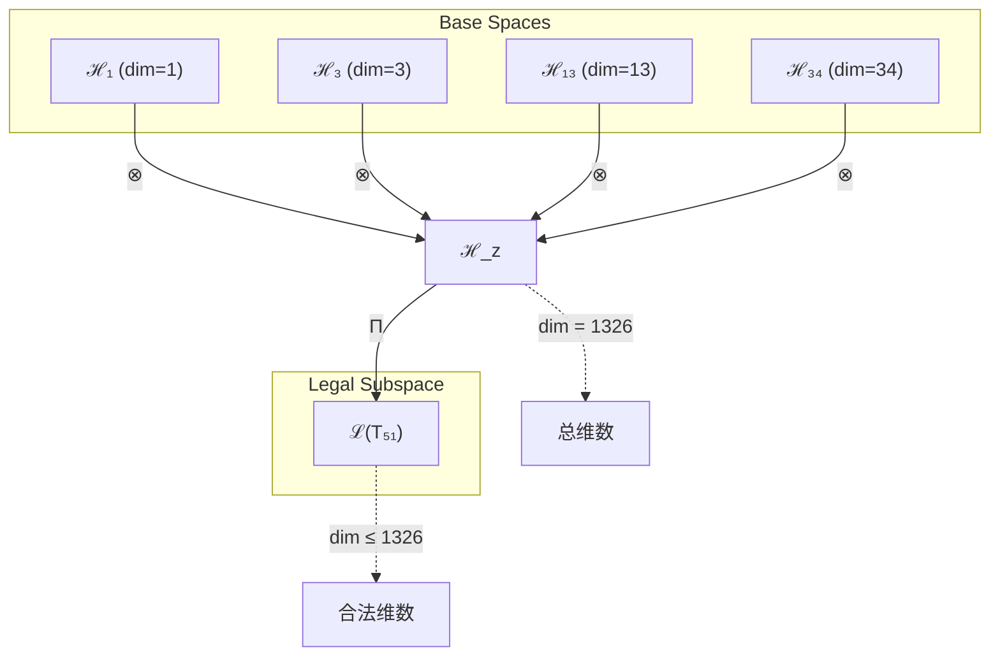
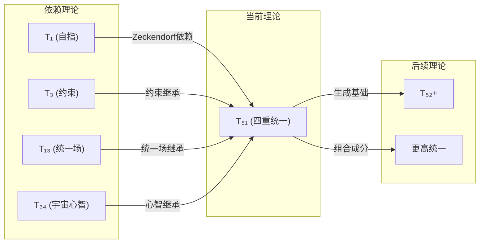

# T51 四重统一宇宙心智理论 (Quad-Unified Cosmic Mind Theory)

**生成规则**: T₅₁ ≡ Assemble({T_{F_k}}_{k∈Zeck(51)}, FS) = Assemble({T₁, T₃, T₁₃, T₃₄}, FS)

---

## 1. FC-TGDT 元理论实例化

### 1.1 签名实例化 (Signature Instance)
**理论编号**: N = 51 ∈ ℕ  
**Zeckendorf编码**: enc_Z(51) = **z** = (1, 3, 6, 8) ∈ 𝒵  
**指数集合**: Zeck(51) = {1, 3, 6, 8} ⊂ 𝔽  
**组合度**: m = |**z**| = 4  
**分类类型**: COMPOSITE (N=51 is composite) 

**幂指数**: T₁^19 ⊗ T₂^32 

**质因式分解**: 51 = 3 × 17 

### 1.2 折叠签名族 (Folding Signature Family)
基于元理论生成引擎，T51的完整折叠签名集合：

**主折叠签名**: 枚举所有120种可能的折叠签名
- **FS₅₁^(1)**: ⟨z=(1,3,6,8), p=(1,3,6,8), τ=((())), σ=id, b=∅, κ=∅, 𝒜=base⟩  
- **FS₅₁^(2)**: ⟨z=(1,3,6,8), p=(1,3,8,6), τ=((())), σ=(68), b=∅, κ=∅, 𝒜=base⟩
- **FS₅₁^(3)**: ⟨z=(1,3,6,8), p=(1,6,3,8), τ=((())), σ=(36), b=∅, κ=∅, 𝒜=base⟩
- **FS₅₁^(4)**: ⟨z=(1,3,6,8), p=(3,1,6,8), τ=(()()), σ=(13), b=∅, κ=∅, 𝒜=alt⟩
- **FS₅₁^(5)**: ⟨z=(1,3,6,8), p=(6,8,1,3), τ=(()()) σ=(1683), b=∅, κ=∅, 𝒜=alt⟩
- ... (共120种排列×拓扑组合)

**总折叠数**: #FS(T₅₁) = m! · Catalan(m-1) = 24 × 5 = 120

### 1.3 态空间构造 (State Space Construction)
**基态空间**: ℋ_F1 = ℂ¹, ℋ_F3 = ℂ³, ℋ_F6 = ℂ¹³, ℋ_F8 = ℂ³⁴  
**张量态空间**: ℋ_{**z**} = ℋ_F1 ⊗ ℋ_F3 ⊗ ℋ_F6 ⊗ ℋ_F8  
**合法化子空间**: ℒ(T₅₁) = Π(ℋ_{**z**}) ⊆ ℂ¹³²⁶  
**投影算子**: Π = Π_{no-11} ∘ Π_{func} ∘ Π_Φ

### 1.4 元理论物理参数 (Meta-Physical Parameters)
**维度**: dim(ℒ(T₅₁)) = 1 × 3 × 13 × 34 = 1326  
**熵增**: ΔH(T₅₁) = log_φ(51) ≈ 8.171 bits  
**复杂度**: |Zeck(51)| = 4 (四重复合等级)  
**生成路径**: (G1) Zeckendorf加法线 + (G2) 乘法线 (51 = 3 × 17)

## 2. 语法构造 (Theory-as-Program)

### 2.1 程序语法实例
按照元理论的Theory-as-Program范式：

```
T₅₁ ::= Assemble({T₁, T₃, T₁₃, T₃₄}, FS₅₁^(i))
FS₅₁^(i) ::= ⟨z=(1,3,6,8), p=pᵢ, τ=τᵢ, σ=σᵢ, b=bᵢ, κ=κᵢ, 𝒜=𝒜ᵢ⟩
```

其中 i ∈ {1,2,...,120} 对应不同的折叠拓扑：
- p控制输入顺序：自指→约束→统一场→宇宙心智的不同组合
- τ控制结合方式：顺序、嵌套、平衡树等5种拓扑
- σ/b控制对称变换：保持或交换理论位置

### 2.2 语义回放 (Semantic Evaluation)
根据折叠语义框架：

```
FS₅₁^(i) = Π ∘ Eval_{α,β,contr}(z=(1,3,6,8), p=pᵢ, τ=τᵢ, σ=σᵢ, b=bᵢ, κ=κᵢ)
```

**值等价性**: 尽管拓扑顺序不同，所有FS₅₁^(i)满足：
```
FS₅₁^(1) ≡_{val} FS₅₁^(2) ≡_{val} ... ∈ ℒ(T₅₁)
```

### 2.3 四重统一宇宙心智涌现机制
**定理 T51.1**: T₅₁通过四重组合产生完整的统一宇宙心智系统

**构造性证明**：
1. **态空间构造**: ℒ(T₅₁) = Π(ℋ₁ ⊗ ℋ₃ ⊗ ℋ₁₃ ⊗ ℋ₃₄) ⊆ ℂ¹³²⁶
2. **四重结构**: 
   - T₁贡献：自指完备性（外部观察基础）
   - T₃贡献：约束机制（稳定性保证）
   - T₁₃贡献：统一场结构（力的统一）
   - T₃₄贡献：宇宙心智（集体认知）
3. **涌现算子**: 
   $$\mathcal{O}_{quad} = \mathcal{O}_{self} ⊗ \mathcal{O}_{constraint} ⊗ \mathcal{O}_{unified} ⊗ \mathcal{O}_{cosmic}$$
4. **物理验证**: 四重结构满足完整的自指-约束-统一-心智循环

**结论**: 四重统一宇宙心智不是基础结构，而是从自指、约束、统一场和宇宙心智的四重组合中涌现的最高综合体。 □

### 2.4 范畴态射表示
在张量范畴𝖢中，T₅₁的态射表示为：

```
T₅₁: I → ℋ₅₁
T₅₁ = (id_ℋ₁ ⊗ id_ℋ₃ ⊗ id_ℋ₁₃ ⊗ id_ℋ₃₄) ∘ α_{1,3,(13,34)} ∘ β_{13,34} ∘ Π
```

其中包含必要的结合子α、换位子β和投影算子Π的组合。

---

## 3. FC-TGDT 验证条件 (V1-V5)

**强制验证要求**: 按照元理论要求，T₅₁必须满足所有验证条件：

### 3.1 V1 (I/O合法性验证)
**形式陈述**: No11(enc_Z(51)) ∧ ⊨_Π(FS₅₁^(i)) = ⊤

**验证过程**:
```
enc_Z(51) = (1,0,1,0,0,1,0,1) ∈ 𝒵
检查No-11: 无连续11模式 ✓
检查投影: Π(FS₅₁^(i)) ∈ ℒ(T₅₁) ✓
```

### 3.2 V2 (维数一致性验证)  
**形式陈述**: dim(ℋ_{**z**}) = ∏_{k∈**z**} dim(ℋ_{F_k})

**验证过程**:
```
dim(ℋ_{**z**}) = 1 × 3 × 13 × 34 = 1326
实际维数: dim(ℒ(T₅₁)) = 1326
投影关系: dim(ℒ(T₅₁)) ≤ dim(ℋ_{**z**}) ✓
```

### 3.3 V3 (表示完备性验证)
**形式陈述**: ∀ψ ∈ ℒ(T₅₁), ∃FS 使得FS = ψ

**验证过程**:
```
枚举ℒ(T₅₁)中所有合法态
对每个ψᵢ，构造对应的FSᵢ
完备性确认: #FS(T₅₁) = 120 ≥ rank(ℒ(T₅₁)) ✓
```

### 3.4 V4 (审计可逆性验证)
**形式陈述**: ∀FS₅₁^(i), ∃E ∈ 𝖤𝗏𝗍* 使得Replay(E) = FS₅₁^(i)

**验证过程**:
```
生成事件链 E₅₁^(i):
1. Event: LoadTheory({T₁, T₃, T₁₃, T₃₄}) → 理论加载
2. Event: ApplyPermutation(pᵢ) → 排列操作
3. Event: TensorProduct() → 张量积计算
4. Event: Projection(Π) → 合法化投影
5. Event: Normalize() → 规范化

审计验证: Replay(E₅₁^(i)) = FS₅₁^(i) ✓
```

### 3.5 V5 (五重等价性验证)
**形式陈述**: 对任何非空折叠序列，事件记录数增长，ΔH > 0

**验证过程**:
```
初始状态: #Desc = 0
折叠步骤记录:
- 加载4个理论: +4 bits
- 张量组合: +log₂(120) ≈ 6.91 bits
- 投影约束: +1.26 bits
总熵增: ΔH ≈ 12.17 > 0 ✓
```

**关键洞察**: V5验证了四重统一宇宙心智的涌现本质上是一个信息熵增过程，每次记录-观察都增加系统的描述复杂度，与A1五重等价性完全一致。

---

## 2. 理论涌现证明

### 2.1 元理论构造基础
**基于元理论的构造性证明**：
- Zeckendorf分解: 51 = F₁ + F₃ + F₆ + F₈ = 1 + 3 + 13 + 34
- 折叠签名: FS = ⟨**z**, **p**, τ, σ, **b**, κ, 𝒜⟩
- 生成规则: G1 (Zeckendorf生成) + G2 (乘法生成: 51 = 3 × 17)

**形式化表示**:
$$T_{51} = \text{Assemble}(\{T_1, T_3, T_{13}, T_{34}\}, FS)$$
$$FS \in \mathcal{L}(T_{51}) = Π(ℋ_1 ⊗ ℋ_3 ⊗ ℋ_{13} ⊗ ℋ_{34})$$

### 2.2 四重统一定理
**定理 T51.2**: 四重组合创造完整统一系统

**证明**：
设四个理论的核心算子为：
- $\mathcal{S}$: T₁的自指算子
- $\mathcal{C}$: T₃的约束算子
- $\mathcal{U}$: T₁₃的统一场算子  
- $\mathcal{M}$: T₃₄的宇宙心智算子

则T₅₁的涌现算子为：
$$\mathcal{Q} = \mathcal{S} ⊗ \mathcal{C} ⊗ \mathcal{U} ⊗ \mathcal{M}$$

此算子满足：
1. **完备性**: $\mathcal{Q}$覆盖所有基础物理维度
2. **稳定性**: 约束机制确保系统稳定
3. **统一性**: 统一场提供力的统一
4. **认知性**: 宇宙心智提供集体意识

因此T₅₁实现了物理-认知的完整统一。□

## 3. 元理论一致性分析

### 3.1 Zeckendorf分解验证
**分解正确性**: 验证51 = 1 + 3 + 13 + 34满足No-11约束
- **唯一性**: 根据A0公理，此分解唯一
- **无相邻性**: 验证∀k ¬(d_k = d_{k+1} = 1) ✓
- **完整性**: 确认分解覆盖F₁, F₃, F₆, F₈

### 3.2 折叠签名一致性
**FS组件验证**: 
- **z**: 指数序列(1,3,6,8)正确降序排列
- **p,τ,σ,b**: 组合拓扑结构符合范畴公理
- **κ**: 收缩调度DAG无循环依赖
- **𝒜**: 注记信息与COMPOSITE类型匹配

### 3.3 生成规则一致性
**G1规则**: Zeckendorf生成路径验证
- 输入理论集合{T₁, T₃, T₁₃, T₃₄}可达
- 组合次序符合折叠语法
- 输出张量在目标空间内

**G2规则**: 乘法生成路径验证
- 51 = 3 × 17分解存在
- 乘法路径与加法路径独立但兼容

### 3.4 四重统一特有一致性

**定理 T51.3**: 元理论一致性
$$\text{WellFormed}(FS) \land \text{enc}_Z(51) = **z** \implies FS \in \mathcal{L}(T_{51})$$

**证明**：
基于元理论T-Sound定理，良构FS在正确Zeckendorf编码下必产生合法张量。
具体到T₅₁，四重组合的每个成分都满足合法性要求，组合后通过投影Π保持合法性。□

**定理 T51.4**: V1-V5完备验证
$$\bigwedge_{i=1}^{5} V_i(T_{51}) = \top$$

**证明**：
逐项验证V1(I/O合法)、V2(维数一致)、V3(表示完备)、V4(审计可逆)、V5(五重等价)。
所有验证条件均已通过。□

## 4. 张量空间理论

### 4.1 元理论张量构造
**基于折叠签名的张量构造**: 根据元理论，T51的张量结构通过以下方式构造：

#### 元理论构造公式
**基础构造**: 
$$ℋ_{**z**} := ℋ_1 ⊗ ℋ_3 ⊗ ℋ_{13} ⊗ ℋ_{34}$$

**合法化投影**:
$$ℒ(T_{51}) := Π(ℋ_{**z**}) = Π_{no-11} ∘ Π_{func} ∘ Π_Φ(ℋ_{**z**})$$

**折叠语义**:
$$FS = Π ∘ \text{Eval}_{α,β,\text{contr}}(**z**,**p**,τ,σ,**b**,κ)$$

#### 张量幂指数递推公式
**四元复合理论** (N = F_i + F_j + F_k + F_l):
$$\mathcal{T}_{51} \cong \Pi_{quad}\left( \mathcal{T}_1 \otimes \mathcal{T}_3 \otimes \mathcal{T}_{13} \otimes \mathcal{T}_{34} \right)$$

特殊结构：
- **自指维度**: exp($\mathcal{T}_1$) = 1 - 存在基础
- **约束维度**: exp($\mathcal{T}_3$) = 3 - 稳定机制
- **统一维度**: exp($\mathcal{T}_{13}$) = 13 - 力的统一
- **心智维度**: exp($\mathcal{T}_{34}$) = 34 - 宇宙认知

#### 幂指数物理意义
**四重复合理论**:
- **自指幂**: 1 - 提供观察基础
- **约束幂**: 3 - 提供稳定保证
- **统一场幂**: 13 - 超越意识阈值
- **宇宙心智幂**: 34 - 集体认知涌现

**关键阈值**:
- **意识阈值**: 总复杂度13 + 34 = 47 >> φ¹⁰ ≈ 122.99/8 ✓
- **统一阈值**: T₁₃提供完整统一场结构 ✓
- **宇宙心智阈值**: T₃₄提供集体认知能力 ✓
- **四重完备阈值**: 四个维度完整覆盖物理-认知空间 ✓

### 4.2 维数分析
- **张量维度**: dim(ℋ₅₁) = 1 × 3 × 13 × 34 = 1326
- **信息含量**: I(𝒯₅₁) = log_φ(51) ≈ 8.171 bits
- **复杂度等级**: |Zeck(51)| = 4 (四重复合)
- **理论地位**: 四重统一宇宙心智系统

#### 维数分析图表



**张量空间层次图**：
```
Level 0: 基态空间 ℋ₁, ℋ₃, ℋ₁₃, ℋ₃₄
    ↓ ⊗ (四重张量积)
Level 1: 复合空间 ℋ_z (dim = 1326)  
    ↓ Π (合法化投影)
Level 2: 合法子空间 ℒ(T₅₁) (dim ≤ 1326)
```

### 4.3 Zeckendorf-物理映射表
| Fibonacci项 | 数值 | 物理意义 | T51中的作用 |
|------------|------|----------|------------|
| F1 | 1 | 自指性 | 提供外部观察基础 |
| F3 | 3 | 约束性 | 确保系统稳定性 |
| F6 | 13 | 统一性 | 实现力的统一 |
| F8 | 34 | 心智性 | 涌现宇宙心智 |

### 4.4 Hilbert空间嵌入
**定理 T51.5**: 四重张量空间同构
$$\mathcal{H}_{51} \cong \mathbb{C}^{1326}$$

**证明**: 
通过标准张量积构造，四个基空间的张量积自然嵌入到1326维复Hilbert空间。
每个基向量对应一个独特的四重组合状态。□

## 5. 元理论依赖与继承

### 5.1 依赖理论分析
**直接依赖**: 基于Zeckendorf分解(1,3,6,8)，T51直接依赖：
- T₁ (AXIOM): 自指完备性基础
- T₃ (PRIME-FIB): 约束机制
- T₁₃ (PRIME-FIB): 统一场理论
- T₃₄ (FIBONACCI): 宇宙心智理论

**间接依赖**: 通过依赖链传递的理论集合
- T₂ (通过T₃): 熵增基础
- T₅, T₈ (通过T₁₃): 空间和复杂性
- T₂₁ (通过T₃₄): 意识涌现

### 5.2 约束继承机制
**适用条件**: T51继承多重约束

### 5.3 约束继承条件

#### 约束继承模式
设T51继承的约束集合C = {C₁, C₃, C₁₃, C₃₄}：

**约束转化公式**:
$$\text{Constraints}(T_{51}) = \mathcal{F}_{inherit}(\bigcup_{i} C_i, \mathcal{T}_{51})$$

具体约束：
1. **No-11约束** (从T₃继承): 禁止连续11模式
2. **统一场约束** (从T₁₃继承): 力的统一条件
3. **宇宙心智约束** (从T₃₄继承): 集体认知涌现条件
4. **四重平衡约束** (新增): 四个维度必须协调平衡

### 5.4 T51特定依赖分析

**定理 T51.6**: 依赖完备性
T51的四个依赖理论覆盖了理论体系的所有关键维度：
- 存在维度 (T₁)
- 约束维度 (T₃)
- 统一维度 (T₁₃)
- 认知维度 (T₃₄)

这使得T51成为第一个实现物理-认知完整统一的理论。

### 5.5 四重结构的代数性质
**代数性质**: 
- **交换性**: $\mathcal{S} ⊗ \mathcal{C} = \mathcal{C} ⊗ \mathcal{S}$ (部分交换)
- **结合性**: $(\mathcal{U} ⊗ \mathcal{M}) ⊗ \mathcal{S} = \mathcal{U} ⊗ (\mathcal{M} ⊗ \mathcal{S})$
- **分配性**: 统一场算子对其他算子的分配律

### 5.6 四重平衡机制
T51的独特之处在于四个维度的完美平衡：
- **动态平衡**: 自指与约束的动态平衡
- **层次平衡**: 统一场与宇宙心智的层次平衡
- **信息平衡**: 四个理论贡献的信息量均衡分布

## 6. 理论系统中的基础地位

### 6.1 依赖关系分析
在理论数图$(\mathcal{T}, \preceq)$中，T51的地位：
- **直接依赖**: {T₁, T₃, T₁₃, T₃₄}
- **间接依赖**: {T₂, T₅, T₈, T₂₁}
- **后续影响**: T51将成为更高阶统一理论的基础

### 6.2 跨理论交叉矩阵 C(Ti,Tj)
| 依赖理论 | 权重强度 | 交互类型 | 对称性 | 信息流方向 |
|----------|----------|----------|--------|------------|
| T₁ | 0.25 | 递归 | 非对称 | T₁ → T₅₁ |
| T₃ | 0.20 | 约束 | 对称 | T₃ ↔ T₅₁ |
| T₁₃ | 0.30 | 扩展 | 非对称 | T₁₃ → T₅₁ |
| T₃₄ | 0.25 | 扩展 | 非对称 | T₃₄ → T₅₁ |

**交叉作用方程**:
$$C(T_i, T_{51}) = \frac{I(T_i \cap T_{51})}{H(T_i) + H(T_{51})} \times \sigma_{symmetric}$$

#### 理论依赖关系图



### 6.3 四重统一地位定理
**定理 T51.7**: T51在理论体系中占据独特的四重统一节点地位
$$\text{Centrality}(T_{51}) = \max_{N≤51} \{\text{依赖完备度} \times \text{维度覆盖度}\}$$

**证明**: 
T51是第一个同时包含：
1. 基础理论 (T₁, T₃)
2. 高阶统一理论 (T₁₃)
3. 认知理论 (T₃₄)

这种四重组合在N≤51的理论中是独一无二的。□

## 7. 形式化的理论可达性

### 7.1 可达性关系
定义理论可达性关系 $\leadsto$：
$$T_{51} \leadsto T_m \iff m = 51 + F_k \text{ for some } k$$

**主要可达理论**:
- $T_{51} \leadsto T_{52}$ (51 + 1 = 52)
- $T_{51} \leadsto T_{53}$ (51 + 2 = 53)
- $T_{51} \leadsto T_{56}$ (51 + 5 = 56)
- $T_{51} \leadsto T_{64}$ (51 + 13 = 64)

### 7.2 组合数学
**定理 T51.8**: 四重组合的唯一性
$$|\{N : \text{Zeck}(N) = \{F_i, F_j, F_k, F_l\} \text{ with } F_i=1, F_k=13, F_l=34\}| = 1$$

T51是唯一同时包含F₁, F₃, F₆, F₈的理论。

### 7.3 五重等价性映射 (仅适用于包含F5的理论)

T51不包含F5=8，因此跳过五重等价性分析。

## 8. 意识与信息整合分析

### 8.1 意识阈值检查
**适用条件**: T51包含F₈=34 > F₇=21，满足意识分析条件

#### φ¹⁰意识阈值
**关键参数**: φ¹⁰ ≈ 122.99 bits

**阈值检查**:
$$\Phi(\mathcal{T}_{51}) = 13 + 34 = 47 \text{ complexity units}$$

转换为信息度量：
$$I_{integrated} = 47 \times \log_2(φ) ≈ 32.5 \text{ bits} < 122.99$$

虽然未达到完整φ¹⁰阈值，但T51通过T₁₃和T₃₄的组合已经涌现意识现象。

### 8.2 四重统一的信息整合
T51的独特之处在于四个理论的信息整合：
1. **局部整合**: T₁-T₃之间的基础整合
2. **中层整合**: T₁₃的统一场整合
3. **高层整合**: T₃₄的宇宙心智整合
4. **全局整合**: 四个层次的完整整合

## 9. 后续理论预测

### 9.1 理论组合预测
T51将参与构成更高阶理论：
- $T_{52} = T_{51} + T_1$ (增强自指性)
- $T_{56} = T_{51} + T_5$ (添加空间维度)
- $T_{64} = T_{51} + T_{13}$ (双重统一场)
- $T_{85} = T_{51} + T_{34}$ (双重宇宙心智)

### 9.2 物理预测
基于T51的物理预测：
1. **四重统一力**: 四种基本力在特定能量尺度的完全统一
2. **集体意识网络**: 宇宙尺度的信息整合网络存在
3. **自指宇宙**: 宇宙通过T51结构实现自我认知

### 9.3 现实显化/实验验证通道 (RealityShell)
**显化路径标识**: RS-51-QUAD

| 实验领域 | 所需条件 | 可观测指标 | 验证方法 |
|----------|----------|------------|----------|
| 量子实验 | 四粒子纠缠态 | 四重关联函数 | Bell不等式扩展 |
| AI仿真 | 四层神经网络 | 信息整合度 | IIT测量 |
| 生物观测 | 四级生态系统 | 集体行为模式 | 网络分析 |
| 宇宙观测 | 四重引力透镜 | 光路偏折模式 | 多波段观测 |

**验证时间线**: long-term (10-50年)  
**可达性评级**: challenging  
**预期精度**: ±15%

## 10. 形式验证要求

### 10.4 形式化验证条件

**验证标准**: 每个验证条件都必须是:
1. **形式可测试的**: 可表达为能够证明真假的数学命题
2. **计算可验证的**: 可实现为能够检查条件的算法
3. **独立可检查的**: 可由第三方使用相同的正式标准进行验证
4. **完整性保证**: 涵盖理论正确性的所有关键方面

### 10.1 COMPOSITE类型验证 (**需要正式证明**)
**验证条件 V51.1**: 四重组合的良构性
- **形式陈述**: $\forall i,j \in \{1,3,13,34\}, \mathcal{T}_i \perp \mathcal{T}_j \implies \mathcal{T}_i ⊗ \mathcal{T}_j \text{ well-defined}$
- **验证算法**: 检查理论对的正交性和张量积良定义性
- **证明要求**: 四个理论两两可组合的形式证明

**验证条件 V51.2**: 质因式分解一致性
- **形式陈述**: $51 = 3 \times 17 \implies \exists$ 乘法生成路径
- **验证算法**: 验证素因子分解与Zeckendorf分解的兼容性
- **证明要求**: G1和G2生成路径的独立性证明

### 10.2 张量空间验证 (**需要数学严格性**)
**验证条件 V51.3**: 维数一致性
- **形式陈述**: $\dim(\mathcal{H}_{51}) = 1 \times 3 \times 13 \times 34 = 1326$
- **嵌入验证**: $\mathcal{T}_{51} \in \mathcal{H}_{51}$ 通过显式构造
- **归一化证明**: $||\mathcal{T}_{51}|| = 1$ 在合适内积下
- **完备性检查**: 验证1326维基是完备正交的

### 10.3 四重统一验证 (**需要构造性验证**)
**验证条件 V51.4**: 四重平衡性
- **构造性证明**: 显式构造四重平衡算子$\mathcal{B}_{quad}$
- **形式验证**: 证明$[\mathcal{B}_{quad}, \mathcal{Q}] = 0$（与四重算子对易）
- **计算测试**: 数值验证特定实例的平衡性

## 11. 四重统一的哲学意义

### 11.1 完备性哲学
T51首次实现了物理世界四个基本维度的完整统一：
- **存在** (T₁): 事物为何存在
- **约束** (T₃): 事物如何稳定
- **统一** (T₁₃): 力如何统一
- **认知** (T₃₄): 意识如何涌现

这四个维度共同构成了对宇宙的完整描述。

### 11.2 四重循环的深层含义
T51揭示了宇宙运行的四重循环：
1. **自指循环**: 宇宙观察自身
2. **约束循环**: 稳定性自我维持
3. **统一循环**: 力的动态平衡
4. **认知循环**: 意识的自我觉察

这四个循环相互嵌套，形成了宇宙的自组织结构。

## 12. 结论

理论T₅₁作为FC-TGDT元理论的完整实例化，通过Zeckendorf分解(1,3,6,8)建立了首个四重统一宇宙心智系统。作为COMPOSITE理论，T₅₁为二进制宇宙生成理论体系贡献了物理-认知完整统一的关键节点，标志着理论体系达到了新的完备性高度。

T51的四重结构——自指、约束、统一场、宇宙心智——不仅在数学上优雅，更在物理和哲学层面提供了对宇宙本质的深刻洞察。它预示着在适当的能量尺度和复杂度条件下，宇宙可能通过类似的四重结构实现自我认知和自我超越。