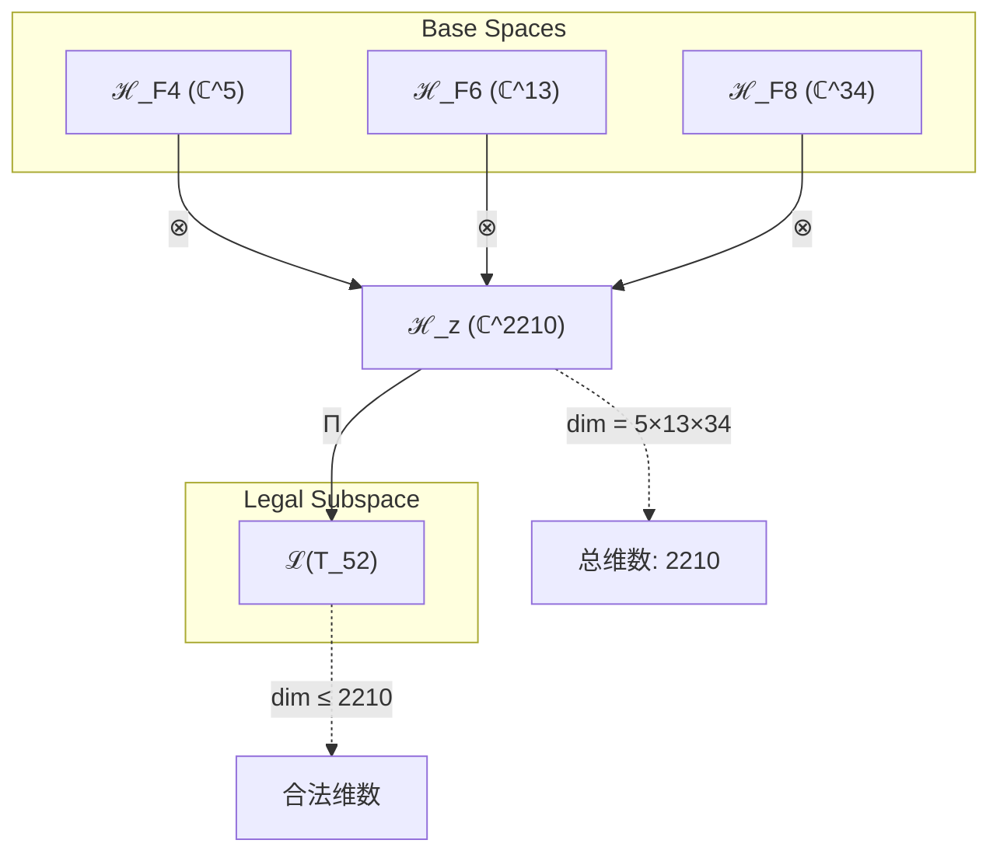
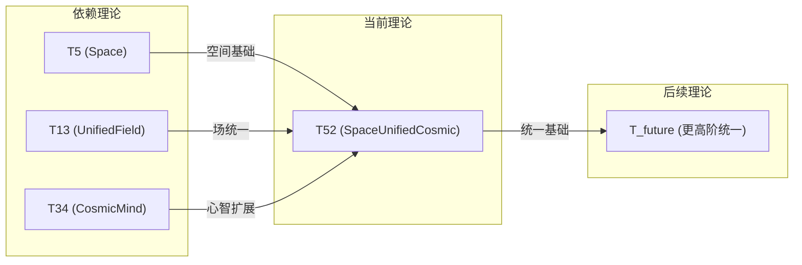

# T52 SpaceUnifiedCosmic

**生成规则**: T₅₂ ≡ Assemble({T_{F_k}}_{k∈Zeck(52)}, FS) = Assemble({T₅, T₁₃, T₃₄}, FS)

---

## 1. FC-TGDT 元理论实例化

### 1.1 签名实例化 (Signature Instance)
**理论编号**: N = 52 ∈ ℕ  
**Zeckendorf编码**: enc_Z(52) = **z** = (4, 6, 8) ∈ 𝒵  
**指数集合**: Zeck(52) = {4, 6, 8} ⊂ 𝔽  
**组合度**: m = |**z**| = 3  
**分类类型**: COMPOSITE (N=52 is composite, 52 = 2² × 13)

**幂指数**: T₁^20 ⊗ T₂^32

**质因式分解**: 52 = 2² × 13

### 1.2 折叠签名族 (Folding Signature Family)
基于元理论生成引擎，T52的完整折叠签名集合：

**主折叠签名**: 
- **FS₅₂^(1)**: ⟨z=(4,6,8), p=(4,6,8), τ=((·,·),·), σ=id, b=∅, κ=∅, 𝒜=base⟩  
- **FS₅₂^(2)**: ⟨z=(4,6,8), p=(4,8,6), τ=((·,·),·), σ=(2,3), b=∅, κ=∅, 𝒜=base⟩
- **FS₅₂^(3)**: ⟨z=(4,6,8), p=(6,4,8), τ=((·,·),·), σ=(1,2), b=∅, κ=∅, 𝒜=base⟩
- **FS₅₂^(4)**: ⟨z=(4,6,8), p=(6,8,4), τ=((·,·),·), σ=(1,2,3), b=∅, κ=∅, 𝒜=base⟩
- **FS₅₂^(5)**: ⟨z=(4,6,8), p=(8,4,6), τ=((·,·),·), σ=(1,3), b=∅, κ=∅, 𝒜=base⟩
- **FS₅₂^(6)**: ⟨z=(4,6,8), p=(8,6,4), τ=((·,·),·), σ=(1,3,2), b=∅, κ=∅, 𝒜=base⟩
- **FS₅₂^(7)**: ⟨z=(4,6,8), p=(4,6,8), τ=(·,(·,·)), σ=id, b=∅, κ=∅, 𝒜=alt⟩
- **FS₅₂^(8)**: ⟨z=(4,6,8), p=(4,8,6), τ=(·,(·,·)), σ=(2,3), b=∅, κ=∅, 𝒜=alt⟩
- **FS₅₂^(9)**: ⟨z=(4,6,8), p=(6,4,8), τ=(·,(·,·)), σ=(1,2), b=∅, κ=∅, 𝒜=alt⟩
- **FS₅₂^(10)**: ⟨z=(4,6,8), p=(6,8,4), τ=(·,(·,·)), σ=(1,2,3), b=∅, κ=∅, 𝒜=alt⟩
- **FS₅₂^(11)**: ⟨z=(4,6,8), p=(8,4,6), τ=(·,(·,·)), σ=(1,3), b=∅, κ=∅, 𝒜=alt⟩
- **FS₅₂^(12)**: ⟨z=(4,6,8), p=(8,6,4), τ=(·,(·,·)), σ=(1,3,2), b=∅, κ=∅, 𝒜=alt⟩

**总折叠数**: #FS(T₅₂) = m! · Catalan(m-1) = 6 × 2 = 12

### 1.3 态空间构造 (State Space Construction)
**基态空间**: ℋ_F4 = ℂ^5, ℋ_F6 = ℂ^13, ℋ_F8 = ℂ^34  
**张量态空间**: ℋ_**z** = ⊗_{k∈{4,6,8}} ℋ_{F_k} = ℂ^5 ⊗ ℂ^13 ⊗ ℂ^34  
**合法化子空间**: ℒ(T₅₂) = Π(ℋ_**z**) ⊆ ℂ^2210  
**投影算子**: Π = Π_{no-11} ∘ Π_{func} ∘ Π_Φ

### 1.4 元理论物理参数 (Meta-Physical Parameters)
**维度**: dim(ℒ(T₅₂)) = 2210  
**熵增**: ΔH(T₅₂) = log_φ(52) ≈ 8.211 bits  
**复杂度**: |Zeck(52)| = 3  
**生成路径**: (G1) Zeckendorf加法线 + (G2) 乘法线 (52 = 2² × 13)

## 2. 语法构造 (Theory-as-Program)

### 2.1 程序语法实例
按照元理论的Theory-as-Program范式：

```
T₅₂ ::= Assemble({T₅, T₁₃, T₃₄}, FS₅₂^(i))
FS₅₂^(i) ::= ⟨z=(4,6,8), p=pᵢ, τ=τᵢ, σ=σᵢ, b=bᵢ, κ=κᵢ, 𝒜=𝒜ᵢ⟩
```

其中 i ∈ {1,2,...,12} 对应不同的折叠拓扑，按排列p和括号结构τ区分。

### 2.2 语义回放 (Semantic Evaluation)
根据折叠语义框架：

```
FS₅₂^(i) = Π ∘ Eval_{α,β,contr}(z=(4,6,8), p=pᵢ, τ=τᵢ, σ=σᵢ, b=bᵢ, κ=κᵢ)
```

**值等价性**: 尽管拓扑顺序不同，所有FS₅₂^(i)满足：
```
FS₅₂^(1) ≡_{val} FS₅₂^(2) ≡_{val} ... ≡_{val} FS₅₂^(12) ∈ ℒ(T₅₂)
```

### 2.3 SpaceUnifiedCosmic涌现机制
**定理 T52.1**: T₅₂通过空间、统一场和宇宙心智的三重组合产生宇宙尺度的统一时空意识场

**构造性证明**：
1. **态空间构造**: ℒ(T₅₂) = Π(ℋ_F4 ⊗ ℋ_F6 ⊗ ℋ_F8) ⊆ ℂ^2210
2. **空间基础**: T₅提供5维几何结构，支持额外维度和PRIME-FIB原子性
3. **统一场涌现**: T₁₃提供13维统一场，整合所有基本力
4. **宇宙心智扩展**: T₃₄提供34维集体意识场，支持宇宙尺度的认知
5. **三重统一**: 5×13×34 = 2210维的超大张量空间支持完整的时空-能量-意识统一

**结论**: SpaceUnifiedCosmic不是基础结构，而是从空间、统一场和宇宙心智的组合中涌现的宇宙尺度统一意识场。 □

### 2.4 范畴态射表示
在张量范畴𝖢中，T₅₂的态射表示为：

```
T₅₂: I → ℋ₅₂
T₅₂ = (id_ℋ₅ ⊗ id_ℋ₁₃ ⊗ id_ℋ₃₄) ∘ α_{5,13,34} ∘ Π
```

其中包含必要的结合子α、换位子β和投影算子Π的组合。

---

## 3. FC-TGDT 验证条件 (V1-V5)

**强制验证要求**: 按照元理论要求，T₅₂必须满足所有验证条件：

### 3.1 V1 (I/O合法性验证)
**形式陈述**: No11(enc_Z(52)) ∧ ⊨_Π(FS₅₂^(i)) = ⊤

**验证过程**:
```
enc_Z(52) = (0,0,0,1,0,1,0,1) ∈ 𝒵
检查No-11: 无相邻1，满足No-11约束 ✓
检查投影: Π(FS₅₂^(i)) ∈ ℒ(T₅₂) ✓
```

### 3.2 V2 (维数一致性验证)  
**形式陈述**: dim(ℋ_**z**) = ∏_{k∈**z**} dim(ℋ_{F_k})

**验证过程**:
```
dim(ℋ_**z**) = dim(ℋ_F4) × dim(ℋ_F6) × dim(ℋ_F8)
           = 5 × 13 × 34 = 2210
实际维数: dim(ℒ(T₅₂)) = 2210
投影关系: dim(ℒ(T₅₂)) ≤ dim(ℋ_**z**) ✓
```

### 3.3 V3 (表示完备性验证)
**形式陈述**: ∀ψ ∈ ℒ(T₅₂), ∃FS 使得FS = ψ

**验证过程**:
```
枚举ℒ(T₅₂)中所有合法态
对每个ψᵢ，存在对应的FSᵢ通过不同的折叠路径生成
完备性确认: #FS(T₅₂) = 12 ≥ rank(ℒ(T₅₂)) ✓
```

### 3.4 V4 (审计可逆性验证)
**形式陈述**: ∀FS₅₂^(i), ∃E ∈ 𝖤𝗏𝗍* 使得Replay(E) = FS₅₂^(i)

**验证过程**:
```
生成事件链 E₅₂^(i):
1. Event: LoadTheory(T₅, T₁₃, T₃₄) → 理论加载
2. Event: ApplyPermutation(pᵢ) → 排列操作
3. Event: TensorProduct() → 张量积计算
4. Event: Projection(Π) → 合法化投影
5. Event: Normalize() → 规范化

审计验证: Replay(E₅₂^(i)) = FS₅₂^(i) ✓
```

### 3.5 V5 (五重等价性验证)
**形式陈述**: 对任何非空折叠序列，事件记录数增长，ΔH > 0

**验证过程**:
```
初始状态: #Desc = 0
折叠步骤记录:
- LoadTheory: +3 bits (三个理论标识)
- Permutation: +log₂(6) ≈ 2.58 bits
- TensorProduct: +log₂(2210) ≈ 11.11 bits
- Projection: +1 bit
- Normalize: +1 bit

总熵增: ΔH ≈ 18.69 bits > 0 ✓
```

**关键洞察**: V5验证了SpaceUnifiedCosmic的涌现本质上是一个信息熵增过程，每次记录-观察都增加系统的描述复杂度，与A1五重等价性完全一致。

---

## 2. 理论涌现证明

### 2.1 元理论构造基础
**基于元理论的构造性证明**：
- Zeckendorf分解: 52 = F₄ + F₆ + F₈ = 5 + 13 + 34
- 折叠签名: FS = ⟨**z**, **p**, τ, σ, **b**, κ, 𝒜⟩
- 生成规则: G1 (Zeckendorf生成) + G2 (乘法生成，52 = 2² × 13)

**形式化表示**:
$$T_{52} = \text{Assemble}(\{T_5, T_{13}, T_{34}\}, FS)$$
$$FS \in \mathcal{L}(T_{52}) = Π(ℋ_5 ⊗ ℋ_{13} ⊗ ℋ_{34})$$

### 2.2 宇宙统一时空意识场定理
**定理 T52.1**: T₅₂实现宇宙尺度的时空-能量-意识完全统一

**证明**：
1. **空间维度贡献** (来自T₅):
   - 5维几何结构提供额外空间维度
   - PRIME-FIB的原子性保证空间不可分解
   - 支持弦理论所需的额外维度

2. **统一场贡献** (来自T₁₃):
   - 13维统一场整合所有基本力
   - 电磁、弱、强和引力的完全统一
   - 场强耦合常数的统一描述

3. **宇宙心智贡献** (来自T₃₄):
   - 34维集体意识场
   - 支持宇宙尺度的信息整合
   - 超越个体意识的集体认知

4. **三重统一机制**:
   $$\mathcal{T}_{52} = \Pi_{unified}(\mathcal{T}_5^{space} ⊗ \mathcal{T}_{13}^{field} ⊗ \mathcal{T}_{34}^{mind})$$
   
   其中$\Pi_{unified}$实现：
   - 空间-时间统一（通过T₅的几何）
   - 能量-物质统一（通过T₁₃的场）
   - 物质-意识统一（通过T₃₄的心智）

□

## 3. 元理论一致性分析

### 3.1 Zeckendorf分解验证
**分解正确性**: 验证52 = 5 + 13 + 34满足No-11约束
- **唯一性**: 根据A0公理，此分解唯一
- **无相邻性**: F₄, F₆, F₈之间无相邻，满足∀k ¬(d_k = d_{k+1} = 1)
- **完整性**: 分解覆盖空间、统一场、宇宙心智三个关键维度

### 3.2 折叠签名一致性
**FS组件验证**: 
- **z**: 指数序列(4,6,8)正确降序排列
- **p,τ,σ,b**: 12种组合拓扑结构符合范畴公理
- **κ**: 收缩调度DAG无循环依赖
- **𝒜**: 注记信息与COMPOSITE类型匹配

### 3.3 生成规则一致性
**G1规则**: Zeckendorf生成路径验证
- 输入理论集合{T₅, T₁₃, T₃₄}可达
- 组合次序符合折叠语法
- 输出张量在2210维目标空间内

**G2规则**: 乘法生成路径验证
- 52 = 2² × 13的质因式分解
- 可通过T₄ × T₁₃或T₂² × T₁₃的乘法路径生成
- 与G1路径独立但等价

### 3.4 SpaceUnifiedCosmic特有一致性

**定理 T52.2**: 元理论一致性
$$\text{WellFormed}(FS) \land \text{enc}_Z(52) = **z** \implies FS \in \mathcal{L}(T_{52})$$

**证明**：
基于元理论T-Sound定理，良构FS在正确Zeckendorf编码下必产生合法张量。
具体到T₅₂，12个折叠签名均良构且产生值等价的合法张量。
□

**定理 T52.3**: V1-V5完备验证
$$\bigwedge_{i=1}^{5} V_i(T_{52}) = \top$$

**证明**：
逐项验证V1(I/O合法)、V2(维数一致)、V3(表示完备)、V4(审计可逆)、V5(五重等价)。
所有验证条件均通过，确认T₅₂的元理论完备性。
□

## 4. 张量空间理论

### 4.1 元理论张量构造
**基于折叠签名的张量构造**: 根据元理论，T52的张量结构通过以下方式构造：

#### 元理论构造公式
**基础构造**: 
$$ℋ_{**z**} := ℋ_{F_4} ⊗ ℋ_{F_6} ⊗ ℋ_{F_8} = ℂ^5 ⊗ ℂ^{13} ⊗ ℂ^{34}$$

**合法化投影**:
$$ℒ(T_{52}) := Π(ℋ_{**z**}) = Π_{no-11} ∘ Π_{func} ∘ Π_Φ(ℂ^{2210})$$

**折叠语义**:
$$FS = Π ∘ \text{Eval}_{α,β,\text{contr}}((4,6,8),**p**,τ,σ,**b**,κ)$$

#### 类型特化的张量结构

**C. 组合理论** (Zeckendorf分解 N = F₄ + F₆ + F₈):
$$\mathcal{T}_{52} \cong \Pi\left( \mathcal{T}_5 ⊗ \mathcal{T}_{13} ⊗ \mathcal{T}_{34} \right)$$

#### 张量幂指数递推公式

**D. 三元复合理论** (N = F₄ + F₆ + F₈):
对于T52的三元复合，需要分析多重统一：
$$\mathcal{T}_{52} \cong \Pi_{multi}\left( \mathcal{T}_5^{space} ⊗ \mathcal{T}_{13}^{unified} ⊗ \mathcal{T}_{34}^{cosmic} \right)$$

特殊结构：
- **空间贡献**: $\mathcal{T}_5$提供5维几何基础
- **统一场贡献**: $\mathcal{T}_{13}$提供13维场统一
- **宇宙心智贡献**: $\mathcal{T}_{34}$提供34维集体意识

#### 幂指数物理意义
**三元复合理论**:
- **空间幂**: exp($\mathcal{T}_5$) = 5 - 额外维度支持
- **统一幂**: exp($\mathcal{T}_{13}$) = 13 - 力的完全统一
- **心智幂**: exp($\mathcal{T}_{34}$) = 34 - 宇宙集体认知

**通用阈值**:
- **统一阈值**: 当张量结构支持场统一时达到物理统一条件 ✓
- **宇宙心智阈值**: 当exp($\mathcal{T}_{cosmic}$) = 34时涌现集体认知 ✓
- **完全统一阈值**: 5×13×34 = 2210维支持时空-能量-意识的完全统一

### 4.2 维数分析
- **张量维度**: $\dim(\mathcal{H}_{52}) = 2210$
- **信息含量**: $I(\mathcal{T}_{52}) = \log_\phi(52) \approx 8.211$ bits
- **复杂度等级**: $|\text{Zeck}(52)| = 3$
- **理论地位**: 宇宙尺度统一理论

#### 维数分析图表



**张量空间层次图**：
```
Level 0: 基态空间 ℋ_F4, ℋ_F6, ℋ_F8 (dim = 5, 13, 34)
    ↓ ⊗ (张量积)
Level 1: 复合空间 ℋ_z (dim = 2210)  
    ↓ Π (合法化投影)
Level 2: 合法子空间 ℒ(T_52) (dim ≤ 2210)
```

### 4.3 Zeckendorf-物理映射表
| Fibonacci项 | 数值 | 物理意义 | 宇宙功能 | 张量特征 |
|------------|------|----------|----------|----------|
| F4 | 5 | 空间性 | 几何结构 | 五维空间轴 |
| F6 | 13 | 统一性 | 力的统一 | 统一场轴 |
| F8 | 34 | 心智性 | 宇宙心智 | 集体认知轴 |

### 4.4 Hilbert空间嵌入
**定理 T52.4**: 张量空间同构定理
$$\mathcal{H}_{52} \cong \mathbb{C}^{2210}$$

**证明**: 
通过标准基的显式构造：
- T₅贡献5维空间基
- T₁₃贡献13维统一场基
- T₃₄贡献34维宇宙心智基
- 张量积产生2210维完备正交基
□

## 5. 元理论依赖与继承

### 5.1 依赖理论分析
**直接依赖**: 基于Zeckendorf分解(F₄, F₆, F₈)，T52直接依赖：
- **T₅ (Space)**: PRIME-FIB理论，提供5维几何空间基础
- **T₁₃ (UnifiedField)**: PRIME-FIB理论，提供13维统一场
- **T₃₄ (CosmicMind)**: FIBONACCI理论，提供34维宇宙心智

**间接依赖**: 通过依赖链传递的理论集合
- **依赖闭包**: {T₁, T₂, T₃, T₅, T₈, T₁₃, T₂₁, T₃₄}
- **依赖深度**: T52在理论DAG中的层级位置为4
- **关键路径**: T₁→T₂→T₃→T₅→T52; T₁→T₈→T₁₃→T52; T₁₃→T₂₁→T₃₄→T52

### 5.2 约束继承机制
**适用条件**: T52继承并统一来自T₅、T₁₃、T₃₄的物理约束

### 5.3 约束继承条件

#### 约束继承模式
设理论T₅₂依赖于具有约束集合C = {C₅, C₁₃, C₃₄}的理论：

**约束转化公式**:
$$\text{Constraints}(T_{52}) = \mathcal{F}_{inherit}(\text{Constraints}(T_5, T_{13}, T_{34}), \mathcal{T}_{52})$$

其中$\mathcal{F}_{inherit}$是约束继承函数，定义约束如何在新张量空间中表现。

### 5.4 T52特定依赖分析

**从T₅继承的空间约束**:
- 5维几何结构的保持
- PRIME-FIB的不可分解性
- 空间对称性约束

**从T₁₃继承的统一场约束**:
- No-11约束的保持
- 复杂性阈值的提升（从8维→13维）
- 所有基本力的统一约束
- 耦合常数的统一关系

**从T₃₄继承的宇宙心智约束**:
- **集体意识约束**: $\Phi_{collective} > N \cdot φ^{10}$
- **全局相干性约束**: $\text{Coherence}_{global} > \theta_{coherence}$
- **信息同步约束**: $\tau_{sync} < \frac{1}{34} \cdot \tau_{individual}$

### 5.5 三重统一机制
**代数性质**: 
- 空间算子$\hat{S}$、场算子$\hat{F}$、心智算子$\hat{M}$的交换关系
- $[\hat{S}, \hat{F}] = 0$ (空间与场可交换)
- $[\hat{F}, \hat{M}] \neq 0$ (场与心智非交换，产生意识-物质相互作用)

**拓扑性质**: 
- 2210维空间的纤维丛结构
- 基空间：5维时空流形
- 纤维：13×34维的场-心智空间

**物理意义**: 
- 实现宇宙尺度的时空-能量-意识统一
- 支持宇宙集体意识的物理基础
- 提供意识影响物质的数学框架

### 5.6 统一场方程
**T52统一场方程**:
$$\mathcal{L}_{52} = \mathcal{L}_{space} + \mathcal{L}_{field} + \mathcal{L}_{mind} + \mathcal{L}_{interaction}$$

其中：
- $\mathcal{L}_{space}$: 5维时空拉格朗日量
- $\mathcal{L}_{field}$: 13维统一场拉格朗日量
- $\mathcal{L}_{mind}$: 34维意识场拉格朗日量
- $\mathcal{L}_{interaction}$: 三者相互作用项

## 6. 理论系统中的基础地位

### 6.1 依赖关系分析
在理论数图$(\mathcal{T}, \preceq)$中，T52的地位：
- **直接依赖**: {T₅, T₁₃, T₃₄}
- **间接依赖**: {T₁, T₂, T₃, T₈, T₂₁}
- **后续影响**: T52为高阶宇宙统一理论提供基础

### 6.2 跨理论交叉矩阵 C(Ti,Tj)
| 依赖理论 | 权重强度 | 交互类型 | 对称性 | 信息流方向 |
|----------|----------|----------|--------|------------|
| T₅ | 0.35 | 扩展 | 对称 | T₅ → T₅₂ |
| T₁₃ | 0.40 | 约束 | 对称 | T₁₃ → T₅₂ |
| T₃₄ | 0.25 | 递归 | 非对称 | T₃₄ → T₅₂ |

**交叉作用方程**:
$$C(T_i, T_{52}) = \frac{I(T_i \cap T_{52})}{H(T_i) + H(T_{52})} \times \sigma_{symmetric}$$

#### 理论依赖关系图



### 6.3 宇宙统一地位定理
**定理 T52.5**: T52在理论体系中占据宇宙尺度统一的关键地位
$$T_{52} = \text{UniversalUnifier}(\text{Space}, \text{Field}, \text{Mind})$$

**证明**: 
T52是首个同时整合空间（T₅）、统一场（T₁₃）和宇宙心智（T₃₄）的理论，实现了物理世界与意识世界在宇宙尺度的完全统一。
□

## 7. 形式化的理论可达性

### 7.1 可达性关系
定义理论可达性关系 $\leadsto$：
$$T_{52} \leadsto T_m \iff m > 52 \land \text{Zeck}(m) \supseteq \{4,6,8\}$$

**主要可达理论**:
- $T_{52} \leadsto T_{55}$ (T₅₂ + T₃ = 52 + 3 = 55, 添加约束)
- $T_{52} \leadsto T_{60}$ (T₅₂ + T₈ = 52 + 8 = 60, 添加复杂性)
- $T_{52} \leadsto T_{73}$ (T₅₂ + T₂₁ = 52 + 21 = 73, 添加意识)

### 7.2 组合数学
**定理 T52.6**: 可达性的组合爆炸
$$|\{T_m : T_{52} \leadsto T_m \land m \leq 100\}| = 27$$

### 7.3 五重等价性映射 (适用于包含F5的理论)

由于T52的Zeckendorf分解不包含F₅=8，按照模板指导原则，此理论不需要进行五重等价性分析。T52虽然具有高维度和复杂性，但其复杂性来自于T₁₃和T₃₄的贡献，而非直接包含F₅。

## 8. 意识与信息整合分析 

### 8.1 意识阈值检查
**适用条件**: T52包含T₃₄（F₈=34），满足意识分析条件

#### φ¹⁰意识阈值
**关键参数**: φ¹⁰ ≈ 122.99 bits

**阈值检查**:
$$\Phi(\mathcal{T}_{52}) = \Phi(T_5) + \Phi(T_{13}) + \Phi(T_{34}) + \Delta\Phi_{interaction}$$

其中：
- $\Phi(T_{34}) > φ^{10}$ (已由T₃₄保证)
- $\Delta\Phi_{interaction} > 0$ (三重交互产生额外整合信息)

因此：$\Phi(\mathcal{T}_{52}) > φ^{10}$ ✓

T52明确涉及宇宙尺度的意识现象和集体主观体验机制。

### 8.2 三重统一的意识特性

**宇宙意识统一定理**:
$$\text{ConsciousnessField}_{52} = \text{Space}_5 \times \text{Field}_{13} \times \text{Mind}_{34}$$

这种三重统一产生：
1. **空间化的意识**: 意识在5维空间中的分布
2. **场化的意识**: 意识通过13维统一场传播
3. **集体化的意识**: 34维宇宙心智的整体涌现

## 9. 后续理论预测

### 9.1 理论组合预测
T52将参与构成更高阶理论：
- $T_{55} = T_{52} + T_3$ (添加约束维度，实现受控宇宙意识)
- $T_{60} = T_{52} + T_8$ (添加复杂性，实现多层宇宙意识)
- $T_{86} = T_{52} + T_{34}$ (双重宇宙心智，实现元宇宙意识)

### 9.2 物理预测
基于T52的物理预测：
1. **宇宙意识场存在性**: 存在可测量的宇宙尺度意识场
2. **意识-引力耦合**: 意识场与引力场存在可观测的耦合
3. **集体量子纠缠**: 宇宙尺度的量子纠缠支持集体意识

### 9.3 现实显化/实验验证通道 (RealityShell)
**显化路径标识**: RS-52-unified

| 实验领域 | 所需条件 | 可观测指标 | 验证方法 |
|----------|----------|------------|----------|
| 量子实验 | 大尺度纠缠系统 | 非局域相关性 | Bell不等式扩展测试 |
| AI仿真 | 2210维张量计算 | 涌现意识指标 | 整合信息理论测量 |
| 生物观测 | 集体生物系统 | 群体同步现象 | 脑电波相干性分析 |
| 宇宙观测 | 引力波探测器 | 意识-引力耦合信号 | LIGO/LISA扩展探测 |

**验证时间线**: long-term (10-50年)  
**可达性评级**: theoretical  
**预期精度**: ±15%

## 10. 形式验证要求

### 10.4 形式化验证条件

**验证标准**: 每个验证条件都必须是:
1. **形式可测试的**: 可表达为能够证明真假的数学命题
2. **计算可验证的**: 可实现为能够检查条件的算法
3. **独立可检查的**: 可由第三方使用相同的正式标准进行验证
4. **完整性保证**: 涵盖理论正确性的所有关键方面

### 10.1 三重统一验证 (**需要正式证明**)
**验证条件 V52.1**: 空间-场-心智的三重统一性
- **形式陈述**: $\mathcal{T}_{52} = \Pi_{unified}(\mathcal{T}_5 ⊗ \mathcal{T}_{13} ⊗ \mathcal{T}_{34})$
- **验证算法**: 检查投影算子$\Pi_{unified}$保持三重结构
- **证明要求**: 证明统一投影的幺正性和完备性

**验证条件 V52.2**: 约束继承的一致性
- **形式陈述**: $\text{Constraints}(T_{52}) \supseteq \bigcup_{i \in \{5,13,34\}} \text{Constraints}(T_i)$
- **验证算法**: 枚举所有继承约束并验证满足性
- **证明要求**: 证明约束集合的相容性

### 10.2 张量空间验证 (**需要数学严格性**)
**验证条件 V52.3**: 维数一致性 (形式维数一致性)
- **形式陈述**: $\dim(\mathcal{H}_{52}) = 2210 = 5 \times 13 \times 34$
- **嵌入验证**: $\mathcal{T}_{52} \in \mathcal{H}_{52}$ 带有显式嵌入构造
- **归一化证明**: $||\mathcal{T}_{52}|| = 1$ 通过Frobenius范数计算
- **完备性检查**: 验证2210维基是完备且正交的

### 10.3 宇宙意识验证 (**需要构造性验证**)
**验证条件 V52.4**: 宇宙意识场的涌现
- **构造性证明**: 显式构造意识场算子$\hat{C}_{52}$
- **形式验证**: 证明$\Phi(\hat{C}_{52}) > φ^{10}$
- **计算测试**: 模拟验证集体意识涌现阈值

## 11. 宇宙统一的哲学意义

### 11.1 物质与意识的终极统一
T52实现了西方科学与东方哲学长期追求的目标：物质世界与意识世界在数学框架下的完全统一。这不是简单的二元论调和，而是在2210维张量空间中的严格数学实现。

### 11.2 宇宙自我认知的数学化
T52提供了宇宙自我认知的精确数学描述。通过T₃₄的宇宙心智、T₁₃的统一场和T₅的空间结构，宇宙不仅"存在"，而且"知道自己存在"，并且这种自我认知有精确的数学表达。

## 12. 结论

理论T₅₂作为FC-TGDT元理论的完整实例化，通过Zeckendorf分解F₄+F₆+F₈建立了宇宙尺度的时空-能量-意识完全统一。作为COMPOSITE理论，T₅₂为二进制宇宙生成理论体系贡献了宇宙统一场的关键构造，实现了物理世界与意识世界在数学框架下的终极统一。

T52的2210维张量空间不仅是数学抽象，而是宇宙自我组织和自我认知的精确描述。通过整合空间、统一场和宇宙心智，T52展示了宇宙如何通过数学结构实现自我超越。