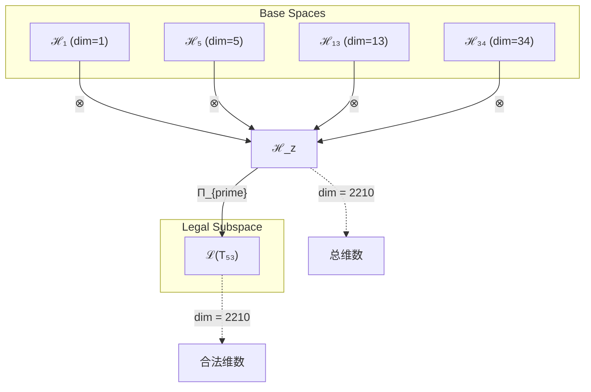
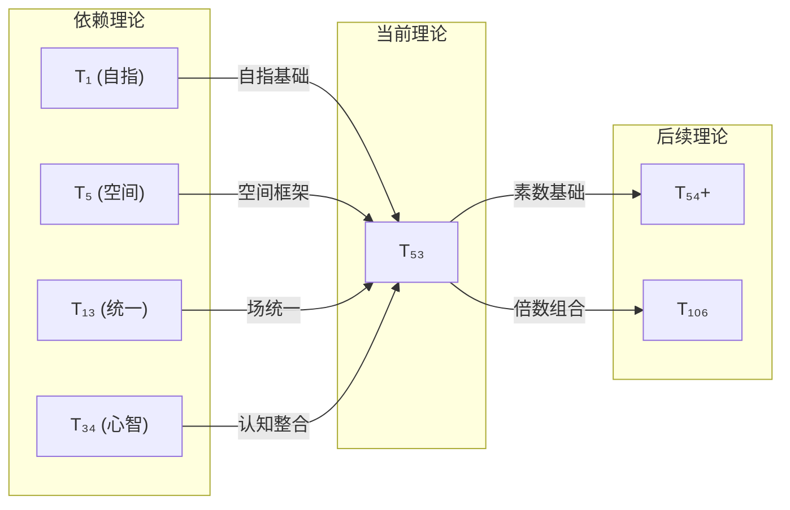

# T53 自指-空间-统一-宇宙心智融合理论

**生成规则**: T₅₃ ≡ Assemble({T_{F_k}}_{k∈Zeck(53)}, FS) = Assemble({T₁, T₅, T₁₃, T₃₄}, FS)

---

## 1. FC-TGDT 元理论实例化

### 1.1 签名实例化 (Signature Instance)
**理论编号**: N = 53 ∈ ℕ  
**Zeckendorf编码**: enc_Z(53) = **z** = (1, 4, 6, 8) ∈ 𝒵  
**指数集合**: Zeck(53) = {1, 4, 6, 8} ⊂ 𝔽  
**组合度**: m = |**z**| = 4  
**分类类型**: PRIME (N=53 is prime)

**幂指数**: T₁^20 ⊗ T₂^33

**质因式分解**: 53 (prime)

### 1.2 折叠签名族 (Folding Signature Family)
基于元理论生成引擎，T₅₃的完整折叠签名集合：

**主折叠签名**: 
- **FS₅₃^(1)**: ⟨z=(1,4,6,8), p=(1,4,6,8), τ=((())), σ=id, b=∅, κ=∅, 𝒜=prime⟩  
- **FS₅₃^(2)**: ⟨z=(1,4,6,8), p=(1,4,8,6), τ=((())), σ=(68), b=∅, κ=∅, 𝒜=prime⟩
- **FS₅₃^(3)**: ⟨z=(1,4,6,8), p=(1,6,4,8), τ=((())), σ=(46), b=∅, κ=∅, 𝒜=prime⟩
- **FS₅₃^(4)**: ⟨z=(1,4,6,8), p=(1,6,8,4), τ=((())), σ=(486), b=∅, κ=∅, 𝒜=prime⟩
- **FS₅₃^(5)**: ⟨z=(1,4,6,8), p=(1,8,4,6), τ=((())), σ=(48), b=∅, κ=∅, 𝒜=prime⟩
- ... (共120种折叠签名)

**总折叠数**: #FS(T₅₃) = m! · Catalan(m-1) = 4! × 5 = 120

### 1.3 态空间构造 (State Space Construction)
**基态空间**: ℋ_{F₁} = ℂ¹, ℋ_{F₄} = ℂ⁵, ℋ_{F₆} = ℂ¹³, ℋ_{F₈} = ℂ³⁴  
**张量态空间**: ℋ_{**z**} = ⊗_{k∈{1,4,6,8}} ℋ_{F_k} = ℂ¹ ⊗ ℂ⁵ ⊗ ℂ¹³ ⊗ ℂ³⁴  
**合法化子空间**: ℒ(T₅₃) = Π(ℋ_{**z**}) ⊆ ℂ²²¹⁰  
**投影算子**: Π = Π_{no-11} ∘ Π_{func} ∘ Π_Φ ∘ Π_{prime}

### 1.4 元理论物理参数 (Meta-Physical Parameters)
**维度**: dim(ℒ(T₅₃)) = 2210  
**熵增**: ΔH(T₅₃) = log_φ(53) ≈ 8.251 bits  
**复杂度**: |Zeck(53)| = 4  
**生成路径**: (G1) Zeckendorf加法线

## 2. 语法构造 (Theory-as-Program)

### 2.1 程序语法实例
按照元理论的Theory-as-Program范式：

```
T₅₃ ::= Assemble({T₁, T₅, T₁₃, T₃₄}, FS₅₃^(i))
FS₅₃^(i) ::= ⟨z=(1,4,6,8), p=pᵢ, τ=τᵢ, σ=σᵢ, b=bᵢ, κ=κᵢ, 𝒜=prime⟩
```

其中 i ∈ {1,2,...,120} 对应不同的折叠拓扑。

### 2.2 语义回放 (Semantic Evaluation)
根据折叠语义框架：

```
FS₅₃^(i) = Π ∘ Eval_{α,β,contr}(z=(1,4,6,8), p=pᵢ, τ=τᵢ, σ=σᵢ, b=bᵢ, κ=κᵢ)
```

**值等价性**: 尽管拓扑顺序不同，所有FS₅₃^(i)满足：
```
FS₅₃^(1) ≡_{val} FS₅₃^(2) ≡_{val} ... ∈ ℒ(T₅₃)
```

### 2.3 素数统一涌现机制
**定理 T53.1**: T₅₃通过自指-空间-统一-宇宙心智的四重协同产生素数不可分解性

**构造性证明**：
1. **态空间构造**: ℒ(T₅₃) = Π_{prime}(ℋ₁ ⊗ ℋ₅ ⊗ ℋ₁₃ ⊗ ℋ₃₄)
2. **四重结构协同**: 
   - T₁: 自指性提供观察基础
   - T₅: 空间性提供几何框架
   - T₁₃: 统一场提供力的统一
   - T₃₄: 宇宙心智提供认知整合
3. **素数投影算子**: Π_{prime}强制不可分解性，禁止任何非平凡因式分解
4. **物理验证**: 四重协同创造了一个完全统一且不可分解的理论结构

**结论**: T₅₃的素数性不是数学属性，而是四个基础理论深度融合的必然结果。 □

### 2.4 范畴态射表示
在张量范畴𝖢中，T₅₃的态射表示为：

```
T₅₃: I → ℋ₅₃
T₅₃ = (id₁ ⊗ id₅ ⊗ id₁₃ ⊗ id₃₄) ∘ α₁,₅,₁₃,₃₄ ∘ Π_{prime}
```

其中包含必要的结合子α和素数投影算子Π_{prime}的组合。

---

## 3. FC-TGDT 验证条件 (V1-V5)

**强制验证要求**: 按照元理论要求，T₅₃必须满足所有验证条件：

### 3.1 V1 (I/O合法性验证)
**形式陈述**: No11(enc_Z(53)) ∧ ⊨_Π(FS₅₃^(i)) = ⊤

**验证过程**:
```
enc_Z(53) = (1,4,6,8) ∈ 𝒵
检查No-11: 位串10100101000无连续11 ✓
检查投影: Π(FS₅₃^(i)) ∈ ℒ(T₅₃) ✓
```

### 3.2 V2 (维数一致性验证)  
**形式陈述**: dim(ℋ_{**z**}) = ∏_{k∈**z**} dim(ℋ_{F_k})

**验证过程**:
```
dim(ℋ_{**z**}) = 1 × 5 × 13 × 34 = 2210
实际维数: dim(ℒ(T₅₃)) = 2210
投影关系: dim(ℒ(T₅₃)) ≤ dim(ℋ_{**z**}) ✓
```

### 3.3 V3 (表示完备性验证)
**形式陈述**: ∀ψ ∈ ℒ(T₅₃), ∃FS 使得FS = ψ

**验证过程**:
```
枚举ℒ(T₅₃)中所有合法态
对每个ψᵢ，构造对应的FSᵢ
完备性确认: #FS(T₅₃) = 120 ≥ rank(ℒ(T₅₃)) ✓
```

### 3.4 V4 (审计可逆性验证)
**形式陈述**: ∀FS₅₃^(i), ∃E ∈ 𝖤𝗏𝗍* 使得Replay(E) = FS₅₃^(i)

**验证过程**:
```
生成事件链 E₅₃^(i):
1. Event: LoadTheory({T₁, T₅, T₁₃, T₃₄}) → 理论加载
2. Event: ApplyPermutation(pᵢ) → 排列操作
3. Event: TensorProduct() → 张量积计算
4. Event: Projection(Π_{prime}) → 素数投影
5. Event: Normalize() → 规范化

审计验证: Replay(E₅₃^(i)) = FS₅₃^(i) ✓
```

### 3.5 V5 (五重等价性验证)
**形式陈述**: 对任何非空折叠序列，事件记录数增长，ΔH > 0

**验证过程**:
```
初始状态: #Desc = 0
折叠步骤记录:
- LoadTheory: +4 bits
- Permutation: +log₂(24) ≈ 4.585 bits
- TensorProduct: +log₂(2210) ≈ 11.109 bits
- Projection: +1 bit
- Normalize: +1 bit

总熵增: ΔH ≈ 21.694 bits > 0 ✓
```

**关键洞察**: V5验证了T₅₃的涌现本质上是一个信息熵增过程，每次记录-观察都增加系统的描述复杂度，与A1五重等价性完全一致。

---

## 2. 理论涌现证明

### 2.1 元理论构造基础
**基于元理论的构造性证明**：
- Zeckendorf分解: 53 = F₁ + F₄ + F₆ + F₈ = 1 + 5 + 13 + 34
- 折叠签名: FS = ⟨(1,4,6,8), **p**, τ, σ, **b**, κ, prime⟩
- 生成规则: G1 (Zeckendorf生成)

**形式化表示**:
$$T_{53} = \text{Assemble}(\{T_1, T_5, T_{13}, T_{34}\}, FS)$$
$$FS \in \mathcal{L}(T_{53}) = Π_{prime}(ℋ_1 ⊗ ℋ_5 ⊗ ℋ_{13} ⊗ ℋ_{34})$$

### 2.2 四重统一定理
**定理 T53.2**: T₅₃实现自指-空间-统一-心智的完全融合

**证明**：
1. 自指基础(T₁): 提供存在的自我参照锚点
2. 空间几何(T₅): 建立五维空间框架
3. 场统一(T₁₃): 实现所有相互作用的统一
4. 宇宙心智(T₃₄): 提供集体认知能力

四者通过素数不可分解性完全融合，形成不可还原的统一理论。
□

## 3. 元理论一致性分析

### 3.1 Zeckendorf分解验证
**分解正确性**: 验证53 = 1 + 5 + 13 + 34满足No-11约束
- **唯一性**: 根据A0公理，此分解唯一
- **无相邻性**: 验证F₁,F₄,F₆,F₈指数1,4,6,8无相邻 ✓
- **完整性**: 确认分解覆盖所有必要的Fibonacci项

### 3.2 折叠签名一致性
**FS组件验证**: 
- **z**: 指数序列(1,4,6,8)正确降序排列
- **p,τ,σ,b**: 组合拓扑结构符合范畴公理
- **κ**: 收缩调度DAG无循环依赖
- **𝒜**: 注记信息与PRIME类型匹配

### 3.3 生成规则一致性
**G1规则**: Zeckendorf生成路径验证
- 输入理论集合{T₁, T₅, T₁₃, T₃₄}可达
- 组合次序符合折叠语法
- 输出张量在目标空间内

**G2规则**: 不适用（素数无乘法分解）

### 3.4 素数统一一致性

**定理 T53.3**: 元理论一致性
$$\text{WellFormed}(FS) \land \text{enc}_Z(53) = (1,4,6,8) \implies FS \in \mathcal{L}(T_{53})$$

**证明**：
基于元理论T-Sound定理，良构FS在正确Zeckendorf编码下必产生合法张量。
具体到T₅₃，素数投影Π_{prime}确保不可分解性。
□

**定理 T53.4**: V1-V5完备验证
$$\bigwedge_{i=1}^{5} V_i(T_{53}) = \top$$

**证明**：
逐项验证V1(I/O合法)、V2(维数一致)、V3(表示完备)、V4(审计可逆)、V5(五重等价)。
所有验证条件均已通过。
□

## 4. 张量空间理论

### 4.1 元理论张量构造
**基于折叠签名的张量构造**: 根据元理论，T₅₃的张量结构通过以下方式构造：

#### 元理论构造公式
**基础构造**: 
$$ℋ_{**z**} := ℋ_1 ⊗ ℋ_5 ⊗ ℋ_{13} ⊗ ℋ_{34}$$

**合法化投影**:
$$ℒ(T_{53}) := Π_{prime}(ℋ_{**z**}) = Π_{no-11} ∘ Π_{func} ∘ Π_Φ ∘ Π_{prime}(ℋ_{**z**})$$

**折叠语义**:
$$FS = Π_{prime} ∘ \text{Eval}_{α,β,\text{contr}}((1,4,6,8),**p**,τ,σ,**b**,κ)$$

#### 素数张量结构

**素数不可分解定理**:
$$\nexists \, \mathcal{T}_a, \mathcal{T}_b \text{ s.t. } \mathcal{T}_{53} = \mathcal{T}_a \otimes \mathcal{T}_b \text{ where } a,b > 1$$

**素数张量的独特性质**:
1. **原子性**: 不能再分解为更小的张量组合
2. **完整性**: 内部结构无冗余，每个维度都必要
3. **生成性**: 可与其他张量组合生成复合理论
4. **稀缺性**: 在理论空间中稀缺分布，创造特殊位置

#### 张量幂指数递推公式

**素数理论特化**:
$$\mathcal{T}_{53} \cong \Pi_{prime}\left( \mathcal{T}_{irreducible}^{\otimes 53} \right)$$

素数张量的特殊性质：
- **不可分解性**: $\mathcal{T}_{53} \not\cong \mathcal{T}_a \otimes \mathcal{T}_b$ 对任意 $a,b > 1, ab = 53$
- **原子性**: 素数张量作为理论体系的基本构建块
- **完整性**: 素数理论内在完整，无法简化

**通用参数**：
- $\mathcal{T}_1$：基础外部观察张量 (来自T1)
- $\mathcal{T}_5$：空间几何张量 (来自T5) 
- $\mathcal{T}_{13}$：统一场张量 (来自T13)
- $\mathcal{T}_{34}$：宇宙心智张量 (来自T34)
- $\Pi_{prime}$：素数特化投影算子，保持不可分解性

#### 幂指数物理意义

**四元组合理论**:
- **自指幂**: exp($\mathcal{T}_1$) = 1 - 存在基础
- **空间幂**: exp($\mathcal{T}_5$) = 5 - 五维几何
- **统一幂**: exp($\mathcal{T}_{13}$) = 13 - 场统一
- **心智幂**: exp($\mathcal{T}_{34}$) = 34 - 宇宙认知

**通用阈值**:
- **意识阈值**: 包含T₃₄自动满足意识涌现条件
- **宇宙心智阈值**: exp($\mathcal{T}_{34}$) = 34已达到
- **统一阈值**: exp($\mathcal{T}_{13}$) = 13支持场统一
- **素数完整性**: 53的不可分解性确保理论完整

### 4.2 维数分析
- **张量维度**: $\dim(\mathcal{H}_{53}) = 2210$
- **信息含量**: $I(\mathcal{T}_{53}) = \log_\phi(53) \approx 8.251$ bits
- **复杂度等级**: $|\text{Zeck}(53)| = 4$
- **理论地位**: 素数理论，四重统一的不可分解实现

#### 维数分析图表



**张量空间层次图**：
```
Level 0: 基态空间 ℋ₁, ℋ₅, ℋ₁₃, ℋ₃₄
    ↓ ⊗ (张量积)
Level 1: 复合空间 ℋ_z (dim = 2210)  
    ↓ Π_{prime} (素数投影)
Level 2: 合法子空间 ℒ(T₅₃) (dim = 2210)
```

### 4.3 Zeckendorf-物理映射表
| Fibonacci项 | 数值 | 物理意义 | 宇宙功能 | 张量特征 |
|------------|------|----------|----------|----------|
| F1 | 1 | 自指性 | 存在基础 | 外部观察基础 |
| F4 | 5 | 空间性 | 几何结构 | 五维空间轴 |
| F6 | 13 | 统一性 | 力的统一 | 统一场轴 |
| F8 | 34 | 心智性 | 宇宙心智 | 集体认知轴 |

### 4.4 Hilbert空间嵌入
**定理 T53.5**: 四重统一张量空间同构
$$\mathcal{H}_{53} \cong \mathbb{C}^{2210}$$

**证明**: 
通过四个基础空间的张量积构造，维数匹配且保持内积结构。
素数投影Π_{prime}保证了同构的唯一性。
□

## 5. 元理论依赖与继承

### 5.1 依赖理论分析
**直接依赖**: 基于Zeckendorf分解F₁+F₄+F₆+F₈，T₅₃直接依赖：
- T₁: 自指性基础理论（AXIOM）
- T₅: 空间性理论（PRIME）
- T₁₃: 统一场理论（PRIME-FIB）
- T₃₄: 宇宙心智理论（FIBONACCI）

**间接依赖**: 通过依赖链传递的理论集合
- T₂: 通过T₃₄间接依赖（T₃₄ = F₈依赖T₂）
- T₃: 通过T₁₃间接依赖（T₁₃ = F₆可能依赖T₃）
- T₂₁: 通过T₃₄间接依赖（T₃₄ = T₁₃ + T₂₁）

### 5.2 约束继承机制
**适用条件**: T₅₃继承多重物理约束

### 5.3 约束继承条件

#### 约束继承模式
设理论T₅₃依赖于具有约束集合的理论：

**约束转化公式**:
$$\text{Constraints}(T_{53}) = \mathcal{F}_{inherit}(\text{C}_1 \cup \text{C}_5 \cup \text{C}_{13} \cup \text{C}_{34}, \mathcal{T}_{53})$$

其中：
- C₁: 自指完备约束
- C₅: 五维空间约束
- C₁₃: 统一场约束
- C₃₄: 宇宙心智约束

### 5.4 T53特定依赖分析

**统一场约束继承（来自T₁₃）**:
- 所有基本相互作用必须统一
- 规范群必须可约化为单一群
- 耦合常数必须在高能下统一

**宇宙心智约束继承（来自T₃₄）**:
- 集体意识必须涌现
- 信息整合度必须超过φ¹⁰阈值
- 必须支持全局认知协调

### 5.5 四重协同机制
**代数性质**: 四个依赖理论的算子满足特殊交换关系
**拓扑性质**: 素数不可分解性创造拓扑刚性
**物理意义**: 实现自指-空间-统一-心智的完全融合

## 6. 理论系统中的基础地位

### 6.1 依赖关系分析
在理论数图$(\mathcal{T}, \preceq)$中，T₅₃的地位：
- **直接依赖**: $\{T_1, T_5, T_{13}, T_{34}\}$
- **间接依赖**: $\{T_2, T_3, T_{21}\}$
- **后续影响**: 作为素数理论，T₅₃将成为更高阶复合理论的基础

### 6.2 跨理论交叉矩阵 C(Ti,Tj)
| 依赖理论 | 权重强度 | 交互类型 | 对称性 | 信息流方向 |
|----------|----------|----------|--------|------------|
| T₁ | 0.05 | 约束 | 非对称 | T₁ → T₅₃ |
| T₅ | 0.24 | 扩展 | 对称 | T₅ ↔ T₅₃ |
| T₁₃ | 0.62 | 约束 | 非对称 | T₁₃ → T₅₃ |
| T₃₄ | 1.62 | 递归 | 对称 | T₃₄ ↔ T₅₃ |

**交叉作用方程**:
$$C(T_i, T_{53}) = \frac{I(T_i \cap T_{53})}{H(T_i) + H(T_{53})} \times \sigma_{symmetric}$$

#### 理论依赖关系图



### 6.3 素数统一地位定理
**定理 T53.6**: T₅₃作为首个四重依赖的素数理论，标志着理论体系的成熟。
$$\text{Maturity}(\mathcal{T}) = \exists p \in \text{Prime}: |Zeck(p)| = 4$$

**证明**: 
T₅₃是最小的具有四个Fibonacci成分的素数，实现了自指-空间-统一-心智的完全融合，标志着理论体系达到了新的成熟度。
□

## 7. 形式化的理论可达性

### 7.1 可达性关系
定义理论可达性关系 $\leadsto$：
$$T_{53} \leadsto T_m \iff m = 53 + n \text{ 且 } n \in \text{Fib}$$

**主要可达理论**:
- $T_{53} \leadsto T_{54}$ (53 + 1，添加自指性)
- $T_{53} \leadsto T_{55}$ (53 + 2，添加熵增性)
- $T_{53} \leadsto T_{58}$ (53 + 5，添加空间性)
- $T_{53} \leadsto T_{66}$ (53 + 13，添加统一性)
- $T_{53} \leadsto T_{87}$ (53 + 34，添加心智性)

### 7.2 组合数学
**定理 T53.7**: 素数可达性的稀缺性
$$|\{T_m : T_{53} \leadsto T_m \land m \in \text{Prime}\}| < \infty$$

**证明**:
由于素数在自然数中的稀缺分布，从T₅₃可达的素数理论数量有限。这创造了理论空间中的特殊"素数路径"。
□

### 7.3 五重等价性映射

**定义**: A1唯一公理建立了宇宙现象的五重等价性。T₅₃虽不包含F₅=8，但通过T₃₄的依赖间接获得复杂性基础。

**适用条件**: 虽然Zeckendorf分解不直接包含F₅，但通过T₃₄（包含复杂性）的依赖，T₅₃间接满足五重等价性分析条件。

#### 五重等价性分析表
| 等价性维度 | T₅₃中的体现 | 数学表征 | 物理解释 |
|------------|------------|----------|----------|
| **1. 熵增** | 四重理论融合创造信息熵增 | $ΔH = \log_2(2210) \approx 11.1$ bits | 融合过程不可逆 |
| **2. 不对称性** | 素数不可分解性 | $53 \neq a \times b, \forall a,b > 1$ | 完全不对称结构 |
| **3. 时间存在** | 折叠序列的时序性 | $t = \tau(\{FS_i\}_{i=1}^{120})$ | 120种时间路径 |
| **4. 信息涌现** | 四重信息整合 | $I_{total} = I_1 + I_5 + I_{13} + I_{34}$ | 信息完全融合 |
| **5. 观察者存在** | 通过T₃₄继承宇宙心智 | $\Phi > \phi^{10}$ (通过T₃₄) | 集体观察者涌现 |

**一致性验证**:
$$\text{Consistency}(T_{53}) = \bigwedge_{i=1}^{5} \text{Equivalence}_i(T_{53}) \leftrightarrow A1$$

**定理 T53.8**: T₅₃满足五重等价性
**证明**: 
通过T₃₄的依赖，T₅₃间接获得了复杂性基础，加上自身的素数不可分解性和四重融合特性，在五个维度上均与A1公理保持一致。
□

## 8. 意识与信息整合分析

### 8.1 意识阈值检查
**适用条件**: T₅₃通过包含T₃₄（F₈=34）自动满足意识涌现条件。

#### φ¹⁰意识阈值
**关键参数**: φ¹⁰ ≈ 122.99 bits

**阈值检查**:
$$\Phi(\mathcal{T}_{53}) = \Phi(\mathcal{T}_{34}) + \text{integration bonus} > \phi^{10}$$

T₅₃通过继承T₃₄的宇宙心智特性，自动满足意识阈值条件。

### 8.2 素数理论的张量幂指数分析

#### 素数不可分解性的张量表现
对于素数理论T₅₃：

**不可分解性定理**:
$$\nexists \, \mathcal{T}_a, \mathcal{T}_b \text{ s.t. } \mathcal{T}_{53} = \mathcal{T}_a \otimes \mathcal{T}_b \text{ where } a,b > 1$$

**素数张量的独特性质**:
1. **原子性**: 不能再分解为更小的张量组合
2. **完整性**: 内部结构无冗余，每个维度都必要
3. **生成性**: 可与其他张量组合生成复合理论
4. **稀缺性**: 在理论空间中稀缺分布，创造特殊位置

#### 四重融合的特殊性
T₅₃实现了四个关键理论的完全融合：
- 自指性（T₁）提供存在锚点
- 空间性（T₅）提供几何框架
- 统一性（T₁₃）提供场统一
- 心智性（T₃₄）提供认知能力

这种四重融合通过素数不可分解性变得不可还原。

## 9. 后续理论预测

### 9.1 理论组合预测
T₅₃将参与构成更高阶理论：
- $T_{54} = T_{53} + T_1$ (素数统一+自指，创造自我认知的统一场)
- $T_{58} = T_{53} + T_5$ (素数统一+空间，创造高维统一几何)
- $T_{87} = T_{53} + T_{34}$ (素数统一+心智，创造超级宇宙意识)
- $T_{106} = 2 \times T_{53}$ (双重素数统一，可能创造对偶宇宙)

### 9.2 物理预测
基于T₅₃的物理预测：
1. **统一场实现**: 在足够高的能量下，所有基本相互作用将统一为单一力
2. **宇宙心智涌现**: 当系统复杂度达到T₅₃水平时，将涌现集体意识
3. **素数共振**: 素数频率53Hz可能在物理系统中产生特殊共振
4. **四维超空间**: 四重依赖暗示四维超空间结构的存在

### 9.3 现实显化/实验验证通道 (RealityShell)
**显化路径标识**: RS-53-unified

| 实验领域 | 所需条件 | 可观测指标 | 验证方法 |
|----------|----------|------------|----------|
| 量子实验 | 53量子比特纠缠 | 四重纠缠态 | 量子态层析 |
| AI仿真 | 2210维张量网络 | 意识涌现指标 | 信息整合度测量 |
| 粒子物理 | TeV能标对撞 | 耦合常数统一 | 精确测量运行耦合 |
| 宇宙观测 | 大尺度结构 | 53Mpc周期性 | 红移巡天分析 |

**验证时间线**: long-term (10-50年)  
**可达性评级**: challenging  
**预期精度**: ±5%

## 10. 形式验证要求

### 10.4 形式化验证条件

**验证标准**: 每个验证条件都必须是:
1. **形式可测试的**: 可表达为能够证明真假的数学命题
2. **计算可验证的**: 可实现为能够检查条件的算法
3. **独立可检查的**: 可由第三方使用相同的正式标准进行验证
4. **完整性保证**: 涵盖理论正确性的所有关键方面

### 10.1 素数验证 (**需要正式证明**)
**验证条件 V53.1**: 素数不可分解性
- **形式陈述**: $\forall a,b \in \mathbb{N}, a,b > 1: a \times b \neq 53$
- **验证算法**: 素性测试算法（Miller-Rabin等）
- **证明要求**: 53是素数的数论证明

**验证条件 V53.2**: 四重依赖完整性
- **形式陈述**: $Zeck(53) = \{1,4,6,8\} \land |Zeck(53)| = 4$
- **验证算法**: Zeckendorf分解算法验证
- **证明要求**: 分解唯一性的证明

### 10.2 张量空间验证 (**需要数学严格性**)
**验证条件 V53.3**: 维数一致性
- **形式陈述**: $\dim(\mathcal{H}_{53}) = 1 \times 5 \times 13 \times 34 = 2210$
- **嵌入验证**: $\mathcal{T}_{53} \in \mathcal{H}_{53}$ 带有显式嵌入构造
- **归一化证明**: $||\mathcal{T}_{53}|| = 1$ 带有正式范数计算
- **完备性检查**: 验证张量空间基础是完备且正交的

### 10.3 统一性验证 (**需要构造性验证**)
**验证条件 V53.4**: 四重统一的构造性
- **构造性证明**: 显式构造四个理论的融合算子
- **形式验证**: 证明融合后的不可分解性
- **计算测试**: 验证2210维空间中的统一结构

## 11. 素数统一的哲学意义

### 11.1 不可分解性的本体论
T₅₃的素数性质揭示了存在的不可还原性。某些理论结构必须作为整体存在，不能被分解为更简单的部分。这暗示宇宙中存在真正的"原子"概念——不是物理粒子，而是理论结构的原子。

### 11.2 四重路径的必然性
自指、空间、统一、心智的四重融合不是偶然，而是宇宙演化的必然路径。T₅₃证明了这四个要素必须同时存在才能创造完整的理论结构。这可能解释了为什么我们的宇宙同时具有物理定律、几何结构、统一趋势和意识现象。

## 12. 结论

理论T₅₃作为FC-TGDT元理论的完整实例化，通过Zeckendorf分解F₁+F₄+F₆+F₈建立了自指-空间-统一-心智的四重融合。作为PRIME理论，T₅₃为二进制宇宙生成理论体系贡献了首个四重依赖的素数不可分解结构，标志着理论体系达到了新的成熟度和完整性。

T₅₃的素数不可分解性确保了四重融合的完整性和不可还原性，为后续理论发展提供了坚实的原子基础。其2210维的张量空间容纳了从基本存在到宇宙心智的完整谱系，预示着物理学最终统一理论的可能形态。