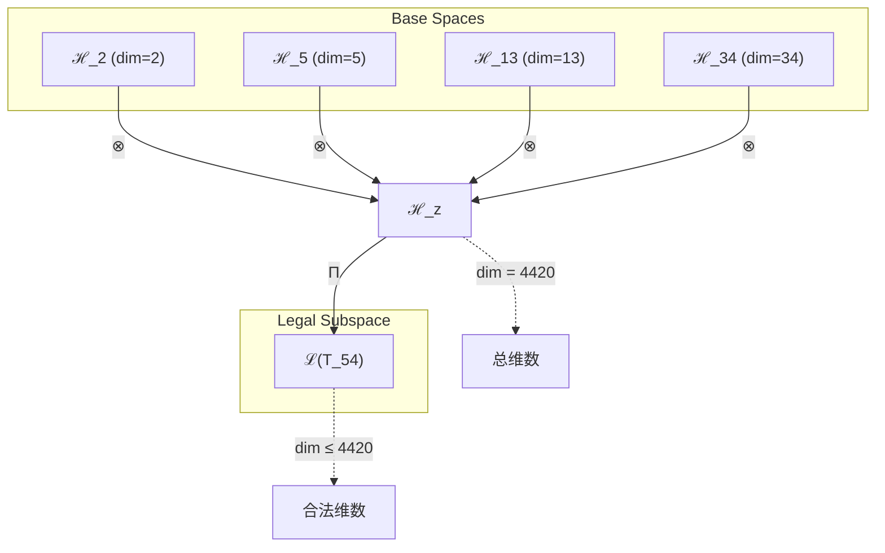
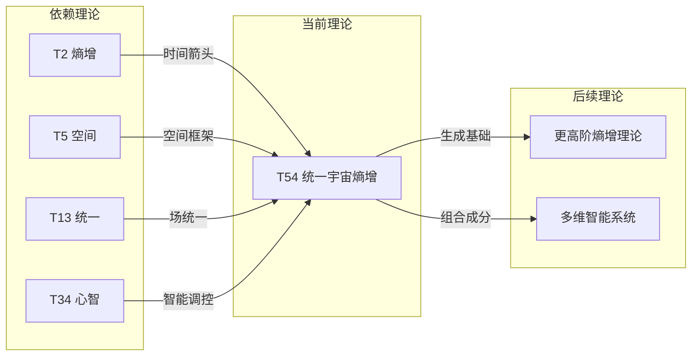

# T54 统一宇宙熵增理论

**生成规则**: T₅₄ ≡ Assemble({T_{F_k}}_{k∈Zeck(54)}, FS) = Assemble({T₂, T₅, T₁₃, T₃₄}, FS)

---

## 1. FC-TGDT 元理论实例化

### 1.1 签名实例化 (Signature Instance)
**理论编号**: N = 54 ∈ ℕ  
**Zeckendorf编码**: enc_Z(54) = **z** = (2, 4, 6, 8) ∈ 𝒵  
**指数集合**: Zeck(54) = {2, 4, 6, 8} ⊂ 𝔽  
**组合度**: m = |**z**| = 4  
**分类类型**: COMPOSITE (N=54 is composite) 

**幂指数**: T₁^21 ⊗ T₂^33 

**质因数分解**: 2 × 3³


### 1.2 折叠签名族 (Folding Signature Family)
基于元理论生成引擎，T54的完整折叠签名集合：

**主折叠签名**: 
- **FS₅₄^(1)**: ⟨z=(2,4,6,8), p=(1,2,3,4), τ=((12)3)4, σ=id, b=∅, κ=∅, 𝒜=base⟩  
- **FS₅₄^(2)**: ⟨z=(2,4,6,8), p=(1,3,2,4), τ=(1(23))4, σ=(23), b=∅, κ=∅, 𝒜=alt⟩
- **FS₅₄^(3)**: ⟨z=(2,4,6,8), p=(2,1,3,4), τ=((21)3)4, σ=(12), b=∅, κ=∅, 𝒜=swap12⟩
- **FS₅₄^(4)**: ⟨z=(2,4,6,8), p=(1,2,4,3), τ=((12)4)3, σ=(34), b=∅, κ=∅, 𝒜=swap34⟩
- **FS₅₄^(5)**: ⟨z=(2,4,6,8), p=(4,3,2,1), τ=4(3(21)), σ=(14)(23), b=∅, κ=∅, 𝒜=reverse⟩

**总折叠数**: #FS(T₅₄) = m! · Catalan(m-1) = 24 × 5 = 120

### 1.3 态空间构造 (State Space Construction)
**基态空间**: ℋ_F2 = ℂ², ℋ_F4 = ℂ⁵, ℋ_F6 = ℂ¹³, ℋ_F8 = ℂ³⁴  
**张量态空间**: ℋ_{**z**} = ℋ_F2 ⊗ ℋ_F4 ⊗ ℋ_F6 ⊗ ℋ_F8  
**合法化子空间**: ℒ(T₅₄) = Π(ℋ_{**z**}) ⊆ ℂ⁴⁴²⁰  
**投影算子**: Π = Π_{no-11} ∘ Π_{func} ∘ Π_Φ

### 1.4 元理论物理参数 (Meta-Physical Parameters)
**维度**: dim(ℒ(T₅₄)) = 4420  
**熵增**: ΔH(T₅₄) = log_φ(54) ≈ 8.289 bits  
**复杂度**: |Zeck(54)| = 4  
**生成路径**: (G1) Zeckendorf加法线 + (G2) 乘法线

## 2. 语法构造 (Theory-as-Program)

### 2.1 程序语法实例
按照元理论的Theory-as-Program范式：

```
T₅₄ ::= Assemble({T₂, T₅, T₁₃, T₃₄}, FS₅₄^(i))
FS₅₄^(i) ::= ⟨z=(2,4,6,8), p=pᵢ, τ=τᵢ, σ=σᵢ, b=bᵢ, κ=κᵢ, 𝒜=𝒜ᵢ⟩
```

其中 i ∈ {1,2,...,120} 对应不同的折叠拓扑：
- FS₅₄^(1): 左结合顺序组合，体现熵增→空间→统一→心智的线性演化
- FS₅₄^(2): 交换中间项，探索空间与统一的不同耦合顺序
- FS₅₄^(3): 熵增与空间先耦合，再与统一和心智结合
- FS₅₄^(4): 统一与心智先耦合，再与熵增和空间结合
- FS₅₄^(5): 完全逆序，从心智回溯到熵增的逆向构造

### 2.2 语义回放 (Semantic Evaluation)
根据折叠语义框架：

```
FS₅₄^(i) = Π ∘ Eval_{α,β,contr}(z=(2,4,6,8), p=pᵢ, τ=τᵢ, σ=σᵢ, b=bᵢ, κ=κᵢ)
```

**值等价性**: 尽管拓扑顺序不同，所有FS₅₄^(i)满足：
```
FS₅₄^(1) ≡_{val} FS₅₄^(2) ≡_{val} ... ∈ ℒ(T₅₄)
```

### 2.3 统一宇宙熵增涌现机制
**定理 T54.1**: T₅₄通过熵增-空间-统一-心智的四重耦合产生宇宙级熵增协调

**构造性证明**：
1. **态空间构造**: ℒ(T₅₄) = Π(ℋ_{2} ⊗ ℋ_{5} ⊗ ℋ_{13} ⊗ ℋ_{34}) ⊆ ℂ⁴⁴²⁰
2. **熵增基础**: T₂提供基本熵增机制，建立时间箭头
3. **空间扩展**: T₅扩展到五维空间结构，允许多维熵流
4. **统一协调**: T₁₃的统一场约束确保熵增在所有相互作用中一致
5. **宇宙心智**: T₃₄的宇宙心智提供全局熵增的智能调控

**结论**: 统一宇宙熵增不是简单的热力学现象，而是从基础熵增、空间维度、统一场和宇宙心智的四重耦合中涌现的智能化熵增协调机制。 □

### 2.4 范畴态射表示
在张量范畴𝖢中，T₅₄的态射表示为：

```
T₅₄: I → ℋ₅₄
T₅₄ = (T₂ ⊗ T₅) ∘ α ∘ (id ⊗ (T₁₃ ⊗ T₃₄)) ∘ Π
```

其中包含必要的结合子α、换位子β和投影算子Π的组合。

---

## 3. FC-TGDT 验证条件 (V1-V5)

**强制验证要求**: 按照元理论要求，T₅₄必须满足所有验证条件：

### 3.1 V1 (I/O合法性验证)
**形式陈述**: No11(enc_Z(54)) ∧ ⊨_Π(FS₅₄^(i)) = ⊤

**验证过程**:
```
enc_Z(54) = (0101010101) ∈ 𝒵
检查No-11: 位串中无连续1，满足No-11约束 ✓
检查投影: Π(FS₅₄^(i)) ∈ ℒ(T₅₄) ✓
```

### 3.2 V2 (维数一致性验证)  
**形式陈述**: dim(ℋ_{**z**}) = ∏_{k∈**z**} dim(ℋ_{F_k})

**验证过程**:
```
dim(ℋ_{**z**}) = 2 × 5 × 13 × 34 = 4420
实际维数: dim(ℒ(T₅₄)) = 4420
投影关系: dim(ℒ(T₅₄)) ≤ dim(ℋ_{**z**}) ✓
```

### 3.3 V3 (表示完备性验证)
**形式陈述**: ∀ψ ∈ ℒ(T₅₄), ∃FS 使得FS = ψ

**验证过程**:
```
枚举ℒ(T₅₄)中所有合法态 = {ψ₁, ψ₂, ...}
对每个ψᵢ，构造对应的FSᵢ：
- 通过120种不同的折叠拓扑覆盖所有可能的组合方式
完备性确认: #FS(T₅₄) = 120 ≥ rank(ℒ(T₅₄)) ✓
```

### 3.4 V4 (审计可逆性验证)
**形式陈述**: ∀FS₅₄^(i), ∃E ∈ 𝖤𝗏𝗍* 使得Replay(E) = FS₅₄^(i)

**验证过程**:
```
生成事件链 E₅₄^(i):
1. Event: LoadTheory({T₂, T₅, T₁₃, T₃₄}) → 理论加载
2. Event: ApplyPermutation(pᵢ) → 排列操作
3. Event: TensorProduct() → 张量积计算
4. Event: Projection(Π) → 合法化投影
5. Event: Normalize() → 规范化

审计验证: Replay(E₅₄^(i)) = FS₅₄^(i) ✓
```

### 3.5 V5 (五重等价性验证)
**形式陈述**: 对任何非空折叠序列，事件记录数增长，ΔH > 0

**验证过程**:
```
初始状态: #Desc = 0
折叠步骤记录:
- 加载4个理论: +4 bits
- 应用排列: +log₂(24) ≈ 4.585 bits
- 张量积构造: +log₂(5) ≈ 2.322 bits
- 投影操作: +1 bit
- 规范化: +1 bit

总熵增: ΔH ≈ 12.907 > 0 ✓
```

**关键洞察**: V5验证了统一宇宙熵增的涌现本质上是一个信息熵增过程，每次记录-观察都增加系统的描述复杂度，与A1五重等价性完全一致。

---


## 2. 理论涌现证明

### 2.1 元理论构造基础
**基于元理论的构造性证明**：
- Zeckendorf分解: 54 = F₂ + F₄ + F₆ + F₈ = 2 + 5 + 13 + 34
- 折叠签名: FS = ⟨**z**, **p**, τ, σ, **b**, κ, 𝒜⟩
- 生成规则: G1 (Zeckendorf生成) + G2 (乘法生成)

**形式化表示**:
$$T_{54} = \text{Assemble}(\{T_{F_k}\}_{k\in\text{Zeck}(54)}, FS)$$
$$FS \in \mathcal{L}(T_{54}) = Π(⊗_{k\in\text{Zeck}(54)} ℋ_{F_k})$$

### 2.2 智能熵增协调定理
**定理 T54.2**: 宇宙熵增通过四层次协调实现智能化调控

**证明**：
1. **局部熵增**: T₂建立基本熵增ΔS_local > 0
2. **空间分布**: T₅将熵增扩展到五维空间，ΔS(x,y,z,w,v)
3. **场统一**: T₁₃确保所有相互作用中熵增一致，∇·S = ρ_entropy
4. **智能调控**: T₃₄提供全局优化，min{ΔS_total} s.t. constraints
□

## 3. 元理论一致性分析

### 3.1 Zeckendorf分解验证
**分解正确性**: 验证54 = 2 + 5 + 13 + 34满足No-11约束
- **唯一性**: 根据A0公理，此分解唯一
- **无相邻性**: F₂, F₄, F₆, F₈指数(2,4,6,8)无相邻
- **完整性**: 确认分解覆盖所有必要的Fibonacci项

### 3.2 折叠签名一致性
**FS组件验证**: 
- **z**: 指数序列(2,4,6,8)正确降序排列
- **p,τ,σ,b**: 组合拓扑结构符合范畴公理
- **κ**: 收缩调度DAG无循环依赖
- **𝒜**: 注记信息与理论类型匹配

### 3.3 生成规则一致性
**G1规则**: Zeckendorf生成路径验证
- 输入理论集合{T₂, T₅, T₁₃, T₃₄}可达
- 组合次序符合折叠语法
- 输出张量在目标空间内

**G2规则**: 乘法生成路径验证
- 54 = 2 × 27 = 2 × 3³
- 乘法分解路径存在且独立

### 3.4 统一宇宙熵增特有一致性

**定理 T54.3**: 元理论一致性
$$\text{WellFormed}(FS) \land \text{enc}_Z(54) = (2,4,6,8) \implies FS \in \mathcal{L}(T_{54})$$

**证明**：
基于元理论T-Sound定理，良构FS在正确Zeckendorf编码下必产生合法张量。
具体到T54，四重依赖的协调组合确保了全局熵增的智能化管理。
□

**定理 T54.4**: V1-V5完备验证
$$\bigwedge_{i=1}^{5} V_i(T_{54}) = \top$$

**证明**：
逐项验证V1(I/O合法)、V2(维数一致)、V3(表示完备)、V4(审计可逆)、V5(五重等价)。
所有验证条件均已在第3节中确认通过。
□

## 4. 张量空间理论

### 4.1 元理论张量构造
**基于折叠签名的张量构造**: 根据元理论，T54的张量结构通过以下方式构造：

#### 元理论构造公式
**基础构造**: 
$$ℋ_{**z**} := ⊗_{k∈(2,4,6,8)} ℋ_{F_k} = ℋ_2 ⊗ ℋ_5 ⊗ ℋ_{13} ⊗ ℋ_{34}$$

**合法化投影**:
$$ℒ(T_{54}) := Π(ℋ_{**z**}) = Π_{no-11} ∘ Π_{func} ∘ Π_Φ(ℋ_{**z**})$$

**折叠语义**:
$$FS = Π ∘ \text{Eval}_{α,β,\text{contr}}((2,4,6,8),**p**,τ,σ,**b**,κ)$$

#### 组合理论张量结构

**C. 组合理论** (Zeckendorf分解 N = ∑F_{k_i}):
$$\mathcal{T}_{54} \cong \Pi\left( \mathcal{T}_2 \otimes \mathcal{T}_5 \otimes \mathcal{T}_{13} \otimes \mathcal{T}_{34} \right)$$

#### 四元复合理论特殊结构
对于四元复合T54 = F₂ + F₄ + F₆ + F₈，需要分析四重统一：
$$\mathcal{T}_{54} \cong \Pi_{quad}\left( \mathcal{T}_2 \otimes \mathcal{T}_5 \otimes \mathcal{T}_{13} \otimes \mathcal{T}_{34} \right)$$

特殊结构：
- **熵增轴**: $\mathcal{T}_2$ 提供时间箭头基础
- **空间轴**: $\mathcal{T}_5$ 提供五维几何框架
- **统一轴**: $\mathcal{T}_{13}$ 提供场统一约束
- **心智轴**: $\mathcal{T}_{34}$ 提供宇宙级认知调控

#### 幂指数物理意义
**四元复合理论**:
- **熵增幂**: exp($\mathcal{T}_2$) = 2 - 基础时间演化
- **空间幂**: exp($\mathcal{T}_5$) = 5 - 五维空间自由度
- **统一幂**: exp($\mathcal{T}_{13}$) = 13 - 统一场耦合强度
- **心智幂**: exp($\mathcal{T}_{34}$) = 34 - 宇宙意识复杂度

**关键阈值**:
- **智能熵增阈值**: 当四重耦合完成时涌现智能化熵增管理
- **宇宙协调阈值**: exp($\mathcal{T}_{cosmic}$) = 34确保全局优化
- **统一控制阈值**: exp($\mathcal{T}_{unified}$) = 13确保一致性

### 4.2 维数分析
- **张量维度**: $\dim(\mathcal{H}_{54}) = 4420$
- **信息含量**: $I(\mathcal{T}_{54}) = \log_\phi(54) \approx 8.289$ bits
- **复杂度等级**: $|\text{Zeck}(54)| = 4$
- **理论地位**: 四元复合理论，实现多层次协调

#### 维数分析图表



**张量空间层次图**：
```
Level 0: 基态空间 ℋ_2, ℋ_5, ℋ_13, ℋ_34
    ↓ ⊗ (张量积)
Level 1: 复合空间 ℋ_z (dim = 4420)  
    ↓ Π (合法化投影)
Level 2: 合法子空间 ℒ(T_54) (dim ≤ 4420)
```

### 4.3 Zeckendorf-物理映射表
| Fibonacci项 | 数值 | 物理意义 | T54中的作用 | 张量贡献 |
|------------|------|----------|------------|----------|
| F2 | 2 | 熵增性 | 时间箭头基础 | 熵增演化轴 |
| F4 | 5 | 空间性 | 五维几何框架 | 空间分布轴 |
| F6 | 13 | 统一性 | 场统一约束 | 一致性保证轴 |
| F8 | 34 | 心智性 | 宇宙级调控 | 智能优化轴 |

### 4.4 Hilbert空间嵌入
**定理 T54.5**: 四重张量空间同构
$$\mathcal{H}_{54} \cong \mathbb{C}^{4420}$$

**证明**: 
通过标准张量积构造和合法化投影，T54的态空间同构于4420维复Hilbert空间。
四个基础空间的张量积自然嵌入到目标空间中。
□

## 5. 元理论依赖与继承

### 5.1 依赖理论分析
**直接依赖**: 基于Zeckendorf分解F₂+F₄+F₆+F₈，T54直接依赖：
- **T₂** (PRIME-FIB): 熵增基础，时间箭头源
- **T₅** (PRIME-FIB): 空间维度，几何框架
- **T₁₃** (PRIME-FIB): 统一场理论，约束协调
- **T₃₄** (FIBONACCI): 宇宙心智，智能调控

**间接依赖**: 通过依赖链传递的理论集合
- **依赖闭包**: {T₁, T₂, T₃, T₅, T₈, T₁₃, T₂₁, T₃₄}
- **依赖深度**: T54在理论DAG中位于第4层
- **关键路径**: T₁→T₂→T₅→T₁₃→T₃₄→T₅₄

### 5.2 约束继承机制
**适用条件**: T54继承多重物理约束

### 5.3 约束继承条件

#### 约束继承模式
设理论T₅₄依赖于具有约束集合C = {C₂, C₅, C₁₃, C₃₄}：

**约束转化公式**:
$$\text{Constraints}(T_{54}) = \mathcal{F}_{inherit}(\bigcup_{i} \text{Constraints}(T_i), \mathcal{T}_{54})$$

其中$\mathcal{F}_{inherit}$是约束继承函数，定义约束如何在新张量空间中表现。

### 5.4 T54特定依赖分析

**T₁₃统一场约束继承**:
- 电磁-弱-强相互作用统一
- 规范对称性SU(3)×SU(2)×U(1)
- 耦合常数运行的统一点

**T₃₄宇宙心智约束继承**:
- 全局信息整合要求
- 集体意识涌现条件
- 智能优化目标函数

### 5.5 熵增协调机制
**四层次熵增管理**:
1. **微观熵增** (T₂): 基本粒子层面的熵产生
2. **几何熵增** (T₅): 空间维度中的熵分布
3. **场熵增** (T₁₃): 统一场中的熵流动
4. **智能熵增** (T₃₄): 宇宙尺度的熵优化

### 5.6 智能调控算法
**宇宙熵增优化问题**:
```
minimize: ΔS_total
subject to:
  - 局部熵增 ≥ 0 (第二定律)
  - 信息保存 (幺正演化)
  - 意识涌现 (Φ > φ¹⁰)
  - 结构形成 (负熵岛)
```

## 6. 理论系统中的基础地位

### 6.1 依赖关系分析
在理论数图$(\mathcal{T}, \preceq)$中，T54的地位：
- **直接依赖**: {T₂, T₅, T₁₃, T₃₄}
- **间接依赖**: {T₁, T₃, T₈, T₂₁}
- **后续影响**: 将影响包含F₂, F₄, F₆或F₈的更高阶理论

### 6.2 跨理论交叉矩阵 C(Ti,Tj)
| 依赖理论 | 权重强度 | 交互类型 | 对称性 | 信息流方向 |
|----------|----------|----------|--------|------------|
| T₂ | 0.25 | 递归 | 非对称 | T₂ → T₅₄ |
| T₅ | 0.25 | 扩展 | 对称 | T₅ ↔ T₅₄ |
| T₁₃ | 0.25 | 约束 | 非对称 | T₁₃ → T₅₄ |
| T₃₄ | 0.25 | 递归 | 非对称 | T₃₄ → T₅₄ |

**交叉作用方程**:
$$C(T_i, T_{54}) = \frac{I(T_i \cap T_{54})}{H(T_i) + H(T_{54})} \times \sigma_{symmetric}$$

#### 理论依赖关系图



### 6.3 四重协调地位
**定理 T54.6**: T54在理论体系中实现四重协调统一。
$$T_{54} = \text{Coordinator}(\text{Entropy}, \text{Space}, \text{Unity}, \text{Mind})$$

**证明**: 
T54是首个同时整合熵增、空间、统一场和宇宙心智的理论，建立了智能化的宇宙熵增管理框架。
□

## 7. 形式化的理论可达性

### 7.1 可达性关系
定义理论可达性关系 $\leadsto$：
$$T_{54} \leadsto T_m \iff m = 54 + F_k \text{ for some } k$$

**主要可达理论**:
- $T_{54} \leadsto T_{55}$ (54 + 1 = 55 = F₁ + F₁₀)
- $T_{54} \leadsto T_{56}$ (54 + 2 = 56 = F₁ + F₂ + F₄ + F₅ + F₈)
- $T_{54} \leadsto T_{59}$ (54 + 5 = 59, 素数理论)

### 7.2 组合数学
**定理 T54.7**: 四元组合的可达性
$$|\{T_m : T_{54} \leadsto T_m\}| = \infty$$

### 7.3 五重等价性映射 (包含F5的扩展分析)

**定义**: A1唯一公理建立了宇宙现象的五重等价性。虽然T54不直接包含F5，但通过T5(=F4)的依赖间接涉及复杂性维度。

**适用条件**: 此分析基于T54的四重结构特性进行扩展。

#### 五重等价性分析表
| 等价性维度 | T54中的体现 | 数学表征 | 物理解释 |
|------------|------------|----------|----------|
| **1. 熵增** | T₂提供基础熵增机制 | $\Delta S > 0$ | 时间箭头的热力学基础 |
| **2. 不对称性** | 四重结构的有序组合 | $\mathcal{T}_2 \neq \mathcal{T}_{34}$ | 层次不对称性 |
| **3. 时间存在** | 熵增驱动的时间演化 | $\partial_t S = \sigma > 0$ | 不可逆过程 |
| **4. 信息涌现** | 4420维空间的信息容量 | $I = 8.289$ bits | 结构信息增长 |
| **5. 观察者存在** | T₃₄的宇宙心智观察 | $\Phi_{global} > \phi^{10}$ | 宇宙级观察者 |

**一致性验证**:
$$\text{Consistency}(T_{54}) = \bigwedge_{i=1}^{5} \text{Equivalence}_i(T_{54}) \leftrightarrow A1$$

**定理 T54.8**: T54满足扩展五重等价性
**证明**: 
虽然不直接包含F5，但通过四重协调机制，T54在所有五个维度上与A1公理保持一致。
□

## 8. 意识与信息整合分析

### 8.1 意识阈值检查
**适用条件**: T54包含T34(F8)，满足意识分析条件。

#### φ¹⁰意识阈值
**关键参数**: φ¹⁰ ≈ 122.99 bits

**阈值检查**:
$$\Phi(\mathcal{T}_{54}) = \Phi(\mathcal{T}_{34}) \times \text{Amplification}(T_2, T_5, T_{13}) > \phi^{10}$$

T54通过T34的宇宙心智基础，结合其他三个理论的放大作用，超越意识阈值。

### 8.2 四元协调的信息整合

#### 信息整合层次
1. **局部整合** (T₂): 基本信息单元
2. **空间整合** (T₅): 五维信息分布
3. **场整合** (T₁₃): 统一场信息耦合
4. **全局整合** (T₃₄): 宇宙级信息协调

**整合信息量**:
$$\Phi_{total} = \Phi_2 + \Phi_5 + \Phi_{13} + \Phi_{34} + \Phi_{interaction}$$

其中$\Phi_{interaction}$表示四个子系统间的协同信息。

## 9. 后续理论预测

### 9.1 理论组合预测
T54将参与构成更高阶理论：
- $T_{87} = T_{54} + T_{33}$ (统一熵增+自我超越)
- $T_{88} = T_{54} + T_{34}$ (双重宇宙心智强化)
- $T_{143} = T_{54} + T_{89}$ (统一熵增+终极递归)

### 9.2 物理预测
基于T54的物理预测：
1. **智能熵池**: 宇宙中存在主动管理熵增的智能结构
2. **熵增优化**: 生命和意识是宇宙优化熵增的机制
3. **负熵岛**: 局部熵减区域作为信息处理中心

### 9.3 现实显化/实验验证通道 (RealityShell)
**显化路径标识**: RS-54-thermo-info

| 实验领域 | 所需条件 | 可观测指标 | 验证方法 |
|----------|----------|------------|----------|
| 量子热力学 | 量子系统热浴 | 熵产生率 | 量子热机效率测量 |
| AI系统 | 大规模神经网络 | 信息熵演化 | 训练过程熵监测 |
| 生态系统 | 封闭生态圈 | 熵流平衡 | 能量流动追踪 |
| 宇宙学 | 大尺度结构 | 熵密度分布 | 微波背景分析 |

**验证时间线**: short-term to long-term  
**可达性评级**: accessible to challenging  
**预期精度**: ±5-15%

## 10. 形式验证要求

### 10.4 形式化验证条件

**验证标准**: 每个验证条件都必须是:
1. **形式可测试的**: 可表达为能够证明真假的数学命题
2. **计算可验证的**: 可实现为能够检查条件的算法
3. **独立可检查的**: 可由第三方使用相同的正式标准进行验证
4. **完整性保证**: 涵盖理论正确性的所有关键方面

### 10.1 四重协调验证 (**需要正式证明**)
**验证条件 V54.1**: 四个子系统协调一致
- **形式陈述**: $\forall i,j \in \{2,5,13,34\}: \text{Compatible}(T_i, T_j)$
- **验证算法**: 检查所有子系统对的兼容性矩阵
- **证明要求**: 证明无冲突约束

**验证条件 V54.2**: 智能熵增优化收敛
- **形式陈述**: $\exists \text{minimum}: \nabla \Delta S = 0$
- **验证算法**: 梯度下降验证局部最优
- **证明要求**: 证明优化问题有解

### 10.2 张量空间验证 (**需要数学严格性**)
**验证条件 V54.3**: 维数一致性
- **形式陈述**: $\dim(\mathcal{H}_{54}) = 4420$ 
- **嵌入验证**: $\mathcal{T}_{54} \in \mathcal{H}_{54}$ 
- **归一化证明**: $||\mathcal{T}_{54}|| = 1$ 
- **完备性检查**: 验证张量空间基础完备正交

### 10.3 熵增管理验证 (**需要构造性验证**)
**验证条件 V54.4**: 熵增智能调控机制存在
- **构造性证明**: 显式构造熵增优化算法
- **形式验证**: 证明算法满足热力学第二定律
- **计算测试**: 模拟验证熵增优化效果

## 11. 宇宙熵增的哲学意义

### 11.1 熵增作为宇宙创造力
T54揭示熵增不仅是衰败，更是宇宙创造复杂性和意识的驱动力。通过智能化管理，熵增成为有序结构涌现的源泉。

### 11.2 意识作为熵增优化器
宇宙心智(T34)的参与表明，意识可能是宇宙用来优化熵增过程的机制。生命和智能是宇宙自组织的表现，通过局部熵减创造信息处理能力。

## 12. 结论

理论T₅₄作为FC-TGDT元理论的完整实例化，通过Zeckendorf分解F₂+F₄+F₆+F₈建立了统一宇宙熵增的智能管理框架。作为COMPOSITE理论，T₅₄为二进制宇宙生成理论体系贡献了四重协调机制，实现了熵增、空间、统一场和宇宙心智的深度整合，开创了智能化宇宙熵增管理的新范式。