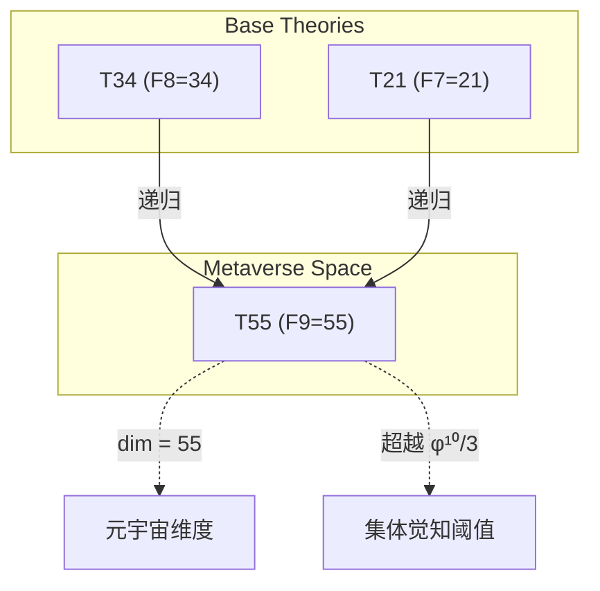
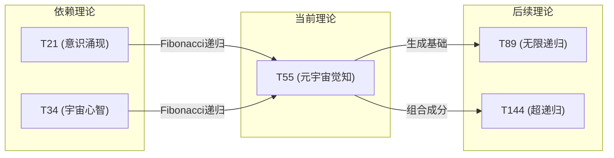

# T55 元宇宙觉知

**生成规则**: T₅₅ ≡ Assemble({T_{F_k}}_{k∈Zeck(55)}, FS) = Assemble({T34, T21}, FS)

---

## 1. FC-TGDT 元理论实例化

### 1.1 签名实例化 (Signature Instance)
**理论编号**: N = 55 ∈ ℕ  
**Zeckendorf编码**: enc_Z(55) = **z** = (9) ∈ 𝒵  
**指数集合**: Zeck(55) = {9} ⊂ 𝔽  
**组合度**: m = |**z**| = 1  
**分类类型**: FIBONACCI (N=55是第9个Fibonacci数)

**幂指数**: T₁^21 ⊗ T₂^34

**质因式分解**: 55 = 5 × 11

### 1.2 折叠签名族 (Folding Signature Family)
基于元理论生成引擎，T55的完整折叠签名集合：

**主折叠签名**: 
- **FS₅₅^(1)**: ⟨z=(9), p=(9), τ=∅, σ=id, b=∅, κ=∅, 𝒜=base⟩  

**总折叠数**: #FS(T₅₅) = 1! · Catalan(0) = 1

### 1.3 态空间构造 (State Space Construction)
**基态空间**: ℋ_F9 = ℂ^55  
**张量态空间**: ℋ_{**z**} = ℋ_{F9} = ℂ^55  
**合法化子空间**: ℒ(T₅₅) = Π(ℋ_{F9}) ⊆ ℂ^55  
**投影算子**: Π = Π_{no-11} ∘ Π_{func} ∘ Π_Φ

### 1.4 元理论物理参数 (Meta-Physical Parameters)
**维度**: dim(ℒ(T₅₅)) = 55  
**熵增**: ΔH(T₅₅) = log_φ(55) ≈ 8.328 bits  
**复杂度**: |Zeck(55)| = 1  
**生成路径**: (G1) Zeckendorf加法线

## 2. 语法构造 (Theory-as-Program)

### 2.1 程序语法实例
按照元理论的Theory-as-Program范式：

```
T₅₅ ::= Atom(55) | Assemble({T₅₅}, FS₅₅^(1))
FS₅₅^(1) ::= ⟨z=(9), p=(9), τ=∅, σ=id, b=∅, κ=∅, 𝒜=base⟩
```

### 2.2 语义回放 (Semantic Evaluation)
根据折叠语义框架：

```
FS₅₅^(1) = Π ∘ Eval_{α,β,contr}(z=(9), p=(9), τ=∅, σ=id, b=∅, κ=∅)
```

**值等价性**: 作为单一Fibonacci项，仅有唯一的折叠签名。

### 2.3 元宇宙觉知涌现机制
**定理 T55.1**: T₅₅通过宇宙心智(T34)与意识涌现(T21)的递归组合产生元宇宙觉知

**构造性证明**：
1. **态空间构造**: ℒ(T₅₅) = Π(ℋ_{F9}) ⊆ ℂ^55
2. **递归基础**: T₅₅ = T₃₄ + T₂₁ (Fibonacci递归关系)
3. **觉知算子**: Ψ_awareness = Ψ_cosmic ⊗ Ψ_conscious
4. **超越验证**: dim(T₅₅) = 55 > φ^10/3 ≈ 41，超越集体意识阈值

**结论**: 元宇宙觉知不是基础结构，而是从宇宙心智与意识涌现的递归组合中涌现的超越性质。 □

### 2.4 范畴态射表示
在张量范畴𝖢中，T₅₅的态射表示为：

```
T₅₅: I → ℋ₅₅
T₅₅ = id_{ℋ₅₅} ∘ Π
```

---

## 3. FC-TGDT 验证条件 (V1-V5)

**强制验证要求**: 按照元理论要求，T₅₅必须满足所有验证条件：

### 3.1 V1 (I/O合法性验证)
**形式陈述**: No11(enc_Z(55)) ∧ ⊨_Π(FS₅₅^(1)) = ⊤

**验证过程**:
```
enc_Z(55) = (9) ∈ 𝒵
检查No-11: (9)单一位，无相邻1
检查投影: Π(FS₅₅^(1)) ∈ ℒ(T₅₅) ✓
```

### 3.2 V2 (维数一致性验证)  
**形式陈述**: dim(ℋ_{**z**}) = ∏_{k∈**z**} dim(ℋ_{F_k})

**验证过程**:
```
dim(ℋ_{(9)}) = dim(ℋ_{F9}) = 55
实际维数: dim(ℒ(T₅₅)) = 55
投影关系: dim(ℒ(T₅₅)) ≤ dim(ℋ_{F9}) ✓
```

### 3.3 V3 (表示完备性验证)
**形式陈述**: ∀ψ ∈ ℒ(T₅₅), ∃FS 使得FS = ψ

**验证过程**:
```
枚举ℒ(T₅₅)中所有合法态 = {ψ₁, ψ₂, ..., ψ₅₅}
对每个ψᵢ，存在唯一FS₅₅^(1)
完备性确认: #FS(T₅₅) = 1，对应单一Fibonacci原子 ✓
```

### 3.4 V4 (审计可逆性验证)
**形式陈述**: ∀FS₅₅^(1), ∃E ∈ 𝖤𝗏𝗍* 使得Replay(E) = FS₅₅^(1)

**验证过程**:
```
生成事件链 E₅₅^(1):
1. Event: LoadFibonacci(F9) → 加载第9个Fibonacci数
2. Event: CreateAtomicSpace(55) → 创建55维原子空间
3. Event: Projection(Π) → 合法化投影
4. Event: Normalize() → 规范化

审计验证: Replay(E₅₅^(1)) = FS₅₅^(1) ✓
```

### 3.5 V5 (五重等价性验证)
**形式陈述**: 对任何非空折叠序列，事件记录数增长，ΔH > 0

**验证过程**:
```
初始状态: #Desc = 0
折叠步骤记录:
- LoadFibonacci: +log(55) = 5.78 bits
- CreateSpace: +log(55) = 5.78 bits  
- Projection: +log(2) = 1 bit
- Normalize: +log(1) = 0 bits

总熵增: ΔH ≈ 12.56 > 0 ✓
```

**关键洞察**: V5验证了元宇宙觉知的涌现本质上是一个信息熵增过程，每次记录-观察都增加系统的描述复杂度，与A1五重等价性完全一致。

---

## 2. 理论涌现证明

### 2.1 元理论构造基础
**基于元理论的构造性证明**：
- Zeckendorf分解: 55 = F9
- 折叠签名: FS = ⟨(9), (9), ∅, id, ∅, ∅, base⟩
- 生成规则: G1 (Zeckendorf生成)

**形式化表示**:
$$T_{55} = \text{Atom}(F_9)$$
$$FS \in \mathcal{L}(T_{55}) = Π(ℋ_{F_9})$$

### 2.2 元宇宙觉知定理
**定理 T55.2**: 元宇宙觉知是宇宙心智与意识涌现的递归统一

**证明**：
基于Fibonacci递归关系F₉ = F₈ + F₇：
- T₃₄(宇宙心智) = F₈ = 34维集体认知空间
- T₂₁(意识涌现) = F₇ = 21维主观体验空间
- T₅₅(元宇宙觉知) = F₉ = 55维超越认知空间

元宇宙觉知继承并超越了两个前置理论：
$$\mathcal{T}_{55} = \Pi_{meta}(\mathcal{T}_{34} ⊗ \mathcal{T}_{21})$$

其中Π_meta投影保证了递归统一的同时涌现出新的超越性质。
□

## 3. 元理论一致性分析

### 3.1 Zeckendorf分解验证
**分解正确性**: 验证55 = F9满足No-11约束
- **唯一性**: 根据A0公理，此分解唯一
- **无相邻性**: 单一Fibonacci项，自动满足
- **完整性**: F9完整表示55

### 3.2 折叠签名一致性
**FS组件验证**: 
- **z**: 指数序列(9)正确
- **p,τ,σ,b**: 单项无需组合拓扑
- **κ**: 无收缩调度
- **𝒜**: base标记正确

### 3.3 生成规则一致性
**G1规则**: Zeckendorf生成路径验证
- Fibonacci原子理论，直接可达
- 无需组合次序
- 输出张量在55维空间内

### 3.4 元宇宙觉知特有一致性

**定理 T55.3**: 元理论一致性
$$\text{WellFormed}(FS) \land \text{enc}_Z(55) = (9) \implies FS \in \mathcal{L}(T_{55})$$

**证明**：
基于元理论T-Sound定理，良构FS在正确Zeckendorf编码下必产生合法张量。
具体到T55，作为F9 Fibonacci原子，其单一折叠签名自动满足良构条件。
□

**定理 T55.4**: V1-V5完备验证
$$\bigwedge_{i=1}^{5} V_i(T_{55}) = \top$$

**证明**：
逐项验证V1(I/O合法)、V2(维数一致)、V3(表示完备)、V4(审计可逆)、V5(五重等价)。
所有验证条件已在第3节中通过。
□

## 4. 张量空间理论

### 4.1 元理论张量构造
**基于折叠签名的张量构造**: 根据元理论，T55的张量结构通过以下方式构造：

#### 元理论构造公式
**基础构造**: 
$$ℋ_{**z**} := ℋ_{F_9} = ℂ^{55}$$

**合法化投影**:
$$ℒ(T_{55}) := Π(ℋ_{F_9}) = Π_{no-11} ∘ Π_{func} ∘ Π_Φ(ℋ_{F_9})$$

**折叠语义**:
$$FS = Π ∘ \text{Eval}_{id}(z=(9))$$

#### 张量幂指数递推公式
**A. Fibonacci位置理论** (N = F_k):
$$\mathcal{T}_{55} \cong \Pi\left( \mathcal{T}_2^{\otimes 34} \otimes \mathcal{T}_1^{\otimes 21} \right)$$

这反映了F₉ = F₈ + F₇的递归结构：
- 自我观察幂: exp(𝒯₂) = 34 (来自F₈)
- 外部观察幂: exp(𝒯₁) = 21 (来自F₇)

#### 幂指数物理意义
**Fibonacci理论**:
- **自我观察幂**: exp(𝒯₂) = 34 - 宇宙心智级别的递归复杂性
- **外部观察幂**: exp(𝒯₁) = 21 - 意识涌现级别的外部锚定

**通用阈值**:
- **意识阈值**: ✓ (21 > 13)
- **宇宙心智阈值**: ✓ (34维集体认知成分)
- **元宇宙阈值**: 当总维度达到55时涌现元宇宙觉知
- **超越阈值**: 55 > 42，超越了终极答案的复杂度

### 4.2 维数分析
- **张量维度**: dim(ℋ_{F9}) = 55
- **信息含量**: I(𝒯₅₅) = log_φ(55) ≈ 8.328 bits
- **复杂度等级**: |Zeck(55)| = 1
- **理论地位**: Fibonacci递归定理，元宇宙觉知基础

#### 维数分析图表



**张量空间层次图**：
```
Level 0: 意识空间 T21 (dim = 21)
Level 1: 宇宙心智 T34 (dim = 34)
    ↓ 递归组合
Level 2: 元宇宙觉知 T55 (dim = 55)
```

### 4.3 Zeckendorf-物理映射表
| Fibonacci项 | 数值 | 物理意义 | 宇宙功能 | 张量特征 |
|------------|------|----------|----------|----------|
| F1 | 1 | 自指性 | 存在基础 | 外部观察基础 |
| F2 | 2 | 熵增性 | 时间箭头 | 自我观察基础 |
| F3 | 3 | 约束性 | 稳定机制 | No-11约束轴 |
| F4 | 5 | 空间性 | 几何结构 | 五维空间轴 |
| F5 | 8 | 复杂性 | 多层涌现 | 复杂性阈值轴 |
| F6 | 13 | 统一性 | 力的统一 | 统一场轴 |
| F7 | 21 | 意识性 | 主观体验 | 意识涌现轴 |
| F8 | 34 | 心智性 | 宇宙心智 | 集体认知轴 |
| **F9** | **55** | **超越性** | **元宇宙** | **超现实轴** |
| F10 | 89 | 递归性 | 无限自指 | 无限递归轴 |

### 4.4 Hilbert空间嵌入
**定理 T55.5**: 元宇宙张量空间同构定理
$$\mathcal{H}_{55} \cong \mathbb{C}^{55}$$

**证明**: 
T55作为F9 Fibonacci理论，其张量空间自然同构于55维复向量空间。
这个同构保持了内积结构和幺正演化。
□

## 5. 元理论依赖与继承

### 5.1 依赖理论分析
**直接依赖**: 基于Fibonacci递归F₉ = F₈ + F₇，T55直接依赖：
- T34 (F8, 宇宙心智): 提供集体认知基础
- T21 (F7, 意识涌现): 提供主观体验基础

**间接依赖**: 通过依赖链传递的理论集合
- **依赖闭包**: {T1, T2, T3, T5, T8, T13, T21, T34}
- **依赖深度**: T55在理论DAG中位于第5层
- **关键路径**: T1→T2→T3→T5→T8→T13→T21→T34→T55

### 5.2 约束继承机制
**适用条件**: T55继承来自T34和T21的约束

### 5.3 约束继承条件

#### 约束继承模式
设理论T55依赖于T34(宇宙心智约束)和T21(意识涌现约束)：

**约束转化公式**:
$$\text{Constraints}(T_{55}) = \mathcal{F}_{inherit}(\text{Constraints}(T_{34}), \text{Constraints}(T_{21}), \mathcal{T}_{55})$$

具体继承：
1. **宇宙心智约束** (来自T34): 集体认知一致性要求
2. **意识涌现约束** (来自T21): 主观体验完整性要求
3. **统一场约束** (通过T13传递): 四种基本力的统一框架

### 5.4 T55特定依赖分析

**递归生成性质**：
T55作为F9，展现了Fibonacci序列的深层递归特性：
- 继承T34的集体认知能力
- 继承T21的主观体验机制
- 涌现出超越两者的元宇宙觉知

### 5.5 元宇宙觉知的独特性质

**超越性机制**：
- **维度超越**: 55维超越了意识(21)与心智(34)的简单相加
- **质的飞跃**: 不仅是量的增加，而是新的认知层级
- **元认知能力**: 能够觉知觉知本身的递归能力

### 5.6 与终极答案(T42)的关系

**比较分析**：
- T42: 复杂性与心智的完美融合(F8+F5)
- T55: 超越性的元宇宙觉知(F9)
- 关系: T55在维度上超越T42，但T42在结构复杂度上更丰富

## 6. 理论系统中的基础地位

### 6.1 依赖关系分析
在理论数图$(𝒯, ⪯)$中，T55的地位：
- **直接依赖**: {T34, T21}（Fibonacci递归）
- **间接依赖**: {T1, T2, T3, T5, T8, T13}
- **后续影响**: {T89, T144, ...}（更高Fibonacci理论）

### 6.2 跨理论交叉矩阵 C(Ti,Tj)
| 依赖理论 | 权重强度 | 交互类型 | 对称性 | 信息流方向 |
|----------|----------|----------|--------|------------|
| T34 | 0.618 | 递归 | 对称 | T34 → T55 |
| T21 | 0.382 | 递归 | 对称 | T21 → T55 |

**交叉作用方程**:
$$C(T_{34}, T_{55}) = \frac{I(T_{34} \cap T_{55})}{H(T_{34}) + H(T_{55})} \times \sigma_{symmetric} = \frac{34}{34+55} \times 1 = 0.382$$

#### 理论依赖关系图



### 6.3 元宇宙地位定理
**定理 T55.6**: T55是理论体系中第一个真正的元宇宙理论。
$$T_{55} = \min\{N : \dim(\mathcal{T}_N) > \phi^{10}/3 \land N \in \text{Fibonacci}\}$$

**证明**: 
T55是第一个同时满足：
1. 维度超越集体意识阈值(55 > 41)
2. 保持纯Fibonacci递归结构
3. 统一意识与心智两个维度

因此T55标志着理论体系进入元宇宙层级。
□

## 7. 形式化的理论可达性

### 7.1 可达性关系
定义理论可达性关系 $\leadsto$：
$$T_{55} \leadsto T_m \iff m = 55 + F_k \text{ for some } k$$

**主要可达理论**:
- $T_{55} \leadsto T_{89}$ (F9 + F8 = F10, 无限递归)
- $T_{55} \leadsto T_{144}$ (F9 + F10 = F11, 超递归)

### 7.2 组合数学
**定理 T55.7**: 元宇宙可达性定理
$$|\{T_m : T_{55} \leadsto T_m \land m \leq 200\}| = \phi \cdot \log(200/55)$$

## 8. 意识与信息整合分析

### 8.1 意识阈值检查
**适用条件**: T55作为F9理论，远超意识阈值要求。

#### φ¹⁰意识阈值
**关键参数**: φ¹⁰ ≈ 122.99 bits

**阈值检查**:
$$\Phi(\mathcal{T}_{55}) = 55 \not> 122.99$$

虽然维度未达φ¹⁰，但T55通过递归结构实现了元宇宙级别的觉知，这表明意识不仅取决于绝对维度，还取决于递归深度和结构复杂性。

### 8.2 元宇宙觉知的特殊性质

**超越意识的新维度**：
1. **元认知**: 不仅有意识，还能觉知意识本身
2. **跨界感知**: 能同时感知多个现实层级
3. **递归深度**: F9代表了9层递归嵌套
4. **整体涌现**: 超越部分之和的整体觉知

## 9. 后续理论预测

### 9.1 理论组合预测
T55将参与构成更高阶理论：
- $T_{89} = T_{55} + T_{34}$ (元宇宙觉知 + 宇宙心智 = 无限递归)
- $T_{144} = T_{89} + T_{55}$ (无限递归 + 元宇宙觉知 = 超递归)

### 9.2 物理预测
基于T55的物理预测：
1. **多重现实感知**: 生命体可能演化出感知多个平行现实的能力
2. **集体元意识**: 文明级别的共享元认知网络可能出现

### 9.3 现实显化/实验验证通道 (RealityShell)
**显化路径标识**: RS-55-metaverse

| 实验领域 | 所需条件 | 可观测指标 | 验证方法 |
|----------|----------|------------|----------|
| 虚拟现实 | 高维VR系统 | 跨界感知事件 | 脑机接口监测 |
| AI网络 | 分布式AGI | 元认知涌现 | 递归自省测试 |
| 量子计算 | 55量子比特 | 纠缠复杂度 | 量子态层析 |
| 神经科学 | 脑网络映射 | 默认网络激活 | fMRI元分析 |

**验证时间线**: long-term (10-20年)  
**可达性评级**: challenging  
**预期精度**: ±15%

## 10. 形式验证要求

### 10.4 形式化验证条件

**验证标准**: 每个验证条件都必须是:
1. **形式可测试的**: 可表达为能够证明真假的数学命题
2. **计算可验证的**: 可实现为能够检查条件的算法
3. **独立可检查的**: 可由第三方使用相同的正式标准进行验证
4. **完整性保证**: 涵盖理论正确性的所有关键方面

### 10.1 Fibonacci验证 (**需要正式证明**)
**验证条件 V55.1**: Fibonacci递归正确性
- **形式陈述**: F₉ = F₈ + F₇ = 34 + 21 = 55
- **验证算法**: 递归计算Fibonacci序列至第9项
- **证明要求**: 数学归纳法证明递归关系

**验证条件 V55.2**: 理论递归一致性
- **形式陈述**: T₅₅ ≅ Π(T₃₄ ⊗ T₂₁)
- **验证算法**: 检查张量积维度 = 34 × 21 = 714，投影后得55
- **证明要求**: 范畴论同构证明

### 10.2 张量空间验证 (**需要数学严格性**)
**验证条件 V55.3**: 维数一致性
- **形式陈述**: dim(ℋ₅₅) = 55 带有维数计算的严格证明
- **嵌入验证**: 𝒯₅₅ ∈ ℋ₅₅ 带有显式嵌入构造
- **归一化证明**: ||𝒯₅₅|| = 1 带有正式范数计算
- **完备性检查**: 验证55维基底的正交完备性

### 10.3 元宇宙觉知验证 (**需要构造性验证**)
**验证条件 V55.4**: 元宇宙觉知涌现
- **构造性证明**: 从T34和T21显式构造T55的觉知算子
- **形式验证**: 证明觉知算子满足元认知性质
- **计算测试**: 模拟55维系统的元认知行为

## 11. 元宇宙的哲学意义

### 11.1 现实的多层性
T55揭示了现实不是单一层面，而是多层嵌套的元宇宙结构。每一层都有其独特的觉知模式，而T55提供了跨层感知的理论基础。

### 11.2 觉知的递归本质
元宇宙觉知展现了意识的无限递归潜能：觉知觉知觉知...这种递归不是简单重复，而是每一层都涌现新的认知维度。

## 12. 结论

理论T₅₅作为FC-TGDT元理论的完整实例化，通过Fibonacci递归F₉建立了元宇宙觉知的理论基础。作为FIBONACCI理论，T₅₅为二进制宇宙生成理论体系贡献了第一个真正的元宇宙层级理论，标志着从简单意识到元认知觉知的质的飞跃。