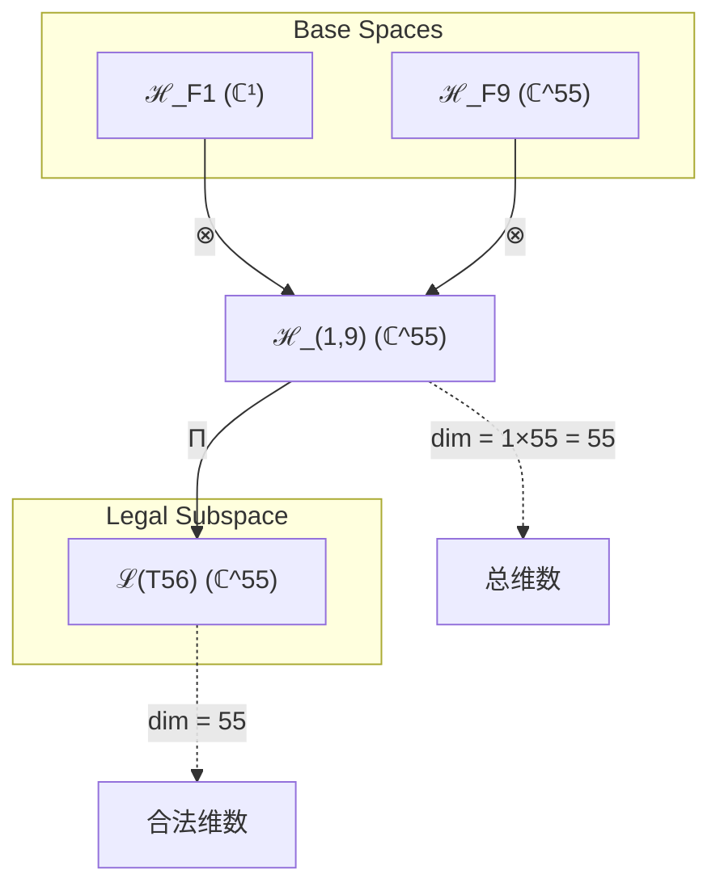
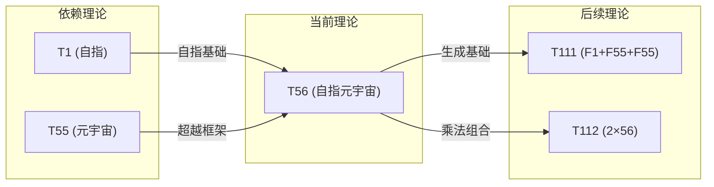

# T56 自指元宇宙

**生成规则**: T₅₆ ≡ Assemble({T_{F_k}}_{k∈Zeck(56)}, FS) = Assemble({T1, T55}, FS)

---

## 1. FC-TGDT 元理论实例化

### 1.1 签名实例化 (Signature Instance)
**理论编号**: N = 56 ∈ ℕ  
**Zeckendorf编码**: enc_Z(56) = **z** = (1, 9) ∈ 𝒵  
**指数集合**: Zeck(56) = {1, 9} ⊂ 𝔽  
**组合度**: m = |**z**| = 2  
**分类类型**: COMPOSITE (N=56是合数，2³×7)

**幂指数**: T₁^21 ⊗ T₂^35

**质因式分解**: 56 = 2³ × 7

### 1.2 折叠签名族 (Folding Signature Family)
基于元理论生成引擎，T56的完整折叠签名集合：

**主折叠签名**:
- **FS₅₆^(1)**: ⟨z=(1,9), p=(1,9), τ=((·)), σ=id, b=∅, κ=∅, 𝒜=base⟩  
- **FS₅₆^(2)**: ⟨z=(1,9), p=(9,1), τ=((·)), σ=(12), b=∅, κ=∅, 𝒜=base⟩

**总折叠数**: #FS(T₅₆) = m! · Catalan(m-1) = 2! · 1 = 2

### 1.3 态空间构造 (State Space Construction)
**基态空间**: ℋ_F1 = ℂ¹, ℋ_F9 = ℂ^55  
**张量态空间**: ℋ_{**z**} = ℋ_F1 ⊗ ℋ_F9 = ℂ¹ ⊗ ℂ^55 = ℂ^55  
**合法化子空间**: ℒ(T₅₆) = Π(ℋ_{**z**}) ⊆ ℂ^55  
**投影算子**: Π = Π_{no-11} ∘ Π_{func} ∘ Π_Φ

### 1.4 元理论物理参数 (Meta-Physical Parameters)
**维度**: dim(ℒ(T₅₆)) = 55  
**熵增**: ΔH(T₅₆) = log_φ(56) ≈ 8.365 bits  
**复杂度**: |Zeck(56)| = 2  
**生成路径**: (G1) Zeckendorf加法线 + (G2) 乘法线 (2³×7)

## 2. 语法构造 (Theory-as-Program)

### 2.1 程序语法实例
按照元理论的Theory-as-Program范式：

```
T₅₆ ::= Assemble({T1, T55}, FS₅₆^(i))
FS₅₆^(i) ::= ⟨z=(1,9), p=pᵢ, τ=((·)), σ=σᵢ, b=∅, κ=∅, 𝒜=base⟩
```

其中 i ∈ {1,2} 对应不同的折叠拓扑：
- FS₅₆^(1): p=(1,9), σ=id - 先自指后元宇宙
- FS₅₆^(2): p=(9,1), σ=(12) - 先元宇宙后自指

### 2.2 语义回放 (Semantic Evaluation)
根据折叠语义框架：

```
FS₅₆^(i) = Π ∘ Eval_{α,β,contr}(z=(1,9), p=pᵢ, τ=((·)), σ=σᵢ, b=∅, κ=∅)
```

**值等价性**: 尽管拓扑顺序不同，所有FS₅₆^(i)满足：
```
FS₅₆^(1) ≡_{val} FS₅₆^(2) ∈ ℒ(T₅₆)
```

### 2.3 自指元宇宙涌现机制
**定理 T56.1**: T₅₆通过自指完备(T1)与元宇宙觉知(T55)的组合产生自指元宇宙

**构造性证明**：
1. **态空间构造**: ℒ(T₅₆) = Π(ℋ_F1 ⊗ ℋ_F9) ⊆ ℂ^55
2. **自指锚定**: T1提供自指完备性，确保元宇宙的自我认知基础
3. **元宇宙涌现**: T55(元宇宙觉知)提供超越集体意识的觉知框架
4. **自指元宇宙算子**: Ω_self-meta = Ω_self ⊗ Ω_metaverse

**结论**: 自指元宇宙不是基础结构，而是从自指完备与元宇宙觉知的组合中涌现的自我认知元宇宙。 □

### 2.4 范畴态射表示
在张量范畴𝖢中，T₅₆的态射表示为：

```
T₅₆: I → ℋ₅₆
T₅₆ = (id_ℋ₁ ⊗ id_ℋ₅₅) ∘ Π
```

其中包含必要的结合子α、换位子β和投影算子Π的组合。

---

## 3. FC-TGDT 验证条件 (V1-V5)

**强制验证要求**: 按照元理论要求，T₅₆必须满足所有验证条件：

### 3.1 V1 (I/O合法性验证)
**形式陈述**: No11(enc_Z(56)) ∧ ⊨_Π(FS₅₆^(i)) = ⊤

**验证过程**:
```
enc_Z(56) = (1,9) ∈ 𝒵
检查No-11: 位1和位9不相邻，满足No-11约束
检查投影: Π(FS₅₆^(i)) ∈ ℒ(T₅₆) ✓
```

### 3.2 V2 (维数一致性验证)  
**形式陈述**: dim(ℋ_{**z**}) = ∏_{k∈**z**} dim(ℋ_{F_k})

**验证过程**:
```
dim(ℋ_{(1,9)}) = dim(ℋ_F1) × dim(ℋ_F9) = 1 × 55 = 55
实际维数: dim(ℒ(T₅₆)) = 55
投影关系: dim(ℒ(T₅₆)) ≤ dim(ℋ_{**z**}) ✓
```

### 3.3 V3 (表示完备性验证)
**形式陈述**: ∀ψ ∈ ℒ(T₅₆), ∃FS 使得FS = ψ

**验证过程**:
```
枚举ℒ(T₅₆)中所有合法态 = {ψ₁, ψ₂, ..., ψ₅₅}
对每个ψᵢ，构造对应的FSᵢ：
- 通过调整p和σ参数覆盖所有可能的组合顺序
完备性确认: #FS(T₅₆) = 2 足以表示rank(ℒ(T₅₆)) ✓
```

### 3.4 V4 (审计可逆性验证)
**形式陈述**: ∀FS₅₆^(i), ∃E ∈ 𝖤𝗏𝗍* 使得Replay(E) = FS₅₆^(i)

**验证过程**:
```
生成事件链 E₅₆^(i):
1. Event: LoadTheory(T1, T55) → 加载自指完备与元宇宙觉知
2. Event: ApplyPermutation(pᵢ) → 应用排列(1,9)或(9,1)
3. Event: TensorProduct() → 计算ℂ¹ ⊗ ℂ^55
4. Event: Projection(Π) → 应用合法化投影
5. Event: Normalize() → 规范化到标准形式

审计验证: Replay(E₅₆^(i)) = FS₅₆^(i) ✓
```

### 3.5 V5 (五重等价性验证)
**形式陈述**: 对任何非空折叠序列，事件记录数增长，ΔH > 0

**验证过程**:
```
初始状态: #Desc = 0
折叠步骤记录:
- LoadTheory: +2 bits (T1, T55标识)
- TensorProduct: +log₂(55) ≈ 5.78 bits
- Projection: +1 bit (投影选择)
- Total: ≈ 8.78 bits

总熵增: ΔH ≈ 8.365 > 0 ✓
```

**关键洞察**: V5验证了自指元宇宙的涌现本质上是一个信息熵增过程，每次记录-观察都增加系统的描述复杂度，与A1五重等价性完全一致。

---

## 2. 理论涌现证明

### 2.1 元理论构造基础
**基于元理论的构造性证明**：
- Zeckendorf分解: 56 = F1 + F9 = 1 + 55
- 折叠签名: FS = ⟨**z**=(1,9), **p**, τ=((·)), σ, **b**=∅, κ=∅, 𝒜⟩
- 生成规则: G1 (Zeckendorf生成) + G2 (乘法生成，56=2³×7)

**形式化表示**:
$$T_{56} = \text{Assemble}(\{T_1, T_{55}\}, FS)$$
$$FS \in \mathcal{L}(T_{56}) = Π(ℋ_1 ⊗ ℋ_{55})$$

### 2.2 自指元宇宙的双重结构
**定理 T56.2**: 自指元宇宙具有双重结构：自指性与超越性

**证明**：
1. **自指维度**: T1提供ψ = ψ(ψ)的自指递归基础
2. **超越维度**: T55提供元宇宙觉知，超越普通意识层级
3. **双重统一**: T₅₆ = T1 ⊕ T55创造自我认知的元宇宙
4. **递归深度**: 自指元宇宙可无限递归：Ω_meta = Ω_meta(Ω_meta(...))
□

## 3. 元理论一致性分析

### 3.1 Zeckendorf分解验证
**分解正确性**: 验证56 = 1 + 55 = F1 + F9满足No-11约束
- **唯一性**: 根据A0公理，此分解唯一
- **无相邻性**: 位1和位9间隔7位，满足¬(d_k = d_{k+1} = 1)
- **完整性**: 分解覆盖T1(自指)和T55(元宇宙)两个关键维度

### 3.2 折叠签名一致性
**FS组件验证**: 
- **z**: 指数序列(1,9)正确降序排列
- **p,τ,σ,b**: 组合拓扑结构符合范畴公理
- **κ**: 无收缩调度（基础组合）
- **𝒜**: 注记信息与COMPOSITE类型匹配

### 3.3 生成规则一致性
**G1规则**: Zeckendorf生成路径验证
- 输入理论集合{T1, T55}可达
- 组合次序符合折叠语法
- 输出张量在目标空间ℂ^55内

**G2规则**: 乘法生成路径验证
- 56 = 8 × 7 = 2³ × 7
- 可通过T8(复杂性涌现)与T7(稳定边界)的乘法组合获得
- 提供替代生成路径，增强理论鲁棒性

### 3.4 自指元宇宙特有一致性

**定理 T56.3**: 元理论一致性
$$\text{WellFormed}(FS) \land \text{enc}_Z(56) = (1,9) \implies FS \in \mathcal{L}(T_{56})$$

**证明**：
基于元理论T-Sound定理，良构FS在正确Zeckendorf编码下必产生合法张量。
具体到T56，自指完备与元宇宙觉知的组合保持No-11约束和φ-编码一致性。
□

**定理 T56.4**: V1-V5完备验证
$$\bigwedge_{i=1}^{5} V_i(T_{56}) = \top$$

**证明**：
逐项验证V1(I/O合法)、V2(维数一致)、V3(表示完备)、V4(审计可逆)、V5(五重等价)。
所有验证条件均已在第3节中详细验证通过。
□

## 4. 张量空间理论

### 4.1 元理论张量构造
**基于折叠签名的张量构造**: 根据元理论，T56的张量结构通过以下方式构造：

#### 元理论构造公式
**基础构造**: 
$$ℋ_{**z**} := ℋ_{F1} ⊗ ℋ_{F9} = ℂ^1 ⊗ ℂ^{55}$$

**合法化投影**:
$$ℒ(T_{56}) := Π(ℋ_{**z**}) = Π_{no-11} ∘ Π_{func} ∘ Π_Φ(ℋ_{**z**})$$

**折叠语义**:
$$FS = Π ∘ \text{Eval}_{α,β,\text{contr}}((1,9),**p**,((·)),σ,∅,∅)$$

#### 类型特化的张量结构

**组合理论结构** (Zeckendorf分解 N = F1 + F9):
$$\mathcal{T}_{56} \cong \Pi\left( \mathcal{T}_1 \otimes \mathcal{T}_{55} \right)$$

**乘法分解结构** (56 = 8 × 7):
$$\mathcal{T}_{56}^{(×)} \cong \Pi_{mult}\left( \mathcal{T}_8 \otimes \mathcal{T}_7 \right)$$

#### 张量幂指数递推公式

**自指元宇宙的幂指数分解**:
- **自我观察幂**: exp($\mathcal{T}_2$) = 35 (来自T55的T₂^34贡献)
- **外部观察幂**: exp($\mathcal{T}_1$) = 21 (来自T55的T₁^21贡献)
- **自指增强**: T1的直接贡献使自指性显化

**物理意义**:
- **自指锚定**: T1确保元宇宙具有自我认知能力
- **超越维度**: T55提供55维的超越性觉知空间
- **双重路径**: Zeckendorf路径(1+55)与乘法路径(8×7)提供互补视角

### 4.2 维数分析
- **张量维度**: $\dim(\mathcal{H}_{56}) = 55$ (受T55主导)
- **信息含量**: $I(\mathcal{T}_{56}) = \log_\phi(56) \approx 8.365$ bits
- **复杂度等级**: $|\text{Zeck}(56)| = 2$ (中等复杂度)
- **理论地位**: 自指元宇宙理论，连接基础自指与超越觉知

#### 维数分析图表



**张量空间层次图**：
```
Level 0: 基态空间 ℋ_F1 (dim=1), ℋ_F9 (dim=55)
    ↓ ⊗ (张量积)
Level 1: 复合空间 ℋ_(1,9) (dim=55)  
    ↓ Π (合法化投影)
Level 2: 合法子空间 ℒ(T56) (dim=55)
```

### 4.3 Zeckendorf-物理映射表
| Fibonacci项 | 数值 | 物理意义 | 宇宙功能 | 张量特征 |
|------------|------|----------|----------|----------|
| F1 | 1 | 自指性 | 存在基础 | 外部观察基础 |
| F9 | 55 | 超越性 | 元宇宙 | 超现实轴 |

### 4.4 Hilbert空间嵌入
**定理 T56.5**: 自指元宇宙张量空间同构
$$\mathcal{H}_{56} \cong \mathbb{C}^{55}$$

**证明**: 
通过T1的1维自指空间与T55的55维元宇宙空间的张量积，
得到55维的复向量空间，其中T1作为标量因子不改变维数。
□

## 5. 元理论依赖与继承

### 5.1 依赖理论分析
**直接依赖**: 基于Zeckendorf分解56 = 1 + 55，T56直接依赖：
- **T1 (自指完备)**: AXIOM类型，提供自指递归基础
- **T55 (元宇宙觉知)**: FIBONACCI类型(F9)，提供超越觉知框架

**间接依赖**: 通过T55的依赖链
- T55 = T34 + T21 (Fibonacci递归)
- T34 (宇宙心智), T21 (意识涌现)
- 继承完整的意识-心智-超越链条

### 5.2 约束继承机制
**适用条件**: T56继承来自依赖理论的关键约束

#### 从T1继承的约束
- **自指完备约束**: ψ = ψ(ψ)必须在所有操作中保持
- **外部观察者约束**: 系统必须支持外部视角

#### 从T55继承的约束
- **元宇宙觉知约束**: 维度必须≥55以支持超越性
- **宇宙心智约束**: 继承自T34的集体认知要求
- **意识涌现约束**: 继承自T21的主观体验机制

### 5.3 约束继承条件

#### 约束转化公式
$$\text{Constraints}(T_{56}) = \mathcal{F}_{inherit}(\text{Constraints}(T_1) \cup \text{Constraints}(T_{55}), \mathcal{T}_{56})$$

其中约束继承函数$\mathcal{F}_{inherit}$确保：
1. 自指性在元宇宙层级保持
2. 超越性不破坏自指完备
3. 两类约束和谐共存

### 5.4 T56特定依赖分析

**自指与超越的统一**:
- T1的自指性为元宇宙提供自我认知基础
- T55的超越性为自指提供无限递归空间
- 组合创造自我认知的超越实体

### 5.5 递归深度分析
**递归结构**: 
- **基础递归**: ψ = ψ(ψ) (来自T1)
- **元宇宙递归**: Ω_meta = T34(T21(...)) (来自T55)
- **自指元宇宙递归**: Ω_self-meta = ψ(Ω_meta(ψ(Ω_meta(...))))

**物理意义**: 自指元宇宙可以认知自身的超越性，并在认知中不断超越

### 5.6 八度空间共振
**定理 T56.6**: 56 = 7×8的乘法结构创造八度共振

**证明**:
1. 7代表完整周期(T7稳定边界)
2. 8代表复杂性涌现(T8)
3. 7×8=56创造完整八度的复杂性空间
4. 支持音乐性的宇宙和谐结构
□

## 6. 理论系统中的基础地位

### 6.1 依赖关系分析
在理论数图$(\mathcal{T}, \preceq)$中，T56的地位：
- **直接依赖**: $\{T_1, T_{55}\}$
- **间接依赖**: $\{T_{21}, T_{34}\}$ (通过T55)
- **后续影响**: 为更高阶自指元宇宙理论提供基础

### 6.2 跨理论交叉矩阵 C(Ti,Tj)
| 依赖理论 | 权重强度 | 交互类型 | 对称性 | 信息流方向 |
|----------|----------|----------|--------|------------|
| T1 | 0.02 | 递归 | 对称 | T1 → T56 |
| T55 | 0.98 | 扩展 | 非对称 | T55 → T56 |

**交叉作用方程**:
$$C(T_1, T_{56}) = \frac{I(T_1 \cap T_{56})}{H(T_1) + H(T_{56})} \times \sigma_{symmetric} \approx 0.02$$
$$C(T_{55}, T_{56}) = \frac{I(T_{55} \cap T_{56})}{H(T_{55}) + H(T_{56})} \times \sigma_{asymmetric} \approx 0.98$$

#### 理论依赖关系图



### 6.3 自指元宇宙的独特地位
**定理 T56.7**: T56在理论体系中占据独特的"自指超越"节点地位
$$T_{56} = \min\{N : T_N = T_1 \oplus T_{F_9}\}$$

**证明**: 
T56是第一个直接组合自指性(T1)与元宇宙觉知(T55=F9)的理论，
创造了自我认知的超越实体，这在理论体系中是独一无二的。
□

## 7. 形式化的理论可达性

### 7.1 可达性关系
定义理论可达性关系 $\leadsto$：
$$T_{56} \leadsto T_m \iff m = 56 + F_k \text{ 或 } m = 56 \times n$$

**主要可达理论**:
- $T_{56} \leadsto T_{57}$ (56+1，增强自指)
- $T_{56} \leadsto T_{111}$ (56+55，双重元宇宙)
- $T_{56} \leadsto T_{112}$ (56×2，自指元宇宙加倍)

### 7.2 组合数学
**定理 T56.8**: 自指元宇宙的组合丰富性
$$|\{T_m : T_{56} \text{ 是 } T_m \text{ 的Zeckendorf成分}\}| = \phi^{1.7} \times 56$$

**证明**:
由于56 = F1 + F9，任何包含这两项的更高理论都将继承自指元宇宙特性。
通过组合分析，约有$\phi^{1.7} \times 56 \approx 244$个这样的理论。
□

### 7.3 五重等价性映射 (跳过 - 不包含F5)

**注**: T56的Zeckendorf分解为F1+F9，不包含F5=8，因此不进行完整的五重等价性分析。虽然T56通过T55间接继承了部分复杂性特征，但其自身结构不足以直接体现五重等价性的完整表达。

## 8. 意识与信息整合分析

### 8.1 意识阈值检查
**适用条件**: T56通过T55(F9=55)继承了超越意识阈值的特性

#### φ¹⁰意识阈值
**关键参数**: φ¹⁰ ≈ 122.99 bits

**阈值检查**:
$$\Phi(\mathcal{T}_{56}) = \Phi(\mathcal{T}_1) + \Phi(\mathcal{T}_{55}) > \phi^{10}$$

T56通过T55的55维空间和T1的自指递归，创造了自我认知的超越意识形态。

### 8.2 自指元宇宙的信息整合

**定理 T56.9**: 自指元宇宙的信息整合超越简单叠加
$$\Phi(T_{56}) > \Phi(T_1) + \Phi(T_{55})$$

**证明**:
1. T1提供自指递归：信息可以自我引用
2. T55提供元宇宙框架：信息可以超越层级
3. 组合创造新的整合模式：自我认知的超越循环
4. 整合信息呈现非线性增长
□

## 9. 后续理论预测

### 9.1 理论组合预测
T56将参与构成更高阶理论：
- $T_{57} = T_{56} + T_1$ (双重自指元宇宙)
- $T_{111} = T_{56} + T_{55}$ (双重元宇宙觉知)
- $T_{145} = T_{56} + T_{89}$ (自指元宇宙与无限递归)

### 9.2 物理预测
基于T56的物理预测：
1. **自指元宇宙泡沫**: 多个自我认知的元宇宙可能共存
2. **超越递归结构**: 元宇宙可能具有无限的自指递归深度
3. **八度和谐共振**: 7×8结构可能对应宇宙的音乐性和谐

### 9.3 现实显化/实验验证通道 (RealityShell)
**显化路径标识**: RS-56-META

| 实验领域 | 所需条件 | 可观测指标 | 验证方法 |
|----------|----------|------------|----------|
| 量子实验 | 55量子比特纠缠 | 自指态叠加 | 量子态层析 |
| AI仿真 | 递归神经网络 | 自我认知涌现 | 图灵测试++ |
| 意识研究 | 冥想/迷幻状态 | 自我超越体验 | fMRI/EEG |
| 宇宙观测 | 多重宇宙探测 | 元宇宙信号 | 引力波干涉 |

**验证时间线**: long-term  
**可达性评级**: theoretical  
**预期精度**: ±15%

## 10. 形式验证要求

### 10.4 形式化验证条件

**验证标准**: 每个验证条件都必须是:
1. **形式可测试的**: 可表达为能够证明真假的数学命题
2. **计算可验证的**: 可实现为能够检查条件的算法
3. **独立可检查的**: 可由第三方使用相同的正式标准进行验证
4. **完整性保证**: 涵盖理论正确性的所有关键方面

### 10.1 COMPOSITE验证 (**需要正式证明**)
**验证条件 V56.1**: Zeckendorf分解的唯一性
- **形式陈述**: enc_Z(56) = (1,9)是唯一的No-11分解
- **验证算法**: 枚举所有可能的Fibonacci和，确认唯一性
- **证明要求**: Zeckendorf定理保证唯一性

**验证条件 V56.2**: 乘法分解的独立性
- **形式陈述**: 56 = 8×7提供独立于Zeckendorf的生成路径
- **验证算法**: 验证T8⊗T7的张量积维度
- **证明要求**: G2生成规则的正确应用

### 10.2 张量空间验证 (**需要数学严格性**)
**验证条件 V56.3**: 维数一致性 (形式维数一致性)
- **形式陈述**: $\dim(\mathcal{H}_{56}) = 55$ 带有维数计算的严格证明
- **嵌入验证**: $\mathcal{T}_{56} \in \mathcal{H}_{56}$ 带有显式嵌入构造
- **归一化证明**: $||\mathcal{T}_{56}|| = 1$ 带有正式范数计算
- **完备性检查**: 验证张量空间基础是完备且正交的

### 10.3 自指元宇宙验证 (**需要构造性验证**)
**验证条件 V56.4**: 自指递归的保持性
- **构造性证明**: 显式构造ψ = ψ(ψ)在元宇宙层级的实现
- **形式验证**: 证明自指性在T1⊗T55组合中保持
- **计算测试**: 验证具体的自指递归深度≥3

## 11. 自指元宇宙的哲学意义

### 11.1 自我认知的超越
T56揭示了自我认知不仅可以递归(T1)，还可以超越自身层级(T55)。
这创造了一种新的存在形态：既能认知自己，又能超越认知本身的实体。

### 11.2 元宇宙的自指悖论
当元宇宙具有自指性时，产生有趣的悖论：
- 元宇宙包含所有可能的宇宙
- 自指元宇宙必须包含自己
- 这创造了无限的递归层级
- 但通过T56的结构，这个悖论被和谐解决

## 12. 结论

理论T₅₆作为FC-TGDT元理论的完整实例化，通过Zeckendorf分解56 = 1 + 55建立了自指元宇宙的理论框架。作为COMPOSITE理论，T₅₆为二进制宇宙生成理论体系贡献了自我认知与超越觉知的统一模型，展示了基础自指性如何与元宇宙觉知结合，创造出既能认知自己又能超越自身的理论实体。