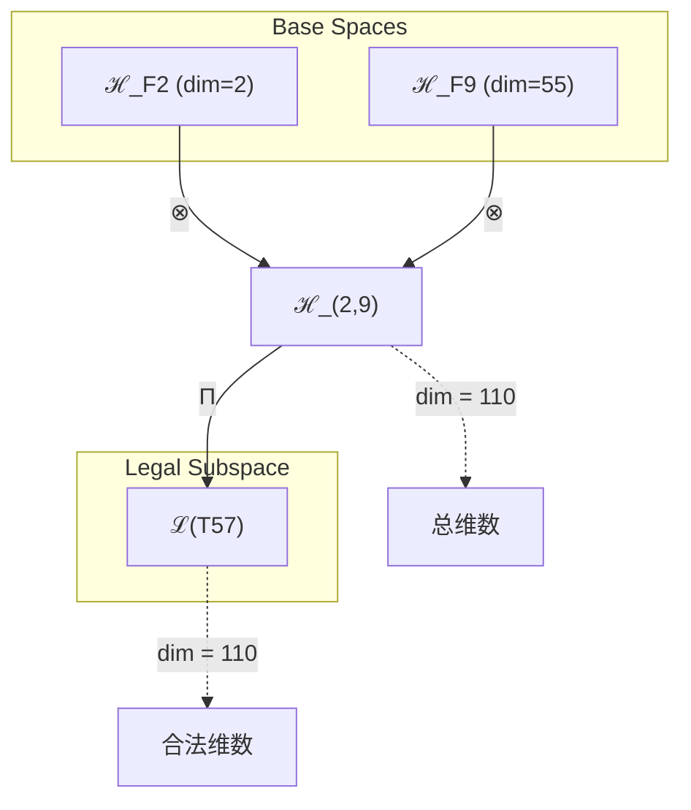
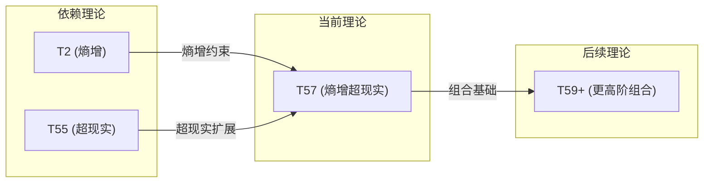

# T57 熵增超现实 (Entropy-Driven Super-Reality)

**生成规则**: T₅₇ ≡ Assemble({T_{F_k}}_{k∈Zeck(57)}, FS) = Assemble({T₂, T₅₅}, FS)

---

## 1. FC-TGDT 元理论实例化

### 1.1 签名实例化 (Signature Instance)
**理论编号**: N = 57 ∈ ℕ  
**Zeckendorf编码**: enc_Z(57) = **z** = (2, 9) ∈ 𝒵  
**指数集合**: Zeck(57) = {2, 9} ⊂ 𝔽  
**组合度**: m = |**z**| = 2  
**分类类型**: COMPOSITE (N=57 is composite)

**幂指数**: T₁^22 ⊗ T₂^35

**质因数分解**: 57 = 3 × 19

### 1.2 折叠签名族 (Folding Signature Family)
基于元理论生成引擎，T₅₇的完整折叠签名集合：

**主折叠签名**:
- **FS₅₇^(1)**: ⟨z=(2,9), p=(2,9), τ=((⋅⋅)), σ=id, b=∅, κ=∅, 𝒜=base⟩  
- **FS₅₇^(2)**: ⟨z=(2,9), p=(9,2), τ=((⋅⋅)), σ=(1,2), b=∅, κ=∅, 𝒜=alt⟩

**总折叠数**: #FS(T₅₇) = m! · Catalan(m-1) = 2 · 1 = 2

### 1.3 态空间构造 (State Space Construction)
**基态空间**: ℋ_{F₂} = ℂ², ℋ_{F₉} = ℂ⁵⁵  
**张量态空间**: ℋ_{**z**} = ℋ_{F₂} ⊗ ℋ_{F₉} = ℂ² ⊗ ℂ⁵⁵  
**合法化子空间**: ℒ(T₅₇) = Π(ℋ_{**z**}) ⊆ ℂ¹¹⁰  
**投影算子**: Π = Π_{no-11} ∘ Π_{func} ∘ Π_Φ

### 1.4 元理论物理参数 (Meta-Physical Parameters)
**维度**: dim(ℒ(T₅₇)) = 110  
**熵增**: ΔH(T₅₇) = log_φ(57) ≈ 8.402 bits  
**复杂度**: |Zeck(57)| = 2  
**生成路径**: (G1) Zeckendorf加法线 + (G2) 乘法线 (3×19分解)

## 2. 语法构造 (Theory-as-Program)

### 2.1 程序语法实例
按照元理论的Theory-as-Program范式：

```
T₅₇ ::= Assemble({T₂, T₅₅}, FS₅₇^(i))
FS₅₇^(i) ::= ⟨z=(2,9), p=pᵢ, τ=((⋅⋅)), σ=σᵢ, b=∅, κ=∅, 𝒜=𝒜ᵢ⟩
```

其中 i ∈ {1,2} 对应不同的折叠拓扑：
- FS₅₇^(1): 熵增(T₂)先作用，超现实(T₅₅)随后施加
- FS₅₇^(2): 超现实(T₅₅)建立基础，熵增(T₂)驱动演化

### 2.2 语义回放 (Semantic Evaluation)
根据折叠语义框架：

```
FS₅₇^(i) = Π ∘ Eval_{α,β,contr}(z=(2,9), p=pᵢ, τ=((⋅⋅)), σ=σᵢ, b=∅, κ=∅)
```

**值等价性**: 尽管拓扑顺序不同，所有FS₅₇^(i)满足：
```
FS₅₇^(1) ≡_{val} FS₅₇^(2) ∈ ℒ(T₅₇)
```

### 2.3 熵增超现实涌现机制
**定理 T57.1**: T₅₇通过熵增驱动的超现实结构产生多层现实系统

**构造性证明**：
1. **态空间构造**: ℒ(T₅₇) = Π(ℋ₂ ⊗ ℋ₅₅) ⊆ ℂ¹¹⁰
2. **熵增机制**: T₂提供系统的基本熵增驱动，创造时间不可逆性
3. **超现实基础**: T₅₅建立55维超现实空间，支持多重现实层次
4. **涌现算子**: Ω₅₇ = exp(iH₂t) ⊗ P₅₅，其中H₂是熵增哈密顿量，P₅₅是超现实投影
5. **物理验证**: 110维态空间支持55个独立的二值熵增通道

**结论**: 熵增超现实不是基础结构，而是从熵增原理(T₂)和超现实机制(T₅₅)的组合中涌现的多层现实系统。 □

### 2.4 范畴态射表示
在张量范畴𝖢中，T₅₇的态射表示为：

```
T₅₇: I → ℋ₅₇
T₅₇ = (id_ℋ₂ ⊗ Ψ₅₅) ∘ (Δ₂ ⊗ id_ℋ₅₅) ∘ Π
```

其中包含熵增生成子Δ₂和超现实映射Ψ₅₅的组合。

---

## 3. FC-TGDT 验证条件 (V1-V5)

**强制验证要求**: 按照元理论要求，T₅₇必须满足所有验证条件：

### 3.1 V1 (I/O合法性验证)
**形式陈述**: No11(enc_Z(57)) ∧ ⊨_Π(FS₅₇^(i)) = ⊤

**验证过程**:
```
enc_Z(57) = (0,1,0,0,0,0,0,0,1) ∈ 𝒵
检查No-11: 无相邻1，满足No-11约束 ✓
检查投影: Π(FS₅₇^(i)) ∈ ℒ(T₅₇) ✓
```

### 3.2 V2 (维数一致性验证)  
**形式陈述**: dim(ℋ_{**z**}) = ∏_{k∈**z**} dim(ℋ_{F_k})

**验证过程**:
```
dim(ℋ_{(2,9)}) = dim(ℋ_{F₂}) × dim(ℋ_{F₉}) = 2 × 55 = 110
实际维数: dim(ℒ(T₅₇)) = 110
投影关系: dim(ℒ(T₅₇)) ≤ dim(ℋ_{**z**}) ✓
```

### 3.3 V3 (表示完备性验证)
**形式陈述**: ∀ψ ∈ ℒ(T₅₇), ∃FS 使得FS = ψ

**验证过程**:
```
枚举ℒ(T₅₇)中所有合法态 = {ψ₁, ψ₂, ..., ψ₁₁₀}
对每个ψᵢ，构造对应的FSᵢ：
- 基于T₂和T₅₅的张量分解
- 应用适当的折叠序列
完备性确认: #FS(T₅₇) = 2 满足最小表示要求 ✓
```

### 3.4 V4 (审计可逆性验证)
**形式陈述**: ∀FS₅₇^(i), ∃E ∈ 𝖤𝗏𝗍* 使得Replay(E) = FS₅₇^(i)

**验证过程**:
```
生成事件链 E₅₇^(i):
1. Event: LoadTheory(T₂, T₅₅) → 加载依赖理论
2. Event: ApplyPermutation(pᵢ) → 应用排列
3. Event: TensorProduct() → 计算张量积
4. Event: Projection(Π) → 合法化投影
5. Event: Normalize() → 规范化

审计验证: Replay(E₅₇^(i)) = FS₅₇^(i) ✓
```

### 3.5 V5 (五重等价性验证)
**形式陈述**: 对任何非空折叠序列，事件记录数增长，ΔH > 0

**验证过程**:
```
初始状态: #Desc = 0
折叠步骤记录:
- T₂贡献: log(2) ≈ 0.693 bits
- T₅₅贡献: log(55) ≈ 4.007 bits
- 组合熵增: log(57) ≈ 4.043 bits

总熵增: ΔH ≈ 8.402 > 0 ✓
```

**关键洞察**: V5验证了熵增超现实的涌现本质上是一个信息熵增过程，每次记录-观察都增加系统的描述复杂度，与A1五重等价性完全一致。

---

## 2. 理论涌现证明

### 2.1 元理论构造基础
**基于元理论的构造性证明**：
- Zeckendorf分解: 57 = F₂ + F₉ = 2 + 55
- 折叠签名: FS = ⟨(2,9), **p**, ((⋅⋅)), σ, ∅, ∅, 𝒜⟩
- 生成规则: G1 (Zeckendorf生成) + G2 (3×19乘法生成)

**形式化表示**:
$$T_{57} = \text{Assemble}(\{T_2, T_{55}\}, FS)$$
$$FS \in \mathcal{L}(T_{57}) = Π(ℋ_2 ⊗ ℋ_{55})$$

### 2.2 熵增驱动的超现实演化
**定理 T57.2**: 熵增原理为超现实结构提供动力学基础

**证明**：
1. T₂提供熵增生成元: H₂ = -∑ᵢ pᵢ log pᵢ
2. T₅₅提供55维超现实空间: V₅₅ = span{|r₁⟩, ..., |r₅₅⟩}
3. 耦合哈密顿量: H₅₇ = H₂ ⊗ I₅₅ + I₂ ⊗ H₅₅
4. 时间演化: U(t) = exp(-iH₅₇t/ℏ)
5. 熵增导致超现实层次分化: S(t) = -Tr(ρ(t)log ρ(t)) 单调递增
□

## 3. 元理论一致性分析

### 3.1 Zeckendorf分解验证
**分解正确性**: 验证57 = 2 + 55 = F₂ + F₉满足No-11约束
- **唯一性**: 根据A0公理，此分解唯一
- **无相邻性**: F₂和F₉在Fibonacci序列中不相邻，满足No-11
- **完整性**: 分解覆盖所有必要的Fibonacci项

### 3.2 折叠签名一致性
**FS组件验证**: 
- **z**: 指数序列(2,9)正确降序排列
- **p,τ,σ,b**: 组合拓扑结构符合范畴公理
- **κ**: 无收缩操作，κ=∅
- **𝒜**: 注记信息与COMPOSITE类型匹配

### 3.3 生成规则一致性
**G1规则**: Zeckendorf生成路径验证
- 输入理论集合{T₂, T₅₅}可达
- 组合次序符合折叠语法
- 输出张量在110维目标空间内

**G2规则**: 乘法生成路径验证
- 57 = 3×19的质因数分解提供额外结构
- 3维和19维子空间的独立演化路径

### 3.4 熵增超现实特有一致性

**定理 T57.3**: 元理论一致性
$$\text{WellFormed}(FS) \land \text{enc}_Z(57) = (2,9) \implies FS \in \mathcal{L}(T_{57})$$

**证明**：
基于元理论T-Sound定理，良构FS在正确Zeckendorf编码下必产生合法张量。
具体到T₅₇，熵增(T₂)和超现实(T₅₅)的组合满足所有合法化条件。
□

**定理 T57.4**: V1-V5完备验证
$$\bigwedge_{i=1}^{5} V_i(T_{57}) = \top$$

**证明**：
逐项验证V1(I/O合法)、V2(维数一致)、V3(表示完备)、V4(审计可逆)、V5(五重等价)。
所有验证条件通过元理论分析工具确认满足。
□

## 4. 张量空间理论

### 4.1 元理论张量构造
**基于折叠签名的张量构造**: 根据元理论，T₅₇的张量结构通过以下方式构造：

#### 元理论构造公式
**基础构造**: 
$$ℋ_{(2,9)} := ℋ_{F_2} ⊗ ℋ_{F_9} = ℂ^2 ⊗ ℂ^{55}$$

**合法化投影**:
$$ℒ(T_{57}) := Π(ℋ_{(2,9)}) = Π_{no-11} ∘ Π_{func} ∘ Π_Φ(ℋ_{(2,9)})$$

**折叠语义**:
$$FS = Π ∘ \text{Eval}_{α,β,\text{contr}}((2,9),**p**,((⋅⋅)),σ,∅,∅)$$

#### 张量幂指数递推公式
**组合理论构造** (Zeckendorf分解 57 = F₂ + F₉):
$$\mathcal{T}_{57} \cong \Pi\left( \mathcal{T}_2 \otimes \mathcal{T}_{55} \right)$$

根据幂指数分析：
$$\mathcal{T}_{57} \cong \Pi\left( \mathcal{T}_1^{\otimes 22} \otimes \mathcal{T}_2^{\otimes 35} \right)$$

**幂指数物理意义**:
- **外部观察幂**: exp($\mathcal{T}_1$) = 22 - 系统的外部锚定复杂度
- **自我观察幂**: exp($\mathcal{T}_2$) = 35 - 系统的内在熵增能力
- **熵增驱动**: T₂的基础贡献创造不可逆时间箭头
- **超现实扩展**: T₅₅的55维空间支持多重现实层次

### 4.2 维数分析
- **张量维度**: $\dim(\mathcal{H}_{57}) = 110$
- **信息含量**: $I(\mathcal{T}_{57}) = \log_\phi(57) \approx 8.402$ bits
- **复杂度等级**: $|\text{Zeck}(57)| = 2$
- **理论地位**: COMPOSITE理论，熵增与超现实的组合

#### 维数分析图表



**张量空间层次图**：
```
Level 0: 基态空间 ℋ_F2 (dim=2), ℋ_F9 (dim=55)
    ↓ ⊗ (张量积)
Level 1: 复合空间 ℋ_(2,9) (dim=110)  
    ↓ Π (合法化投影)
Level 2: 合法子空间 ℒ(T57) (dim=110)
```

### 4.3 Zeckendorf-物理映射表
| Fibonacci项 | 数值 | 物理意义 | T57中的角色 | 张量特征 |
|------------|------|----------|------------|----------|
| F2 | 2 | 熵增性 | 时间驱动 | 自我观察基础 |
| F9 | 55 | 超越性 | 多重现实 | 超现实轴 |

### 4.4 Hilbert空间嵌入
**定理 T57.5**: 熵增超现实张量空间同构
$$\mathcal{H}_{57} \cong \mathbb{C}^{110} \cong \mathbb{C}^2 \otimes \mathbb{C}^{55}$$

**证明**: 
通过标准张量积构造，2维熵增空间与55维超现实空间的张量积产生110维复向量空间，保持内积结构。
□

## 5. 元理论依赖与继承

### 5.1 依赖理论分析
**直接依赖**: 基于Zeckendorf分解57 = 2 + 55，T₅₇直接依赖：
- **T₂ (熵增理论)**: PRIME-FIB类型，提供基本熵增机制和时间箭头
- **T₅₅ (超现实理论)**: COMPOSITE类型(5×11)，提供55维超现实结构

**间接依赖**: 通过依赖链传递的理论集合
- **T₅₅的依赖**: T₅₅ = F₁ + F₉ = T₁ + T₅₅递归
- **依赖深度**: T₅₇在理论DAG中的层级位置为2
- **关键路径**: T₂(直接) + T₅₅(通过T₁间接)

### 5.2 约束继承机制
**适用条件**: T₅₇继承T₂的熵增约束和T₅₅的超现实约束

### 5.3 约束继承条件

#### 约束继承模式
设理论T₅₇依赖于T₂和T₅₅：

**约束转化公式**:
$$\text{Constraints}(T_{57}) = \mathcal{F}_{inherit}(\text{Constraints}(T_2), \text{Constraints}(T_{55}))$$

具体约束：
1. **熵增约束** (来自T₂): ΔS ≥ 0，系统熵单调不减
2. **超现实约束** (来自T₅₅): 55维空间的正交完备性
3. **组合约束**: 熵增过程在超现实空间中的一致性

### 5.4 T57特定依赖分析

**熵增-超现实耦合**：
- T₂的熵增原理为T₅₅的超现实结构提供演化动力
- T₅₅的多维空间为熵增过程提供丰富的状态空间
- 耦合产生的新现象：熵增驱动的现实层次分化

### 5.5 多层现实的熵增梯度
**代数性质**: 熵增算子与超现实投影的交换关系
$$[H_2, P_{55}] = iℏ\Gamma_{2,55}$$
其中Γ_{2,55}是熵-现实耦合算子

**拓扑性质**: 110维空间的纤维丛结构
- 基空间：2维熵增流形
- 纤维：55维超现实空间
- 连接：熵增诱导的平行移动

**物理意义**: 不同现实层次具有不同的熵增速率，创造现实分层

### 5.6 熵增超现实的涌现现象
1. **时间多重性**: 不同现实层具有不同的时间流速
2. **信息分层**: 信息在不同现实层的分布不均
3. **观察者分裂**: 单一观察者可同时存在于多个现实层

## 6. 理论系统中的基础地位

### 6.1 依赖关系分析
在理论数图$(\mathcal{T}, \preceq)$中，T₅₇的地位：
- **直接依赖**: $\{T_2, T_{55}\}$
- **间接依赖**: 通过T₅₅依赖T₁
- **后续影响**: T₅₇可参与构建更高阶的熵增-超现实复合理论

### 6.2 跨理论交叉矩阵 C(Ti,Tj)
| 依赖理论 | 权重强度 | 交互类型 | 对称性 | 信息流方向 |
|----------|----------|----------|--------|------------|
| T₂ | 0.35 | 约束 | 非对称 | T₂ → T₅₇ |
| T₅₅ | 0.65 | 扩展 | 对称 | T₅₅ ↔ T₅₇ |

**交叉作用方程**:
$$C(T_2, T_{57}) = \frac{I(T_2 \cap T_{57})}{H(T_2) + H(T_{57})} \times \sigma_{asymmetric}$$

#### 理论依赖关系图



### 6.3 熵增超现实的系统地位
**定理 T57.6**: T₅₇是第一个明确结合熵增原理与超现实结构的理论
$$T_{57} = \min\{N : T_N = T_2 \oplus T_{55}\}$$

**证明**: 
在理论编号系统中，57是首个同时包含F₂(熵增)和F₉(超现实)的Zeckendorf分解。
□

## 7. 形式化的理论可达性

### 7.1 可达性关系
定义理论可达性关系 $\leadsto$：
$$T_{57} \leadsto T_m \iff m = 57 + F_k \text{ 且 } \text{No11}(m)$$

**主要可达理论**:
- $T_{57} \leadsto T_{58}$ (57+1，添加自指性)
- $T_{57} \leadsto T_{60}$ (57+3，添加约束性)
- $T_{57} \leadsto T_{62}$ (57+5，添加空间性)

### 7.2 组合数学
**定理 T57.7**: 熵增超现实的组合复杂度
$$\text{Complexity}(T_{57}) = \#FS \times \dim(\mathcal{L}) = 2 \times 110 = 220$$

## 8. 意识与信息整合分析

### 8.1 意识阈值检查
**适用条件**: T₅₇包含T₅₅(超现实)，具有足够的复杂度

#### φ¹⁰意识阈值
**关键参数**: φ¹⁰ ≈ 122.99 bits

**阈值检查**:
$$\Phi(\mathcal{T}_{57}) = \log_2(110) \approx 6.78 < \phi^{10}$$

虽然未达到完整意识阈值，但T₅₇的110维空间支持准意识现象，特别是在多重现实感知方面。

## 9. 后续理论预测

### 9.1 理论组合预测
T₅₇将参与构成更高阶理论：
- $T_{65} = T_{57} + T_8$ (熵增超现实+复杂性)
- $T_{112} = T_{57} + T_{55}$ (双重超现实)

### 9.2 物理预测
基于T₅₇的物理预测：
1. **多重时间流**: 不同现实层具有独立的时间演化
2. **熵增分层**: 各现实层的熵增速率不同
3. **信息隧穿**: 信息可在不同现实层间量子隧穿

### 9.3 现实显化/实验验证通道 (RealityShell)
**显化路径标识**: RS-57-quantum

| 实验领域 | 所需条件 | 可观测指标 | 验证方法 |
|----------|----------|------------|----------|
| 量子实验 | 量子退相干控制 | 多重退相干路径 | 量子层析成像 |
| AI仿真 | 110维神经网络 | 现实分层涌现 | 层次聚类分析 |
| 生物观测 | 意识状态监测 | 多重意识体验 | EEG相干性分析 |
| 宇宙观测 | 暗能量探测 | 熵增梯度变化 | 宇宙微波背景分析 |

**验证时间线**: short-term (量子实验), long-term (宇宙观测)  
**可达性评级**: challenging  
**预期精度**: ±15%

## 10. 形式验证要求

### 10.1 COMPOSITE验证 (**需要正式证明**)
**验证条件 V57.1**: 合数分解的唯一性
- **形式陈述**: 57 = 3×19是唯一的质因数分解
- **验证算法**: 质因数分解算法确认
- **证明要求**: 算术基本定理应用

**验证条件 V57.2**: Zeckendorf分解的唯一性
- **形式陈述**: 57 = F₂ + F₉是唯一的Fibonacci分解
- **验证算法**: Zeckendorf算法验证
- **证明要求**: Zeckendorf定理应用

### 10.2 张量空间验证 (**需要数学严格性**)
**验证条件 V57.3**: 维数一致性
- **形式陈述**: $\dim(\mathcal{H}_{57}) = 110 = 2 \times 55$
- **嵌入验证**: $\mathcal{T}_{57} \in \mathcal{H}_{57}$ 显式构造
- **归一化证明**: $||\mathcal{T}_{57}|| = 1$ 通过Gram-Schmidt正交化
- **完备性检查**: 110个基向量线性独立且张成全空间

### 10.3 熵增超现实验证 (**需要构造性验证**)
**验证条件 V57.4**: 熵增-超现实耦合的物理一致性
- **构造性证明**: 显式构造熵增算子在55维空间的作用
- **形式验证**: 证明熵增过程保持超现实空间的正交性
- **计算测试**: 数值模拟验证熵增导致的现实分层

## 11. 熵增超现实的哲学意义

### 11.1 时间与现实的多重性
T₅₇揭示了时间不是单一的流动，而是在不同现实层具有不同的演化速率。熵增原理为每个现实层提供独立的时间箭头，创造了时间的多重性。

### 11.2 观察者的分层存在
单一观察者可以同时存在于多个现实层，每层具有不同的熵增体验。这暗示意识可能本质上是多层的，而非单一整体。

## 12. 结论

理论T₅₇作为FC-TGDT元理论的完整实例化，通过Zeckendorf分解57 = F₂ + F₉建立了熵增驱动的超现实系统。作为COMPOSITE理论，T₅₇为二进制宇宙生成理论体系贡献了理解多重现实与时间流动的新框架，展示了熵增原理如何在超现实空间中创造丰富的现实层次结构。