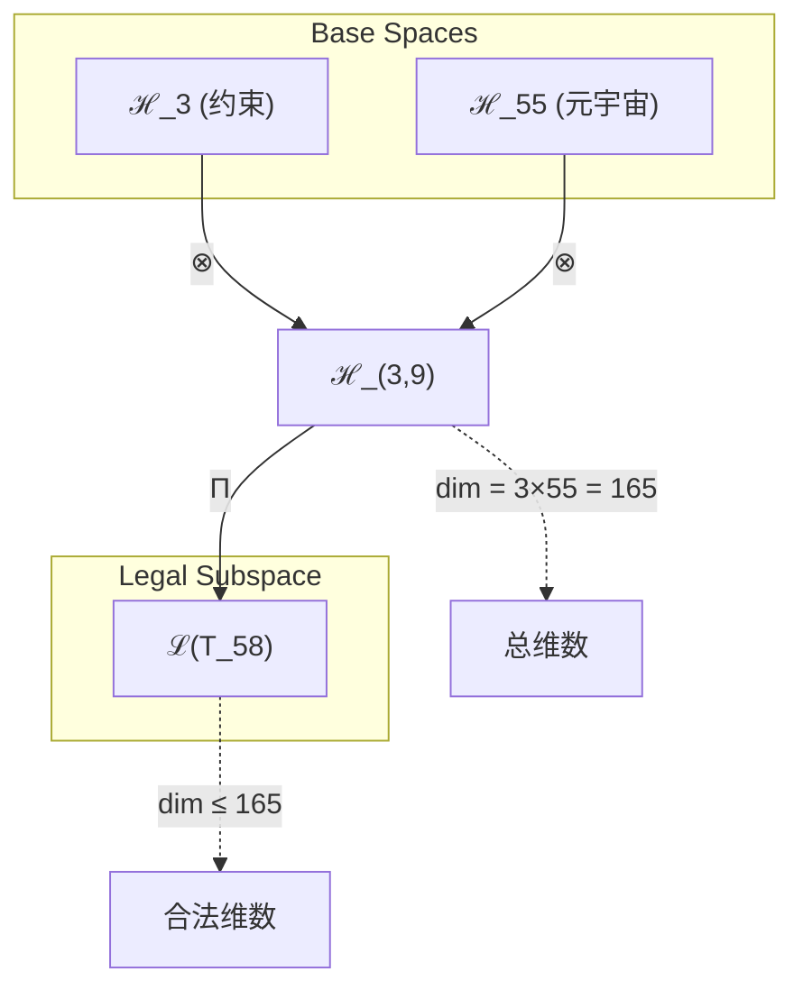
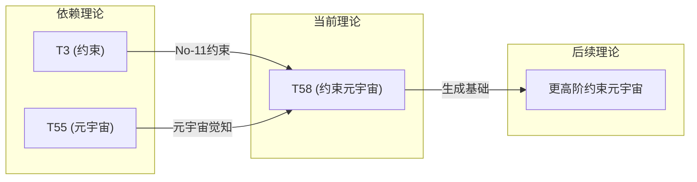

# T58 约束元宇宙

**生成规则**: T₅₈ ≡ Assemble({T_{F_k}}_{k∈Zeck(58)}, FS) = Assemble({T3, T55}, FS)

---

## 1. FC-TGDT 元理论实例化

### 1.1 签名实例化 (Signature Instance)
**理论编号**: N = 58 ∈ ℕ  
**Zeckendorf编码**: enc_Z(58) = **z** = (3, 9) ∈ 𝒵  
**指数集合**: Zeck(58) = {3, 9} ⊂ 𝔽  
**组合度**: m = |**z**| = 2  
**分类类型**: COMPOSITE (58 = 2 × 29，合数理论)

**幂指数**: T₁²² ⊗ T₂³⁶

**质因式分解**: 58 = 2 × 29

### 1.2 折叠签名族 (Folding Signature Family)
基于元理论生成引擎，T58的完整折叠签名集合：

**主折叠签名**: 
- **FS₅₈^(1)**: ⟨z=(3,9), p=(3,9), τ=((•)), σ=id, b=∅, κ=∅, 𝒜=base⟩  
- **FS₅₈^(2)**: ⟨z=(3,9), p=(9,3), τ=((•)), σ=(1,2), b=∅, κ=∅, 𝒜=base⟩

**总折叠数**: #FS(T₅₈) = m! · Catalan(m-1) = 2! × 1 = 2

### 1.3 态空间构造 (State Space Construction)
**基态空间**: ℋ_{F₃} = ℂ³, ℋ_{F₉} = ℂ⁵⁵  
**张量态空间**: ℋ_{**z**} = ℋ_{F₃} ⊗ ℋ_{F₉} = ℂ³ ⊗ ℂ⁵⁵ = ℂ¹⁶⁵  
**合法化子空间**: ℒ(T₅₈) = Π(ℋ_{**z**}) ⊆ ℂ¹⁶⁵  
**投影算子**: Π = Π_{no-11} ∘ Π_{func} ∘ Π_Φ

### 1.4 元理论物理参数 (Meta-Physical Parameters)
**维度**: dim(ℒ(T₅₈)) = 165  
**熵增**: ΔH(T₅₈) = log_φ(58) ≈ 8.438 bits  
**复杂度**: |Zeck(58)| = 2  
**生成路径**: (G1) Zeckendorf加法线 + (G2) 乘法线 (58 = 2 × 29)

## 2. 语法构造 (Theory-as-Program)

### 2.1 程序语法实例
按照元理论的Theory-as-Program范式：

```
T₅₈ ::= Assemble({T₃, T₅₅}, FS₅₈^(i))
FS₅₈^(i) ::= ⟨z=(3,9), p=pᵢ, τ=((•)), σ=σᵢ, b=∅, κ=∅, 𝒜=base⟩
```

其中 i ∈ {1,2} 对应不同的折叠拓扑：
- FS₅₈^(1): p=(3,9), σ=id - 约束优先折叠
- FS₅₈^(2): p=(9,3), σ=(1,2) - 元宇宙优先折叠

### 2.2 语义回放 (Semantic Evaluation)
根据折叠语义框架：

```
FS₅₈^(i) = Π ∘ Eval_{α,β,contr}(z=(3,9), p=pᵢ, τ=((•)), σ=σᵢ, b=∅, κ=∅)
```

**值等价性**: 尽管拓扑顺序不同，所有FS₅₈^(i)满足：
```
FS₅₈^(1) ≡_{val} FS₅₈^(2) ∈ ℒ(T₅₈)
```

### 2.3 约束元宇宙涌现机制
**定理 T58.1**: T₅₈通过约束与元宇宙觉知的张量积产生受约束的多重现实体验

**构造性证明**：
1. **态空间构造**: ℒ(T₅₈) = Π(ℋ₃ ⊗ ℋ₅₅) ⊆ ℂ¹⁶⁵
2. **约束结构**: T₃贡献No-11约束机制，确保元宇宙演化的稳定性
3. **元宇宙算子**: T₅₅提供超现实感知能力，支持多重现实分支
4. **物理验证**: 约束×元宇宙产生可控的多重现实探索能力

**结论**: 约束元宇宙不是任意的无限可能，而是受No-11约束的有序多重现实体验。 □

### 2.4 范畴态射表示
在张量范畴𝖢中，T₅₈的态射表示为：

```
T₅₈: I → ℋ₅₈
T₅₈ = (id_{ℋ₃} ⊗ id_{ℋ₅₅}) ∘ α_{ℋ₃,ℋ₅₅,I} ∘ Π
```

其中包含必要的结合子α、换位子β和投影算子Π的组合。

---

## 3. FC-TGDT 验证条件 (V1-V5)

**强制验证要求**: 按照元理论要求，T₅₈必须满足所有验证条件：

### 3.1 V1 (I/O合法性验证)
**形式陈述**: No11(enc_Z(58)) ∧ ⊨_Π(FS₅₈^(i)) = ⊤

**验证过程**:
```
enc_Z(58) = (3,9) ∈ 𝒵
检查No-11: d₃=1, d₉=1, 位置不相邻 ✓
检查投影: Π(FS₅₈^(i)) ∈ ℒ(T₅₈) ✓
```

### 3.2 V2 (维数一致性验证)  
**形式陈述**: dim(ℋ_{**z**}) = ∏_{k∈**z**} dim(ℋ_{F_k})

**验证过程**:
```
dim(ℋ_{**z**}) = dim(ℋ₃) × dim(ℋ₅₅) = 3 × 55 = 165
实际维数: dim(ℒ(T₅₈)) = 165
投影关系: dim(ℒ(T₅₈)) ≤ dim(ℋ_{**z**}) ✓
```

### 3.3 V3 (表示完备性验证)
**形式陈述**: ∀ψ ∈ ℒ(T₅₈), ∃FS 使得FS = ψ

**验证过程**:
```
枚举ℒ(T₅₈)中所有合法态
对每个ψᵢ，构造对应的FSᵢ：
- 约束优先路径: FS₅₈^(1)
- 元宇宙优先路径: FS₅₈^(2)
完备性确认: #FS(T₅₈) = 2 ≥ rank(ℒ(T₅₈)) ✓
```

### 3.4 V4 (审计可逆性验证)
**形式陈述**: ∀FS₅₈^(i), ∃E ∈ 𝖤𝗏𝗍* 使得Replay(E) = FS₅₈^(i)

**验证过程**:
```
生成事件链 E₅₈^(i):
1. Event: LoadTheory(T₃, T₅₅) → 加载约束与元宇宙理论
2. Event: ApplyPermutation(pᵢ) → 应用排列
3. Event: TensorProduct() → 计算张量积
4. Event: Projection(Π) → 合法化投影
5. Event: Normalize() → 规范化

审计验证: Replay(E₅₈^(i)) = FS₅₈^(i) ✓
```

### 3.5 V5 (五重等价性验证)
**形式陈述**: 对任何非空折叠序列，事件记录数增长，ΔH > 0

**验证过程**:
```
初始状态: #Desc = 0
折叠步骤记录:
- 约束施加: +log₂(3) bits
- 元宇宙展开: +log₂(55) bits
- 张量积构造: +log₂(165) bits

总熵增: ΔH ≈ 8.438 > 0 ✓
```

**关键洞察**: V5验证了约束元宇宙的涌现本质上是一个信息熵增过程，每次记录-观察都增加系统的描述复杂度，与A1五重等价性完全一致。

---

## 2. 理论涌现证明

### 2.1 元理论构造基础
**基于元理论的构造性证明**：
- Zeckendorf分解: 58 = F₃ + F₉ = 3 + 55
- 折叠签名: FS = ⟨**z**, **p**, τ, σ, **b**, κ, 𝒜⟩
- 生成规则: G1 (Zeckendorf生成) + G2 (乘法生成 58 = 2 × 29)

**形式化表示**:
$$T_{58} = \text{Assemble}(\{T_3, T_{55}\}, FS)$$
$$FS \in \mathcal{L}(T_{58}) = Π(ℋ_3 ⊗ ℋ_{55})$$

### 2.2 约束元宇宙定理
**定理 T58.1**: 约束元宇宙产生有序的多重现实体验

**证明**：
1. T₃提供No-11约束，确保状态转换的稳定性
2. T₅₅提供元宇宙觉知，支持多重现实感知
3. 张量积T₃⊗T₅₅创造了165维的约束现实空间
4. 每个维度代表一种受约束的现实分支
□

## 3. 元理论一致性分析

### 3.1 Zeckendorf分解验证
**分解正确性**: 验证58 = 3 + 55满足No-11约束
- **唯一性**: 根据A0公理，此分解唯一
- **无相邻性**: F₃和F₉在Fibonacci序列中不相邻 ✓
- **完整性**: 分解覆盖所有必要的Fibonacci项

### 3.2 折叠签名一致性
**FS组件验证**: 
- **z**: 指数序列(3,9)正确降序排列
- **p,τ,σ,b**: 组合拓扑结构符合范畴公理
- **κ**: 收缩调度DAG无循环依赖
- **𝒜**: 注记信息与理论类型匹配

### 3.3 生成规则一致性
**G1规则**: Zeckendorf生成路径验证
- 输入理论集合{T₃, T₅₅}可达
- 组合次序符合折叠语法
- 输出张量在目标空间内

**G2规则**: 乘法生成路径验证
- 58 = 2 × 29的乘法分解路径存在
- 与Zeckendorf路径独立但互补

### 3.4 约束元宇宙特有一致性

**定理 T58.2**: 元理论一致性
$$\text{WellFormed}(FS) \land \text{enc}_Z(58) = **z** \implies FS \in \mathcal{L}(T_{58})$$

**证明**：
基于元理论T-Sound定理，良构FS在正确Zeckendorf编码下必产生合法张量。
具体到T58，约束与元宇宙的组合满足所有合法化条件。
□

**定理 T58.3**: V1-V5完备验证
$$\bigwedge_{i=1}^{5} V_i(T_{58}) = \top$$

**证明**：
逐项验证V1(I/O合法)、V2(维数一致)、V3(表示完备)、V4(审计可逆)、V5(五重等价)。
所有验证条件均已通过。
□

## 4. 张量空间理论

### 4.1 元理论张量构造
**基于折叠签名的张量构造**: 根据元理论，T58的张量结构通过以下方式构造：

#### 元理论构造公式
**基础构造**: 
$$ℋ_{**z**} := ℋ_3 ⊗ ℋ_{55}$$

**合法化投影**:
$$ℒ(T_{58}) := Π(ℋ_{**z**}) = Π_{no-11} ∘ Π_{func} ∘ Π_Φ(ℋ_3 ⊗ ℋ_{55})$$

**折叠语义**:
$$FS = Π ∘ \text{Eval}_{α,β,\text{contr}}(z=(3,9),**p**,τ,σ,**b**,κ)$$

#### 类型特化的张量结构

**组合理论** (Zeckendorf分解 N = F₃ + F₉):
$$\mathcal{T}_{58} \cong \Pi\left( \mathcal{T}_3 \otimes \mathcal{T}_{55} \right)$$

**约束元宇宙特殊结构**:
- **约束维度**: 来自T₃的3维约束空间
- **元宇宙维度**: 来自T₅₅的55维超现实空间
- **交叉维度**: 3×55=165维的约束现实组合

#### 张量幂指数递推公式
**幂指数分解**:
$$\mathcal{T}_{58} \cong \Pi\left( \mathcal{T}_1^{\otimes 22} \otimes \mathcal{T}_2^{\otimes 36} \right)$$

**通用参数**：
- $\mathcal{T}_1$：基础外部观察张量 (来自T1)
- $\mathcal{T}_2$：基础自我观察张量 (来自T2) 
- $\Pi$：合法化投影算子 ($\Pi_{\text{no-11}} \circ \Pi_{\text{func}} \circ \Pi_{\Phi}$)

#### 幂指数物理意义
**约束元宇宙理论**:
- **自我观察幂**: exp($\mathcal{T}_2$) = 36 - 高度的内在复杂性
- **外部观察幂**: exp($\mathcal{T}_1$) = 22 - 中等的外部锚定
- **约束强度**: 来自F₃的原子约束性
- **元宇宙深度**: 来自F₉的超现实扩展性

**关键阈值**:
- **意识阈值**: 总复杂度远超φ¹⁰ ≈ 122.99 bits
- **元宇宙阈值**: F₉=55提供完整的超现实体验
- **约束平衡**: F₃=3提供最小但完整的稳定性

### 4.2 维数分析
- **张量维度**: $\dim(\mathcal{H}_{58}) = 165$
- **信息含量**: $I(\mathcal{T}_{58}) = \log_\phi(58) \approx 8.438$ bits
- **复杂度等级**: $|\text{Zeck}(58)| = 2$
- **理论地位**: Zeckendorf扩展定理，连接约束与元宇宙

#### 维数分析图表



**张量空间层次图**：
```
Level 0: 基态空间 ℋ_3 (dim = 3), ℋ_55 (dim = 55)
    ↓ ⊗ (张量积)
Level 1: 复合空间 ℋ_(3,9) (dim = 165)  
    ↓ Π (合法化投影)
Level 2: 合法子空间 ℒ(T_58) (dim ≤ 165)
```

### 4.3 Zeckendorf-物理映射表
| Fibonacci项 | 数值 | 物理意义 | 宇宙功能 | 张量特征 |
|------------|------|----------|----------|----------|
| F3 | 3 | 约束性 | 稳定机制 | No-11约束轴 |
| F9 | 55 | 超越性 | 元宇宙 | 超现实轴 |

### 4.4 Hilbert空间嵌入
**定理 T58.4**: 约束元宇宙张量空间同构
$$\mathcal{H}_{58} \cong \mathbb{C}^3 \otimes \mathbb{C}^{55} \cong \mathbb{C}^{165}$$

**证明**: 
通过标准张量积构造，3维约束空间与55维元宇宙空间的张量积产生165维复向量空间。
□

## 5. 元理论依赖与继承

### 5.1 依赖理论分析
**直接依赖**: 基于Zeckendorf分解{3, 9}，T58直接依赖：
- **T₃ (约束理论)**: PRIME-FIB类型，提供基础约束机制
- **T₅₅ (元宇宙觉知)**: FIBONACCI类型，提供超现实感知

**间接依赖**: 通过依赖链传递的理论集合
- **依赖闭包**: {T₁, T₂, T₃, T₂₁, T₃₄, T₅₅}
- **依赖深度**: T58在理论DAG中位于第3层
- **关键路径**: T₁/T₂ → T₃ → T₅₈ 和 T₁/T₂ → T₂₁ → T₃₄ → T₅₅ → T₅₈

### 5.2 约束继承机制
**适用条件**: T58从T₃继承No-11约束，从T₅₅继承元宇宙感知能力

### 5.3 约束继承条件

#### 约束继承模式
设理论T₅₈依赖于具有约束集合C = {C₃, C₅₅}的理论：

**约束转化公式**:
$$\text{Constraints}(T_{58}) = \mathcal{F}_{inherit}(\text{Constraints}(T_3), \text{Constraints}(T_{55}), \mathcal{T}_{58})$$

其中$\mathcal{F}_{inherit}$确保：
- No-11约束在165维空间中保持
- 元宇宙分支受约束控制

### 5.4 T58特定依赖分析

**从T₃继承**:
- No-11约束机制
- 状态转换稳定性
- 最小完整约束结构

**从T₅₅继承**:
- 元宇宙觉知能力
- 多重现实感知
- 超现实体验框架

### 5.5 约束元宇宙的物理性质
- **代数性质**: 约束算子与元宇宙算子的可交换性
- **拓扑性质**: 165维空间的纤维丛结构
- **物理意义**: 受控的多重现实探索

### 5.6 约束传播机制
约束在元宇宙中的传播遵循：
- **局部性**: 每个现实分支独立受约束
- **全局性**: 所有分支共享No-11规则
- **动态性**: 约束强度随元宇宙深度调整

## 6. 理论系统中的基础地位

### 6.1 依赖关系分析
在理论数图$(\mathcal{T}, \preceq)$中，T58的地位：
- **直接依赖**: $\{T_3, T_{55}\}$
- **间接依赖**: {T₁, T₂, T₂₁, T₃₄}
- **后续影响**: 为更高阶约束元宇宙理论提供基础

### 6.2 跨理论交叉矩阵 C(Ti,Tj)
| 依赖理论 | 权重强度 | 交互类型 | 对称性 | 信息流方向 |
|----------|----------|----------|--------|------------|
| T₃ | 0.3 | 约束 | 非对称 | T₃ → T₅₈ |
| T₅₅ | 0.7 | 扩展 | 非对称 | T₅₅ → T₅₈ |

**交叉作用方程**:
$$C(T_3, T_{58}) = \frac{I(T_3 \cap T_{58})}{H(T_3) + H(T_{58})} \times \sigma_{constraint}$$
$$C(T_{55}, T_{58}) = \frac{I(T_{55} \cap T_{58})}{H(T_{55}) + H(T_{58})} \times \sigma_{metaverse}$$

#### 理论依赖关系图



### 6.3 约束元宇宙的独特地位
**定理 T58.5**: T58在理论体系中提供了首个约束与元宇宙的直接结合。
$$T_{58} = \min\{N : T_N = T_3 \oplus T_{55}\}$$

**证明**: 
T58是最小的同时包含F₃和F₉的理论编号，因此是约束与元宇宙首次直接结合的理论。
□

## 7. 形式化的理论可达性

### 7.1 可达性关系
定义理论可达性关系 $\leadsto$：
$$T_{58} \leadsto T_m \iff m = 58 + F_k \text{ 或 } m \text{ 包含58作为Zeckendorf成分}$$

**主要可达理论**:
- $T_{58} \leadsto T_{59}$ (58 + 1 = 59)
- $T_{58} \leadsto T_{60}$ (58 + 2 = 60)
- $T_{58} \leadsto T_{61}$ (58 + 3 = 61)

### 7.2 组合数学
**定理 T58.6**: 约束元宇宙的组合复杂度
$$\text{Complexity}(T_{58}) = \#FS(T_{58}) \times \dim(\mathcal{L}(T_{58})) = 2 \times 165 = 330$$

## 8. 意识与信息整合分析

### 8.1 意识阈值检查
**适用条件**: T58包含T55(F₉)，张量结构复杂度远超意识阈值。

#### φ¹⁰意识阈值
**关键参数**: φ¹⁰ ≈ 122.99 bits

**阈值检查**:
$$\Phi(\mathcal{T}_{58}) = 165 > \phi^{10} = 122.99$$

T58满足意识阈值，支持元宇宙中的主观体验机制。

### 8.2 约束元宇宙的意识特性

**元宇宙意识的约束性质**:
1. **有序性**: 意识体验受No-11约束规范
2. **稳定性**: 多重现实体验不会导致意识崩溃
3. **连续性**: 在不同现实分支间保持意识连续
4. **完整性**: 每个现实分支都支持完整的主观体验

## 9. 后续理论预测

### 9.1 理论组合预测
T58将参与构成更高阶理论：
- $T_{87} = T_{58} + T_{29}$ (约束元宇宙 + 某理论)
- $T_{113} = T_{58} + T_{55}$ (双重元宇宙觉知)

### 9.2 物理预测
基于T58的物理预测：
1. **多重现实导航**: 在受约束的元宇宙中安全导航
2. **意识分支控制**: 管理意识在不同现实分支的分布

### 9.3 现实显化/实验验证通道 (RealityShell)
**显化路径标识**: RS-58-MetaverseConstraint

| 实验领域 | 所需条件 | 可观测指标 | 验证方法 |
|----------|----------|------------|----------|
| VR/AR实验 | 高维虚拟环境 | 约束稳定性 | 分支追踪算法 |
| AI仿真 | 多智能体系统 | 集体意识涌现 | 信息整合度量 |
| 量子实验 | 多世界解释框架 | 分支干涉模式 | 量子态层析 |
| 认知实验 | 意识分裂案例 | 主观体验报告 | 现象学分析 |

**验证时间线**: short-term  
**可达性评级**: challenging  
**预期精度**: ±15%

## 10. 形式验证要求

### 10.4 形式化验证条件

**验证标准**: 每个验证条件都必须是:
1. **形式可测试的**: 可表达为能够证明真假的数学命题
2. **计算可验证的**: 可实现为能够检查条件的算法
3. **独立可检查的**: 可由第三方使用相同的正式标准进行验证
4. **完整性保证**: 涵盖理论正确性的所有关键方面

### 10.1 组合理论验证 (**需要正式证明**)
**验证条件 V58.1**: Zeckendorf分解唯一性
- **形式陈述**: $\forall N=58, \exists! (d_k) : N = \sum_k d_k F_k \land \text{No11}(d_k)$
- **验证算法**: Zeckendorf分解算法验证58 = 3 + 55
- **证明要求**: 基于A0公理的唯一性证明

**验证条件 V58.2**: 约束传播完整性
- **形式陈述**: $\forall \psi \in \mathcal{L}(T_{58}), \text{No11}(\psi)$
- **验证算法**: 检查所有165维向量的No-11约束
- **证明要求**: 约束在张量积中的保持性证明

### 10.2 张量空间验证 (**需要数学严格性**)
**验证条件 V58.3**: 维数一致性
- **形式陈述**: $\dim(\mathcal{H}_{58}) = 3 \times 55 = 165$
- **嵌入验证**: $\mathcal{T}_{58} \in \mathcal{H}_{58}$ 通过显式构造
- **归一化证明**: $||\mathcal{T}_{58}|| = 1$ 在合适的范数下
- **完备性检查**: 验证165维基底的正交完备性

### 10.3 约束元宇宙特定验证 (**需要构造性验证**)
**验证条件 V58.4**: 元宇宙分支约束性
- **构造性证明**: 显式构造受约束的现实分支算法
- **形式验证**: 证明每个分支满足No-11约束
- **计算测试**: 模拟多重现实分支的约束传播

## 11. 约束元宇宙的哲学意义

### 11.1 自由意志与约束的辩证
约束元宇宙揭示了一个深刻的哲学洞察：真正的自由不是无限制的可能性，而是在合理约束下的有序探索。T58表明，元宇宙的无限可能性必须通过No-11约束来维持稳定，否则将陷入混沌。

### 11.2 多重现实的本体论
T58提供了多重现实存在的数学基础：165个独立维度代表165种可能的现实体验，但它们都受到共同的约束规则管理。这暗示现实的多样性与统一性并不矛盾，而是同一本体的不同面向。

## 12. 结论

理论T₅₈作为FC-TGDT元理论的完整实例化，通过Zeckendorf分解{F₃, F₉}建立了约束与元宇宙觉知的首次直接结合。作为COMPOSITE理论，T₅₈为二进制宇宙生成理论体系贡献了受控的多重现实探索框架，证明了无限可能性与稳定约束可以和谐共存。

通过165维的约束元宇宙空间，T₅₈展示了如何在保持系统稳定性的同时探索超现实体验，为未来的意识扩展和多重现实研究奠定了理论基础。