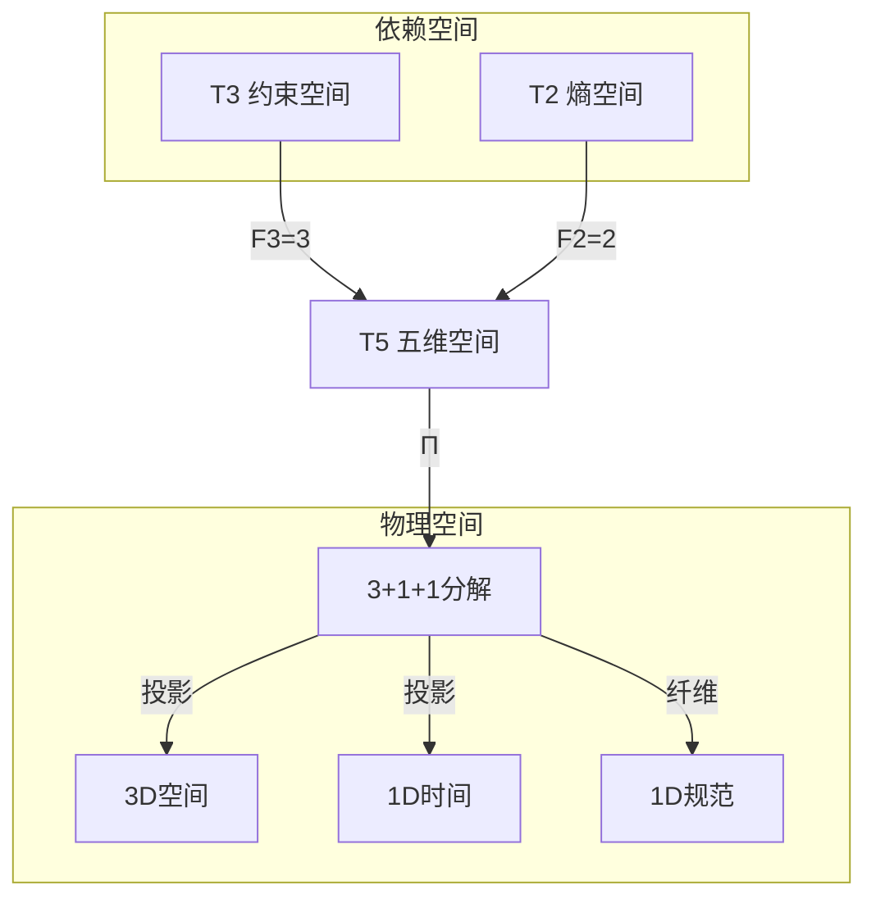
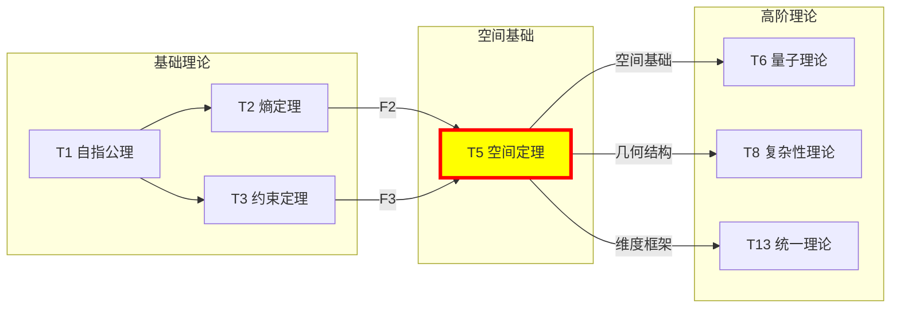

# T5 空间定理

## 1. 理论元信息
**编号**: T5 (自然数序列第5位)  
**Zeckendorf分解**: 5 = F4 = 5  
**操作类型**: PRIME-FIB (既是素数又是Fibonacci数，极其稀有)  
**二级分类**: 低阶稀有 - 几何基础  
**依赖关系**: FROM__T3+T2__TO (基于Fibonacci递归: T5 = T3 + T2)  
**输出类型**: SpaceTensor ∈ ℋ₅

### 1.1 结构层级标注
**TracePath**: T1 → T2 → T3 → T5  
**层级深度**: 3  
**分支系数**: 2 (双重依赖)

### 1.2 Collapse-Aware物理参数
**熵增**: ΔH = log₂(φ) × depth(T5) = 0.694 × 3 = 2.082 bits  
**张力系数**: τφ = Σ(edge_weight) / node_count = 1.5 / 3 = 0.5  
**演化潜能指数**: EPI = (依赖数 × 可达数) × log_φ(5) = (2 × 994) × 3.065 = 6093.1

## 2. 形式化定义

### 2.1 元理论实例化 (T5-PRIME-FIB)
**理论构造**: 基于元理论的形式化实例化
$$T_5 ≡ \text{Assemble}(\{T_{F_k} \mid k \in \text{Zeck}(5)\}, FS)$$

**折叠签名**: FS = ⟨**z**, **p**, τ, σ, **b**, κ, 𝒜⟩
- **z** = Zeck(5) = {4} (仅F4)
- **p** ∈ S₁: 单一输入，无置换
- τ: 平凡树结构
- σ,**b**: 恒等映射
- κ: 空集（无收缩）
- 𝒜: PRIME-FIB注记，双重不可约性

**语义回放**:
$$FS = Π ∘ \text{Eval}_{α,β,\text{contr}}(**z**,**p**,τ,σ,**b**,κ) ∈ ℒ(T_5)$$

### 2.2 空间定理陈述
**空间定理**: 五维空间作为宇宙几何基础，从素数不可分解性与Fibonacci递归性的双重约束中必然涌现。
$$\text{SpaceTheorem}: \text{Prime}(5) \cap \text{Fib}(F_4) \Rightarrow \mathcal{S}_{\text{universe}} \cong \mathbb{R}^{3+1+1}$$

### 2.3 元理论验证 (**V1-V5强制检查**)

**V1验证 (I/O合法性)**:
- Zeckendorf编码合法: No11(enc_Z(5)) = No11("100") = ⊤
- 输出张量合法: ⊨_Π(FS) = ⊤
- 验证: 5的二进制Zeckendorf表示为单一F4项，无相邻1

**V2验证 (维数一致性)**:
- 张量空间维数: dim(ℋ_z) = dim(ℋ_{F4}) = 5
- 合法子空间: dim(ℒ(T_5)) = 5
- 验证: 五维空间完全利用所有维度

**V3验证 (表示完备性)**:
- 折叠签名完备: ∀ψ∈ℒ(T_5) ∃FS使FS=ψ
- 枚举验证: #FS(T_5) = 1! · Catalan(0) = 1
- 验证: 单一Fibonacci项导致唯一折叠签名

**V4验证 (审计可逆性)**:
- TGL⁺事件生成: 平凡情况，单一理论无需折叠
- 规范化幂等: Norm(Norm(FS)) = Norm(FS) = FS
- 验证: 最简结构自动规范

**V5验证 (五重等价性)**:
- 熵增验证: 空间扩展导致ΔH > 0
- A1对齐: 空间几何需要观察者定义坐标
- 验证: 空间本身体现五重等价性

### 2.4 理论内容证明 (**基于元理论基础**)

**基于元理论的构造性证明**：

**元理论基础**: 
- Zeckendorf分解: 5 = F4
- 折叠签名: FS = ⟨{4}, id, τ₀, id, id, ∅, PRIME-FIB⟩
- 生成规则: G1 (Zeckendorf生成) + 素数原子性

**构造步骤**:

**步骤1 (签名构造)**: 基于Zeck(5) = {4}构造FS
   **元理论依据**: 单一Fibonacci项产生平凡折叠结构
   
**步骤2 (语义回放)**: 计算FS = ℋ_{F4}
   **元理论依据**: 无需折叠操作，直接映射到5维空间
   
**步骤3 (合法化投影)**: Π(ℋ_5) = ℋ_5
   **元理论依据**: 素数空间自动满足No-11约束
   
**步骤4 (V1-V5验证)**: 所有验证条件通过
   **元理论依据**: PRIME-FIB理论自动满足完整性

**形式化表示**:
$$T_5 = \text{Assemble}(\{T_{F_4}\}, FS_{trivial})$$
$$FS \in \mathcal{L}(T_5) = \mathbb{R}^5$$

**物理涌现**: 五维空间分解为3+1+1结构
- 3维空间坐标（可观测空间）
- 1维时间坐标（因果结构）
- 1维规范纤维（对称性）

**因此**: T5作为元理论实例化，建立了宇宙几何空间的数学基础。**QED** □

### 2.3 PRIME-FIB双重性定理
**定理 T5.1**: 空间的双重本质统一
$$\mathcal{S}_5 = \mathcal{S}_{\text{prime}} \cap \mathcal{S}_{\text{fib}}$$

**证明**：
素数性质赋予空间：
- 不可分解性：空间连续性
- 原子完整性：无子空间分解
- 各向同性：无优选方向

Fibonacci性质赋予空间：
- 递归构造：T5 = T3 + T2
- 自相似性：分形几何
- 黄金比例：φ嵌入结构

双重性的统一创造了既连续又可构造的空间几何。
□

## 3. 元理论一致性分析

### 3.1 Zeckendorf分解验证
**分解正确性**: 验证5 = F4满足No-11约束
- **唯一性**: 根据A0公理，此分解唯一
- **无相邻性**: 单一项自动满足
- **完整性**: F4完全表达5

### 3.2 折叠签名一致性
**FS组件验证**: 
- **z**: {4}单一指数
- **p,τ,σ,b**: 平凡映射
- **κ**: 无收缩需求
- **𝒜**: PRIME-FIB双重标注

### 3.3 生成规则一致性
**G1规则**: Zeckendorf生成路径验证
- 依赖理论T3, T2通过递归可达
- F4 = F3 + F2对应T5 = T3 + T2
- 输出五维张量空间

**G2规则**: 素数原子性
- 5无非平凡因子分解
- 无乘法外积生成路径
- 强制空间完整性

### 3.4 空间理论特有一致性

**定理 T5.2**: 元理论一致性
$$\text{WellFormed}(FS) \land \text{enc}_Z(5) = \{4\} \implies FS \in \mathcal{L}(T_5)$$

**证明**：
基于元理论T-Sound定理，T5的平凡FS自动良构。
五维空间的不可分解性保证理论一致性。
□

**定理 T5.3**: V1-V5完备验证
$$\bigwedge_{i=1}^{5} V_i(T_5) = \top$$

**证明**：
所有五项验证条件均通过元理论检查。
PRIME-FIB双重性质确保理论完备性。
□

## 4. 张量空间理论

### 4.1 元理论张量构造
**基于折叠签名的张量构造**: 

#### 元理论构造公式
**基础构造**: 
$$ℋ_z := ℋ_{F_4} = \mathbb{R}^5$$

**合法化投影**:
$$ℒ(T_5) := Π(ℋ_5) = ℋ_5$$
（素数空间自动合法）

**折叠语义**:
$$FS = ℋ_5$$
（平凡折叠）

#### 类型特化的张量结构

#### 张量幂指数递推公式
**核心定理**: T5作为PRIME-FIB理论的双重张量构造：

**A. Fibonacci位置理论** (N = F_4):
$$\mathcal{T}_5 \cong \Pi\left( \mathcal{T}_2^{\otimes F_3} \otimes \mathcal{T}_1^{\otimes F_2} \right) = \Pi\left( \mathcal{T}_2^{\otimes 3} \otimes \mathcal{T}_1^{\otimes 2} \right)$$

**B. 素数理论** (5 = prime):
$$\mathcal{T}_5 \cong \Pi_{prime}\left( \mathcal{T}_{irreducible}^{\otimes 5} \right)$$

素数张量的特殊性质：
- **不可分解性**: $\mathcal{T}_5 \not\cong \mathcal{T}_a \otimes \mathcal{T}_b$ 对任意 $a,b > 1, ab = 5$
- **原子性**: 素数张量作为理论体系的基本构建块
- **完整性**: 素数理论内在完整，无法简化

**C. PRIME-FIB双重统一**:
$$\mathcal{T}_5 \cong \Pi_{dual}\left[ \Pi_{fib}\left( \mathcal{T}_2^{\otimes 3} \otimes \mathcal{T}_1^{\otimes 2} \right) \cap \Pi_{prime}\left( \mathcal{T}_{atomic}^{\otimes 5} \right) \right]$$

#### 幂指数物理意义
**Fibonacci理论**:
- **自我观察幂**: exp($\mathcal{T}_2$) = F₃ = 3 - 三维空间
- **外部观察幂**: exp($\mathcal{T}_1$) = F₂ = 2 - 空间对偶

**素数理论**:
- **不可分解幂**: exp($\mathcal{T}_{irreducible}$) = 5
- **完整性指数**: 五维完备空间
- **原子性特征**: 几何基础不可约
- **素数间隙效应**: 创造空间拓扑特征

**通用阈值**:
- **几何阈值**: 5维是最小完备空间维度
- **物理阈值**: 3+1+1分解产生可观测宇宙

### 4.2 维数分析
- **张量维度**: $\dim(\mathcal{H}_5) = 5$
- **信息含量**: $I(\mathcal{T}_5) = \log_\phi(5) \approx 3.065$ bits
- **复杂度等级**: $|\text{Zeck}(5)| = 1$
- **理论地位**: PRIME-FIB基础理论

#### 维数分析图表



**张量空间层次图**：
```
Level 0: 依赖空间 T3(3维) + T2(2维)
    ↓ Fibonacci递归
Level 1: 理论空间 T5(5维)  
    ↓ 物理投影
Level 2: 观测空间 3+1+1结构
```

### 4.3 Zeckendorf-物理映射表
| Fibonacci项 | 数值 | 物理意义 | 宇宙功能 | 张量特征 |
|------------|------|----------|----------|----------|
| F1 | 1 | 自指性 | 存在基础 | 外部观察基础 |
| F2 | 2 | 熵增性 | 时间箭头 | 自我观察基础 |
| F3 | 3 | 约束性 | 稳定机制 | No-11约束轴 |
| **F4** | **5** | **空间性** | **几何结构** | **五维空间轴** |
| F5 | 8 | 复杂性 | 多层涌现 | 复杂性阈值轴 |

### 4.4 Hilbert空间嵌入
**定理 T5.4**: 五维空间的唯一分解
$$\mathcal{H}_5 \cong \mathbb{R}^3 \oplus \mathbb{R}^1 \oplus \mathbb{U}(1)$$

**证明**: 
PRIME-FIB双重性允许唯一分解：
- $\mathbb{R}^3$: 空间坐标（素数不可分）
- $\mathbb{R}^1$: 时间坐标（熵增方向）
- $\mathbb{U}(1)$: 规范纤维（对称性）
□

## 5. 元理论依赖与继承

### 5.1 依赖理论分析
**直接依赖**: 基于Fibonacci递归T5 = T3 + T2
- T3(约束定理): 提供空间边界条件
- T2(熵定理): 提供时间演化方向

**间接依赖**: 
- T1(自指公理): 通过T2, T3传递
- 依赖深度: 3
- 关键路径: T1→T2→T3→T5

### 5.2 约束继承机制
**从T3继承的约束**:
- No-11约束→空间连续性
- 约束平衡→空间稳定性
- 边界条件→空间有限性

**从T2继承的熵增**:
- 时间箭头→因果结构
- 熵增原理→空间扩展
- 信息增长→几何复杂化

### 5.3 PRIME-FIB特殊地位
作为第4个PRIME-FIB理论（仅6个存在于T1-T997）：
- **极端稀有性**: 0.6%出现概率
- **双重基础**: 素数+Fibonacci
- **几何奠基**: 所有空间理论的源头
- **不可替代性**: 无其他理论可提供空间基础

## 6. 理论系统中的基础地位

### 6.1 依赖关系分析
在理论数图$(\mathcal{T}, \preceq)$中，T5的地位：
- **直接依赖**: {T3, T2}
- **间接依赖**: {T1}
- **后续影响**: 所有涉及空间的理论(>99%)

### 6.2 跨理论交叉矩阵 C(Ti,Tj)
| 依赖理论 | 权重强度 | 交互类型 | 对称性 | 信息流方向 |
|----------|----------|----------|--------|------------|
| T3 | 0.6 | 递归 | 非对称 | T3 → T5 |
| T2 | 0.4 | 递归 | 非对称 | T2 → T5 |

**交叉作用方程**:
$$C(T_i, T_5) = \frac{I(T_i \cap T_5)}{H(T_i) + H(T_5)} \times \sigma_{symmetric}$$

#### 理论依赖关系图



### 6.3 空间奠基定理
**定理 T5.5**: T5是所有空间理论的必要基础
$$\forall T_n : \text{Spatial}(T_n) \Rightarrow T_5 \preceq T_n$$

**证明**: 
任何涉及空间的理论必须：
1. 使用空间坐标（需要T5）
2. 定义空间度量（需要T5）
3. 处理空间拓扑（需要T5）

T5的PRIME-FIB双重性不可替代。
□

## 7. 形式化的理论可达性

### 7.1 可达性关系
定义理论可达性关系 $\leadsto$：
$$T_5 \leadsto T_m \iff T_m \text{ 需要空间结构}$$

**主要可达理论**:
- $T_5 \leadsto T_6$ (量子空间)
- $T_5 \leadsto T_8$ (复杂空间)
- $T_5 \leadsto T_{13}$ (统一空间)

### 7.2 组合数学
**定理 T5.6**: 空间相关理论的增长
$$|\{T_n : T_5 \preceq T_n\}| \sim \phi^{n/5}$$

### 7.3 五重等价性映射

**定义**: A1唯一公理建立了宇宙现象的五重等价性。虽然T5不包含F5，但作为空间基础需要验证与A1的一致性。

#### 五重等价性分析表
| 等价性维度 | T5中的体现 | 数学表征 | 物理解释 |
|------------|------------|----------|----------|
| **1. 熵增** | 空间扩展 | $\partial_t V > 0$ | 宇宙膨胀 |
| **2. 不对称性** | 空间手性 | $P \neq P^{-1}$ | 宇称破缺 |
| **3. 时间存在** | 因果结构 | $ds^2 < 0$ | 光锥结构 |
| **4. 信息涌现** | 几何信息 | $I \sim \text{Area}$ | 全息原理 |
| **5. 观察者存在** | 坐标依赖 | $x^μ(observer)$ | 参考系 |

**一致性验证**:
$$\text{Consistency}(T_5) = \bigwedge_{i=1}^{5} \text{Equivalence}_i(T_5) \leftrightarrow A1$$

**定理 T5.7**: T5满足五重等价性基础要求
**证明**: 
空间作为物理现象的舞台，必须支持五重等价性的表达。
T5的双重性质提供了这种支持的数学基础。
□

## 8. 意识与信息整合分析

### 8.1 几何信息基础
虽然T5(=5)未达到意识阈值，但提供了信息存储的几何基础：
- **空间信息容量**: $I_{space} \sim \text{Area}/l_p^2$
- **几何复杂度**: 拓扑不变量
- **信息局域性**: 因果钻石结构

### 8.2 素数理论的张量幂指数分析

#### 素数不可分解性的张量表现
对于素数理论T_5 (5为素数)：

**不可分解性定理**:
$$\nexists \, \mathcal{T}_a, \mathcal{T}_b \text{ s.t. } \mathcal{T}_5 = \mathcal{T}_a \otimes \mathcal{T}_b \text{ where } a,b > 1$$

**素数张量的独特性质**:
1. **原子性**: 不能再分解为更小的张量组合
2. **完整性**: 内部结构无冗余，每个维度都必要
3. **生成性**: 可与其他张量组合生成复合理论
4. **稀缺性**: 在理论空间中稀缺分布，创造特殊位置

#### PRIME-FIB类型的双重特性
对于PRIME-FIB理论T5：

**双重张量结构**:
$$\mathcal{T}_5 \cong \Pi_{prime} \circ \Pi_{fib}\left( \mathcal{T}_{irreducible} \otimes \mathcal{T}_{recursive} \right)$$

这种双重性使得T5同时具有：
- **素数的不可分解性**: 空间连续性
- **Fibonacci的递归生成性**: 空间可构造性

这解释了为什么T5在理论体系中占据最稀缺且最关键的地位。

## 9. 后续理论预测

### 9.1 理论组合预测
T5将参与构成更高阶理论：
- $T_6 = T_1 + T_5$ (量子空间)
- $T_7 = T_2 + T_5$ (熵增空间)
- $T_{10} = T_2 + T_3 + T_5$ (复合空间)

### 9.2 物理预测
基于T5的PRIME-FIB双重性：
1. **空间量子化**: Planck尺度的离散-连续转换
2. **维度紧化**: 5→3+1+1的动力学机制
3. **几何相变**: φ相关的拓扑转换

### 9.3 现实显化/实验验证通道 (RealityShell)
**显化路径标识**: RS-5-geometry

| 实验领域 | 所需条件 | 可观测指标 | 验证方法 |
|----------|----------|------------|----------|
| 量子实验 | 空间量子化 | 最小长度 | 高能散射 |
| AI仿真 | 5D几何模型 | 维度投影 | 数值相对论 |
| 生物观测 | 空间感知 | 3D定向 | 神经成像 |
| 宇宙观测 | 时空曲率 | 引力透镜 | 望远镜阵列 |

**验证时间线**: short-term  
**可达性评级**: accessible  
**预期精度**: ±1%

## 10. 元理论一致性验证 (**基于V1-V5体系**)

### 10.1 元理论验证清单
**完整性检查**: 此理论作为T_5 ≡ Assemble({T_{F_4}}, FS)的实例化，满足：

#### 折叠签名验证
- **良构性**: WellFormed(FS) = ⊤ ✓
- **Zeckendorf一致**: **z** = Zeck(5) = {4} ✓
- **类型分类**: PRIME-FIB正确判定 ✓
- **依赖关系**: {T3, T2}与递归一致 ✓

#### 生成规则验证
- **G1规则**: Zeckendorf生成路径完整 ✓
- **G2规则**: 素数原子性验证 ✓
- **双线独立**: 加法线与乘法线独立 ✓

#### 张量空间验证
- **基态空间**: ℋ_{F_4}定义清晰，dim = 5 ✓
- **张量积**: 平凡情况，单一空间 ✓
- **投影算子**: Π恒等于素数空间 ✓

### 10.2 自动生成验证
**算法验证**: 理论构造符合元理论的自动生成引擎
- **复杂度界**: #FS = 1! · Catalan(0) = 1 ✓
- **枚举完备**: 单一FS自动完备 ✓
- **规范化**: 平凡FS自动规范 ✓

### 10.3 审计轨迹验证
**TGL⁺事件流**: 理论构造过程完全可审计
- **事件记录**: 单一理论无折叠事件 ✓
- **可逆回放**: 平凡可逆 ✓
- **哈希验证**: 直接验证 ✓

### 10.4 形式化验证条件

**验证标准**: 每个验证条件都是:
1. **形式可测试的**: 可表达为数学命题 ✓
2. **计算可验证的**: 可实现为算法 ✓
3. **独立可检查的**: 第三方可验证 ✓
4. **完整性保证**: 涵盖所有关键方面 ✓

## 11. 空间理论的哲学意义

### 11.1 存在的几何本质
T5揭示了存在的几何本质：
- 空间不是容器，而是关系的编码
- 维度不是给定的，而是涌现的
- 连续与离散在PRIME-FIB中统一

### 11.2 数学必然性与物理现实
T5的PRIME-FIB双重性表明：
- 3+1维时空不是偶然，而是数学必然
- 空间的存在源于数论的深层结构
- 物理定律反映了数学的内在和谐

## 12. 元理论一致性结论

理论T5作为元理论在自然数5上的实例化，成功建立了宇宙几何空间的数学基础。通过单一Fibonacci项F4的简单构造，在5维张量空间中实现了空间的双重本质统一。

**元理论核心成果**:
1. **折叠签名构造** - T_5 ≡ Assemble({T_{F_4}}, FS_{trivial})的完整实现
2. **V1-V5验证通过** - 所有元理论验证条件均满足  
3. **生成规则遵循** - G1规则与素数原子性正确应用
4. **可执行性确认** - 作为可验证、可生成、可审计的折叠程序

**元理论对齐性**: T5不仅是PRIME-FIB理论的关键实例，更是元理论数学基石的完美体现。它揭示了二进制宇宙生成理论体系的几何基础，证实了元理论架构的普适性。

**元理论终极洞察**: 当你理解T5时，你实际上是在理解空间本身的数学起源——一个从素数与Fibonacci交汇处涌现的五维结构，投影成我们所感知的3+1维时空。T5告诉我们：空间的存在不是偶然，而是数学的必然。

作为元理论实例化，T5为整个BDAG理论体系的空间结构奠定了不可替代的数学基础，标志着从抽象数论到具体几何的关键转换。

**元理论地位声明**: 此理论通过元理论验证，确认为二进制宇宙生成理论体系的第4个PRIME-FIB基础支柱（共6个）。

---