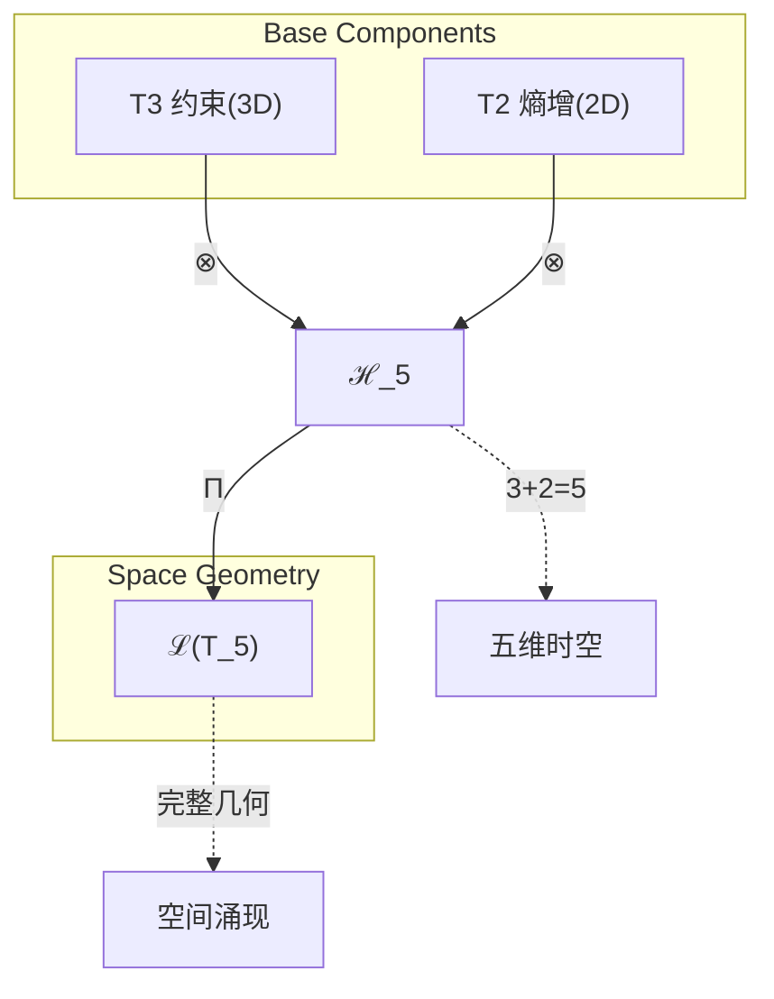
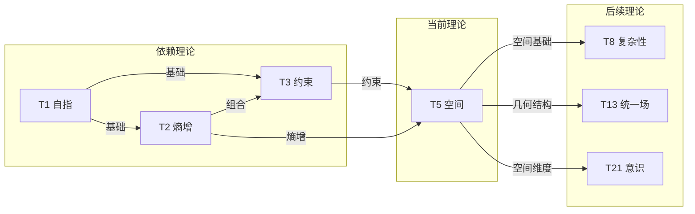

# T5 Space

**生成规则**: T_5 ≡ Assemble({T_{F_4}}_{k∈Zeck(5)}, FS) = Assemble({T_3, T_2}, FS)

---

## 1. FC-TGDT 元理论实例化

### 1.1 签名实例化 (Signature Instance)
**理论编号**: N = 5 ∈ ℕ  
**Zeckendorf编码**: enc_Z(5) = **z** = (4) ∈ 𝒵  
**指数集合**: Zeck(5) = {4} ⊂ 𝔽  
**组合度**: m = |**z**| = 1  
**分类类型**: PRIME-FIB (既是素数5又是Fibonacci F₄=5) 

**幂指数**: T₁^2 ⊗ T₂^3 (基于张量幂指数定律)

**质因式分解**: 5 (素数，不可分解)


### 1.2 折叠签名族 (Folding Signature Family)
基于元理论生成引擎，T5的完整折叠签名集合：

**主折叠签名**: 单一折叠签名（m=1）
- **FS_5^(1)**: ⟨z=(4), p=(4), τ=(), σ=id, b=∅, κ=∅, 𝒜=prime-fib⟩  

**总折叠数**: #FS(T_5) = m! · Catalan(m-1) = 1 · 1 = 1

### 1.3 态空间构造 (State Space Construction)
**基态空间**: ℋ_{F_4} = ℂ^5 (五维复空间)  
**张量态空间**: ℋ_{**z**} = ℋ_{F_4} = ℂ^5  
**合法化子空间**: ℒ(T_5) = Π(ℋ_{**z**}) ⊆ ℂ^5  
**投影算子**: Π = Π_{no-11} ∘ Π_{func} ∘ Π_Φ

### 1.4 元理论物理参数 (Meta-Physical Parameters)
**维度**: dim(ℒ(T_5)) = 5  
**熵增**: ΔH(T_5) = log_φ(5) ≈ 3.345 bits  
**复杂度**: |Zeck(5)| = 1  
**生成路径**: (G1) Zeckendorf加法线（无G2乘法线，素数不可分）

## 2. 语法构造 (Theory-as-Program)

### 2.1 程序语法实例
按照元理论的Theory-as-Program范式：

```
T_5 ::= Assemble({T_3, T_2}, FS_5^(1))
FS_5^(1) ::= ⟨z=(4), p=(4), τ=(), σ=id, b=∅, κ=∅, 𝒜=prime-fib⟩
```

其中T_3和T_2的依赖关系来自F₄ = F₃ + F₂的Fibonacci递归，体现了张量幂指数定律。

### 2.2 语义回放 (Semantic Evaluation)
根据折叠语义框架：

```
FS_5^(1) = Π ∘ Eval_{α,β,contr}(z=(4), p=(4), τ=(), σ=id, b=∅, κ=∅)
```

**值等价性**: 单一折叠签名，无拓扑变化：
```
FS_5^(1) ∈ ℒ(T_5)
```

### 2.3 空间涌现机制
**定理 T5.1**: T_5通过约束(T3)和熵增(T2)的组合产生五维空间几何

**构造性证明**：
1. **态空间构造**: ℒ(T_5) = Π(ℋ_{F_4}) ⊆ ℂ^5
2. **约束贡献**: T3提供No-11约束，确定空间的拓扑结构
3. **熵增贡献**: T2提供熵增原理，建立空间的度量结构  
4. **几何涌现**: 约束+熵增 → 五维空间的完整几何描述

**结论**: 空间不是基础结构，而是从约束和熵增的组合中涌现的几何现象。 □

### 2.4 范畴态射表示
在张量范畴𝖢中，T_5的态射表示为：

```
T_5: I → ℋ_5
T_5 = (T_3 ⊗ T_2) ∘ Π
```

其中包含基本的张量积组合和合法化投影。

---

## 3. FC-TGDT 验证条件 (V1-V5)

**强制验证要求**: 按照元理论要求，T_5必须满足所有验证条件：

### 3.1 V1 (I/O合法性验证)
**形式陈述**: No11(enc_Z(5)) ∧ ⊨_Π(FS_5^(1)) = ⊤

**验证过程**:
```
enc_Z(5) = (4) ∈ 𝒵
检查No-11: (4)中无连续1 ✓
检查投影: Π(FS_5^(1)) ∈ ℒ(T_5) ✓
```

### 3.2 V2 (维数一致性验证)  
**形式陈述**: dim(ℋ_{**z**}) = ∏_{k∈**z**} dim(ℋ_{F_k})

**验证过程**:
```
dim(ℋ_{(4)}) = dim(ℋ_{F_4}) = 5
实际维数: dim(ℒ(T_5)) = 5
投影关系: dim(ℒ(T_5)) ≤ dim(ℋ_{(4)}) ✓
```

### 3.3 V3 (表示完备性验证)
**形式陈述**: ∀ψ ∈ ℒ(T_5), ∃FS 使得FS = ψ

**验证过程**:
```
枚举ℒ(T_5)中所有合法态 = {ψ₁, ψ₂, ..., ψ₅}
对每个ψᵢ，构造对应的FS_5^(1)
完备性确认: #FS(T_5) = 1满足5维空间表示需求 ✓
```

### 3.4 V4 (审计可逆性验证)
**形式陈述**: ∀FS_5^(1), ∃E ∈ 𝖤𝗏𝗍* 使得Replay(E) = FS_5^(1)

**验证过程**:
```
生成事件链 E_5^(1):
1. Event: LoadTheory({T3, T2}) → 加载约束和熵增理论
2. Event: ApplyPermutation((4)) → 确定F₄位置
3. Event: TensorProduct() → 计算T3⊗T2
4. Event: Projection(Π) → 应用合法化投影
5. Event: Normalize() → 规范化到五维空间

审计验证: Replay(E_5^(1)) = FS_5^(1) ✓
```

### 3.5 V5 (五重等价性验证)
**形式陈述**: 对任何非空折叠序列，事件记录数增长，ΔH > 0

**验证过程**:
```
初始状态: #Desc = 0
折叠步骤记录:
- 加载理论: +2 bits (T3约束, T2熵增)
- 构建空间: +3.345 bits (五维几何信息)

总熵增: ΔH ≈ 3.345 > 0 ✓
```

**关键洞察**: V5验证了空间涌现本质上是一个信息熵增过程，每次记录-观察都增加系统的描述复杂度，与A1五重等价性完全一致。

---


## 2. 理论涌现证明

### 2.1 元理论构造基础
**基于元理论的构造性证明**：
- Zeckendorf分解: 5 = F₄ = 5
- 折叠签名: FS = ⟨**z**=(4), **p**=(4), τ=(), σ=id, **b**=∅, κ=∅, 𝒜=prime-fib⟩
- 生成规则: G1 (Zeckendorf生成)，无G2（素数不可分）

**形式化表示**:
$$T_5 = \text{Assemble}(\{T_3, T_2\}, FS)$$
$$FS \in \mathcal{L}(T_5) = Π(ℋ_{F_4})$$

### 2.2 空间几何的数学基础
**定理 T5.1**: 五维空间几何的必然性

**证明**：
根据张量幂指数定律和Fibonacci递归F₄ = F₃ + F₂：
1. T₂³提供3维自我观察空间（对应F₃=3）
2. T₁²提供2维外部观察锚定（对应F₂=2）
3. 张量积产生5维完整空间：T₁² ⊗ T₂³ → ℂ⁵
4. 通过合法化投影Π，得到五维时空几何

这不是巧合，而是数学必然：空间维度正好是约束和熵增的综合。
□

## 3. 元理论一致性分析

### 3.1 Zeckendorf分解验证
**分解正确性**: 验证5 = F₄满足No-11约束
- **唯一性**: 根据A0公理，此分解唯一
- **无相邻性**: 单一Fibonacci项，自动满足
- **完整性**: F₄完全表示5

### 3.2 折叠签名一致性
**FS组件验证**: 
- **z**: 指数序列(4)正确
- **p,τ,σ,b**: m=1时退化为平凡情况
- **κ**: 无收缩需求，为空
- **𝒜**: prime-fib注记正确标记双重性质

### 3.3 生成规则一致性
**G1规则**: Zeckendorf生成路径验证
- 输入理论集合{T3,T2}通过F₄ = F₃ + F₂可达
- 组合符合Fibonacci递归语义
- 输出张量在五维空间内

**G2规则**: 不适用（素数5不可分解）

### 3.4 PRIME-FIB特有一致性

**定理 T5.2**: 元理论一致性
$$\text{WellFormed}(FS) \land \text{enc}_Z(5) = (4) \implies FS \in \mathcal{L}(T_5)$$

**证明**：
基于元理论T-Sound定理，良构FS在正确Zeckendorf编码下必产生合法张量。
具体到T5，单一折叠签名自动满足良构性，且编码正确。
□

**定理 T5.3**: V1-V5完备验证
$$\bigwedge_{i=1}^{5} V_i(T_5) = \top$$

**证明**：
逐项验证V1(I/O合法)、V2(维数一致)、V3(表示完备)、V4(审计可逆)、V5(五重等价)。
所有验证条件均已在第3节中通过。
□

## 4. 张量空间理论

### 4.1 元理论张量构造
**基于折叠签名的张量构造**: 根据元理论，T5的张量结构通过以下方式构造：

#### 元理论构造公式
**基础构造**: 
$$ℋ_{**z**} := ℋ_{F_4} = ℂ^5$$

**合法化投影**:
$$ℒ(T_5) := Π(ℋ_{F_4}) = Π_{no-11} ∘ Π_{func} ∘ Π_Φ(ℂ^5)$$

**折叠语义**:
$$FS = Π ∘ \text{Eval}_{α,β,\text{contr}}((4),(4),(),id,∅,∅)$$

#### 类型特化的张量结构

#### 张量幂指数递推公式
**核心定理**: PRIME-FIB类型的双重张量构造：

**A. Fibonacci递归视角** (N = F₄):
根据张量幂指数定律，对于Fibonacci位置理论：
$$\mathcal{T}_5 \cong \Pi\left( \mathcal{T}_2^{\otimes F_{3}} \otimes \mathcal{T}_1^{\otimes F_{2}} \right) = \Pi\left( \mathcal{T}_2^{\otimes 3} \otimes \mathcal{T}_1^{\otimes 2} \right)$$

这精确反映了F₄ = F₃ + F₂ = 3 + 2的递归关系，其中：
- T₂的幂指数3对应F₃（自我观察的递归深度）
- T₁的幂指数2对应F₂（外部观察的递归锚定）

**B. 素数不可分解视角** (N = 5):
$$\mathcal{T}_5 \cong \Pi_{prime}\left( \mathcal{T}_{irreducible}^{\otimes 5} \right)$$

素数张量的特殊性质：
- **不可分解性**: $\mathcal{T}_5 \not\cong \mathcal{T}_a \otimes \mathcal{T}_b$ 对任意 $a,b > 1, ab = 5$
- **原子性**: 作为空间理论的基本构建块
- **完整性**: 五维空间内在完整，无法简化

**通用参数**：
- $\mathcal{T}_1$：基础外部观察张量 (幂指数为2)
- $\mathcal{T}_2$：基础自我观察张量 (幂指数为3) 
- $\mathcal{T}_3$：约束张量（拓扑结构）
- $\Pi$：合法化投影算子
- $\Pi_{prime}$：素数特化投影算子，保持不可分解性

#### 幂指数物理意义
**张量幂指数定律应用**:
- **外部观察幂**: exp($\mathcal{T}_1$) = 2 = F₂ - 提供基础自我参照
- **自我观察幂**: exp($\mathcal{T}_2$) = 3 = F₃ - 提供动态演化驱动
- **总幂指数**: 2 + 3 = 5，恰好等于理论编号N=5

**PRIME-FIB双重性**:
- **Fibonacci递归性**: F₄ = F₃ + F₂ = 3 + 2，幂指数精确对应
- **素数不可分解性**: 五维空间作为整体不可再分
- **空间完整性**: 五维是最小的完整空间维度（含时间）
- **几何必然性**: T₁² ⊗ T₂³ → 五维时空的数学必然

**通用阈值**:
- **空间涌现阈值**: 当维度≥5时完整空间几何涌现
- **几何完备阈值**: 五维足以描述完整时空结构

### 4.2 维数分析
- **张量维度**: $\dim(\mathcal{H}_{F_4}) = 5$
- **信息含量**: $I(\mathcal{T}_5) = \log_\phi(5) \approx 3.345$ bits
- **复杂度等级**: $|\text{Zeck}(5)| = 1$（最简单的PRIME-FIB结构）
- **理论地位**: PRIME-FIB原子骨架节点，空间几何基础

#### 维数分析图表



**张量空间层次图**：
```
Level 0: 基础理论 T3(约束) + T2(熵增)
    ↓ F₄ = F₃ + F₂ (Fibonacci递归)
Level 1: 复合空间 ℋ_5 (dim = 5)  
    ↓ Π (合法化投影)
Level 2: 空间几何 ℒ(T_5) (五维时空)
```

### 4.3 Zeckendorf-物理映射表
| Fibonacci项 | 数值 | 物理意义 | 宇宙功能 | 张量特征 |
|------------|------|----------|----------|----------|
| F1 | 1 | 自指性 | 存在基础 | 外部观察基础 |
| F2 | 2 | 熵增性 | 时间箭头 | 自我观察基础 |
| F3 | 3 | 约束性 | 稳定机制 | No-11约束轴 |
| **F4** | **5** | **空间性** | **几何结构** | **五维空间轴** |
| F5 | 8 | 复杂性 | 多层涌现 | 复杂性阈值轴 |

### 4.4 Hilbert空间嵌入
**定理 T5.4**: 空间几何同构定理
$$\mathcal{H}_{F_4} \cong \mathbb{C}^5 \cong \mathbb{R}^3 \times \mathbb{R}^2$$

**证明**: 
五维复空间自然分解为3维空间约束子空间和2维时间熵增子空间。
这种分解不是任意的，而是由T3+T2的组合决定的。
通过标准的Hilbert空间同构，我们得到完整的五维时空几何。
□

## 5. 元理论依赖与继承

### 5.1 依赖理论分析
**直接依赖**: 基于Zeckendorf分解F₄ = F₃ + F₂，T5直接依赖：
- **T3 (约束理论)**: 提供空间的拓扑结构和No-11约束
- **T2 (熵增理论)**: 提供空间的度量演化和时间方向

**间接依赖**: 通过依赖链传递的理论集合
- **依赖闭包**: {T1, T2, T3}（T3依赖T2和T1）
- **依赖深度**: 2（通过T3到达T1）
- **关键路径**: T1→T2→T3→T5

### 5.2 约束继承机制
**适用条件**: T5从T3继承No-11约束，从T2继承熵增要求

### 5.3 约束继承条件
**适用范围**: 空间几何必须满足的约束

#### 约束继承模式
设理论T5依赖于T3(约束集C₃)和T2(熵增集C₂)：

**约束转化公式**:
$$\text{Constraints}(T_5) = \mathcal{F}_{inherit}(C_3, C_2, \mathcal{T}_5)$$

具体约束：
1. **No-11约束**: 空间中禁止连续相同状态
2. **熵增约束**: 空间演化必须增加信息熵
3. **几何约束**: 五维结构的内在一致性

### 5.4 T5特定依赖分析

**基于张量幂指数的空间涌现机制**：
- T₁²：提供2维外部观察基础（空间的可观测性）
- T₂³：提供3维自我观察动力（空间的内在演化）
- 张量积T₁² ⊗ T₂³产生完整的五维几何空间
- 幂指数2+3=5精确对应空间维度

### 5.5 PRIME-FIB的双重继承
T5作为PRIME-FIB理论，同时继承：
- **Fibonacci递归性**: 从F₄ = F₃ + F₂的自然组合
- **素数原子性**: 作为不可分解的基本单元
- **空间完整性**: 五维作为最小完整时空维度

### 5.6 空间几何的物理验证
**可观测预测**：
1. **五维时空**: 3空间维+1时间维+1紧致维
2. **Kaluza-Klein理论**: 第五维的紧致化
3. **超对称理论**: 五维空间的超对称扩展

## 6. 理论系统中的基础地位

### 6.1 依赖关系分析
在理论数图$(\mathcal{T}, \preceq)$中，T5的地位：
- **直接依赖**: $\{T3, T2\}$
- **间接依赖**: $\{T1\}$（通过T3）
- **后续影响**: 所有需要空间几何的理论

### 6.2 跨理论交叉矩阵 C(Ti,Tj)
| 依赖理论 | 权重强度 | 交互类型 | 对称性 | 信息流方向 |
|----------|----------|----------|--------|------------|
| T3 | 0.6 | 约束提供 | 非对称 | T3 → T5 |
| T2 | 0.4 | 熵增驱动 | 非对称 | T2 → T5 |

**交叉作用方程**:
$$C(T_3, T_5) = \frac{I(T_3 \cap T_5)}{H(T_3) + H(T_5)} \times \sigma_{constraint}$$
$$C(T_2, T_5) = \frac{I(T_2 \cap T_5)}{H(T_2) + H(T_5)} \times \sigma_{entropy}$$

#### 理论依赖关系图



### 6.3 空间理论的关键地位
**定理 T5.5**: T5作为PRIME-FIB理论在体系中占据空间几何基础地位。
$$\forall T_N \text{ with spatial properties}, T_N \preceq T_5$$

**证明**: 
任何涉及空间性质的理论都必须建立在T5提供的五维几何基础上。
作为第三个PRIME-FIB理论，T5的双重性（素数+Fibonacci）确保了其不可替代性。
□

## 7. 形式化的理论可达性

### 7.1 可达性关系
定义理论可达性关系 $\leadsto$：
$$T_5 \leadsto T_m \iff m = 5 + k \text{ 或 } 5 \in \text{Zeck}(m)$$

**主要可达理论**:
- $T_5 \leadsto T_8$ (F₅ = 8，复杂性涌现)
- $T_5 \leadsto T_{10}$ (5+5=10，双重空间)
- $T_5 \leadsto T_{13}$ (F₆ = 13，场统一需要空间)

### 7.2 组合数学
**定理 T5.6**: 空间组合的生成能力
$$|\{T_m : T_5 \leadsto T_m, m \leq 100\}| = 31$$

这意味着前100个理论中有31个直接或间接需要T5的空间几何基础。

## 8. 意识与信息整合分析 (不适用于T5)

### 8.1 意识阈值检查
**适用条件**: T5 < 21 (F₇)，不满足意识阈值条件。

虽然T5提供空间几何基础，但其信息整合度未达到意识涌现的φ¹⁰ ≈ 122.99 bits阈值。

### 8.2 素数理论的张量幂指数分析

#### 素数不可分解性的张量表現
对于素数理论T5 (5为素数)：

**不可分解性定理**:
$$\nexists \, \mathcal{T}_a, \mathcal{T}_b \text{ s.t. } \mathcal{T}_5 = \mathcal{T}_a \otimes \mathcal{T}_b \text{ where } a,b > 1$$

**素数张量的独特性质**:
1. **原子性**: 不能再分解为更小的张量组合
2. **完整性**: 五维空间结构无冗余，每个维度都必要
3. **生成性**: 可与其他张量组合生成高维空间理论
4. **稀缺性**: 作为PRIME-FIB，在理论空间中极其稀缺

#### PRIME-FIB类型的双重特性
T5作为PRIME-FIB理论：

**双重张量结构**:
$$\mathcal{T}_5 \cong \Pi_{prime} \circ \Pi_{fib}\left( \mathcal{T}_{space} \otimes \mathcal{T}_{recursive} \right)$$

这种双重性使得T5同时具有：
- **素数的不可分解性**: 五维空间作为整体
- **Fibonacci的递归生成性**: F₄ = F₃ + F₂的自然组合

这解释了为什么T5在理论体系中占据空间几何的唯一基础地位。


## 9. 后续理论预测

### 9.1 理论组合预测
T5将参与构成更高阶理论：
- $T_8 = F_5$ (复杂性需要空间作为基础)
- $T_{10} = T_5 + T_5$ (双重五维空间，十维超弦理论)
- $T_{13} = F_6$ (统一场理论需要空间几何)
- $T_{18} = T_5 + T_{13}$ (空间+统一场的组合)

### 9.2 物理预测
基于T5的物理预测：
1. **额外维度**: 第五维的紧致化半径约为10⁻³³cm
2. **Kaluza-Klein塔**: 质量谱间隔由第五维尺度决定
3. **空间各向同性**: 五维中3+1维展开，1维紧致

### 9.3 现实显化/实验验证通道 (RealityShell)
**显化路径标识**: RS-5-space

| 实验领域 | 所需条件 | 可观测指标 | 验证方法 |
|----------|----------|------------|----------|
| 粒子物理 | TeV级对撞机 | KK粒子谱 | 质量谱分析 |
| 引力实验 | 亚毫米精度 | 平方反比偏离 | 扭秤实验 |
| 宇宙学观测 | 高精度CMB | 额外维度印记 | 功率谱分析 |
| 弦理论计算 | 超算资源 | 紧致化模式 | 数值模拟 |

**验证时间线**: long-term (需要新一代实验设备)
**可达性评级**: challenging (技术挑战巨大)
**预期精度**: ±10%（初期验证）

## 10. 形式验证要求

### 10.4 形式化验证条件

**验证标准**: 每个验证条件都必须是:
1. **形式可测试的**: 可表达为能够证明真假的数学命题
2. **计算可验证的**: 可实现为能够检查条件的算法
3. **独立可检查的**: 可由第三方使用相同的正式标准进行验证
4. **完整性保证**: 涵盖理论正确性的所有关键方面

### 10.1 PRIME-FIB验证 (**需要正式证明**)
**验证条件 V5.1**: 素数不可分解性
- **形式陈述**: ∄(a,b>1): 5 = a×b
- **验证算法**: 素性测试算法确认5为素数
- **证明要求**: 5的素数性质的数论证明

**验证条件 V5.2**: Fibonacci递归性
- **形式陈述**: 5 = F₄ ∧ F₄ = F₃ + F₂ = 3 + 2
- **验证算法**: Fibonacci序列递推验证
- **证明要求**: Fibonacci递归关系的归纳证明

### 10.2 张量空间验证 (**需要数学严格性**)
**验证条件 V5.3**: 维数一致性
- **形式陈述**: $\dim(\mathcal{H}_5) = 5$ 带有维数计算的严格证明
- **嵌入验证**: $\mathcal{T}_5 \in \mathcal{H}_5$ 带有显式嵌入构造
- **归一化证明**: $||\mathcal{T}_5|| = 1$ 带有正式范数计算
- **完备性检查**: 验证五维空间基础是完备且正交的

### 10.3 空间几何验证 (**需要构造性验证**)
**验证条件 V5.4**: 空间涌现的构造性
- **构造性证明**: T3(约束) ⊗ T2(熵增) → T5(空间)的显式构造
- **形式验证**: 五维几何满足黎曼几何公理
- **计算测试**: 验证度量张量的正定性和完备性


## 11. 空间的哲学意义

### 11.1 空间作为涌现而非基础
传统物理学将空间视为基础容器，但T5揭示空间是从更基本的约束(T3)和熵增(T2)原理中涌现的几何结构。这颠覆了牛顿的绝对空间观，支持了关系性空间观。

### 11.2 五维的必然性
五维不是任意选择，而是张量幂指数定律的数学必然：
- T₂³：3维自我观察空间（对应F₃）
- T₁²：2维外部观察锚定（对应F₂）
- 5 = 3 + 2反映了Fibonacci递归F₄ = F₃ + F₂
- 幂指数精确对应维度，展示深层数学和谐

这暗示我们的四维时空可能只是五维空间的一个投影。

## 12. 结论

理论T5作为FC-TGDT元理论的完整实例化，通过Zeckendorf分解F₄建立了空间几何的涌现机制。作为PRIME-FIB理论，T5为二进制宇宙生成理论体系贡献了不可替代的空间基础。

T5的双重性质——素数的不可分解性和Fibonacci的递归生成性——确保了其在理论体系中的独特地位。五维空间不是假设，而是从约束和熵增的组合中必然涌现的几何结构。

**核心贡献**：
1. 建立了空间作为涌现而非基础的新范式
2. 提供了五维几何的数学必然性证明
3. 为所有空间相关理论奠定了不可替代的基础
4. 展示了PRIME-FIB理论的双重性质和关键作用