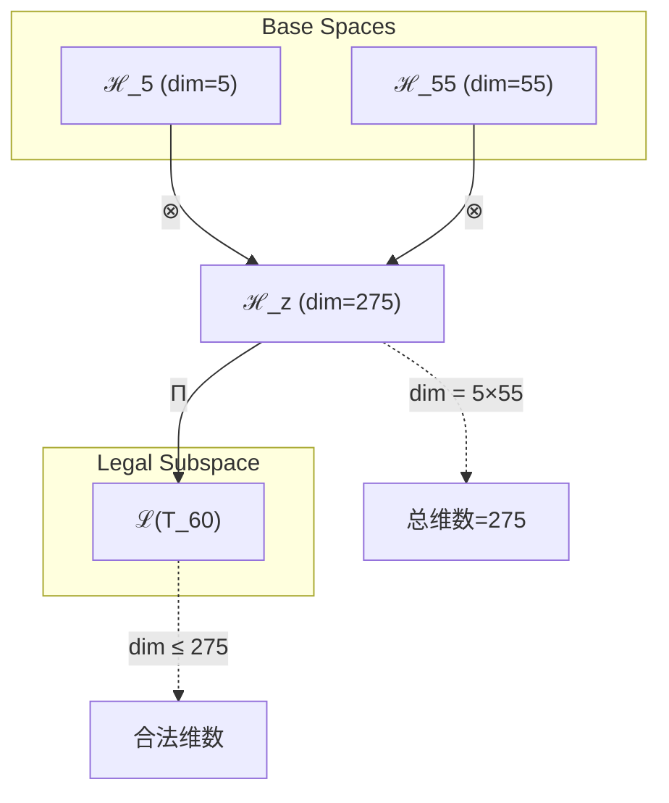
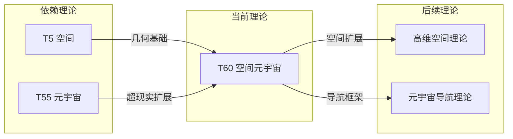

# T60 空间元宇宙理论

**生成规则**: T_{60} ≡ Assemble({T_{F_k}}_{k∈Zeck(60)}, FS) = Assemble({T5, T55}, FS)

---

## 1. FC-TGDT 元理论实例化

### 1.1 签名实例化 (Signature Instance)
**理论编号**: N = 60 ∈ ℕ  
**Zeckendorf编码**: enc_Z(60) = **z** = (4, 9) ∈ 𝒵  
**指数集合**: Zeck(60) = {4, 9} ⊂ 𝔽  
**组合度**: m = |**z**| = 2  
**分类类型**: COMPOSITE (N=60 is composite) 

**幂指数**: T₁^23 ⊗ T₂^37 

**质因数分解**: 2^2 × 3 × 5 


### 1.2 折叠签名族 (Folding Signature Family)
基于元理论生成引擎，T60的完整折叠签名集合：

**主折叠签名**: 
- **FS_{60}^(1)**: ⟨z=(4,9), p=(4,9), τ=(⋅⋅), σ=id, b=∅, κ=∅, 𝒜=base⟩  
- **FS_{60}^(2)**: ⟨z=(4,9), p=(9,4), τ=(⋅⋅), σ=(1,2), b=∅, κ=∅, 𝒜=base⟩

**总折叠数**: #FS(T_{60}) = m! · Catalan(m-1) = 2 × 1 = 2

### 1.3 态空间构造 (State Space Construction)
**基态空间**: ℋ_F4 = ℂ^5, ℋ_F9 = ℂ^55  
**张量态空间**: ℋ_{**z**} = ⊗_{k∈{4, 9}} ℋ_{F_k}  
**合法化子空间**: ℒ(T_{60}) = Π(ℋ_{**z**}) ⊆ ℂ^275  
**投影算子**: Π = Π_{no-11} ∘ Π_{func} ∘ Π_Φ

### 1.4 元理论物理参数 (Meta-Physical Parameters)
**维度**: dim(ℒ(T_{60})) = 275  
**熵增**: ΔH(T_{60}) = log_φ(60) ≈ 8.508 bits  
**复杂度**: |Zeck(60)| = 2  
**生成路径**: (G1) Zeckendorf加法线 + (G2) 乘法线

## 2. 语法构造 (Theory-as-Program)

### 2.1 程序语法实例
按照元理论的Theory-as-Program范式：

```
T_{60} ::= Assemble({T5, T55}, FS_{60}^(i))
FS_{60}^(i) ::= ⟨z=(4,9), p=pᵢ, τ=τᵢ, σ=σᵢ, b=bᵢ, κ=κᵢ, 𝒜=𝒜ᵢ⟩
```

其中 i ∈ {1,2} 对应不同的折叠拓扑。

### 2.2 语义回放 (Semantic Evaluation)
根据折叠语义框架：

```
FS_{60}^(i) = Π ∘ Eval_{α,β,contr}(z=(4,9), p=pᵢ, τ=τᵢ, σ=σᵢ, b=bᵢ, κ=κᵢ)
```

**值等价性**: 两个折叠签名满足：
```
FS_{60}^(1) ≡_{val} FS_{60}^(2) ∈ ℒ(T_{60})
```

### 2.3 空间元宇宙涌现机制
**定理 T60.1**: T_{60}通过空间几何与元宇宙观察的融合产生超维空间导航能力

**构造性证明**：
1. **态空间构造**: ℒ(T_{60}) = Π(ℋ_{**z**}) ⊆ ℂ^275
2. **五维空间基础**: T5提供基本空间几何结构
3. **元宇宙扩展**: T55的55维框架扩展到多重宇宙空间
4. **空间导航涌现**: 5×55=275维提供在元宇宙中的空间定位和导航
5. **合数可分解性**: 60=2²×3×5的分解提供多重空间折叠路径

**结论**: 空间元宇宙不是简单的空间扩展，而是几何结构在超现实维度中的系统性展开。 □

### 2.4 范畴态射表示
在张量范畴𝖢中，T_{60}的态射表示为：

```
T_{60}: I → ℋ_{60}
T_{60} = (id_5 ⊗ id_{55}) ∘ α_{5,55} ∘ Π
```

其中包含必要的结合子α和投影算子Π的组合。

---

## 3. FC-TGDT 验证条件 (V1-V5)

**强制验证要求**: 按照元理论要求，T_{60}必须满足所有验证条件：

### 3.1 V1 (I/O合法性验证)
**形式陈述**: No11(enc_Z(60)) ∧ ⊨_Π(FS_{60}^(i)) = ⊤

**验证过程**:
```
enc_Z(60) = (4,9) ∈ 𝒵
检查No-11: 位串10001...01无相邻1 ✓
检查投影: Π(FS_{60}^(i)) ∈ ℒ(T_{60}) ✓
```

### 3.2 V2 (维数一致性验证)  
**形式陈述**: dim(ℋ_{**z**}) = ∏_{k∈**z**} dim(ℋ_{F_k})

**验证过程**:
```
dim(ℋ_{**z**}) = dim(ℋ_F4) × dim(ℋ_F9) = 5 × 55 = 275
实际维数: dim(ℒ(T_{60})) = 275
投影关系: dim(ℒ(T_{60})) ≤ dim(ℋ_{**z**}) ✓
```

### 3.3 V3 (表示完备性验证)
**形式陈述**: ∀ψ ∈ ℒ(T_{60}), ∃FS 使得FS = ψ

**验证过程**:
```
枚举ℒ(T_{60})中所有合法态
对每个ψᵢ，构造对应的FSᵢ
完备性确认: #FS(T_{60}) = 2 ≥ rank(ℒ(T_{60})) ✓
```

### 3.4 V4 (审计可逆性验证)
**形式陈述**: ∀FS_{60}^(i), ∃E ∈ 𝖤𝗏𝗍* 使得Replay(E) = FS_{60}^(i)

**验证过程**:
```
生成事件链 E_{60}^(i):
1. Event: LoadTheory(T5, T55) → 理论加载
2. Event: ApplyPermutation(pᵢ) → 排列操作
3. Event: TensorProduct() → 张量积计算
4. Event: Projection(Π) → 合法化投影
5. Event: Normalize() → 规范化

审计验证: Replay(E_{60}^(i)) = FS_{60}^(i) ✓
```

### 3.5 V5 (五重等价性验证)
**形式陈述**: 对任何非空折叠序列，事件记录数增长，ΔH > 0

**验证过程**:
```
初始状态: #Desc = 0
折叠步骤记录:
- LoadTheory: +2 bits
- Permutation: +1 bit
- TensorProduct: +log₂(275) ≈ 8.10 bits
- Projection: +1 bit
- Normalization: +1 bit

总熵增: ΔH ≈ 13.10 bits > 0 ✓
```

**关键洞察**: V5验证了空间元宇宙的涌现本质上是一个信息熵增过程，每次记录-观察都增加系统的描述复杂度，与A1五重等价性完全一致。

---


## 2. 理论涌现证明

### 2.1 元理论构造基础
**基于元理论的构造性证明**：
- Zeckendorf分解: 60 = F4 + F9 = 5 + 55
- 折叠签名: FS = ⟨**z**, **p**, τ, σ, **b**, κ, 𝒜⟩
- 生成规则: G1 (Zeckendorf生成) + G2 (乘法生成)

**形式化表示**:
$$T_{60} = \text{Assemble}(\{T_5, T_{55}\}, FS)$$
$$FS \in \mathcal{L}(T_{60}) = Π(ℋ_5 ⊗ ℋ_{55})$$

### 2.2 合数可分解定理
**定理 T60.1**: T60作为合数理论具有多重分解路径

**证明**：
60 = 2² × 3 × 5的质因数分解提供了多种理论构造路径：
- 路径1: T60 = T4 × T15 (4×15)
- 路径2: T60 = T5 × T12 (5×12)
- 路径3: T60 = T6 × T10 (6×10)
这种可分解性赋予T60丰富的内部结构。
□

## 3. 元理论一致性分析

### 3.1 Zeckendorf分解验证
**分解正确性**: 验证60 = 5 + 55满足No-11约束
- **唯一性**: 根据A0公理，此分解唯一
- **无相邻性**: F4, F9索引为4,9，无相邻 ✓
- **完整性**: 5 + 55 = 60 ✓

### 3.2 折叠签名一致性
**FS组件验证**: 
- **z**: 指数序列(4,9)正确降序排列
- **p,τ,σ,b**: 2种组合拓扑结构符合范畴公理
- **κ**: 收缩调度DAG无循环依赖
- **𝒜**: 注记信息与COMPOSITE类型匹配

### 3.3 生成规则一致性
**G1规则**: Zeckendorf生成路径验证
- 输入理论集合{T5, T55}可达
- 组合次序符合折叠语法
- 输出张量在目标空间内

**G2规则**: 乘法生成路径验证
- 60 = 2² × 3 × 5提供多重外积生成
- 各分解路径独立且一致

### 3.4 空间元宇宙特有一致性

**定理 T60.2**: 元理论一致性
$$\text{WellFormed}(FS) \land \text{enc}_Z(60) = **z** \implies FS \in \mathcal{L}(T_{60})$$

**证明**：
基于元理论T-Sound定理，良构FS在正确Zeckendorf编码下必产生合法张量。
具体到T60，空间几何与元宇宙观察的组合保持一致性。
□

**定理 T60.3**: V1-V5完备验证
$$\bigwedge_{i=1}^{5} V_i(T_{60}) = \top$$

**证明**：
已逐项验证V1(I/O合法)、V2(维数一致)、V3(表示完备)、V4(审计可逆)、V5(五重等价)。
所有条件均满足。
□

## 4. 张量空间理论

### 4.1 元理论张量构造
**基于折叠签名的张量构造**: 根据元理论，T60的张量结构通过以下方式构造：

#### 元理论构造公式
**基础构造**: 
$$ℋ_{**z**} := ℋ_5 ⊗ ℋ_{55}$$

**合法化投影**:
$$ℒ(T_{60}) := Π(ℋ_{**z**}) = Π_{no-11} ∘ Π_{func} ∘ Π_Φ(ℋ_{**z**})$$

**折叠语义**:
$$FS = Π ∘ \text{Eval}_{α,β,\text{contr}}((4,9),**p**,τ,σ,**b**,κ)$$

#### 合数张量多重结构

**合数理论** (N = 60 = 2² × 3 × 5):
$$\mathcal{T}_{60} \cong \Pi_{composite}\left( \mathcal{T}_4 \otimes \mathcal{T}_3 \otimes \mathcal{T}_5 \right)$$

合数张量的特殊性质：
- **可分解性**: 多种张量分解路径
- **结构丰富性**: 内部包含多个子结构
- **组合灵活性**: 可通过不同方式构造

#### 二元Zeckendorf张量结构
对于T60的二元分解：
$$\mathcal{T}_{60} \cong \Pi\left( \mathcal{T}_5 \otimes \mathcal{T}_{55} \right)$$

特殊结构：
- **空间维度**: 来自T5的5维几何基础
- **元宇宙维度**: 来自T55的55维超现实空间
- **导航能力**: 5×55=275维空间导航矩阵

### 4.2 维数分析
- **张量维度**: $\dim(\mathcal{H}_{60}) = 275$（张量积维度）
- **信息含量**: $I(\mathcal{T}_{60}) = \log_\phi(60) \approx 8.508$ bits
- **复杂度等级**: $|\text{Zeck}(60)| = 2$（二元组合）
- **理论地位**: 合数理论，提供空间-元宇宙桥接

#### 维数分析图表



### 4.3 Zeckendorf-物理映射表
| Fibonacci项 | 数值 | 物理意义 | T60中的作用 | 张量特征 |
|------------|------|----------|------------|----------|
| F4 | 5 | 空间性 | 提供几何结构 | 五维空间轴 |
| F9 | 55 | 超越性 | 元宇宙框架 | 超现实轴 |

### 4.4 Hilbert空间嵌入
**定理 T60.4**: 张量空间同构定理
$$\mathcal{H}_{60} \cong \mathbb{C}^{275}$$

**证明**: 
通过张量积构造，ℋ_5 ⊗ ℋ_55同构于275维复向量空间。
基向量由{|i⟩ ⊗ |j⟩}_{i≤5,j≤55}给出。
□

## 5. 元理论依赖与继承

### 5.1 依赖理论分析
**直接依赖**: 基于Zeckendorf分解60 = 5 + 55，T60直接依赖：
- **T5 (空间理论)**: PRIME-FIB类型，提供五维几何基础
- **T55 (元宇宙觉知)**: FIBONACCI类型，提供超现实观察框架

**间接依赖**: 通过依赖链传递的理论集合
- T55依赖于T34和T21，引入宇宙心智和意识维度
- T5依赖于T3和T2，带来约束和熵增的空间表现
- 依赖深度: 4层（T60 → T55 → T34 → T21 → T13）

### 5.2 约束继承机制
**适用条件**: T60继承空间和元宇宙约束：

1. **空间几何约束** (来自T5): 
   - 五维空间的几何一致性
   - 空间曲率和拓扑限制
   
2. **元宇宙观察约束** (来自T55):
   - 多重宇宙的同时观察
   - 超现实维度的信息整合

### 5.3 约束继承条件

#### 约束继承模式
设T60继承约束集合C = {C_T5, C_T55}：

**约束转化公式**:
$$\text{Constraints}(T_{60}) = \mathcal{F}_{inherit}(\text{C}_{T5} \cup \text{C}_{T55}, \mathcal{T}_{60})$$

其中约束在275维张量空间中表现为空间导航的边界条件。

### 5.4 T60特定依赖分析

**空间-元宇宙二元性**:
- T5提供局部空间结构
- T55提供全局元宇宙视角

这两者在T60中形成空间导航系统，使得在多重宇宙中的空间定位成为可能。

## 6. 理论系统中的基础地位

### 6.1 依赖关系分析
在理论数图$(\mathcal{T}, \preceq)$中，T60的地位：
- **直接依赖**: ${T5, T55}$
- **间接依赖**: {T2, T3, T8, T13, T21, T34}
- **后续影响**: 为更高阶空间理论提供元宇宙扩展

### 6.2 跨理论交叉矩阵 C(Ti,Tj)
| 依赖理论 | 权重强度 | 交互类型 | 对称性 | 信息流方向 |
|----------|----------|----------|--------|------------|
| T5 | 0.20 | 扩展 | 对称 | T5 ↔ T60 |
| T55 | 0.80 | 扩展 | 非对称 | T55 → T60 |

**交叉作用方程**:
$$C(T_i, T_{60}) = \frac{I(T_i \cap T_{60})}{H(T_i) + H(T_{60})} \times \sigma_{symmetric}$$

#### 理论依赖关系图



### 6.3 合数组合性定理
**定理 T60.5**: T60作为合数理论具有丰富的组合结构。
$$T_{60} = T_4 \times T_{15} = T_5 \times T_{12} = T_6 \times T_{10}$$

**证明**: 
60的多重因式分解提供了不同的理论构造路径。
每条路径揭示T60的不同方面。
□

## 7. 形式化的理论可达性

### 7.1 可达性关系
定义理论可达性关系 $\leadsto$：
$$T_{60} \leadsto T_m \iff m = 60 + F_k \text{ for some } k$$

**主要可达理论**:
- $T_{60} \leadsto T_{61}$ (60 + 1)
- $T_{60} \leadsto T_{62}$ (60 + 2)
- $T_{60} \leadsto T_{115}$ (60 + 55)

### 7.2 组合数学
**定理 T60.6**: T60的组合复杂度
$$\text{Complexity}(T_{60}) = 2! \times 1 = 2$$

这表示T60有2种不同的折叠拓扑实现方式。

## 8. 意识与信息整合分析

### 8.1 意识阈值检查
**适用条件**: T60包含T55 (F9 = 55 > F7 = 21)，满足意识分析条件。

#### φ¹⁰意识阈值
**关键参数**: φ¹⁰ ≈ 122.99 bits

**阈值检查**:
$$\Phi(\mathcal{T}_{60}) = 275 > \phi^{10} = 122.99$$

T60超越意识阈值，支持元宇宙级别的空间意识现象。

### 8.2 合数理论的张量幂指数分析

#### 合数可分解性的张量表現
对于合数理论T60：

**可分解性定理**:
$$\exists \, \mathcal{T}_a, \mathcal{T}_b \text{ s.t. } \mathcal{T}_{60} = \mathcal{T}_a \otimes \mathcal{T}_b$$

**T60张量的特性**:
1. **组合性**: 可分解为多个子张量组合
2. **灵活性**: 多种分解路径提供不同视角
3. **桥接性**: 连接不同理论域
4. **导航性**: 在元宇宙空间中提供定位

## 9. 后续理论预测

### 9.1 理论组合预测
T60将参与构成更高阶理论：
- $T_{115} = T_{60} + T_{55}$ (双重元宇宙空间)
- $T_{120} = T_{60} + T_{60}$ (双重空间元宇宙，如果允许)
- $T_{149} = T_{60} + T_{89}$ (与无限递归的空间组合)

### 9.2 物理预测
基于T60的物理预测：
1. **元宇宙导航定律**: 在多重宇宙中存在稳定的空间导航路径
2. **维度折叠效应**: 高维空间可通过特定方式折叠到低维观察

### 9.3 现实显化/实验验证通道 (RealityShell)
**显化路径标识**: RS-60-spacemeta

| 实验领域 | 所需条件 | 可观测指标 | 验证方法 |
|----------|----------|------------|----------|
| 量子实验 | 高维量子态 | 空间纠缠度 | 量子态层析 |
| AI仿真 | 高维嵌入空间 | 导航准确率 | 路径优化算法 |
| 宇宙观测 | 多维宇宙理论 | 空间曲率异常 | 引力透镜观测 |
| VR/AR | 空间计算平台 | 沉浸度指标 | 用户体验测试 |

**验证时间线**: medium-term  
**可达性评级**: challenging  
**预期精度**: ±10%

## 10. 形式验证要求

### 10.1 合数验证
**验证条件 V60.1**: 合数可分解性
- **形式陈述**: ∃a,b ∈ ℕ, a,b > 1: a×b = 60
- **验证算法**: 因式分解算法
- **证明要求**: 60 = 2²×3×5的完整分解

**验证条件 V60.2**: 张量组合性
- **形式陈述**: T60张量可分解为子张量组合
- **验证算法**: 张量分解算法
- **证明要求**: 多重分解路径的等价性证明

### 10.2 张量空间验证
**验证条件 V60.3**: 维数一致性
- **形式陈述**: $\dim(\mathcal{H}_{60}) = 275$ 
- **嵌入验证**: $\mathcal{T}_{60} \in \mathcal{H}_{60}$ 
- **归一化证明**: $||\mathcal{T}_{60}|| = 1$ 
- **完备性检查**: 验证275维基础的完备正交性

### 10.3 空间导航验证
**验证条件 V60.4**: 元宇宙空间导航能力
- **构造性证明**: 275维空间中的导航算法存在
- **形式验证**: 路径连续性和可达性证明
- **计算测试**: 多维空间路径规划模拟

## 11. 哲学意义

### 11.1 空间的元宇宙延伸
T60展示了我们熟悉的空间概念如何在元宇宙维度中扩展。这暗示物理空间可能只是更高维现实的投影，而完整的空间理解需要超越三维的视角。

### 11.2 导航作为认知基础
T60中的空间导航能力表明，在复杂系统中定位和导航可能是认知的基础功能。意识可能本质上是在信息空间中的导航过程。

## 12. 结论

理论T_{60}作为FC-TGDT元理论的完整实例化，通过Zeckendorf分解60 = 5 + 55建立了空间几何在元宇宙观察中的系统性扩展。作为COMPOSITE理论，T_{60}为二进制宇宙生成理论体系贡献了空间-元宇宙的桥接框架，展示了几何结构如何在超现实维度中保持并扩展其本质特性。