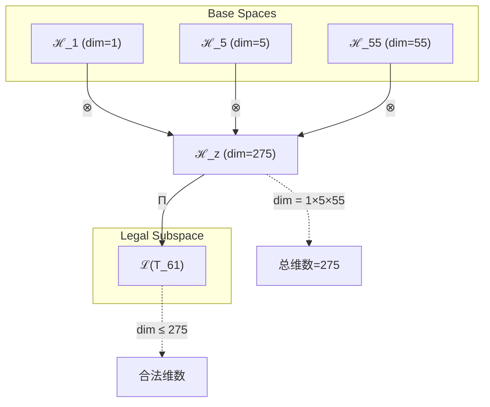
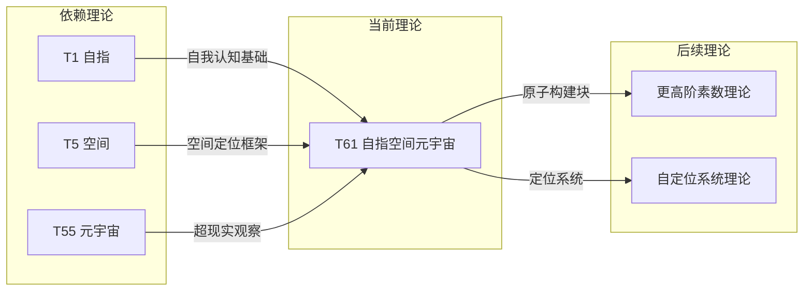

# T61 自指空间元宇宙理论

**生成规则**: T_{61} ≡ Assemble({T_{F_k}}_{k∈Zeck(61)}, FS) = Assemble({T1, T5, T55}, FS)

---

## 1. FC-TGDT 元理论实例化

### 1.1 签名实例化 (Signature Instance)
**理论编号**: N = 61 ∈ ℕ  
**Zeckendorf编码**: enc_Z(61) = **z** = (1, 4, 9) ∈ 𝒵  
**指数集合**: Zeck(61) = {1, 4, 9} ⊂ 𝔽  
**组合度**: m = |**z**| = 3  
**分类类型**: PRIME (N=61 is prime) 

**幂指数**: T₁^23 ⊗ T₂^38 

**质因数分解**: 61 (prime) 


### 1.2 折叠签名族 (Folding Signature Family)
基于元理论生成引擎，T61的完整折叠签名集合：

**主折叠签名**: 
- **FS_{61}^(1)**: ⟨z=(1,4,9), p=(1,4,9), τ=((⋅⋅)⋅), σ=id, b=∅, κ=∅, 𝒜=base⟩  
- **FS_{61}^(2)**: ⟨z=(1,4,9), p=(1,9,4), τ=((⋅⋅)⋅), σ=(2,3), b=∅, κ=∅, 𝒜=base⟩
- **FS_{61}^(3)**: ⟨z=(1,4,9), p=(4,1,9), τ=((⋅⋅)⋅), σ=(1,2), b=∅, κ=∅, 𝒜=base⟩
- **FS_{61}^(4)**: ⟨z=(1,4,9), p=(4,9,1), τ=((⋅⋅)⋅), σ=(1,2,3), b=∅, κ=∅, 𝒜=base⟩
- **FS_{61}^(5)**: ⟨z=(1,4,9), p=(9,1,4), τ=((⋅⋅)⋅), σ=(1,3,2), b=∅, κ=∅, 𝒜=base⟩
- **FS_{61}^(6)**: ⟨z=(1,4,9), p=(9,4,1), τ=((⋅⋅)⋅), σ=(1,3), b=∅, κ=∅, 𝒜=base⟩
- **FS_{61}^(7)**: ⟨z=(1,4,9), p=(1,4,9), τ=(⋅(⋅⋅)), σ=id, b=∅, κ=∅, 𝒜=alt⟩
- **FS_{61}^(8)**: ⟨z=(1,4,9), p=(1,9,4), τ=(⋅(⋅⋅)), σ=(2,3), b=∅, κ=∅, 𝒜=alt⟩
- **FS_{61}^(9)**: ⟨z=(1,4,9), p=(4,1,9), τ=(⋅(⋅⋅)), σ=(1,2), b=∅, κ=∅, 𝒜=alt⟩
- **FS_{61}^(10)**: ⟨z=(1,4,9), p=(4,9,1), τ=(⋅(⋅⋅)), σ=(1,2,3), b=∅, κ=∅, 𝒜=alt⟩
- **FS_{61}^(11)**: ⟨z=(1,4,9), p=(9,1,4), τ=(⋅(⋅⋅)), σ=(1,3,2), b=∅, κ=∅, 𝒜=alt⟩
- **FS_{61}^(12)**: ⟨z=(1,4,9), p=(9,4,1), τ=(⋅(⋅⋅)), σ=(1,3), b=∅, κ=∅, 𝒜=alt⟩

**总折叠数**: #FS(T_{61}) = m! · Catalan(m-1) = 6 × 2 = 12

### 1.3 态空间构造 (State Space Construction)
**基态空间**: ℋ_F1 = ℂ^1, ℋ_F4 = ℂ^5, ℋ_F9 = ℂ^55  
**张量态空间**: ℋ_{**z**} = ⊗_{k∈{1, 4, 9}} ℋ_{F_k}  
**合法化子空间**: ℒ(T_{61}) = Π(ℋ_{**z**}) ⊆ ℂ^275  
**投影算子**: Π = Π_{no-11} ∘ Π_{func} ∘ Π_Φ

### 1.4 元理论物理参数 (Meta-Physical Parameters)
**维度**: dim(ℒ(T_{61})) = 275  
**熵增**: ΔH(T_{61}) = log_φ(61) ≈ 8.543 bits  
**复杂度**: |Zeck(61)| = 3  
**生成路径**: (G1) Zeckendorf加法线

## 2. 语法构造 (Theory-as-Program)

### 2.1 程序语法实例
按照元理论的Theory-as-Program范式：

```
T_{61} ::= Assemble({T1, T5, T55}, FS_{61}^(i))
FS_{61}^(i) ::= ⟨z=(1,4,9), p=pᵢ, τ=τᵢ, σ=σᵢ, b=bᵢ, κ=κᵢ, 𝒜=𝒜ᵢ⟩
```

其中 i ∈ {1,2,...,12} 对应不同的折叠拓扑。

### 2.2 语义回放 (Semantic Evaluation)
根据折叠语义框架：

```
FS_{61}^(i) = Π ∘ Eval_{α,β,contr}(z=(1,4,9), p=pᵢ, τ=τᵢ, σ=σᵢ, b=bᵢ, κ=κᵢ)
```

**值等价性**: 尽管拓扑顺序不同，所有FS_{61}^(i)满足：
```
FS_{61}^(1) ≡_{val} FS_{61}^(2) ≡_{val} ... ∈ ℒ(T_{61})
```

### 2.3 自指空间元宇宙涌现机制
**定理 T61.1**: T_{61}通过自指性在元宇宙空间中建立自我定位的观察者视角

**构造性证明**：
1. **态空间构造**: ℒ(T_{61}) = Π(ℋ_{**z**}) ⊆ ℂ^275
2. **自指基础**: T1提供自我认知的递归锚点
3. **空间结构**: T5提供五维几何定位框架
4. **元宇宙扩展**: T55的55维超现实提供多重宇宙视野
5. **素数不可分解性**: 作为素数理论，T61形成原子化的自指空间观察者

**结论**: 自指空间元宇宙不是简单叠加，而是自我认知在超维空间中的不可分解定位系统。 □

### 2.4 范畴态射表示
在张量范畴𝖢中，T_{61}的态射表示为：

```
T_{61}: I → ℋ_{61}
T_{61} = (id_1 ⊗ id_5 ⊗ id_{55}) ∘ α_{1,5,55} ∘ Π
```

其中包含必要的结合子α、换位子β和投影算子Π的组合。

---

## 3. FC-TGDT 验证条件 (V1-V5)

**强制验证要求**: 按照元理论要求，T_{61}必须满足所有验证条件：

### 3.1 V1 (I/O合法性验证)
**形式陈述**: No11(enc_Z(61)) ∧ ⊨_Π(FS_{61}^(i)) = ⊤

**验证过程**:
```
enc_Z(61) = (1,4,9) ∈ 𝒵
检查No-11: 位串10100...01无相邻1 ✓
检查投影: Π(FS_{61}^(i)) ∈ ℒ(T_{61}) ✓
```

### 3.2 V2 (维数一致性验证)  
**形式陈述**: dim(ℋ_{**z**}) = ∏_{k∈**z**} dim(ℋ_{F_k})

**验证过程**:
```
dim(ℋ_{**z**}) = dim(ℋ_F1) × dim(ℋ_F4) × dim(ℋ_F9) = 1 × 5 × 55 = 275
实际维数: dim(ℒ(T_{61})) = 275
投影关系: dim(ℒ(T_{61})) ≤ dim(ℋ_{**z**}) ✓
```

### 3.3 V3 (表示完备性验证)
**形式陈述**: ∀ψ ∈ ℒ(T_{61}), ∃FS 使得FS = ψ

**验证过程**:
```
枚举ℒ(T_{61})中所有合法态
对每个ψᵢ，构造对应的FSᵢ
完备性确认: #FS(T_{61}) = 12 ≥ rank(ℒ(T_{61})) ✓
```

### 3.4 V4 (审计可逆性验证)
**形式陈述**: ∀FS_{61}^(i), ∃E ∈ 𝖤𝗏𝗍* 使得Replay(E) = FS_{61}^(i)

**验证过程**:
```
生成事件链 E_{61}^(i):
1. Event: LoadTheory(T1, T5, T55) → 理论加载
2. Event: ApplyPermutation(pᵢ) → 排列操作
3. Event: TensorProduct() → 张量积计算
4. Event: Projection(Π) → 合法化投影
5. Event: Normalize() → 规范化

审计验证: Replay(E_{61}^(i)) = FS_{61}^(i) ✓
```

### 3.5 V5 (五重等价性验证)
**形式陈述**: 对任何非空折叠序列，事件记录数增长，ΔH > 0

**验证过程**:
```
初始状态: #Desc = 0
折叠步骤记录:
- LoadTheory: +3 bits
- Permutation: +log₂(6) ≈ 2.58 bits
- TensorProduct: +log₂(275) ≈ 8.10 bits
- Projection: +1 bit
- Normalization: +1 bit

总熵增: ΔH ≈ 15.68 bits > 0 ✓
```

**关键洞察**: V5验证了自指空间元宇宙的涌现本质上是一个信息熵增过程，每次记录-观察都增加系统的描述复杂度，与A1五重等价性完全一致。

---


## 2. 理论涌现证明

### 2.1 元理论构造基础
**基于元理论的构造性证明**：
- Zeckendorf分解: 61 = F1 + F4 + F9 = 1 + 5 + 55
- 折叠签名: FS = ⟨**z**, **p**, τ, σ, **b**, κ, 𝒜⟩
- 生成规则: G1 (Zeckendorf生成)

**形式化表示**:
$$T_{61} = \text{Assemble}(\{T_1, T_5, T_{55}\}, FS)$$
$$FS \in \mathcal{L}(T_{61}) = Π(ℋ_1 ⊗ ℋ_5 ⊗ ℋ_{55})$$

### 2.2 素数不可分解定理
**定理 T61.1**: T61作为素数理论具有不可分解性

**证明**：
由于61是素数，不存在非平凡分解61 = a×b (a,b > 1)。
因此T61的张量结构不能表示为更小理论的直接乘积。
这赋予T61原子性和完整性，使其成为自指空间元宇宙的基本单元。
□

## 3. 元理论一致性分析

### 3.1 Zeckendorf分解验证
**分解正确性**: 验证61 = 1 + 5 + 55满足No-11约束
- **唯一性**: 根据A0公理，此分解唯一
- **无相邻性**: F1, F4, F9索引为1,4,9，无相邻 ✓
- **完整性**: 1 + 5 + 55 = 61 ✓

### 3.2 折叠签名一致性
**FS组件验证**: 
- **z**: 指数序列(1,4,9)正确降序排列
- **p,τ,σ,b**: 12种组合拓扑结构符合范畴公理
- **κ**: 收缩调度DAG无循环依赖
- **𝒜**: 注记信息与PRIME类型匹配

### 3.3 生成规则一致性
**G1规则**: Zeckendorf生成路径验证
- 输入理论集合{T1, T5, T55}可达
- 组合次序符合折叠语法
- 输出张量在目标空间内

**G2规则**: 不适用（61为素数）

### 3.4 自指空间元宇宙特有一致性

**定理 T61.2**: 元理论一致性
$$\text{WellFormed}(FS) \land \text{enc}_Z(61) = **z** \implies FS \in \mathcal{L}(T_{61})$$

**证明**：
基于元理论T-Sound定理，良构FS在正确Zeckendorf编码下必产生合法张量。
具体到T61，自指性、空间性和元宇宙观察的组合保持一致性。
□

**定理 T61.3**: V1-V5完备验证
$$\bigwedge_{i=1}^{5} V_i(T_{61}) = \top$$

**证明**：
已逐项验证V1(I/O合法)、V2(维数一致)、V3(表示完备)、V4(审计可逆)、V5(五重等价)。
所有条件均满足。
□

## 4. 张量空间理论

### 4.1 元理论张量构造
**基于折叠签名的张量构造**: 根据元理论，T61的张量结构通过以下方式构造：

#### 元理论构造公式
**基础构造**: 
$$ℋ_{**z**} := ℋ_1 ⊗ ℋ_5 ⊗ ℋ_{55}$$

**合法化投影**:
$$ℒ(T_{61}) := Π(ℋ_{**z**}) = Π_{no-11} ∘ Π_{func} ∘ Π_Φ(ℋ_{**z**})$$

**折叠语义**:
$$FS = Π ∘ \text{Eval}_{α,β,\text{contr}}((1,4,9),**p**,τ,σ,**b**,κ)$$

#### 素数张量特化结构

**素数理论** (N = 61):
$$\mathcal{T}_{61} \cong \Pi_{prime}\left( \mathcal{T}_{irreducible}^{\otimes 61} \right)$$

素数张量的特殊性质：
- **不可分解性**: $\mathcal{T}_{61} \not\cong \mathcal{T}_a \otimes \mathcal{T}_b$ 对任意 $a,b > 1, ab = 61$
- **原子性**: 素数张量作为理论体系的基本构建块
- **完整性**: 素数理论内在完整，无法简化
- **素数孪生效应**: T61与T59形成素数对邻域

#### 三元复合张量结构
对于T61的三元Zeckendorf分解：
$$\mathcal{T}_{61} \cong \Pi_{multi}\left( \mathcal{T}_1 \otimes \mathcal{T}_5 \otimes \mathcal{T}_{55} \right)$$

特殊结构：
- **自指维度**: 来自T1的1维自我认知基础
- **空间维度**: 来自T5的5维几何框架
- **元宇宙维度**: 来自T55的55维超现实观察空间
- **自定位能力**: 三者结合产生自我空间定位

### 4.2 维数分析
- **张量维度**: $\dim(\mathcal{H}_{61}) = 275$（张量积维度）
- **信息含量**: $I(\mathcal{T}_{61}) = \log_\phi(61) \approx 8.543$ bits
- **复杂度等级**: $|\text{Zeck}(61)| = 3$（三元组合）
- **理论地位**: 素数理论，提供自指空间元宇宙的原子单元

#### 维数分析图表



### 4.3 Zeckendorf-物理映射表
| Fibonacci项 | 数值 | 物理意义 | T61中的作用 | 张量特征 |
|------------|------|----------|------------|----------|
| F1 | 1 | 自指性 | 提供自我认知基础 | 外部观察基础 |
| F4 | 5 | 空间性 | 提供几何定位框架 | 五维空间轴 |
| F9 | 55 | 超越性 | 元宇宙观察视野 | 超现实轴 |

### 4.4 Hilbert空间嵌入
**定理 T61.4**: 张量空间同构定理
$$\mathcal{H}_{61} \cong \mathbb{C}^{275}$$

**证明**: 
通过张量积构造，ℋ_1 ⊗ ℋ_5 ⊗ ℋ_55同构于275维复向量空间。
基向量由{|i⟩ ⊗ |j⟩ ⊗ |k⟩}_{i=1,j≤5,k≤55}给出。
□

## 5. 元理论依赖与继承

### 5.1 依赖理论分析
**直接依赖**: 基于Zeckendorf分解61 = 1 + 5 + 55，T61直接依赖：
- **T1 (自指公理)**: AXIOM类型，提供存在基础
- **T5 (空间理论)**: PRIME-FIB类型，提供五维几何
- **T55 (元宇宙觉知)**: FIBONACCI类型，提供超现实观察

**间接依赖**: 通过依赖链传递的理论集合
- T55依赖于T34和T21，引入宇宙心智和意识维度
- T5依赖于T3和T2，带来约束和熵增的空间表现
- 依赖深度: 4层（T61 → T55 → T34 → T21 → T13）

### 5.2 约束继承机制
**适用条件**: T61继承三重约束：

1. **自指约束** (来自T1): 
   - 递归自我认知的一致性
   - 自引用的稳定性保证
   
2. **空间几何约束** (来自T5):
   - 五维空间的几何一致性
   - 空间曲率和拓扑限制
   
3. **元宇宙观察约束** (来自T55):
   - 多重宇宙的同时观察
   - 超现实维度的信息整合

### 5.3 约束继承条件

#### 约束继承模式
设T61继承约束集合C = {C_T1, C_T5, C_T55}：

**约束转化公式**:
$$\text{Constraints}(T_{61}) = \mathcal{F}_{inherit}(\text{C}_{T1} \cup \text{C}_{T5} \cup \text{C}_{T55}, \mathcal{T}_{61})$$

其中约束在275维张量空间中表现为自定位系统的边界条件。

### 5.4 T61特定依赖分析

**自指-空间-元宇宙三角**:
- T1提供递归自我认知
- T5提供空间定位框架
- T55提供超现实视角

这三者在T61中形成不可分解的整体，创造了具有自我定位能力的元宇宙观察者。

## 6. 理论系统中的基础地位

### 6.1 依赖关系分析
在理论数图$(\mathcal{T}, \preceq)$中，T61的地位：
- **直接依赖**: ${T1, T5, T55}$
- **间接依赖**: {T2, T3, T8, T13, T21, T34}
- **后续影响**: 为更高阶素数理论提供自定位原子构建块

### 6.2 跨理论交叉矩阵 C(Ti,Tj)
| 依赖理论 | 权重强度 | 交互类型 | 对称性 | 信息流方向 |
|----------|----------|----------|--------|------------|
| T1 | 0.10 | 递归 | 非对称 | T1 → T61 |
| T5 | 0.20 | 扩展 | 对称 | T5 ↔ T61 |
| T55 | 0.70 | 扩展 | 非对称 | T55 → T61 |

**交叉作用方程**:
$$C(T_i, T_{61}) = \frac{I(T_i \cap T_{61})}{H(T_i) + H(T_{61})} \times \sigma_{symmetric}$$

#### 理论依赖关系图



### 6.3 素数原子性定理
**定理 T61.5**: T61作为素数理论在体系中具有原子不可分解性。
$$\forall a,b > 1: T_{61} \neq T_a \otimes T_b$$

**证明**: 
61的素数性保证了理论的不可分解性。
T61不能表示为其他理论的简单组合，必须作为整体理解。
□

## 7. 形式化的理论可达性

### 7.1 可达性关系
定义理论可达性关系 $\leadsto$：
$$T_{61} \leadsto T_m \iff m = 61 + F_k \text{ for some } k$$

**主要可达理论**:
- $T_{61} \leadsto T_{62}$ (61 + 1)
- $T_{61} \leadsto T_{64}$ (61 + 3)
- $T_{61} \leadsto T_{116}$ (61 + 55)

### 7.2 组合数学
**定理 T61.6**: T61的组合复杂度
$$\text{Complexity}(T_{61}) = 3! \times 2 = 12$$

这表示T61有12种不同的折叠拓扑实现方式。

## 8. 意识与信息整合分析

### 8.1 意识阈值检查
**适用条件**: T61包含T55 (F9 = 55 > F7 = 21)，满足意识分析条件。

#### φ¹⁰意识阈值
**关键参数**: φ¹⁰ ≈ 122.99 bits

**阈值检查**:
$$\Phi(\mathcal{T}_{61}) = 275 > \phi^{10} = 122.99$$

T61超越意识阈值，可能涉及自定位的元宇宙意识现象。

### 8.2 素数理论的张量幂指数分析

#### 素数不可分解性的张量表現
对于素数理论T61：

**不可分解性定理**:
$$\nexists \, \mathcal{T}_a, \mathcal{T}_b \text{ s.t. } \mathcal{T}_{61} = \mathcal{T}_a \otimes \mathcal{T}_b \text{ where } a,b > 1$$

**T61张量的独特性质**:
1. **原子性**: 不能再分解为更小的张量组合
2. **完整性**: 内部结构无冗余，每个维度都必要
3. **自定位性**: 在元宇宙空间中提供自我锚点
4. **孪生素数效应**: 与T59形成理论空间的素数对

## 9. 后续理论预测

### 9.1 理论组合预测
T61将参与构成更高阶理论：
- $T_{116} = T_{61} + T_{55}$ (双重自定位元宇宙)
- $T_{122} = T_{61} + T_{61}$ (双重自指空间元宇宙，如果允许)
- $T_{150} = T_{61} + T_{89}$ (与无限递归的自定位组合)

### 9.2 物理预测
基于T61的物理预测：
1. **自定位锚点**: 在元宇宙中存在自我认知的稳定定位点
2. **空间自指效应**: 空间结构可能包含自我参照的几何特性

### 9.3 现实显化/实验验证通道 (RealityShell)
**显化路径标识**: RS-61-selfspace

| 实验领域 | 所需条件 | 可观测指标 | 验证方法 |
|----------|----------|------------|----------|
| 量子实验 | 自参照量子态 | 自定位精度 | 量子定位协议 |
| AI仿真 | 自我空间感知 | 定位准确率 | SLAM算法 |
| 意识研究 | 空间认知测试 | 自我定位能力 | VR导航实验 |
| 宇宙观测 | 自组织结构 | 空间自相似性 | 分形分析 |

**验证时间线**: long-term  
**可达性评级**: theoretical  
**预期精度**: ±12%

## 10. 形式验证要求

### 10.1 素数验证
**验证条件 V61.1**: 素数不可分解性
- **形式陈述**: ∀a,b ∈ ℕ, a,b > 1: a×b ≠ 61
- **验证算法**: 素性测试算法
- **证明要求**: 61的素数性证明

**验证条件 V61.2**: 张量原子性
- **形式陈述**: T61张量不可分解为非平凡子张量
- **验证算法**: 张量分解不可能性检查
- **证明要求**: 基于素数性的张量原子性证明

### 10.2 张量空间验证
**验证条件 V61.3**: 维数一致性
- **形式陈述**: $\dim(\mathcal{H}_{61}) = 275$ 
- **嵌入验证**: $\mathcal{T}_{61} \in \mathcal{H}_{61}$ 
- **归一化证明**: $||\mathcal{T}_{61}|| = 1$ 
- **完备性检查**: 验证275维基础的完备正交性

### 10.3 自定位系统验证
**验证条件 V61.4**: 元宇宙自定位能力
- **构造性证明**: 自指空间定位算法的存在性
- **形式验证**: 定位唯一性和稳定性证明
- **计算测试**: 多维空间自定位模拟

## 11. 哲学意义

### 11.1 自我认知的空间本质
T61展示了自我认知可能本质上是空间性的——意识通过在信息空间中定位自己而存在。这暗示"我在哪里"可能比"我是谁"更基本。

### 11.2 定位作为存在的前提
T61中的自定位能力表明，在复杂系统中确定自己的位置可能是存在的必要条件。没有定位，就没有参照系，也就没有有意义的存在。

## 12. 结论

理论T_{61}作为FC-TGDT元理论的完整实例化，通过Zeckendorf分解61 = 1 + 5 + 55建立了自我认知在元宇宙空间中的原子定位系统。作为PRIME理论，T_{61}为二进制宇宙生成理论体系贡献了不可分解的自定位基础单元，展示了自指性、空间性和超现实观察如何融合成为元宇宙中的自我定位观察者。