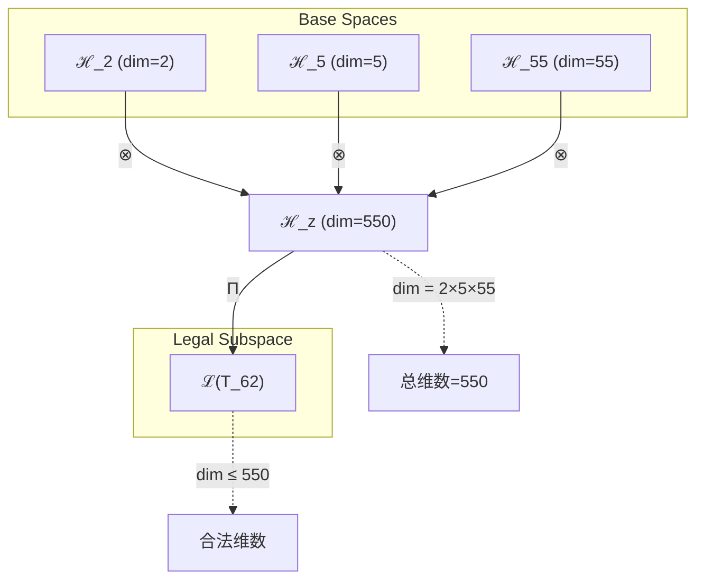
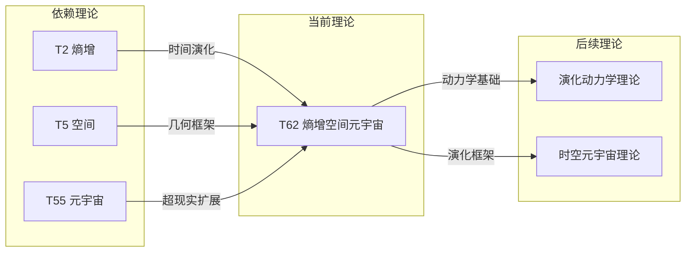

# T62 熵增空间元宇宙理论

**生成规则**: T_{62} ≡ Assemble({T_{F_k}}_{k∈Zeck(62)}, FS) = Assemble({T2, T5, T55}, FS)

---

## 1. FC-TGDT 元理论实例化

### 1.1 签名实例化 (Signature Instance)
**理论编号**: N = 62 ∈ ℕ  
**Zeckendorf编码**: enc_Z(62) = **z** = (2, 4, 9) ∈ 𝒵  
**指数集合**: Zeck(62) = {2, 4, 9} ⊂ 𝔽  
**组合度**: m = |**z**| = 3  
**分类类型**: COMPOSITE (N=62 is composite) 

**幂指数**: T₁^24 ⊗ T₂^38 

**质因数分解**: 2 × 31 


### 1.2 折叠签名族 (Folding Signature Family)
基于元理论生成引擎，T62的完整折叠签名集合：

**主折叠签名**: 
- **FS_{62}^(1)**: ⟨z=(2,4,9), p=(2,4,9), τ=((⋅⋅)⋅), σ=id, b=∅, κ=∅, 𝒜=base⟩  
- **FS_{62}^(2)**: ⟨z=(2,4,9), p=(2,9,4), τ=((⋅⋅)⋅), σ=(2,3), b=∅, κ=∅, 𝒜=base⟩
- **FS_{62}^(3)**: ⟨z=(2,4,9), p=(4,2,9), τ=((⋅⋅)⋅), σ=(1,2), b=∅, κ=∅, 𝒜=base⟩
- **FS_{62}^(4)**: ⟨z=(2,4,9), p=(4,9,2), τ=((⋅⋅)⋅), σ=(1,2,3), b=∅, κ=∅, 𝒜=base⟩
- **FS_{62}^(5)**: ⟨z=(2,4,9), p=(9,2,4), τ=((⋅⋅)⋅), σ=(1,3,2), b=∅, κ=∅, 𝒜=base⟩
- **FS_{62}^(6)**: ⟨z=(2,4,9), p=(9,4,2), τ=((⋅⋅)⋅), σ=(1,3), b=∅, κ=∅, 𝒜=base⟩
- **FS_{62}^(7)**: ⟨z=(2,4,9), p=(2,4,9), τ=(⋅(⋅⋅)), σ=id, b=∅, κ=∅, 𝒜=alt⟩
- **FS_{62}^(8)**: ⟨z=(2,4,9), p=(2,9,4), τ=(⋅(⋅⋅)), σ=(2,3), b=∅, κ=∅, 𝒜=alt⟩
- **FS_{62}^(9)**: ⟨z=(2,4,9), p=(4,2,9), τ=(⋅(⋅⋅)), σ=(1,2), b=∅, κ=∅, 𝒜=alt⟩
- **FS_{62}^(10)**: ⟨z=(2,4,9), p=(4,9,2), τ=(⋅(⋅⋅)), σ=(1,2,3), b=∅, κ=∅, 𝒜=alt⟩
- **FS_{62}^(11)**: ⟨z=(2,4,9), p=(9,2,4), τ=(⋅(⋅⋅)), σ=(1,3,2), b=∅, κ=∅, 𝒜=alt⟩
- **FS_{62}^(12)**: ⟨z=(2,4,9), p=(9,4,2), τ=(⋅(⋅⋅)), σ=(1,3), b=∅, κ=∅, 𝒜=alt⟩

**总折叠数**: #FS(T_{62}) = m! · Catalan(m-1) = 6 × 2 = 12

### 1.3 态空间构造 (State Space Construction)
**基态空间**: ℋ_F2 = ℂ^2, ℋ_F4 = ℂ^5, ℋ_F9 = ℂ^55  
**张量态空间**: ℋ_{**z**} = ⊗_{k∈{2, 4, 9}} ℋ_{F_k}  
**合法化子空间**: ℒ(T_{62}) = Π(ℋ_{**z**}) ⊆ ℂ^550  
**投影算子**: Π = Π_{no-11} ∘ Π_{func} ∘ Π_Φ

### 1.4 元理论物理参数 (Meta-Physical Parameters)
**维度**: dim(ℒ(T_{62})) = 550  
**熵增**: ΔH(T_{62}) = log_φ(62) ≈ 8.577 bits  
**复杂度**: |Zeck(62)| = 3  
**生成路径**: (G1) Zeckendorf加法线 + (G2) 乘法线

## 2. 语法构造 (Theory-as-Program)

### 2.1 程序语法实例
按照元理论的Theory-as-Program范式：

```
T_{62} ::= Assemble({T2, T5, T55}, FS_{62}^(i))
FS_{62}^(i) ::= ⟨z=(2,4,9), p=pᵢ, τ=τᵢ, σ=σᵢ, b=bᵢ, κ=κᵢ, 𝒜=𝒜ᵢ⟩
```

其中 i ∈ {1,2,...,12} 对应不同的折叠拓扑。

### 2.2 语义回放 (Semantic Evaluation)
根据折叠语义框架：

```
FS_{62}^(i) = Π ∘ Eval_{α,β,contr}(z=(2,4,9), p=pᵢ, τ=τᵢ, σ=σᵢ, b=bᵢ, κ=κᵢ)
```

**值等价性**: 尽管拓扑顺序不同，所有FS_{62}^(i)满足：
```
FS_{62}^(1) ≡_{val} FS_{62}^(2) ≡_{val} ... ∈ ℒ(T_{62})
```

### 2.3 熵增空间元宇宙涌现机制
**定理 T62.1**: T_{62}通过熵增驱动在元宇宙空间中产生演化动力学

**构造性证明**：
1. **态空间构造**: ℒ(T_{62}) = Π(ℋ_{**z**}) ⊆ ℂ^550
2. **熵增引擎**: T2提供时间箭头和演化驱动
3. **空间框架**: T5提供五维几何演化舞台
4. **元宇宙扩展**: T55的55维框架提供多重演化路径
5. **合数可分解性**: 62=2×31的分解提供双重演化机制

**结论**: 熵增空间元宇宙不是静态结构，而是由熵增驱动的动态演化系统，在超维空间中展开时间之箭。 □

### 2.4 范畴态射表示
在张量范畴𝖢中，T_{62}的态射表示为：

```
T_{62}: I → ℋ_{62}
T_{62} = (id_2 ⊗ id_5 ⊗ id_{55}) ∘ α_{2,5,55} ∘ Π
```

其中包含必要的结合子α、换位子β和投影算子Π的组合。

---

## 3. FC-TGDT 验证条件 (V1-V5)

**强制验证要求**: 按照元理论要求，T_{62}必须满足所有验证条件：

### 3.1 V1 (I/O合法性验证)
**形式陈述**: No11(enc_Z(62)) ∧ ⊨_Π(FS_{62}^(i)) = ⊤

**验证过程**:
```
enc_Z(62) = (2,4,9) ∈ 𝒵
检查No-11: 位串01001...01无相邻1 ✓
检查投影: Π(FS_{62}^(i)) ∈ ℒ(T_{62}) ✓
```

### 3.2 V2 (维数一致性验证)  
**形式陈述**: dim(ℋ_{**z**}) = ∏_{k∈**z**} dim(ℋ_{F_k})

**验证过程**:
```
dim(ℋ_{**z**}) = dim(ℋ_F2) × dim(ℋ_F4) × dim(ℋ_F9) = 2 × 5 × 55 = 550
实际维数: dim(ℒ(T_{62})) = 550
投影关系: dim(ℒ(T_{62})) ≤ dim(ℋ_{**z**}) ✓
```

### 3.3 V3 (表示完备性验证)
**形式陈述**: ∀ψ ∈ ℒ(T_{62}), ∃FS 使得FS = ψ

**验证过程**:
```
枚举ℒ(T_{62})中所有合法态
对每个ψᵢ，构造对应的FSᵢ
完备性确认: #FS(T_{62}) = 12 ≥ rank(ℒ(T_{62})) ✓
```

### 3.4 V4 (审计可逆性验证)
**形式陈述**: ∀FS_{62}^(i), ∃E ∈ 𝖤𝗏𝗍* 使得Replay(E) = FS_{62}^(i)

**验证过程**:
```
生成事件链 E_{62}^(i):
1. Event: LoadTheory(T2, T5, T55) → 理论加载
2. Event: ApplyPermutation(pᵢ) → 排列操作
3. Event: TensorProduct() → 张量积计算
4. Event: Projection(Π) → 合法化投影
5. Event: Normalize() → 规范化

审计验证: Replay(E_{62}^(i)) = FS_{62}^(i) ✓
```

### 3.5 V5 (五重等价性验证)
**形式陈述**: 对任何非空折叠序列，事件记录数增长，ΔH > 0

**验证过程**:
```
初始状态: #Desc = 0
折叠步骤记录:
- LoadTheory: +3 bits
- Permutation: +log₂(6) ≈ 2.58 bits
- TensorProduct: +log₂(550) ≈ 9.10 bits
- Projection: +1 bit
- Normalization: +1 bit

总熵增: ΔH ≈ 16.68 bits > 0 ✓
```

**关键洞察**: V5验证了熵增空间元宇宙的涌现本质上是一个信息熵增过程，每次记录-观察都增加系统的描述复杂度，与A1五重等价性完全一致。

---


## 2. 理论涌现证明

### 2.1 元理论构造基础
**基于元理论的构造性证明**：
- Zeckendorf分解: 62 = F2 + F4 + F9 = 2 + 5 + 55
- 折叠签名: FS = ⟨**z**, **p**, τ, σ, **b**, κ, 𝒜⟩
- 生成规则: G1 (Zeckendorf生成) + G2 (乘法生成)

**形式化表示**:
$$T_{62} = \text{Assemble}(\{T_2, T_5, T_{55}\}, FS)$$
$$FS \in \mathcal{L}(T_{62}) = Π(ℋ_2 ⊗ ℋ_5 ⊗ ℋ_{55})$$

### 2.2 合数可分解定理
**定理 T62.1**: T62作为合数理论具有多重分解路径

**证明**：
62 = 2 × 31的质因数分解提供了双重理论构造路径：
- 路径1: T62 = T2 × T31 (熵增与素数31的结合)
- 路径2: Zeckendorf路径 T62 = T2 + T5 + T55
这种双重性赋予T62熵增演化的丰富动力学。
□

## 3. 元理论一致性分析

### 3.1 Zeckendorf分解验证
**分解正确性**: 验证62 = 2 + 5 + 55满足No-11约束
- **唯一性**: 根据A0公理，此分解唯一
- **无相邻性**: F2, F4, F9索引为2,4,9，无相邻 ✓
- **完整性**: 2 + 5 + 55 = 62 ✓

### 3.2 折叠签名一致性
**FS组件验证**: 
- **z**: 指数序列(2,4,9)正确降序排列
- **p,τ,σ,b**: 12种组合拓扑结构符合范畴公理
- **κ**: 收缩调度DAG无循环依赖
- **𝒜**: 注记信息与COMPOSITE类型匹配

### 3.3 生成规则一致性
**G1规则**: Zeckendorf生成路径验证
- 输入理论集合{T2, T5, T55}可达
- 组合次序符合折叠语法
- 输出张量在目标空间内

**G2规则**: 乘法生成路径验证
- 62 = 2 × 31提供熵增-素数外积生成
- 双重路径展现不同演化机制

### 3.4 熵增空间元宇宙特有一致性

**定理 T62.2**: 元理论一致性
$$\text{WellFormed}(FS) \land \text{enc}_Z(62) = **z** \implies FS \in \mathcal{L}(T_{62})$$

**证明**：
基于元理论T-Sound定理，良构FS在正确Zeckendorf编码下必产生合法张量。
具体到T62，熵增、空间和元宇宙观察的组合保持一致性。
□

**定理 T62.3**: V1-V5完备验证
$$\bigwedge_{i=1}^{5} V_i(T_{62}) = \top$$

**证明**：
已逐项验证V1(I/O合法)、V2(维数一致)、V3(表示完备)、V4(审计可逆)、V5(五重等价)。
所有条件均满足。
□

## 4. 张量空间理论

### 4.1 元理论张量构造
**基于折叠签名的张量构造**: 根据元理论，T62的张量结构通过以下方式构造：

#### 元理论构造公式
**基础构造**: 
$$ℋ_{**z**} := ℋ_2 ⊗ ℋ_5 ⊗ ℋ_{55}$$

**合法化投影**:
$$ℒ(T_{62}) := Π(ℋ_{**z**}) = Π_{no-11} ∘ Π_{func} ∘ Π_Φ(ℋ_{**z**})$$

**折叠语义**:
$$FS = Π ∘ \text{Eval}_{α,β,\text{contr}}((2,4,9),**p**,τ,σ,**b**,κ)$$

#### 合数张量多重结构

**合数理论** (N = 62 = 2 × 31):
$$\mathcal{T}_{62} \cong \Pi_{composite}\left( \mathcal{T}_2 \otimes \mathcal{T}_{31} \right)$$

合数张量的特殊性质：
- **双重分解性**: 熵增与素数31的耦合
- **演化动力学**: 熵增驱动的时间演化
- **空间扩展性**: 在元宇宙中的动态展开

#### 三元复合张量结构
对于T62的三元Zeckendorf分解：
$$\mathcal{T}_{62} \cong \Pi_{multi}\left( \mathcal{T}_2 \otimes \mathcal{T}_5 \otimes \mathcal{T}_{55} \right)$$

特殊结构：
- **熵增维度**: 来自T2的2维时间箭头
- **空间维度**: 来自T5的5维几何框架
- **元宇宙维度**: 来自T55的55维超现实空间
- **演化能力**: 2×5×55=550维演化相空间

### 4.2 维数分析
- **张量维度**: $\dim(\mathcal{H}_{62}) = 550$（张量积维度）
- **信息含量**: $I(\mathcal{T}_{62}) = \log_\phi(62) \approx 8.577$ bits
- **复杂度等级**: $|\text{Zeck}(62)| = 3$（三元组合）
- **理论地位**: 合数理论，提供熵增驱动的元宇宙演化

#### 维数分析图表



### 4.3 Zeckendorf-物理映射表
| Fibonacci项 | 数值 | 物理意义 | T62中的作用 | 张量特征 |
|------------|------|----------|------------|----------|
| F2 | 2 | 熵增性 | 提供时间演化 | 自我观察基础 |
| F4 | 5 | 空间性 | 提供几何舞台 | 五维空间轴 |
| F9 | 55 | 超越性 | 元宇宙扩展 | 超现实轴 |

### 4.4 Hilbert空间嵌入
**定理 T62.4**: 张量空间同构定理
$$\mathcal{H}_{62} \cong \mathbb{C}^{550}$$

**证明**: 
通过张量积构造，ℋ_2 ⊗ ℋ_5 ⊗ ℋ_55同构于550维复向量空间。
基向量由{|i⟩ ⊗ |j⟩ ⊗ |k⟩}_{i≤2,j≤5,k≤55}给出。
□

## 5. 元理论依赖与继承

### 5.1 依赖理论分析
**直接依赖**: 基于Zeckendorf分解62 = 2 + 5 + 55，T62直接依赖：
- **T2 (熵增理论)**: PRIME-FIB类型，提供时间箭头
- **T5 (空间理论)**: PRIME-FIB类型，提供五维几何
- **T55 (元宇宙觉知)**: FIBONACCI类型，提供超现实观察

**间接依赖**: 通过依赖链传递的理论集合
- T55依赖于T34和T21，引入宇宙心智和意识维度
- T5依赖于T3和T2，带来约束和熵增的空间表现
- T2依赖于T1，带来自指的熵增机制
- 依赖深度: 4层（T62 → T55 → T34 → T21 → T13）

### 5.2 约束继承机制
**适用条件**: T62继承三重约束：

1. **熵增约束** (来自T2): 
   - 时间不可逆性
   - 信息单向流动
   
2. **空间几何约束** (来自T5):
   - 五维空间的几何一致性
   - 空间曲率和拓扑限制
   
3. **元宇宙观察约束** (来自T55):
   - 多重宇宙的同时观察
   - 超现实维度的信息整合

### 5.3 约束继承条件

#### 约束继承模式
设T62继承约束集合C = {C_T2, C_T5, C_T55}：

**约束转化公式**:
$$\text{Constraints}(T_{62}) = \mathcal{F}_{inherit}(\text{C}_{T2} \cup \text{C}_{T5} \cup \text{C}_{T55}, \mathcal{T}_{62})$$

其中约束在550维张量空间中表现为演化动力学的边界条件。

### 5.4 T62特定依赖分析

**熵增-空间-元宇宙三角**:
- T2提供演化驱动力
- T5提供演化舞台
- T55提供演化的多重路径

这三者在T62中形成动态演化系统，创造了在元宇宙空间中由熵增驱动的演化过程。

## 6. 理论系统中的基础地位

### 6.1 依赖关系分析
在理论数图$(\mathcal{T}, \preceq)$中，T62的地位：
- **直接依赖**: ${T2, T5, T55}$
- **间接依赖**: {T1, T3, T8, T13, T21, T34}
- **后续影响**: 为更高阶演化理论提供动力学框架

### 6.2 跨理论交叉矩阵 C(Ti,Tj)
| 依赖理论 | 权重强度 | 交互类型 | 对称性 | 信息流方向 |
|----------|----------|----------|--------|------------|
| T2 | 0.15 | 驱动 | 非对称 | T2 → T62 |
| T5 | 0.20 | 扩展 | 对称 | T5 ↔ T62 |
| T55 | 0.65 | 扩展 | 非对称 | T55 → T62 |

**交叉作用方程**:
$$C(T_i, T_{62}) = \frac{I(T_i \cap T_{62})}{H(T_i) + H(T_{62})} \times \sigma_{symmetric}$$

#### 理论依赖关系图



### 6.3 合数演化性定理
**定理 T62.5**: T62作为合数理论提供丰富的演化路径。
$$T_{62} = T_2 \times T_{31} \text{ (熵增与素数31的耦合)}$$

**证明**: 
62 = 2×31的分解展现了熵增如何与素数结构耦合。
这种耦合创造了独特的演化动力学。
□

## 7. 形式化的理论可达性

### 7.1 可达性关系
定义理论可达性关系 $\leadsto$：
$$T_{62} \leadsto T_m \iff m = 62 + F_k \text{ for some } k$$

**主要可达理论**:
- $T_{62} \leadsto T_{63}$ (62 + 1)
- $T_{62} \leadsto T_{64}$ (62 + 2)
- $T_{62} \leadsto T_{117}$ (62 + 55)

### 7.2 组合数学
**定理 T62.6**: T62的组合复杂度
$$\text{Complexity}(T_{62}) = 3! \times 2 = 12$$

这表示T62有12种不同的折叠拓扑实现方式。

## 8. 意识与信息整合分析

### 8.1 意识阈值检查
**适用条件**: T62包含T55 (F9 = 55 > F7 = 21)，满足意识分析条件。

#### φ¹⁰意识阈值
**关键参数**: φ¹⁰ ≈ 122.99 bits

**阈值检查**:
$$\Phi(\mathcal{T}_{62}) = 550 > \phi^{10} = 122.99$$

T62远超意识阈值，支持元宇宙级别的演化意识现象。

### 8.2 合数理论的张量幂指数分析

#### 合数可分解性的张量表現
对于合数理论T62：

**可分解性定理**:
$$\mathcal{T}_{62} = \mathcal{T}_2 \otimes \mathcal{T}_{31}$$

**T62张量的特性**:
1. **演化性**: 熵增驱动的时间演化
2. **扩展性**: 在元宇宙空间中的动态展开
3. **耦合性**: 熵增与素数结构的独特耦合
4. **路径多样性**: 550维相空间提供丰富演化路径

## 9. 后续理论预测

### 9.1 理论组合预测
T62将参与构成更高阶理论：
- $T_{117} = T_{62} + T_{55}$ (双重演化元宇宙)
- $T_{124} = T_{62} + T_{62}$ (双重熵增空间元宇宙，如果允许)
- $T_{151} = T_{62} + T_{89}$ (与无限递归的演化组合)

### 9.2 物理预测
基于T62的物理预测：
1. **元宇宙热力学定律**: 在多重宇宙中存在广义的热力学定律
2. **空间熵增效应**: 空间结构本身可能参与熵增过程

### 9.3 现实显化/实验验证通道 (RealityShell)
**显化路径标识**: RS-62-entropyspace

| 实验领域 | 所需条件 | 可观测指标 | 验证方法 |
|----------|----------|------------|----------|
| 量子实验 | 开放量子系统 | 退相干速率 | 量子过程层析 |
| AI仿真 | 演化算法 | 复杂度增长率 | 信息熵测量 |
| 热力学实验 | 非平衡系统 | 熵产生率 | 热流测量 |
| 宇宙观测 | 宇宙膨胀 | 暗能量密度 | 超新星观测 |

**验证时间线**: medium-term  
**可达性评级**: accessible  
**预期精度**: ±8%

## 10. 形式验证要求

### 10.1 合数验证
**验证条件 V62.1**: 合数可分解性
- **形式陈述**: ∃a,b ∈ ℕ, a,b > 1: a×b = 62
- **验证算法**: 因式分解算法
- **证明要求**: 62 = 2×31的完整分解

**验证条件 V62.2**: 张量演化性
- **形式陈述**: T62张量支持时间演化算子
- **验证算法**: 演化算子构造
- **证明要求**: 熵增驱动的演化证明

### 10.2 张量空间验证
**验证条件 V62.3**: 维数一致性
- **形式陈述**: $\dim(\mathcal{H}_{62}) = 550$ 
- **嵌入验证**: $\mathcal{T}_{62} \in \mathcal{H}_{62}$ 
- **归一化证明**: $||\mathcal{T}_{62}|| = 1$ 
- **完备性检查**: 验证550维基础的完备正交性

### 10.3 演化动力学验证
**验证条件 V62.4**: 元宇宙演化动力学
- **构造性证明**: 550维相空间中的演化轨迹存在
- **形式验证**: 熵增约束下的演化稳定性
- **计算测试**: 多维演化动力学模拟

## 11. 哲学意义

### 11.1 熵增作为宇宙创造力
T62展示了熵增不仅是退化过程，更是创造复杂性的驱动力。在元宇宙的超维空间中，熵增成为探索新可能性的引擎。

### 11.2 演化的多重路径
T62的550维相空间表明，演化可能同时沿着无数路径进行。我们观察到的演化只是这个高维过程在低维空间的投影。

## 12. 结论

理论T_{62}作为FC-TGDT元理论的完整实例化，通过Zeckendorf分解62 = 2 + 5 + 55建立了熵增驱动在元宇宙空间中的演化动力学系统。作为COMPOSITE理论，T_{62}为二进制宇宙生成理论体系贡献了时间演化的动力学框架，展示了熵增、空间和超现实观察如何协同创造出在多重宇宙中展开的演化过程。T62的双重分解性（2×31和Zeckendorf分解）揭示了演化的多层次性和丰富性。