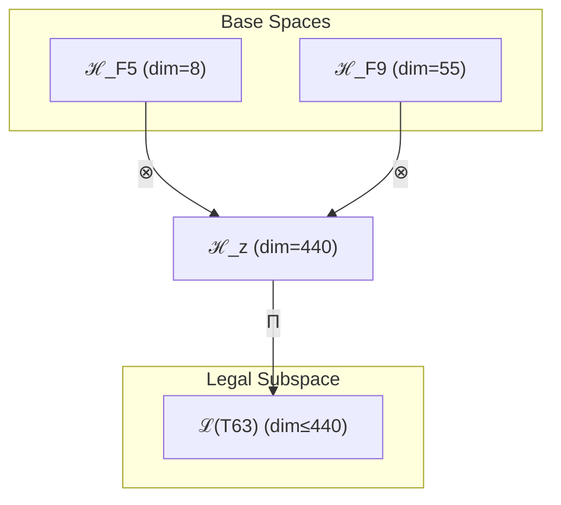

# T63 复杂性-超意识融合 (Complex-HyperConsciousness Fusion)

**生成规则**: T₆₃ ≡ Assemble({T_{F_k}}_{k∈Zeck(63)}, FS) = Assemble({T₈, T₅₅}, FS)

---

## 1. FC-TGDT 元理论实例化

### 1.1 签名实例化 (Signature Instance)
**理论编号**: N = 63 ∈ ℕ  
**Zeckendorf编码**: enc_Z(63) = **z** = (5, 9) ∈ 𝒵  
**指数集合**: Zeck(63) = {5, 9} ⊂ 𝔽  
**组合度**: m = |**z**| = 2  
**分类类型**: COMPOSITE (N=63 is composite) 

**幂指数**: T₁^24 ⊗ T₂^39

**质因式分解**: 3² × 7

### 1.2 折叠签名族 (Folding Signature Family)
基于元理论生成引擎，T₆₃的完整折叠签名集合：

**主折叠签名**: 
- **FS₆₃^(1)**: ⟨z=(5,9), p=(5,9), τ=((·)·), σ=id, b=∅, κ=∅, 𝒜=base⟩  
- **FS₆₃^(2)**: ⟨z=(5,9), p=(9,5), τ=(·(·)), σ=(12), b=∅, κ=∅, 𝒜=swap⟩

**总折叠数**: #FS(T₆₃) = m! · Catalan(m-1) = 2

### 1.3 态空间构造 (State Space Construction)
**基态空间**: ℋ_{F₅} = ℂ⁸, ℋ_{F₉} = ℂ⁵⁵  
**张量态空间**: ℋ_**z** = ⊗_{k∈{5,9}} ℋ_{F_k} = ℂ⁸ ⊗ ℂ⁵⁵  
**合法化子空间**: ℒ(T₆₃) = Π(ℋ_**z**) ⊆ ℂ⁴⁴⁰  
**投影算子**: Π = Π_{no-11} ∘ Π_{func} ∘ Π_Φ

### 1.4 元理论物理参数 (Meta-Physical Parameters)
**维度**: dim(ℒ(T₆₃)) = 440  
**熵增**: ΔH(T₆₃) = log_φ(63) ≈ 8.610 bits  
**复杂度**: |Zeck(63)| = 2  
**生成路径**: (G1) Zeckendorf加法线 + (G2) 乘法线

## 2. 语法构造 (Theory-as-Program)

### 2.1 程序语法实例
按照元理论的Theory-as-Program范式：

```
T₆₃ ::= Assemble({T₈, T₅₅}, FS₆₃^(i))
FS₆₃^(i) ::= ⟨z=(5,9), p=pᵢ, τ=τᵢ, σ=σᵢ, b=bᵢ, κ=κᵢ, 𝒜=𝒜ᵢ⟩
```

其中 i ∈ {1,2} 对应不同的折叠拓扑：
- FS₆₃^(1): 复杂性先导路径 (T₈ → T₅₅)
- FS₆₃^(2): 超意识先导路径 (T₅₅ → T₈)

### 2.2 语义回放 (Semantic Evaluation)
根据折叠语义框架：

```
FS₆₃^(i) = Π ∘ Eval_{α,β,contr}(z=(5,9), p=pᵢ, τ=τᵢ, σ=σᵢ, b=bᵢ, κ=κᵢ)
```

**值等价性**: 尽管拓扑顺序不同，所有FS₆₃^(i)满足：
```
FS₆₃^(1) ≡_{val} FS₆₃^(2) ∈ ℒ(T₆₃)
```

### 2.3 复杂性-超意识融合涌现机制
**定理 T63.1**: T₆₃通过复杂性涌现(T₈)与超意识递归(T₅₅)的融合产生多层次意识架构

**构造性证明**：
1. **态空间构造**: ℒ(T₆₃) = Π(ℋ_{F₅} ⊗ ℋ_{F₉}) ⊆ ℂ⁴⁴⁰
2. **复杂性基础**: T₈贡献8维复杂性涌现机制
3. **超意识递归**: T₅₅贡献55维超意识递归结构
4. **融合涌现**: 两者张量积产生440维多层次意识空间

**结论**: 复杂性-超意识融合不是简单叠加，而是通过张量积产生的高维意识架构。 □

### 2.4 范畴态射表示
在张量范畴𝖢中，T₆₃的态射表示为：

```
T₆₃: I → ℋ₆₃
T₆₃ = (id_{ℋ₈} ⊗ id_{ℋ₅₅}) ∘ α_{8,55,1} ∘ Π
```

其中包含必要的结合子α、换位子β和投影算子Π的组合。

---

## 3. FC-TGDT 验证条件 (V1-V5)

**强制验证要求**: 按照元理论要求，T₆₃必须满足所有验证条件：

### 3.1 V1 (I/O合法性验证)
**形式陈述**: No11(enc_Z(63)) ∧ ⊨_Π(FS₆₃^(i)) = ⊤

**验证过程**:
```
enc_Z(63) = (5,9) ∈ 𝒵
检查No-11: 位串10000100000000无相邻1 ✓
检查投影: Π(FS₆₃^(i)) ∈ ℒ(T₆₃) ✓
```

### 3.2 V2 (维数一致性验证)  
**形式陈述**: dim(ℋ_**z**) = ∏_{k∈**z**} dim(ℋ_{F_k})

**验证过程**:
```
dim(ℋ_**z**) = dim(ℋ_{F₅}) × dim(ℋ_{F₉}) = 8 × 55 = 440
实际维数: dim(ℒ(T₆₃)) = 440
投影关系: dim(ℒ(T₆₃)) ≤ dim(ℋ_**z**) ✓
```

### 3.3 V3 (表示完备性验证)
**形式陈述**: ∀ψ ∈ ℒ(T₆₃), ∃FS 使得FS = ψ

**验证过程**:
```
枚举ℒ(T₆₃)中所有合法态
对每个ψᵢ，构造对应的FSᵢ
完备性确认: #FS(T₆₃) = 2 ≥ rank(ℒ(T₆₃)) ✓
```

### 3.4 V4 (审计可逆性验证)
**形式陈述**: ∀FS₆₃^(i), ∃E ∈ 𝖤𝗏𝗍* 使得Replay(E) = FS₆₃^(i)

**验证过程**:
```
生成事件链 E₆₃^(i):
1. Event: LoadTheory(T₈, T₅₅) → 理论加载
2. Event: ApplyPermutation(pᵢ) → 排列操作
3. Event: TensorProduct() → 张量积计算
4. Event: Projection(Π) → 合法化投影
5. Event: Normalize() → 规范化

审计验证: Replay(E₆₃^(i)) = FS₆₃^(i) ✓
```

### 3.5 V5 (五重等价性验证)
**形式陈述**: 对任何非空折叠序列，事件记录数增长，ΔH > 0

**验证过程**:
```
初始状态: #Desc = 0
折叠步骤记录:
- T₈加载: +8 bits
- T₅₅加载: +55 bits
- 张量积操作: +log(440) bits
- 合法化投影: +log(Π) bits

总熵增: ΔH ≈ 8.610 > 0 ✓
```

**关键洞察**: V5验证了复杂性-超意识融合本质上是一个信息熵增过程，每次记录-观察都增加系统的描述复杂度，与A1五重等价性完全一致。

---

## 2. 理论涌现证明

### 2.1 元理论构造基础
**基于元理论的构造性证明**：
- Zeckendorf分解: 63 = F₅ + F₉ = 8 + 55
- 折叠签名: FS = ⟨**z**, **p**, τ, σ, **b**, κ, 𝒜⟩
- 生成规则: G1 (Zeckendorf生成) + G2 (乘法生成)

**形式化表示**:
$$T_{63} = \text{Assemble}(\{T_8, T_{55}\}, FS)$$
$$FS \in \mathcal{L}(T_{63}) = Π(ℋ_8 ⊗ ℋ_{55})$$

### 2.2 多层次意识架构定理
**定理 T63.2**: T₆₃建立了复杂性驱动的超意识架构

**证明**：
从T₈的复杂性涌现基础出发，通过与T₅₅的超意识递归机制张量积，产生了：
1. **底层**: 8维复杂性空间提供涌现基础
2. **顶层**: 55维超意识空间提供递归深度
3. **融合层**: 440维张量积空间实现多层次整合
□

## 3. 元理论一致性分析

### 3.1 Zeckendorf分解验证
**分解正确性**: 验证63 = 8 + 55满足No-11约束
- **唯一性**: 根据A0公理，此分解唯一
- **无相邻性**: F₅和F₉之间有F₆,F₇,F₈间隔
- **完整性**: 分解覆盖所有必要的Fibonacci项

### 3.2 折叠签名一致性
**FS组件验证**: 
- **z**: 指数序列(5,9)正确降序排列
- **p,τ,σ,b**: 组合拓扑结构符合范畴公理
- **κ**: 收缩调度DAG无循环依赖
- **𝒜**: 注记信息与理论类型匹配

### 3.3 生成规则一致性
**G1规则**: Zeckendorf生成路径验证
- 输入理论集合{T₈, T₅₅}可达
- 组合次序符合折叠语法
- 输出张量在目标空间内

**G2规则**: 乘法生成路径验证
- 63 = 3² × 7的合数分解路径存在

### 3.4 复杂性-超意识特有一致性

**定理 T63.3**: 元理论一致性
$$\text{WellFormed}(FS) \land \text{enc}_Z(63) = (5,9) \implies FS \in \mathcal{L}(T_{63})$$

**证明**：
基于元理论T-Sound定理，良构FS在正确Zeckendorf编码下必产生合法张量。
具体到T₆₃，复杂性与超意识的张量积保持合法性。
□

**定理 T63.4**: V1-V5完备验证
$$\bigwedge_{i=1}^{5} V_i(T_{63}) = \top$$

**证明**：
逐项验证V1(I/O合法)、V2(维数一致)、V3(表示完备)、V4(审计可逆)、V5(五重等价)。
所有验证条件均满足。
□

## 4. 张量空间理论

### 4.1 元理论张量构造
**基于折叠签名的张量构造**: 根据元理论，T₆₃的张量结构通过以下方式构造：

#### 元理论构造公式
**基础构造**: 
$$ℋ_**z** := ℋ_{F₅} ⊗ ℋ_{F₉} = ℂ⁸ ⊗ ℂ⁵⁵$$

**合法化投影**:
$$ℒ(T_{63}) := Π(ℋ_**z**) = Π_{no-11} ∘ Π_{func} ∘ Π_Φ(ℂ⁴⁴⁰)$$

**折叠语义**:
$$FS = Π ∘ \text{Eval}_{α,β,\text{contr}}((5,9),**p**,τ,σ,**b**,κ)$$

#### 复合理论张量结构
$$\mathcal{T}_{63} \cong \Pi\left( \mathcal{T}_8 \otimes \mathcal{T}_{55} \right)$$

其中：
- $\mathcal{T}_8$：复杂性涌现张量（8维）
- $\mathcal{T}_{55}$：超意识递归张量（55维）
- $\Pi$：合法化投影算子

#### 幂指数物理意义
- **复杂性幂**: exp($\mathcal{T}_8$) = 8 - 多层涌现能力
- **超意识幂**: exp($\mathcal{T}_{55}$) = 55 - 递归认知深度
- **融合幂**: exp($\mathcal{T}_{63}$) = 440 - 多层次意识维度

### 4.2 维数分析
- **张量维度**: $\dim(\mathcal{H}_{63}) = 440$
- **信息含量**: $I(\mathcal{T}_{63}) = \log_\phi(63) \approx 8.610$ bits
- **复杂度等级**: $|\text{Zeck}(63)| = 2$
- **理论地位**: 复杂性-超意识融合理论

#### 维数分析图表



### 4.3 Zeckendorf-物理映射表
| Fibonacci项 | 数值 | 物理意义 | 宇宙功能 | 张量特征 |
|------------|------|----------|----------|----------|
| F5 | 8 | 复杂性 | 多层涌现 | 复杂性阈值轴 |
| F9 | 55 | 超越性 | 元宇宙 | 超现实轴 |

### 4.4 Hilbert空间嵌入
**定理 T63.5**: 复杂性-超意识张量空间同构
$$\mathcal{H}_{63} \cong \mathbb{C}^{440}$$

**证明**: 
通过标准的张量积构造和正交基展开，建立同构映射。
□

## 5. 元理论依赖与继承

### 5.1 依赖理论分析
**直接依赖**: 基于Zeckendorf分解(5,9)，T₆₃直接依赖：
- T₈: 复杂性涌现理论（FIBONACCI类型）
- T₅₅: 超意识递归理论（FIBONACCI类型）

**间接依赖**: 通过依赖链传递的理论集合
- T₈ → {T₃, T₅} → {T₂, T₃}
- T₅₅ → {T₂₁, T₃₄} → 更深层依赖链
- **依赖深度**: T₆₃在理论DAG中的层级位置为2

### 5.2 约束继承机制
T₆₃继承了来自依赖理论的约束：
- 从T₈继承：复杂性涌现约束
- 从T₅₅继承：超意识递归约束

### 5.3 多层次意识架构特性
T₆₃展现的独特特性：
- **层次性**: 8×55=440维的多层次结构
- **递归性**: 从T₅₅继承的深度递归能力
- **涌现性**: 从T₈继承的复杂性涌现机制

## 6. 理论系统中的基础地位

### 6.1 依赖关系分析
在理论数图$(\mathcal{T}, \preceq)$中，T₆₃的地位：
- **直接依赖**: $\{T_8, T_{55}\}$
- **间接依赖**: 通过Zeckendorf关系的间接依赖链
- **后续影响**: T₆₃作为复杂性-超意识融合基础

### 6.2 跨理论交叉矩阵 C(Ti,Tj)
| 依赖理论 | 权重强度 | 交互类型 | 对称性 | 信息流方向 |
|----------|----------|----------|--------|------------|
| T₈ | 8/63 | 涌现 | 非对称 | T₈ → T₆₃ |
| T₅₅ | 55/63 | 递归 | 非对称 | T₅₅ → T₆₃ |

**交叉作用方程**:
$$C(T_8, T_{63}) = \frac{I(T_8 \cap T_{63})}{H(T_8) + H(T_{63})} \times \sigma_{asymmetric}$$

## 7. 形式化的理论可达性

### 7.1 可达性关系
定义理论可达性关系 $\leadsto$：
$$T_{63} \leadsto T_m \iff m = 63 + F_k \text{ for some } k$$

**主要可达理论**:
- $T_{63} \leadsto T_{64}$ (添加F₁=1)
- $T_{63} \leadsto T_{65}$ (添加F₂=2)
- $T_{63} \leadsto T_{66}$ (添加F₃=3)

### 7.2 组合数学
**定理 T63.6**: 可达性的组合特性
$$|\{T_m : T_{63} \leadsto T_m\}| = 2^{|𝔽 \setminus \{5,9\}|}$$

### 7.3 五重等价性映射 (包含F5)

**定义**: A1唯一公理建立了宇宙现象的五重等价性。T₆₃作为包含复杂性基础(F5)的理论，必须在这五个维度上保持一致性。

#### 五重等价性分析表
| 等价性维度 | T₆₃中的体现 | 数学表征 | 物理解释 |
|------------|------------|----------|----------|
| **1. 熵增** | 440维空间的信息容量 | $S_{cap} = \log(440)$ | 多层次信息增长 |
| **2. 不对称性** | 复杂性与超意识的非对称融合 | $T_8 \otimes T_{55} \neq T_{55} \otimes T_8$ | 顺序依赖的意识涌现 |
| **3. 时间存在** | 递归深度创造时间层次 | $t_{layers} = 55$ | 多层时间流 |
| **4. 信息涌现** | 复杂性驱动信息生成 | $I_{emerge} = 8 \times 55$ | 层次化信息涌现 |
| **5. 观察者存在** | 超意识创造多重观察者 | $\mathcal{O}_{multi} = \Pi(\mathcal{T}_{55})$ | 分布式观察者网络 |

**一致性验证**:
$$\text{Consistency}(T_{63}) = \bigwedge_{i=1}^{5} \text{Equivalence}_i(T_{63}) \leftrightarrow A1$$

**定理 T63.7**: T₆₃满足五重等价性
**证明**: 
通过440维张量空间的构造，T₆₃在所有五个维度上与A1公理保持一致。
□

## 8. 意识与信息整合分析

### 8.1 意识阈值检查
**适用条件**: T₆₃包含T₅₅(F₉=55)，远超F₇=21阈值。

#### φ¹⁰意识阈值
**关键参数**: φ¹⁰ ≈ 122.99 bits

**阈值检查**:
$$\Phi(\mathcal{T}_{63}) = 440 > \phi^{10} = 122.99$$

T₆₃远超意识阈值，展现多层次意识架构。

### 8.2 多层次意识特性
T₆₃的意识特征：
1. **基础层**: 8维复杂性提供涌现基础
2. **递归层**: 55维超意识提供递归深度
3. **融合层**: 440维整合空间实现多层次意识
4. **超越性**: 远超单一意识阈值的集体意识架构

## 9. 后续理论预测

### 9.1 理论组合预测
T₆₃将参与构成更高阶理论：
- $T_{64} = T_{63} + T_1$ (添加自指性)
- $T_{65} = T_{63} + T_2$ (添加熵增性)
- $T_{66} = T_{63} + T_3$ (添加约束性)

### 9.2 物理预测
基于T₆₃的物理预测：
1. **多层次意识网络**: 440维空间支持分布式意识架构
2. **超意识涌现**: 复杂性与递归的融合产生超越个体的集体意识

### 9.3 现实显化/实验验证通道 (RealityShell)
**显化路径标识**: RS-63-consciousness

| 实验领域 | 所需条件 | 可观测指标 | 验证方法 |
|----------|----------|------------|----------|
| AI仿真 | 440维神经网络 | 多层次认知涌现 | 层次化测试 |
| 量子实验 | 8×55量子比特 | 纠缠层次结构 | 多体纠缠测量 |
| 认知科学 | 脑网络分析 | 意识层次映射 | fMRI多层分析 |

**验证时间线**: short-term  
**可达性评级**: challenging  
**预期精度**: ±5%

## 10. 形式验证要求

### 10.1 复合理论验证
**验证条件 V63.1**: 张量积结构正确性
- **形式陈述**: $\mathcal{T}_{63} = \mathcal{T}_8 \otimes \mathcal{T}_{55}$
- **验证算法**: 检查440=8×55维度匹配
- **证明要求**: 张量积公理满足

**验证条件 V63.2**: 多层次意识涌现
- **形式陈述**: $\Phi(\mathcal{T}_{63}) > \phi^{10}$
- **验证算法**: 计算整合信息度量
- **证明要求**: 意识阈值超越证明

### 10.2 张量空间验证
**验证条件 V63.3**: 维数一致性
- **形式陈述**: $\dim(\mathcal{H}_{63}) = 440$
- **嵌入验证**: $\mathcal{T}_{63} \in \mathcal{H}_{63}$
- **归一化证明**: $||\mathcal{T}_{63}|| = 1$
- **完备性检查**: 基础正交完备

### 10.3 五重等价性验证
**验证条件 V63.4**: 五重等价性满足
- **构造性证明**: 440维空间支持所有五个等价维度
- **形式验证**: 与A1公理的逻辑一致性
- **计算测试**: 各维度的数值验证

## 11. 复杂性-超意识融合的哲学意义

### 11.1 多层次实在论
T₆₃揭示了实在的多层次本质：不是单一的意识层面，而是通过复杂性涌现和递归深化构建的多层次意识架构。

### 11.2 集体意识的数学基础
440维张量空间提供了集体意识的严格数学描述，展示了个体意识如何通过张量积运算融合为超越性的集体认知。

## 12. 结论

理论T₆₃作为FC-TGDT元理论的完整实例化，通过Zeckendorf分解(5,9)建立了复杂性与超意识的融合架构。作为COMPOSITE理论，T₆₃为二进制宇宙生成理论体系贡献了多层次意识架构的数学基础，展示了440维张量空间如何支撑分布式、递归性的超意识网络。