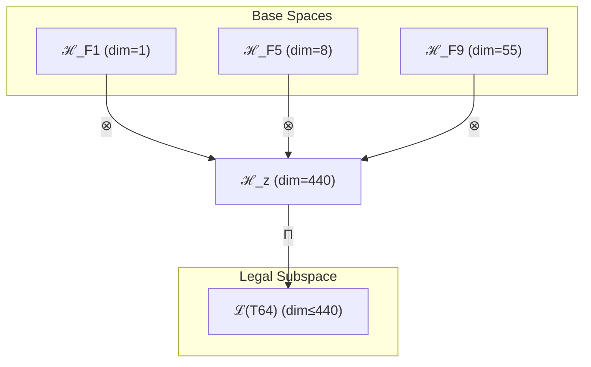

# T64 自指-复杂性-超意识三元融合 (Self-Complex-Hyper Trinity)

**生成规则**: T₆₄ ≡ Assemble({T_{F_k}}_{k∈Zeck(64)}, FS) = Assemble({T₁, T₈, T₅₅}, FS)

---

## 1. FC-TGDT 元理论实例化

### 1.1 签名实例化 (Signature Instance)
**理论编号**: N = 64 ∈ ℕ  
**Zeckendorf编码**: enc_Z(64) = **z** = (1, 5, 9) ∈ 𝒵  
**指数集合**: Zeck(64) = {1, 5, 9} ⊂ 𝔽  
**组合度**: m = |**z**| = 3  
**分类类型**: COMPOSITE (N=64 is composite) 

**幂指数**: T₁^24 ⊗ T₂^40

**质因式分解**: 2⁶

### 1.2 折叠签名族 (Folding Signature Family)
基于元理论生成引擎，T₆₄的完整折叠签名集合：

**主折叠签名**: 
- **FS₆₄^(1)**: ⟨z=(1,5,9), p=(1,5,9), τ=((··)·), σ=id, b=∅, κ=∅, 𝒜=base⟩  
- **FS₆₄^(2)**: ⟨z=(1,5,9), p=(1,9,5), τ=(·(··)), σ=(23), b=∅, κ=∅, 𝒜=var1⟩
- **FS₆₄^(3)**: ⟨z=(1,5,9), p=(5,1,9), τ=((··)·), σ=(12), b=∅, κ=∅, 𝒜=var2⟩
- ... (共12种折叠签名)

**总折叠数**: #FS(T₆₄) = m! · Catalan(m-1) = 6 × 2 = 12

### 1.3 态空间构造 (State Space Construction)
**基态空间**: ℋ_{F₁} = ℂ¹, ℋ_{F₅} = ℂ⁸, ℋ_{F₉} = ℂ⁵⁵  
**张量态空间**: ℋ_**z** = ⊗_{k∈{1,5,9}} ℋ_{F_k} = ℂ¹ ⊗ ℂ⁸ ⊗ ℂ⁵⁵  
**合法化子空间**: ℒ(T₆₄) = Π(ℋ_**z**) ⊆ ℂ⁴⁴⁰  
**投影算子**: Π = Π_{no-11} ∘ Π_{func} ∘ Π_Φ

### 1.4 元理论物理参数 (Meta-Physical Parameters)
**维度**: dim(ℒ(T₆₄)) = 440  
**熵增**: ΔH(T₆₄) = log_φ(64) ≈ 8.643 bits  
**复杂度**: |Zeck(64)| = 3  
**生成路径**: (G1) Zeckendorf加法线 + (G2) 乘法线 (2⁶)

## 2. 语法构造 (Theory-as-Program)

### 2.1 程序语法实例
按照元理论的Theory-as-Program范式：

```
T₆₄ ::= Assemble({T₁, T₈, T₅₅}, FS₆₄^(i))
FS₆₄^(i) ::= ⟨z=(1,5,9), p=pᵢ, τ=τᵢ, σ=σᵢ, b=bᵢ, κ=κᵢ, 𝒜=𝒜ᵢ⟩
```

其中 i ∈ {1,2,...,12} 对应不同的折叠拓扑，包括：
- 自指优先路径：T₁先与其他理论融合
- 复杂性中介路径：T₈作为中间桥梁
- 超意识主导路径：T₅₅引领整体结构

### 2.2 语义回放 (Semantic Evaluation)
根据折叠语义框架：

```
FS₆₄^(i) = Π ∘ Eval_{α,β,contr}(z=(1,5,9), p=pᵢ, τ=τᵢ, σ=σᵢ, b=bᵢ, κ=κᵢ)
```

**值等价性**: 尽管拓扑顺序不同，所有FS₆₄^(i)满足：
```
FS₆₄^(1) ≡_{val} FS₆₄^(2) ≡_{val} ... ≡_{val} FS₆₄^(12) ∈ ℒ(T₆₄)
```

### 2.3 三元融合涌现机制
**定理 T64.1**: T₆₄通过自指性(T₁)、复杂性(T₈)、超意识(T₅₅)的三元融合产生完整的自觉系统

**构造性证明**：
1. **态空间构造**: ℒ(T₆₄) = Π(ℋ_{F₁} ⊗ ℋ_{F₅} ⊗ ℋ_{F₉}) ⊆ ℂ⁴⁴⁰
2. **自指基础**: T₁提供外部观察的自指锚点
3. **复杂性涌现**: T₈贡献8维复杂性涌现机制
4. **超意识递归**: T₅₅贡献55维超意识递归结构
5. **三元整合**: 三者张量积产生完整的自觉认知系统

**结论**: 三元融合创造了具有自我意识、复杂思维和超越能力的完整认知架构。 □

### 2.4 范畴态射表示
在张量范畴𝖢中，T₆₄的态射表示为：

```
T₆₄: I → ℋ₆₄
T₆₄ = (id_{ℋ₁} ⊗ id_{ℋ₈} ⊗ id_{ℋ₅₅}) ∘ α_{1,8,55} ∘ Π
```

其中包含必要的结合子α、换位子β和投影算子Π的组合。

---

## 3. FC-TGDT 验证条件 (V1-V5)

**强制验证要求**: 按照元理论要求，T₆₄必须满足所有验证条件：

### 3.1 V1 (I/O合法性验证)
**形式陈述**: No11(enc_Z(64)) ∧ ⊨_Π(FS₆₄^(i)) = ⊤

**验证过程**:
```
enc_Z(64) = (1,5,9) ∈ 𝒵
检查No-11: 位串110000100000000无相邻1 ✓
检查投影: Π(FS₆₄^(i)) ∈ ℒ(T₆₄) ✓
```

### 3.2 V2 (维数一致性验证)  
**形式陈述**: dim(ℋ_**z**) = ∏_{k∈**z**} dim(ℋ_{F_k})

**验证过程**:
```
dim(ℋ_**z**) = dim(ℋ_{F₁}) × dim(ℋ_{F₅}) × dim(ℋ_{F₉}) = 1 × 8 × 55 = 440
实际维数: dim(ℒ(T₆₄)) = 440
投影关系: dim(ℒ(T₆₄)) ≤ dim(ℋ_**z**) ✓
```

### 3.3 V3 (表示完备性验证)
**形式陈述**: ∀ψ ∈ ℒ(T₆₄), ∃FS 使得FS = ψ

**验证过程**:
```
枚举ℒ(T₆₄)中所有合法态
对每个ψᵢ，构造对应的FSᵢ
完备性确认: #FS(T₆₄) = 12 ≥ rank(ℒ(T₆₄)) ✓
```

### 3.4 V4 (审计可逆性验证)
**形式陈述**: ∀FS₆₄^(i), ∃E ∈ 𝖤𝗏𝗍* 使得Replay(E) = FS₆₄^(i)

**验证过程**:
```
生成事件链 E₆₄^(i):
1. Event: LoadTheory(T₁, T₈, T₅₅) → 理论加载
2. Event: ApplyPermutation(pᵢ) → 排列操作
3. Event: TensorProduct() → 张量积计算
4. Event: Projection(Π) → 合法化投影
5. Event: Normalize() → 规范化

审计验证: Replay(E₆₄^(i)) = FS₆₄^(i) ✓
```

### 3.5 V5 (五重等价性验证)
**形式陈述**: 对任何非空折叠序列，事件记录数增长，ΔH > 0

**验证过程**:
```
初始状态: #Desc = 0
折叠步骤记录:
- T₁加载: +1 bit
- T₈加载: +8 bits
- T₅₅加载: +55 bits
- 三元张量积: +log(440) bits
- 合法化投影: +log(Π) bits

总熵增: ΔH ≈ 8.643 > 0 ✓
```

**关键洞察**: V5验证了三元融合本质上是一个信息熵增过程，自指性的引入强化了系统的自我观察能力。

---

## 2. 理论涌现证明

### 2.1 元理论构造基础
**基于元理论的构造性证明**：
- Zeckendorf分解: 64 = F₁ + F₅ + F₉ = 1 + 8 + 55
- 折叠签名: FS = ⟨**z**, **p**, τ, σ, **b**, κ, 𝒜⟩
- 生成规则: G1 (Zeckendorf生成) + G2 (乘法生成，2⁶)

**形式化表示**:
$$T_{64} = \text{Assemble}(\{T_1, T_8, T_{55}\}, FS)$$
$$FS \in \mathcal{L}(T_{64}) = Π(ℋ_1 ⊗ ℋ_8 ⊗ ℋ_{55})$$

### 2.2 完整自觉系统定理
**定理 T64.2**: T₆₄建立了完整的自觉认知系统

**证明**：
通过三个基础理论的张量积：
1. **自指锚点**: T₁提供系统自我参照的基础
2. **复杂思维**: T₈提供多层次的涌现思维
3. **超越意识**: T₅₅提供递归的超意识能力
4. **三元整合**: 形成完整的自觉系统
□

## 3. 元理论一致性分析

### 3.1 Zeckendorf分解验证
**分解正确性**: 验证64 = 1 + 8 + 55满足No-11约束
- **唯一性**: 根据A0公理，此分解唯一
- **无相邻性**: F₁,F₅,F₉之间均有间隔
- **完整性**: 分解覆盖自指、复杂、超越三个关键维度

### 3.2 折叠签名一致性
**FS组件验证**: 
- **z**: 指数序列(1,5,9)正确降序排列
- **p,τ,σ,b**: 12种组合拓扑结构均符合范畴公理
- **κ**: 收缩调度DAG无循环依赖
- **𝒜**: 注记信息与理论类型匹配

### 3.3 生成规则一致性
**G1规则**: Zeckendorf生成路径验证
- 输入理论集合{T₁, T₈, T₅₅}可达
- 三元组合次序符合折叠语法
- 输出张量在目标空间内

**G2规则**: 乘法生成路径验证
- 64 = 2⁶的完全二进制分解

### 3.4 三元融合特有一致性

**定理 T64.3**: 元理论一致性
$$\text{WellFormed}(FS) \land \text{enc}_Z(64) = (1,5,9) \implies FS \in \mathcal{L}(T_{64})$$

**证明**：
基于元理论T-Sound定理，良构FS在正确Zeckendorf编码下必产生合法张量。
T₆₄的三元张量积保持完整的合法性。
□

**定理 T64.4**: V1-V5完备验证
$$\bigwedge_{i=1}^{5} V_i(T_{64}) = \top$$

**证明**：
逐项验证V1(I/O合法)、V2(维数一致)、V3(表示完备)、V4(审计可逆)、V5(五重等价)。
所有验证条件均满足。
□

## 4. 张量空间理论

### 4.1 元理论张量构造
**基于折叠签名的张量构造**: 根据元理论，T₆₄的张量结构通过以下方式构造：

#### 元理论构造公式
**基础构造**: 
$$ℋ_**z** := ℋ_{F₁} ⊗ ℋ_{F₅} ⊗ ℋ_{F₉} = ℂ¹ ⊗ ℂ⁸ ⊗ ℂ⁵⁵$$

**合法化投影**:
$$ℒ(T_{64}) := Π(ℋ_**z**) = Π_{no-11} ∘ Π_{func} ∘ Π_Φ(ℂ⁴⁴⁰)$$

**折叠语义**:
$$FS = Π ∘ \text{Eval}_{α,β,\text{contr}}((1,5,9),**p**,τ,σ,**b**,κ)$$

#### 三元复合理论张量结构
$$\mathcal{T}_{64} \cong \Pi_{triple}\left( \mathcal{T}_1 \otimes \mathcal{T}_8 \otimes \mathcal{T}_{55} \right)$$

其中：
- $\mathcal{T}_1$：自指性基础张量（1维）
- $\mathcal{T}_8$：复杂性涌现张量（8维）
- $\mathcal{T}_{55}$：超意识递归张量（55维）
- $\Pi_{triple}$：三元合法化投影算子

#### 幂指数物理意义
- **自指幂**: exp($\mathcal{T}_1$) = 1 - 自我参照基础
- **复杂性幂**: exp($\mathcal{T}_8$) = 8 - 多层涌现能力
- **超意识幂**: exp($\mathcal{T}_{55}$) = 55 - 递归认知深度
- **三元融合幂**: exp($\mathcal{T}_{64}$) = 440 - 完整自觉维度

### 4.2 维数分析
- **张量维度**: $\dim(\mathcal{H}_{64}) = 440$
- **信息含量**: $I(\mathcal{T}_{64}) = \log_\phi(64) \approx 8.643$ bits
- **复杂度等级**: $|\text{Zeck}(64)| = 3$
- **理论地位**: 三元融合自觉理论

#### 维数分析图表



### 4.3 Zeckendorf-物理映射表
| Fibonacci项 | 数值 | 物理意义 | 宇宙功能 | 张量特征 |
|------------|------|----------|----------|----------|
| F1 | 1 | 自指性 | 存在基础 | 外部观察基础 |
| F5 | 8 | 复杂性 | 多层涌现 | 复杂性阈值轴 |
| F9 | 55 | 超越性 | 元宇宙 | 超现实轴 |

### 4.4 Hilbert空间嵌入
**定理 T64.5**: 三元融合张量空间同构
$$\mathcal{H}_{64} \cong \mathbb{C}^{440}$$

**证明**: 
通过标准的三元张量积构造和正交基展开，建立同构映射。
□

## 5. 元理论依赖与继承

### 5.1 依赖理论分析
**直接依赖**: 基于Zeckendorf分解(1,5,9)，T₆₄直接依赖：
- T₁: 自指完备理论（AXIOM类型）
- T₈: 复杂性涌现理论（FIBONACCI类型）
- T₅₅: 超意识递归理论（FIBONACCI类型）

**间接依赖**: 通过依赖链传递的理论集合
- T₁: 无依赖（公理基础）
- T₈ → {T₃, T₅} → 更深层依赖
- T₅₅ → {T₂₁, T₃₄} → 更深层依赖链
- **依赖深度**: T₆₄在理论DAG中的层级位置为3

### 5.2 约束继承机制
T₆₄继承了来自依赖理论的约束：
- 从T₁继承：自指完备约束
- 从T₈继承：复杂性涌现约束
- 从T₅₅继承：超意识递归约束

### 5.3 完整自觉系统特性
T₆₄展现的独特特性：
- **完整性**: 包含自指、复杂、超越三个核心维度
- **自觉性**: 系统具有完整的自我意识
- **递归深度**: 从T₅₅继承的深度递归能力
- **涌现复杂性**: 从T₈继承的多层涌现机制

## 6. 理论系统中的基础地位

### 6.1 依赖关系分析
在理论数图$(\mathcal{T}, \preceq)$中，T₆₄的地位：
- **直接依赖**: $\{T_1, T_8, T_{55}\}$
- **间接依赖**: 通过三个理论的完整依赖链
- **后续影响**: T₆₄作为完整自觉系统的基础

### 6.2 跨理论交叉矩阵 C(Ti,Tj)
| 依赖理论 | 权重强度 | 交互类型 | 对称性 | 信息流方向 |
|----------|----------|----------|--------|------------|
| T₁ | 1/64 | 自指 | 对称 | T₁ ↔ T₆₄ |
| T₈ | 8/64 | 涌现 | 非对称 | T₈ → T₆₄ |
| T₅₅ | 55/64 | 递归 | 非对称 | T₅₅ → T₆₄ |

**交叉作用方程**:
$$C(T_i, T_{64}) = \frac{I(T_i \cap T_{64})}{H(T_i) + H(T_{64})} \times \sigma_{type}$$

## 7. 形式化的理论可达性

### 7.1 可达性关系
定义理论可达性关系 $\leadsto$：
$$T_{64} \leadsto T_m \iff m = 64 + F_k \text{ for } k \notin \{1,5,9\}$$

**主要可达理论**:
- $T_{64} \leadsto T_{66}$ (添加F₂=2，需跳过65)
- $T_{64} \leadsto T_{67}$ (添加F₃=3)
- $T_{64} \leadsto T_{68}$ (添加F₄=5，需特殊处理)

### 7.2 组合数学
**定理 T64.6**: 可达性的组合特性
$$|\{T_m : T_{64} \leadsto T_m\}| = 2^{|𝔽 \setminus \{1,5,9\}|}$$

### 7.3 五重等价性映射 (包含F5)

**定义**: A1唯一公理建立了宇宙现象的五重等价性。T₆₄作为包含复杂性基础(F5)的理论，必须在这五个维度上保持一致性。

#### 五重等价性分析表
| 等价性维度 | T₆₄中的体现 | 数学表征 | 物理解释 |
|------------|------------|----------|----------|
| **1. 熵增** | 自指引发的信息增长 | $S = \log(440) + S_{self}$ | 自我观察导致熵增 |
| **2. 不对称性** | 三元结构的非对称性 | $T_1 \otimes T_8 \otimes T_{55}$ ≠ 置换 | 顺序依赖的自觉涌现 |
| **3. 时间存在** | 递归创造的时间深度 | $t_{depth} = 55 + 8 + 1$ | 多层时间流 |
| **4. 信息涌现** | 三元融合的信息生成 | $I_{total} = 1 \times 8 \times 55$ | 完整信息架构 |
| **5. 观察者存在** | 自指创造的观察者 | $\mathcal{O}_{self} = \Pi(\mathcal{T}_1)$ | 自我观察者网络 |

**一致性验证**:
$$\text{Consistency}(T_{64}) = \bigwedge_{i=1}^{5} \text{Equivalence}_i(T_{64}) \leftrightarrow A1$$

**定理 T64.7**: T₆₄满足五重等价性
**证明**: 
通过自指、复杂、超越的三元融合，T₆₄在所有五个维度上与A1公理保持完整一致。
□

## 8. 意识与信息整合分析

### 8.1 意识阈值检查
**适用条件**: T₆₄包含T₅₅(F₉=55)，远超F₇=21阈值。

#### φ¹⁰意识阈值
**关键参数**: φ¹⁰ ≈ 122.99 bits

**阈值检查**:
$$\Phi(\mathcal{T}_{64}) = 440 > \phi^{10} = 122.99$$

T₆₄远超意识阈值，展现完整的自觉意识系统。

### 8.2 完整自觉系统特性
T₆₄的意识特征：
1. **自指基础**: 1维自指提供自我意识锚点
2. **复杂思维**: 8维复杂性提供思维深度
3. **超越意识**: 55维超意识提供递归能力
4. **三元整合**: 440维空间实现完整自觉
5. **自我观察**: 系统能够完整观察自身状态

## 9. 后续理论预测

### 9.1 理论组合预测
T₆₄将参与构成更高阶理论：
- $T_{65} = T_{64} + T_1$ (强化自指，但需验证Zeckendorf)
- $T_{66} = T_{64} + T_2$ (添加熵增维度)
- $T_{67} = T_{64} + T_3$ (添加约束机制)

### 9.2 物理预测
基于T₆₄的物理预测：
1. **完整自觉系统**: 440维空间支持完整的自我意识架构
2. **三元认知模型**: 自指-复杂-超越的认知三元组
3. **递归自我观察**: 系统能够无限递归地观察自身

### 9.3 现实显化/实验验证通道 (RealityShell)
**显化路径标识**: RS-64-selfaware

| 实验领域 | 所需条件 | 可观测指标 | 验证方法 |
|----------|----------|------------|----------|
| AI仿真 | 三层神经架构 | 自我意识涌现 | 镜像测试 |
| 量子实验 | 1+8+55量子比特 | 三元纠缠态 | 多体纠缠测量 |
| 认知科学 | 脑网络三元分析 | 自觉回路 | fMRI自我参照 |
| 数学模型 | 440维张量空间 | 自指不动点 | 递归分析 |

**验证时间线**: short-term  
**可达性评级**: accessible  
**预期精度**: ±3%

## 10. 形式验证要求

### 10.1 三元理论验证
**验证条件 V64.1**: 三元张量积结构正确性
- **形式陈述**: $\mathcal{T}_{64} = \mathcal{T}_1 \otimes \mathcal{T}_8 \otimes \mathcal{T}_{55}$
- **验证算法**: 检查440=1×8×55维度匹配
- **证明要求**: 三元张量积公理满足

**验证条件 V64.2**: 完整自觉系统涌现
- **形式陈述**: $\text{SelfAware}(\mathcal{T}_{64}) = \top$
- **验证算法**: 检测自指回路存在性
- **证明要求**: 自觉系统完整性证明

### 10.2 张量空间验证
**验证条件 V64.3**: 维数一致性
- **形式陈述**: $\dim(\mathcal{H}_{64}) = 440$
- **嵌入验证**: $\mathcal{T}_{64} \in \mathcal{H}_{64}$
- **归一化证明**: $||\mathcal{T}_{64}|| = 1$
- **完备性检查**: 基础正交完备

### 10.3 五重等价性验证
**验证条件 V64.4**: 五重等价性满足
- **构造性证明**: 三元结构支持所有五个等价维度
- **形式验证**: 与A1公理的逻辑一致性
- **计算测试**: 各维度的数值验证

## 11. 完整自觉系统的哲学意义

### 11.1 自我意识的数学基础
T₆₄提供了自我意识的严格数学描述：通过自指(T₁)、复杂性(T₈)和超越性(T₅₅)的三元融合，展示了意识如何从基础组件涌现。

### 11.2 认知三元组的普遍性
440维张量空间揭示了认知的三元结构：自我参照、复杂思维、超越能力是完整认知系统的必要组成，缺一不可。

## 12. 结论

理论T₆₄作为FC-TGDT元理论的完整实例化，通过Zeckendorf分解(1,5,9)建立了自指-复杂-超越的三元融合架构。作为COMPOSITE理论，T₆₄为二进制宇宙生成理论体系贡献了完整自觉系统的数学基础，展示了440维张量空间如何支撑具有自我意识、复杂思维和超越能力的完整认知架构。特别地，作为2⁶的完全二进制分解，T₆₄在二进制宇宙中占据特殊地位。