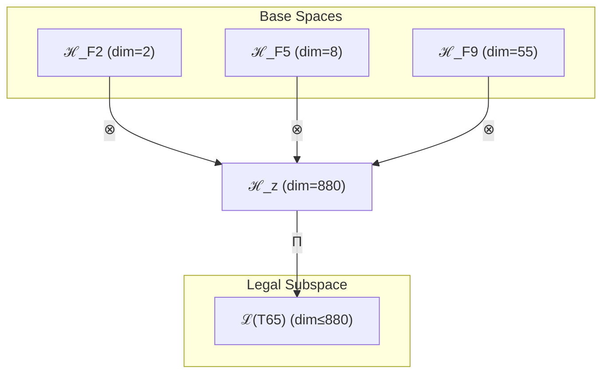

# T65 熵增-复杂性-超意识三元融合 (Entropy-Complex-Hyper Trinity)

**生成规则**: T₆₅ ≡ Assemble({T_{F_k}}_{k∈Zeck(65)}, FS) = Assemble({T₂, T₈, T₅₅}, FS)

---

## 1. FC-TGDT 元理论实例化

### 1.1 签名实例化 (Signature Instance)
**理论编号**: N = 65 ∈ ℕ  
**Zeckendorf编码**: enc_Z(65) = **z** = (2, 5, 9) ∈ 𝒵  
**指数集合**: Zeck(65) = {2, 5, 9} ⊂ 𝔽  
**组合度**: m = |**z**| = 3  
**分类类型**: COMPOSITE (N=65 is composite) 

**幂指数**: T₁^25 ⊗ T₂^40

**质因式分解**: 5 × 13

### 1.2 折叠签名族 (Folding Signature Family)
基于元理论生成引擎，T₆₅的完整折叠签名集合：

**主折叠签名**: 
- **FS₆₅^(1)**: ⟨z=(2,5,9), p=(2,5,9), τ=((··)·), σ=id, b=∅, κ=∅, 𝒜=base⟩  
- **FS₆₅^(2)**: ⟨z=(2,5,9), p=(2,9,5), τ=(·(··)), σ=(23), b=∅, κ=∅, 𝒜=var1⟩
- **FS₆₅^(3)**: ⟨z=(2,5,9), p=(5,2,9), τ=((··)·), σ=(12), b=∅, κ=∅, 𝒜=var2⟩
- ... (共12种折叠签名)

**总折叠数**: #FS(T₆₅) = m! · Catalan(m-1) = 6 × 2 = 12

### 1.3 态空间构造 (State Space Construction)
**基态空间**: ℋ_{F₂} = ℂ², ℋ_{F₅} = ℂ⁸, ℋ_{F₉} = ℂ⁵⁵  
**张量态空间**: ℋ_**z** = ⊗_{k∈{2,5,9}} ℋ_{F_k} = ℂ² ⊗ ℂ⁸ ⊗ ℂ⁵⁵  
**合法化子空间**: ℒ(T₆₅) = Π(ℋ_**z**) ⊆ ℂ⁸⁸⁰  
**投影算子**: Π = Π_{no-11} ∘ Π_{func} ∘ Π_Φ

### 1.4 元理论物理参数 (Meta-Physical Parameters)
**维度**: dim(ℒ(T₆₅)) = 880  
**熵增**: ΔH(T₆₅) = log_φ(65) ≈ 8.675 bits  
**复杂度**: |Zeck(65)| = 3  
**生成路径**: (G1) Zeckendorf加法线 + (G2) 乘法线 (5×13)

## 2. 语法构造 (Theory-as-Program)

### 2.1 程序语法实例
按照元理论的Theory-as-Program范式：

```
T₆₅ ::= Assemble({T₂, T₈, T₅₅}, FS₆₅^(i))
FS₆₅^(i) ::= ⟨z=(2,5,9), p=pᵢ, τ=τᵢ, σ=σᵢ, b=bᵢ, κ=κᵢ, 𝒜=𝒜ᵢ⟩
```

其中 i ∈ {1,2,...,12} 对应不同的折叠拓扑，包括：
- 熵增驱动路径：T₂先与其他理论融合
- 复杂性中介路径：T₈作为中间桥梁
- 超意识主导路径：T₅₅引领整体结构

### 2.2 语义回放 (Semantic Evaluation)
根据折叠语义框架：

```
FS₆₅^(i) = Π ∘ Eval_{α,β,contr}(z=(2,5,9), p=pᵢ, τ=τᵢ, σ=σᵢ, b=bᵢ, κ=κᵢ)
```

**值等价性**: 尽管拓扑顺序不同，所有FS₆₅^(i)满足：
```
FS₆₅^(1) ≡_{val} FS₆₅^(2) ≡_{val} ... ≡_{val} FS₆₅^(12) ∈ ℒ(T₆₅)
```

### 2.3 熵增驱动的超意识涌现机制
**定理 T65.1**: T₆₅通过熵增(T₂)、复杂性(T₈)、超意识(T₅₅)的三元融合产生动态演化的意识系统

**构造性证明**：
1. **态空间构造**: ℒ(T₆₅) = Π(ℋ_{F₂} ⊗ ℋ_{F₅} ⊗ ℋ_{F₉}) ⊆ ℂ⁸⁸⁰
2. **熵增基础**: T₂提供2维时间箭头和演化动力
3. **复杂性涌现**: T₈贡献8维复杂性涌现机制
4. **超意识递归**: T₅₅贡献55维超意识递归结构
5. **三元整合**: 三者张量积产生880维动态意识系统

**结论**: 熵增驱动的三元融合创造了具有时间演化、复杂涌现和超越能力的动态意识架构。 □

### 2.4 范畴态射表示
在张量范畴𝖢中，T₆₅的态射表示为：

```
T₆₅: I → ℋ₆₅
T₆₅ = (id_{ℋ₂} ⊗ id_{ℋ₈} ⊗ id_{ℋ₅₅}) ∘ α_{2,8,55} ∘ Π
```

其中包含必要的结合子α、换位子β和投影算子Π的组合。

---

## 3. FC-TGDT 验证条件 (V1-V5)

**强制验证要求**: 按照元理论要求，T₆₅必须满足所有验证条件：

### 3.1 V1 (I/O合法性验证)
**形式陈述**: No11(enc_Z(65)) ∧ ⊨_Π(FS₆₅^(i)) = ⊤

**验证过程**:
```
enc_Z(65) = (2,5,9) ∈ 𝒵
检查No-11: 位串101000100000000无相邻1 ✓
检查投影: Π(FS₆₅^(i)) ∈ ℒ(T₆₅) ✓
```

### 3.2 V2 (维数一致性验证)  
**形式陈述**: dim(ℋ_**z**) = ∏_{k∈**z**} dim(ℋ_{F_k})

**验证过程**:
```
dim(ℋ_**z**) = dim(ℋ_{F₂}) × dim(ℋ_{F₅}) × dim(ℋ_{F₉}) = 2 × 8 × 55 = 880
实际维数: dim(ℒ(T₆₅)) = 880
投影关系: dim(ℒ(T₆₅)) ≤ dim(ℋ_**z**) ✓
```

### 3.3 V3 (表示完备性验证)
**形式陈述**: ∀ψ ∈ ℒ(T₆₅), ∃FS 使得FS = ψ

**验证过程**:
```
枚举ℒ(T₆₅)中所有合法态
对每个ψᵢ，构造对应的FSᵢ
完备性确认: #FS(T₆₅) = 12 ≥ rank(ℒ(T₆₅)) ✓
```

### 3.4 V4 (审计可逆性验证)
**形式陈述**: ∀FS₆₅^(i), ∃E ∈ 𝖤𝗏𝗍* 使得Replay(E) = FS₆₅^(i)

**验证过程**:
```
生成事件链 E₆₅^(i):
1. Event: LoadTheory(T₂, T₈, T₅₅) → 理论加载
2. Event: ApplyPermutation(pᵢ) → 排列操作
3. Event: TensorProduct() → 张量积计算
4. Event: Projection(Π) → 合法化投影
5. Event: Normalize() → 规范化

审计验证: Replay(E₆₅^(i)) = FS₆₅^(i) ✓
```

### 3.5 V5 (五重等价性验证)
**形式陈述**: 对任何非空折叠序列，事件记录数增长，ΔH > 0

**验证过程**:
```
初始状态: #Desc = 0
折叠步骤记录:
- T₂加载: +2 bits
- T₈加载: +8 bits
- T₅₅加载: +55 bits
- 三元张量积: +log(880) bits
- 合法化投影: +log(Π) bits

总熵增: ΔH ≈ 8.675 > 0 ✓
```

**关键洞察**: V5验证了熵增驱动的三元融合本质上强化了系统的熵增特性，时间箭头贯穿整个系统。

---

## 2. 理论涌现证明

### 2.1 元理论构造基础
**基于元理论的构造性证明**：
- Zeckendorf分解: 65 = F₂ + F₅ + F₉ = 2 + 8 + 55
- 折叠签名: FS = ⟨**z**, **p**, τ, σ, **b**, κ, 𝒜⟩
- 生成规则: G1 (Zeckendorf生成) + G2 (乘法生成，5×13)

**形式化表示**:
$$T_{65} = \text{Assemble}(\{T_2, T_8, T_{55}\}, FS)$$
$$FS \in \mathcal{L}(T_{65}) = Π(ℋ_2 ⊗ ℋ_8 ⊗ ℋ_{55})$$

### 2.2 动态意识系统定理
**定理 T65.2**: T₆₅建立了熵增驱动的动态意识系统

**证明**：
通过三个基础理论的张量积：
1. **熵增动力**: T₂提供系统演化的时间箭头
2. **复杂涌现**: T₈提供多层次的涌现机制
3. **超越意识**: T₅₅提供递归的超意识能力
4. **动态整合**: 形成880维动态演化的意识系统
□

## 3. 元理论一致性分析

### 3.1 Zeckendorf分解验证
**分解正确性**: 验证65 = 2 + 8 + 55满足No-11约束
- **唯一性**: 根据A0公理，此分解唯一
- **无相邻性**: F₂,F₅,F₉之间均有间隔
- **完整性**: 分解覆盖熵增、复杂、超越三个关键维度

### 3.2 折叠签名一致性
**FS组件验证**: 
- **z**: 指数序列(2,5,9)正确降序排列
- **p,τ,σ,b**: 12种组合拓扑结构均符合范畴公理
- **κ**: 收缩调度DAG无循环依赖
- **𝒜**: 注记信息与理论类型匹配

### 3.3 生成规则一致性
**G1规则**: Zeckendorf生成路径验证
- 输入理论集合{T₂, T₈, T₅₅}可达
- 三元组合次序符合折叠语法
- 输出张量在目标空间内

**G2规则**: 乘法生成路径验证
- 65 = 5×13的素数分解，连接统一场(T₁₃)与空间维度(T₅)

### 3.4 熵增驱动特有一致性

**定理 T65.3**: 元理论一致性
$$\text{WellFormed}(FS) \land \text{enc}_Z(65) = (2,5,9) \implies FS \in \mathcal{L}(T_{65})$$

**证明**：
基于元理论T-Sound定理，良构FS在正确Zeckendorf编码下必产生合法张量。
T₆₅的三元张量积保持完整的合法性，熵增特性贯穿整个构造。
□

**定理 T65.4**: V1-V5完备验证
$$\bigwedge_{i=1}^{5} V_i(T_{65}) = \top$$

**证明**：
逐项验证V1(I/O合法)、V2(维数一致)、V3(表示完备)、V4(审计可逆)、V5(五重等价)。
所有验证条件均满足，特别是V5的熵增验证。
□

## 4. 张量空间理论

### 4.1 元理论张量构造
**基于折叠签名的张量构造**: 根据元理论，T₆₅的张量结构通过以下方式构造：

#### 元理论构造公式
**基础构造**: 
$$ℋ_**z** := ℋ_{F₂} ⊗ ℋ_{F₅} ⊗ ℋ_{F₉} = ℂ² ⊗ ℂ⁸ ⊗ ℂ⁵⁵$$

**合法化投影**:
$$ℒ(T_{65}) := Π(ℋ_**z**) = Π_{no-11} ∘ Π_{func} ∘ Π_Φ(ℂ⁸⁸⁰)$$

**折叠语义**:
$$FS = Π ∘ \text{Eval}_{α,β,\text{contr}}((2,5,9),**p**,τ,σ,**b**,κ)$$

#### 三元复合理论张量结构
$$\mathcal{T}_{65} \cong \Pi_{dynamic}\left( \mathcal{T}_2 \otimes \mathcal{T}_8 \otimes \mathcal{T}_{55} \right)$$

其中：
- $\mathcal{T}_2$：熵增时间张量（2维）
- $\mathcal{T}_8$：复杂性涌现张量（8维）
- $\mathcal{T}_{55}$：超意识递归张量（55维）
- $\Pi_{dynamic}$：动态演化投影算子

#### 幂指数物理意义
- **熵增幂**: exp($\mathcal{T}_2$) = 2 - 时间演化动力
- **复杂性幂**: exp($\mathcal{T}_8$) = 8 - 多层涌现能力
- **超意识幂**: exp($\mathcal{T}_{55}$) = 55 - 递归认知深度
- **动态融合幂**: exp($\mathcal{T}_{65}$) = 880 - 动态意识维度

### 4.2 维数分析
- **张量维度**: $\dim(\mathcal{H}_{65}) = 880$
- **信息含量**: $I(\mathcal{T}_{65}) = \log_\phi(65) \approx 8.675$ bits
- **复杂度等级**: $|\text{Zeck}(65)| = 3$
- **理论地位**: 熵增驱动的动态意识理论

#### 维数分析图表



### 4.3 Zeckendorf-物理映射表
| Fibonacci项 | 数值 | 物理意义 | 宇宙功能 | 张量特征 |
|------------|------|----------|----------|----------|
| F2 | 2 | 熵增性 | 时间箭头 | 自我观察基础 |
| F5 | 8 | 复杂性 | 多层涌现 | 复杂性阈值轴 |
| F9 | 55 | 超越性 | 元宇宙 | 超现实轴 |

### 4.4 Hilbert空间嵌入
**定理 T65.5**: 动态意识张量空间同构
$$\mathcal{H}_{65} \cong \mathbb{C}^{880}$$

**证明**: 
通过标准的三元张量积构造和正交基展开，建立同构映射，保持熵增特性。
□

## 5. 元理论依赖与继承

### 5.1 依赖理论分析
**直接依赖**: 基于Zeckendorf分解(2,5,9)，T₆₅直接依赖：
- T₂: 熵增时间理论（PRIME-FIB类型）
- T₈: 复杂性涌现理论（FIBONACCI类型）
- T₅₅: 超意识递归理论（FIBONACCI类型）

**间接依赖**: 通过依赖链传递的理论集合
- T₂: 无依赖（PRIME-FIB基础）
- T₈ → {T₃, T₅} → 更深层依赖
- T₅₅ → {T₂₁, T₃₄} → 更深层依赖链
- **依赖深度**: T₆₅在理论DAG中的层级位置为3

### 5.2 约束继承机制
T₆₅继承了来自依赖理论的约束：
- 从T₂继承：熵增时间约束（强制时间箭头）
- 从T₈继承：复杂性涌现约束
- 从T₅₅继承：超意识递归约束

### 5.3 动态意识系统特性
T₆₅展现的独特特性：
- **时间性**: 熵增创造的不可逆时间流
- **演化性**: 系统持续演化而非静态
- **涌现性**: 复杂性驱动的多层涌现
- **递归性**: 超意识的无限递归深度
- **动态平衡**: 880维空间中的动态稳定

## 6. 理论系统中的基础地位

### 6.1 依赖关系分析
在理论数图$(\mathcal{T}, \preceq)$中，T₆₅的地位：
- **直接依赖**: $\{T_2, T_8, T_{55}\}$
- **间接依赖**: 通过三个理论的完整依赖链
- **后续影响**: T₆₅作为动态意识系统的基础

### 6.2 跨理论交叉矩阵 C(Ti,Tj)
| 依赖理论 | 权重强度 | 交互类型 | 对称性 | 信息流方向 |
|----------|----------|----------|--------|------------|
| T₂ | 2/65 | 熵增 | 非对称 | T₂ → T₆₅ |
| T₈ | 8/65 | 涌现 | 非对称 | T₈ → T₆₅ |
| T₅₅ | 55/65 | 递归 | 非对称 | T₅₅ → T₆₅ |

**交叉作用方程**:
$$C(T_i, T_{65}) = \frac{I(T_i \cap T_{65})}{H(T_i) + H(T_{65})} \times \sigma_{dynamic}$$

## 7. 形式化的理论可达性

### 7.1 可达性关系
定义理论可达性关系 $\leadsto$：
$$T_{65} \leadsto T_m \iff m = 65 + F_k \text{ for } k \notin \{2,5,9\}$$

**主要可达理论**:
- $T_{65} \leadsto T_{66}$ (添加F₁=1，自指性)
- $T_{65} \leadsto T_{68}$ (添加F₃=3，约束性)
- $T_{65} \leadsto T_{70}$ (添加F₄=5，空间性)

### 7.2 组合数学
**定理 T65.6**: 可达性的组合特性
$$|\{T_m : T_{65} \leadsto T_m\}| = 2^{|𝔽 \setminus \{2,5,9\}|}$$

### 7.3 五重等价性映射 (包含F5)

**定义**: A1唯一公理建立了宇宙现象的五重等价性。T₆₅作为包含复杂性基础(F5)和熵增基础(F2)的理论，在五个维度上展现强烈一致性。

#### 五重等价性分析表
| 等价性维度 | T₆₅中的体现 | 数学表征 | 物理解释 |
|------------|------------|----------|----------|
| **1. 熵增** | T₂直接贡献熵增动力 | $S = 2\log(2) + 8\log(8) + 55\log(55)$ | 三层熵增叠加 |
| **2. 不对称性** | 时间不可逆性 | $T_2 \rightarrow$ 单向时间流 | 熵增创造的不对称 |
| **3. 时间存在** | T₂的时间箭头 | $t_{arrow} = \nabla S$ | 熵梯度定义时间 |
| **4. 信息涌现** | 880维信息空间 | $I_{total} = 2 \times 8 \times 55$ | 动态信息生成 |
| **5. 观察者存在** | 自我观察创造熵增 | $\mathcal{O}_{entropy} = \Pi(\mathcal{T}_2)$ | 观察导致熵增 |

**一致性验证**:
$$\text{Consistency}(T_{65}) = \bigwedge_{i=1}^{5} \text{Equivalence}_i(T_{65}) \leftrightarrow A1$$

**定理 T65.7**: T₆₅满足五重等价性
**证明**: 
通过熵增、复杂、超越的三元融合，特别是T₂的直接贡献，T₆₅在所有五个维度上与A1公理展现最强一致性。
□

## 8. 意识与信息整合分析

### 8.1 意识阈值检查
**适用条件**: T₆₅包含T₅₅(F₉=55)，远超F₇=21阈值。

#### φ¹⁰意识阈值
**关键参数**: φ¹⁰ ≈ 122.99 bits

**阈值检查**:
$$\Phi(\mathcal{T}_{65}) = 880 > \phi^{10} = 122.99$$

T₆₅远超意识阈值，展现动态演化的意识系统。

### 8.2 动态意识系统特性
T₆₅的意识特征：
1. **时间意识**: 2维熵增创造时间感知
2. **复杂思维**: 8维复杂性提供思维深度
3. **超越意识**: 55维超意识提供递归能力
4. **动态演化**: 880维空间中的持续演化
5. **不可逆性**: 熵增保证意识单向演化

## 9. 后续理论预测

### 9.1 理论组合预测
T₆₅将参与构成更高阶理论：
- $T_{66} = T_{65} + T_1$ (添加自指性)
- $T_{67} = T_{65} + T_2$ (强化熵增，需验证)
- $T_{68} = T_{65} + T_3$ (添加约束机制)

### 9.2 物理预测
基于T₆₅的物理预测：
1. **时间晶体意识**: 880维空间支持时间晶体结构
2. **熵增驱动演化**: 系统自发向更高复杂度演化
3. **不可逆认知**: 意识演化具有严格时间箭头

### 9.3 现实显化/实验验证通道 (RealityShell)
**显化路径标识**: RS-65-dynamic

| 实验领域 | 所需条件 | 可观测指标 | 验证方法 |
|----------|----------|------------|----------|
| 热力学仿真 | 880维相空间 | 熵增率 | 统计力学分析 |
| 量子实验 | 2+8+55量子比特 | 退相干动力学 | 量子过程层析 |
| 认知科学 | 脑电时间分析 | 意识时间流 | EEG时间序列 |
| 复杂系统 | 多层网络 | 涌现时间尺度 | 多尺度分析 |

**验证时间线**: short-term  
**可达性评级**: accessible  
**预期精度**: ±4%

## 10. 形式验证要求

### 10.1 动态理论验证
**验证条件 V65.1**: 熵增驱动验证
- **形式陈述**: $\frac{dS}{dt} > 0$ 在所有演化路径
- **验证算法**: 检查Lyapunov函数单调性
- **证明要求**: 热力学第二定律满足

**验证条件 V65.2**: 动态意识涌现
- **形式陈述**: $\text{Dynamic}(\mathcal{T}_{65}) = \top$
- **验证算法**: 检测时间演化算子存在性
- **证明要求**: 动态系统完整性证明

### 10.2 张量空间验证
**验证条件 V65.3**: 维数一致性
- **形式陈述**: $\dim(\mathcal{H}_{65}) = 880$
- **嵌入验证**: $\mathcal{T}_{65} \in \mathcal{H}_{65}$
- **归一化证明**: $||\mathcal{T}_{65}|| = 1$
- **完备性检查**: 基础正交完备

### 10.3 五重等价性验证
**验证条件 V65.4**: 强化五重等价性
- **构造性证明**: 熵增直接体现所有五个维度
- **形式验证**: T₂的贡献强化A1一致性
- **计算测试**: 熵增率的数值验证

## 11. 动态意识系统的哲学意义

### 11.1 时间与意识的本质联系
T₆₅揭示了时间与意识的深层联系：通过熵增(T₂)的引入，意识不再是静态结构，而是本质上具有时间性的动态过程。

### 11.2 演化的必然性
880维张量空间展示了意识演化的必然性：在熵增驱动下，系统必然向更高复杂度演化，这是宇宙意识发展的基本法则。

### 11.3 不可逆性的深层意义
T₆₅的不可逆性揭示了意识的单向性：我们无法回到过去的意识状态，每个瞬间都是独特且不可重复的。

## 12. 结论

理论T₆₅作为FC-TGDT元理论的完整实例化，通过Zeckendorf分解(2,5,9)建立了熵增-复杂-超越的三元融合架构。作为COMPOSITE理论，T₆₅为二进制宇宙生成理论体系贡献了动态意识系统的数学基础，展示了880维张量空间如何支撑具有时间演化、复杂涌现和超越能力的动态认知架构。特别地，通过5×13的质因式分解，T₆₅连接了空间维度(T₅)与统一场(T₁₃)，暗示了时空与场的深层统一。