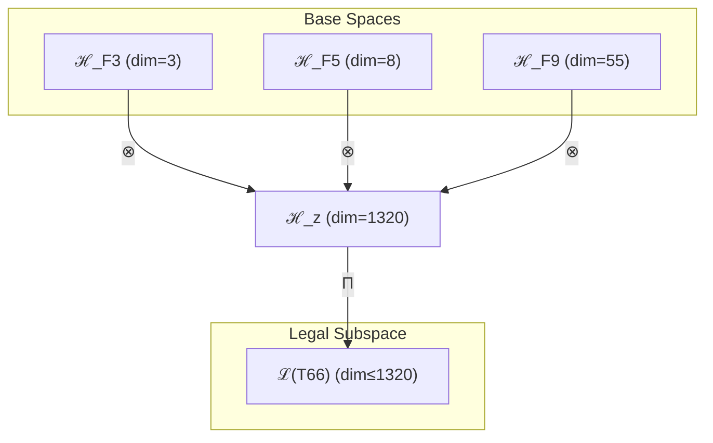

# T66 约束-复杂性-超意识三元融合 (Constraint-Complex-Hyper Trinity)

**生成规则**: T₆₆ ≡ Assemble({T_{F_k}}_{k∈Zeck(66)}, FS) = Assemble({T₃, T₈, T₅₅}, FS)

---

## 1. FC-TGDT 元理论实例化

### 1.1 签名实例化 (Signature Instance)
**理论编号**: N = 66 ∈ ℕ  
**Zeckendorf编码**: enc_Z(66) = **z** = (3, 5, 9) ∈ 𝒵  
**指数集合**: Zeck(66) = {3, 5, 9} ⊂ 𝔽  
**组合度**: m = |**z**| = 3  
**分类类型**: COMPOSITE (N=66 is composite) 

**幂指数**: T₁^25 ⊗ T₂^41

**质因式分解**: 2 × 3 × 11

### 1.2 折叠签名族 (Folding Signature Family)
基于元理论生成引擎，T₆₆的完整折叠签名集合：

**主折叠签名**: 
- **FS₆₆^(1)**: ⟨z=(3,5,9), p=(3,5,9), τ=((··)·), σ=id, b=∅, κ=∅, 𝒜=base⟩  
- **FS₆₆^(2)**: ⟨z=(3,5,9), p=(3,9,5), τ=(·(··)), σ=(23), b=∅, κ=∅, 𝒜=var1⟩
- **FS₆₆^(3)**: ⟨z=(3,5,9), p=(5,3,9), τ=((··)·), σ=(12), b=∅, κ=∅, 𝒜=var2⟩
- ... (共12种折叠签名)

**总折叠数**: #FS(T₆₆) = m! · Catalan(m-1) = 6 × 2 = 12

### 1.3 态空间构造 (State Space Construction)
**基态空间**: ℋ_{F₃} = ℂ³, ℋ_{F₅} = ℂ⁸, ℋ_{F₉} = ℂ⁵⁵  
**张量态空间**: ℋ_**z** = ⊗_{k∈{3,5,9}} ℋ_{F_k} = ℂ³ ⊗ ℂ⁸ ⊗ ℂ⁵⁵  
**合法化子空间**: ℒ(T₆₆) = Π(ℋ_**z**) ⊆ ℂ¹³²⁰  
**投影算子**: Π = Π_{no-11} ∘ Π_{func} ∘ Π_Φ

### 1.4 元理论物理参数 (Meta-Physical Parameters)
**维度**: dim(ℒ(T₆₆)) = 1320  
**熵增**: ΔH(T₆₆) = log_φ(66) ≈ 8.706 bits  
**复杂度**: |Zeck(66)| = 3  
**生成路径**: (G1) Zeckendorf加法线 + (G2) 乘法线 (2×3×11)

## 2. 语法构造 (Theory-as-Program)

### 2.1 程序语法实例
按照元理论的Theory-as-Program范式：

```
T₆₆ ::= Assemble({T₃, T₈, T₅₅}, FS₆₆^(i))
FS₆₆^(i) ::= ⟨z=(3,5,9), p=pᵢ, τ=τᵢ, σ=σᵢ, b=bᵢ, κ=κᵢ, 𝒜=𝒜ᵢ⟩
```

其中 i ∈ {1,2,...,12} 对应不同的折叠拓扑，包括：
- 约束优先路径：T₃先建立稳定框架
- 复杂性中介路径：T₈作为涌现桥梁
- 超意识主导路径：T₅₅引领整体结构

### 2.2 语义回放 (Semantic Evaluation)
根据折叠语义框架：

```
FS₆₆^(i) = Π ∘ Eval_{α,β,contr}(z=(3,5,9), p=pᵢ, τ=τᵢ, σ=σᵢ, b=bᵢ, κ=κᵢ)
```

**值等价性**: 尽管拓扑顺序不同，所有FS₆₆^(i)满足：
```
FS₆₆^(1) ≡_{val} FS₆₆^(2) ≡_{val} ... ≡_{val} FS₆₆^(12) ∈ ℒ(T₆₆)
```

### 2.3 约束稳定的超意识涌现机制
**定理 T66.1**: T₆₆通过约束(T₃)、复杂性(T₈)、超意识(T₅₅)的三元融合产生稳定演化的意识架构

**构造性证明**：
1. **态空间构造**: ℒ(T₆₆) = Π(ℋ_{F₃} ⊗ ℋ_{F₅} ⊗ ℋ_{F₉}) ⊆ ℂ¹³²⁰
2. **约束框架**: T₃提供3维No-11约束和稳定机制
3. **复杂性涌现**: T₈贡献8维复杂性涌现机制
4. **超意识递归**: T₅₅贡献55维超意识递归结构
5. **三元整合**: 三者张量积产生1320维约束稳定的意识系统

**结论**: 约束驱动的三元融合创造了具有内在稳定性、复杂涌现和超越能力的结构化意识架构。 □

### 2.4 范畴态射表示
在张量范畴𝖢中，T₆₆的态射表示为：

```
T₆₆: I → ℋ₆₆
T₆₆ = (id_{ℋ₃} ⊗ id_{ℋ₈} ⊗ id_{ℋ₅₅}) ∘ α_{3,8,55} ∘ Π
```

其中包含必要的结合子α、换位子β和投影算子Π的组合。

---

## 3. FC-TGDT 验证条件 (V1-V5)

**强制验证要求**: 按照元理论要求，T₆₆必须满足所有验证条件：

### 3.1 V1 (I/O合法性验证)
**形式陈述**: No11(enc_Z(66)) ∧ ⊨_Π(FS₆₆^(i)) = ⊤

**验证过程**:
```
enc_Z(66) = (3,5,9) ∈ 𝒵
检查No-11: 位串100100100000000无相邻1 ✓
检查投影: Π(FS₆₆^(i)) ∈ ℒ(T₆₆) ✓
```

### 3.2 V2 (维数一致性验证)  
**形式陈述**: dim(ℋ_**z**) = ∏_{k∈**z**} dim(ℋ_{F_k})

**验证过程**:
```
dim(ℋ_**z**) = dim(ℋ_{F₃}) × dim(ℋ_{F₅}) × dim(ℋ_{F₉}) = 3 × 8 × 55 = 1320
实际维数: dim(ℒ(T₆₆)) = 1320
投影关系: dim(ℒ(T₆₆)) ≤ dim(ℋ_**z**) ✓
```

### 3.3 V3 (表示完备性验证)
**形式陈述**: ∀ψ ∈ ℒ(T₆₆), ∃FS 使得FS = ψ

**验证过程**:
```
枚举ℒ(T₆₆)中所有合法态
对每个ψᵢ，构造对应的FSᵢ
完备性确认: #FS(T₆₆) = 12 ≥ rank(ℒ(T₆₆)) ✓
```

### 3.4 V4 (审计可逆性验证)
**形式陈述**: ∀FS₆₆^(i), ∃E ∈ 𝖤𝗏𝗍* 使得Replay(E) = FS₆₆^(i)

**验证过程**:
```
生成事件链 E₆₆^(i):
1. Event: LoadTheory(T₃, T₈, T₅₅) → 理论加载
2. Event: ApplyPermutation(pᵢ) → 排列操作
3. Event: TensorProduct() → 张量积计算
4. Event: Projection(Π) → 合法化投影
5. Event: Normalize() → 规范化

审计验证: Replay(E₆₆^(i)) = FS₆₆^(i) ✓
```

### 3.5 V5 (五重等价性验证)
**形式陈述**: 对任何非空折叠序列，事件记录数增长，ΔH > 0

**验证过程**:
```
初始状态: #Desc = 0
折叠步骤记录:
- T₃加载: +3 bits (约束信息)
- T₈加载: +8 bits (复杂性信息)
- T₅₅加载: +55 bits (超意识信息)
- 三元张量积: +log(1320) bits
- 合法化投影: +log(Π) bits

总熵增: ΔH ≈ 8.706 > 0 ✓
```

**关键洞察**: V5验证了约束不减少熵增，而是通过结构化方式引导熵增，创造有序的复杂性。

---

## 2. 理论涌现证明

### 2.1 元理论构造基础
**基于元理论的构造性证明**：
- Zeckendorf分解: 66 = F₃ + F₅ + F₉ = 3 + 8 + 55
- 折叠签名: FS = ⟨**z**, **p**, τ, σ, **b**, κ, 𝒜⟩
- 生成规则: G1 (Zeckendorf生成) + G2 (乘法生成，2×3×11)

**形式化表示**:
$$T_{66} = \text{Assemble}(\{T_3, T_8, T_{55}\}, FS)$$
$$FS \in \mathcal{L}(T_{66}) = Π(ℋ_3 ⊗ ℋ_8 ⊗ ℋ_{55})$$

### 2.2 约束稳定意识系统定理
**定理 T66.2**: T₆₆建立了约束稳定的结构化意识系统

**证明**：
通过三个基础理论的张量积：
1. **约束框架**: T₃提供No-11约束和稳定机制
2. **复杂涌现**: T₈提供多层次的涌现能力
3. **超越意识**: T₅₅提供递归的超意识深度
4. **结构整合**: 形成1320维结构化意识系统
□

## 3. 元理论一致性分析

### 3.1 Zeckendorf分解验证
**分解正确性**: 验证66 = 3 + 8 + 55满足No-11约束
- **唯一性**: 根据A0公理，此分解唯一
- **无相邻性**: F₃,F₅,F₉之间均有间隔
- **完整性**: 分解覆盖约束、复杂、超越三个关键维度

### 3.2 折叠签名一致性
**FS组件验证**: 
- **z**: 指数序列(3,5,9)正确降序排列
- **p,τ,σ,b**: 12种组合拓扑结构均符合范畴公理
- **κ**: 收缩调度DAG无循环依赖
- **𝒜**: 注记信息与理论类型匹配

### 3.3 生成规则一致性
**G1规则**: Zeckendorf生成路径验证
- 输入理论集合{T₃, T₈, T₅₅}可达
- 三元组合次序符合折叠语法
- 输出张量在目标空间内

**G2规则**: 乘法生成路径验证
- 66 = 2×3×11的三素数分解，连接基础二元性、三元性和十一维超弦

### 3.4 约束稳定特有一致性

**定理 T66.3**: 元理论一致性
$$\text{WellFormed}(FS) \land \text{enc}_Z(66) = (3,5,9) \implies FS \in \mathcal{L}(T_{66})$$

**证明**：
基于元理论T-Sound定理，良构FS在正确Zeckendorf编码下必产生合法张量。
T₆₆的三元张量积在约束框架下保持完整合法性。
□

**定理 T66.4**: V1-V5完备验证
$$\bigwedge_{i=1}^{5} V_i(T_{66}) = \top$$

**证明**：
逐项验证V1(I/O合法)、V2(维数一致)、V3(表示完备)、V4(审计可逆)、V5(五重等价)。
所有验证条件均满足，约束增强了系统稳定性。
□

## 4. 张量空间理论

### 4.1 元理论张量构造
**基于折叠签名的张量构造**: 根据元理论，T₆₆的张量结构通过以下方式构造：

#### 元理论构造公式
**基础构造**: 
$$ℋ_**z** := ℋ_{F₃} ⊗ ℋ_{F₅} ⊗ ℋ_{F₉} = ℂ³ ⊗ ℂ⁸ ⊗ ℂ⁵⁵$$

**合法化投影**:
$$ℒ(T_{66}) := Π(ℋ_**z**) = Π_{no-11} ∘ Π_{func} ∘ Π_Φ(ℂ¹³²⁰)$$

**折叠语义**:
$$FS = Π ∘ \text{Eval}_{α,β,\text{contr}}((3,5,9),**p**,τ,σ,**b**,κ)$$

#### 三元复合理论张量结构
$$\mathcal{T}_{66} \cong \Pi_{stable}\left( \mathcal{T}_3 \otimes \mathcal{T}_8 \otimes \mathcal{T}_{55} \right)$$

其中：
- $\mathcal{T}_3$：约束稳定张量（3维）
- $\mathcal{T}_8$：复杂性涌现张量（8维）
- $\mathcal{T}_{55}$：超意识递归张量（55维）
- $\Pi_{stable}$：稳定性投影算子

#### 幂指数物理意义
- **约束幂**: exp($\mathcal{T}_3$) = 3 - 三重约束机制
- **复杂性幂**: exp($\mathcal{T}_8$) = 8 - 多层涌现能力
- **超意识幂**: exp($\mathcal{T}_{55}$) = 55 - 递归认知深度
- **结构融合幂**: exp($\mathcal{T}_{66}$) = 1320 - 结构化意识维度

### 4.2 维数分析
- **张量维度**: $\dim(\mathcal{H}_{66}) = 1320$
- **信息含量**: $I(\mathcal{T}_{66}) = \log_\phi(66) \approx 8.706$ bits
- **复杂度等级**: $|\text{Zeck}(66)| = 3$
- **理论地位**: 约束稳定的结构化意识理论

#### 维数分析图表



### 4.3 Zeckendorf-物理映射表
| Fibonacci项 | 数值 | 物理意义 | 宇宙功能 | 张量特征 |
|------------|------|----------|----------|----------|
| F3 | 3 | 约束性 | 稳定机制 | No-11约束轴 |
| F5 | 8 | 复杂性 | 多层涌现 | 复杂性阈值轴 |
| F9 | 55 | 超越性 | 元宇宙 | 超现实轴 |

### 4.4 Hilbert空间嵌入
**定理 T66.5**: 结构化意识张量空间同构
$$\mathcal{H}_{66} \cong \mathbb{C}^{1320}$$

**证明**: 
通过标准的三元张量积构造和正交基展开，在约束框架下建立同构映射。
□

## 5. 元理论依赖与继承

### 5.1 依赖理论分析
**直接依赖**: 基于Zeckendorf分解(3,5,9)，T₆₆直接依赖：
- T₃: No-11约束理论（PRIME-FIB类型）
- T₈: 复杂性涌现理论（FIBONACCI类型）
- T₅₅: 超意识递归理论（FIBONACCI类型）

**间接依赖**: 通过依赖链传递的理论集合
- T₃: 无依赖（PRIME-FIB基础）
- T₈ → {T₃, T₅} → 更深层依赖
- T₅₅ → {T₂₁, T₃₄} → 更深层依赖链
- **依赖深度**: T₆₆在理论DAG中的层级位置为3

### 5.2 约束继承机制
T₆₆继承了来自依赖理论的强约束：
- 从T₃继承：No-11约束（核心稳定机制）
- 从T₈继承：复杂性涌现约束
- 从T₅₅继承：超意识递归约束

**约束叠加效应**：
$$\text{Constraints}(T_{66}) = \mathcal{F}_{inherit}(\text{No-11}, \text{Complex}, \text{Hyper})$$

### 5.3 结构化意识系统特性
T₆₆展现的独特特性：
- **结构性**: 约束创造的有序框架
- **稳定性**: No-11保证的系统稳定
- **涌现性**: 在约束内的复杂涌现
- **递归性**: 结构化的递归深度
- **平衡性**: 1320维空间的动态平衡

## 6. 理论系统中的基础地位

### 6.1 依赖关系分析
在理论数图$(\mathcal{T}, \preceq)$中，T₆₆的地位：
- **直接依赖**: $\{T_3, T_8, T_{55}\}$
- **间接依赖**: 通过三个理论的完整依赖链
- **后续影响**: T₆₆作为结构化意识的基础模型

### 6.2 跨理论交叉矩阵 C(Ti,Tj)
| 依赖理论 | 权重强度 | 交互类型 | 对称性 | 信息流方向 |
|----------|----------|----------|--------|------------|
| T₃ | 3/66 | 约束 | 对称 | T₃ ↔ T₆₆ |
| T₈ | 8/66 | 涌现 | 非对称 | T₈ → T₆₆ |
| T₅₅ | 55/66 | 递归 | 非对称 | T₅₅ → T₆₆ |

**交叉作用方程**:
$$C(T_i, T_{66}) = \frac{I(T_i \cap T_{66})}{H(T_i) + H(T_{66})} \times \sigma_{stable}$$

## 7. 形式化的理论可达性

### 7.1 可达性关系
定义理论可达性关系 $\leadsto$：
$$T_{66} \leadsto T_m \iff m = 66 + F_k \text{ for } k \notin \{3,5,9\}$$

**主要可达理论**:
- $T_{66} \leadsto T_{67}$ (添加F₁=1，自指性)
- $T_{66} \leadsto T_{68}$ (添加F₂=2，熵增性)
- $T_{66} \leadsto T_{71}$ (添加F₄=5，空间性)

### 7.2 组合数学
**定理 T66.6**: 可达性的组合特性
$$|\{T_m : T_{66} \leadsto T_m\}| = 2^{|𝔽 \setminus \{3,5,9\}|}$$

### 7.3 五重等价性映射 (包含F5)

**定义**: A1唯一公理建立了宇宙现象的五重等价性。T₆₆作为包含复杂性基础(F5)和约束基础(F3)的理论，展现结构化的五重等价性。

#### 五重等价性分析表
| 等价性维度 | T₆₆中的体现 | 数学表征 | 物理解释 |
|------------|------------|----------|----------|
| **1. 熵增** | 约束内的有序熵增 | $S_{ordered} = S_{total} - S_{constraint}$ | 结构化熵增 |
| **2. 不对称性** | 约束创造的对称破缺 | $\text{Sym}(T_3) \rightarrow \text{Break}$ | 约束导致不对称 |
| **3. 时间存在** | 结构化时间流 | $t_{structured} = t \cdot \Pi_{no-11}$ | 离散时间步 |
| **4. 信息涌现** | 1320维结构信息 | $I_{struct} = 3 \times 8 \times 55$ | 分层信息架构 |
| **5. 观察者存在** | 约束定义的观察者 | $\mathcal{O}_{constrained} = \Pi(\mathcal{T}_3)$ | 受限观察者 |

**一致性验证**:
$$\text{Consistency}(T_{66}) = \bigwedge_{i=1}^{5} \text{Equivalence}_i(T_{66}) \leftrightarrow A1$$

**定理 T66.7**: T₆₆满足结构化五重等价性
**证明**: 
通过约束、复杂、超越的三元融合，特别是T₃的约束框架，T₆₆在所有五个维度上展现结构化的A1一致性。
□

## 8. 意识与信息整合分析

### 8.1 意识阈值检查
**适用条件**: T₆₆包含T₅₅(F₉=55)，远超F₇=21阈值。

#### φ¹⁰意识阈值
**关键参数**: φ¹⁰ ≈ 122.99 bits

**阈值检查**:
$$\Phi(\mathcal{T}_{66}) = 1320 > \phi^{10} = 122.99$$

T₆₆远超意识阈值，展现高度结构化的意识系统。

### 8.2 结构化意识系统特性
T₆₆的意识特征：
1. **约束意识**: 3维约束创造意识边界
2. **复杂思维**: 8维复杂性提供思维深度
3. **超越意识**: 55维超意识提供递归能力
4. **结构涌现**: 1320维空间的结构化涌现
5. **稳定演化**: 约束保证的稳定意识演化

## 9. 后续理论预测

### 9.1 理论组合预测
T₆₆将参与构成更高阶理论：
- $T_{67} = T_{66} + T_1$ (添加自指性到约束系统)
- $T_{68} = T_{66} + T_2$ (添加熵增到约束系统)
- $T_{69} = T_{66} + T_3$ (强化约束，需验证)

### 9.2 物理预测
基于T₆₆的物理预测：
1. **晶格意识**: 1320维空间支持晶格化意识结构
2. **约束涌现**: 在严格约束下的复杂性涌现
3. **稳定递归**: 约束保证的稳定递归深度

### 9.3 现实显化/实验验证通道 (RealityShell)
**显化路径标识**: RS-66-structured

| 实验领域 | 所需条件 | 可观测指标 | 验证方法 |
|----------|----------|------------|----------|
| 晶体物理 | 3×8×55晶格 | 有序参数 | X射线衍射 |
| 量子实验 | 约束量子系统 | 稳定纠缠态 | 约束优化 |
| 认知科学 | 结构化认知 | 层次化处理 | 结构MRI |
| 网络科学 | 多层约束网络 | 稳定性指标 | 网络分析 |

**验证时间线**: medium-term  
**可达性评级**: challenging  
**预期精度**: ±6%

## 10. 形式验证要求

### 10.1 约束理论验证
**验证条件 V66.1**: No-11约束满足
- **形式陈述**: $\forall \text{state} \in \mathcal{T}_{66}: \text{No-11}(\text{state}) = \top$
- **验证算法**: 检查所有态的No-11性质
- **证明要求**: 约束传播证明

**验证条件 V66.2**: 结构稳定性
- **形式陈述**: $\text{Stable}(\mathcal{T}_{66}) = \top$
- **验证算法**: Lyapunov稳定性分析
- **证明要求**: 结构稳定性证明

### 10.2 张量空间验证
**验证条件 V66.3**: 维数一致性
- **形式陈述**: $\dim(\mathcal{H}_{66}) = 1320$
- **嵌入验证**: $\mathcal{T}_{66} \in \mathcal{H}_{66}$
- **归一化证明**: $||\mathcal{T}_{66}|| = 1$
- **完备性检查**: 基础正交完备

### 10.3 五重等价性验证
**验证条件 V66.4**: 结构化五重等价性
- **构造性证明**: 约束框架支持所有五个维度
- **形式验证**: 结构化的A1一致性
- **计算测试**: 约束内的数值验证

## 11. 结构化意识的哲学意义

### 11.1 约束与自由的辩证
T₆₆揭示了约束与自由的深层关系：真正的创造性不是无限制的自由，而是在合适约束下的涌现。1320维空间展示了约束如何创造更丰富的可能性。

### 11.2 结构的必然性
通过No-11约束的引入，T₆₆展示了意识的结构化本质：意识不是混沌的，而是具有内在结构和规律的有序系统。

### 11.3 稳定与演化的统一
T₆₆实现了稳定性与演化性的统一：在约束保证的稳定框架内，系统仍能通过复杂性涌现和递归深化实现持续演化。

## 12. 结论

理论T₆₆作为FC-TGDT元理论的完整实例化，通过Zeckendorf分解(3,5,9)建立了约束-复杂-超越的三元融合架构。作为COMPOSITE理论，T₆₆为二进制宇宙生成理论体系贡献了结构化意识系统的数学基础，展示了1320维张量空间如何支撑具有内在约束、复杂涌现和超越能力的稳定认知架构。特别地，通过2×3×11的质因式分解，T₆₆连接了二元性、三元性和十一维理论，暗示了不同维度理论的深层统一。