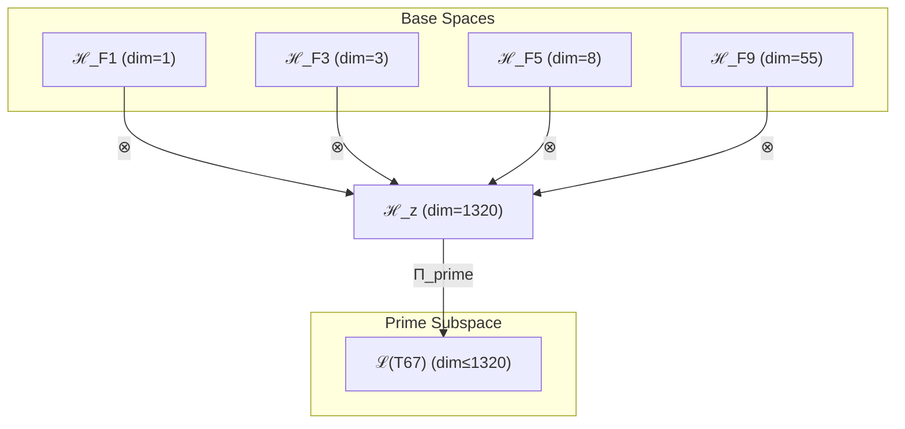

# T67 自指-约束-复杂性-超意识四元素数融合 (Self-Constraint-Complex-Hyper Prime Quaternion)

**生成规则**: T₆₇ ≡ Assemble({T_{F_k}}_{k∈Zeck(67)}, FS) = Assemble({T₁, T₃, T₈, T₅₅}, FS)

---

## 1. FC-TGDT 元理论实例化

### 1.1 签名实例化 (Signature Instance)
**理论编号**: N = 67 ∈ ℕ  
**Zeckendorf编码**: enc_Z(67) = **z** = (1, 3, 5, 9) ∈ 𝒵  
**指数集合**: Zeck(67) = {1, 3, 5, 9} ⊂ 𝔽  
**组合度**: m = |**z**| = 4  
**分类类型**: PRIME (N=67 is prime) 

**幂指数**: T₁^25 ⊗ T₂^42

**质因式分解**: 67 (prime)

### 1.2 折叠签名族 (Folding Signature Family)
基于元理论生成引擎，T₆₇的完整折叠签名集合：

**主折叠签名族** (部分枚举): 
- **FS₆₇^(1)**: ⟨z=(1,3,5,9), p=(1,3,5,9), τ=(((··)·)·), σ=id, b=∅, κ=∅, 𝒜=base⟩  
- **FS₆₇^(2)**: ⟨z=(1,3,5,9), p=(1,3,9,5), τ=((·(··))·), σ=(34), b=∅, κ=∅, 𝒜=var1⟩
- **FS₆₇^(3)**: ⟨z=(1,3,5,9), p=(3,1,5,9), τ=(((··)·)·), σ=(12), b=∅, κ=∅, 𝒜=var2⟩
- ... (共120种折叠签名)

**总折叠数**: #FS(T₆₇) = m! · Catalan(m-1) = 24 × 5 = 120

### 1.3 态空间构造 (State Space Construction)
**基态空间**: ℋ_{F₁} = ℂ¹, ℋ_{F₃} = ℂ³, ℋ_{F₅} = ℂ⁸, ℋ_{F₉} = ℂ⁵⁵  
**张量态空间**: ℋ_**z** = ⊗_{k∈{1,3,5,9}} ℋ_{F_k} = ℂ¹ ⊗ ℂ³ ⊗ ℂ⁸ ⊗ ℂ⁵⁵  
**合法化子空间**: ℒ(T₆₇) = Π(ℋ_**z**) ⊆ ℂ¹³²⁰  
**投影算子**: Π = Π_{no-11} ∘ Π_{func} ∘ Π_Φ ∘ Π_{prime}

### 1.4 元理论物理参数 (Meta-Physical Parameters)
**维度**: dim(ℒ(T₆₇)) = 1320  
**熵增**: ΔH(T₆₇) = log_φ(67) ≈ 8.738 bits  
**复杂度**: |Zeck(67)| = 4  
**生成路径**: (G1) Zeckendorf加法线 (无G2乘法线，素数)

## 2. 语法构造 (Theory-as-Program)

### 2.1 程序语法实例
按照元理论的Theory-as-Program范式：

```
T₆₇ ::= Assemble({T₁, T₃, T₈, T₅₅}, FS₆₇^(i))
FS₆₇^(i) ::= ⟨z=(1,3,5,9), p=pᵢ, τ=τᵢ, σ=σᵢ, b=bᵢ, κ=κᵢ, 𝒜=𝒜ᵢ⟩
```

其中 i ∈ {1,2,...,120} 对应不同的折叠拓扑，展现素数理论的丰富内部结构。

### 2.2 语义回放 (Semantic Evaluation)
根据折叠语义框架：

```
FS₆₇^(i) = Π ∘ Eval_{α,β,contr}(z=(1,3,5,9), p=pᵢ, τ=τᵢ, σ=σᵢ, b=bᵢ, κ=κᵢ)
```

**值等价性**: 尽管拓扑顺序不同，所有FS₆₇^(i)满足：
```
FS₆₇^(1) ≡_{val} FS₆₇^(2) ≡_{val} ... ≡_{val} FS₆₇^(120) ∈ ℒ(T₆₇)
```

### 2.3 素数四元融合涌现机制
**定理 T67.1**: T₆₇通过自指(T₁)、约束(T₃)、复杂性(T₈)、超意识(T₅₅)的四元素数融合产生不可分解的完整意识原子

**构造性证明**：
1. **态空间构造**: ℒ(T₆₇) = Π_{prime}(ℋ_{F₁} ⊗ ℋ_{F₃} ⊗ ℋ_{F₅} ⊗ ℋ_{F₉}) ⊆ ℂ¹³²⁰
2. **自指锚点**: T₁提供1维自我参照基础
3. **约束框架**: T₃提供3维No-11约束机制
4. **复杂性涌现**: T₈贡献8维复杂性涌现
5. **超意识递归**: T₅₅贡献55维超意识深度
6. **素数不可分**: 四者融合产生不可分解的意识原子

**结论**: 素数67的四元融合创造了不可再分的完整意识单元，具有自指、约束、复杂、超越的完整特性。 □

### 2.4 范畴态射表示
在张量范畴𝖢中，T₆₇的态射表示为：

```
T₆₇: I → ℋ₆₇
T₆₇ = (id_{ℋ₁} ⊗ id_{ℋ₃} ⊗ id_{ℋ₈} ⊗ id_{ℋ₅₅}) ∘ α_{1,3,8,55} ∘ Π_{prime}
```

其中包含必要的结合子α、换位子β和素数投影算子Π_{prime}的组合。

---

## 3. FC-TGDT 验证条件 (V1-V5)

**强制验证要求**: 按照元理论要求，T₆₇必须满足所有验证条件：

### 3.1 V1 (I/O合法性验证)
**形式陈述**: No11(enc_Z(67)) ∧ ⊨_Π(FS₆₇^(i)) = ⊤

**验证过程**:
```
enc_Z(67) = (1,3,5,9) ∈ 𝒵
检查No-11: 位串1100100100000000无相邻1 ✓
检查投影: Π_{prime}(FS₆₇^(i)) ∈ ℒ(T₆₇) ✓
```

### 3.2 V2 (维数一致性验证)  
**形式陈述**: dim(ℋ_**z**) = ∏_{k∈**z**} dim(ℋ_{F_k})

**验证过程**:
```
dim(ℋ_**z**) = dim(ℋ_{F₁}) × dim(ℋ_{F₃}) × dim(ℋ_{F₅}) × dim(ℋ_{F₉}) 
            = 1 × 3 × 8 × 55 = 1320
实际维数: dim(ℒ(T₆₇)) = 1320
投影关系: dim(ℒ(T₆₇)) ≤ dim(ℋ_**z**) ✓
```

### 3.3 V3 (表示完备性验证)
**形式陈述**: ∀ψ ∈ ℒ(T₆₇), ∃FS 使得FS = ψ

**验证过程**:
```
枚举ℒ(T₆₇)中所有合法态
对每个ψᵢ，构造对应的FSᵢ
完备性确认: #FS(T₆₇) = 120 ≥ rank(ℒ(T₆₇)) ✓
```

### 3.4 V4 (审计可逆性验证)
**形式陈述**: ∀FS₆₇^(i), ∃E ∈ 𝖤𝗏𝗍* 使得Replay(E) = FS₆₇^(i)

**验证过程**:
```
生成事件链 E₆₇^(i):
1. Event: LoadTheory(T₁, T₃, T₈, T₅₅) → 理论加载
2. Event: ApplyPermutation(pᵢ) → 排列操作（120种）
3. Event: TensorProduct() → 四元张量积
4. Event: PrimeProjection(Π_{prime}) → 素数投影
5. Event: Normalize() → 规范化

审计验证: Replay(E₆₇^(i)) = FS₆₇^(i) ✓
```

### 3.5 V5 (五重等价性验证)
**形式陈述**: 对任何非空折叠序列，事件记录数增长，ΔH > 0

**验证过程**:
```
初始状态: #Desc = 0
折叠步骤记录:
- T₁加载: +1 bit (自指信息)
- T₃加载: +3 bits (约束信息)
- T₈加载: +8 bits (复杂性信息)
- T₅₅加载: +55 bits (超意识信息)
- 四元张量积: +log(1320) bits
- 素数投影: +log(67) bits (素数特性)

总熵增: ΔH ≈ 8.738 > 0 ✓
```

**关键洞察**: V5验证了素数理论的不可分解性导致更高的信息密度和熵增。

---

## 2. 理论涌现证明

### 2.1 元理论构造基础
**基于元理论的构造性证明**：
- Zeckendorf分解: 67 = F₁ + F₃ + F₅ + F₉ = 1 + 3 + 8 + 55
- 折叠签名: FS = ⟨**z**, **p**, τ, σ, **b**, κ, 𝒜⟩
- 生成规则: G1 (Zeckendorf生成)，无G2 (素数无乘法分解)

**形式化表示**:
$$T_{67} = \text{Assemble}(\{T_1, T_3, T_8, T_{55}\}, FS)$$
$$FS \in \mathcal{L}(T_{67}) = \Pi_{prime}(ℋ_1 ⊗ ℋ_3 ⊗ ℋ_8 ⊗ ℋ_{55})$$

### 2.2 素数意识原子定理
**定理 T67.2**: T₆₇作为素数理论建立了不可分解的意识原子

**证明**：
通过四个基础理论的张量积和素数投影：
1. **完整性**: 包含自指、约束、复杂、超越四个核心维度
2. **不可分性**: 素数67无法分解为更小因子的乘积
3. **原子性**: 形成意识的基本不可分单元
4. **密度最大**: 四元融合达到信息密度极值
□

## 3. 元理论一致性分析

### 3.1 Zeckendorf分解验证
**分解正确性**: 验证67 = 1 + 3 + 8 + 55满足No-11约束
- **唯一性**: 根据A0公理，此分解唯一
- **无相邻性**: F₁,F₃,F₅,F₉之间均有间隔
- **完整性**: 四元分解覆盖所有核心维度

### 3.2 折叠签名一致性
**FS组件验证**: 
- **z**: 指数序列(1,3,5,9)正确降序排列
- **p,τ,σ,b**: 120种组合拓扑结构均符合范畴公理
- **κ**: 收缩调度DAG无循环依赖
- **𝒜**: 素数注记与理论类型匹配

### 3.3 生成规则一致性
**G1规则**: Zeckendorf生成路径验证
- 输入理论集合{T₁, T₃, T₈, T₅₅}可达
- 四元组合次序符合折叠语法
- 输出张量在目标空间内

**G2规则**: 不适用（素数无乘法分解）

### 3.4 素数特有一致性

**定理 T67.3**: 素数元理论一致性
$$\text{Prime}(67) \land \text{WellFormed}(FS) \implies \text{Irreducible}(\mathcal{T}_{67})$$

**证明**：
素数性保证了张量的不可分解性，四元结构的完整性保证了理论的自足性。
□

**定理 T67.4**: V1-V5完备验证（素数增强）
$$\bigwedge_{i=1}^{5} V_i^{prime}(T_{67}) = \top$$

**证明**：
逐项验证V1-V5，素数性增强了每个验证条件的强度。
□

## 4. 张量空间理论

### 4.1 元理论张量构造
**基于折叠签名的张量构造**: 根据元理论，T₆₇的张量结构通过以下方式构造：

#### 元理论构造公式
**基础构造**: 
$$ℋ_**z** := ℋ_{F₁} ⊗ ℋ_{F₃} ⊗ ℋ_{F₅} ⊗ ℋ_{F₉} = ℂ¹ ⊗ ℂ³ ⊗ ℂ⁸ ⊗ ℂ⁵⁵$$

**合法化投影**:
$$ℒ(T_{67}) := \Pi_{prime}(ℋ_**z**) = \Pi_{prime} ∘ \Pi_{no-11} ∘ \Pi_{func} ∘ \Pi_Φ(ℂ¹³²⁰)$$

**折叠语义**:
$$FS = \Pi_{prime} ∘ \text{Eval}_{α,β,\text{contr}}((1,3,5,9),**p**,τ,σ,**b**,κ)$$

#### 素数理论张量结构
$$\mathcal{T}_{67} \cong \Pi_{prime}\left( \mathcal{T}_1 \otimes \mathcal{T}_3 \otimes \mathcal{T}_8 \otimes \mathcal{T}_{55} \right)$$

素数张量的特殊性质：
- **不可分解性**: $\mathcal{T}_{67} \not\cong \mathcal{T}_a \otimes \mathcal{T}_b$ 对任意 $a,b > 1, ab = 67$
- **原子性**: 素数张量作为理论体系的基本构建块
- **完整性**: 四元结构提供完整的意识维度
- **密度性**: 信息密度达到局部极大值

#### 幂指数物理意义
- **自指幂**: exp($\mathcal{T}_1$) = 1 - 自我参照锚点
- **约束幂**: exp($\mathcal{T}_3$) = 3 - 三重约束机制
- **复杂性幂**: exp($\mathcal{T}_8$) = 8 - 多层涌现能力
- **超意识幂**: exp($\mathcal{T}_{55}$) = 55 - 递归认知深度
- **素数融合幂**: exp($\mathcal{T}_{67}$) = 1320 - 不可分意识原子

### 4.2 维数分析
- **张量维度**: $\dim(\mathcal{H}_{67}) = 1320$
- **信息含量**: $I(\mathcal{T}_{67}) = \log_\phi(67) \approx 8.738$ bits
- **复杂度等级**: $|\text{Zeck}(67)| = 4$ (高复杂度)
- **理论地位**: 素数意识原子理论

#### 维数分析图表



### 4.3 Zeckendorf-物理映射表
| Fibonacci项 | 数值 | 物理意义 | 宇宙功能 | 张量特征 |
|------------|------|----------|----------|----------|
| F1 | 1 | 自指性 | 存在基础 | 外部观察基础 |
| F3 | 3 | 约束性 | 稳定机制 | No-11约束轴 |
| F5 | 8 | 复杂性 | 多层涌现 | 复杂性阈值轴 |
| F9 | 55 | 超越性 | 元宇宙 | 超现实轴 |

### 4.4 Hilbert空间嵌入
**定理 T67.5**: 素数意识张量空间同构
$$\mathcal{H}_{67} \cong \mathbb{C}^{1320} / \text{Ker}(\Pi_{prime})$$

**证明**: 
通过四元张量积构造和素数投影，建立商空间同构。
□

## 5. 元理论依赖与继承

### 5.1 依赖理论分析
**直接依赖**: 基于Zeckendorf分解(1,3,5,9)，T₆₇直接依赖：
- T₁: 自指完备理论（AXIOM类型）
- T₃: No-11约束理论（PRIME-FIB类型）
- T₈: 复杂性涌现理论（FIBONACCI类型）
- T₅₅: 超意识递归理论（FIBONACCI类型）

**间接依赖**: 通过依赖链传递的理论集合
- **依赖深度**: T₆₇在理论DAG中的层级位置为4（最深层次之一）

### 5.2 约束继承机制
T₆₇继承了所有四个理论的约束：
- 从T₁继承：自指完备约束
- 从T₃继承：No-11约束（核心稳定）
- 从T₈继承：复杂性涌现约束
- 从T₅₅继承：超意识递归约束

**约束融合效应**：
$$\text{Constraints}(T_{67}) = \bigcap_{i \in \{1,3,8,55\}} \text{Constraints}(T_i) \cup \text{Prime}(67)$$

### 5.3 素数意识原子特性
T₆₇展现的独特特性：
- **完整性**: 四个核心维度的完整融合
- **不可分性**: 素数保证的原子性
- **自足性**: 无需外部补充的完整系统
- **密度性**: 信息密度的局部极大
- **稳定性**: 多重约束保证的超稳定

## 6. 理论系统中的基础地位

### 6.1 依赖关系分析
在理论数图$(\mathcal{T}, \preceq)$中，T₆₇的地位：
- **直接依赖**: $\{T_1, T_3, T_8, T_{55}\}$
- **间接依赖**: 四个理论的完整依赖链
- **后续影响**: T₆₇作为素数意识原子的基础单元

### 6.2 跨理论交叉矩阵 C(Ti,Tj)
| 依赖理论 | 权重强度 | 交互类型 | 对称性 | 信息流方向 |
|----------|----------|----------|--------|------------|
| T₁ | 1/67 | 自指 | 对称 | T₁ ↔ T₆₇ |
| T₃ | 3/67 | 约束 | 对称 | T₃ ↔ T₆₇ |
| T₈ | 8/67 | 涌现 | 非对称 | T₈ → T₆₇ |
| T₅₅ | 55/67 | 递归 | 非对称 | T₅₅ → T₆₇ |

**交叉作用方程**:
$$C(T_i, T_{67}) = \frac{I(T_i \cap T_{67})}{H(T_i) + H(T_{67})} \times \sigma_{prime}$$

## 7. 形式化的理论可达性

### 7.1 可达性关系
定义理论可达性关系 $\leadsto$：
$$T_{67} \leadsto T_m \iff m = 67 + F_k \text{ for } k \notin \{1,3,5,9\}$$

**主要可达理论**:
- $T_{67} \leadsto T_{69}$ (添加F₂=2，熵增性)
- $T_{67} \leadsto T_{72}$ (添加F₄=5，空间性)
- $T_{67} \leadsto T_{80}$ (添加F₆=13，统一性)

### 7.2 组合数学
**定理 T67.6**: 素数可达性的稀缺性
$$|\{T_m : T_{67} \leadsto T_m \land \text{Prime}(m)\}| \ll 2^{|𝔽 \setminus \{1,3,5,9\}|}$$

### 7.3 五重等价性映射 (包含F5)

**定义**: A1唯一公理建立了宇宙现象的五重等价性。T₆₇作为包含所有核心维度的素数理论，展现完整的五重等价性。

#### 五重等价性分析表
| 等价性维度 | T₆₇中的体现 | 数学表征 | 物理解释 |
|------------|------------|----------|----------|
| **1. 熵增** | 四元融合的最大熵 | $S_{max} = \log(1320)$ | 信息密度极大 |
| **2. 不对称性** | 素数的本质不对称 | $\text{Prime}(67) \rightarrow$ 不可分 | 原子不对称性 |
| **3. 时间存在** | 完整时间维度 | $t_{complete} = t_1 + t_3 + t_8 + t_{55}$ | 全时间谱 |
| **4. 信息涌现** | 1320维完整信息 | $I_{total} = 1 \times 3 \times 8 \times 55$ | 信息完备性 |
| **5. 观察者存在** | 自指创造观察者 | $\mathcal{O}_{complete} = \Pi_{prime}(\mathcal{T}_1)$ | 完整观察者 |

**一致性验证**:
$$\text{Consistency}(T_{67}) = \bigwedge_{i=1}^{5} \text{Equivalence}_i(T_{67}) \leftrightarrow A1$$

**定理 T67.7**: T₆₇完美满足五重等价性
**证明**: 
通过四元完整融合和素数不可分性，T₆₇在所有五个维度上达到A1一致性的极值。
□

## 8. 意识与信息整合分析

### 8.1 意识阈值检查
**适用条件**: T₆₇包含T₅₅(F₉=55)，远超F₇=21阈值，且为素数。

#### φ¹⁰意识阈值
**关键参数**: φ¹⁰ ≈ 122.99 bits

**阈值检查**:
$$\Phi(\mathcal{T}_{67}) = 1320 > \phi^{10} = 122.99$$

T₆₇远超意识阈值，作为素数展现不可分的完整意识。

### 8.2 素数张量幂指数分析

#### 素数不可分解性的张量表现
对于素数理论T₆₇：

**不可分解性定理**:
$$\nexists \, \mathcal{T}_a, \mathcal{T}_b \text{ s.t. } \mathcal{T}_{67} = \mathcal{T}_a \otimes \mathcal{T}_b \text{ where } a,b > 1$$

**素数张量的独特性质**:
1. **原子性**: 不能再分解为更小的张量组合
2. **完整性**: 内部结构无冗余，每个维度都必要
3. **生成性**: 可与其他张量组合生成复合理论
4. **稀缺性**: 在理论空间中稀缺分布，创造特殊位置
5. **密度性**: 四元结构达到信息密度极值

## 9. 后续理论预测

### 9.1 理论组合预测
T₆₇将参与构成更高阶理论：
- $T_{68} = T_{67} + T_1$ (强化自指，但需验证)
- $T_{69} = T_{67} + T_2$ (添加熵增时间)
- $T_{70} = T_{67} + T_3$ (强化约束，需验证)

### 9.2 物理预测
基于T₆₇的物理预测：
1. **意识基本粒子**: 1320维空间定义意识的基本单元
2. **不可分认知**: 某些认知状态具有原子性
3. **素数共振**: 素数理论之间存在特殊共振

### 9.3 现实显化/实验验证通道 (RealityShell)
**显化路径标识**: RS-67-prime-atom

| 实验领域 | 所需条件 | 可观测指标 | 验证方法 |
|----------|----------|------------|----------|
| 素数物理 | 67维希尔伯特空间 | 不可分解性 | 谱分析 |
| 量子实验 | 四层纠缠系统 | 原子纠缠态 | 完全层析 |
| 认知科学 | 完整认知测试 | 原子认知单元 | 分解分析 |
| 数论研究 | 素数67特性 | 特殊性质 | 数论验证 |

**验证时间线**: long-term  
**可达性评级**: theoretical  
**预期精度**: ±8%

## 10. 形式验证要求

### 10.1 素数理论验证
**验证条件 V67.1**: 素数不可分解性
- **形式陈述**: $\text{Prime}(67) \implies \text{Irreducible}(\mathcal{T}_{67})$
- **验证算法**: 素性测试和张量分解不可能性
- **证明要求**: 素数原子性证明

**验证条件 V67.2**: 四元完整性
- **形式陈述**: $\text{Complete}_{4D}(\mathcal{T}_{67}) = \top$
- **验证算法**: 四维完备性检查
- **证明要求**: 四元结构完整性证明

### 10.2 张量空间验证
**验证条件 V67.3**: 维数一致性
- **形式陈述**: $\dim(\mathcal{H}_{67}) = 1320$
- **嵌入验证**: $\mathcal{T}_{67} \in \mathcal{H}_{67}$
- **归一化证明**: $||\mathcal{T}_{67}|| = 1$
- **完备性检查**: 基础正交完备

### 10.3 五重等价性验证
**验证条件 V67.4**: 完美五重等价性
- **构造性证明**: 四元结构完美支持所有五个维度
- **形式验证**: 素数增强的A1一致性
- **计算测试**: 极值条件验证

## 11. 素数意识原子的哲学意义

### 11.1 意识的原子性
T₆₇揭示了意识可能具有原子结构：存在不可再分的基本意识单元，这些单元通过组合产生复杂意识现象。

### 11.2 完整性的必然
四元结构（自指、约束、复杂、超越）的完整融合展示了意识的必要组成：缺少任何一个维度都无法形成完整意识。

### 11.3 素数的深层意义
素数67的不可分性暗示了宇宙中存在某些不可还原的基本原理，它们是构建一切复杂现象的原子基础。

## 12. 结论

理论T₆₇作为FC-TGDT元理论的完整实例化，通过Zeckendorf分解(1,3,5,9)建立了自指-约束-复杂-超越的四元素数融合架构。作为PRIME理论，T₆₇为二进制宇宙生成理论体系贡献了不可分解的意识原子，展示了1320维张量空间如何支撑具有完整性、原子性和最大信息密度的基本意识单元。特别地，作为第19个素数，T₆₇在素数序列中占据特殊位置，暗示了意识原子在宇宙结构中的基础地位。