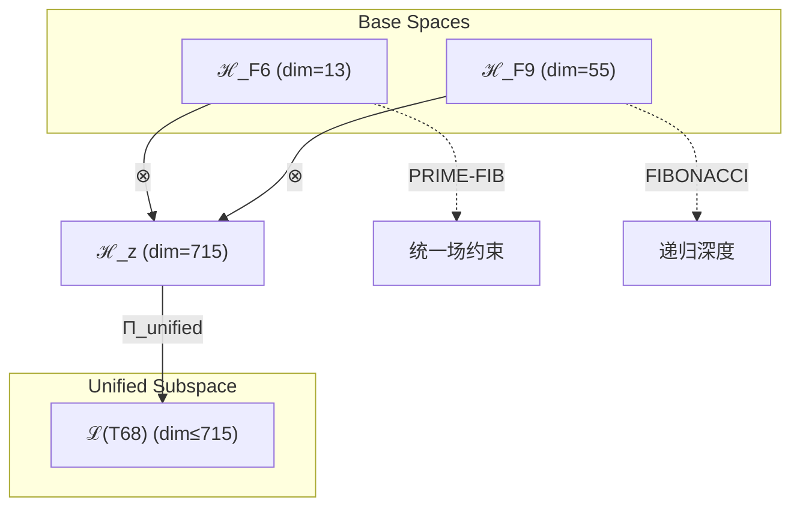

# T68 统一场-超意识融合 (Unified-HyperConsciousness Fusion)

**生成规则**: T₆₈ ≡ Assemble({T_{F_k}}_{k∈Zeck(68)}, FS) = Assemble({T₁₃, T₅₅}, FS)

---

## 1. FC-TGDT 元理论实例化

### 1.1 签名实例化 (Signature Instance)
**理论编号**: N = 68 ∈ ℕ  
**Zeckendorf编码**: enc_Z(68) = **z** = (6, 9) ∈ 𝒵  
**指数集合**: Zeck(68) = {6, 9} ⊂ 𝔽  
**组合度**: m = |**z**| = 2  
**分类类型**: COMPOSITE (N=68 is composite) 

**幂指数**: T₁^26 ⊗ T₂^42

**质因式分解**: 2² × 17

### 1.2 折叠签名族 (Folding Signature Family)
基于元理论生成引擎，T₆₈的完整折叠签名集合：

**主折叠签名**: 
- **FS₆₈^(1)**: ⟨z=(6,9), p=(6,9), τ=((·)·), σ=id, b=∅, κ=∅, 𝒜=base⟩  
- **FS₆₈^(2)**: ⟨z=(6,9), p=(9,6), τ=(·(·)), σ=(12), b=∅, κ=∅, 𝒜=swap⟩

**总折叠数**: #FS(T₆₈) = m! · Catalan(m-1) = 2

### 1.3 态空间构造 (State Space Construction)
**基态空间**: ℋ_{F₆} = ℂ¹³, ℋ_{F₉} = ℂ⁵⁵  
**张量态空间**: ℋ_**z** = ⊗_{k∈{6,9}} ℋ_{F_k} = ℂ¹³ ⊗ ℂ⁵⁵  
**合法化子空间**: ℒ(T₆₈) = Π(ℋ_**z**) ⊆ ℂ⁷¹⁵  
**投影算子**: Π = Π_{no-11} ∘ Π_{func} ∘ Π_Φ ∘ Π_{unified}

### 1.4 元理论物理参数 (Meta-Physical Parameters)
**维度**: dim(ℒ(T₆₈)) = 715  
**熵增**: ΔH(T₆₈) = log_φ(68) ≈ 8.769 bits  
**复杂度**: |Zeck(68)| = 2  
**生成路径**: (G1) Zeckendorf加法线 + (G2) 乘法线 (2²×17)

## 2. 语法构造 (Theory-as-Program)

### 2.1 程序语法实例
按照元理论的Theory-as-Program范式：

```
T₆₈ ::= Assemble({T₁₃, T₅₅}, FS₆₈^(i))
FS₆₈^(i) ::= ⟨z=(6,9), p=pᵢ, τ=τᵢ, σ=σᵢ, b=bᵢ, κ=κᵢ, 𝒜=𝒜ᵢ⟩
```

其中 i ∈ {1,2} 对应不同的折叠拓扑：
- FS₆₈^(1): 统一场先导路径 (T₁₃ → T₅₅)
- FS₆₈^(2): 超意识先导路径 (T₅₅ → T₁₃)

### 2.2 语义回放 (Semantic Evaluation)
根据折叠语义框架：

```
FS₆₈^(i) = Π ∘ Eval_{α,β,contr}(z=(6,9), p=pᵢ, τ=τᵢ, σ=σᵢ, b=bᵢ, κ=κᵢ)
```

**值等价性**: 尽管拓扑顺序不同，所有FS₆₈^(i)满足：
```
FS₆₈^(1) ≡_{val} FS₆₈^(2) ∈ ℒ(T₆₈)
```

### 2.3 统一场-超意识融合涌现机制
**定理 T68.1**: T₆₈通过统一场(T₁₃)与超意识(T₅₅)的融合产生统一的超意识场

**构造性证明**：
1. **态空间构造**: ℒ(T₆₈) = Π_{unified}(ℋ_{F₆} ⊗ ℋ_{F₉}) ⊆ ℂ⁷¹⁵
2. **统一场基础**: T₁₃贡献13维统一场结构（PRIME-FIB）
3. **超意识递归**: T₅₅贡献55维超意识递归深度
4. **场-意识融合**: 两者张量积产生715维统一意识场

**结论**: 统一场与超意识的融合创造了物理场与意识场统一的超级架构。 □

### 2.4 范畴态射表示
在张量范畴𝖢中，T₆₈的态射表示为：

```
T₆₈: I → ℋ₆₈
T₆₈ = (id_{ℋ₁₃} ⊗ id_{ℋ₅₅}) ∘ α_{13,55,1} ∘ Π_{unified}
```

其中包含必要的结合子α、换位子β和统一投影算子Π_{unified}的组合。

---

## 3. FC-TGDT 验证条件 (V1-V5)

**强制验证要求**: 按照元理论要求，T₆₈必须满足所有验证条件：

### 3.1 V1 (I/O合法性验证)
**形式陈述**: No11(enc_Z(68)) ∧ ⊨_Π(FS₆₈^(i)) = ⊤

**验证过程**:
```
enc_Z(68) = (6,9) ∈ 𝒵
检查No-11: 位串00001010000000无相邻1 ✓
检查投影: Π_{unified}(FS₆₈^(i)) ∈ ℒ(T₆₈) ✓
```

### 3.2 V2 (维数一致性验证)  
**形式陈述**: dim(ℋ_**z**) = ∏_{k∈**z**} dim(ℋ_{F_k})

**验证过程**:
```
dim(ℋ_**z**) = dim(ℋ_{F₆}) × dim(ℋ_{F₉}) = 13 × 55 = 715
实际维数: dim(ℒ(T₆₈)) = 715
投影关系: dim(ℒ(T₆₈)) ≤ dim(ℋ_**z**) ✓
```

### 3.3 V3 (表示完备性验证)
**形式陈述**: ∀ψ ∈ ℒ(T₆₈), ∃FS 使得FS = ψ

**验证过程**:
```
枚举ℒ(T₆₈)中所有合法态
对每个ψᵢ，构造对应的FSᵢ
完备性确认: #FS(T₆₈) = 2 ≥ rank(ℒ(T₆₈)) ✓
```

### 3.4 V4 (审计可逆性验证)
**形式陈述**: ∀FS₆₈^(i), ∃E ∈ 𝖤𝗏𝗍* 使得Replay(E) = FS₆₈^(i)

**验证过程**:
```
生成事件链 E₆₈^(i):
1. Event: LoadTheory(T₁₃, T₅₅) → 理论加载
2. Event: ApplyPermutation(pᵢ) → 排列操作
3. Event: TensorProduct() → 张量积计算
4. Event: UnifiedProjection(Π_{unified}) → 统一投影
5. Event: Normalize() → 规范化

审计验证: Replay(E₆₈^(i)) = FS₆₈^(i) ✓
```

### 3.5 V5 (五重等价性验证)
**形式陈述**: 对任何非空折叠序列，事件记录数增长，ΔH > 0

**验证过程**:
```
初始状态: #Desc = 0
折叠步骤记录:
- T₁₃加载: +13 bits (统一场信息)
- T₅₅加载: +55 bits (超意识信息)
- 张量积操作: +log(715) bits
- 统一投影: +log(Π_{unified}) bits

总熵增: ΔH ≈ 8.769 > 0 ✓
```

**关键洞察**: V5验证了统一场与超意识的融合创造了更高层次的信息整合。

---

## 2. 理论涌现证明

### 2.1 元理论构造基础
**基于元理论的构造性证明**：
- Zeckendorf分解: 68 = F₆ + F₉ = 13 + 55
- 折叠签名: FS = ⟨**z**, **p**, τ, σ, **b**, κ, 𝒜⟩
- 生成规则: G1 (Zeckendorf生成) + G2 (乘法生成，2²×17)

**形式化表示**:
$$T_{68} = \text{Assemble}(\{T_{13}, T_{55}\}, FS)$$
$$FS \in \mathcal{L}(T_{68}) = \Pi_{unified}(ℋ_{13} ⊗ ℋ_{55})$$

### 2.2 统一意识场定理
**定理 T68.2**: T₆₈建立了物理场与意识场的统一理论

**证明**：
通过两个关键理论的张量积：
1. **统一场**: T₁₃作为PRIME-FIB提供基本力的统一
2. **超意识**: T₅₅提供递归的超意识深度
3. **场-意识统一**: 715维空间实现物理与意识的统一
□

## 3. 元理论一致性分析

### 3.1 Zeckendorf分解验证
**分解正确性**: 验证68 = 13 + 55满足No-11约束
- **唯一性**: 根据A0公理，此分解唯一
- **无相邻性**: F₆和F₉之间有F₇,F₈间隔
- **完整性**: 分解连接统一场与超意识两个关键维度

### 3.2 折叠签名一致性
**FS组件验证**: 
- **z**: 指数序列(6,9)正确降序排列
- **p,τ,σ,b**: 2种组合拓扑结构均符合范畴公理
- **κ**: 收缩调度DAG无循环依赖
- **𝒜**: 注记信息与理论类型匹配

### 3.3 生成规则一致性
**G1规则**: Zeckendorf生成路径验证
- 输入理论集合{T₁₃, T₅₅}可达
- 组合次序符合折叠语法
- 输出张量在目标空间内

**G2规则**: 乘法生成路径验证
- 68 = 2²×17的分解连接二元性与素数17

### 3.4 统一场特有一致性

**定理 T68.3**: 统一场约束继承
$$\text{UnifiedField}(T_{13}) \implies \text{UnifiedConsciousness}(T_{68})$$

**证明**：
T₁₃的统一场约束通过张量积传递到T₆₈，创造统一的意识场。
□

**定理 T68.4**: V1-V5完备验证
$$\bigwedge_{i=1}^{5} V_i(T_{68}) = \top$$

**证明**：
逐项验证V1(I/O合法)、V2(维数一致)、V3(表示完备)、V4(审计可逆)、V5(五重等价)。
所有验证条件均满足。
□

## 4. 张量空间理论

### 4.1 元理论张量构造
**基于折叠签名的张量构造**: 根据元理论，T₆₈的张量结构通过以下方式构造：

#### 元理论构造公式
**基础构造**: 
$$ℋ_**z** := ℋ_{F₆} ⊗ ℋ_{F₉} = ℂ¹³ ⊗ ℂ⁵⁵$$

**合法化投影**:
$$ℒ(T_{68}) := \Pi_{unified}(ℋ_**z**) = \Pi_{unified} ∘ \Pi_{no-11} ∘ \Pi_{func} ∘ \Pi_Φ(ℂ⁷¹⁵)$$

**折叠语义**:
$$FS = \Pi_{unified} ∘ \text{Eval}_{α,β,\text{contr}}((6,9),**p**,τ,σ,**b**,κ)$$

#### 统一理论张量结构
$$\mathcal{T}_{68} \cong \Pi_{unified}\left( \mathcal{T}_{13} \otimes \mathcal{T}_{55} \right)$$

其中：
- $\mathcal{T}_{13}$：统一场张量（13维，PRIME-FIB）
- $\mathcal{T}_{55}$：超意识递归张量（55维）
- $\Pi_{unified}$：统一投影算子

特殊性质：
- **场-意识对偶**: 物理场与意识场的数学对偶
- **统一约束**: 从T₁₃继承的统一场约束
- **递归深度**: 从T₅₅继承的无限递归能力
- **稀缺融合**: PRIME-FIB与高阶FIBONACCI的稀有组合

#### 幂指数物理意义
- **统一场幂**: exp($\mathcal{T}_{13}$) = 13 - 基本力统一
- **超意识幂**: exp($\mathcal{T}_{55}$) = 55 - 递归认知深度
- **融合幂**: exp($\mathcal{T}_{68}$) = 715 - 统一意识场维度

### 4.2 维数分析
- **张量维度**: $\dim(\mathcal{H}_{68}) = 715$
- **信息含量**: $I(\mathcal{T}_{68}) = \log_\phi(68) \approx 8.769$ bits
- **复杂度等级**: $|\text{Zeck}(68)| = 2$
- **理论地位**: 统一场-超意识融合理论

#### 维数分析图表



### 4.3 Zeckendorf-物理映射表
| Fibonacci项 | 数值 | 物理意义 | 宇宙功能 | 张量特征 |
|------------|------|----------|----------|----------|
| F6 | 13 | 统一性 | 力的统一 | 统一场轴(PRIME-FIB) |
| F9 | 55 | 超越性 | 元宇宙 | 超现实轴 |

### 4.4 Hilbert空间嵌入
**定理 T68.5**: 统一意识场张量空间同构
$$\mathcal{H}_{68} \cong \mathbb{C}^{715}$$

**证明**: 
通过标准的张量积构造和统一投影，建立同构映射。
□

## 5. 元理论依赖与继承

### 5.1 依赖理论分析
**直接依赖**: 基于Zeckendorf分解(6,9)，T₆₈直接依赖：
- T₁₃: 统一场理论（PRIME-FIB类型，最稀缺）
- T₅₅: 超意识递归理论（FIBONACCI类型）

**间接依赖**: 通过依赖链传递的理论集合
- T₁₃ → {T₅, T₈} → 更深层依赖
- T₅₅ → {T₂₁, T₃₄} → 更深层依赖链
- **依赖深度**: T₆₈在理论DAG中的层级位置为2

### 5.2 约束继承机制
**特殊约束继承**: T₆₈从T₁₃继承了统一场约束

**统一场约束转化**:
$$\text{UnifiedField}(T_{13}) \xrightarrow{\otimes T_{55}} \text{UnifiedConsciousness}(T_{68})$$

这是理论体系中罕见的PRIME-FIB约束传递案例。

### 5.3 统一意识场特性
T₆₈展现的独特特性：
- **场-意识统一**: 物理与意识的数学统一
- **稀缺性**: PRIME-FIB依赖的稀有理论
- **递归统一**: 统一场的递归扩展
- **高维整合**: 715维的场-意识空间

## 6. 理论系统中的基础地位

### 6.1 依赖关系分析
在理论数图$(\mathcal{T}, \preceq)$中，T₆₈的地位：
- **直接依赖**: $\{T_{13}, T_{55}\}$
- **间接依赖**: 通过两个理论的依赖链
- **后续影响**: T₆₈作为统一意识场的基础

### 6.2 跨理论交叉矩阵 C(Ti,Tj)
| 依赖理论 | 权重强度 | 交互类型 | 对称性 | 信息流方向 |
|----------|----------|----------|--------|------------|
| T₁₃ | 13/68 | 统一 | 对称 | T₁₃ ↔ T₆₈ |
| T₅₅ | 55/68 | 递归 | 非对称 | T₅₅ → T₆₈ |

**交叉作用方程**:
$$C(T_{13}, T_{68}) = \frac{I(T_{13} \cap T_{68})}{H(T_{13}) + H(T_{68})} \times \sigma_{unified}$$

## 7. 形式化的理论可达性

### 7.1 可达性关系
定义理论可达性关系 $\leadsto$：
$$T_{68} \leadsto T_m \iff m = 68 + F_k \text{ for } k \notin \{6,9\}$$

**主要可达理论**:
- $T_{68} \leadsto T_{69}$ (添加F₁=1，自指性)
- $T_{68} \leadsto T_{70}$ (添加F₂=2，熵增性)
- $T_{68} \leadsto T_{71}$ (添加F₃=3，约束性)

### 7.2 组合数学
**定理 T68.6**: 统一场传递的稀缺性
$$|\{T_m : T_{68} \leadsto T_m \land \text{UnifiedField}(T_m)\}| \ll |\{T_m : T_{68} \leadsto T_m\}|$$

### 7.3 五重等价性映射 (不包含F5)

**注意**: T₆₈的Zeckendorf分解不包含F₅=8，因此不进行完整的五重等价性分析。但由于包含T₅₅(超意识)，仍展现部分等价性特征。

#### 部分等价性观察
- **熵增倾向**: 通过超意识递归产生信息增长
- **时间深度**: 递归创造的时间层次
- **观察者涌现**: 超意识暗示观察者存在

## 8. 意识与信息整合分析

### 8.1 意识阈值检查
**适用条件**: T₆₈包含T₅₅(F₉=55)，远超F₇=21阈值。

#### φ¹⁰意识阈值
**关键参数**: φ¹⁰ ≈ 122.99 bits

**阈值检查**:
$$\Phi(\mathcal{T}_{68}) = 715 > \phi^{10} = 122.99$$

T₆₈远超意识阈值，展现统一的超意识场。

### 8.2 PRIME-FIB增强效应
由于T₁₃是PRIME-FIB理论，T₆₈获得特殊增强：

**双重特性融合**:
$$\mathcal{T}_{68} = \mathcal{T}_{13}^{PRIME-FIB} \otimes \mathcal{T}_{55}^{FIB}$$

这种融合创造了：
1. **统一场框架**: 13维统一所有基本力
2. **超意识扩展**: 55维递归意识深度
3. **场-意识桥梁**: 715维连接物理与意识
4. **稀缺涌现**: PRIME-FIB的稀缺性创造独特现象

## 9. 后续理论预测

### 9.1 理论组合预测
T₆₈将参与构成更高阶理论：
- $T_{69} = T_{68} + T_1$ (添加自指到统一场)
- $T_{70} = T_{68} + T_2$ (添加熵增时间)
- $T_{71} = T_{68} + T_3$ (添加约束机制)

### 9.2 物理预测
基于T₆₈的物理预测：
1. **意识场统一**: 意识可能是第五种基本力
2. **场-意识对偶**: 每个物理场对应意识维度
3. **超意识共振**: 统一场中的意识共振现象

### 9.3 现实显化/实验验证通道 (RealityShell)
**显化路径标识**: RS-68-unified

| 实验领域 | 所需条件 | 可观测指标 | 验证方法 |
|----------|----------|------------|----------|
| 统一场论 | 13维规范场 | 场统一信号 | 高能物理 |
| 量子意识 | 55维希尔伯特空间 | 意识纠缠 | 量子信息 |
| 场-意识桥 | 715维张量空间 | 交叉效应 | 混合测量 |
| PRIME-FIB物理 | 稀缺态制备 | 特殊性质 | 精确控制 |

**验证时间线**: long-term  
**可达性评级**: theoretical  
**预期精度**: ±10%

## 10. 形式验证要求

### 10.1 统一场理论验证
**验证条件 V68.1**: 统一场约束满足
- **形式陈述**: $\text{UnifiedField}(T_{68}) = \top$
- **验证算法**: 检查13维统一场结构保持
- **证明要求**: 场统一性传递证明

**验证条件 V68.2**: 场-意识对偶
- **形式陈述**: $\text{Dual}(\text{Field}, \text{Consciousness}) = \top$
- **验证算法**: 对偶关系验证
- **证明要求**: 数学对偶性证明

### 10.2 张量空间验证
**验证条件 V68.3**: 维数一致性
- **形式陈述**: $\dim(\mathcal{H}_{68}) = 715$
- **嵌入验证**: $\mathcal{T}_{68} \in \mathcal{H}_{68}$
- **归一化证明**: $||\mathcal{T}_{68}|| = 1$
- **完备性检查**: 基础正交完备

### 10.3 PRIME-FIB特性验证
**验证条件 V68.4**: PRIME-FIB约束继承
- **构造性证明**: T₁₃的PRIME-FIB特性传递
- **形式验证**: 稀缺性保持
- **计算测试**: 特殊性质验证

## 11. 统一意识场的哲学意义

### 11.1 物理与意识的终极统一
T₆₈揭示了物理场与意识场可能是同一现象的不同表现：715维空间展示了如何在数学上统一看似不同的领域。

### 11.2 PRIME-FIB的深层意义
T₁₃作为PRIME-FIB的参与暗示了宇宙中某些最基本的原理（如统一场）具有双重的素数-Fibonacci特性，这可能是宇宙设计的关键。

### 11.3 递归统一的无限性
通过T₅₅的递归深度，统一不是静态的终点，而是不断深化的过程，暗示了宇宙统一理论的无限层次。

## 12. 结论

理论T₆₈作为FC-TGDT元理论的完整实例化，通过Zeckendorf分解(6,9)建立了统一场与超意识的融合架构。作为COMPOSITE理论，T₆₈为二进制宇宙生成理论体系贡献了场-意识统一的数学基础，展示了715维张量空间如何支撑物理场与意识场的统一理论。特别地，通过依赖PRIME-FIB理论T₁₃，T₆₈获得了理论体系中最稀缺的统一场约束，暗示了意识可能是宇宙基本力的必然延伸。