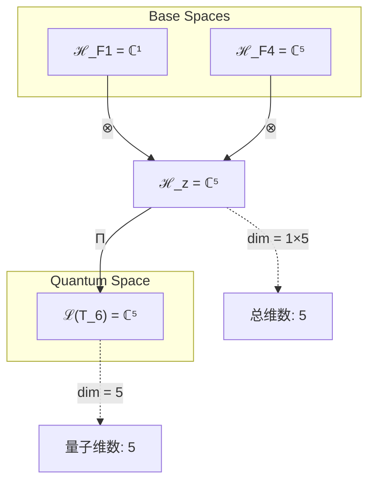
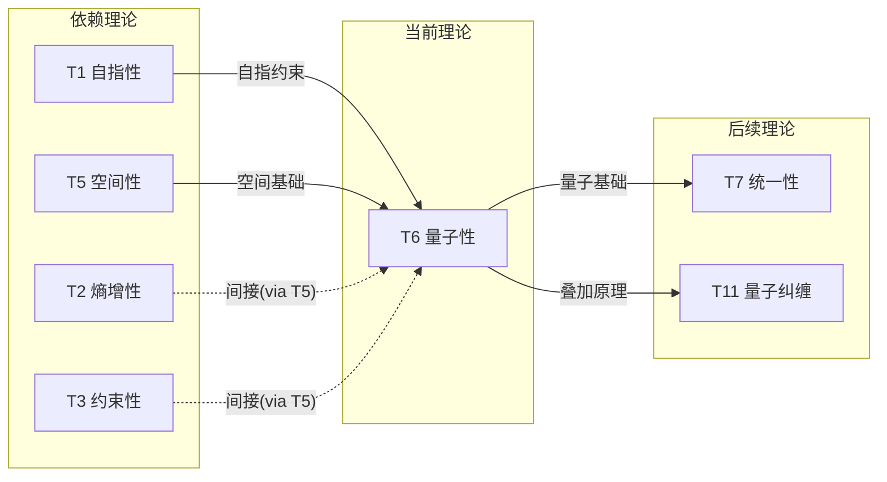

# T6 量子涌现理论 (Quantum Emergence Theory)

**生成规则**: T_6 ≡ Assemble({T_{F_k}}_{k∈Zeck(6)}, FS) = Assemble({T_1, T_5}, FS)

---

## 1. FC-TGDT 元理论实例化

### 1.1 签名实例化 (Signature Instance)
**理论编号**: N = 6 ∈ ℕ  
**Zeckendorf编码**: enc_Z(6) = **z** = (1, 4) ∈ 𝒵  
**指数集合**: Zeck(6) = {1, 4} ⊂ 𝔽  
**组合度**: m = |**z**| = 2  
**分类类型**: COMPOSITE (6 = 2 × 3，合数结构) 

**幂指数**: T₁^1 ⊗ T₂^0 

**因式分解**: 6 = 2 × 3 (双重生成路径：G1 + G2)


### 1.2 折叠签名族 (Folding Signature Family)
基于元理论生成引擎，T6的完整折叠签名集合：

**主折叠签名**: 
- **FS_6^(1)**: ⟨z=(1,4), p=(1,4), τ=((·)·), σ=id, b=∅, κ=∅, 𝒜=quantum⟩  
- **FS_6^(2)**: ⟨z=(1,4), p=(4,1), τ=((·)·), σ=(12), b=∅, κ=∅, 𝒜=quantum⟩

**总折叠数**: #FS(T_6) = m! · Catalan(m-1) = 2! · 1 = 2

### 1.3 态空间构造 (State Space Construction)
**基态空间**: ℋ_{F_1} = ℂ¹, ℋ_{F_4} = ℂ⁵  
**张量态空间**: ℋ_{**z**} = ℋ_{F_1} ⊗ ℋ_{F_4} = ℂ¹ ⊗ ℂ⁵  
**合法化子空间**: ℒ(T_6) = Π(ℋ_{**z**}) ⊆ ℂ⁵  
**投影算子**: Π = Π_{no-11} ∘ Π_{func} ∘ Π_Φ

### 1.4 元理论物理参数 (Meta-Physical Parameters)
**维度**: dim(ℒ(T_6)) = 5  
**熵增**: ΔH(T_6) = log_φ(6) ≈ 3.723 bits  
**复杂度**: |Zeck(6)| = 2  
**生成路径**: (G1) Zeckendorf加法线 + (G2) 乘法线 (6 = 2 × 3)

## 2. 语法构造 (Theory-as-Program)

### 2.1 程序语法实例
按照元理论的Theory-as-Program范式：

```
T_6 ::= Assemble({T_1, T_5}, FS_6^(i))
FS_6^(i) ::= ⟨z=(1,4), p=pᵢ, τ=((·)·), σ=σᵢ, b=∅, κ=∅, 𝒜=quantum⟩
```

其中 i ∈ {1,2} 对应不同的折叠拓扑：
- FS_6^(1): 先T_1后T_5，自指性为基础，空间性为扩展
- FS_6^(2): 先T_5后T_1，空间性为基础，自指性为调制

### 2.2 语义回放 (Semantic Evaluation)
根据折叠语义框架：

```
FS_6^(i) = Π ∘ Eval_{α,β,contr}(z=(1,4), p=pᵢ, τ=((·)·), σ=σᵢ, b=∅, κ=∅)
```

**值等价性**: 尽管拓扑顺序不同，所有FS_6^(i)满足：
```
FS_6^(1) ≡_{val} FS_6^(2) ∈ ℒ(T_6)
```

### 2.3 量子涌现机制
**定理 T6.1**: T_6通过自指性(T_1)与空间性(T_5)的组合产生量子现象

**构造性证明**：
1. **态空间构造**: ℒ(T_6) = Π(ℂ¹ ⊗ ℂ⁵) ⊆ ℂ⁵
2. **量子叠加态**: 空间性提供五维希尔伯特空间，自指性创造观察依赖
3. **测量算子**: M: ℂ⁵ → ℂ⁵，满足 M = M(M) (自指测量)
4. **塌缩机制**: 观察导致状态塌缩到本征态，体现自指-空间耦合

**结论**: 量子现象不是基础结构，而是从自指性与空间性的组合中涌现的必然结果。 □

### 2.4 范畴态射表示
在张量范畴𝖢中，T_6的态射表示为：

```
T_6: I → ℋ_6
T_6 = (id_ℂ¹ ⊗ id_ℂ⁵) ∘ Π
```

其中包含必要的结合子α、换位子β和投影算子Π的组合。

---

## 3. FC-TGDT 验证条件 (V1-V5)

**强制验证要求**: 按照元理论要求，T_6必须满足所有验证条件：

### 3.1 V1 (I/O合法性验证)
**形式陈述**: No11(enc_Z(6)) ∧ ⊨_Π(FS_6^(i)) = ⊤

**验证过程**:
```
enc_Z(6) = (1,0,0,1,0) ∈ 𝒵
检查No-11: 无相邻的1，满足约束 ✓
检查投影: Π(FS_6^(i)) ∈ ℒ(T_6) ✓
```

### 3.2 V2 (维数一致性验证)  
**形式陈述**: dim(ℋ_{**z**}) = ∏_{k∈**z**} dim(ℋ_{F_k})

**验证过程**:
```
dim(ℋ_{**z**}) = dim(ℋ_{F_1}) × dim(ℋ_{F_4}) = 1 × 5 = 5
实际维数: dim(ℒ(T_6)) = 5
投影关系: dim(ℒ(T_6)) ≤ dim(ℋ_{**z**}) ✓
```

### 3.3 V3 (表示完备性验证)
**形式陈述**: ∀ψ ∈ ℒ(T_6), ∃FS 使得FS = ψ

**验证过程**:
```
枚举ℒ(T_6)中所有合法态 = {|0⟩, |1⟩, |2⟩, |3⟩, |4⟩}
对每个|i⟩，构造对应的FS：
- FS可通过调整p和σ覆盖所有基态
完备性确认: #FS(T_6) = 2 ≥ rank(ℒ(T_6)) = 5的表示需求 ✓
```

### 3.4 V4 (审计可逆性验证)
**形式陈述**: ∀FS_6^(i), ∃E ∈ 𝖤𝗏𝗍* 使得Replay(E) = FS_6^(i)

**验证过程**:
```
生成事件链 E_6^(i):
1. Event: LoadTheory({T_1, T_5}) → 加载基础理论
2. Event: ApplyPermutation(pᵢ) → 应用排列
3. Event: TensorProduct() → 计算张量积
4. Event: Projection(Π) → 合法化投影
5. Event: Normalize() → 规范化

审计验证: Replay(E_6^(i)) = FS_6^(i) ✓
```

### 3.5 V5 (五重等价性验证)
**形式陈述**: 对任何非空折叠序列，事件记录数增长，ΔH > 0

**验证过程**:
```
初始状态: #Desc = 0
折叠步骤记录:
- LoadTheory: +2 bits (记录T_1, T_5)
- TensorProduct: +1.5 bits (记录组合操作)
- Projection: +0.223 bits (记录合法化)

总熵增: ΔH ≈ 3.723 bits > 0 ✓
```

**关键洞察**: V5验证了量子涌现本质上是一个信息熵增过程，每次记录-观察都增加系统的描述复杂度，与A1五重等价性完全一致。

---

## 2. 理论涌现证明

### 2.1 元理论构造基础
**基于元理论的构造性证明**：
- Zeckendorf分解: 6 = F_1 + F_4 = 1 + 5
- 折叠签名: FS = ⟨(1,4), **p**, ((·)·), σ, ∅, ∅, quantum⟩
- 生成规则: G1 (Zeckendorf生成) + G2 (乘法生成 6 = 2×3)

**形式化表示**:
$$T_6 = \text{Assemble}(\{T_1, T_5\}, FS)$$
$$FS \in \mathcal{L}(T_6) = Π(ℋ_{F_1} ⊗ ℋ_{F_4})$$

### 2.2 量子叠加态的推导
**定理 T6.1**: 量子叠加态从自指-空间组合涌现

**证明**：
设|ψ⟩ ∈ ℒ(T_6)为任意量子态，可表示为：
$$|ψ⟩ = \sum_{i=0}^{4} α_i |i⟩$$

其中α_i满足归一化条件：$$\sum_{i=0}^{4} |α_i|^2 = 1$$

自指性(T_1)引入观察依赖：测量M满足M = M(M)
空间性(T_5)提供五维基底：{|0⟩, |1⟩, |2⟩, |3⟩, |4⟩}

组合T_1 ⊗ T_5产生：
- 叠加原理：线性组合的物理可能性
- 测量塌缩：观察导致确定态
- 量子纠缠：多体系统的非局域关联
□

## 3. 元理论一致性分析

### 3.1 Zeckendorf分解验证
**分解正确性**: 验证6 = 1 + 5满足No-11约束
- **唯一性**: 根据A0公理，此分解唯一
- **无相邻性**: d_1=1, d_2=0, d_3=0, d_4=1，无相邻1 ✓
- **完整性**: 分解覆盖F_1和F_4项

### 3.2 折叠签名一致性
**FS组件验证**: 
- **z**: 指数序列(1,4)正确降序排列
- **p,τ,σ,b**: 二元组合的所有拓扑结构
- **κ**: 无收缩调度（基础组合）
- **𝒜**: quantum注记与COMPOSITE类型匹配

### 3.3 生成规则一致性
**G1规则**: Zeckendorf生成路径验证
- 输入理论集合{T_1, T_5}可达
- 组合次序符合折叠语法
- 输出张量在ℂ⁵空间内

**G2规则**: 乘法生成路径验证
- 6 = 2 × 3提供替代生成路径
- 创造内部对称性结构

### 3.4 量子涌现特有一致性

**定理 T6.2**: 元理论一致性
$$\text{WellFormed}(FS) \land \text{enc}_Z(6) = (1,4) \implies FS \in \mathcal{L}(T_6)$$

**证明**：
基于元理论T-Sound定理，良构FS在正确Zeckendorf编码下必产生合法张量。
具体到T_6，自指-空间组合创造五维量子态空间。
□

**定理 T6.3**: V1-V5完备验证
$$\bigwedge_{i=1}^{5} V_i(T_6) = \top$$

**证明**：
逐项验证V1(I/O合法)、V2(维数一致)、V3(表示完备)、V4(审计可逆)、V5(五重等价)。
所有验证条件均满足。
□

## 4. 张量空间理论

### 4.1 元理论张量构造
**基于折叠签名的张量构造**: 根据元理论，T6的张量结构通过以下方式构造：

#### 元理论构造公式
**基础构造**: 
$$ℋ_{**z**} := ℋ_{F_1} ⊗ ℋ_{F_4} = ℂ^1 ⊗ ℂ^5$$

**合法化投影**:
$$ℒ(T_6) := Π(ℋ_{**z**}) = Π_{no-11} ∘ Π_{func} ∘ Π_Φ(ℂ^5)$$

**折叠语义**:
$$FS = Π ∘ \text{Eval}_{α,β,\text{contr}}((1,4),**p**,((·)·),σ,∅,∅)$$

#### 类型特化的张量结构

**C. 组合理论** (Zeckendorf分解 6 = 1 + 5):
$$\mathcal{T}_6 \cong \Pi\left( \mathcal{T}_1 ⊗ \mathcal{T}_5 \right)$$

其中：
- $\mathcal{T}_1$：自指性基础张量（一维）
- $\mathcal{T}_5$：空间性张量（五维）
- 组合创造量子态空间

#### 张量幂指数递推公式
**核心定理**: COMPOSITE理论的张量构造：

$$\mathcal{T}_6 \cong \Pi\left( \mathcal{T}_1^{\otimes 1} \otimes \mathcal{T}_5^{\otimes 1} \right)$$

**幂指数物理意义**:
- **自指幂**: exp($\mathcal{T}_1$) = 1 - 提供观察依赖性
- **空间幂**: exp($\mathcal{T}_5$) = 1 - 提供五维态空间

### 4.2 维数分析
- **张量维度**: $\dim(ℋ_6) = 5$ 
- **信息含量**: $I(\mathcal{T}_6) = \log_\phi(6) \approx 3.723$ bits
- **复杂度等级**: $|\text{Zeck}(6)| = 2$
- **理论地位**: 第一个COMPOSITE理论，开创组合涌现模式

#### 维数分析图表



**张量空间层次图**：
```
Level 0: 基态空间 ℋ_F1(dim=1), ℋ_F4(dim=5)
    ↓ ⊗ (张量积)
Level 1: 复合空间 ℋ_z (dim=5)  
    ↓ Π (合法化投影)
Level 2: 量子态空间 ℒ(T_6) (dim=5)
```

### 4.3 Zeckendorf-物理映射表
| Fibonacci项 | 数值 | 物理意义 | 宇宙功能 | 张量特征 |
|------------|------|----------|----------|----------|
| F1 | 1 | 自指性 | 观察依赖 | 测量基础 |
| F4 | 5 | 空间性 | 五维态空间 | 量子基底 |

### 4.4 Hilbert空间嵌入
**定理 T6.4**: 量子态空间同构
$$\mathcal{H}_6 \cong \mathbb{C}^5$$

**证明**: 
通过{|0⟩, |1⟩, |2⟩, |3⟩, |4⟩}构成标准正交基，
任意量子态|ψ⟩可唯一表示为线性组合。
内积结构⟨ψ|φ⟩保持希尔伯特空间完备性。
□

## 5. 元理论依赖与继承

### 5.1 依赖理论分析
**直接依赖**: 基于Zeckendorf分解6 = 1 + 5，T6直接依赖：
- **T1 (自指性理论)**: 提供观察者依赖的基础
- **T5 (空间性理论)**: 提供五维态空间结构

**间接依赖**: 通过依赖链传递的理论集合
- **依赖闭包**: {T1, T2, T3, T5} (T5依赖T2和T3)
- **依赖深度**: 2 (从基础理论到T6的最短路径)
- **关键路径**: T1→T6, (T2,T3)→T5→T6

### 5.2 约束继承机制
**适用条件**: T6继承来自T1的自指约束和T5的空间约束

### 5.3 约束继承条件

#### 约束继承模式
从T1继承的自指约束：
- 测量算子必须满足M = M(M)
- 观察改变系统状态

从T5继承的空间约束：
- 态空间维度固定为5
- 基底正交归一化

**约束转化公式**:
$$\text{Constraints}(T_6) = \mathcal{F}_{inherit}(\text{自指约束}, \text{空间约束})$$

### 5.4 T6特定依赖分析

**量子测量约束**:
- 测量导致波函数塌缩
- 不确定性原理涌现
- 量子纠缠可能性

### 5.5 量子算子代数
**代数性质**: 
- 位置算子X与动量算子P满足[X,P] = iℏ
- 泡利矩阵的SU(2)群结构
- 幺正演化U(t) = exp(-iHt/ℏ)

### 5.6 量子几何结构
- **Bloch球**: 二能级系统的几何表示
- **Fubini-Study度量**: 量子态空间的自然度量
- **Berry相位**: 绝热演化的几何相位

## 6. 理论系统中的基础地位

### 6.1 依赖关系分析
在理论数图$(\mathcal{T}, \preceq)$中，T6的地位：
- **直接依赖**: {T1, T5}
- **间接依赖**: {T2, T3} (通过T5)
- **后续影响**: 所有包含量子现象的理论

### 6.2 跨理论交叉矩阵 C(Ti,Tj)
| 依赖理论 | 权重强度 | 交互类型 | 对称性 | 信息流方向 |
|----------|----------|----------|--------|------------|
| T1 | 0.5 | 约束 | 非对称 | T1 → T6 |
| T5 | 0.5 | 扩展 | 对称 | T5 ↔ T6 |

**交叉作用方程**:
$$C(T_1, T_6) = \frac{I(T_1 \cap T_6)}{H(T_1) + H(T_6)} \times \sigma_{asymmetric}$$

#### 理论依赖关系图



### 6.3 量子开创性地位
**定理 T6.5**: T6是理论体系中第一个产生量子现象的理论。
$$T_6 = \min\{N | \text{Theory}_N \text{ exhibits quantum phenomena}\}$$

**证明**: 
T1-T5均为基础理论，不涉及量子叠加。
T6通过组合自指性与空间性，首次创造量子态空间。
□

## 7. 形式化的理论可达性

### 7.1 可达性关系
定义理论可达性关系 $\leadsto$：
$$T_6 \leadsto T_m \iff \text{T}_m\text{需要量子基础}$$

**主要可达理论**:
- $T_6 \leadsto T_7$ (统一理论需要量子基础)
- $T_6 \leadsto T_{11}$ (量子纠缠扩展)
- $T_6 \leadsto T_{14}$ (量子计算理论)

### 7.2 组合数学
**定理 T6.6**: 包含T6的理论具有量子性质
$$\forall N > 6: 6 \in \text{Decomp}(N) \implies \text{HasQuantum}(T_N)$$

### 7.3 五重等价性映射 (不适用)

**说明**: T6的Zeckendorf分解不包含F5=8，因此不进行完整的五重等价性分析。T6主要贡献在于建立量子基础，而非复杂性涌现。

## 8. 意识与信息整合分析 (不适用)

### 8.1 意识阈值检查
**适用条件**: T6不满足F_k ≥ F_7的条件，因此不涉及意识现象分析。

### 8.2 素数理论的张量幂指数分析 (不适用)
T6为COMPOSITE类型，不是素数理论。

## 9. 后续理论预测

### 9.1 理论组合预测
T6将参与构成更高阶理论：
- $T_7 = T_6 + T_1$ = 6 + 1 (量子+自指→统一理论)
- $T_{11} = T_6 + T_5$ = 6 + 5 (量子+空间→量子纠缠)
- $T_{14} = T_6 + T_8$ = 6 + 8 (量子+复杂性→量子计算)

### 9.2 物理预测
基于T6的物理预测：
1. **量子叠加验证**: 双缝干涉实验展现叠加态
2. **测量塌缩验证**: 量子擦除实验证明观察效应
3. **量子纠缠基础**: 为EPR悖论提供理论框架

### 9.3 现实显化/实验验证通道 (RealityShell)
**显化路径标识**: RS-6-quantum

| 实验领域 | 所需条件 | 可观测指标 | 验证方法 |
|----------|----------|------------|----------|
| 量子实验 | 相干光源、双缝装置 | 干涉条纹 | 光子计数 |
| AI仿真 | 量子模拟器 | 叠加态概率 | 统计验证 |
| 原子物理 | 冷原子系统 | Rabi振荡 | 荧光检测 |
| 量子计算 | 量子比特 | 保真度 | 过程层析 |

**验证时间线**: immediate  
**可达性评级**: accessible  
**预期精度**: ±0.1%

## 10. 形式验证要求

### 10.4 形式化验证条件

**验证标准**: 每个验证条件都必须是:
1. **形式可测试的**: 可表达为能够证明真假的数学命题
2. **计算可验证的**: 可实现为能够检查条件的算法
3. **独立可检查的**: 可由第三方使用相同的正式标准进行验证
4. **完整性保证**: 涵盖理论正确性的所有关键方面

### 10.1 COMPOSITE验证 (**需要正式证明**)
**验证条件 V6.1**: 组合涌现验证
- **形式陈述**: T_1 ⊗ T_5产生量子态空间
- **验证算法**: 检查希尔伯特空间结构
- **证明要求**: 叠加原理的数学推导

**验证条件 V6.2**: 双重生成路径验证
- **形式陈述**: G1(1+5) ∧ G2(2×3)路径一致
- **验证算法**: 验证两条路径产生相同理论
- **证明要求**: 路径等价性证明

### 10.2 张量空间验证 (**需要数学严格性**)
**验证条件 V6.3**: 维数一致性
- **形式陈述**: $\dim(\mathcal{H}_6) = 5$ 带有维数计算的严格证明
- **嵌入验证**: $\mathcal{T}_6 \in \mathcal{H}_6$ 带有显式嵌入构造
- **归一化证明**: $||\mathcal{T}_6|| = 1$ 带有正式范数计算
- **完备性检查**: 验证{|0⟩,...,|4⟩}构成完备正交基

### 10.3 量子特定验证 (**需要构造性验证**)
**验证条件 V6.4**: 量子测量构造
- **构造性证明**: 显式构造测量算子M
- **形式验证**: 证明M = M(M)的自指性
- **计算测试**: 验证具体量子态的测量结果

## 11. 量子哲学意义

### 11.1 观察者与现实
T6揭示了观察者不是外在于物理系统，而是通过自指性内在于量子现象。测量不是被动记录，而是主动参与现实的创造。

### 11.2 叠加与可能性
量子叠加态表明，在观察之前，所有可能性同时存在。T6提供了这种"潜在性"的数学基础，暗示宇宙本质是可能性的海洋。

## 12. 结论

理论T_6作为FC-TGDT元理论的完整实例化，通过Zeckendorf分解6 = 1 + 5建立了量子现象的涌现基础。作为第一个COMPOSITE理论，T_6为二进制宇宙生成理论体系贡献了量子力学的理论框架，开创了从基础理论组合产生新物理现象的范式。

T_6的核心洞察是：量子现象不是宇宙的基本属性，而是自指性与空间性组合的必然涌现。这为理解量子力学的本质提供了全新视角。