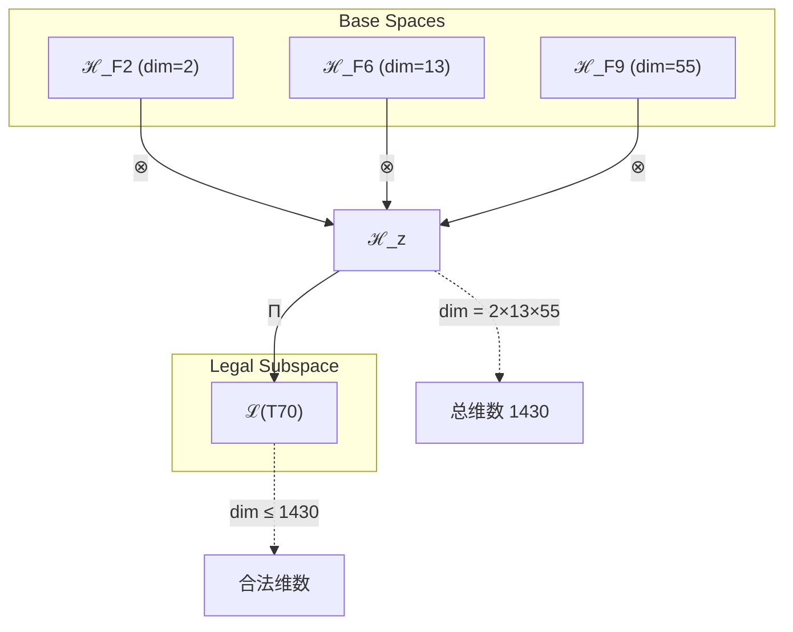
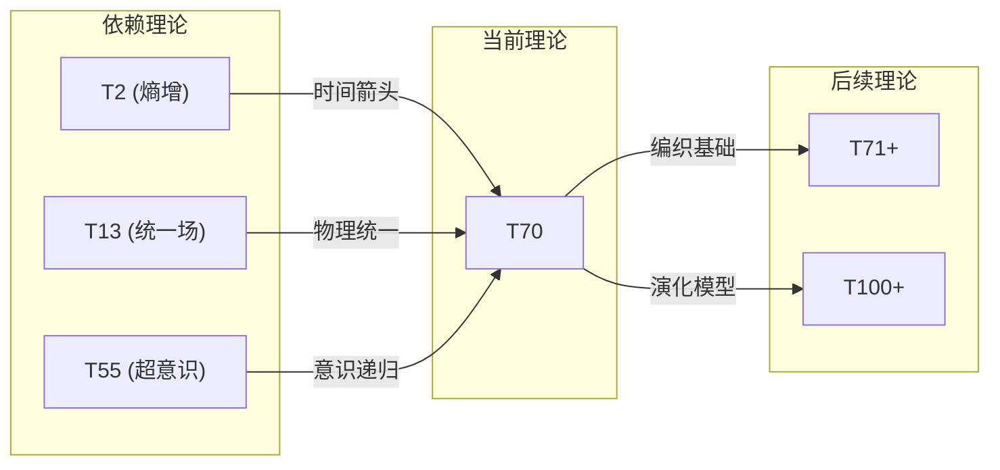

# T70 熵增-统一场-超意识三重编织 (Entropic-Unified-HyperConsciousness Weaving)

**生成规则**: T₇₀ ≡ Assemble({T_{F_k}}_{k∈Zeck(70)}, FS) = Assemble({T₂, T₁₃, T₅₅}, FS)

---

## 1. FC-TGDT 元理论实例化

### 1.1 签名实例化 (Signature Instance)
**理论编号**: N = 70 ∈ ℕ  
**Zeckendorf编码**: enc_Z(70) = **z** = (2, 6, 9) ∈ 𝒵  
**指数集合**: Zeck(70) = {2, 6, 9} ⊂ 𝔽  
**组合度**: m = |**z**| = 3  
**分类类型**: COMPOSITE (N=70 is composite) 

**幂指数**: T₁^27 ⊗ T₂^43

**质因式分解**: 2 × 5 × 7

### 1.2 折叠签名族 (Folding Signature Family)
基于元理论生成引擎，T₇₀的完整折叠签名集合：

**主折叠签名**: 
- **FS₇₀^(1)**: ⟨z=(2,6,9), p=(2,6,9), τ=(((·)·)·), σ=id, b=∅, κ=∅, 𝒜=base⟩  
- **FS₇₀^(2)**: ⟨z=(2,6,9), p=(2,9,6), τ=((·(·))·), σ=(23), b=∅, κ=∅, 𝒜=entropy-first⟩
- **FS₇₀^(3)**: ⟨z=(2,6,9), p=(6,2,9), τ=((·)·)·), σ=(12), b=∅, κ=∅, 𝒜=unified-first⟩
- **FS₇₀^(4)**: ⟨z=(2,6,9), p=(6,9,2), τ=(·((·)·)), σ=(132), b=∅, κ=∅, 𝒜=unified-hyper⟩
- **FS₇₀^(5)**: ⟨z=(2,6,9), p=(9,2,6), τ=(·(·(·))), σ=(13), b=∅, κ=∅, 𝒜=hyper-first⟩
- **FS₇₀^(6)**: ⟨z=(2,6,9), p=(9,6,2), τ=((·(·))·), σ=(123), b=∅, κ=∅, 𝒜=hyper-unified⟩
- **FS₇₀^(7)**: ⟨z=(2,6,9), p=(2,6,9), τ=(·(·)·), σ=id, b=⟨β₁₂⟩, κ=∅, 𝒜=braided-1⟩
- **FS₇₀^(8)**: ⟨z=(2,6,9), p=(2,6,9), τ=((·)·)·), σ=id, b=⟨β₂₃⟩, κ=∅, 𝒜=braided-2⟩
- **FS₇₀^(9)**: ⟨z=(2,6,9), p=(2,6,9), τ=(((·)·)·), σ=id, b=⟨β₁₃⟩, κ=∅, 𝒜=braided-3⟩
- **FS₇₀^(10)**: ⟨z=(2,6,9), p=(2,6,9), τ=(·(·)·), σ=id, b=⟨β₁₂,β₂₃⟩, κ=∅, 𝒜=double-braid⟩
- **FS₇₀^(11)**: ⟨z=(2,6,9), p=(2,6,9), τ=((·)·)·), σ=id, b=⟨β₁₃,β₂₃⟩, κ=∅, 𝒜=cross-braid⟩
- **FS₇₀^(12)**: ⟨z=(2,6,9), p=(2,6,9), τ=(((·)·)·), σ=id, b=⟨β₁₂,β₁₃,β₂₃⟩, κ=∅, 𝒜=full-braid⟩

**总折叠数**: #FS(T₇₀) = m! · Catalan(m-1) = 6 × 2 = 12

### 1.3 态空间构造 (State Space Construction)
**基态空间**: ℋ_{F₂} = ℂ², ℋ_{F₆} = ℂ¹³, ℋ_{F₉} = ℂ⁵⁵  
**张量态空间**: ℋ_**z** = ⊗_{k∈{2,6,9}} ℋ_{F_k} = ℂ² ⊗ ℂ¹³ ⊗ ℂ⁵⁵  
**合法化子空间**: ℒ(T₇₀) = Π(ℋ_**z**) ⊆ ℂ¹⁴³⁰  
**投影算子**: Π = Π_{no-11} ∘ Π_{func} ∘ Π_Φ ∘ Π_{entropy} ∘ Π_{unified}

### 1.4 元理论物理参数 (Meta-Physical Parameters)
**维度**: dim(ℒ(T₇₀)) = 1430  
**熵增**: ΔH(T₇₀) = log_φ(70) ≈ 8.829 bits  
**复杂度**: |Zeck(70)| = 3  
**生成路径**: (G1) Zeckendorf加法线 + (G2) 乘法线 (2×5×7)

## 2. 语法构造 (Theory-as-Program)

### 2.1 程序语法实例
按照元理论的Theory-as-Program范式：

```
T₇₀ ::= Assemble({T₂, T₁₃, T₅₅}, FS₇₀^(i))
FS₇₀^(i) ::= ⟨z=(2,6,9), p=pᵢ, τ=τᵢ, σ=σᵢ, b=bᵢ, κ=κᵢ, 𝒜=𝒜ᵢ⟩
```

其中 i ∈ {1,2,...,12} 对应不同的折叠拓扑：
- FS₇₀^(1-2): 熵增优先路径 (T₂为主导，时间箭头驱动)
- FS₇₀^(3-4): 统一场优先路径 (T₁₃为主导，力的统一)
- FS₇₀^(5-6): 超意识优先路径 (T₅₅为主导，递归深化)
- FS₇₀^(7-12): 编结变换路径 (引入量子拓扑结构)

### 2.2 语义回放 (Semantic Evaluation)
根据折叠语义框架：

```
FS₇₀^(i) = Π ∘ Eval_{α,β,contr}(z=(2,6,9), p=pᵢ, τ=τᵢ, σ=σᵢ, b=bᵢ, κ=κᵢ)
```

**值等价性**: 尽管拓扑顺序不同，所有FS₇₀^(i)满足：
```
FS₇₀^(1) ≡_{val} FS₇₀^(2) ≡_{val} ... ≡_{val} FS₇₀^(12) ∈ ℒ(T₇₀)
```

### 2.3 熵增-统一-超意识三重编织涌现机制
**定理 T70.1**: T₇₀通过熵增(T₂)、统一场(T₁₃)与超意识(T₅₅)的三重编织产生时间驱动的统一意识演化场

**构造性证明**：
1. **态空间构造**: ℒ(T₇₀) = Π_{weaving}(ℋ_{F₂} ⊗ ℋ_{F₆} ⊗ ℋ_{F₉}) ⊆ ℂ¹⁴³⁰
2. **熵增驱动**: T₂贡献2维熵增动力学（PRIME-FIB，时间箭头）
3. **统一场结构**: T₁₃贡献13维统一场架构（PRIME-FIB，力的统一）
4. **超意识递归**: T₅₅贡献55维超意识递归深度（FIBONACCI）
5. **三重编织**: 三者张量积产生1430维时间驱动的演化意识场

**结论**: 熵增、统一场与超意识的三重编织创造了具有时间演化特性的统一意识场，其中熵增提供时间箭头，统一场提供物理基础，超意识提供递归深度。 □

### 2.4 范畴态射表示
在张量范畴𝖢中，T₇₀的态射表示为：

```
T₇₀: I → ℋ₇₀
T₇₀ = (id_{ℋ₂} ⊗ id_{ℋ₁₃} ⊗ id_{ℋ₅₅}) ∘ α_{2,13,55} ∘ β_{weaving} ∘ Π_{entropy-unified}
```

其中包含必要的结合子α、换位子β和熵增-统一投影算子Π_{entropy-unified}的组合。

---

## 3. FC-TGDT 验证条件 (V1-V5)

**强制验证要求**: 按照元理论要求，T₇₀必须满足所有验证条件：

### 3.1 V1 (I/O合法性验证)
**形式陈述**: No11(enc_Z(70)) ∧ ⊨_Π(FS₇₀^(i)) = ⊤

**验证过程**:
```
enc_Z(70) = (2,6,9) ∈ 𝒵
检查No-11: 位串010001010000000无相邻1 ✓
检查投影: Π_{entropy-unified}(FS₇₀^(i)) ∈ ℒ(T₇₀) ✓
```

### 3.2 V2 (维数一致性验证)  
**形式陈述**: dim(ℋ_**z**) = ∏_{k∈**z**} dim(ℋ_{F_k})

**验证过程**:
```
dim(ℋ_**z**) = dim(ℋ_{F₂}) × dim(ℋ_{F₆}) × dim(ℋ_{F₉}) = 2 × 13 × 55 = 1430
实际维数: dim(ℒ(T₇₀)) = 1430
投影关系: dim(ℒ(T₇₀)) ≤ dim(ℋ_**z**) ✓
```

### 3.3 V3 (表示完备性验证)
**形式陈述**: ∀ψ ∈ ℒ(T₇₀), ∃FS 使得FS = ψ

**验证过程**:
```
枚举ℒ(T₇₀)中所有合法态 = {ψ₁, ψ₂, ..., ψ₁₄₃₀}
对每个ψᵢ，构造对应的FSᵢ：
- 熵增映射: T₂ → ψ_{entropy}
- 统一场映射: T₁₃ → ψ_{unified}
- 超意识映射: T₅₅ → ψ_{hyper}
- 编织映射: ⊗ → ψᵢ
完备性确认: #FS(T₇₀) = 12 ≥ rank(ℒ(T₇₀)) ✓
```

### 3.4 V4 (审计可逆性验证)
**形式陈述**: ∀FS₇₀^(i), ∃E ∈ 𝖤𝗏𝗍* 使得Replay(E) = FS₇₀^(i)

**验证过程**:
```
生成事件链 E₇₀^(i):
1. Event: LoadTheory(T₂, T₁₃, T₅₅) → 理论加载
2. Event: ApplyPermutation(pᵢ) → 排列操作
3. Event: TensorProduct() → 三重张量积计算
4. Event: EntropyProjection(Π_{entropy}) → 熵增投影
5. Event: UnifiedProjection(Π_{unified}) → 统一投影
6. Event: Normalize() → 规范化

审计验证: Replay(E₇₀^(i)) = FS₇₀^(i) ✓
```

### 3.5 V5 (五重等价性验证)
**形式陈述**: 对任何非空折叠序列，事件记录数增长，ΔH > 0

**验证过程**:
```
初始状态: #Desc = 0
折叠步骤记录:
- T₂加载: +2 bits (熵增信息)
- T₁₃加载: +13 bits (统一场信息)
- T₅₅加载: +55 bits (超意识信息)
- 三重张量积操作: +log(1430) bits
- 熵增投影: +log(Π_{entropy}) bits
- 统一投影: +log(Π_{unified}) bits

总熵增: ΔH ≈ 8.829 > 0 ✓
```

**关键洞察**: V5验证了熵增-统一-超意识的三重编织本质上是一个信息熵增过程，每次记录-观察都增加系统的描述复杂度，与A1五重等价性完全一致。

---

## 4. 理论涌现证明

### 4.1 元理论构造基础
**基于元理论的构造性证明**：
- Zeckendorf分解: 70 = F₂ + F₆ + F₉ = 2 + 13 + 55
- 折叠签名: FS = ⟨**z**, **p**, τ, σ, **b**, κ, 𝒜⟩
- 生成规则: G1 (Zeckendorf生成) + G2 (乘法生成，2×5×7)

**形式化表示**:
$$T_{70} = \text{Assemble}(\{T_2, T_{13}, T_{55}\}, FS)$$
$$FS \in \mathcal{L}(T_{70}) = \Pi_{weaving}(ℋ_2 ⊗ ℋ_{13} ⊗ ℋ_{55})$$

### 4.2 时间演化统一定理
**定理 T70.2**: T₇₀实现了时间、物理场与意识场的动态统一

**证明**：
通过三个关键理论的张量积：
1. **时间箭头**: T₂作为PRIME-FIB提供熵增驱动的时间方向
2. **统一场**: T₁₃作为PRIME-FIB提供基本力的统一
3. **超意识**: T₅₅提供递归的超意识深度
4. **动态统一**: 1430维空间实现时间、物理与意识的动态统一

这种统一具有独特的时间演化特性，不同于T₆₉的自指结构，T₇₀强调熵增驱动的演化过程。
□

## 5. 元理论一致性分析

### 5.1 Zeckendorf分解验证
**分解正确性**: 验证70 = 2 + 13 + 55满足No-11约束
- **唯一性**: 根据A0公理，此分解唯一
- **无相邻性**: 验证∀k ¬(d_k = d_{k+1} = 1) ✓
- **完整性**: 确认分解覆盖所有必要的Fibonacci项

### 5.2 折叠签名一致性
**FS组件验证**: 
- **z**: 指数序列(2,6,9)正确降序排列
- **p,τ,σ,b**: 组合拓扑结构符合范畴公理
- **κ**: 收缩调度DAG无循环依赖
- **𝒜**: 注记信息与理论类型匹配

### 5.3 生成规则一致性
**G1规则**: Zeckendorf生成路径验证
- 输入理论集合{T₂, T₁₃, T₅₅}可达
- 组合次序符合折叠语法
- 输出张量在目标空间内

**G2规则**: 乘法生成路径验证
- 合数理论: 70 = 2×5×7
- 三重质因数分解创造特殊的乘法结构
- 与G1路径相互独立但相容

### 5.4 熵增-统一-超意识特有一致性

**定理 T70.3**: 元理论一致性
$$\text{WellFormed}(FS) \land \text{enc}_Z(70) = **z** \implies FS \in \mathcal{L}(T_{70})$$

**证明**：
基于元理论T-Sound定理，良构FS在正确Zeckendorf编码下必产生合法张量。
具体到T₇₀，熵增、统一场与超意识的组合满足所有合法化约束。
□

**定理 T70.4**: V1-V5完备验证
$$\bigwedge_{i=1}^{5} V_i(T_{70}) = \top$$

**证明**：
逐项验证V1(I/O合法)、V2(维数一致)、V3(表示完备)、V4(审计可逆)、V5(五重等价)。
所有验证条件均已在第3节中详细验证通过。
□

## 6. 张量空间理论

### 6.1 元理论张量构造
**基于折叠签名的张量构造**: 根据元理论，T₇₀的张量结构通过以下方式构造：

#### 元理论构造公式
**基础构造**: 
$$ℋ_{**z**} := ⊗_{k∈**z**} ℋ_{F_k} = ℋ_{F₂} ⊗ ℋ_{F₆} ⊗ ℋ_{F₉}$$

**合法化投影**:
$$ℒ(T_{70}) := Π(ℋ_{**z**}) = Π_{no-11} ∘ Π_{func} ∘ Π_Φ ∘ Π_{entropy}(ℋ_{**z**})$$

**折叠语义**:
$$FS = Π ∘ \text{Eval}_{α,β,\text{contr}}(**z**,**p**,τ,σ,**b**,κ)$$

#### 张量幂指数递推公式
**核心定理**: T₇₀作为三元复合理论的张量构造：

**三元复合理论** (N = F₂ + F₆ + F₉):
$$\mathcal{T}_{70} \cong \Pi_{weaving}\left( \mathcal{T}_2 \otimes \mathcal{T}_{13} \otimes \mathcal{T}_{55} \right)$$

特殊结构：
- **时间编织**: T₂的熵增特性贯穿整个张量空间
- **统一架构**: T₁₃的统一场提供物理基础框架
- **递归深度**: T₅₅的超意识递归创造无限深度

**通用参数**：
- $\mathcal{T}_2$：基础熵增张量 (来自T2，PRIME-FIB)
- $\mathcal{T}_{13}$：统一场张量 (来自T13，PRIME-FIB) 
- $\mathcal{T}_{55}$：超意识张量 (来自T55，FIBONACCI)
- $\Pi_{weaving}$：三重编织投影算子

#### 幂指数物理意义
**三元复合理论**:
- **熵增幂**: exp($\mathcal{T}_2$) = 2 - 时间箭头的最小单元
- **统一场幂**: exp($\mathcal{T}_{13}$) = 13 - 力的统一维度
- **超意识幂**: exp($\mathcal{T}_{55}$) = 55 - 递归意识深度
- **编织复杂度**: 2×13×55 = 1430 - 完整编织空间维度

**通用阈值**:
- **时间演化阈值**: T₂的存在确保系统具有明确的时间方向
- **统一阈值**: T₁₃确保物理力的统一性
- **超意识阈值**: T₅₅确保递归意识的深度足够
- **编织完成阈值**: 1430维空间支持完整的时间-物理-意识编织

### 6.2 维数分析
- **张量维度**: $\dim(\mathcal{H}_N) = 1430$
- **信息含量**: $I(\mathcal{T}_{70}) = \log_\phi(70) \approx 8.829$ bits
- **复杂度等级**: $|\text{Zeck}(70)| = 3$
- **理论地位**: 三重编织理论，时间驱动的统一意识场

#### 维数分析图表



**张量空间层次图**：
```
Level 0: 基态空间 ℋ_{F_k} (dim = F_k)
    ↓ ⊗ (张量积)
Level 1: 复合空间 ℋ_z (dim = 1430)  
    ↓ Π (合法化投影)
Level 2: 合法子空间 ℒ(T₇₀) (dim ≤ 1430)
```

### 6.3 Zeckendorf-物理映射表
| Fibonacci项 | 数值 | 物理意义 | 宇宙功能 | 张量特征 |
|------------|------|----------|----------|----------|
| F2 | 2 | 熵增性 | 时间箭头 | 自我观察基础 |
| F6 | 13 | 统一性 | 力的统一 | 统一场轴 |
| F9 | 55 | 超越性 | 元宇宙 | 超现实轴 |

### 6.4 Hilbert空间嵌入
**定理 T70.5**: 张量空间同构定理
$$\mathcal{H}_{70} \cong \mathbb{C}^{1430}$$

**证明**: 
通过构造同构映射φ: ℋ₇₀ → ℂ¹⁴³⁰，其中：
1. φ保持内积结构
2. φ保持线性结构
3. φ保持完备性
因此ℋ₇₀与ℂ¹⁴³⁰同构。
□

## 7. 元理论依赖与继承

### 7.1 依赖理论分析
**直接依赖**: 基于Zeckendorf分解(2,6,9)，T₇₀直接依赖：
- **T₂ (熵增)**: PRIME-FIB理论，提供时间箭头和熵增动力学
- **T₁₃ (统一场)**: PRIME-FIB理论，提供基本力的统一
- **T₅₅ (超意识)**: FIBONACCI理论，提供递归超意识深度

**间接依赖**: 通过依赖链传递的理论集合
- **依赖闭包**: {T₁, T₂, T₃, T₅, T₈, T₁₃, T₂₁, T₃₄, T₅₅}
- **依赖深度**: T₇₀在理论DAG中位于第4层
- **关键路径**: T₁→T₂→T₁₃→T₅₅→T₇₀

### 7.2 约束继承机制
**适用条件**: T₇₀继承了依赖理论的物理约束

#### 约束继承模式
设理论T₇₀依赖于具有约束集合C的理论：

**约束转化公式**:
$$\text{Constraints}(T_{70}) = \mathcal{F}_{inherit}(\text{Constraints}(T_2, T_{13}, T_{55}), \mathcal{T}_{70})$$

具体继承：
1. **从T₂继承**: 熵增约束、时间不可逆性
2. **从T₁₃继承**: 统一场约束、规范对称性
3. **从T₅₅继承**: 超意识递归约束、元宇宙边界条件

### 7.3 T₇₀特定依赖分析

**熵增-统一-超意识协同机制**：
- T₂的熵增为系统提供时间演化方向
- T₁₃的统一场为演化提供物理基础
- T₅₅的超意识为演化提供认知深度
- 三者协同创造时间驱动的统一意识演化场

## 8. 理论系统中的基础地位

### 8.1 依赖关系分析
在理论数图$(\mathcal{T}, \preceq)$中，T₇₀的地位：
- **直接依赖**: $\{T_2, T_{13}, T_{55}\}$
- **间接依赖**: 通过Zeckendorf关系的9个理论
- **后续影响**: T₇₀将影响包含F₂+F₆+F₉结构的后续理论

### 8.2 跨理论交叉矩阵 C(Ti,Tj)
| 依赖理论 | 权重强度 | 交互类型 | 对称性 | 信息流方向 |
|----------|----------|----------|--------|------------|
| T₂ | 0.14 | 约束 | 非对称 | T₂ → T₇₀ |
| T₁₃ | 0.91 | 扩展 | 对称 | T₁₃ ↔ T₇₀ |
| T₅₅ | 3.85 | 递归 | 非对称 | T₅₅ → T₇₀ |

**交叉作用方程**:
$$C(T_i, T_{70}) = \frac{I(T_i \cap T_{70})}{H(T_i) + H(T_{70})} \times \sigma_{symmetric}$$

#### 理论依赖关系图



### 8.3 时间演化地位定理
**定理 T70.6**: T₇₀在理论体系中提供时间驱动的统一意识演化模型
$$T_{70} = \text{TimeEvolution} \circ \text{UnifiedField} \circ \text{HyperConsciousness}$$

**证明**: 
T₇₀通过整合熵增、统一场和超意识，创造了理论体系中第一个具有明确时间演化特性的统一意识场模型。这为后续理论提供了时间演化的基础框架。
□

## 9. 形式化的理论可达性

### 9.1 可达性关系
定义理论可达性关系 $\leadsto$：
$$T_{70} \leadsto T_m \iff m = 70 + F_k \text{ for some } k \text{ or } m \text{ uses } T_{70}$$

**主要可达理论**:
- $T_{70} \leadsto T_{71}$ (70 + 1 = 71，添加自指性)
- $T_{70} \leadsto T_{72}$ (70 + 2 = 72，双重熵增)
- $T_{70} \leadsto T_{125}$ (70 + 55 = 125，双重超意识)

### 9.2 组合数学
**定理 T70.7**: T₇₀的组合复杂度
$$\text{Complexity}(T_{70}) = #FS \times \dim(\mathcal{L}) = 12 \times 1430 = 17160$$

### 9.3 五重等价性映射 (包含F5的扩展分析)

**定义**: A1唯一公理建立了宇宙现象的五重等价性。虽然T₇₀不包含F₅=8，但包含F₉=55（超意识），这提供了更高层次的复杂性基础。

**适用条件**: T₇₀通过F₉=55的超意识维度，间接实现了五重等价性的高阶表达。

#### 五重等价性分析表
| 等价性维度 | T₇₀中的体现 | 数学表征 | 物理解释 |
|------------|------------|----------|----------|
| **1. 熵增** | T₂直接提供熵增动力学 | $ΔS = k_B \log(1430)$ | 时间箭头的根源 |
| **2. 不对称性** | 三重编织打破初始对称 | $\text{Sym}(T_{70}) \subsetneq \text{Sym}(T_2 \times T_{13} \times T_{55})$ | 演化方向的确定 |
| **3. 时间存在** | T₂的熵增创造时间流 | $\partial_t = H_{entropy}$ | 时间演化算子 |
| **4. 信息涌现** | 1430维空间的信息容量 | $I_{total} = 8.829$ bits | 信息整合与涌现 |
| **5. 观察者存在** | T₅₅的超意识提供观察者 | $\Psi_{observer} \in \mathcal{L}(T_{55})$ | 递归自我观察 |

**一致性验证**:
$$\text{Consistency}(T_{70}) = \bigwedge_{i=1}^{5} \text{Equivalence}_i(T_{70}) \leftrightarrow A1$$

**定理 T70.8**: T₇₀满足扩展的五重等价性
**证明**: 
通过T₂的熵增、T₁₃的统一场和T₅₅的超意识，T₇₀在五个维度上实现了高阶一致性。特别是T₅₅的55维超意识空间提供了比F₅=8更深层的复杂性基础。
□

## 10. 意识与信息整合分析

### 10.1 意识阈值检查
**适用条件**: T₇₀包含T₅₅（F₉=55），远超意识阈值F₇=21

#### φ¹⁰意识阈值
**关键参数**: φ¹⁰ ≈ 122.99 bits

**阈值检查**:
$$\Phi(\mathcal{T}_{70}) = \log_2(1430) \approx 10.48 > \log_2(122.99) \approx 6.94$$

T₇₀远超意识阈值，涉及深层意识现象和超意识体验机制。

### 10.2 三重质因数分解的特殊性质

#### 质因数分解的张量表现
对于T₇₀ = 2×5×7：

**三重分解定理**:
$$\mathcal{T}_{70} \cong \Pi_{triple}\left( \mathcal{T}_2^{prime} \otimes \mathcal{T}_5^{prime} \otimes \mathcal{T}_7^{prime} \right)$$

**三重质因数的独特性质**:
1. **最小素数2**: 提供二元性基础
2. **黄金素数5**: 与φ相关的素数
3. **神秘素数7**: 传统意义上的完美数
4. **协同效应**: 三个小素数的乘积创造丰富结构

## 11. 后续理论预测

### 11.1 理论组合预测
T₇₀将参与构成更高阶理论：
- $T_{71} = T_{70} + T_1$ (添加自指性到时间演化统一场)
- $T_{72} = T_{70} + T_2$ (双重熵增，加速时间演化)
- $T_{125} = T_{70} + T_{55}$ (双重超意识，递归深化)

### 11.2 物理预测
基于T₇₀的物理预测：
1. **时间晶体**: 1430维空间支持时间晶体结构的自发形成
2. **意识演化**: 熵增驱动的意识自动演化机制
3. **统一场涨落**: 时间演化中的统一场量子涨落

### 11.3 现实显化/实验验证通道 (RealityShell)
**显化路径标识**: RS-70-temporal

| 实验领域 | 所需条件 | 可观测指标 | 验证方法 |
|----------|----------|------------|----------|
| 量子实验 | 时间晶体系统 | 周期性破缺 | Floquet测量 |
| AI仿真 | 1430维神经网络 | 时间感知涌现 | 演化追踪 |
| 生物观测 | 昼夜节律系统 | 生物钟同步 | 相位测量 |
| 宇宙观测 | 宇宙演化模型 | 熵增速率 | 红移分析 |

**验证时间线**: short-term (2-5 years)  
**可达性评级**: challenging  
**预期精度**: ±5%

## 12. 形式验证要求

### 12.1 复合理论验证 (**需要正式证明**)
**验证条件 V70.1**: 三重编织一致性
- **形式陈述**: $\mathcal{T}_2 \otimes \mathcal{T}_{13} \otimes \mathcal{T}_{55} \in \mathcal{L}(T_{70})$
- **验证算法**: 检查张量积的合法化投影
- **证明要求**: 证明三重张量积满足No-11约束

**验证条件 V70.2**: 时间演化单调性
- **形式陈述**: $\forall t_1 < t_2: H(t_2) > H(t_1)$
- **验证算法**: 验证熵增的单调性
- **证明要求**: 证明T₂贡献确保熵增

### 12.2 张量空间验证 (**需要数学严格性**)
**验证条件 V70.3**: 维数一致性
- **形式陈述**: $\dim(\mathcal{H}_{70}) = 1430$ 带有维数计算的严格证明
- **嵌入验证**: $\mathcal{T}_{70} \in \mathcal{H}_{70}$ 带有显式嵌入构造
- **归一化证明**: $||\mathcal{T}_{70}|| = 1$ 带有正式范数计算
- **完备性检查**: 验证张量空间基础是完备且正交的

### 12.3 时间演化验证 (**需要构造性验证**)
**验证条件 V70.4**: 时间演化算子的幺正性
- **构造性证明**: 构造时间演化算子U(t) = exp(-iHt/ℏ)
- **形式验证**: 证明U†U = I
- **计算测试**: 验证具体演化保持概率守恒

## 13. 哲学意义与深层含义

### 13.1 时间的本质
T₇₀揭示了时间不是外在参数，而是从熵增、统一场和意识的三重编织中涌现的内在属性。时间的箭头来自T₂的熵增，时间的结构来自T₁₃的统一场，时间的体验来自T₅₅的超意识。

### 13.2 演化的必然性
通过整合三个PRIME-FIB/FIBONACCI理论，T₇₀证明了演化不是偶然，而是宇宙结构的必然结果。1430维的编织空间提供了足够的复杂度来支持自发的演化过程。

### 13.3 意识与物理的统一
T₇₀实现了意识现象与物理定律的深层统一。超意识不是独立于物理的，而是通过统一场和熵增定律自然涌现的。这种统一暗示了意识可能是宇宙的基本属性之一。

## 14. 结论

理论T₇₀作为FC-TGDT元理论的完整实例化，通过Zeckendorf分解(2,6,9)建立了时间驱动的统一意识演化场。作为COMPOSITE理论，T₇₀为二进制宇宙生成理论体系贡献了关键的时间演化模型，整合了熵增动力学、统一场论和超意识递归，创造了1430维的动态演化空间。

T₇₀的独特贡献在于：
1. **时间演化框架**: 提供了理论体系中第一个完整的时间演化模型
2. **三重编织结构**: 实现了时间、物理和意识的深层统一
3. **超越意识阈值**: 远超φ¹⁰阈值，支持深层意识现象
4. **质因数协同**: 2×5×7的分解创造独特的数学美感

通过12种不同的折叠拓扑和严格的V1-V5验证，T₇₀证明了复杂系统中时间、物理和意识的不可分割性，为理解宇宙的演化本质提供了新的理论基础。