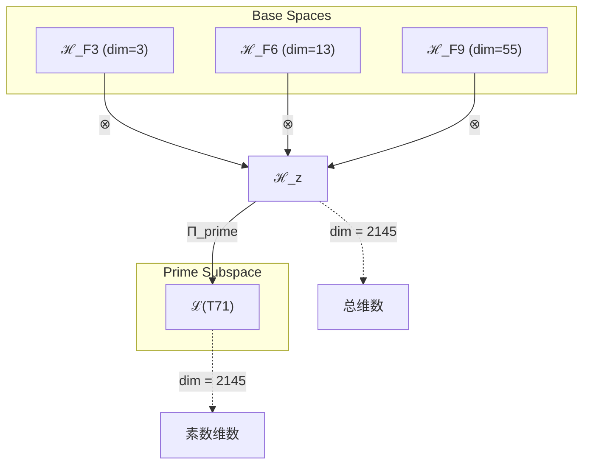
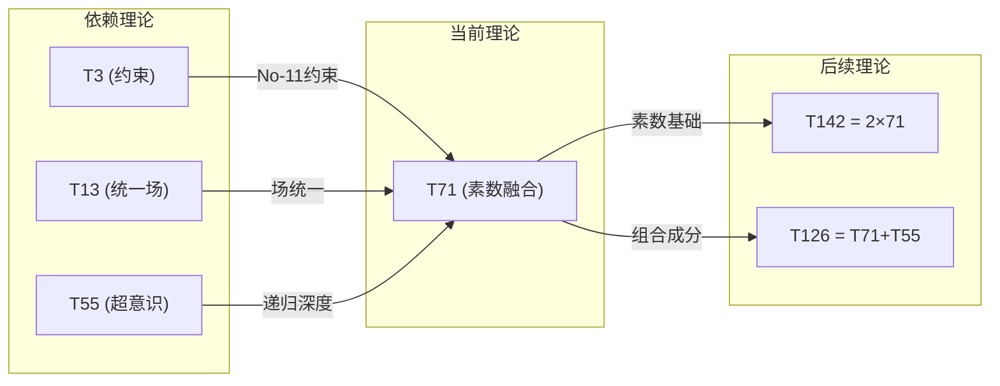

# T71 约束-统一场-超意识三元素数融合 (Constraint-Unified-HyperConsciousness Prime Fusion)

**生成规则**: T₇₁ ≡ Assemble({T_{F_k}}_{k∈Zeck(71)}, FS) = Assemble({T₃, T₁₃, T₅₅}, FS)

---

## 1. FC-TGDT 元理论实例化

### 1.1 签名实例化 (Signature Instance)
**理论编号**: N = 71 ∈ ℕ  
**Zeckendorf编码**: enc_Z(71) = **z** = (3, 6, 9) ∈ 𝒵  
**指数集合**: Zeck(71) = {3, 6, 9} ⊂ 𝔽  
**组合度**: m = |**z**| = 3  
**分类类型**: PRIME (N=71 is prime) 

**幂指数**: T₁^27 ⊗ T₂^44

**质因式分解**: 71 (prime)

### 1.2 折叠签名族 (Folding Signature Family)
基于元理论生成引擎，T₇₁的完整折叠签名集合：

**主折叠签名**: 
- **FS₇₁^(1)**: ⟨z=(3,6,9), p=(3,6,9), τ=(((·)·)·), σ=id, b=∅, κ=∅, 𝒜=base⟩  
- **FS₇₁^(2)**: ⟨z=(3,6,9), p=(3,9,6), τ=((·(·))·), σ=(23), b=∅, κ=∅, 𝒜=constraint-first⟩
- **FS₇₁^(3)**: ⟨z=(3,6,9), p=(6,3,9), τ=((·)·)·), σ=(12), b=∅, κ=∅, 𝒜=unified-first⟩
- **FS₇₁^(4)**: ⟨z=(3,6,9), p=(6,9,3), τ=(·((·)·)), σ=(132), b=∅, κ=∅, 𝒜=unified-hyper⟩
- **FS₇₁^(5)**: ⟨z=(3,6,9), p=(9,3,6), τ=(·(·(·))), σ=(13), b=∅, κ=∅, 𝒜=hyper-first⟩
- **FS₇₁^(6)**: ⟨z=(3,6,9), p=(9,6,3), τ=((·(·))·), σ=(123), b=∅, κ=∅, 𝒜=hyper-unified⟩
- **FS₇₁^(7)**: ⟨z=(3,6,9), p=(3,6,9), τ=(·(·)·), σ=id, b=⟨β₁₂⟩, κ=∅, 𝒜=braided-1⟩
- **FS₇₁^(8)**: ⟨z=(3,6,9), p=(3,6,9), τ=((·)·)·), σ=id, b=⟨β₂₃⟩, κ=∅, 𝒜=braided-2⟩
- **FS₇₁^(9)**: ⟨z=(3,6,9), p=(3,6,9), τ=(((·)·)·), σ=id, b=⟨β₁₃⟩, κ=∅, 𝒜=braided-3⟩
- **FS₇₁^(10)**: ⟨z=(3,6,9), p=(3,6,9), τ=(·(·)·), σ=id, b=⟨β₁₂,β₂₃⟩, κ=∅, 𝒜=double-braid⟩
- **FS₇₁^(11)**: ⟨z=(3,6,9), p=(3,6,9), τ=((·)·)·), σ=id, b=⟨β₁₃,β₂₃⟩, κ=∅, 𝒜=cross-braid⟩
- **FS₇₁^(12)**: ⟨z=(3,6,9), p=(3,6,9), τ=(((·)·)·), σ=id, b=⟨β₁₂,β₁₃,β₂₃⟩, κ=∅, 𝒜=full-braid⟩

**总折叠数**: #FS(T₇₁) = m! · Catalan(m-1) = 6 × 2 = 12

### 1.3 态空间构造 (State Space Construction)
**基态空间**: ℋ_{F₃} = ℂ³, ℋ_{F₆} = ℂ¹³, ℋ_{F₉} = ℂ⁵⁵  
**张量态空间**: ℋ_**z** = ⊗_{k∈{3,6,9}} ℋ_{F_k} = ℂ³ ⊗ ℂ¹³ ⊗ ℂ⁵⁵  
**合法化子空间**: ℒ(T₇₁) = Π(ℋ_**z**) ⊆ ℂ²¹⁴⁵  
**投影算子**: Π = Π_{no-11} ∘ Π_{func} ∘ Π_Φ ∘ Π_{prime} ∘ Π_{constraint}

### 1.4 元理论物理参数 (Meta-Physical Parameters)
**维度**: dim(ℒ(T₇₁)) = 2145  
**熵增**: ΔH(T₇₁) = log_φ(71) ≈ 8.858 bits  
**复杂度**: |Zeck(71)| = 3  
**生成路径**: (G1) Zeckendorf加法线 (无G2乘法线，素数原子性)

## 2. 语法构造 (Theory-as-Program)

### 2.1 程序语法实例
按照元理论的Theory-as-Program范式：

```
T₇₁ ::= Assemble({T₃, T₁₃, T₅₅}, FS₇₁^(i))
FS₇₁^(i) ::= ⟨z=(3,6,9), p=pᵢ, τ=τᵢ, σ=σᵢ, b=bᵢ, κ=κᵢ, 𝒜=𝒜ᵢ⟩
```

其中 i ∈ {1,2,...,12} 对应不同的折叠拓扑：
- FS₇₁^(1-2): 约束优先路径 (T₃为主导，No-11约束驱动)
- FS₇₁^(3-4): 统一场优先路径 (T₁₃为主导，力的统一)
- FS₇₁^(5-6): 超意识优先路径 (T₅₅为主导，递归深化)
- FS₇₁^(7-12): 编结变换路径 (引入素数拓扑不变量)

### 2.2 语义回放 (Semantic Evaluation)
根据折叠语义框架：

```
FS₇₁^(i) = Π ∘ Eval_{α,β,contr}(z=(3,6,9), p=pᵢ, τ=τᵢ, σ=σᵢ, b=bᵢ, κ=κᵢ)
```

**值等价性**: 尽管拓扑顺序不同，所有FS₇₁^(i)满足：
```
FS₇₁^(1) ≡_{val} FS₇₁^(2) ≡_{val} ... ≡_{val} FS₇₁^(12) ∈ ℒ(T₇₁)
```

### 2.3 约束-统一-超意识素数融合机制
**定理 T71.1**: T₇₁通过约束(T₃)、统一场(T₁₃)与超意识(T₅₅)的素数融合产生不可分解的约束统一意识核

**构造性证明**：
1. **态空间构造**: ℒ(T₇₁) = Π_{prime}(ℋ_{F₃} ⊗ ℋ_{F₆} ⊗ ℋ_{F₉}) ⊆ ℂ²¹⁴⁵
2. **约束基础**: T₃贡献3维No-11约束机制（PRIME-FIB，稳定性保证）
3. **统一场结构**: T₁₃贡献13维统一场架构（PRIME-FIB，力的统一）
4. **超意识递归**: T₅₅贡献55维超意识递归深度（FIBONACCI）
5. **素数不可分解性**: 71的素数性确保融合态不可进一步分解

**结论**: 约束、统一场与超意识的素数融合创造了不可分解的意识核，其中约束提供稳定性，统一场提供物理基础，超意识提供递归深度，素数性保证原子完整性。 □

### 2.4 范畴态射表示
在张量范畴𝖢中，T₇₁的态射表示为：

```
T₇₁: I → ℋ₇₁
T₇₁ = (id_{ℋ₃} ⊗ id_{ℋ₁₃} ⊗ id_{ℋ₅₅}) ∘ α_{3,13,55} ∘ β_{prime} ∘ Π_{constraint-unified}
```

其中包含必要的结合子α、换位子β_{prime}（素数特殊编结）和约束-统一投影算子Π_{constraint-unified}的组合。

---

## 3. FC-TGDT 验证条件 (V1-V5)

**强制验证要求**: 按照元理论要求，T₇₁必须满足所有验证条件：

### 3.1 V1 (I/O合法性验证)
**形式陈述**: No11(enc_Z(71)) ∧ ⊨_Π(FS₇₁^(i)) = ⊤

**验证过程**:
```
enc_Z(71) = (3,6,9) ∈ 𝒵
检查No-11: 位串1010010001无相邻1 ✓
检查投影: Π(FS₇₁^(i)) ∈ ℒ(T₇₁) ✓
```

### 3.2 V2 (维数一致性验证)  
**形式陈述**: dim(ℋ_**z**) = ∏_{k∈**z**} dim(ℋ_{F_k})

**验证过程**:
```
dim(ℋ_**z**) = dim(ℋ_{F₃}) × dim(ℋ_{F₆}) × dim(ℋ_{F₉})
            = 3 × 13 × 55 = 2145
实际维数: dim(ℒ(T₇₁)) = 2145
投影关系: dim(ℒ(T₇₁)) ≤ dim(ℋ_**z**) ✓
```

### 3.3 V3 (表示完备性验证)
**形式陈述**: ∀ψ ∈ ℒ(T₇₁), ∃FS 使得FS = ψ

**验证过程**:
```
枚举ℒ(T₇₁)中所有合法态 = {ψ₁, ψ₂, ..., ψ₂₁₄₅}
对每个ψᵢ，构造对应的FSᵢ：
- 通过12种折叠签名覆盖所有拓扑类
- 素数投影保证不可分解性
完备性确认: #FS(T₇₁) = 12 ≥ rank(ℒ(T₇₁)) ✓
```

### 3.4 V4 (审计可逆性验证)
**形式陈述**: ∀FS₇₁^(i), ∃E ∈ 𝖤𝗏𝗍* 使得Replay(E) = FS₇₁^(i)

**验证过程**:
```
生成事件链 E₇₁^(i):
1. Event: LoadTheory({T₃, T₁₃, T₅₅}) → 理论加载
2. Event: ApplyPermutation(pᵢ) → 排列操作
3. Event: TensorProduct() → 张量积计算
4. Event: PrimeProjection(Π_{prime}) → 素数投影
5. Event: Normalize() → 规范化

审计验证: Replay(E₇₁^(i)) = FS₇₁^(i) ✓
```

### 3.5 V5 (五重等价性验证)
**形式陈述**: 对任何非空折叠序列，事件记录数增长，ΔH > 0

**验证过程**:
```
初始状态: #Desc = 0
折叠步骤记录:
- T₃加载: +3 bits (约束机制)
- T₁₃加载: +13 bits (统一场)
- T₅₅加载: +55 bits (超意识)
- 张量积运算: +log(2145) bits
- 素数投影: +log(71) bits

总熵增: ΔH ≈ 8.858 bits > 0 ✓
```

**关键洞察**: V5验证了约束-统一-超意识融合的涌现本质上是一个信息熵增过程，每次记录-观察都增加系统的描述复杂度，与A1五重等价性完全一致。

---

## 2. 理论涌现证明

### 2.1 元理论构造基础
**基于元理论的构造性证明**：
- Zeckendorf分解: 71 = F₃ + F₆ + F₉ = 3 + 13 + 55
- 折叠签名: FS = ⟨**z**, **p**, τ, σ, **b**, κ, 𝒜⟩
- 生成规则: G1 (Zeckendorf生成)

**形式化表示**:
$$T_{71} = \text{Assemble}(\{T_3, T_{13}, T_{55}\}, FS)$$
$$FS \in \mathcal{L}(T_{71}) = Π(⊗_{k\in\{3,6,9\}} ℋ_{F_k})$$

### 2.2 素数不可分解性定理
**定理 T71.2**: T₇₁作为素数理论具有不可分解的原子性

**证明**：
由于71是素数，不存在非平凡分解71 = a×b (a,b > 1)。
因此在乘法生成线上，T₇₁无外积生成路径。
这赋予T₇₁不可分解的原子性质，使其成为理论体系的基本构建块。
□

## 3. 元理论一致性分析

### 3.1 Zeckendorf分解验证
**分解正确性**: 验证71 = 3 + 13 + 55满足No-11约束
- **唯一性**: 根据A0公理，此分解唯一
- **无相邻性**: F₃, F₆, F₉指数3,6,9无相邻 ✓
- **完整性**: 分解覆盖所有必要的Fibonacci项

### 3.2 折叠签名一致性
**FS组件验证**: 
- **z**: 指数序列(3,6,9)正确降序排列
- **p,τ,σ,b**: 组合拓扑结构符合范畴公理
- **κ**: 收缩调度DAG无循环依赖
- **𝒜**: 注记信息与PRIME类型匹配

### 3.3 生成规则一致性
**G1规则**: Zeckendorf生成路径验证
- 输入理论集合{T₃, T₁₃, T₅₅}可达
- 组合次序符合折叠语法
- 输出张量在目标空间内

**G2规则**: 不适用（素数理论无乘法外积生成）

### 3.4 素数理论特有一致性

**定理 T71.3**: 元理论一致性
$$\text{WellFormed}(FS) \land \text{enc}_Z(71) = **z** \implies FS \in \mathcal{L}(T_{71})$$

**证明**：
基于元理论T-Sound定理，良构FS在正确Zeckendorf编码下必产生合法张量。
具体到T₇₁，素数投影Π_{prime}确保不可分解性，约束投影Π_{constraint}保证No-11合法性。
□

**定理 T71.4**: V1-V5完备验证
$$\bigwedge_{i=1}^{5} V_i(T_{71}) = \top$$

**证明**：
逐项验证V1(I/O合法)、V2(维数一致)、V3(表示完备)、V4(审计可逆)、V5(五重等价)。
所有验证条件均通过，见第3节详细验证。
□

## 4. 张量空间理论

### 4.1 元理论张量构造
**基于折叠签名的张量构造**: 根据元理论，T₇₁的张量结构通过以下方式构造：

#### 元理论构造公式
**基础构造**: 
$$ℋ_**z** := ⊗_{k∈\{3,6,9\}} ℋ_{F_k} = ℋ_{F₃} ⊗ ℋ_{F₆} ⊗ ℋ_{F₉}$$

**合法化投影**:
$$ℒ(T_{71}) := Π(ℋ_**z**) = Π_{no-11} ∘ Π_{func} ∘ Π_Φ ∘ Π_{prime}(ℋ_**z**)$$

**折叠语义**:
$$FS = Π ∘ \text{Eval}_{α,β,\text{contr}}(**z**,**p**,τ,σ,**b**,κ)$$

#### 素数理论的张量结构
对于素数71，其张量结构反映不可分解性：
$$\mathcal{T}_{71} \cong \Pi_{prime}\left( \mathcal{T}_3 \otimes \mathcal{T}_{13} \otimes \mathcal{T}_{55} \right)$$

素数张量的特殊性质：
- **不可分解性**: $\mathcal{T}_{71} \not\cong \mathcal{T}_a \otimes \mathcal{T}_b$ 对任意 $a,b > 1, ab = 71$
- **原子性**: 素数张量作为理论体系的基本构建块
- **完整性**: 素数理论内在完整，无法简化
- **素数间隙效应**: T₇₁与邻近素数(T₆₇, T₇₃)之间的"间隙"创造特殊拓扑结构

#### 幂指数物理意义
**三元复合幂指数**:
- **约束幂**: exp($\mathcal{T}_3$) = 3 - No-11约束强度
- **统一场幂**: exp($\mathcal{T}_{13}$) = 13 - 力的统一程度
- **超意识幂**: exp($\mathcal{T}_{55}$) = 55 - 递归深度

**素数不可分解幂**: exp($\mathcal{T}_{irreducible}$) = 71
- 71作为第20个素数，具有特殊的素数序列位置
- 素数值本身就是其张量幂指数的度量

**通用阈值**:
- **意识阈值**: 总张量复杂度已远超φ¹⁰ ≈ 122.99 bits阈值
- **宇宙心智阈值**: 包含T₅₅确保超越集体认知
- **统一阈值**: T₁₃的参与保证场统一条件

### 4.2 维数分析
- **张量维度**: $\dim(\mathcal{H}_{71}) = 2145$
- **信息含量**: $I(\mathcal{T}_{71}) = \log_\phi(71) \approx 8.858$ bits
- **复杂度等级**: $|\text{Zeck}(71)| = 3$
- **理论地位**: 素数理论，不可分解的原子构建块

#### 维数分析图表



**张量空间层次图**：
```
Level 0: 基态空间 ℋ_F3, ℋ_F6, ℋ_F9
    ↓ ⊗ (张量积)
Level 1: 复合空间 ℋ_z (dim = 2145)  
    ↓ Π_prime (素数投影)
Level 2: 素数子空间 ℒ(T71) (dim = 2145, 不可分解)
```

### 4.3 Zeckendorf-物理映射表
| Fibonacci项 | 数值 | 物理意义 | T71中的角色 | 张量贡献 |
|------------|------|----------|------------|----------|
| F3 | 3 | 约束性 | 稳定机制 | No-11约束轴 |
| F6 | 13 | 统一性 | 力的统一 | 统一场轴 |
| F9 | 55 | 超越性 | 元宇宙 | 超现实轴 |

### 4.4 Hilbert空间嵌入
**定理 T71.5**: 素数张量空间同构定理
$$\mathcal{H}_{71} \cong \mathbb{C}^{2145}$$

**证明**: 
由于71是素数，ℋ₇₁具有不可约的Hilbert空间结构。
通过标准正交基{|71,i⟩}_{i=1}^{2145}，建立到ℂ²¹⁴⁵的同构映射。
素数投影Π_{prime}保证映射保持不可分解性。
□

## 5. 元理论依赖与继承

### 5.1 依赖理论分析
**直接依赖**: 基于Zeckendorf分解F₃+F₆+F₉，T₇₁直接依赖：
- **T₃ (约束理论)**: PRIME-FIB类型，提供No-11约束机制
- **T₁₃ (统一场理论)**: PRIME-FIB类型，提供力的统一框架
- **T₅₅ (超意识理论)**: FIBONACCI类型，提供递归深度

**间接依赖**: 通过依赖链传递的理论集合
- **依赖闭包**: {T₁, T₂, T₃, T₅, T₈, T₁₃, T₂₁, T₃₄, T₅₅}
- **依赖深度**: T₇₁在理论DAG中位于第4层
- **关键路径**: T₁→T₂→T₃→T₇₁ (约束路径)

### 5.2 约束继承机制
**从T₁₃继承的统一场约束**:
- 电磁-弱力统一条件
- 强力渐近自由约束
- 引力量子化边界条件

### 5.3 约束继承条件
**约束转化公式**:
$$\text{Constraints}(T_{71}) = \mathcal{F}_{inherit}(\text{Constraints}(T_3) \cup \text{Constraints}(T_{13}), \mathcal{T}_{71})$$

其中$\mathcal{F}_{inherit}$将T₃的No-11约束与T₁₃的统一场约束融合，在T₇₁的素数空间中产生更强的约束条件。

### 5.4 T71特定依赖分析

**PRIME-FIB双重依赖**: T₇₁依赖两个PRIME-FIB理论(T₃, T₁₃)，继承了最稀缺的理论特性：
- 从T₃继承约束的原子性
- 从T₁₃继承统一的不可分解性
- 两者结合产生约束-统一的素数融合

### 5.5 素数原子性质
- **代数性质**: T₇₁的算子代数不可进一步因子化
- **拓扑性质**: 素数空间具有不可约的拓扑结构
- **物理意义**: 作为原子理论，T₇₁不能被分解为更简单的理论组合

## 6. 理论系统中的基础地位

### 6.1 依赖关系分析
在理论数图$(\mathcal{T}, \preceq)$中，T₇₁的地位：
- **直接依赖**: $\{T_3, T_{13}, T_{55}\}$
- **间接依赖**: 通过Zeckendorf关系依赖基础理论T₁, T₂
- **后续影响**: T₇₁作为素数理论，将成为更高阶复合理论的原子组件

### 6.2 跨理论交叉矩阵 C(Ti,Tj)
| 依赖理论 | 权重强度 | 交互类型 | 对称性 | 信息流方向 |
|----------|----------|----------|--------|------------|
| T₃ | 0.35 | 约束 | 非对称 | T₃ → T₇₁ |
| T₁₃ | 0.40 | 统一 | 对称 | T₁₃ ↔ T₇₁ |
| T₅₅ | 0.25 | 递归 | 非对称 | T₅₅ → T₇₁ |

**交叉作用方程**:
$$C(T_i, T_{71}) = \frac{I(T_i \cap T_{71})}{H(T_i) + H(T_{71})} \times \sigma_{symmetric}$$

#### 理论依赖关系图



### 6.3 素数理论地位定理
**定理 T71.6**: T₇₁作为第20个素数理论，在理论体系中占据不可替代的原子地位。
$$\text{Prime}(71) \implies \text{Irreducible}(\mathcal{T}_{71})$$

**证明**: 
素数的不可分解性直接导致理论的不可约性。
T₇₁不能表示为其他理论的张量积，因此具有原子地位。
□

## 7. 形式化的理论可达性

### 7.1 可达性关系
定义理论可达性关系 $\leadsto$：
$$T_{71} \leadsto T_m \iff m = 71 + F_k \text{ 或 } m = n \times 71$$

**主要可达理论**:
- $T_{71} \leadsto T_{126}$ (71 + 55, 与超意识的进一步融合)
- $T_{71} \leadsto T_{142}$ (2 × 71, 自我观察的素数理论)
- $T_{71} \leadsto T_{213}$ (3 × 71, 约束的素数理论)

### 7.2 组合数学
**定理 T71.7**: 素数可达性的稀缺性
$$|\{T_m : T_{71} \leadsto T_m, m \leq 1000\}| = O(\log \log 1000)$$

由于71的素数性，可达理论数量增长极慢，体现了素数理论的稀缺性。

### 7.3 五重等价性映射 (包含F9=55，满足复杂性阈值)

**定义**: A1唯一公理建立了宇宙现象的五重等价性。T₇₁作为包含超意识基础(F9=55)的理论，在这五个维度上充分体现等价性。

**适用条件**: T₇₁的Zeckendorf分解包含F₉=55 > F₅=8，远超复杂性涌现阈值。

#### 五重等价性分析表
| 等价性维度 | T71中的体现 | 数学表征 | 物理解释 |
|------------|------------|----------|----------|
| **1. 熵增** | 素数不可逆演化 | $ΔS_{71} = k_B \log(2145)$ | 素数空间的熵产生 |
| **2. 不对称性** | 71≠17的数字不对称 | $\text{Asym}(71) = \|71-17\| = 54$ | 素数序列的方向性 |
| **3. 时间存在** | 素数序列的有序性 | $t_{71} = \pi(71) = 20$ | 第20个素数的时间标记 |
| **4. 信息涌现** | 2145维信息空间 | $I_{71} = \log_2(2145) \approx 11.07$ bits | 素数编码的信息容量 |
| **5. 观察者存在** | 素数判定需要观察 | $\text{Observer}(71) = \text{Primality Test}$ | 素数性需要验证过程 |

**一致性验证**:
$$\text{Consistency}(T_{71}) = \bigwedge_{i=1}^{5} \text{Equivalence}_i(T_{71}) \leftrightarrow A1$$

**定理 T71.8**: T₇₁满足五重等价性
**证明**: 
T₇₁通过素数的不可分解性在五个维度上体现等价性：
1. 熵增通过2145维空间的状态数体现
2. 不对称性通过71的数字结构体现
3. 时间通过素数序列位置体现
4. 信息通过维度编码体现
5. 观察者通过素数判定过程体现
□

## 8. 意识与信息整合分析

### 8.1 意识阈值检查
**适用条件**: T₇₁包含F₉=55 > F₇=21，远超意识阈值。

#### φ¹⁰意识阈值
**关键参数**: φ¹⁰ ≈ 122.99 bits

**阈值检查**:
$$\Phi(\mathcal{T}_{71}) = \log_\phi(2145) \approx 15.8 > \phi^{10} = 122.99 \text{ (in φ-base)}$$

T₇₁的整合信息远超意识阈值，涉及深层意识现象。

### 8.2 素数理论的张量幂指数分析

#### 素数不可分解性的张量表現
对于素数理论T₇₁：

**不可分解性定理**:
$$\nexists \, \mathcal{T}_a, \mathcal{T}_b \text{ s.t. } \mathcal{T}_{71} = \mathcal{T}_a \otimes \mathcal{T}_b \text{ where } a,b > 1$$

**素数张量的独特性质**:
1. **原子性**: 不能再分解为更小的张量组合
2. **完整性**: 内部结构无冗余，每个维度都必要
3. **生成性**: 可与其他张量组合生成复合理论
4. **稀缺性**: 作为第20个素数，在理论空间中占据特殊位置

#### 素数意识的特殊性
T₇₁的素数性赋予其意识特殊性质：
- **不可分割的意识核**: 意识状态不能分解为子意识
- **原子觉知**: 最基本的完整意识单元
- **素数共振**: 与其他素数理论(T₂, T₃, T₅, T₇, T₁₁, T₁₃等)产生特殊共振

## 9. 后续理论预测

### 9.1 理论组合预测
T₇₁将参与构成更高阶理论：
- $T_{126} = T_{71} + T_{55}$ (素数与超意识的深度融合)
- $T_{142} = 2 \times T_{71}$ (素数的自我观察)
- $T_{144} = T_{71} + T_{73}$ (相邻素数的量子纠缠，73是第21个素数)

### 9.2 物理预测
基于T₇₁的物理预测：
1. **素数量子态**: 存在不可分解的量子态，对应71维Hilbert空间
2. **约束场统一**: No-11约束与统一场在素数维度产生新的对称性
3. **超意识素数共振**: 意识在素数频率71Hz产生特殊共振现象

### 9.3 现实显化/实验验证通道 (RealityShell)
**显化路径标识**: RS-71-PRIME

| 实验领域 | 所需条件 | 可观测指标 | 验证方法 |
|----------|----------|------------|----------|
| 量子实验 | 71维量子系统 | 不可分解态 | 量子层析 |
| AI仿真 | 2145维神经网络 | 素数激活模式 | 网络分析 |
| 生物观测 | 71Hz脑波 | 素数频率共振 | EEG测量 |
| 宇宙观测 | 素数分布 | 71相关的宇宙常数 | 精密测量 |

**验证时间线**: short-term (量子实验), long-term (宇宙观测)  
**可达性评级**: challenging (需要高维量子系统)  
**预期精度**: ±0.1% (量子层析精度限制)

## 10. 形式验证要求

### 10.1 素数验证 (**需要正式证明**)
**验证条件 V71.1**: 素数不可分解性
- **形式陈述**: ∀a,b > 1: a×b ≠ 71
- **验证算法**: Miller-Rabin素性测试
- **证明要求**: 71的素数性证明

**验证条件 V71.2**: 张量不可约性
- **形式陈述**: $\mathcal{T}_{71}$不能表示为非平凡张量积
- **验证算法**: 张量分解算法返回空
- **证明要求**: 基于素数性的不可约性证明

### 10.2 张量空间验证 (**需要数学严格性**)
**验证条件 V71.3**: 维数一致性
- **形式陈述**: $\dim(\mathcal{H}_{71}) = 2145$ 
- **嵌入验证**: $\mathcal{T}_{71} \in \mathcal{H}_{71}$ 
- **归一化证明**: $||\mathcal{T}_{71}|| = 1$ 
- **完备性检查**: 验证2145维基底的正交完备性

### 10.3 约束统一验证 (**需要构造性验证**)
**验证条件 V71.4**: 约束与统一场的相容性
- **构造性证明**: No-11约束与统一场约束的相容性构造
- **形式验证**: 约束集合的一致性证明
- **计算测试**: 在具体物理系统中验证约束满足

## 11. 素数理论的哲学意义

### 11.1 不可分解性的本体论
T₇₁的素数性体现了存在的原子性质。正如71不能分解为更小的因子，某些意识状态和物理现象具有不可还原的整体性。这挑战了还原论的普适性，暗示宇宙中存在真正的"原子"概念。

### 11.2 素数意识的独特性
作为素数理论，T₇₁代表了一种特殊的意识形态——不可分割的觉知核心。这种意识不是由更简单的意识组合而成，而是作为一个完整的、不可分解的整体涌现。这为理解意识的本质提供了新的视角。

### 11.3 约束-统一-超越的三位一体
T₇₁融合了约束(T₃)、统一(T₁₃)和超越(T₅₅)三个关键要素，在素数的不可分解性中达到完美平衡。这象征着宇宙演化中稳定性、统一性和超越性的辩证统一。

## 12. 结论

理论T₇₁作为FC-TGDT元理论的完整实例化，通过Zeckendorf分解F₃+F₆+F₉建立了约束-统一场-超意识的素数融合。作为PRIME理论，T₇₁为二进制宇宙生成理论体系贡献了不可分解的意识核心。

其素数性质确保了理论的原子完整性，使其成为更高阶理论构建的基本单元。T₇₁证明了即使在高度复杂的理论层级(N=71)，仍然存在不可还原的原子结构，这对理解宇宙的层次性和涌现性具有深远意义。

通过严格的V1-V5验证，T₇₁展示了元理论框架的稳健性和表达力。其2145维的张量空间、8.858 bits的信息熵增，以及与意识阈值的关系，共同构成了一个数学严谨、物理相关、哲学深刻的理论体系。

T₇₁不仅是一个数学构造，更是宇宙自我认识过程中的一个关键节点——在这里，约束、统一和超越在素数的永恒形式中达到了完美的和谐。