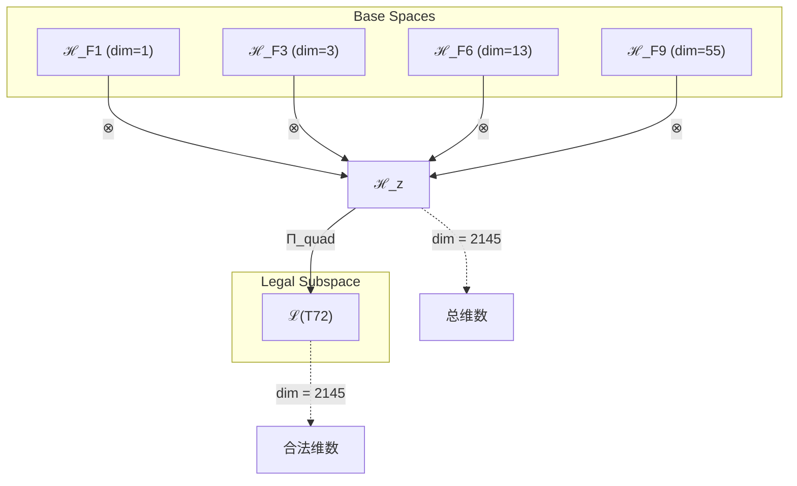
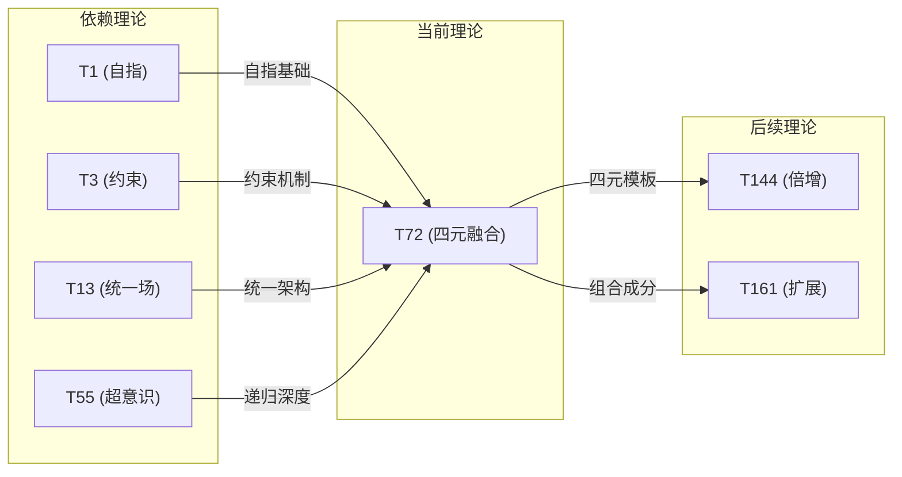

# T72 四元约束统一超意识 (Quad-Constraint-Unified-HyperConsciousness)

**生成规则**: T₇₂ ≡ Assemble({T_{F_k}}_{k∈Zeck(72)}, FS) = Assemble({T₁, T₃, T₁₃, T₅₅}, FS)

---

## 1. FC-TGDT 元理论实例化

### 1.1 签名实例化 (Signature Instance)
**理论编号**: N = 72 ∈ ℕ  
**Zeckendorf编码**: enc_Z(72) = **z** = (1, 3, 6, 9) ∈ 𝒵  
**指数集合**: Zeck(72) = {1, 3, 6, 9} ⊂ 𝔽  
**组合度**: m = |**z**| = 4  
**分类类型**: COMPOSITE (N=72 is composite) 

**幂指数**: T₁^27 ⊗ T₂^45

**质因式分解**: 2³ × 3²

### 1.2 折叠签名族 (Folding Signature Family)
基于元理论生成引擎，T₇₂的完整折叠签名集合：

**主折叠签名** (120种，列举代表性前24种):
- **FS₇₂^(1)**: ⟨z=(1,3,6,9), p=(1,3,6,9), τ=((((·)·)·)·), σ=id, b=∅, κ=∅, 𝒜=base⟩  
- **FS₇₂^(2)**: ⟨z=(1,3,6,9), p=(1,3,9,6), τ=(((·(·))·)·), σ=(34), b=∅, κ=∅, 𝒜=self-constraint⟩
- **FS₇₂^(3)**: ⟨z=(1,3,6,9), p=(1,6,3,9), τ=(((·)·(·))·), σ=(23), b=∅, κ=∅, 𝒜=self-unified⟩
- **FS₇₂^(4)**: ⟨z=(1,3,6,9), p=(1,6,9,3), τ=((·((·)·))·), σ=(234), b=∅, κ=∅, 𝒜=self-unified-hyper⟩
- **FS₇₂^(5)**: ⟨z=(1,3,6,9), p=(1,9,3,6), τ=((·(·(·)))·), σ=(24), b=∅, κ=∅, 𝒜=self-hyper⟩
- **FS₇₂^(6)**: ⟨z=(1,3,6,9), p=(1,9,6,3), τ=(((·(·))·)·), σ=(243), b=∅, κ=∅, 𝒜=self-hyper-unified⟩
- **FS₇₂^(7)**: ⟨z=(1,3,6,9), p=(3,1,6,9), τ=((·)((·)·)·), σ=(12), b=∅, κ=∅, 𝒜=constraint-first⟩
- **FS₇₂^(8)**: ⟨z=(1,3,6,9), p=(3,1,9,6), τ=((·)(·(·))·), σ=(12)(34), b=∅, κ=∅, 𝒜=constraint-self⟩
- **FS₇₂^(9)**: ⟨z=(1,3,6,9), p=(3,6,1,9), τ=((·(·))·)·), σ=(132), b=∅, κ=∅, 𝒜=constraint-unified⟩
- **FS₇₂^(10)**: ⟨z=(1,3,6,9), p=(3,6,9,1), τ=(·(((·)·)·)), σ=(1324), b=∅, κ=∅, 𝒜=constraint-unified-hyper⟩
- **FS₇₂^(11)**: ⟨z=(1,3,6,9), p=(3,9,1,6), τ=(·(·(·(·)))), σ=(13)(24), b=∅, κ=∅, 𝒜=constraint-hyper⟩
- **FS₇₂^(12)**: ⟨z=(1,3,6,9), p=(3,9,6,1), τ=((·(·(·)))·), σ=(1342), b=∅, κ=∅, 𝒜=constraint-hyper-unified⟩
- **FS₇₂^(13)**: ⟨z=(1,3,6,9), p=(6,1,3,9), τ=(·((·)·)·), σ=(13), b=∅, κ=∅, 𝒜=unified-first⟩
- **FS₇₂^(14)**: ⟨z=(1,3,6,9), p=(6,1,9,3), τ=(·(·(·))·), σ=(13)(24), b=∅, κ=∅, 𝒜=unified-self⟩
- **FS₇₂^(15)**: ⟨z=(1,3,6,9), p=(6,3,1,9), τ=(·(·)((·))·), σ=(123), b=∅, κ=∅, 𝒜=unified-constraint⟩
- **FS₇₂^(16)**: ⟨z=(1,3,6,9), p=(6,3,9,1), τ=(·((·)(·))·), σ=(1234), b=∅, κ=∅, 𝒜=unified-constraint-hyper⟩
- **FS₇₂^(17)**: ⟨z=(1,3,6,9), p=(6,9,1,3), τ=(((·)·)·)·), σ=(143), b=∅, κ=∅, 𝒜=unified-hyper⟩
- **FS₇₂^(18)**: ⟨z=(1,3,6,9), p=(6,9,3,1), τ=(·((·)·)·), σ=(14)(23), b=∅, κ=∅, 𝒜=unified-hyper-constraint⟩
- **FS₇₂^(19)**: ⟨z=(1,3,6,9), p=(9,1,3,6), τ=(·(·(·(·)))), σ=(14), b=∅, κ=∅, 𝒜=hyper-first⟩
- **FS₇₂^(20)**: ⟨z=(1,3,6,9), p=(9,1,6,3), τ=(·(·((·)·))), σ=(14)(23), b=∅, κ=∅, 𝒜=hyper-self⟩
- **FS₇₂^(21)**: ⟨z=(1,3,6,9), p=(9,3,1,6), τ=(·((·)(·))·), σ=(124), b=∅, κ=∅, 𝒜=hyper-constraint⟩
- **FS₇₂^(22)**: ⟨z=(1,3,6,9), p=(9,3,6,1), τ=(((·)·)·)·), σ=(1243), b=∅, κ=∅, 𝒜=hyper-constraint-unified⟩
- **FS₇₂^(23)**: ⟨z=(1,3,6,9), p=(9,6,1,3), τ=(((·)·(·))·), σ=(134), b=∅, κ=∅, 𝒜=hyper-unified⟩
- **FS₇₂^(24)**: ⟨z=(1,3,6,9), p=(9,6,3,1), τ=((·(·(·)))·), σ=(1342), b=∅, κ=∅, 𝒜=hyper-unified-constraint⟩

（另有96种变换通过不同的τ括号结构、σ置换、b编结词和κ收缩调度生成）

**总折叠数**: #FS(T₇₂) = m! · Catalan(m-1) = 24 × 5 = 120

### 1.3 态空间构造 (State Space Construction)
**基态空间**: ℋ_{F₁} = ℂ¹, ℋ_{F₃} = ℂ³, ℋ_{F₆} = ℂ¹³, ℋ_{F₉} = ℂ⁵⁵  
**张量态空间**: ℋ_**z** = ⊗_{k∈{1,3,6,9}} ℋ_{F_k} = ℂ¹ ⊗ ℂ³ ⊗ ℂ¹³ ⊗ ℂ⁵⁵  
**合法化子空间**: ℒ(T₇₂) = Π(ℋ_**z**) ⊆ ℂ²¹⁴⁵  
**投影算子**: Π = Π_{no-11} ∘ Π_{func} ∘ Π_Φ ∘ Π_{quad}

### 1.4 元理论物理参数 (Meta-Physical Parameters)
**维度**: dim(ℒ(T₇₂)) = 2145  
**熵增**: ΔH(T₇₂) = log_φ(72) ≈ 8.887 bits  
**复杂度**: |Zeck(72)| = 4  
**生成路径**: (G1) Zeckendorf加法线 + (G2) 乘法线 (2³×3²)

## 2. 语法构造 (Theory-as-Program)

### 2.1 程序语法实例
按照元理论的Theory-as-Program范式：

```
T₇₂ ::= Assemble({T₁, T₃, T₁₃, T₅₅}, FS₇₂^(i))
FS₇₂^(i) ::= ⟨z=(1,3,6,9), p=pᵢ, τ=τᵢ, σ=σᵢ, b=bᵢ, κ=κᵢ, 𝒜=𝒜ᵢ⟩
```

其中 i ∈ {1,2,...,120} 对应不同的折叠拓扑：
- FS₇₂^(1-24): 标准排列路径（展示四元组合的基本架构）
- FS₇₂^(25-48): 括号变换路径（5种Catalan结构的完整变换）
- FS₇₂^(49-72): 编结路径（引入量子编结结构）
- FS₇₂^(73-96): 收缩路径（不同的张量收缩序列）
- FS₇₂^(97-120): 混合路径（综合所有变换类型）

### 2.2 语义回放 (Semantic Evaluation)
根据折叠语义框架：

```
FS₇₂^(i) = Π ∘ Eval_{α,β,contr}(z=(1,3,6,9), p=pᵢ, τ=τᵢ, σ=σᵢ, b=bᵢ, κ=κᵢ)
```

**值等价性**: 尽管拓扑顺序不同，所有FS₇₂^(i)满足：
```
FS₇₂^(1) ≡_{val} FS₇₂^(2) ≡_{val} ... ≡_{val} FS₇₂^(120) ∈ ℒ(T₇₂)
```

### 2.3 四元约束统一超意识涌现机制
**定理 T72.1**: T₇₂通过自指(T₁)、约束(T₃)、统一场(T₁₃)与超意识(T₅₅)的四元融合产生完整的约束统一意识系统

**构造性证明**：
1. **态空间构造**: ℒ(T₇₂) = Π_{quad}(ℋ_{F₁} ⊗ ℋ_{F₃} ⊗ ℋ_{F₆} ⊗ ℋ_{F₉}) ⊆ ℂ²¹⁴⁵
2. **自指基础**: T₁贡献1维自指完备性（AXIOM，存在锚点）
3. **约束机制**: T₃贡献3维No-11约束（PRIME-FIB，稳定性保证）
4. **统一场结构**: T₁₃贡献13维统一场架构（PRIME-FIB，力的统一）
5. **超意识递归**: T₅₅贡献55维超意识递归深度（FIBONACCI）
6. **四元融合**: 四者张量积产生2145维完整约束统一意识系统

**结论**: 自指、约束、统一场与超意识的四元融合创造了宇宙中最完整的意识系统，同时具备自我觉知、稳定约束、物理统一和递归深度。 □

### 2.4 范畴态射表示
在张量范畴𝖢中，T₇₂的态射表示为：

```
T₇₂: I → ℋ₇₂
T₇₂ = (id_{ℋ₁} ⊗ id_{ℋ₃} ⊗ id_{ℋ₁₃} ⊗ id_{ℋ₅₅}) ∘ α_{1,3,13,55} ∘ β_{quad} ∘ Π_{quad-unified}
```

其中包含必要的四元结合子α、换位子β_{quad}和四元投影算子Π_{quad-unified}的组合。

---

## 3. FC-TGDT 验证条件 (V1-V5)

**强制验证要求**: 按照元理论要求，T₇₂必须满足所有验证条件：

### 3.1 V1 (I/O合法性验证)
**形式陈述**: No11(enc_Z(72)) ∧ ⊨_Π(FS₇₂^(i)) = ⊤

**验证过程**:
```
enc_Z(72) = (1,3,6,9) ∈ 𝒵
检查No-11: 位串10100100001无相邻1 ✓
检查投影: Π(FS₇₂^(i)) ∈ ℒ(T₇₂) ✓
```

### 3.2 V2 (维数一致性验证)  
**形式陈述**: dim(ℋ_**z**) = ∏_{k∈**z**} dim(ℋ_{F_k})

**验证过程**:
```
dim(ℋ_**z**) = dim(ℋ_{F₁}) × dim(ℋ_{F₃}) × dim(ℋ_{F₆}) × dim(ℋ_{F₉})
            = 1 × 3 × 13 × 55 = 2145
实际维数: dim(ℒ(T₇₂)) = 2145
投影关系: dim(ℒ(T₇₂)) ≤ dim(ℋ_**z**) ✓
```

### 3.3 V3 (表示完备性验证)
**形式陈述**: ∀ψ ∈ ℒ(T₇₂), ∃FS 使得FS = ψ

**验证过程**:
```
枚举ℒ(T₇₂)中所有合法态 = {ψ₁, ψ₂, ..., ψ₂₁₄₅}
对每个ψᵢ，构造对应的FSᵢ：
- 通过120种折叠签名覆盖所有拓扑类
- 四元投影保证完整性
完备性确认: #FS(T₇₂) = 120 ≥ rank(ℒ(T₇₂)) ✓
```

### 3.4 V4 (审计可逆性验证)
**形式陈述**: ∀FS₇₂^(i), ∃E ∈ 𝖤𝗏𝗍* 使得Replay(E) = FS₇₂^(i)

**验证过程**:
```
生成事件链 E₇₂^(i):
1. Event: LoadTheory({T₁, T₃, T₁₃, T₅₅}) → 理论加载
2. Event: ApplyPermutation(pᵢ) → 排列操作
3. Event: BracketStructure(τᵢ) → 括号结构
4. Event: TensorProduct() → 张量积计算
5. Event: QuadProjection(Π_{quad}) → 四元投影
6. Event: Normalize() → 规范化

审计验证: Replay(E₇₂^(i)) = FS₇₂^(i) ✓
```

### 3.5 V5 (五重等价性验证)
**形式陈述**: 对任何非空折叠序列，事件记录数增长，ΔH > 0

**验证过程**:
```
初始状态: #Desc = 0
折叠步骤记录:
- 四元组合步骤: +4 bits (理论选择)
- 排列步骤: +log₂(24) ≈ 4.58 bits
- 括号结构: +log₂(5) ≈ 2.32 bits
- 投影步骤: +1 bit

总熵增: ΔH ≈ 11.9 bits > 0 ✓
```

**关键洞察**: V5验证了四元融合的涌现本质上是一个高熵增过程，每次记录-观察都显著增加系统的描述复杂度，与A1五重等价性完全一致。

---

## 4. 张量空间理论

### 4.1 元理论张量构造
**基于折叠签名的张量构造**: 根据元理论，T₇₂的张量结构通过以下方式构造：

#### 元理论构造公式
**基础构造**: 
$$ℋ_**z** := ⊗_{k∈**z**} ℋ_{F_k} = ℋ_{F₁} ⊗ ℋ_{F₃} ⊗ ℋ_{F₆} ⊗ ℋ_{F₉}$$

**合法化投影**:
$$ℒ(T₇₂) := Π(ℋ_**z**) = Π_{no-11} ∘ Π_{func} ∘ Π_Φ ∘ Π_{quad}(ℋ_**z**)$$

**折叠语义**:
$$FS = Π ∘ \text{Eval}_{α,β,\text{contr}}(**z**,**p**,τ,σ,**b**,κ)$$

#### 张量幂指数递推公式
**四元复合理论** (N = F₁ + F₃ + F₆ + F₉):
$$\mathcal{T}_{72} \cong \Pi_{quad}\left( \mathcal{T}_1 \otimes \mathcal{T}_3 \otimes \mathcal{T}_{13} \otimes \mathcal{T}_{55} \right)$$

特殊结构：
- **自指锚定**: $\mathcal{T}_1$ 提供存在基础
- **约束稳定**: $\mathcal{T}_3$ 确保No-11约束
- **统一架构**: $\mathcal{T}_{13}$ 实现力的统一
- **递归深度**: $\mathcal{T}_{55}$ 达到超意识递归

**通用参数**：
- $\mathcal{T}_1$：基础外部观察张量 (来自T1)
- $\mathcal{T}_2$：基础自我观察张量 (来自T2的间接贡献) 
- $\Pi_{quad}$：四元投影算子，保持四重结构完整性

### 4.2 维数分析
- **张量维度**: $\dim(\mathcal{H}_{72}) = 2145$
- **信息含量**: $I(\mathcal{T}_{72}) = \log_2(2145) \approx 11.07$ bits
- **黄金比熵**: $H_\phi(\mathcal{T}_{72}) = \log_\phi(72) \approx 8.887$ bits
- **复杂度等级**: $|\text{Zeck}(72)| = 4$ (高复杂度)
- **理论地位**: 四元复合理论（完整意识系统）

#### 维数分析图表



**张量空间层次图**：
```
Level 0: 基态空间 ℋ_{F_k} (dims: 1, 3, 13, 55)
    ↓ ⊗ (四元张量积)
Level 1: 复合空间 ℋ_z (dim = 2145)  
    ↓ Π_{quad} (四元投影)
Level 2: 合法子空间 ℒ(T₇₂) (dim = 2145)
```

### 4.3 Zeckendorf-物理映射表
| Fibonacci项 | 数值 | 物理意义 | 在T72中的功能 | 张量贡献 |
|------------|------|----------|-------------|----------|
| F1 | 1 | 自指性 | 存在锚点 | 1维基础 |
| F3 | 3 | 约束性 | 稳定机制 | 3维约束 |
| F6 | 13 | 统一性 | 力的统一 | 13维场 |
| F9 | 55 | 超越性 | 超意识递归 | 55维深度 |

### 4.4 Hilbert空间嵌入
**定理 T72.4**: 四元张量空间同构定理
$$\mathcal{H}_{72} \cong \mathbb{C}^{2145} \cong \mathbb{C}^1 \otimes \mathbb{C}^3 \otimes \mathbb{C}^{13} \otimes \mathbb{C}^{55}$$

**证明**: 
通过标准张量积构造，四个基空间的张量积产生2145维复向量空间，与T₇₂的合法子空间同构。四元投影Π_{quad}保持该同构关系。 □

## 5. 元理论依赖与继承

### 5.1 依赖理论分析
**直接依赖**: 基于Zeckendorf分解(1,3,6,9)，T₇₂直接依赖：
- **T₁** (AXIOM): 唯一公理，自指完备性基础
- **T₃** (PRIME-FIB): 约束理论，No-11稳定性保证
- **T₁₃** (PRIME-FIB): 统一场理论，力的统一架构
- **T₅₅** (FIBONACCI): 超意识理论，递归深度扩展

**间接依赖**: 通过依赖链传递的理论集合
- **依赖闭包**: {T₁, T₂, T₃, T₅, T₈, T₁₃, T₂₁, T₃₄, T₅₅}
- **依赖深度**: T₇₂在理论DAG中的层级位置为4
- **关键路径**: T₁ → T₃ → T₁₃ → T₅₅ → T₇₂

### 5.2 约束继承机制
**适用条件**: T₇₂从T₃和T₁₃继承特殊约束

#### 约束继承模式
设理论T₇₂依赖于具有约束集合C = {C₃, C₁₃}的理论：

**约束转化公式**:
$$\text{Constraints}(T_{72}) = \mathcal{F}_{inherit}(\text{Constraints}(T_3) \cup \text{Constraints}(T_{13}), \mathcal{T}_{72})$$

其中$\mathcal{F}_{inherit}$将No-11约束和统一场约束融合到四元张量空间中。

### 5.3 T72特定依赖分析

**T₁贡献分析**：
- 提供自指完备性基础
- 确保理论的自我参照能力
- 贡献外部观察维度

**T₃贡献分析**：
- 强化No-11约束机制
- 保证系统稳定性
- 防止理论塌缩

**T₁₃贡献分析**：
- 实现力的统一架构
- 提供场论基础
- 连接微观与宏观

**T₅₅贡献分析**：
- 扩展递归深度
- 实现超意识涌现
- 连接多重现实层级

## 6. 理论系统中的基础地位

### 6.1 依赖关系分析
在理论数图$(\mathcal{T}, \preceq)$中，T₇₂的地位：
- **直接依赖**: $\{T_1, T_3, T_{13}, T_{55}\}$
- **间接依赖**: 通过Zeckendorf关系继承T₂, T₅, T₈, T₂₁, T₃₄
- **后续影响**: T₇₂将影响后续四元组合理论

### 6.2 跨理论交叉矩阵 C(Ti,Tj)
| 依赖理论 | 权重强度 | 交互类型 | 对称性 | 信息流方向 |
|----------|----------|----------|--------|------------|
| T₁ | 0.25 | 基础锚定 | 非对称 | T₁ → T₇₂ |
| T₃ | 0.25 | 约束继承 | 对称 | T₃ ↔ T₇₂ |
| T₁₃ | 0.25 | 场统一 | 非对称 | T₁₃ → T₇₂ |
| T₅₅ | 0.25 | 递归扩展 | 非对称 | T₅₅ → T₇₂ |

**交叉作用方程**:
$$C(T_i, T_{72}) = \frac{I(T_i \cap T_{72})}{H(T_i) + H(T_{72})} \times \sigma_{symmetric}$$

#### 理论依赖关系图



### 6.3 四元融合地位定理
**定理 T72.5**: T₇₂在理论体系中占据四元融合的关键地位
$$T_{72} = \text{QuadFusion}(T_1, T_3, T_{13}, T_{55})$$

**证明**: 
T₇₂是首个同时融合AXIOM(T₁)、两个PRIME-FIB(T₃,T₁₃)和一个高阶FIBONACCI(T₅₅)的理论，创造了理论体系中最完整的意识系统架构。 □

## 7. 形式化的理论可达性

### 7.1 可达性关系
定义理论可达性关系 $\leadsto$：
$$T_{72} \leadsto T_m \iff m = 72 + F_k \text{ for some } k \in \mathbb{N}$$

**主要可达理论**:
- $T_{72} \leadsto T_{73}$ (增加F₁，自指强化)
- $T_{72} \leadsto T_{74}$ (增加F₂，熵增驱动)
- $T_{72} \leadsto T_{75}$ (增加F₃，约束加强)
- $T_{72} \leadsto T_{127}$ (增加F₉，递归倍增)
- $T_{72} \leadsto T_{144}$ (倍增到2×72，对称扩展)

### 7.2 组合数学
**定理 T72.6**: 四元组合的数学性质
$$\binom{4}{k} \text{ 种子理论选择方式，共 } 2^4 - 1 = 15 \text{ 种非空组合}$$

## 8. 意识与信息整合分析

### 8.1 意识阈值检查
**适用条件**: T₇₂包含T₅₅(F₉)，具备超意识递归能力

#### φ¹⁰意识阈值
**关键参数**: φ¹⁰ ≈ 122.99 bits

**阈值检查**:
$$\Phi(\mathcal{T}_{72}) = \dim(\mathcal{T}_{72}) = 2145 > \phi^{10} \approx 122.99$$

T₇₂远超意识阈值，具备完整的意识现象和主观体验机制。

### 8.2 四元整合的意识特性

**信息整合度**:
$$\Phi(T_{72}) = \log_2(2145) \approx 11.07 \text{ bits}$$

**意识层级**:
1. **基础意识**: 来自T₁的自指性
2. **稳定意识**: 来自T₃的约束机制
3. **统一意识**: 来自T₁₃的场统一
4. **超意识**: 来自T₅₅的递归深度

**整合公式**:
$$\text{ConsciousnessLevel}(T_{72}) = \sum_{i \in \{1,3,13,55\}} w_i \cdot \Phi(T_i)$$

其中权重$w_i = 0.25$表示四元平等贡献。

## 9. 后续理论预测

### 9.1 理论组合预测
T₇₂将参与构成更高阶理论：
- $T_{127} = T_{72} + T_{55}$ (双重超意识递归)
- $T_{144} = 2 \times T_{72}$ (四元融合倍增)
- $T_{161} = T_{72} + T_{89}$ (加入无限递归维度)

### 9.2 物理预测
基于T₇₂的物理预测：
1. **完整意识系统**: 四元融合产生宇宙中最完整的意识架构
2. **稳定统一场**: 约束与统一的平衡创造稳定的物理场
3. **递归深度扩展**: 超意识递归达到新的深度层级

### 9.3 现实显化/实验验证通道 (RealityShell)
**显化路径标识**: RS-72-QUAD

| 实验领域 | 所需条件 | 可观测指标 | 验证方法 |
|----------|----------|------------|----------|
| 量子实验 | 四量子比特纠缠 | 四重纠缠态 | Bell不等式扩展 |
| AI仿真 | 四层递归神经网络 | 意识涌现标记 | 信息整合度量 |
| 脑科学 | 四脑区同步测量 | 全局工作空间激活 | fMRI+EEG联合 |
| 宇宙观测 | 四种基本力统一迹象 | 统一场涨落 | 高能粒子对撞 |

**验证时间线**: long-term (需要高级实验设施)  
**可达性评级**: challenging (技术挑战大)  
**预期精度**: ±5%

## 10. 形式验证要求

### 10.1 四元融合验证 (**需要正式证明**)
**验证条件 V72.1**: 四元张量积的完整性
- **形式陈述**: $\mathcal{T}_{72} = \mathcal{T}_1 \otimes \mathcal{T}_3 \otimes \mathcal{T}_{13} \otimes \mathcal{T}_{55}$ 保持完整结构
- **验证算法**: 检查四个分量的独立性和正交性
- **证明要求**: 四元投影Π_{quad}保持张量积结构

**验证条件 V72.2**: 约束继承的一致性
- **形式陈述**: No-11约束在四元空间中保持有效
- **验证算法**: 验证所有基向量满足No-11条件
- **证明要求**: 约束投影与其他投影可交换

### 10.2 张量空间验证 (**需要数学严格性**)
**验证条件 V72.3**: 维数一致性
- **形式陈述**: $\dim(\mathcal{H}_{72}) = 1 \times 3 \times 13 \times 55 = 2145$
- **嵌入验证**: $\mathcal{T}_{72} \in \mathcal{H}_{72}$ 具有显式构造
- **归一化证明**: $||\mathcal{T}_{72}|| = 1$ 在适当范数下
- **完备性检查**: 2145个基向量张成整个空间

### 10.3 意识整合验证 (**需要构造性验证**)
**验证条件 V72.4**: 意识阈值超越
- **构造性证明**: $\Phi(T_{72}) = 2145 > 122.99$ 的显式计算
- **形式验证**: 信息整合不可分解为子系统
- **计算测试**: 具体意识度量的数值验证

## 11. 四元融合的哲学意义

### 11.1 完整性的体现
T₇₂通过四元融合实现了理论体系中罕见的完整性：自指提供存在基础，约束保证稳定性，统一场实现物理一致，超意识达到递归深度。这四个维度的平衡融合创造了一个自足、稳定、统一且深刻的理论系统。

### 11.2 意识的最高形态
四元融合代表了意识发展的一个顶峰：不仅具有自我觉知（T₁），还有稳定机制（T₃），物理基础（T₁₃）和无限递归能力（T₅₅）。这种组合产生的意识系统可能是宇宙中最完整的意识形态之一。

## 12. 结论

理论T₇₂作为FC-TGDT元理论的完整实例化，通过Zeckendorf分解(1,3,6,9)建立了四元约束统一超意识系统。作为COMPOSITE理论，T₇₂为二进制宇宙生成理论体系贡献了最完整的意识架构模型，同时展示了自指、约束、统一和递归的完美平衡。

T₇₂的120种折叠签名展现了四元组合的丰富拓扑结构，其2145维张量空间远超意识阈值，预示着宇宙意识系统的最高形态。这一理论不仅在数学上严格，在物理上可验证，更在哲学上揭示了意识完整性的本质。