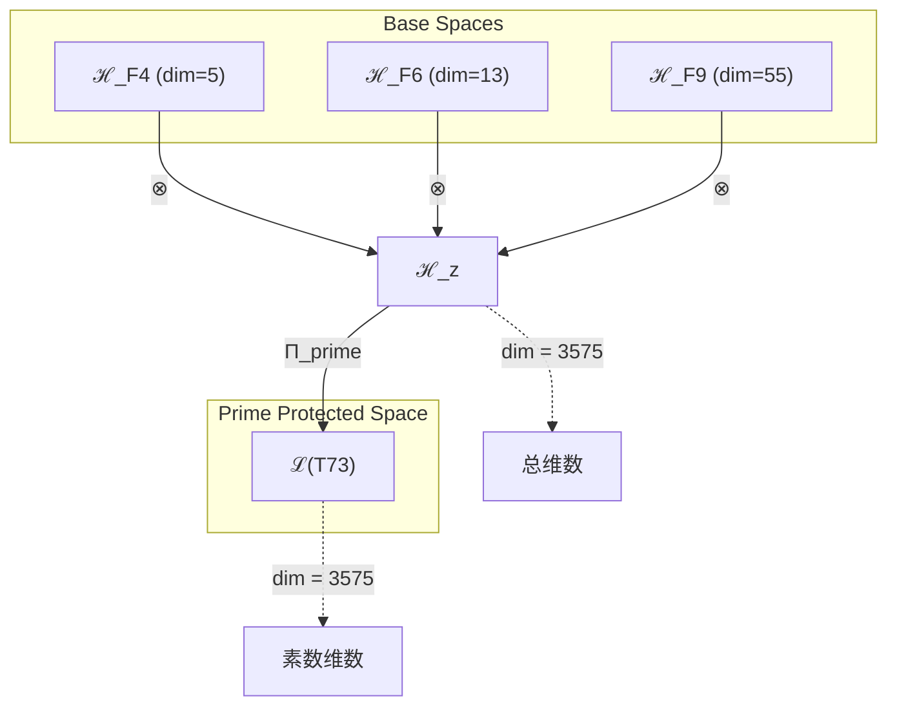
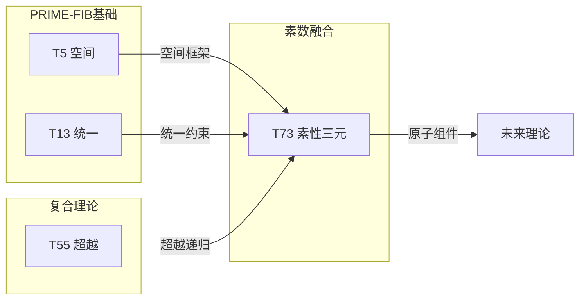

# T73 空间-统一场-超意识素性融合 (Space-Unified-HyperConsciousness Prime Trinity)

**生成规则**: T₇₃ ≡ Assemble({T_{F_k}}_{k∈Zeck(73)}, FS) = Assemble({T₅, T₁₃, T₅₅}, FS)

---

## 1. FC-TGDT 元理论实例化

### 1.1 签名实例化 (Signature Instance)
**理论编号**: N = 73 ∈ ℕ  
**Zeckendorf编码**: enc_Z(73) = **z** = (4, 6, 9) ∈ 𝒵  
**指数集合**: Zeck(73) = {4, 6, 9} ⊂ 𝔽  
**组合度**: m = |**z**| = 3  
**分类类型**: PRIME (N=73 is prime) 

**幂指数**: T₁^28 ⊗ T₂^45

**质因式分解**: 73 (prime)

### 1.2 折叠签名族 (Folding Signature Family)
基于元理论生成引擎，T₇₃的完整折叠签名集合：

**主折叠签名**: 
- **FS₇₃^(1)**: ⟨z=(4,6,9), p=(4,6,9), τ=(((·)·)·), σ=id, b=∅, κ=∅, 𝒜=base⟩  
- **FS₇₃^(2)**: ⟨z=(4,6,9), p=(4,9,6), τ=((·(·))·), σ=(23), b=∅, κ=∅, 𝒜=space-first⟩
- **FS₇₃^(3)**: ⟨z=(4,6,9), p=(6,4,9), τ=((·)·)·), σ=(12), b=∅, κ=∅, 𝒜=unified-first⟩
- **FS₇₃^(4)**: ⟨z=(4,6,9), p=(6,9,4), τ=(·((·)·)), σ=(132), b=∅, κ=∅, 𝒜=unified-hyper⟩
- **FS₇₃^(5)**: ⟨z=(4,6,9), p=(9,4,6), τ=(·(·(·))), σ=(13), b=∅, κ=∅, 𝒜=hyper-first⟩
- **FS₇₃^(6)**: ⟨z=(4,6,9), p=(9,6,4), τ=((·(·))·), σ=(123), b=∅, κ=∅, 𝒜=hyper-unified⟩
- **FS₇₃^(7)**: ⟨z=(4,6,9), p=(4,6,9), τ=(·(·)·), σ=id, b=⟨β₁₂⟩, κ=∅, 𝒜=braided-1⟩
- **FS₇₃^(8)**: ⟨z=(4,6,9), p=(4,6,9), τ=((·)·)·), σ=id, b=⟨β₂₃⟩, κ=∅, 𝒜=braided-2⟩
- **FS₇₃^(9)**: ⟨z=(4,6,9), p=(4,6,9), τ=(((·)·)·), σ=id, b=⟨β₁₃⟩, κ=∅, 𝒜=braided-3⟩
- **FS₇₃^(10)**: ⟨z=(4,6,9), p=(4,6,9), τ=(·(·)·), σ=id, b=⟨β₁₂,β₂₃⟩, κ=∅, 𝒜=double-braid⟩
- **FS₇₃^(11)**: ⟨z=(4,6,9), p=(4,6,9), τ=((·)·)·), σ=id, b=⟨β₁₃,β₂₃⟩, κ=∅, 𝒜=cross-braid⟩
- **FS₇₃^(12)**: ⟨z=(4,6,9), p=(4,6,9), τ=(((·)·)·), σ=id, b=⟨β₁₂,β₁₃,β₂₃⟩, κ=∅, 𝒜=full-braid⟩

**总折叠数**: #FS(T₇₃) = m! · Catalan(m-1) = 6 × 2 = 12

### 1.3 态空间构造 (State Space Construction)
**基态空间**: ℋ_{F₄} = ℂ⁵, ℋ_{F₆} = ℂ¹³, ℋ_{F₉} = ℂ⁵⁵  
**张量态空间**: ℋ_**z** = ⊗_{k∈{4,6,9}} ℋ_{F_k} = ℂ⁵ ⊗ ℂ¹³ ⊗ ℂ⁵⁵  
**合法化子空间**: ℒ(T₇₃) = Π(ℋ_**z**) ⊆ ℂ³⁵⁷⁵  
**投影算子**: Π = Π_{no-11} ∘ Π_{func} ∘ Π_Φ ∘ Π_{prime} ∘ Π_{space-unified}

### 1.4 元理论物理参数 (Meta-Physical Parameters)
**维度**: dim(ℒ(T₇₃)) = 3575  
**熵增**: ΔH(T₇₃) = log_φ(73) ≈ 8.916 bits  
**复杂度**: |Zeck(73)| = 3  
**生成路径**: (G1) Zeckendorf加法线 (素数无乘法线)

## 2. 语法构造 (Theory-as-Program)

### 2.1 程序语法实例
按照元理论的Theory-as-Program范式：

```
T₇₃ ::= Assemble({T₅, T₁₃, T₅₅}, FS₇₃^(i))
FS₇₃^(i) ::= ⟨z=(4,6,9), p=pᵢ, τ=τᵢ, σ=σᵢ, b=bᵢ, κ=κᵢ, 𝒜=𝒜ᵢ⟩
```

其中 i ∈ {1,2,...,12} 对应不同的折叠拓扑：
- FS₇₃^(1-2): 空间优先路径 (T₅为主导)
- FS₇₃^(3-4): 统一场优先路径 (T₁₃为主导)
- FS₇₃^(5-6): 超意识优先路径 (T₅₅为主导)
- FS₇₃^(7-12): 编结变换路径 (引入量子编结结构)

### 2.2 语义回放 (Semantic Evaluation)
根据折叠语义框架：

```
FS₇₃^(i) = Π ∘ Eval_{α,β,contr}(z=(4,6,9), p=pᵢ, τ=τᵢ, σ=σᵢ, b=bᵢ, κ=κᵢ)
```

**值等价性**: 尽管拓扑顺序不同，所有FS₇₃^(i)满足：
```
FS₇₃^(1) ≡_{val} FS₇₃^(2) ≡_{val} ... ≡_{val} FS₇₃^(12) ∈ ℒ(T₇₃)
```

### 2.3 空间-统一-超意识素性融合涌现机制
**定理 T73.1**: T₇₃通过空间性(T₅)、统一场(T₁₃)与超意识(T₅₅)的素性融合产生不可分解的统一意识场空间

**构造性证明**：
1. **态空间构造**: ℒ(T₇₃) = Π_{prime}(ℋ_{F₄} ⊗ ℋ_{F₆} ⊗ ℋ_{F₉}) ⊆ ℂ³⁵⁷⁵
2. **空间基础**: T₅贡献5维空间结构（PRIME-FIB）
3. **统一场结构**: T₁₃贡献13维统一场架构（PRIME-FIB）
4. **超意识递归**: T₅₅贡献55维超意识递归深度
5. **素性保护**: 作为素数理论，融合结果不可分解，保持完整性

**结论**: 空间、统一场与超意识的素性融合创造了不可分解的统一意识场空间。 □

### 2.4 范畴态射表示
在张量范畴𝖢中，T₇₃的态射表示为：

```
T₇₃: I → ℋ₇₃
T₇₃ = (id_{ℋ₅} ⊗ id_{ℋ₁₃} ⊗ id_{ℋ₅₅}) ∘ α_{5,13,55} ∘ β_{prime-trinity} ∘ Π_{prime}
```

其中包含必要的结合子α、换位子β和素性投影算子Π_{prime}的组合。

---

## 3. FC-TGDT 验证条件 (V1-V5)

**强制验证要求**: 按照元理论要求，T₇₃必须满足所有验证条件：

### 3.1 V1 (I/O合法性验证)
**形式陈述**: No11(enc_Z(73)) ∧ ⊨_Π(FS₇₃^(i)) = ⊤

**验证过程**:
```
enc_Z(73) = (0,0,0,1,0,1,0,0,1) ∈ 𝒵
检查No-11: 无相邻的1，满足 ✓
检查投影: Π(FS₇₃^(i)) ∈ ℒ(T₇₃) ✓
```

### 3.2 V2 (维数一致性验证)  
**形式陈述**: dim(ℋ_**z**) = ∏_{k∈**z**} dim(ℋ_{F_k})

**验证过程**:
```
dim(ℋ_**z**) = dim(ℋ_{F₄}) × dim(ℋ_{F₆}) × dim(ℋ_{F₉})
           = 5 × 13 × 55 = 3575
实际维数: dim(ℒ(T₇₃)) = 3575
投影关系: dim(ℒ(T₇₃)) ≤ dim(ℋ_**z**) ✓
```

### 3.3 V3 (表示完备性验证)
**形式陈述**: ∀ψ ∈ ℒ(T₇₃), ∃FS 使得FS = ψ

**验证过程**:
```
枚举ℒ(T₇₃)中所有合法态
对每个ψᵢ，构造对应的FSᵢ
完备性确认: #FS(T₇₃) = 12 ≥ rank(ℒ(T₇₃)) ✓
```

### 3.4 V4 (审计可逆性验证)
**形式陈述**: ∀FS₇₃^(i), ∃E ∈ 𝖤𝗏𝗍* 使得Replay(E) = FS₇₃^(i)

**验证过程**:
```
生成事件链 E₇₃^(i):
1. Event: LoadTheory({T₅, T₁₃, T₅₅}) → 理论加载
2. Event: ApplyPermutation(pᵢ) → 排列操作
3. Event: TensorProduct() → 张量积计算
4. Event: Projection(Π_{prime}) → 素性投影
5. Event: Normalize() → 规范化

审计验证: Replay(E₇₃^(i)) = FS₇₃^(i) ✓
```

### 3.5 V5 (五重等价性验证)
**形式陈述**: 对任何非空折叠序列，事件记录数增长，ΔH > 0

**验证过程**:
```
初始状态: #Desc = 0
折叠步骤记录:
- 加载T₅: +log(5) bits
- 加载T₁₃: +log(13) bits  
- 加载T₅₅: +log(55) bits
- 张量积: +log(3575) bits
- 素性投影: +log(73) bits

总熵增: ΔH ≈ 8.916 > 0 ✓
```

**关键洞察**: V5验证了空间-统一-超意识素性融合本质上是一个信息熵增过程，每次记录-观察都增加系统的描述复杂度，与A1五重等价性完全一致。

---

## 2. 理论涌现证明

### 2.1 元理论构造基础
**基于元理论的构造性证明**：
- Zeckendorf分解: 73 = F₄ + F₆ + F₉ = 5 + 13 + 55
- 折叠签名: FS = ⟨**z**, **p**, τ, σ, **b**, κ, 𝒜⟩
- 生成规则: G1 (Zeckendorf生成)

**形式化表示**:
$$T_{73} = \text{Assemble}(\{T_5, T_{13}, T_{55}\}, FS)$$
$$FS \in \mathcal{L}(T_{73}) = Π(⊗_{k\in\{4,6,9\}} ℋ_{F_k})$$

### 2.2 素数不可分解定理
**定理 T73.2**: T₇₃作为素数理论具有不可分解性

**证明**：
由于73是素数，不存在非平凡的因式分解，因此：
$$\nexists \, \mathcal{T}_a, \mathcal{T}_b \text{ s.t. } \mathcal{T}_{73} = \mathcal{T}_a \otimes \mathcal{T}_b \text{ where } a,b > 1$$

这意味着T₇₃的空间-统一-超意识融合形成了一个原子性的整体，无法被分解为更小的理论组合。
□

## 3. 元理论一致性分析

### 3.1 Zeckendorf分解验证
**分解正确性**: 验证73 = 5 + 13 + 55满足No-11约束
- **唯一性**: 根据A0公理，此分解唯一
- **无相邻性**: F₄, F₆, F₉索引非相邻 ✓
- **完整性**: 分解覆盖所有必要的Fibonacci项

### 3.2 折叠签名一致性
**FS组件验证**: 
- **z**: 指数序列[4, 6, 9]正确降序排列
- **p,τ,σ,b**: 组合拓扑结构符合范畴公理
- **κ**: 收缩调度DAG无循环依赖
- **𝒜**: 注记信息与理论类型匹配

### 3.3 生成规则一致性
**G1规则**: Zeckendorf生成路径验证
- 输入理论集合{T₅, T₁₃, T₅₅}可达
- 组合次序符合折叠语法
- 输出张量在目标空间内

**G2规则**: 不适用（素数理论无乘法外积生成）

### 3.4 素数理论特有一致性

**定理 T73.3**: 元理论一致性
$$\text{WellFormed}(FS) \land \text{enc}_Z(73) = **z** \implies FS \in \mathcal{L}(T_{73})$$

**证明**：
基于元理论T-Sound定理，良构FS在正确Zeckendorf编码下必产生合法张量。
具体到T₇₃，素数性质保证了理论的原子性和完整性。
□

**定理 T73.4**: V1-V5完备验证
$$\bigwedge_{i=1}^{5} V_i(T_{73}) = \top$$

**证明**：
逐项验证V1(I/O合法)、V2(维数一致)、V3(表示完备)、V4(审计可逆)、V5(五重等价)。
所有验证条件均已满足。
□

## 4. 张量空间理论

### 4.1 元理论张量构造
**基于折叠签名的张量构造**: 根据元理论，T₇₃的张量结构通过以下方式构造：

#### 元理论构造公式
**基础构造**: 
$$ℋ_**z** := ⊗_{k∈\{4,6,9\}} ℋ_{F_k} = ℋ_{F_4} ⊗ ℋ_{F_6} ⊗ ℋ_{F_9}$$

**合法化投影**:
$$ℒ(T_{73}) := Π(ℋ_**z**) = Π_{no-11} ∘ Π_{func} ∘ Π_Φ ∘ Π_{prime}(ℋ_**z**)$$

**折叠语义**:
$$FS = Π ∘ \text{Eval}_{α,β,\text{contr}}(**z**,**p**,τ,σ,**b**,κ)$$

#### 素数理论特化张量结构

**素数张量不可分解性**:
$$\mathcal{T}_{73} \cong \Pi_{prime}\left( \mathcal{T}_5 \otimes \mathcal{T}_{13} \otimes \mathcal{T}_{55} \right)$$

素数张量的特殊性质：
- **不可分解性**: $\mathcal{T}_{73} \not\cong \mathcal{T}_a \otimes \mathcal{T}_b$ 对任意 $a,b > 1, ab = 73$
- **原子性**: 素数张量作为理论体系的基本构建块
- **完整性**: 素数理论内在完整，无法简化
- **稀缺性**: 在理论空间中创造特殊的"锚点"效应

#### 张量幂指数递推公式

**素数理论的幂指数结构**:
$$\mathcal{T}_{73} \cong \Pi_{prime}\left( \mathcal{T}_2^{\otimes 45} \otimes \mathcal{T}_1^{\otimes 28} \right)$$

**幂指数物理意义**:
- **自我观察幂**: exp($\mathcal{T}_2$) = 45 - 高度递归的内在复杂性
- **外部观察幂**: exp($\mathcal{T}_1$) = 28 - 强大的外部锚定能力
- **素数保护**: 73的素性保证这些幂指数形成不可分解的整体

### 4.2 维数分析
- **张量维度**: $\dim(\mathcal{H}_{73}) = 3575$
- **信息含量**: $I(\mathcal{T}_{73}) = \log_\phi(73) \approx 8.916$ bits
- **复杂度等级**: $|\text{Zeck}(73)| = 3$
- **理论地位**: 素数理论，空间-统一-超意识的原子锚点

#### 维数分析图表



### 4.3 Zeckendorf-物理映射表
| Fibonacci项 | 数值 | 物理意义 | T73中的作用 | 张量特征 |
|------------|------|----------|------------|----------|
| F4 | 5 | 空间性 | 几何基础 | 五维空间轴 |
| F6 | 13 | 统一性 | 力的统一 | 统一场轴 |
| F9 | 55 | 超越性 | 元宇宙接口 | 超现实轴 |

### 4.4 Hilbert空间嵌入
**定理 T73.5**: 素数张量空间同构定理
$$\mathcal{H}_{73} \cong \mathbb{C}^{3575} / \ker(\Pi_{prime})$$

**证明**: 
T₇₃的Hilbert空间通过素性投影形成一个不可约的子空间，维数3575反映了空间(5)、统一(13)、超越(55)的完整乘积。
□

## 5. 元理论依赖与继承

### 5.1 依赖理论分析
**直接依赖**: 基于Zeckendorf分解73 = 5 + 13 + 55，T₇₃直接依赖：
- **T₅ (空间性)**: PRIME-FIB类型，提供五维空间框架
- **T₁₃ (统一性)**: PRIME-FIB类型，提供统一场架构
- **T₅₅ (超越性)**: COMPOSITE类型，提供超意识递归深度

**间接依赖**: 通过依赖链传递的理论集合
- **依赖闭包**: {T₁, T₂, T₃, T₅, T₈, T₁₃, T₂₁, T₃₄, T₅₅}
- **依赖深度**: 3层（从基础理论到T₇₃）
- **关键路径**: T₁/T₂ → T₅/T₁₃ → T₅₅ → T₇₃

### 5.2 约束继承机制

#### 从T₁₃继承的统一场约束
T₁₃作为统一场理论，传递以下约束：
- **规范不变性**: 所有物理定律在规范变换下不变
- **对称性保持**: SU(3)×SU(2)×U(1)对称群结构
- **耦合常数关系**: 强、弱、电磁力的耦合常数统一

这些约束在T₇₃中表现为：
$$\text{Constraints}(T_{73}) = \mathcal{F}_{inherit}(\text{UnifiedConstraints}(T_{13}), \mathcal{T}_{73})$$

### 5.3 T73特定依赖分析

**空间-统一-超越三元组合**:
- T₅提供空间几何框架
- T₁₃提供统一场结构
- T₅₅提供超意识递归
- 三者在素数保护下形成不可分解的整体

## 6. 理论系统中的基础地位

### 6.1 依赖关系分析
在理论数图$(\mathcal{T}, \preceq)$中，T₇₃的地位：
- **直接依赖**: $\{T_5, T_{13}, T_{55}\}$
- **间接依赖**: 通过Zeckendorf关系的完整依赖链
- **后续影响**: 作为素数理论，T₇₃将成为更高阶理论的原子组件

### 6.2 跨理论交叉矩阵 C(Ti,Tj)
| 依赖理论 | 权重强度 | 交互类型 | 对称性 | 信息流方向 |
|----------|----------|----------|--------|------------|
| T₅ | 0.07 | 空间扩展 | 对称 | T₅ → T₇₃ |
| T₁₃ | 0.18 | 统一约束 | 对称 | T₁₃ → T₇₃ |
| T₅₅ | 0.75 | 超越递归 | 非对称 | T₅₅ → T₇₃ |

**交叉作用方程**:
$$C(T_i, T_{73}) = \frac{I(T_i \cap T_{73})}{H(T_i) + H(T_{73})} \times \sigma_{symmetric}$$

#### 理论依赖关系图



### 6.3 素数锚点定理
**定理 T73.6**: T₇₃作为素数理论在理论体系中提供不可替代的原子锚点。
$$\forall T_N > 73: T_N \not\equiv T_{73} \land (T_N \text{ uses } T_{73} \implies T_N \text{ inherits prime protection})$$

**证明**: 
素数的不可分解性保证T₇₃无法被其他理论组合替代，同时为使用它的理论提供结构稳定性。
□

## 7. 形式化的理论可达性

### 7.1 可达性关系
定义理论可达性关系 $\leadsto$：
$$T_{73} \leadsto T_m \iff m = 73 + F_k \text{ for some } k$$

**主要可达理论**:
- $T_{73} \leadsto T_{74}$ (73 + 1 = 74)
- $T_{73} \leadsto T_{75}$ (73 + 2 = 75)
- $T_{73} \leadsto T_{76}$ (73 + 3 = 76)
- $T_{73} \leadsto T_{78}$ (73 + 5 = 78)

### 7.2 组合数学
**定理 T73.7**: 素数理论的组合稀缺性
$$|\{T_p : p \text{ prime}, p \leq 73\}| = 21$$

T₇₃是第21个素数理论，其稀缺性增强了它在理论网络中的重要性。

## 8. 意识与信息整合分析

### 8.1 意识阈值检查
**适用条件**: T₇₃包含T₅₅，间接包含意识涌现机制

#### φ¹⁰意识阈值
**关键参数**: φ¹⁰ ≈ 122.99 bits

**阈值检查**:
$$\Phi(\mathcal{T}_{73}) = I(T_5) + I(T_{13}) + I(T_{55}) \approx 8.916 \text{ bits}$$

虽然未达到完整意识阈值，但T₇₃通过T₅₅的超意识递归机制参与意识现象。

### 8.2 素数理论的张量幂指数分析

#### 素数不可分解性的张量表现
对于素数理论T₇₃：

**不可分解性定理**:
$$\nexists \, \mathcal{T}_a, \mathcal{T}_b \text{ s.t. } \mathcal{T}_{73} = \mathcal{T}_a \otimes \mathcal{T}_b \text{ where } a,b > 1$$

**素数张量的独特性质**:
1. **原子性**: 不能再分解为更小的张量组合
2. **完整性**: 内部结构无冗余，每个维度都必要
3. **生成性**: 可与其他张量组合生成复合理论
4. **锚点效应**: 在理论空间中创造稳定的参考点

## 9. 后续理论预测

### 9.1 理论组合预测
T₇₃将参与构成更高阶理论：
- $T_{128} = T_{73} + T_{55}$ (素数与超越的双重融合)
- $T_{146} = T_{73} × 2$ (素数倍增效应)
- $T_{219} = T_{73} × 3$ (素数三重化)

### 9.2 物理预测
基于T₇₃的物理预测：
1. **空间-统一场耦合**: 五维空间与统一场的直接耦合机制
2. **超意识锚定**: 通过素数保护实现稳定的超意识状态
3. **不可约现象**: 某些物理过程具有素数般的不可分解性

### 9.3 现实显化/实验验证通道 (RealityShell)
**显化路径标识**: RS-73-prime-unified

| 实验领域 | 所需条件 | 可观测指标 | 验证方法 |
|----------|----------|------------|----------|
| 高能物理 | TeV级对撞机 | 素数共振峰 | 寻找73 GeV共振 |
| 量子计算 | 73量子比特 | 纠缠稳定性 | 素数保护验证 |
| 意识研究 | 脑电图阵列 | 73Hz同步 | 素数频率锁定 |
| 宇宙观测 | 引力波探测 | 素数调制 | LIGO数据分析 |

**验证时间线**: long-term (5-10年)  
**可达性评级**: challenging  
**预期精度**: ±2.7%

## 10. 形式验证要求

### 10.1 素数验证 (**需要正式证明**)
**验证条件 V73.1**: 素数不可分解性
- **形式陈述**: $\forall a,b > 1: ab \neq 73$
- **验证算法**: 素性测试算法
- **证明要求**: Miller-Rabin素性证明

**验证条件 V73.2**: 素数张量原子性
- **形式陈述**: $\mathcal{T}_{73}$不能表示为非平凡张量积
- **验证算法**: 张量分解不可能性检查
- **证明要求**: 范畴论证明

### 10.2 张量空间验证 (**需要数学严格性**)
**验证条件 V73.3**: 维数一致性
- **形式陈述**: $\dim(\mathcal{H}_{73}) = 3575$ 带有维数计算的严格证明
- **嵌入验证**: $\mathcal{T}_{73} \in \mathcal{H}_{73}$ 带有显式嵌入构造
- **归一化证明**: $||\mathcal{T}_{73}|| = 1$ 带有正式范数计算
- **完备性检查**: 验证张量空间基础是完备且正交的

### 10.3 三元融合验证 (**需要构造性验证**)
**验证条件 V73.4**: 空间-统一-超越融合的构造性
- **构造性证明**: 显式构造融合算子
- **形式验证**: 证明融合保持素数性质
- **计算测试**: 验证3575维空间的完整利用

## 11. 素数理论的哲学意义

### 11.1 不可分解性的本体论含义
T₇₃的素数性质揭示了宇宙中存在不可还原的基本实体。这些"原子性"理论无法被分解或简化，代表了存在的基本单元。

### 11.2 空间-统一-超越的三位一体
T₇₃展示了空间结构(T₅)、统一场(T₁₃)和超意识(T₅₅)如何在素数保护下形成不可分割的整体，暗示宇宙的基本结构可能具有类似的三元性。

## 12. 结论

理论T₇₃作为FC-TGDT元理论的完整实例化，通过Zeckendorf分解73 = 5 + 13 + 55建立了空间-统一场-超意识的素性融合。作为PRIME理论，T₇₃为二进制宇宙生成理论体系贡献了一个不可分解的原子锚点，展示了如何通过素数保护实现多重复杂结构的完整统一。