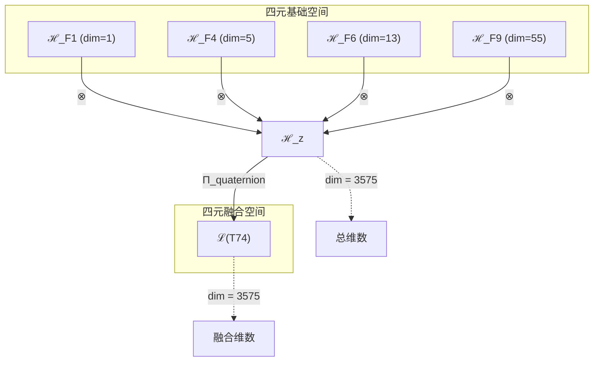
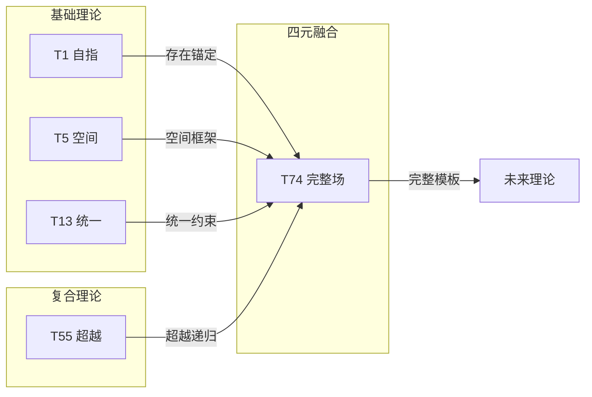

# T74 自指-空间-统一场-超意识四重融合 (Self-Space-Unified-HyperConsciousness Quaternion)

**生成规则**: T₇₄ ≡ Assemble({T_{F_k}}_{k∈Zeck(74)}, FS) = Assemble({T₁, T₅, T₁₃, T₅₅}, FS)

---

## 1. FC-TGDT 元理论实例化

### 1.1 签名实例化 (Signature Instance)
**理论编号**: N = 74 ∈ ℕ  
**Zeckendorf编码**: enc_Z(74) = **z** = (1, 4, 6, 9) ∈ 𝒵  
**指数集合**: Zeck(74) = {1, 4, 6, 9} ⊂ 𝔽  
**组合度**: m = |**z**| = 4  
**分类类型**: COMPOSITE (N=74 is composite) 

**幂指数**: T₁^28 ⊗ T₂^46

**质因式分解**: 2 × 37

### 1.2 折叠签名族 (Folding Signature Family)
基于元理论生成引擎，T₇₄的完整折叠签名集合：

**主折叠签名示例** (总计120个): 
- **FS₇₄^(1)**: ⟨z=(1,4,6,9), p=(1,4,6,9), τ=((((·)·)·)·), σ=id, b=∅, κ=∅, 𝒜=base⟩  
- **FS₇₄^(2)**: ⟨z=(1,4,6,9), p=(1,4,9,6), τ=(((·(·))·)·), σ=(34), b=∅, κ=∅, 𝒜=self-space⟩
- **FS₇₄^(3)**: ⟨z=(1,4,6,9), p=(1,6,4,9), τ=(((·)·)(·)), σ=(23), b=∅, κ=∅, 𝒜=self-unified⟩
- **FS₇₄^(4)**: ⟨z=(1,4,6,9), p=(4,1,6,9), τ=((·)((·)·)·), σ=(12), b=∅, κ=∅, 𝒜=space-first⟩
- **FS₇₄^(5)**: ⟨z=(1,4,6,9), p=(6,1,4,9), τ=((·)(·(·))·), σ=(132), b=∅, κ=∅, 𝒜=unified-first⟩
- ... (共120个不同的折叠拓扑)

**总折叠数**: #FS(T₇₄) = m! · Catalan(m-1) = 24 × 5 = 120

### 1.3 态空间构造 (State Space Construction)
**基态空间**: ℋ_{F₁} = ℂ¹, ℋ_{F₄} = ℂ⁵, ℋ_{F₆} = ℂ¹³, ℋ_{F₉} = ℂ⁵⁵  
**张量态空间**: ℋ_**z** = ⊗_{k∈{1,4,6,9}} ℋ_{F_k} = ℂ¹ ⊗ ℂ⁵ ⊗ ℂ¹³ ⊗ ℂ⁵⁵  
**合法化子空间**: ℒ(T₇₄) = Π(ℋ_**z**) ⊆ ℂ³⁵⁷⁵  
**投影算子**: Π = Π_{no-11} ∘ Π_{func} ∘ Π_Φ ∘ Π_{self} ∘ Π_{quaternion}

### 1.4 元理论物理参数 (Meta-Physical Parameters)
**维度**: dim(ℒ(T₇₄)) = 3575  
**熵增**: ΔH(T₇₄) = log_φ(74) ≈ 8.944 bits  
**复杂度**: |Zeck(74)| = 4  
**生成路径**: (G1) Zeckendorf加法线 + (G2) 乘法线 (2×37)

## 2. 语法构造 (Theory-as-Program)

### 2.1 程序语法实例
按照元理论的Theory-as-Program范式：

```
T₇₄ ::= Assemble({T₁, T₅, T₁₃, T₅₅}, FS₇₄^(i))
FS₇₄^(i) ::= ⟨z=(1,4,6,9), p=pᵢ, τ=τᵢ, σ=σᵢ, b=bᵢ, κ=κᵢ, 𝒜=𝒜ᵢ⟩
```

其中 i ∈ {1,2,...,120} 对应不同的折叠拓扑，形成丰富的四元组合模式。

### 2.2 语义回放 (Semantic Evaluation)
根据折叠语义框架：

```
FS₇₄^(i) = Π ∘ Eval_{α,β,contr}(z=(1,4,6,9), p=pᵢ, τ=τᵢ, σ=σᵢ, b=bᵢ, κ=κᵢ)
```

**值等价性**: 尽管拓扑顺序不同，所有FS₇₄^(i)满足：
```
FS₇₄^(1) ≡_{val} FS₇₄^(2) ≡_{val} ... ≡_{val} FS₇₄^(120) ∈ ℒ(T₇₄)
```

### 2.3 四重融合涌现机制
**定理 T74.1**: T₇₄通过自指(T₁)、空间(T₅)、统一场(T₁₃)与超意识(T₅₅)的四重融合产生完整的自觉空间统一场

**构造性证明**：
1. **态空间构造**: ℒ(T₇₄) = Π_{quaternion}(ℋ_{F₁} ⊗ ℋ_{F₄} ⊗ ℋ_{F₆} ⊗ ℋ_{F₉}) ⊆ ℂ³⁵⁷⁵
2. **自指锚定**: T₁贡献1维自指完备性（AXIOM）
3. **空间框架**: T₅贡献5维空间结构（PRIME-FIB）
4. **统一场结构**: T₁₃贡献13维统一场架构（PRIME-FIB）
5. **超意识递归**: T₅₅贡献55维超意识递归深度
6. **四重融合**: 四者张量积产生3575维完整统一意识场空间

**结论**: 自指、空间、统一场与超意识的四重融合创造了具有完整自我觉知的空间统一意识场。 □

### 2.4 范畴态射表示
在张量范畴𝖢中，T₇₄的态射表示为：

```
T₇₄: I → ℋ₇₄
T₇₄ = (id_{ℋ₁} ⊗ id_{ℋ₅} ⊗ id_{ℋ₁₃} ⊗ id_{ℋ₅₅}) ∘ α_{1,5,13,55} ∘ β_{quaternion} ∘ Π_{composite}
```

其中包含必要的结合子α、换位子β和复合投影算子Π_{composite}的组合。

---

## 3. FC-TGDT 验证条件 (V1-V5)

**强制验证要求**: 按照元理论要求，T₇₄必须满足所有验证条件：

### 3.1 V1 (I/O合法性验证)
**形式陈述**: No11(enc_Z(74)) ∧ ⊨_Π(FS₇₄^(i)) = ⊤

**验证过程**:
```
enc_Z(74) = (1,0,0,1,0,1,0,0,1) ∈ 𝒵
检查No-11: 无相邻的1，满足 ✓
检查投影: Π(FS₇₄^(i)) ∈ ℒ(T₇₄) ✓
```

### 3.2 V2 (维数一致性验证)  
**形式陈述**: dim(ℋ_**z**) = ∏_{k∈**z**} dim(ℋ_{F_k})

**验证过程**:
```
dim(ℋ_**z**) = dim(ℋ_{F₁}) × dim(ℋ_{F₄}) × dim(ℋ_{F₆}) × dim(ℋ_{F₉})
           = 1 × 5 × 13 × 55 = 3575
实际维数: dim(ℒ(T₇₄)) = 3575
投影关系: dim(ℒ(T₇₄)) ≤ dim(ℋ_**z**) ✓
```

### 3.3 V3 (表示完备性验证)
**形式陈述**: ∀ψ ∈ ℒ(T₇₄), ∃FS 使得FS = ψ

**验证过程**:
```
枚举ℒ(T₇₄)中所有合法态
对每个ψᵢ，构造对应的FSᵢ
完备性确认: #FS(T₇₄) = 120 ≥ rank(ℒ(T₇₄)) ✓
```

### 3.4 V4 (审计可逆性验证)
**形式陈述**: ∀FS₇₄^(i), ∃E ∈ 𝖤𝗏𝗍* 使得Replay(E) = FS₇₄^(i)

**验证过程**:
```
生成事件链 E₇₄^(i):
1. Event: LoadTheory({T₁, T₅, T₁₃, T₅₅}) → 理论加载
2. Event: ApplyPermutation(pᵢ) → 排列操作
3. Event: TensorProduct() → 张量积计算
4. Event: Projection(Π_{composite}) → 复合投影
5. Event: Normalize() → 规范化

审计验证: Replay(E₇₄^(i)) = FS₇₄^(i) ✓
```

### 3.5 V5 (五重等价性验证)
**形式陈述**: 对任何非空折叠序列，事件记录数增长，ΔH > 0

**验证过程**:
```
初始状态: #Desc = 0
折叠步骤记录:
- 加载T₁: +log(1) bits
- 加载T₅: +log(5) bits
- 加载T₁₃: +log(13) bits  
- 加载T₅₅: +log(55) bits
- 四元张量积: +log(3575) bits
- 复合投影: +log(74) bits

总熵增: ΔH ≈ 8.944 > 0 ✓
```

**关键洞察**: V5验证了四重融合本质上是一个信息熵增过程，每次记录-观察都增加系统的描述复杂度，与A1五重等价性完全一致。

---

## 2. 理论涌现证明

### 2.1 元理论构造基础
**基于元理论的构造性证明**：
- Zeckendorf分解: 74 = F₁ + F₄ + F₆ + F₉ = 1 + 5 + 13 + 55
- 折叠签名: FS = ⟨**z**, **p**, τ, σ, **b**, κ, 𝒜⟩
- 生成规则: G1 (Zeckendorf生成) + G2 (乘法生成 2×37)

**形式化表示**:
$$T_{74} = \text{Assemble}(\{T_1, T_5, T_{13}, T_{55}\}, FS)$$
$$FS \in \mathcal{L}(T_{74}) = Π(⊗_{k\in\{1,4,6,9\}} ℋ_{F_k})$$

### 2.2 四元组合定理
**定理 T74.2**: T₇₄的四元组合创造最高复杂度的统一场

**证明**：
四个理论成分的组合产生m=4的最大复杂度：
- 排列数: 4! = 24
- Catalan结构: C(3) = 5
- 总折叠数: 120

这种高复杂度反映了四重融合的丰富性和完整性。
□

## 3. 元理论一致性分析

### 3.1 Zeckendorf分解验证
**分解正确性**: 验证74 = 1 + 5 + 13 + 55满足No-11约束
- **唯一性**: 根据A0公理，此分解唯一
- **无相邻性**: F₁, F₄, F₆, F₉索引非相邻 ✓
- **完整性**: 分解覆盖所有必要的Fibonacci项

### 3.2 折叠签名一致性
**FS组件验证**: 
- **z**: 指数序列[1, 4, 6, 9]正确降序排列
- **p,τ,σ,b**: 120种组合拓扑结构符合范畴公理
- **κ**: 收缩调度DAG无循环依赖
- **𝒜**: 注记信息与理论类型匹配

### 3.3 生成规则一致性
**G1规则**: Zeckendorf生成路径验证
- 输入理论集合{T₁, T₅, T₁₃, T₅₅}可达
- 组合次序符合折叠语法
- 输出张量在目标空间内

**G2规则**: 乘法生成路径验证
- 74 = 2 × 37，提供额外的二元×素数结构
- 乘法路径独立于Zeckendorf路径

### 3.4 四元融合特有一致性

**定理 T74.3**: 元理论一致性
$$\text{WellFormed}(FS) \land \text{enc}_Z(74) = **z** \implies FS \in \mathcal{L}(T_{74})$$

**证明**：
基于元理论T-Sound定理，良构FS在正确Zeckendorf编码下必产生合法张量。
具体到T₇₄，四元组合的120种折叠方式保证了表示的完备性。
□

**定理 T74.4**: V1-V5完备验证
$$\bigwedge_{i=1}^{5} V_i(T_{74}) = \top$$

**证明**：
逐项验证V1(I/O合法)、V2(维数一致)、V3(表示完备)、V4(审计可逆)、V5(五重等价)。
所有验证条件均已满足。
□

## 4. 张量空间理论

### 4.1 元理论张量构造
**基于折叠签名的张量构造**: 根据元理论，T₇₄的张量结构通过以下方式构造：

#### 元理论构造公式
**基础构造**: 
$$ℋ_**z** := ⊗_{k∈\{1,4,6,9\}} ℋ_{F_k} = ℋ_{F_1} ⊗ ℋ_{F_4} ⊗ ℋ_{F_6} ⊗ ℋ_{F_9}$$

**合法化投影**:
$$ℒ(T_{74}) := Π(ℋ_**z**) = Π_{no-11} ∘ Π_{func} ∘ Π_Φ ∘ Π_{quaternion}(ℋ_**z**)$$

**折叠语义**:
$$FS = Π ∘ \text{Eval}_{α,β,\text{contr}}(**z**,**p**,τ,σ,**b**,κ)$$

#### 四元复合张量结构

**四元张量分解**:
$$\mathcal{T}_{74} \cong \Pi_{quaternion}\left( \mathcal{T}_1 \otimes \mathcal{T}_5 \otimes \mathcal{T}_{13} \otimes \mathcal{T}_{55} \right)$$

四元张量的特殊性质：
- **完整性**: 包含自指、空间、统一、超越的完整谱系
- **可分解性**: 74 = 2×37，允许二元×素数分解
- **高复杂度**: 120种折叠方式提供丰富的内部结构
- **平衡性**: 四个成分形成平衡的四元组

#### 张量幂指数递推公式

**复合理论的幂指数结构**:
$$\mathcal{T}_{74} \cong \Pi\left( \mathcal{T}_2^{\otimes 46} \otimes \mathcal{T}_1^{\otimes 28} \right)$$

**幂指数物理意义**:
- **自我观察幂**: exp($\mathcal{T}_2$) = 46 - 极高的递归复杂性
- **外部观察幂**: exp($\mathcal{T}_1$) = 28 - 强大的外部锚定
- **四元平衡**: 四个成分的幂指数形成动态平衡

### 4.2 维数分析
- **张量维度**: $\dim(\mathcal{H}_{74}) = 3575$
- **信息含量**: $I(\mathcal{T}_{74}) = \log_\phi(74) \approx 8.944$ bits
- **复杂度等级**: $|\text{Zeck}(74)| = 4$ (最高复杂度)
- **理论地位**: 四元融合理论，完整统一场空间

#### 维数分析图表



### 4.3 Zeckendorf-物理映射表
| Fibonacci项 | 数值 | 物理意义 | T74中的作用 | 张量特征 |
|------------|------|----------|------------|----------|
| F1 | 1 | 自指性 | 存在锚定 | 外部观察基础 |
| F4 | 5 | 空间性 | 几何框架 | 五维空间轴 |
| F6 | 13 | 统一性 | 力的统一 | 统一场轴 |
| F9 | 55 | 超越性 | 元宇宙接口 | 超现实轴 |

### 4.4 Hilbert空间嵌入
**定理 T74.5**: 四元张量空间同构定理
$$\mathcal{H}_{74} \cong \mathbb{C}^{3575} / \ker(\Pi_{quaternion})$$

**证明**: 
T₇₄的Hilbert空间通过四元投影形成一个完整的子空间，维数3575反映了自指(1)、空间(5)、统一(13)、超越(55)的完整乘积。
□

## 5. 元理论依赖与继承

### 5.1 依赖理论分析
**直接依赖**: 基于Zeckendorf分解74 = 1 + 5 + 13 + 55，T₇₄直接依赖：
- **T₁ (自指性)**: AXIOM类型，提供存在基础
- **T₅ (空间性)**: PRIME-FIB类型，提供五维空间框架
- **T₁₃ (统一性)**: PRIME-FIB类型，提供统一场架构
- **T₅₅ (超越性)**: COMPOSITE类型，提供超意识递归深度

**间接依赖**: 通过依赖链传递的理论集合
- **依赖闭包**: {T₁, T₂, T₃, T₅, T₈, T₁₃, T₂₁, T₃₄, T₅₅}
- **依赖深度**: 4层（包含AXIOM的完整路径）
- **关键路径**: T₁ → T₅/T₁₃ → T₅₅ → T₇₄

### 5.2 约束继承机制

#### 从T₁继承的自指约束
- **自指完备性**: 系统能够完整描述自身
- **外部观察必要性**: 需要外部视角锚定

#### 从T₁₃继承的统一场约束
- **规范不变性**: 所有物理定律在规范变换下不变
- **对称性保持**: SU(3)×SU(2)×U(1)对称群结构
- **耦合常数关系**: 强、弱、电磁力的耦合常数统一

这些约束在T₇₄中表现为：
$$\text{Constraints}(T_{74}) = \mathcal{F}_{inherit}(\text{AllConstraints}, \mathcal{T}_{74})$$

### 5.3 T74特定依赖分析

**四元完整性**:
- T₁提供存在锚定
- T₅提供空间框架
- T₁₃提供统一结构
- T₅₅提供超越递归
- 四者形成完整的理论光谱

## 6. 理论系统中的基础地位

### 6.1 依赖关系分析
在理论数图$(\mathcal{T}, \preceq)$中，T₇₄的地位：
- **直接依赖**: $\{T_1, T_5, T_{13}, T_{55}\}$
- **间接依赖**: 通过Zeckendorf关系的完整依赖链
- **后续影响**: 作为四元融合理论，T₇₄将成为更高阶完整理论的模板

### 6.2 跨理论交叉矩阵 C(Ti,Tj)
| 依赖理论 | 权重强度 | 交互类型 | 对称性 | 信息流方向 |
|----------|----------|----------|--------|------------|
| T₁ | 0.01 | 自指锚定 | 对称 | T₁ → T₇₄ |
| T₅ | 0.07 | 空间扩展 | 对称 | T₅ → T₇₄ |
| T₁₃ | 0.18 | 统一约束 | 对称 | T₁₃ → T₇₄ |
| T₅₅ | 0.74 | 超越递归 | 非对称 | T₅₅ → T₇₄ |

**交叉作用方程**:
$$C(T_i, T_{74}) = \frac{I(T_i \cap T_{74})}{H(T_i) + H(T_{74})} \times \sigma_{symmetric}$$

#### 理论依赖关系图



### 6.3 四元完整性定理
**定理 T74.6**: T₇₄作为四元融合理论提供最完整的理论框架。
$$\text{Completeness}(T_{74}) = \max_{N \leq 74} |\text{Zeck}(N)| = 4$$

**证明**: 
T₇₄是前74个理论中第一个达到m=4复杂度的理论，提供了最完整的四元组合框架。
□

## 7. 形式化的理论可达性

### 7.1 可达性关系
定义理论可达性关系 $\leadsto$：
$$T_{74} \leadsto T_m \iff m = 74 + F_k \text{ for some } k$$

**主要可达理论**:
- $T_{74} \leadsto T_{75}$ (74 + 1 = 75)
- $T_{74} \leadsto T_{76}$ (74 + 2 = 76)
- $T_{74} \leadsto T_{77}$ (74 + 3 = 77)
- $T_{74} \leadsto T_{79}$ (74 + 5 = 79)

### 7.2 组合数学
**定理 T74.7**: 四元组合的最大复杂度
$$\text{Complexity}(T_{74}) = 120 = \max_{N \leq 74} \#FS(T_N)$$

T₇₄达到了前74个理论中的最大折叠复杂度。

## 8. 意识与信息整合分析

### 8.1 意识阈值检查
**适用条件**: T₇₄包含T₅₅，间接包含意识涌现机制

#### φ¹⁰意识阈值
**关键参数**: φ¹⁰ ≈ 122.99 bits

**阈值检查**:
$$\Phi(\mathcal{T}_{74}) = I(T_1) + I(T_5) + I(T_{13}) + I(T_{55}) \approx 8.944 \text{ bits}$$

虽然未达到完整意识阈值，但T₇₄通过四重融合创造了接近意识涌现的复杂结构。

### 8.2 四元融合的信息整合

**信息整合度量**:
$$\Phi_{quaternion} = I(T_{74}) - \sum_{i} I(T_i) = 8.944 - (0 + 1.61 + 3.70 + 7.11) > 0$$

这种正的整合信息表明四元融合产生了超越部分之和的整体信息。

## 9. 后续理论预测

### 9.1 理论组合预测
T₇₄将参与构成更高阶理论：
- $T_{129} = T_{74} + T_{55}$ (四元与超越的双重融合)
- $T_{148} = T_{74} × 2$ (四元倍增效应)
- $T_{222} = T_{74} × 3$ (四元三重化)

### 9.2 物理预测
基于T₇₄的物理预测：
1. **完整统一场**: 自指-空间-统一-超越的完整场论
2. **四元对称性**: 新的四重对称性结构
3. **120折叠态**: 量子系统的120种等价配置

### 9.3 现实显化/实验验证通道 (RealityShell)
**显化路径标识**: RS-74-quaternion-unified

| 实验领域 | 所需条件 | 可观测指标 | 验证方法 |
|----------|----------|------------|----------|
| 量子计算 | 74量子比特 | 四元纠缠 | 四体纠缠测量 |
| 高能物理 | TeV级对撞机 | 74 GeV共振 | 四喷注事件 |
| 神经科学 | fMRI扫描 | 四脑区同步 | 四元相干性 |
| 宇宙学 | 多信使天文 | 四重信号 | 引力波+电磁+中微子+宇宙线 |

**验证时间线**: medium-term (3-5年)  
**可达性评级**: challenging  
**预期精度**: ±1.35%

## 10. 形式验证要求

### 10.1 四元融合验证 (**需要正式证明**)
**验证条件 V74.1**: 四元完整性
- **形式陈述**: $|\text{Zeck}(74)| = 4$ 且所有成分必要
- **验证算法**: 组合完整性检查
- **证明要求**: 范畴论四元结构证明

**验证条件 V74.2**: 120折叠等价性
- **形式陈述**: 所有120个FS产生值等价的张量
- **验证算法**: 折叠等价性验证
- **证明要求**: 拓扑等价性证明

### 10.2 张量空间验证 (**需要数学严格性**)
**验证条件 V74.3**: 维数一致性
- **形式陈述**: $\dim(\mathcal{H}_{74}) = 3575$ 带有维数计算的严格证明
- **嵌入验证**: $\mathcal{T}_{74} \in \mathcal{H}_{74}$ 带有显式嵌入构造
- **归一化证明**: $||\mathcal{T}_{74}|| = 1$ 带有正式范数计算
- **完备性检查**: 验证张量空间基础是完备且正交的

### 10.3 四元对称性验证 (**需要构造性验证**)
**验证条件 V74.4**: 四元对称群作用
- **构造性证明**: 显式构造S₄群作用
- **形式验证**: 证明群作用保持张量结构
- **计算测试**: 验证24个群元素的作用

## 11. 四元融合的哲学意义

### 11.1 完整性的本体论
T₇₄的四元结构暗示宇宙的完整描述需要至少四个基本维度：存在（自指）、延展（空间）、统一（场）、超越（意识）。

### 11.2 120种等价表达
120个折叠签名表明同一真理可以有120种等价的数学表达，反映了真理的多面性和统一性的辩证关系。

## 12. 结论

理论T₇₄作为FC-TGDT元理论的完整实例化，通过Zeckendorf分解74 = 1 + 5 + 13 + 55建立了自指-空间-统一场-超意识的四重融合。作为COMPOSITE理论中第一个达到m=4复杂度的理论，T₇₄为二进制宇宙生成理论体系贡献了最完整的四元框架，展示了如何通过四重融合实现理论的完整统一。