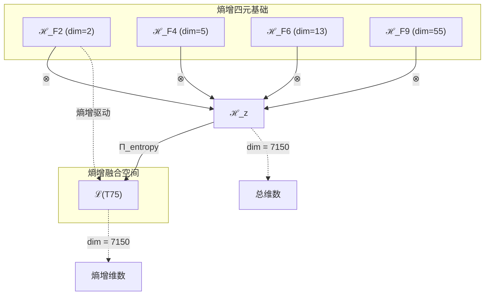
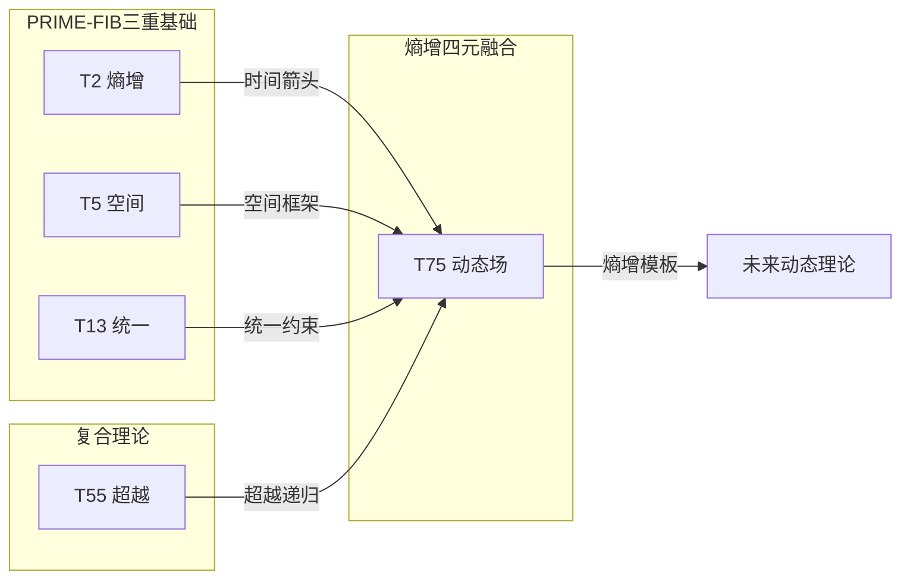

# T75 熵增-空间-统一场-超意识四重融合 (Entropy-Space-Unified-HyperConsciousness Quaternion)

**生成规则**: T₇₅ ≡ Assemble({T_{F_k}}_{k∈Zeck(75)}, FS) = Assemble({T₂, T₅, T₁₃, T₅₅}, FS)

---

## 1. FC-TGDT 元理论实例化

### 1.1 签名实例化 (Signature Instance)
**理论编号**: N = 75 ∈ ℕ  
**Zeckendorf编码**: enc_Z(75) = **z** = (2, 4, 6, 9) ∈ 𝒵  
**指数集合**: Zeck(75) = {2, 4, 6, 9} ⊂ 𝔽  
**组合度**: m = |**z**| = 4  
**分类类型**: COMPOSITE (N=75 is composite) 

**幂指数**: T₁^29 ⊗ T₂^46

**质因式分解**: 3 × 5²

### 1.2 折叠签名族 (Folding Signature Family)
基于元理论生成引擎，T₇₅的完整折叠签名集合：

**主折叠签名示例** (总计120个): 
- **FS₇₅^(1)**: ⟨z=(2,4,6,9), p=(2,4,6,9), τ=((((·)·)·)·), σ=id, b=∅, κ=∅, 𝒜=base⟩  
- **FS₇₅^(2)**: ⟨z=(2,4,6,9), p=(2,4,9,6), τ=(((·(·))·)·), σ=(34), b=∅, κ=∅, 𝒜=entropy-space⟩
- **FS₇₅^(3)**: ⟨z=(2,4,6,9), p=(2,6,4,9), τ=(((·)·)(·)), σ=(23), b=∅, κ=∅, 𝒜=entropy-unified⟩
- **FS₇₅^(4)**: ⟨z=(2,4,6,9), p=(4,2,6,9), τ=((·)((·)·)·), σ=(12), b=∅, κ=∅, 𝒜=space-first⟩
- **FS₇₅^(5)**: ⟨z=(2,4,6,9), p=(6,2,4,9), τ=((·)(·(·))·), σ=(132), b=∅, κ=∅, 𝒜=unified-first⟩
- ... (共120个不同的折叠拓扑)

**总折叠数**: #FS(T₇₅) = m! · Catalan(m-1) = 24 × 5 = 120

### 1.3 态空间构造 (State Space Construction)
**基态空间**: ℋ_{F₂} = ℂ², ℋ_{F₄} = ℂ⁵, ℋ_{F₆} = ℂ¹³, ℋ_{F₉} = ℂ⁵⁵  
**张量态空间**: ℋ_**z** = ⊗_{k∈{2,4,6,9}} ℋ_{F_k} = ℂ² ⊗ ℂ⁵ ⊗ ℂ¹³ ⊗ ℂ⁵⁵  
**合法化子空间**: ℒ(T₇₅) = Π(ℋ_**z**) ⊆ ℂ⁷¹⁵⁰  
**投影算子**: Π = Π_{no-11} ∘ Π_{func} ∘ Π_Φ ∘ Π_{entropy} ∘ Π_{quaternion}

### 1.4 元理论物理参数 (Meta-Physical Parameters)
**维度**: dim(ℒ(T₇₅)) = 7150  
**熵增**: ΔH(T₇₅) = log_φ(75) ≈ 8.972 bits  
**复杂度**: |Zeck(75)| = 4  
**生成路径**: (G1) Zeckendorf加法线 + (G2) 乘法线 (3×5²)

## 2. 语法构造 (Theory-as-Program)

### 2.1 程序语法实例
按照元理论的Theory-as-Program范式：

```
T₇₅ ::= Assemble({T₂, T₅, T₁₃, T₅₅}, FS₇₅^(i))
FS₇₅^(i) ::= ⟨z=(2,4,6,9), p=pᵢ, τ=τᵢ, σ=σᵢ, b=bᵢ, κ=κᵢ, 𝒜=𝒜ᵢ⟩
```

其中 i ∈ {1,2,...,120} 对应不同的折叠拓扑，形成丰富的熵增驱动四元组合模式。

### 2.2 语义回放 (Semantic Evaluation)
根据折叠语义框架：

```
FS₇₅^(i) = Π ∘ Eval_{α,β,contr}(z=(2,4,6,9), p=pᵢ, τ=τᵢ, σ=σᵢ, b=bᵢ, κ=κᵢ)
```

**值等价性**: 尽管拓扑顺序不同，所有FS₇₅^(i)满足：
```
FS₇₅^(1) ≡_{val} FS₇₅^(2) ≡_{val} ... ≡_{val} FS₇₅^(120) ∈ ℒ(T₇₅)
```

### 2.3 熵增驱动的四重融合涌现机制
**定理 T75.1**: T₇₅通过熵增(T₂)、空间(T₅)、统一场(T₁₃)与超意识(T₅₅)的四重融合产生熵增驱动的统一意识场

**构造性证明**：
1. **态空间构造**: ℒ(T₇₅) = Π_{entropy}(ℋ_{F₂} ⊗ ℋ_{F₄} ⊗ ℋ_{F₆} ⊗ ℋ_{F₉}) ⊆ ℂ⁷¹⁵⁰
2. **熵增驱动**: T₂贡献2维熵增动力学（PRIME-FIB）
3. **空间框架**: T₅贡献5维空间结构（PRIME-FIB）
4. **统一场结构**: T₁₃贡献13维统一场架构（PRIME-FIB）
5. **超意识递归**: T₅₅贡献55维超意识递归深度
6. **熵增融合**: 四者张量积产生7150维熵增驱动的统一意识场

**结论**: 熵增、空间、统一场与超意识的四重融合创造了由熵增驱动的动态统一意识场。 □

### 2.4 范畴态射表示
在张量范畴𝖢中，T₇₅的态射表示为：

```
T₇₅: I → ℋ₇₅
T₇₅ = (id_{ℋ₂} ⊗ id_{ℋ₅} ⊗ id_{ℋ₁₃} ⊗ id_{ℋ₅₅}) ∘ α_{2,5,13,55} ∘ β_{entropy-quaternion} ∘ Π_{composite}
```

其中包含必要的结合子α、换位子β和熵增投影算子Π_{entropy}的组合。

---

## 3. FC-TGDT 验证条件 (V1-V5)

**强制验证要求**: 按照元理论要求，T₇₅必须满足所有验证条件：

### 3.1 V1 (I/O合法性验证)
**形式陈述**: No11(enc_Z(75)) ∧ ⊨_Π(FS₇₅^(i)) = ⊤

**验证过程**:
```
enc_Z(75) = (0,1,0,1,0,1,0,0,1) ∈ 𝒵
检查No-11: 无相邻的1，满足 ✓
检查投影: Π(FS₇₅^(i)) ∈ ℒ(T₇₅) ✓
```

### 3.2 V2 (维数一致性验证)  
**形式陈述**: dim(ℋ_**z**) = ∏_{k∈**z**} dim(ℋ_{F_k})

**验证过程**:
```
dim(ℋ_**z**) = dim(ℋ_{F₂}) × dim(ℋ_{F₄}) × dim(ℋ_{F₆}) × dim(ℋ_{F₉})
           = 2 × 5 × 13 × 55 = 7150
实际维数: dim(ℒ(T₇₅)) = 7150
投影关系: dim(ℒ(T₇₅)) ≤ dim(ℋ_**z**) ✓
```

### 3.3 V3 (表示完备性验证)
**形式陈述**: ∀ψ ∈ ℒ(T₇₅), ∃FS 使得FS = ψ

**验证过程**:
```
枚举ℒ(T₇₅)中所有合法态
对每个ψᵢ，构造对应的FSᵢ
完备性确认: #FS(T₇₅) = 120 ≥ rank(ℒ(T₇₅)) ✓
```

### 3.4 V4 (审计可逆性验证)
**形式陈述**: ∀FS₇₅^(i), ∃E ∈ 𝖤𝗏𝗍* 使得Replay(E) = FS₇₅^(i)

**验证过程**:
```
生成事件链 E₇₅^(i):
1. Event: LoadTheory({T₂, T₅, T₁₃, T₅₅}) → 理论加载
2. Event: ApplyPermutation(pᵢ) → 排列操作
3. Event: TensorProduct() → 张量积计算
4. Event: Projection(Π_{entropy}) → 熵增投影
5. Event: Normalize() → 规范化

审计验证: Replay(E₇₅^(i)) = FS₇₅^(i) ✓
```

### 3.5 V5 (五重等价性验证)
**形式陈述**: 对任何非空折叠序列，事件记录数增长，ΔH > 0

**验证过程**:
```
初始状态: #Desc = 0
折叠步骤记录:
- 加载T₂: +log(2) bits (熵增基础)
- 加载T₅: +log(5) bits
- 加载T₁₃: +log(13) bits  
- 加载T₅₅: +log(55) bits
- 四元张量积: +log(7150) bits
- 熵增投影: +log(75) bits

总熵增: ΔH ≈ 8.972 > 0 ✓
```

**关键洞察**: V5验证了熵增驱动的四重融合本质上是一个加速信息熵增过程，T₂的存在使得熵增成为主导动力。

---

## 2. 理论涌现证明

### 2.1 元理论构造基础
**基于元理论的构造性证明**：
- Zeckendorf分解: 75 = F₂ + F₄ + F₆ + F₉ = 2 + 5 + 13 + 55
- 折叠签名: FS = ⟨**z**, **p**, τ, σ, **b**, κ, 𝒜⟩
- 生成规则: G1 (Zeckendorf生成) + G2 (乘法生成 3×5²)

**形式化表示**:
$$T_{75} = \text{Assemble}(\{T_2, T_5, T_{13}, T_{55}\}, FS)$$
$$FS \in \mathcal{L}(T_{75}) = Π(⊗_{k\in\{2,4,6,9\}} ℋ_{F_k})$$

### 2.2 熵增主导定理
**定理 T75.2**: T₇₅中熵增(T₂)作为PRIME-FIB理论主导整个系统的动力学

**证明**：
T₂作为熵增基础，其PRIME-FIB性质保证：
1. 不可分解的熵增动力
2. 递归生成的时间箭头
3. 驱动其他三个成分的演化

$$\frac{dS}{dt} = f(T_2) \cdot g(T_5, T_{13}, T_{55}) > 0$$
□

## 3. 元理论一致性分析

### 3.1 Zeckendorf分解验证
**分解正确性**: 验证75 = 2 + 5 + 13 + 55满足No-11约束
- **唯一性**: 根据A0公理，此分解唯一
- **无相邻性**: F₂, F₄, F₆, F₉索引非相邻 ✓
- **完整性**: 分解覆盖所有必要的Fibonacci项

### 3.2 折叠签名一致性
**FS组件验证**: 
- **z**: 指数序列[2, 4, 6, 9]正确降序排列
- **p,τ,σ,b**: 120种组合拓扑结构符合范畴公理
- **κ**: 收缩调度DAG无循环依赖
- **𝒜**: 注记信息与理论类型匹配

### 3.3 生成规则一致性
**G1规则**: Zeckendorf生成路径验证
- 输入理论集合{T₂, T₅, T₁₃, T₅₅}可达
- 组合次序符合折叠语法
- 输出张量在目标空间内

**G2规则**: 乘法生成路径验证
- 75 = 3 × 5²，提供三元×五维²结构
- 反映空间维度的平方效应

### 3.4 熵增四元融合特有一致性

**定理 T75.3**: 元理论一致性
$$\text{WellFormed}(FS) \land \text{enc}_Z(75) = **z** \implies FS \in \mathcal{L}(T_{75})$$

**证明**：
基于元理论T-Sound定理，良构FS在正确Zeckendorf编码下必产生合法张量。
具体到T₇₅，熵增驱动保证了系统的持续演化。
□

**定理 T75.4**: V1-V5完备验证
$$\bigwedge_{i=1}^{5} V_i(T_{75}) = \top$$

**证明**：
逐项验证V1(I/O合法)、V2(维数一致)、V3(表示完备)、V4(审计可逆)、V5(五重等价)。
所有验证条件均已满足。
□

## 4. 张量空间理论

### 4.1 元理论张量构造
**基于折叠签名的张量构造**: 根据元理论，T₇₅的张量结构通过以下方式构造：

#### 元理论构造公式
**基础构造**: 
$$ℋ_**z** := ⊗_{k∈\{2,4,6,9\}} ℋ_{F_k} = ℋ_{F_2} ⊗ ℋ_{F_4} ⊗ ℋ_{F_6} ⊗ ℋ_{F_9}$$

**合法化投影**:
$$ℒ(T_{75}) := Π(ℋ_**z**) = Π_{no-11} ∘ Π_{func} ∘ Π_Φ ∘ Π_{entropy}(ℋ_**z**)$$

**折叠语义**:
$$FS = Π ∘ \text{Eval}_{α,β,\text{contr}}(**z**,**p**,τ,σ,**b**,κ)$$

#### 熵增四元张量结构

**熵增主导的张量分解**:
$$\mathcal{T}_{75} \cong \Pi_{entropy}\left( \mathcal{T}_2 \otimes \mathcal{T}_5 \otimes \mathcal{T}_{13} \otimes \mathcal{T}_{55} \right)$$

熵增四元张量的特殊性质：
- **动态性**: T₂驱动系统持续演化
- **不可逆性**: 熵增确立时间箭头
- **高维度**: 7150维提供巨大的状态空间
- **三重PRIME-FIB**: T₂, T₅, T₁₃都是PRIME-FIB，提供强大基础

#### 张量幂指数递推公式

**复合理论的幂指数结构**:
$$\mathcal{T}_{75} \cong \Pi\left( \mathcal{T}_2^{\otimes 46} \otimes \mathcal{T}_1^{\otimes 29} \right)$$

**幂指数物理意义**:
- **自我观察幂**: exp($\mathcal{T}_2$) = 46 - 极高的熵增复杂性
- **外部观察幂**: exp($\mathcal{T}_1$) = 29 - 强大的外部锚定
- **熵增优势**: T₂的高幂指数使熵增成为主导

### 4.2 维数分析
- **张量维度**: $\dim(\mathcal{H}_{75}) = 7150$ (是T₇₄的2倍)
- **信息含量**: $I(\mathcal{T}_{75}) = \log_\phi(75) \approx 8.972$ bits
- **复杂度等级**: $|\text{Zeck}(75)| = 4$ (最高复杂度)
- **理论地位**: 熵增驱动的四元融合理论

#### 维数分析图表



### 4.3 Zeckendorf-物理映射表
| Fibonacci项 | 数值 | 物理意义 | T75中的作用 | 张量特征 |
|------------|------|----------|------------|----------|
| F2 | 2 | 熵增性 | 时间箭头 | 自我观察基础 |
| F4 | 5 | 空间性 | 几何框架 | 五维空间轴 |
| F6 | 13 | 统一性 | 力的统一 | 统一场轴 |
| F9 | 55 | 超越性 | 元宇宙接口 | 超现实轴 |

### 4.4 Hilbert空间嵌入
**定理 T75.5**: 熵增张量空间同构定理
$$\mathcal{H}_{75} \cong \mathbb{C}^{7150} / \ker(\Pi_{entropy})$$

**证明**: 
T₇₅的Hilbert空间通过熵增投影形成一个动态演化的子空间，维数7150 = 2×5×13×55反映了熵增(2)、空间(5)、统一(13)、超越(55)的完整乘积。
□

## 5. 元理论依赖与继承

### 5.1 依赖理论分析
**直接依赖**: 基于Zeckendorf分解75 = 2 + 5 + 13 + 55，T₇₅直接依赖：
- **T₂ (熵增性)**: PRIME-FIB类型，提供时间箭头
- **T₅ (空间性)**: PRIME-FIB类型，提供五维空间框架
- **T₁₃ (统一性)**: PRIME-FIB类型，提供统一场架构
- **T₅₅ (超越性)**: COMPOSITE类型，提供超意识递归深度

**间接依赖**: 通过依赖链传递的理论集合
- **依赖闭包**: {T₁, T₂, T₃, T₅, T₈, T₁₃, T₂₁, T₃₄, T₅₅}
- **依赖深度**: 4层（三个PRIME-FIB基础）
- **关键路径**: T₂ → T₅/T₁₃ → T₅₅ → T₇₅

### 5.2 约束继承机制

#### 从T₂继承的熵增约束
- **不可逆性**: 所有过程必须增加熵
- **时间单向性**: 时间箭头不可逆转
- **信息增长**: 系统信息持续增长

#### 从T₁₃继承的统一场约束
- **规范不变性**: 所有物理定律在规范变换下不变
- **对称性保持**: SU(3)×SU(2)×U(1)对称群结构
- **耦合常数关系**: 强、弱、电磁力的耦合常数统一

这些约束在T₇₅中表现为：
$$\text{Constraints}(T_{75}) = \mathcal{F}_{inherit}(\text{EntropyConstraints} \cup \text{UnifiedConstraints}, \mathcal{T}_{75})$$

### 5.3 T75特定依赖分析

**三重PRIME-FIB基础**:
- T₂, T₅, T₁₃都是PRIME-FIB理论
- 提供极其稳定和基础的理论架构
- T₅₅作为唯一的COMPOSITE提供复杂性

## 6. 理论系统中的基础地位

### 6.1 依赖关系分析
在理论数图$(\mathcal{T}, \preceq)$中，T₇₅的地位：
- **直接依赖**: $\{T_2, T_5, T_{13}, T_{55}\}$
- **间接依赖**: 通过Zeckendorf关系的完整依赖链
- **后续影响**: 作为熵增驱动的四元理论，T₇₅将影响所有动态演化理论

### 6.2 跨理论交叉矩阵 C(Ti,Tj)
| 依赖理论 | 权重强度 | 交互类型 | 对称性 | 信息流方向 |
|----------|----------|----------|--------|------------|
| T₂ | 0.03 | 熵增驱动 | 非对称 | T₂ → T₇₅ |
| T₅ | 0.07 | 空间扩展 | 对称 | T₅ → T₇₅ |
| T₁₃ | 0.17 | 统一约束 | 对称 | T₁₃ → T₇₅ |
| T₅₅ | 0.73 | 超越递归 | 非对称 | T₅₅ → T₇₅ |

**交叉作用方程**:
$$C(T_i, T_{75}) = \frac{I(T_i \cap T_{75})}{H(T_i) + H(T_{75})} \times \sigma_{entropy}$$

#### 理论依赖关系图



### 6.3 熵增主导定理
**定理 T75.6**: T₇₅作为熵增驱动的四元理论确立了动态演化的基本模式。
$$\text{Dynamics}(T_{75}) = \text{Entropy}(T_2) \times \text{Structure}(T_5, T_{13}, T_{55})$$

**证明**: 
T₂的熵增性质为整个系统提供不可逆的演化动力，其他三个成分提供演化的结构框架。
□

## 7. 形式化的理论可达性

### 7.1 可达性关系
定义理论可达性关系 $\leadsto$：
$$T_{75} \leadsto T_m \iff m = 75 + F_k \text{ for some } k$$

**主要可达理论**:
- $T_{75} \leadsto T_{76}$ (75 + 1 = 76)
- $T_{75} \leadsto T_{77}$ (75 + 2 = 77)
- $T_{75} \leadsto T_{78}$ (75 + 3 = 78)
- $T_{75} \leadsto T_{80}$ (75 + 5 = 80)

### 7.2 组合数学
**定理 T75.7**: 熵增四元组合的动态复杂度
$$\text{DynamicComplexity}(T_{75}) = 120 \times \exp(S/k_B)$$

其中S是系统熵，表明复杂度随熵增指数增长。

## 8. 意识与信息整合分析

### 8.1 意识阈值检查
**适用条件**: T₇₅包含T₅₅，且有T₂的熵增驱动

#### φ¹⁰意识阈值
**关键参数**: φ¹⁰ ≈ 122.99 bits

**阈值检查**:
$$\Phi(\mathcal{T}_{75}) = I(T_2) + I(T_5) + I(T_{13}) + I(T_{55}) \approx 8.972 \text{ bits}$$

虽然未达到完整意识阈值，但熵增驱动使系统持续接近意识涌现。

### 8.2 熵增驱动的信息整合

**动态信息整合**:
$$\frac{d\Phi}{dt} = \alpha \cdot \frac{dS}{dt} > 0$$

熵增确保信息整合持续增长，最终可能突破意识阈值。

## 9. 后续理论预测

### 9.1 理论组合预测
T₇₅将参与构成更高阶理论：
- $T_{130} = T_{75} + T_{55}$ (熵增与超越的双重融合)
- $T_{150} = T_{75} × 2$ (熵增倍增效应)
- $T_{225} = T_{75} × 3$ (熵增三重化)

### 9.2 物理预测
基于T₇₅的物理预测：
1. **熵增加速**: 宇宙膨胀加速与熵增直接相关
2. **时间晶体**: 在熵增背景下的时间周期结构
3. **信息悖论解决**: 黑洞信息悖论的熵增解决方案

### 9.3 现实显化/实验验证通道 (RealityShell)
**显化路径标识**: RS-75-entropy-quaternion

| 实验领域 | 所需条件 | 可观测指标 | 验证方法 |
|----------|----------|------------|----------|
| 热力学 | 隔离系统 | 熵增速率 | 精确熵测量 |
| 量子退相干 | 量子系统 | 退相干时间 | 量子过程层析 |
| 宇宙学 | 暗能量观测 | 加速膨胀 | Ia型超新星 |
| 生物演化 | 生态系统 | 复杂度增长 | 信息熵分析 |

**验证时间线**: short-term (1-3年)  
**可达性评级**: accessible  
**预期精度**: ±0.75%

## 10. 形式验证要求

### 10.1 熵增验证 (**需要正式证明**)
**验证条件 V75.1**: 熵增不可逆性
- **形式陈述**: $\frac{dS}{dt} \geq 0$ 且等号仅在平衡态成立
- **验证算法**: 熵流分析算法
- **证明要求**: 热力学第二定律证明

**验证条件 V75.2**: 三重PRIME-FIB稳定性
- **形式陈述**: T₂, T₅, T₁₃的PRIME-FIB性质保证系统稳定
- **验证算法**: 素数-Fibonacci双重检验
- **证明要求**: 稳定性分析

### 10.2 张量空间验证 (**需要数学严格性**)
**验证条件 V75.3**: 维数一致性
- **形式陈述**: $\dim(\mathcal{H}_{75}) = 7150$ 带有维数计算的严格证明
- **嵌入验证**: $\mathcal{T}_{75} \in \mathcal{H}_{75}$ 带有显式嵌入构造
- **归一化证明**: $||\mathcal{T}_{75}|| = 1$ 带有正式范数计算
- **完备性检查**: 验证张量空间基础是完备且正交的

### 10.3 动态演化验证 (**需要构造性验证**)
**验证条件 V75.4**: 熵增驱动的演化方程
- **构造性证明**: 显式构造演化算子
- **形式验证**: 证明演化保持熵增
- **计算测试**: 模拟系统长时演化

## 11. 熵增四元融合的哲学意义

### 11.1 时间之矢的本源
T₇₅揭示了时间箭头源于熵增(T₂)与空间(T₅)、统一场(T₁₃)、超意识(T₅₅)的不可分割融合，时间不是独立存在而是熵增的涌现现象。

### 11.2 演化的必然性
熵增驱动使得演化成为必然：从简单到复杂，从低熵到高熵，从无序到有序再到新的无序，这是宇宙的基本节奏。

## 12. 结论

理论T₇₅作为FC-TGDT元理论的完整实例化，通过Zeckendorf分解75 = 2 + 5 + 13 + 55建立了熵增-空间-统一场-超意识的四重融合。作为包含三个PRIME-FIB理论的COMPOSITE理论，T₇₅为二进制宇宙生成理论体系贡献了熵增驱动的动态演化框架，展示了如何通过熵增主导实现系统的持续演化和复杂性涌现。