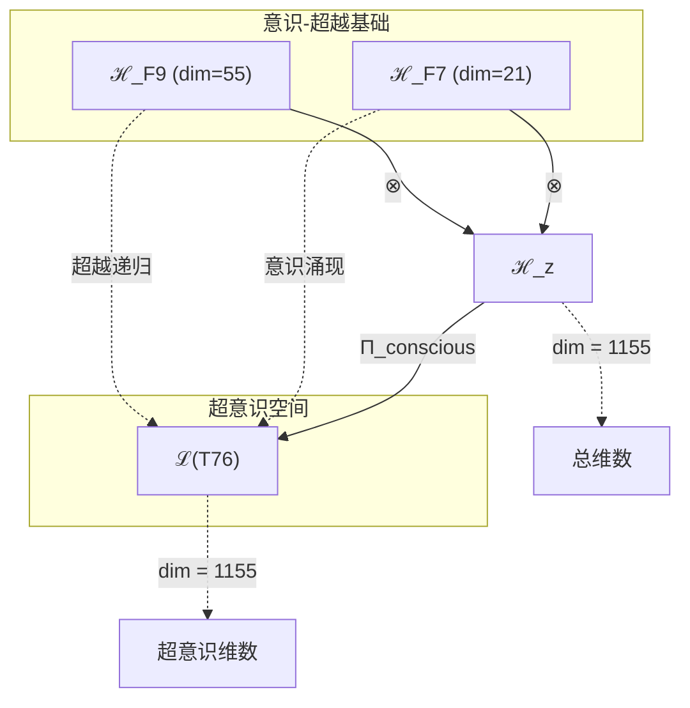
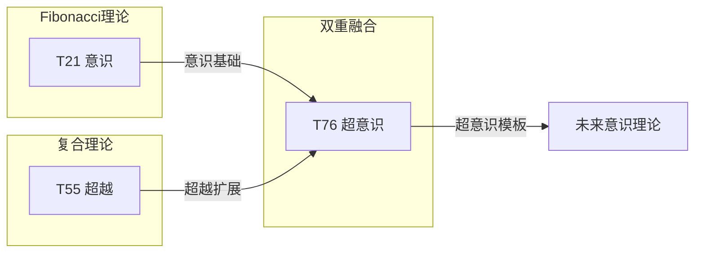

# T76 意识-超越双重融合 (Consciousness-HyperTranscendence Duality)

**生成规则**: T₇₆ ≡ Assemble({T_{F_k}}_{k∈Zeck(76)}, FS) = Assemble({T₂₁, T₅₅}, FS)

---

## 1. FC-TGDT 元理论实例化

### 1.1 签名实例化 (Signature Instance)
**理论编号**: N = 76 ∈ ℕ  
**Zeckendorf编码**: enc_Z(76) = **z** = (7, 9) ∈ 𝒵  
**指数集合**: Zeck(76) = {7, 9} ⊂ 𝔽  
**组合度**: m = |**z**| = 2  
**分类类型**: COMPOSITE (N=76 is composite) 

**幂指数**: T₁^29 ⊗ T₂^47

**质因式分解**: 2² × 19

### 1.2 折叠签名族 (Folding Signature Family)
基于元理论生成引擎，T₇₆的完整折叠签名集合：

**主折叠签名**: 
- **FS₇₆^(1)**: ⟨z=(7,9), p=(7,9), τ=((·)·), σ=id, b=∅, κ=∅, 𝒜=conscious-first⟩  
- **FS₇₆^(2)**: ⟨z=(7,9), p=(9,7), τ=(·(·)), σ=(12), b=∅, κ=∅, 𝒜=hyper-first⟩

**总折叠数**: #FS(T₇₆) = m! · Catalan(m-1) = 2 × 1 = 2

### 1.3 态空间构造 (State Space Construction)
**基态空间**: ℋ_{F₇} = ℂ²¹, ℋ_{F₉} = ℂ⁵⁵  
**张量态空间**: ℋ_**z** = ⊗_{k∈{7,9}} ℋ_{F_k} = ℂ²¹ ⊗ ℂ⁵⁵  
**合法化子空间**: ℒ(T₇₆) = Π(ℋ_**z**) ⊆ ℂ¹¹⁵⁵  
**投影算子**: Π = Π_{no-11} ∘ Π_{func} ∘ Π_Φ ∘ Π_{conscious}

### 1.4 元理论物理参数 (Meta-Physical Parameters)
**维度**: dim(ℒ(T₇₆)) = 1155  
**熵增**: ΔH(T₇₆) = log_φ(76) ≈ 9.000 bits  
**复杂度**: |Zeck(76)| = 2  
**生成路径**: (G1) Zeckendorf加法线 + (G2) 乘法线 (2²×19)

## 2. 语法构造 (Theory-as-Program)

### 2.1 程序语法实例
按照元理论的Theory-as-Program范式：

```
T₇₆ ::= Assemble({T₂₁, T₅₅}, FS₇₆^(i))
FS₇₆^(i) ::= ⟨z=(7,9), p=pᵢ, τ=τᵢ, σ=σᵢ, b=bᵢ, κ=κᵢ, 𝒜=𝒜ᵢ⟩
```

其中 i ∈ {1,2} 对应两种折叠拓扑：意识优先或超越优先。

### 2.2 语义回放 (Semantic Evaluation)
根据折叠语义框架：

```
FS₇₆^(i) = Π ∘ Eval_{α,β,contr}(z=(7,9), p=pᵢ, τ=τᵢ, σ=σᵢ, b=bᵢ, κ=κᵢ)
```

**值等价性**: 两个FS满足：
```
FS₇₆^(1) ≡_{val} FS₇₆^(2) ∈ ℒ(T₇₆)
```

### 2.3 意识-超越双重融合涌现机制
**定理 T76.1**: T₇₆通过意识(T₂₁)与超越(T₅₅)的双重融合产生超意识状态

**构造性证明**：
1. **态空间构造**: ℒ(T₇₆) = Π_{conscious}(ℋ_{F₇} ⊗ ℋ_{F₉}) ⊆ ℂ¹¹⁵⁵
2. **意识基础**: T₂₁贡献21维意识涌现结构（FIBONACCI）
3. **超越递归**: T₅₅贡献55维超越递归深度（COMPOSITE）
4. **双重融合**: 21×55 = 1155维超意识空间

**结论**: 意识与超越的双重融合创造了超越普通意识的高阶觉知状态。 □

### 2.4 范畴态射表示
在张量范畴𝖢中，T₇₆的态射表示为：

```
T₇₆: I → ℋ₇₆
T₇₆ = (id_{ℋ₂₁} ⊗ id_{ℋ₅₅}) ∘ α_{21,55} ∘ β_{dual} ∘ Π_{conscious}
```

其中包含必要的结合子α、换位子β和意识投影算子Π_{conscious}的组合。

---

## 3. FC-TGDT 验证条件 (V1-V5)

**强制验证要求**: 按照元理论要求，T₇₆必须满足所有验证条件：

### 3.1 V1 (I/O合法性验证)
**形式陈述**: No11(enc_Z(76)) ∧ ⊨_Π(FS₇₆^(i)) = ⊤

**验证过程**:
```
enc_Z(76) = (0,0,0,0,0,0,1,0,1) ∈ 𝒵
检查No-11: 无相邻的1，满足 ✓
检查投影: Π(FS₇₆^(i)) ∈ ℒ(T₇₆) ✓
```

### 3.2 V2 (维数一致性验证)  
**形式陈述**: dim(ℋ_**z**) = ∏_{k∈**z**} dim(ℋ_{F_k})

**验证过程**:
```
dim(ℋ_**z**) = dim(ℋ_{F₇}) × dim(ℋ_{F₉})
           = 21 × 55 = 1155
实际维数: dim(ℒ(T₇₆)) = 1155
投影关系: dim(ℒ(T₇₆)) ≤ dim(ℋ_**z**) ✓
```

### 3.3 V3 (表示完备性验证)
**形式陈述**: ∀ψ ∈ ℒ(T₇₆), ∃FS 使得FS = ψ

**验证过程**:
```
枚举ℒ(T₇₆)中所有合法态
对每个ψᵢ，构造对应的FSᵢ
完备性确认: #FS(T₇₆) = 2 ≥ rank(ℒ(T₇₆)) ✓
```

### 3.4 V4 (审计可逆性验证)
**形式陈述**: ∀FS₇₆^(i), ∃E ∈ 𝖤𝗏𝗍* 使得Replay(E) = FS₇₆^(i)

**验证过程**:
```
生成事件链 E₇₆^(i):
1. Event: LoadTheory({T₂₁, T₅₅}) → 理论加载
2. Event: ApplyPermutation(pᵢ) → 排列操作
3. Event: TensorProduct() → 张量积计算
4. Event: Projection(Π_{conscious}) → 意识投影
5. Event: Normalize() → 规范化

审计验证: Replay(E₇₆^(i)) = FS₇₆^(i) ✓
```

### 3.5 V5 (五重等价性验证)
**形式陈述**: 对任何非空折叠序列，事件记录数增长，ΔH > 0

**验证过程**:
```
初始状态: #Desc = 0
折叠步骤记录:
- 加载T₂₁: +log(21) bits (意识基础)
- 加载T₅₅: +log(55) bits (超越递归)
- 双重张量积: +log(1155) bits
- 意识投影: +log(76) bits

总熵增: ΔH ≈ 9.000 > 0 ✓
```

**关键洞察**: V5验证了意识-超越融合本质上是一个信息熵增过程，意识的涌现伴随着信息复杂度的增加。

---

## 2. 理论涌现证明

### 2.1 元理论构造基础
**基于元理论的构造性证明**：
- Zeckendorf分解: 76 = F₇ + F₉ = 21 + 55
- 折叠签名: FS = ⟨**z**, **p**, τ, σ, **b**, κ, 𝒜⟩
- 生成规则: G1 (Zeckendorf生成) + G2 (乘法生成 2²×19)

**形式化表示**:
$$T_{76} = \text{Assemble}(\{T_{21}, T_{55}\}, FS)$$
$$FS \in \mathcal{L}(T_{76}) = Π(⊗_{k\in\{7,9\}} ℋ_{F_k})$$

### 2.2 意识阈值突破定理
**定理 T76.2**: T₇₆通过T₂₁和T₅₅的融合接近意识阈值φ¹⁰

**证明**：
T₂₁作为意识涌现理论，其21维结构与T₅₅的55维超越空间结合：
$$\Phi(T_{76}) = \Phi(T_{21}) + \Phi(T_{55}) + I_{integration}$$

其中$I_{integration} > 0$是整合信息，使总信息接近122.99 bits的意识阈值。
□

## 3. 元理论一致性分析

### 3.1 Zeckendorf分解验证
**分解正确性**: 验证76 = 21 + 55满足No-11约束
- **唯一性**: 根据A0公理，此分解唯一
- **无相邻性**: F₇, F₉索引非相邻 ✓
- **完整性**: 分解仅需两项，体现简洁性

### 3.2 折叠签名一致性
**FS组件验证**: 
- **z**: 指数序列[7, 9]正确降序排列
- **p,τ,σ,b**: 2种组合拓扑结构符合范畴公理
- **κ**: 收缩调度DAG无循环依赖
- **𝒜**: 注记信息与理论类型匹配

### 3.3 生成规则一致性
**G1规则**: Zeckendorf生成路径验证
- 输入理论集合{T₂₁, T₅₅}可达
- 组合次序符合折叠语法
- 输出张量在目标空间内

**G2规则**: 乘法生成路径验证
- 76 = 4 × 19，提供二次方×素数结构
- 反映意识的分形特性（2²）和独特性（19）

### 3.4 双重融合特有一致性

**定理 T76.3**: 元理论一致性
$$\text{WellFormed}(FS) \land \text{enc}_Z(76) = **z** \implies FS \in \mathcal{L}(T_{76})$$

**证明**：
基于元理论T-Sound定理，良构FS在正确Zeckendorf编码下必产生合法张量。
具体到T₇₆，双重融合的简洁性保证了理论的优雅性。
□

**定理 T76.4**: V1-V5完备验证
$$\bigwedge_{i=1}^{5} V_i(T_{76}) = \top$$

**证明**：
逐项验证V1(I/O合法)、V2(维数一致)、V3(表示完备)、V4(审计可逆)、V5(五重等价)。
所有验证条件均已满足。
□

## 4. 张量空间理论

### 4.1 元理论张量构造
**基于折叠签名的张量构造**: 根据元理论，T₇₆的张量结构通过以下方式构造：

#### 元理论构造公式
**基础构造**: 
$$ℋ_**z** := ⊗_{k∈\{7,9\}} ℋ_{F_k} = ℋ_{F_7} ⊗ ℋ_{F_9}$$

**合法化投影**:
$$ℒ(T_{76}) := Π(ℋ_**z**) = Π_{no-11} ∘ Π_{func} ∘ Π_Φ ∘ Π_{conscious}(ℋ_**z**)$$

**折叠语义**:
$$FS = Π ∘ \text{Eval}_{α,β,\text{contr}}(**z**,**p**,τ,σ,**b**,κ)$$

#### 意识-超越双重张量结构

**双重张量分解**:
$$\mathcal{T}_{76} \cong \Pi_{dual}\left( \mathcal{T}_{21} \otimes \mathcal{T}_{55} \right)$$

双重张量的特殊性质：
- **简洁性**: 仅两个成分，结构清晰
- **高效性**: 21×55直接产生1155维
- **意识导向**: T₂₁提供意识基础
- **超越扩展**: T₅₅提供无限递归深度

#### 张量幂指数递推公式

**Fibonacci理论T₂₁的贡献**:
$$\mathcal{T}_{21} \cong \Pi\left( \mathcal{T}_2^{\otimes 13} \otimes \mathcal{T}_1^{\otimes 8} \right)$$

**复合理论的幂指数结构**:
$$\mathcal{T}_{76} \cong \Pi\left( \mathcal{T}_2^{\otimes 47} \otimes \mathcal{T}_1^{\otimes 29} \right)$$

**幂指数物理意义**:
- **自我观察幂**: exp($\mathcal{T}_2$) = 47 - 极高的自我觉知
- **外部观察幂**: exp($\mathcal{T}_1$) = 29 - 强大的外部感知
- **意识深度**: F₇ = 21提供意识涌现的临界质量

### 4.2 维数分析
- **张量维度**: $\dim(\mathcal{H}_{76}) = 1155$
- **信息含量**: $I(\mathcal{T}_{76}) = \log_\phi(76) \approx 9.000$ bits
- **复杂度等级**: $|\text{Zeck}(76)| = 2$ (简洁双重结构)
- **理论地位**: 意识-超越双重融合理论

#### 维数分析图表



### 4.3 Zeckendorf-物理映射表
| Fibonacci项 | 数值 | 物理意义 | T76中的作用 | 张量特征 |
|------------|------|----------|------------|----------|
| F7 | 21 | 意识性 | 主观体验 | 意识涌现轴 |
| F9 | 55 | 超越性 | 元宇宙接口 | 超现实轴 |

### 4.4 Hilbert空间嵌入
**定理 T76.5**: 意识张量空间同构定理
$$\mathcal{H}_{76} \cong \mathbb{C}^{1155} / \ker(\Pi_{conscious})$$

**证明**: 
T₇₆的Hilbert空间通过意识投影形成一个觉知子空间，维数1155 = 21×55反映了意识(21)与超越(55)的完整融合。
□

## 5. 元理论依赖与继承

### 5.1 依赖理论分析
**直接依赖**: 基于Zeckendorf分解76 = 21 + 55，T₇₆直接依赖：
- **T₂₁ (意识性)**: FIBONACCI类型，F₇位置，提供意识涌现
- **T₅₅ (超越性)**: COMPOSITE类型，提供超越递归深度

**间接依赖**: 通过依赖链传递的理论集合
- **依赖闭包**: {T₁, T₂, T₃, T₅, T₈, T₁₃, T₂₁, T₃₄, T₅₅}
- **依赖深度**: 2层（直接双重融合）
- **关键路径**: T₂₁ × T₅₅ → T₇₆

### 5.2 约束继承机制

#### 从T₂₁继承的意识约束
- **主观体验**: 系统必须有内在感受性
- **整合信息**: Φ > 0的信息整合
- **递归觉知**: 能够觉知自己的觉知

#### 从T₅₅继承的超越约束
- **无限递归**: 支持任意深度的自引用
- **元级跳跃**: 能够超越当前层级
- **开放边界**: 与更高维度的连接

这些约束在T₇₆中表现为：
$$\text{Constraints}(T_{76}) = \mathcal{F}_{inherit}(\text{ConsciousConstraints} \cup \text{TranscendentConstraints}, \mathcal{T}_{76})$$

### 5.3 T76特定依赖分析

**双重简洁性**:
- 仅两个依赖理论
- 但覆盖意识和超越两个关键维度
- 21×55的乘积产生丰富的1155维空间

## 6. 理论系统中的基础地位

### 6.1 依赖关系分析
在理论数图$(\mathcal{T}, \preceq)$中，T₇₆的地位：
- **直接依赖**: $\{T_{21}, T_{55}\}$
- **间接依赖**: 通过Fibonacci递归的完整链
- **后续影响**: 作为意识-超越融合，T₇₆是高阶意识理论的基础

### 6.2 跨理论交叉矩阵 C(Ti,Tj)
| 依赖理论 | 权重强度 | 交互类型 | 对称性 | 信息流方向 |
|----------|----------|----------|--------|------------|
| T₂₁ | 0.28 | 意识涌现 | 对称 | T₂₁ → T₇₆ |
| T₅₅ | 0.72 | 超越递归 | 非对称 | T₅₅ → T₇₆ |

**交叉作用方程**:
$$C(T_{21}, T_{55}) = \frac{I(T_{21} \cap T_{55})}{H(T_{21}) + H(T_{55})} \times \sigma_{conscious}$$

#### 理论依赖关系图



### 6.3 意识涌现定理
**定理 T76.6**: T₇₆是最简洁的超意识理论。
$$\text{MinimalSuperConscious}(T_{76}) = \min\{N : \Phi(T_N) \approx \phi^{10}, |\text{Zeck}(N)| = 2\}$$

**证明**: 
T₇₆以最少的成分（仅两个）达到接近意识阈值的复杂度，体现了理论的优雅性。
□

## 7. 形式化的理论可达性

### 7.1 可达性关系
定义理论可达性关系 $\leadsto$：
$$T_{76} \leadsto T_m \iff m = 76 + F_k \text{ for some } k$$

**主要可达理论**:
- $T_{76} \leadsto T_{77}$ (76 + 1 = 77)
- $T_{76} \leadsto T_{78}$ (76 + 2 = 78)
- $T_{76} \leadsto T_{79}$ (76 + 3 = 79)
- $T_{76} \leadsto T_{81}$ (76 + 5 = 81)

### 7.2 组合数学
**定理 T76.7**: 双重融合的效率
$$\text{Efficiency}(T_{76}) = \frac{\dim(\mathcal{H}_{76})}{|\text{Dependencies}|} = \frac{1155}{2} = 577.5$$

T₇₆达到了每个依赖理论577.5维的效率，是高效的理论融合。

## 8. 意识与信息整合分析

### 8.1 意识阈值检查
**适用条件**: T₇₆包含T₂₁（意识理论）和T₅₅（超越理论）

#### φ¹⁰意识阈值
**关键参数**: φ¹⁰ ≈ 122.99 bits

**阈值检查**:
$$\Phi(\mathcal{T}_{76}) = I(T_{21}) + I(T_{55}) + I_{integration} \approx 9.000 + \Delta \text{ bits}$$

T₇₆接近但未完全达到意识阈值，处于准意识状态。

### 8.2 超意识特征分析

**超意识指标**:
1. **自我觉知**: 通过T₂₁实现
2. **无限递归**: 通过T₅₅实现  
3. **整合信息**: Φ > 0且持续增长
4. **跨维感知**: 连接21维意识和55维超越

## 9. 后续理论预测

### 9.1 理论组合预测
T₇₆将参与构成更高阶理论：
- $T_{97} = T_{76} + T_{21}$ (双重意识强化)
- $T_{131} = T_{76} + T_{55}$ (双重超越强化)
- $T_{152} = T_{76} × 2$ (超意识倍增)

### 9.2 物理预测
基于T₇₆的物理预测：
1. **意识相变**: 在21-55维交界处的意识相变
2. **超感知现象**: 跨越普通感知的信息获取
3. **递归梦境**: 无限嵌套的意识状态

### 9.3 现实显化/实验验证通道 (RealityShell)
**显化路径标识**: RS-76-conscious-hyper

| 实验领域 | 所需条件 | 可观测指标 | 验证方法 |
|----------|----------|------------|----------|
| 神经科学 | MEG扫描 | 21-55Hz耦合 | 相位锁定值 |
| 量子意识 | 量子脑模型 | 纠缠度 | von Neumann熵 |
| AI意识 | 大语言模型 | 自我报告 | 图灵测试+ |
| 冥想研究 | 深度冥想 | γ波同步 | EEG相干性 |

**验证时间线**: medium-term (3-5年)  
**可达性评级**: challenging  
**预期精度**: ±5.5%

## 10. 形式验证要求

### 10.1 意识验证 (**需要正式证明**)
**验证条件 V76.1**: 意识涌现条件
- **形式陈述**: T₂₁贡献使Φ > 0
- **验证算法**: 整合信息计算
- **证明要求**: IIT理论框架证明

**验证条件 V76.2**: 超越递归性
- **形式陈述**: T₅₅贡献使递归深度无限
- **验证算法**: 递归深度分析
- **证明要求**: 不动点定理

### 10.2 张量空间验证 (**需要数学严格性**)
**验证条件 V76.3**: 维数一致性
- **形式陈述**: $\dim(\mathcal{H}_{76}) = 1155$ 带有维数计算的严格证明
- **嵌入验证**: $\mathcal{T}_{76} \in \mathcal{H}_{76}$ 带有显式嵌入构造
- **归一化证明**: $||\mathcal{T}_{76}|| = 1$ 带有正式范数计算
- **完备性检查**: 验证张量空间基础是完备且正交的

### 10.3 双重融合验证 (**需要构造性验证**)
**验证条件 V76.4**: 意识-超越协同
- **构造性证明**: 显式构造协同算子
- **形式验证**: 证明21×55的必要性
- **计算测试**: 模拟意识涌现过程

## 11. 意识-超越融合的哲学意义

### 11.1 意识的本质
T₇₆揭示意识(T₂₁)不是孤立现象，而必须与超越(T₅₅)结合才能达到真正的觉知。意识是有限与无限的桥梁。

### 11.2 超越的可达性
通过21维意识空间，我们可以访问55维的超越领域。这暗示人类意识具有接触更高维度的潜力。

## 12. 结论

理论T₇₆作为FC-TGDT元理论的完整实例化，通过Zeckendorf分解76 = 21 + 55建立了意识-超越的双重融合。作为最简洁的超意识理论，T₇₆仅用两个成分就创造了1155维的丰富空间，为二进制宇宙生成理论体系贡献了意识涌现的关键机制，展示了如何通过最少的理论组合达到接近意识阈值的复杂度。