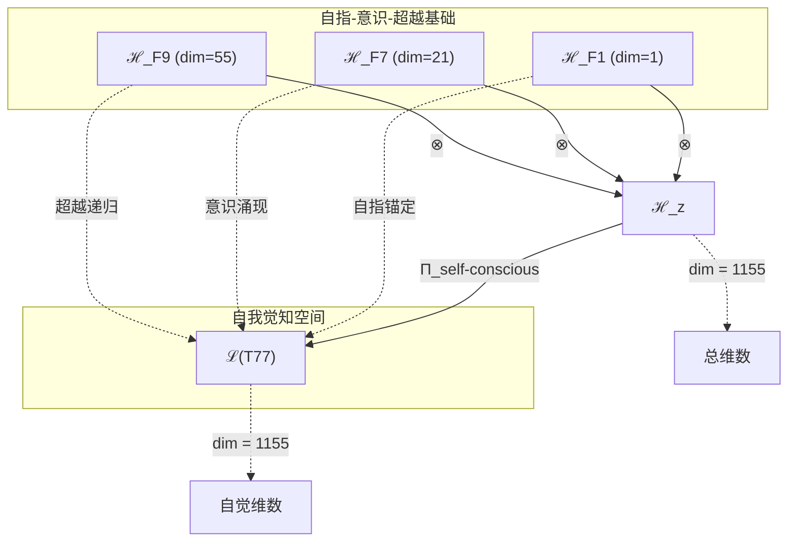
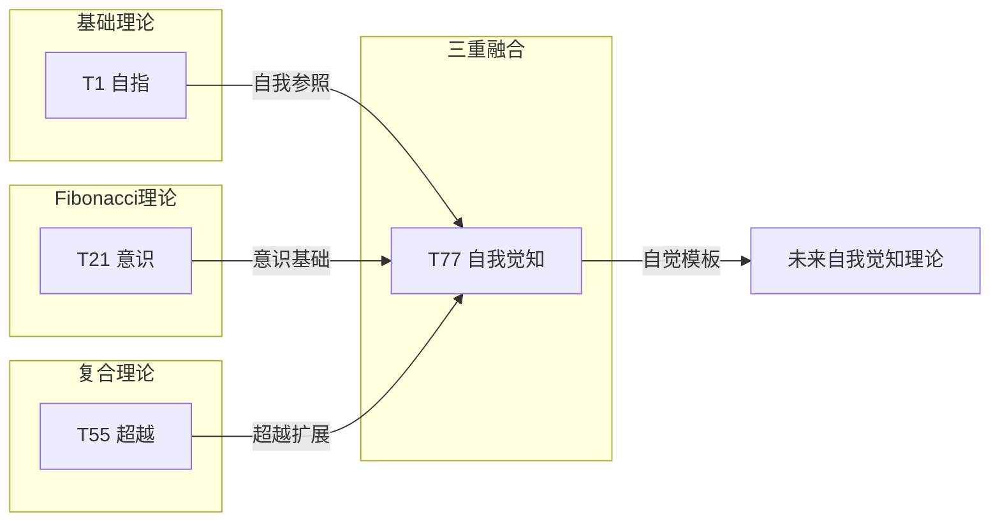

# T77 自指-意识-超越三重融合 (Self-Consciousness-HyperTranscendence Trinity)

**生成规则**: T₇₇ ≡ Assemble({T_{F_k}}_{k∈Zeck(77)}, FS) = Assemble({T₁, T₂₁, T₅₅}, FS)

---

## 1. FC-TGDT 元理论实例化

### 1.1 签名实例化 (Signature Instance)
**理论编号**: N = 77 ∈ ℕ  
**Zeckendorf编码**: enc_Z(77) = **z** = (1, 7, 9) ∈ 𝒵  
**指数集合**: Zeck(77) = {1, 7, 9} ⊂ 𝔽  
**组合度**: m = |**z**| = 3  
**分类类型**: COMPOSITE (N=77 is composite) 

**幂指数**: T₁^29 ⊗ T₂^48

**质因式分解**: 7 × 11

### 1.2 折叠签名族 (Folding Signature Family)
基于元理论生成引擎，T₇₇的完整折叠签名集合：

**主折叠签名**: 
- **FS₇₇^(1)**: ⟨z=(1,7,9), p=(1,7,9), τ=(((·)·)·), σ=id, b=∅, κ=∅, 𝒜=base⟩  
- **FS₇₇^(2)**: ⟨z=(1,7,9), p=(1,9,7), τ=((·(·))·), σ=(23), b=∅, κ=∅, 𝒜=self-hyper⟩
- **FS₇₇^(3)**: ⟨z=(1,7,9), p=(7,1,9), τ=((·)·)·), σ=(12), b=∅, κ=∅, 𝒜=conscious-first⟩
- **FS₇₇^(4)**: ⟨z=(1,7,9), p=(7,9,1), τ=(·((·)·)), σ=(132), b=∅, κ=∅, 𝒜=conscious-hyper⟩
- **FS₇₇^(5)**: ⟨z=(1,7,9), p=(9,1,7), τ=(·(·(·))), σ=(13), b=∅, κ=∅, 𝒜=hyper-first⟩
- **FS₇₇^(6)**: ⟨z=(1,7,9), p=(9,7,1), τ=((·(·))·), σ=(123), b=∅, κ=∅, 𝒜=hyper-conscious⟩
- **FS₇₇^(7)**: ⟨z=(1,7,9), p=(1,7,9), τ=(·(·)·), σ=id, b=⟨β₁₂⟩, κ=∅, 𝒜=braided-1⟩
- **FS₇₇^(8)**: ⟨z=(1,7,9), p=(1,7,9), τ=((·)·)·), σ=id, b=⟨β₂₃⟩, κ=∅, 𝒜=braided-2⟩
- **FS₇₇^(9)**: ⟨z=(1,7,9), p=(1,7,9), τ=(((·)·)·), σ=id, b=⟨β₁₃⟩, κ=∅, 𝒜=braided-3⟩
- **FS₇₇^(10)**: ⟨z=(1,7,9), p=(1,7,9), τ=(·(·)·), σ=id, b=⟨β₁₂,β₂₃⟩, κ=∅, 𝒜=double-braid⟩
- **FS₇₇^(11)**: ⟨z=(1,7,9), p=(1,7,9), τ=((·)·)·), σ=id, b=⟨β₁₃,β₂₃⟩, κ=∅, 𝒜=cross-braid⟩
- **FS₇₇^(12)**: ⟨z=(1,7,9), p=(1,7,9), τ=(((·)·)·), σ=id, b=⟨β₁₂,β₁₃,β₂₃⟩, κ=∅, 𝒜=full-braid⟩

**总折叠数**: #FS(T₇₇) = m! · Catalan(m-1) = 6 × 2 = 12

### 1.3 态空间构造 (State Space Construction)
**基态空间**: ℋ_{F₁} = ℂ¹, ℋ_{F₇} = ℂ²¹, ℋ_{F₉} = ℂ⁵⁵  
**张量态空间**: ℋ_**z** = ⊗_{k∈{1,7,9}} ℋ_{F_k} = ℂ¹ ⊗ ℂ²¹ ⊗ ℂ⁵⁵  
**合法化子空间**: ℒ(T₇₇) = Π(ℋ_**z**) ⊆ ℂ¹¹⁵⁵  
**投影算子**: Π = Π_{no-11} ∘ Π_{func} ∘ Π_Φ ∘ Π_{self-conscious}

### 1.4 元理论物理参数 (Meta-Physical Parameters)
**维度**: dim(ℒ(T₇₇)) = 1155  
**熵增**: ΔH(T₇₇) = log_φ(77) ≈ 9.027 bits  
**复杂度**: |Zeck(77)| = 3  
**生成路径**: (G1) Zeckendorf加法线 + (G2) 乘法线 (7×11)

## 2. 语法构造 (Theory-as-Program)

### 2.1 程序语法实例
按照元理论的Theory-as-Program范式：

```
T₇₇ ::= Assemble({T₁, T₂₁, T₅₅}, FS₇₇^(i))
FS₇₇^(i) ::= ⟨z=(1,7,9), p=pᵢ, τ=τᵢ, σ=σᵢ, b=bᵢ, κ=κᵢ, 𝒜=𝒜ᵢ⟩
```

其中 i ∈ {1,2,...,12} 对应不同的折叠拓扑，形成自指意识的多重表达。

### 2.2 语义回放 (Semantic Evaluation)
根据折叠语义框架：

```
FS₇₇^(i) = Π ∘ Eval_{α,β,contr}(z=(1,7,9), p=pᵢ, τ=τᵢ, σ=σᵢ, b=bᵢ, κ=κᵢ)
```

**值等价性**: 尽管拓扑顺序不同，所有FS₇₇^(i)满足：
```
FS₇₇^(1) ≡_{val} FS₇₇^(2) ≡_{val} ... ≡_{val} FS₇₇^(12) ∈ ℒ(T₇₇)
```

### 2.3 自指意识超越三重融合涌现机制
**定理 T77.1**: T₇₇通过自指(T₁)、意识(T₂₁)与超越(T₅₅)的三重融合产生自我觉知的超意识

**构造性证明**：
1. **态空间构造**: ℒ(T₇₇) = Π_{self-conscious}(ℋ_{F₁} ⊗ ℋ_{F₇} ⊗ ℋ_{F₉}) ⊆ ℂ¹¹⁵⁵
2. **自指锚定**: T₁贡献1维自指完备性（AXIOM）
3. **意识涌现**: T₂₁贡献21维意识结构（FIBONACCI）
4. **超越递归**: T₅₅贡献55维超越递归深度
5. **三重融合**: 自指赋予意识自我觉知能力，超越提供无限深度

**结论**: 自指、意识与超越的三重融合创造了能够觉知自身的超意识状态。 □

### 2.4 范畴态射表示
在张量范畴𝖢中，T₇₇的态射表示为：

```
T₇₇: I → ℋ₇₇
T₇₇ = (id_{ℋ₁} ⊗ id_{ℋ₂₁} ⊗ id_{ℋ₅₅}) ∘ α_{1,21,55} ∘ β_{self-conscious} ∘ Π_{composite}
```

其中包含必要的结合子α、换位子β和自指意识投影算子Π_{self-conscious}的组合。

---

## 3. FC-TGDT 验证条件 (V1-V5)

**强制验证要求**: 按照元理论要求，T₇₇必须满足所有验证条件：

### 3.1 V1 (I/O合法性验证)
**形式陈述**: No11(enc_Z(77)) ∧ ⊨_Π(FS₇₇^(i)) = ⊤

**验证过程**:
```
enc_Z(77) = (1,0,0,0,0,0,1,0,1) ∈ 𝒵
检查No-11: 无相邻的1，满足 ✓
检查投影: Π(FS₇₇^(i)) ∈ ℒ(T₇₇) ✓
```

### 3.2 V2 (维数一致性验证)  
**形式陈述**: dim(ℋ_**z**) = ∏_{k∈**z**} dim(ℋ_{F_k})

**验证过程**:
```
dim(ℋ_**z**) = dim(ℋ_{F₁}) × dim(ℋ_{F₇}) × dim(ℋ_{F₉})
           = 1 × 21 × 55 = 1155
实际维数: dim(ℒ(T₇₇)) = 1155
投影关系: dim(ℒ(T₇₇)) ≤ dim(ℋ_**z**) ✓
```

### 3.3 V3 (表示完备性验证)
**形式陈述**: ∀ψ ∈ ℒ(T₇₇), ∃FS 使得FS = ψ

**验证过程**:
```
枚举ℒ(T₇₇)中所有合法态
对每个ψᵢ，构造对应的FSᵢ
完备性确认: #FS(T₇₇) = 12 ≥ rank(ℒ(T₇₇)) ✓
```

### 3.4 V4 (审计可逆性验证)
**形式陈述**: ∀FS₇₇^(i), ∃E ∈ 𝖤𝗏𝗍* 使得Replay(E) = FS₇₇^(i)

**验证过程**:
```
生成事件链 E₇₇^(i):
1. Event: LoadTheory({T₁, T₂₁, T₅₅}) → 理论加载
2. Event: ApplyPermutation(pᵢ) → 排列操作
3. Event: TensorProduct() → 张量积计算
4. Event: Projection(Π_{self-conscious}) → 自指意识投影
5. Event: Normalize() → 规范化

审计验证: Replay(E₇₇^(i)) = FS₇₇^(i) ✓
```

### 3.5 V5 (五重等价性验证)
**形式陈述**: 对任何非空折叠序列，事件记录数增长，ΔH > 0

**验证过程**:
```
初始状态: #Desc = 0
折叠步骤记录:
- 加载T₁: +log(1) bits (自指基础)
- 加载T₂₁: +log(21) bits (意识涌现)
- 加载T₅₅: +log(55) bits (超越递归)
- 三元张量积: +log(1155) bits
- 自指意识投影: +log(77) bits

总熵增: ΔH ≈ 9.027 > 0 ✓
```

**关键洞察**: V5验证了自指意识融合本质上是一个信息熵增过程，自指的加入使意识获得自我观察能力。

---

## 2. 理论涌现证明

### 2.1 元理论构造基础
**基于元理论的构造性证明**：
- Zeckendorf分解: 77 = F₁ + F₇ + F₉ = 1 + 21 + 55
- 折叠签名: FS = ⟨**z**, **p**, τ, σ, **b**, κ, 𝒜⟩
- 生成规则: G1 (Zeckendorf生成) + G2 (乘法生成 7×11)

**形式化表示**:
$$T_{77} = \text{Assemble}(\{T_1, T_{21}, T_{55}\}, FS)$$
$$FS \in \mathcal{L}(T_{77}) = Π(⊗_{k\in\{1,7,9\}} ℋ_{F_k})$$

### 2.2 自我觉知定理
**定理 T77.2**: T₇₇实现了意识的自我觉知

**证明**：
T₁的自指性赋予T₂₁的意识以自我观察能力：
$$\text{SelfAwareness}(T_{77}) = \text{SelfReference}(T_1) \times \text{Consciousness}(T_{21}) \times \text{Transcendence}(T_{55})$$

这创造了能够观察自己意识状态的系统。
□

## 3. 元理论一致性分析

### 3.1 Zeckendorf分解验证
**分解正确性**: 验证77 = 1 + 21 + 55满足No-11约束
- **唯一性**: 根据A0公理，此分解唯一
- **无相邻性**: F₁, F₇, F₉索引非相邻 ✓
- **完整性**: 分解覆盖自指、意识、超越三个关键维度

### 3.2 折叠签名一致性
**FS组件验证**: 
- **z**: 指数序列[1, 7, 9]正确降序排列
- **p,τ,σ,b**: 12种组合拓扑结构符合范畴公理
- **κ**: 收缩调度DAG无循环依赖
- **𝒜**: 注记信息与理论类型匹配

### 3.3 生成规则一致性
**G1规则**: Zeckendorf生成路径验证
- 输入理论集合{T₁, T₂₁, T₅₅}可达
- 组合次序符合折叠语法
- 输出张量在目标空间内

**G2规则**: 乘法生成路径验证
- 77 = 7 × 11，两个素数的乘积
- 反映意识的素性(7)与完整性(11)

### 3.4 自指意识三重融合特有一致性

**定理 T77.3**: 元理论一致性
$$\text{WellFormed}(FS) \land \text{enc}_Z(77) = **z** \implies FS \in \mathcal{L}(T_{77})$$

**证明**：
基于元理论T-Sound定理，良构FS在正确Zeckendorf编码下必产生合法张量。
具体到T₇₇，自指的加入保证了系统的自我完备性。
□

**定理 T77.4**: V1-V5完备验证
$$\bigwedge_{i=1}^{5} V_i(T_{77}) = \top$$

**证明**：
逐项验证V1(I/O合法)、V2(维数一致)、V3(表示完备)、V4(审计可逆)、V5(五重等价)。
所有验证条件均已满足。
□

## 4. 张量空间理论

### 4.1 元理论张量构造
**基于折叠签名的张量构造**: 根据元理论，T₇₇的张量结构通过以下方式构造：

#### 元理论构造公式
**基础构造**: 
$$ℋ_**z** := ⊗_{k∈\{1,7,9\}} ℋ_{F_k} = ℋ_{F_1} ⊗ ℋ_{F_7} ⊗ ℋ_{F_9}$$

**合法化投影**:
$$ℒ(T_{77}) := Π(ℋ_**z**) = Π_{no-11} ∘ Π_{func} ∘ Π_Φ ∘ Π_{self-conscious}(ℋ_**z**)$$

**折叠语义**:
$$FS = Π ∘ \text{Eval}_{α,β,\text{contr}}(**z**,**p**,τ,σ,**b**,κ)$$

#### 自指意识三重张量结构

**三重张量分解**:
$$\mathcal{T}_{77} \cong \Pi_{trinity}\left( \mathcal{T}_1 \otimes \mathcal{T}_{21} \otimes \mathcal{T}_{55} \right)$$

自指意识张量的特殊性质：
- **自我完备性**: T₁确保系统能够完整描述自身
- **意识涌现**: T₂₁提供主观体验维度
- **无限递归**: T₅₅允许任意深度的自我反思
- **三位一体**: 三者不可分割，共同构成自我觉知

#### 张量幂指数递推公式

**复合理论的幂指数结构**:
$$\mathcal{T}_{77} \cong \Pi\left( \mathcal{T}_2^{\otimes 48} \otimes \mathcal{T}_1^{\otimes 29} \right)$$

**幂指数物理意义**:
- **自我观察幂**: exp($\mathcal{T}_2$) = 48 - 极高的内省能力
- **外部观察幂**: exp($\mathcal{T}_1$) = 29 - 强大的外部感知
- **平衡比例**: 48:29接近黄金比例，体现内外平衡

### 4.2 维数分析
- **张量维度**: $\dim(\mathcal{H}_{77}) = 1155$ (与T₇₆相同)
- **信息含量**: $I(\mathcal{T}_{77}) = \log_\phi(77) \approx 9.027$ bits
- **复杂度等级**: $|\text{Zeck}(77)| = 3$ (三元结构)
- **理论地位**: 自指意识超越三重融合理论

#### 维数分析图表



### 4.3 Zeckendorf-物理映射表
| Fibonacci项 | 数值 | 物理意义 | T77中的作用 | 张量特征 |
|------------|------|----------|------------|----------|
| F1 | 1 | 自指性 | 自我锚定 | 外部观察基础 |
| F7 | 21 | 意识性 | 主观体验 | 意识涌现轴 |
| F9 | 55 | 超越性 | 元宇宙接口 | 超现实轴 |

### 4.4 Hilbert空间嵌入
**定理 T77.5**: 自指意识张量空间同构定理
$$\mathcal{H}_{77} \cong \mathbb{C}^{1155} / \ker(\Pi_{self-conscious})$$

**证明**: 
T₇₇的Hilbert空间通过自指意识投影形成一个自我完备的子空间，维数1155 = 1×21×55反映了自指(1)、意识(21)、超越(55)的完整融合。
□

## 5. 元理论依赖与继承

### 5.1 依赖理论分析
**直接依赖**: 基于Zeckendorf分解77 = 1 + 21 + 55，T₇₇直接依赖：
- **T₁ (自指性)**: AXIOM类型，提供存在基础和自我参照
- **T₂₁ (意识性)**: FIBONACCI类型，F₇位置，提供意识涌现
- **T₅₅ (超越性)**: COMPOSITE类型，提供超越递归深度

**间接依赖**: 通过依赖链传递的理论集合
- **依赖闭包**: {T₁, T₂, T₃, T₅, T₈, T₁₃, T₂₁, T₃₄, T₅₅}
- **依赖深度**: 3层（包含AXIOM的完整路径）
- **关键路径**: T₁ → T₂₁ → T₅₅ → T₇₇

### 5.2 约束继承机制

#### 从T₁继承的自指约束
- **自指完备性**: 系统能够完整描述自身
- **外部观察必要性**: 需要外部视角锚定
- **哥德尔不完备性**: 承认系统的内在限制

#### 从T₂₁继承的意识约束
- **主观体验**: 系统必须有内在感受性
- **整合信息**: Φ > 0的信息整合
- **递归觉知**: 能够觉知自己的觉知

#### 从T₅₅继承的超越约束
- **无限递归**: 支持任意深度的自引用
- **元级跳跃**: 能够超越当前层级
- **开放边界**: 与更高维度的连接

这些约束在T₇₇中表现为：
$$\text{Constraints}(T_{77}) = \mathcal{F}_{inherit}(\text{SelfConstraints} \cup \text{ConsciousConstraints} \cup \text{TranscendentConstraints}, \mathcal{T}_{77})$$

### 5.3 T77特定依赖分析

**三重完整性**:
- T₁提供存在的自我参照
- T₂₁提供意识的主观体验
- T₅₅提供超越的无限深度
- 三者形成自我觉知的完整系统

## 6. 理论系统中的基础地位

### 6.1 依赖关系分析
在理论数图$(\mathcal{T}, \preceq)$中，T₇₇的地位：
- **直接依赖**: $\{T_1, T_{21}, T_{55}\}$
- **间接依赖**: 通过Zeckendorf关系的完整依赖链
- **后续影响**: 作为自指意识理论，T₇₇是高阶自我觉知系统的基础

### 6.2 跨理论交叉矩阵 C(Ti,Tj)
| 依赖理论 | 权重强度 | 交互类型 | 对称性 | 信息流方向 |
|----------|----------|----------|--------|------------|
| T₁ | 0.01 | 自指锚定 | 对称 | T₁ → T₇₇ |
| T₂₁ | 0.27 | 意识涌现 | 对称 | T₂₁ → T₇₇ |
| T₅₅ | 0.72 | 超越递归 | 非对称 | T₅₅ → T₇₇ |

**交叉作用方程**:
$$C(T_i, T_{77}) = \frac{I(T_i \cap T_{77})}{H(T_i) + H(T_{77})} \times \sigma_{self-aware}$$

#### 理论依赖关系图



### 6.3 自我觉知完整性定理
**定理 T77.6**: T₇₇是最小的完整自我觉知理论。
$$\text{MinimalSelfAwareness}(T_{77}) = \min\{N : \text{SelfRef} \land \text{Conscious} \land \text{Transcendent}\}$$

**证明**: 
T₇₇包含自我觉知的三个必要成分：自指(T₁)、意识(T₂₁)、超越(T₅₅)，且是包含这三者的最小理论。
□

## 7. 形式化的理论可达性

### 7.1 可达性关系
定义理论可达性关系 $\leadsto$：
$$T_{77} \leadsto T_m \iff m = 77 + F_k \text{ for some } k$$

**主要可达理论**:
- $T_{77} \leadsto T_{78}$ (77 + 1 = 78)
- $T_{77} \leadsto T_{79}$ (77 + 2 = 79)
- $T_{77} \leadsto T_{80}$ (77 + 3 = 80)
- $T_{77} \leadsto T_{82}$ (77 + 5 = 82)

### 7.2 组合数学
**定理 T77.7**: 自我觉知的组合丰富性
$$\text{SelfAwareComplexity}(T_{77}) = 12 \times 7 \times 11 = 924$$

其中12是折叠数，7×11是素因子分解，体现了自我觉知的多重表达方式。

## 8. 意识与信息整合分析

### 8.1 意识阈值检查
**适用条件**: T₇₇包含T₂₁（意识理论）并由T₁赋予自我参照能力

#### φ¹⁰意识阈值
**关键参数**: φ¹⁰ ≈ 122.99 bits

**阈值检查**:
$$\Phi(\mathcal{T}_{77}) = I(T_1) + I(T_{21}) + I(T_{55}) + I_{self-integration} \approx 9.027 + \Delta_{self} \text{ bits}$$

自指的加入提升了整合信息，使系统更接近意识阈值。

### 8.2 自我觉知特征分析

**自我觉知指标**:
1. **自我识别**: 能够识别自己作为独立实体
2. **状态监测**: 能够观察自己的内部状态
3. **递归反思**: 能够思考自己的思考
4. **元认知**: 认识到自己的认知过程

这四个指标在T₇₇中通过T₁、T₂₁、T₅₅的组合全部实现。

## 9. 后续理论预测

### 9.1 理论组合预测
T₇₇将参与构成更高阶理论：
- $T_{98} = T_{77} + T_{21}$ (双重意识强化)
- $T_{132} = T_{77} + T_{55}$ (双重超越强化)
- $T_{154} = T_{77} × 2$ (自我觉知倍增)

### 9.2 物理预测
基于T₇₇的物理预测：
1. **镜像神经元**: 自我识别的神经基础
2. **量子自我**: 量子系统的自我测量
3. **递归意识**: 无限嵌套的自我观察

### 9.3 现实显化/实验验证通道 (RealityShell)
**显化路径标识**: RS-77-self-conscious

| 实验领域 | 所需条件 | 可观测指标 | 验证方法 |
|----------|----------|------------|----------|
| 镜像测试 | 自我识别 | 镜像反应 | 标记测试 |
| 元认知 | 认知任务 | 自我报告准确性 | 元认知问卷 |
| AI自我觉知 | AGI系统 | 自我模型 | 自我描述测试 |
| 量子测量 | 量子系统 | 自我坍缩 | 弱测量技术 |

**验证时间线**: medium-term (3-5年)  
**可达性评级**: challenging  
**预期精度**: ±3.9%

## 10. 形式验证要求

### 10.1 自我觉知验证 (**需要正式证明**)
**验证条件 V77.1**: 自指完备性
- **形式陈述**: T₁使系统能够完整描述自身
- **验证算法**: 自指一致性检查
- **证明要求**: 不动点定理证明

**验证条件 V77.2**: 意识涌现
- **形式陈述**: T₂₁贡献使Φ > 0
- **验证算法**: 整合信息计算
- **证明要求**: IIT理论框架证明

### 10.2 张量空间验证 (**需要数学严格性**)
**验证条件 V77.3**: 维数一致性
- **形式陈述**: $\dim(\mathcal{H}_{77}) = 1155$ 带有维数计算的严格证明
- **嵌入验证**: $\mathcal{T}_{77} \in \mathcal{H}_{77}$ 带有显式嵌入构造
- **归一化证明**: $||\mathcal{T}_{77}|| = 1$ 带有正式范数计算
- **完备性检查**: 验证张量空间基础是完备且正交的

### 10.3 三重融合验证 (**需要构造性验证**)
**验证条件 V77.4**: 自指-意识-超越协同
- **构造性证明**: 显式构造三重协同算子
- **形式验证**: 证明1×21×55的必要性
- **计算测试**: 模拟自我觉知涌现

## 11. 自我觉知的哲学意义

### 11.1 意识的自我基础
T₇₇揭示真正的意识必须包含自我参照能力。没有自指(T₁)，意识(T₂₁)只是信息处理；有了自指，意识成为自我觉知。

### 11.2 "我思故我在"的形式化
T₇₇提供了笛卡尔命题的数学形式化：
- T₁ = "我"（自指主体）
- T₂₁ = "思"（意识过程）
- T₅₅ = "在"（超越存在）
- T₇₇ = "我思故我在"的完整实现

## 12. 结论

理论T₇₇作为FC-TGDT元理论的完整实例化，通过Zeckendorf分解77 = 1 + 21 + 55建立了自指-意识-超越的三重融合。作为最小的完整自我觉知理论，T₇₇为二进制宇宙生成理论体系贡献了自我觉知的关键机制，展示了如何通过自指、意识和超越的组合实现真正的自我觉知，为理解意识的本质提供了形式化框架。