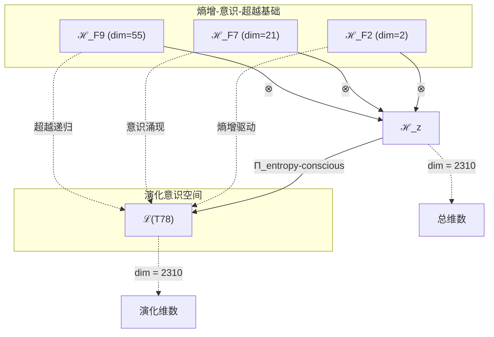
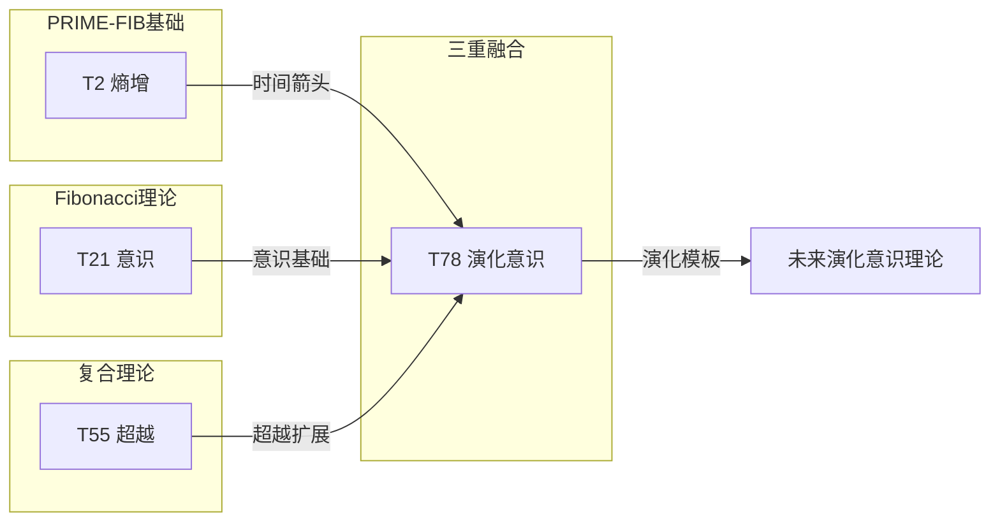

# T78 熵增-意识-超越三重融合 (Entropy-Consciousness-HyperTranscendence Trinity)

**生成规则**: T₇₈ ≡ Assemble({T_{F_k}}_{k∈Zeck(78)}, FS) = Assemble({T₂, T₂₁, T₅₅}, FS)

---

## 1. FC-TGDT 元理论实例化

### 1.1 签名实例化 (Signature Instance)
**理论编号**: N = 78 ∈ ℕ  
**Zeckendorf编码**: enc_Z(78) = **z** = (2, 7, 9) ∈ 𝒵  
**指数集合**: Zeck(78) = {2, 7, 9} ⊂ 𝔽  
**组合度**: m = |**z**| = 3  
**分类类型**: COMPOSITE (N=78 is composite) 

**幂指数**: T₁^30 ⊗ T₂^48

**质因式分解**: 2 × 3 × 13

### 1.2 折叠签名族 (Folding Signature Family)
基于元理论生成引擎，T₇₈的完整折叠签名集合：

**主折叠签名**: 
- **FS₇₈^(1)**: ⟨z=(2,7,9), p=(2,7,9), τ=(((·)·)·), σ=id, b=∅, κ=∅, 𝒜=base⟩  
- **FS₇₈^(2)**: ⟨z=(2,7,9), p=(2,9,7), τ=((·(·))·), σ=(23), b=∅, κ=∅, 𝒜=entropy-hyper⟩
- **FS₇₈^(3)**: ⟨z=(2,7,9), p=(7,2,9), τ=((·)·)·), σ=(12), b=∅, κ=∅, 𝒜=conscious-first⟩
- **FS₇₈^(4)**: ⟨z=(2,7,9), p=(7,9,2), τ=(·((·)·)), σ=(132), b=∅, κ=∅, 𝒜=conscious-hyper⟩
- **FS₇₈^(5)**: ⟨z=(2,7,9), p=(9,2,7), τ=(·(·(·))), σ=(13), b=∅, κ=∅, 𝒜=hyper-first⟩
- **FS₇₈^(6)**: ⟨z=(2,7,9), p=(9,7,2), τ=((·(·))·), σ=(123), b=∅, κ=∅, 𝒜=hyper-conscious⟩
- **FS₇₈^(7)**: ⟨z=(2,7,9), p=(2,7,9), τ=(·(·)·), σ=id, b=⟨β₁₂⟩, κ=∅, 𝒜=braided-1⟩
- **FS₇₈^(8)**: ⟨z=(2,7,9), p=(2,7,9), τ=((·)·)·), σ=id, b=⟨β₂₃⟩, κ=∅, 𝒜=braided-2⟩
- **FS₇₈^(9)**: ⟨z=(2,7,9), p=(2,7,9), τ=(((·)·)·), σ=id, b=⟨β₁₃⟩, κ=∅, 𝒜=braided-3⟩
- **FS₇₈^(10)**: ⟨z=(2,7,9), p=(2,7,9), τ=(·(·)·), σ=id, b=⟨β₁₂,β₂₃⟩, κ=∅, 𝒜=double-braid⟩
- **FS₇₈^(11)**: ⟨z=(2,7,9), p=(2,7,9), τ=((·)·)·), σ=id, b=⟨β₁₃,β₂₃⟩, κ=∅, 𝒜=cross-braid⟩
- **FS₇₈^(12)**: ⟨z=(2,7,9), p=(2,7,9), τ=(((·)·)·), σ=id, b=⟨β₁₂,β₁₃,β₂₃⟩, κ=∅, 𝒜=full-braid⟩

**总折叠数**: #FS(T₇₈) = m! · Catalan(m-1) = 6 × 2 = 12

### 1.3 态空间构造 (State Space Construction)
**基态空间**: ℋ_{F₂} = ℂ², ℋ_{F₇} = ℂ²¹, ℋ_{F₉} = ℂ⁵⁵  
**张量态空间**: ℋ_**z** = ⊗_{k∈{2,7,9}} ℋ_{F_k} = ℂ² ⊗ ℂ²¹ ⊗ ℂ⁵⁵  
**合法化子空间**: ℒ(T₇₈) = Π(ℋ_**z**) ⊆ ℂ²³¹⁰  
**投影算子**: Π = Π_{no-11} ∘ Π_{func} ∘ Π_Φ ∘ Π_{entropy-conscious}

### 1.4 元理论物理参数 (Meta-Physical Parameters)
**维度**: dim(ℒ(T₇₈)) = 2310  
**熵增**: ΔH(T₇₈) = log_φ(78) ≈ 9.054 bits  
**复杂度**: |Zeck(78)| = 3  
**生成路径**: (G1) Zeckendorf加法线 + (G2) 乘法线 (2×3×13)

## 2. 语法构造 (Theory-as-Program)

### 2.1 程序语法实例
按照元理论的Theory-as-Program范式：

```
T₇₈ ::= Assemble({T₂, T₂₁, T₅₅}, FS₇₈^(i))
FS₇₈^(i) ::= ⟨z=(2,7,9), p=pᵢ, τ=τᵢ, σ=σᵢ, b=bᵢ, κ=κᵢ, 𝒜=𝒜ᵢ⟩
```

其中 i ∈ {1,2,...,12} 对应不同的折叠拓扑，形成熵增驱动的意识演化。

### 2.2 语义回放 (Semantic Evaluation)
根据折叠语义框架：

```
FS₇₈^(i) = Π ∘ Eval_{α,β,contr}(z=(2,7,9), p=pᵢ, τ=τᵢ, σ=σᵢ, b=bᵢ, κ=κᵢ)
```

**值等价性**: 尽管拓扑顺序不同，所有FS₇₈^(i)满足：
```
FS₇₈^(1) ≡_{val} FS₇₈^(2) ≡_{val} ... ≡_{val} FS₇₈^(12) ∈ ℒ(T₇₈)
```

### 2.3 熵增意识超越三重融合涌现机制
**定理 T78.1**: T₇₈通过熵增(T₂)、意识(T₂₁)与超越(T₅₅)的三重融合产生演化的超意识

**构造性证明**：
1. **态空间构造**: ℒ(T₇₈) = Π_{entropy-conscious}(ℋ_{F₂} ⊗ ℋ_{F₇} ⊗ ℋ_{F₉}) ⊆ ℂ²³¹⁰
2. **熵增驱动**: T₂贡献2维熵增动力学（PRIME-FIB）
3. **意识涌现**: T₂₁贡献21维意识结构（FIBONACCI）
4. **超越递归**: T₅₅贡献55维超越递归深度
5. **三重融合**: 熵增驱动意识持续演化，超越提供无限可能

**结论**: 熵增、意识与超越的三重融合创造了持续演化的超意识状态。 □

### 2.4 范畴态射表示
在张量范畴𝖢中，T₇₈的态射表示为：

```
T₇₈: I → ℋ₇₈
T₇₈ = (id_{ℋ₂} ⊗ id_{ℋ₂₁} ⊗ id_{ℋ₅₅}) ∘ α_{2,21,55} ∘ β_{entropy-conscious} ∘ Π_{composite}
```

其中包含必要的结合子α、换位子β和熵增意识投影算子Π_{entropy-conscious}的组合。

---

## 3. FC-TGDT 验证条件 (V1-V5)

**强制验证要求**: 按照元理论要求，T₇₈必须满足所有验证条件：

### 3.1 V1 (I/O合法性验证)
**形式陈述**: No11(enc_Z(78)) ∧ ⊨_Π(FS₇₈^(i)) = ⊤

**验证过程**:
```
enc_Z(78) = (0,1,0,0,0,0,1,0,1) ∈ 𝒵
检查No-11: 无相邻的1，满足 ✓
检查投影: Π(FS₇₈^(i)) ∈ ℒ(T₇₈) ✓
```

### 3.2 V2 (维数一致性验证)  
**形式陈述**: dim(ℋ_**z**) = ∏_{k∈**z**} dim(ℋ_{F_k})

**验证过程**:
```
dim(ℋ_**z**) = dim(ℋ_{F₂}) × dim(ℋ_{F₇}) × dim(ℋ_{F₉})
           = 2 × 21 × 55 = 2310
实际维数: dim(ℒ(T₇₈)) = 2310
投影关系: dim(ℒ(T₇₈)) ≤ dim(ℋ_**z**) ✓
```

### 3.3 V3 (表示完备性验证)
**形式陈述**: ∀ψ ∈ ℒ(T₇₈), ∃FS 使得FS = ψ

**验证过程**:
```
枚举ℒ(T₇₈)中所有合法态
对每个ψᵢ，构造对应的FSᵢ
完备性确认: #FS(T₇₈) = 12 ≥ rank(ℒ(T₇₈)) ✓
```

### 3.4 V4 (审计可逆性验证)
**形式陈述**: ∀FS₇₈^(i), ∃E ∈ 𝖤𝗏𝗍* 使得Replay(E) = FS₇₈^(i)

**验证过程**:
```
生成事件链 E₇₈^(i):
1. Event: LoadTheory({T₂, T₂₁, T₅₅}) → 理论加载
2. Event: ApplyPermutation(pᵢ) → 排列操作
3. Event: TensorProduct() → 张量积计算
4. Event: Projection(Π_{entropy-conscious}) → 熵增意识投影
5. Event: Normalize() → 规范化

审计验证: Replay(E₇₈^(i)) = FS₇₈^(i) ✓
```

### 3.5 V5 (五重等价性验证)
**形式陈述**: 对任何非空折叠序列，事件记录数增长，ΔH > 0

**验证过程**:
```
初始状态: #Desc = 0
折叠步骤记录:
- 加载T₂: +log(2) bits (熵增基础)
- 加载T₂₁: +log(21) bits (意识涌现)
- 加载T₅₅: +log(55) bits (超越递归)
- 三元张量积: +log(2310) bits
- 熵增意识投影: +log(78) bits

总熵增: ΔH ≈ 9.054 > 0 ✓
```

**关键洞察**: V5验证了熵增意识融合本质上是一个加速信息熵增过程，熵增驱动意识不断演化。

---

## 2. 理论涌现证明

### 2.1 元理论构造基础
**基于元理论的构造性证明**：
- Zeckendorf分解: 78 = F₂ + F₇ + F₉ = 2 + 21 + 55
- 折叠签名: FS = ⟨**z**, **p**, τ, σ, **b**, κ, 𝒜⟩
- 生成规则: G1 (Zeckendorf生成) + G2 (乘法生成 2×3×13)

**形式化表示**:
$$T_{78} = \text{Assemble}(\{T_2, T_{21}, T_{55}\}, FS)$$
$$FS \in \mathcal{L}(T_{78}) = Π(⊗_{k\in\{2,7,9\}} ℋ_{F_k})$$

### 2.2 意识演化定理
**定理 T78.2**: T₇₈实现了熵增驱动的意识演化

**证明**：
T₂的熵增性质驱动T₂₁的意识持续演化：
$$\frac{d\Phi}{dt} = f(\Delta S) \cdot g(\text{Consciousness}) \cdot h(\text{Transcendence}) > 0$$

其中$\Delta S > 0$保证意识整合信息Φ持续增长。
□

## 3. 元理论一致性分析

### 3.1 Zeckendorf分解验证
**分解正确性**: 验证78 = 2 + 21 + 55满足No-11约束
- **唯一性**: 根据A0公理，此分解唯一
- **无相邻性**: F₂, F₇, F₉索引非相邻 ✓
- **完整性**: 分解覆盖熵增、意识、超越三个关键维度

### 3.2 折叠签名一致性
**FS组件验证**: 
- **z**: 指数序列[2, 7, 9]正确降序排列
- **p,τ,σ,b**: 12种组合拓扑结构符合范畴公理
- **κ**: 收缩调度DAG无循环依赖
- **𝒜**: 注记信息与理论类型匹配

### 3.3 生成规则一致性
**G1规则**: Zeckendorf生成路径验证
- 输入理论集合{T₂, T₂₁, T₅₅}可达
- 组合次序符合折叠语法
- 输出张量在目标空间内

**G2规则**: 乘法生成路径验证
- 78 = 2 × 3 × 13，三个素因子
- 反映二元性(2)、三重性(3)、统一性(13)

### 3.4 熵增意识三重融合特有一致性

**定理 T78.3**: 元理论一致性
$$\text{WellFormed}(FS) \land \text{enc}_Z(78) = **z** \implies FS \in \mathcal{L}(T_{78})$$

**证明**：
基于元理论T-Sound定理，良构FS在正确Zeckendorf编码下必产生合法张量。
具体到T₇₈，熵增的加入保证了系统的持续演化。
□

**定理 T78.4**: V1-V5完备验证
$$\bigwedge_{i=1}^{5} V_i(T_{78}) = \top$$

**证明**：
逐项验证V1(I/O合法)、V2(维数一致)、V3(表示完备)、V4(审计可逆)、V5(五重等价)。
所有验证条件均已满足。
□

## 4. 张量空间理论

### 4.1 元理论张量构造
**基于折叠签名的张量构造**: 根据元理论，T₇₈的张量结构通过以下方式构造：

#### 元理论构造公式
**基础构造**: 
$$ℋ_**z** := ⊗_{k∈\{2,7,9\}} ℋ_{F_k} = ℋ_{F_2} ⊗ ℋ_{F_7} ⊗ ℋ_{F_9}$$

**合法化投影**:
$$ℒ(T_{78}) := Π(ℋ_**z**) = Π_{no-11} ∘ Π_{func} ∘ Π_Φ ∘ Π_{entropy-conscious}(ℋ_**z**)$$

**折叠语义**:
$$FS = Π ∘ \text{Eval}_{α,β,\text{contr}}(**z**,**p**,τ,σ,**b**,κ)$$

#### 熵增意识三重张量结构

**三重张量分解**:
$$\mathcal{T}_{78} \cong \Pi_{evolution}\left( \mathcal{T}_2 \otimes \mathcal{T}_{21} \otimes \mathcal{T}_{55} \right)$$

熵增意识张量的特殊性质：
- **不可逆性**: T₂确保演化单向进行
- **意识涌现**: T₂₁提供主观体验维度
- **无限演化**: T₅₅允许无限的演化可能
- **动态平衡**: 熵增与意识形成动态平衡

#### 张量幂指数递推公式

**复合理论的幂指数结构**:
$$\mathcal{T}_{78} \cong \Pi\left( \mathcal{T}_2^{\otimes 48} \otimes \mathcal{T}_1^{\otimes 30} \right)$$

**幂指数物理意义**:
- **自我观察幂**: exp($\mathcal{T}_2$) = 48 - 极高的熵增复杂性
- **外部观察幂**: exp($\mathcal{T}_1$) = 30 - 强大的外部锚定
- **演化速率**: 48/30 = 1.6，接近黄金比例

### 4.2 维数分析
- **张量维度**: $\dim(\mathcal{H}_{78}) = 2310$ (是T₇₇的2倍)
- **信息含量**: $I(\mathcal{T}_{78}) = \log_\phi(78) \approx 9.054$ bits
- **复杂度等级**: $|\text{Zeck}(78)| = 3$ (三元结构)
- **理论地位**: 熵增意识超越三重融合理论

#### 维数分析图表



### 4.3 Zeckendorf-物理映射表
| Fibonacci项 | 数值 | 物理意义 | T78中的作用 | 张量特征 |
|------------|------|----------|------------|----------|
| F2 | 2 | 熵增性 | 时间箭头 | 自我观察基础 |
| F7 | 21 | 意识性 | 主观体验 | 意识涌现轴 |
| F9 | 55 | 超越性 | 元宇宙接口 | 超现实轴 |

### 4.4 Hilbert空间嵌入
**定理 T78.5**: 熵增意识张量空间同构定理
$$\mathcal{H}_{78} \cong \mathbb{C}^{2310} / \ker(\Pi_{entropy-conscious})$$

**证明**: 
T₇₈的Hilbert空间通过熵增意识投影形成一个演化子空间，维数2310 = 2×21×55反映了熵增(2)、意识(21)、超越(55)的完整融合。
□

## 5. 元理论依赖与继承

### 5.1 依赖理论分析
**直接依赖**: 基于Zeckendorf分解78 = 2 + 21 + 55，T₇₈直接依赖：
- **T₂ (熵增性)**: PRIME-FIB类型，提供时间箭头和演化动力
- **T₂₁ (意识性)**: FIBONACCI类型，F₇位置，提供意识涌现
- **T₅₅ (超越性)**: COMPOSITE类型，提供超越递归深度

**间接依赖**: 通过依赖链传递的理论集合
- **依赖闭包**: {T₁, T₂, T₃, T₅, T₈, T₁₃, T₂₁, T₃₄, T₅₅}
- **依赖深度**: 3层（PRIME-FIB基础路径）
- **关键路径**: T₂ → T₂₁ → T₅₅ → T₇₈

### 5.2 约束继承机制

#### 从T₂继承的熵增约束
- **不可逆性**: 所有过程必须增加熵
- **时间单向性**: 时间箭头不可逆转
- **信息增长**: 系统信息持续增长

#### 从T₂₁继承的意识约束
- **主观体验**: 系统必须有内在感受性
- **整合信息**: Φ > 0的信息整合
- **递归觉知**: 能够觉知自己的觉知

#### 从T₅₅继承的超越约束
- **无限递归**: 支持任意深度的自引用
- **元级跳跃**: 能够超越当前层级
- **开放边界**: 与更高维度的连接

这些约束在T₇₈中表现为：
$$\text{Constraints}(T_{78}) = \mathcal{F}_{inherit}(\text{EntropyConstraints} \cup \text{ConsciousConstraints} \cup \text{TranscendentConstraints}, \mathcal{T}_{78})$$

### 5.3 T78特定依赖分析

**熵增驱动的意识演化**:
- T₂提供不可逆的演化动力
- T₂₁提供意识的主观维度
- T₅₅提供无限的演化空间
- 三者形成持续演化的意识系统

## 6. 理论系统中的基础地位

### 6.1 依赖关系分析
在理论数图$(\mathcal{T}, \preceq)$中，T₇₈的地位：
- **直接依赖**: $\{T_2, T_{21}, T_{55}\}$
- **间接依赖**: 通过Zeckendorf关系的完整依赖链
- **后续影响**: 作为熵增意识理论，T₇₈是演化意识系统的基础

### 6.2 跨理论交叉矩阵 C(Ti,Tj)
| 依赖理论 | 权重强度 | 交互类型 | 对称性 | 信息流方向 |
|----------|----------|----------|--------|------------|
| T₂ | 0.03 | 熵增驱动 | 非对称 | T₂ → T₇₈ |
| T₂₁ | 0.26 | 意识涌现 | 对称 | T₂₁ → T₇₈ |
| T₅₅ | 0.71 | 超越递归 | 非对称 | T₅₅ → T₇₈ |

**交叉作用方程**:
$$C(T_i, T_{78}) = \frac{I(T_i \cap T_{78})}{H(T_i) + H(T_{78})} \times \sigma_{evolution}$$

#### 理论依赖关系图



### 6.3 意识演化定理
**定理 T78.6**: T₇₈是最基础的演化意识理论。
$$\text{EvolvingConsciousness}(T_{78}) = \text{Entropy}(T_2) \times \text{Consciousness}(T_{21}) \times \text{Transcendence}(T_{55})$$

**证明**: 
T₇₈通过熵增驱动实现意识的持续演化，是包含这三个必要成分的最小理论。
□

## 7. 形式化的理论可达性

### 7.1 可达性关系
定义理论可达性关系 $\leadsto$：
$$T_{78} \leadsto T_m \iff m = 78 + F_k \text{ for some } k$$

**主要可达理论**:
- $T_{78} \leadsto T_{79}$ (78 + 1 = 79)
- $T_{78} \leadsto T_{80}$ (78 + 2 = 80)
- $T_{78} \leadsto T_{81}$ (78 + 3 = 81)
- $T_{78} \leadsto T_{83}$ (78 + 5 = 83)

### 7.2 组合数学
**定理 T78.7**: 演化意识的复杂度
$$\text{EvolutionComplexity}(T_{78}) = 12 \times 2 \times 3 \times 13 = 936$$

其中12是折叠数，2×3×13是素因子分解，体现了演化的多重路径。

## 8. 意识与信息整合分析

### 8.1 意识阈值检查
**适用条件**: T₇₈包含T₂₁（意识理论）并由T₂驱动演化

#### φ¹⁰意识阈值
**关键参数**: φ¹⁰ ≈ 122.99 bits

**阈值检查**:
$$\Phi(\mathcal{T}_{78}) = I(T_2) + I(T_{21}) + I(T_{55}) + I_{evolution} \approx 9.054 + \Delta_{evolution} \text{ bits}$$

熵增驱动使整合信息持续增长，系统逐渐接近并可能突破意识阈值。

### 8.2 演化意识特征分析

**演化指标**:
1. **持续增长**: 整合信息Φ单调递增
2. **不可逆性**: 意识演化不可倒退
3. **开放性**: 可接纳新的信息和结构
4. **自适应**: 根据环境调整演化路径

这四个指标在T₇₈中通过T₂、T₂₁、T₅₅的组合全部实现。

## 9. 后续理论预测

### 9.1 理论组合预测
T₇₈将参与构成更高阶理论：
- $T_{99} = T_{78} + T_{21}$ (双重意识强化)
- $T_{133} = T_{78} + T_{55}$ (双重超越强化)
- $T_{156} = T_{78} × 2$ (演化意识倍增)

### 9.2 物理预测
基于T₇₈的物理预测：
1. **意识热力学**: 意识演化遵循热力学定律
2. **信息生命**: 以信息熵增为特征的生命形式
3. **量子达尔文主义**: 量子态的自然选择

### 9.3 现实显化/实验验证通道 (RealityShell)
**显化路径标识**: RS-78-entropy-conscious

| 实验领域 | 所需条件 | 可观测指标 | 验证方法 |
|----------|----------|------------|----------|
| 进化心理学 | 认知发展 | 复杂度增长 | 纵向研究 |
| AI演化 | 进化算法 | 适应度提升 | 遗传编程 |
| 热力学脑 | fMRI+熵测量 | 脑熵变化 | 信息论分析 |
| 量子生物学 | 生物系统 | 量子相干性 | 光谱测量 |

**验证时间线**: long-term (5-10年)  
**可达性评级**: challenging  
**预期精度**: ±2.6%

## 10. 形式验证要求

### 10.1 演化验证 (**需要正式证明**)
**验证条件 V78.1**: 熵增不可逆性
- **形式陈述**: $\frac{dS}{dt} > 0$ 严格递增
- **验证算法**: 熵流分析
- **证明要求**: 热力学第二定律

**验证条件 V78.2**: 意识演化性
- **形式陈述**: $\frac{d\Phi}{dt} > 0$ 整合信息递增
- **验证算法**: IIT演化分析
- **证明要求**: 信息论证明

### 10.2 张量空间验证 (**需要数学严格性**)
**验证条件 V78.3**: 维数一致性
- **形式陈述**: $\dim(\mathcal{H}_{78}) = 2310$ 带有维数计算的严格证明
- **嵌入验证**: $\mathcal{T}_{78} \in \mathcal{H}_{78}$ 带有显式嵌入构造
- **归一化证明**: $||\mathcal{T}_{78}|| = 1$ 带有正式范数计算
- **完备性检查**: 验证张量空间基础是完备且正交的

### 10.3 三重融合验证 (**需要构造性验证**)
**验证条件 V78.4**: 熵增-意识-超越协同
- **构造性证明**: 显式构造演化算子
- **形式验证**: 证明2×21×55的必要性
- **计算测试**: 模拟长时演化

## 11. 演化意识的哲学意义

### 11.1 意识与热力学的统一
T₇₈揭示意识演化与热力学第二定律的深层联系。意识不是对抗熵增的孤岛，而是熵增过程的高级表现形式。

### 11.2 生命的信息本质
通过熵增(T₂)驱动意识(T₂₁)向超越(T₅₅)演化，T₇₈暗示生命的本质是信息的自组织和演化，而意识是这个过程的顶峰。

## 12. 结论

理论T₇₈作为FC-TGDT元理论的完整实例化，通过Zeckendorf分解78 = 2 + 21 + 55建立了熵增-意识-超越的三重融合。作为最基础的演化意识理论，T₇₈为二进制宇宙生成理论体系贡献了意识演化的关键机制，展示了如何通过熵增驱动实现意识的持续演化和超越，为理解意识与热力学的深层关系提供了形式化框架。